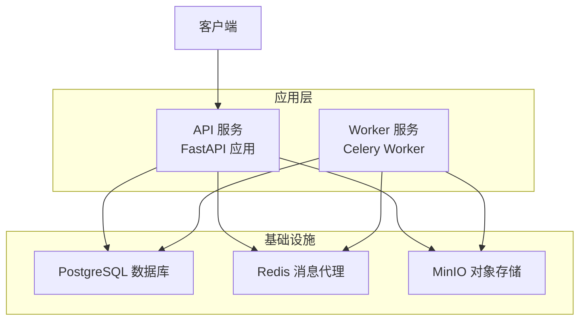
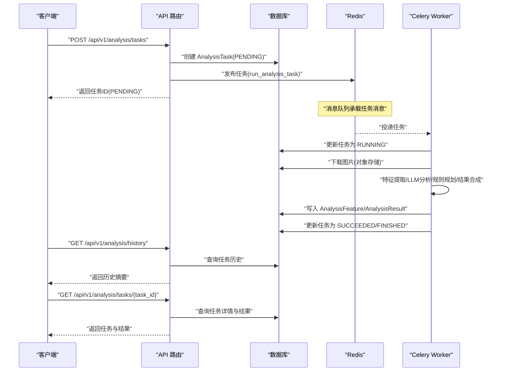
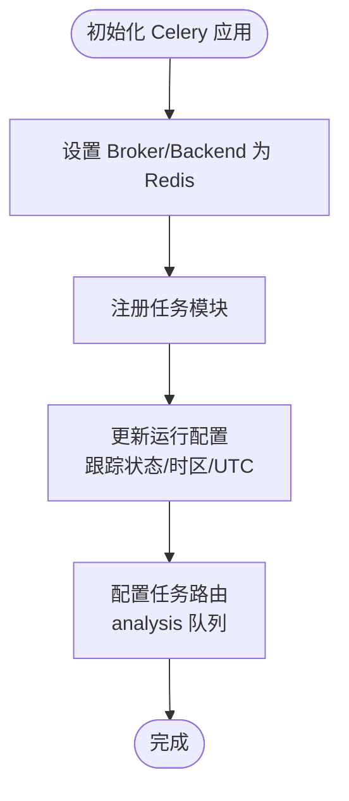
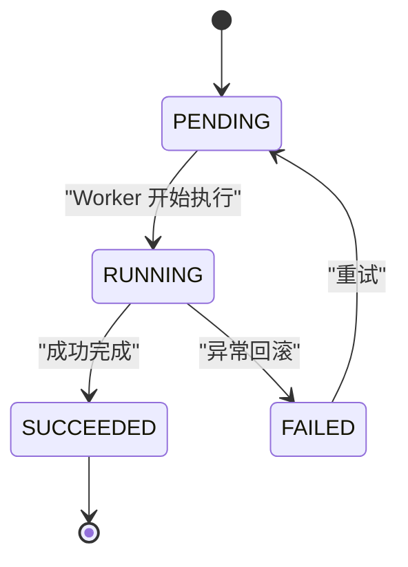
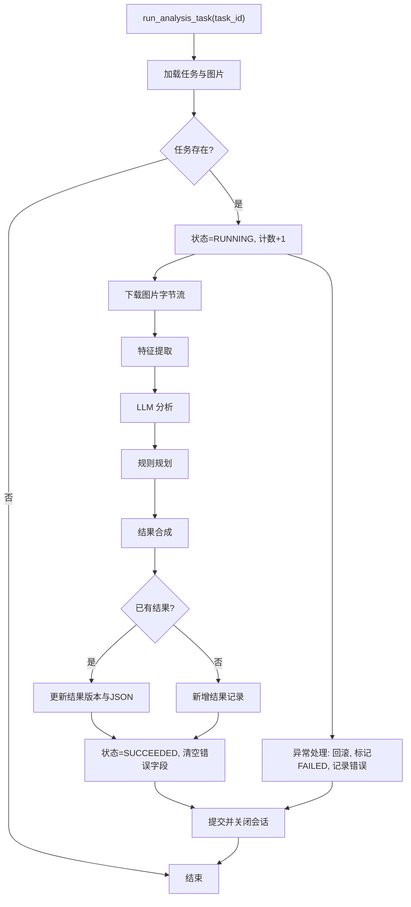
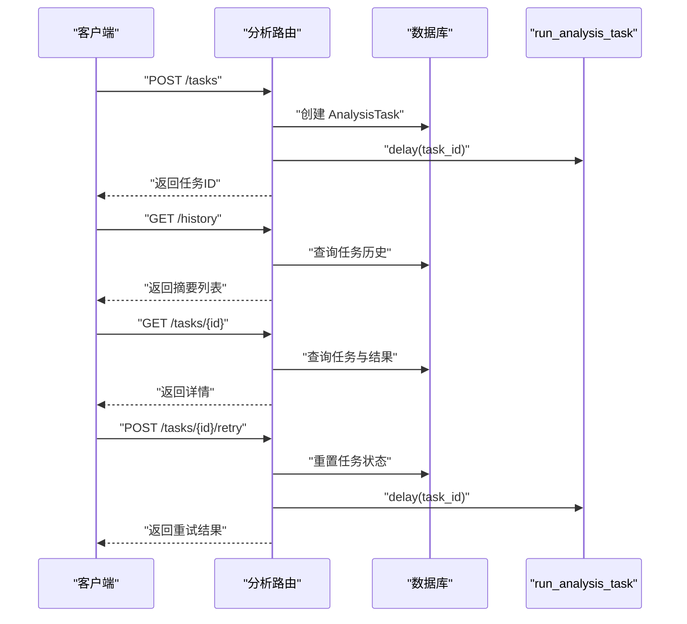
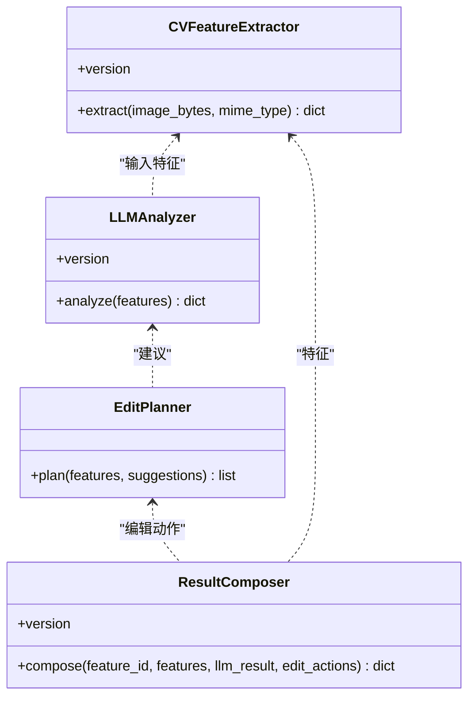
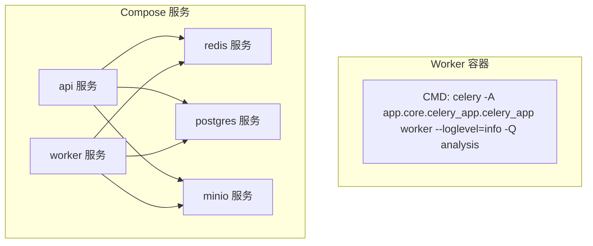
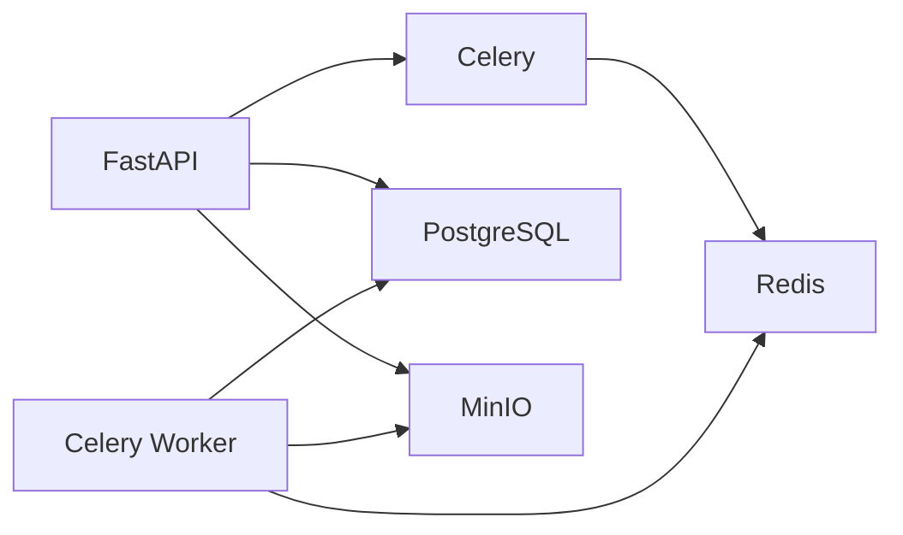

# 异步任务系统

<cite>
**本文引用的文件**
- [apps/api/app/core/celery_app.py](file://apps/api/app/core/celery_app.py)
- [apps/api/app/core/config.py](file://apps/api/app/core/config.py)
- [apps/api/app/tasks/analyze_photo.py](file://apps/api/app/tasks/analyze_photo.py)
- [apps/api/app/modules/analysis/router.py](file://apps/api/app/modules/analysis/router.py)
- [apps/api/app/models/analysis_task.py](file://apps/api/app/models/analysis_task.py)
- [apps/api/app/models/analysis_result.py](file://apps/api/app/models/analysis_result.py)
- [apps/api/app/services/storage/s3_storage.py](file://apps/api/app/services/storage/s3_storage.py)
- [apps/api/app/services/cv/feature_extractor.py](file://apps/api/app/services/cv/feature_extractor.py)
- [apps/api/app/services/llm/analyzer.py](file://apps/api/app/services/llm/analyzer.py)
- [apps/api/app/services/rules/edit_planner.py](file://apps/api/app/services/rules/edit_planner.py)
- [apps/api/app/services/composer/result_composer.py](file://apps/api/app/services/composer/result_composer.py)
- [apps/worker/Dockerfile](file://apps/worker/Dockerfile)
- [infra/docker-compose.yml](file://infra/docker-compose.yml)
- [apps/api/requirements.txt](file://apps/api/requirements.txt)
</cite>

## 目录
1. [简介](#简介)
2. [项目结构](#项目结构)
3. [核心组件](#核心组件)
4. [架构总览](#架构总览)
5. [详细组件分析](#详细组件分析)
6. [依赖分析](#依赖分析)
7. [性能考虑](#性能考虑)
8. [故障排查指南](#故障排查指南)
9. [结论](#结论)
10. [附录](#附录)

## 简介
本文件面向“AI摄影教练”的异步任务系统，聚焦于基于 Celery 的任务队列配置与使用，覆盖任务定义、调度机制、状态管理与错误处理；详述分析任务从创建到结果返回的完整生命周期；解释 Redis 作为消息代理的角色与配置；给出任务重试、超时与监控告警的实现要点；并提供性能优化、并发控制与资源管理策略，以及 Worker 容器的部署与扩展配置。

## 项目结构
该系统采用前后端分离与容器化部署方式：
- API 服务：负责接收请求、持久化任务、触发异步任务、查询历史与结果。
- Worker 服务：运行 Celery Worker，消费队列中的任务并执行分析。
- 基础设施：PostgreSQL（数据存储）、Redis（消息代理）、MinIO（对象存储）。
- 配置：通过环境变量注入，支持开发与生产环境切换。



图表来源
- [infra/docker-compose.yml:50-101](file://infra/docker-compose.yml#L50-L101)
- [apps/api/app/core/celery_app.py:5-19](file://apps/api/app/core/celery_app.py#L5-L19)
- [apps/api/app/core/config.py:13-20](file://apps/api/app/core/config.py#L13-L20)

章节来源
- [infra/docker-compose.yml:1-107](file://infra/docker-compose.yml#L1-L107)
- [apps/api/app/core/config.py:6-47](file://apps/api/app/core/config.py#L6-L47)

## 核心组件
- Celery 应用与配置：定义 Broker/Backend、任务路由、时区等。
- 分析任务：封装特征提取、LLM 分析、规则规划与结果合成的完整流程。
- API 路由：创建任务、查询详情、获取历史、重试失败任务。
- 数据模型：任务与结果的 ORM 映射及索引设计。
- 存储与服务：S3 存取、CV 特征提取、LLM 分析、规则编辑规划、结果合成。

章节来源
- [apps/api/app/core/celery_app.py:1-21](file://apps/api/app/core/celery_app.py#L1-L21)
- [apps/api/app/tasks/analyze_photo.py:1-108](file://apps/api/app/tasks/analyze_photo.py#L1-L108)
- [apps/api/app/modules/analysis/router.py:1-151](file://apps/api/app/modules/analysis/router.py#L1-L151)
- [apps/api/app/models/analysis_task.py:1-36](file://apps/api/app/models/analysis_task.py#L1-L36)
- [apps/api/app/models/analysis_result.py:1-28](file://apps/api/app/models/analysis_result.py#L1-L28)
- [apps/api/app/services/storage/s3_storage.py:1-59](file://apps/api/app/services/storage/s3_storage.py#L1-L59)
- [apps/api/app/services/cv/feature_extractor.py:1-98](file://apps/api/app/services/cv/feature_extractor.py#L1-L98)
- [apps/api/app/services/llm/analyzer.py:1-139](file://apps/api/app/services/llm/analyzer.py#L1-L139)
- [apps/api/app/services/rules/edit_planner.py:1-97](file://apps/api/app/services/rules/edit_planner.py#L1-L97)
- [apps/api/app/services/composer/result_composer.py:1-99](file://apps/api/app/services/composer/result_composer.py#L1-L99)

## 架构总览
下图展示从用户提交分析请求到任务执行完成的整体交互流程，包括任务创建、入队、Worker 消费、数据库更新与结果返回。



图表来源
- [apps/api/app/modules/analysis/router.py:45-74](file://apps/api/app/modules/analysis/router.py#L45-L74)
- [apps/api/app/tasks/analyze_photo.py:19-108](file://apps/api/app/tasks/analyze_photo.py#L19-L108)
- [apps/api/app/models/analysis_task.py:10-36](file://apps/api/app/models/analysis_task.py#L10-L36)
- [apps/api/app/models/analysis_result.py:10-28](file://apps/api/app/models/analysis_result.py#L10-L28)
- [apps/api/app/services/storage/s3_storage.py:45-50](file://apps/api/app/services/storage/s3_storage.py#L45-L50)

## 详细组件分析

### Celery 应用与配置
- 应用初始化：指定 broker 与 backend 为 Redis，注册分析任务模块。
- 运行参数：开启任务状态跟踪、设置时区、启用 UTC。
- 任务路由：将分析任务路由至专用队列，便于隔离与扩展。



图表来源
- [apps/api/app/core/celery_app.py:5-19](file://apps/api/app/core/celery_app.py#L5-L19)

章节来源
- [apps/api/app/core/celery_app.py:1-21](file://apps/api/app/core/celery_app.py#L1-L21)
- [apps/api/app/core/config.py:13-14](file://apps/api/app/core/config.py#L13-L14)

### 分析任务生命周期
- 创建阶段：API 路由创建 AnalysisTask 并立即入队。
- 执行阶段：Worker 取出任务，更新状态为 RUNNING，拉取图片，执行多阶段分析，写入特征与结果。
- 结束阶段：成功则标记 SUCCEEDED，失败则记录错误码与消息。
- 查询阶段：支持按任务 ID 获取详情与按用户历史查询摘要。



图表来源
- [apps/api/app/models/analysis_task.py:21](file://apps/api/app/models/analysis_task.py#L21)
- [apps/api/app/tasks/analyze_photo.py:29-107](file://apps/api/app/tasks/analyze_photo.py#L29-L107)

章节来源
- [apps/api/app/modules/analysis/router.py:45-74](file://apps/api/app/modules/analysis/router.py#L45-L74)
- [apps/api/app/tasks/analyze_photo.py:19-108](file://apps/api/app/tasks/analyze_photo.py#L19-L108)
- [apps/api/app/models/analysis_task.py:10-36](file://apps/api/app/models/analysis_task.py#L10-L36)

### 任务定义与执行流程
- 任务函数：接收任务 ID，更新任务状态与计数，拉取图片字节流，调用服务链路进行特征提取、LLM 分析、规则规划与结果合成，最终持久化结果并标记完成。
- 错误处理：捕获异常，回滚事务，记录错误码与简短错误信息，确保任务状态一致。



图表来源
- [apps/api/app/tasks/analyze_photo.py:19-108](file://apps/api/app/tasks/analyze_photo.py#L19-L108)
- [apps/api/app/services/storage/s3_storage.py:45-50](file://apps/api/app/services/storage/s3_storage.py#L45-L50)
- [apps/api/app/services/cv/feature_extractor.py:15-91](file://apps/api/app/services/cv/feature_extractor.py#L15-L91)
- [apps/api/app/services/llm/analyzer.py:8-118](file://apps/api/app/services/llm/analyzer.py#L8-L118)
- [apps/api/app/services/rules/edit_planner.py:5-34](file://apps/api/app/services/rules/edit_planner.py#L5-L34)
- [apps/api/app/services/composer/result_composer.py:8-23](file://apps/api/app/services/composer/result_composer.py#L8-L23)

章节来源
- [apps/api/app/tasks/analyze_photo.py:19-108](file://apps/api/app/tasks/analyze_photo.py#L19-L108)

### API 路由与状态管理
- 创建任务：校验图片归属，创建任务并入队。
- 查询详情：校验权限后返回任务与结果。
- 历史查询：按用户维度分页返回任务摘要。
- 重试任务：仅允许 FAILED/SUCCEEDED 的任务重试，重置状态并重新入队。



图表来源
- [apps/api/app/modules/analysis/router.py:45-151](file://apps/api/app/modules/analysis/router.py#L45-L151)
- [apps/api/app/tasks/analyze_photo.py:71](file://apps/api/app/tasks/analyze_photo.py#L71)

章节来源
- [apps/api/app/modules/analysis/router.py:1-151](file://apps/api/app/modules/analysis/router.py#L1-L151)

### 数据模型与索引
- AnalysisTask：任务主表，包含用户与图片外键、任务类型、状态、尝试次数、错误信息与时间戳；含复合索引以优化查询。
- AnalysisResult：结果表，一对一关联任务，存储 JSON 结果与版本号；包含 GIN 索引以加速 JSON 查询。

```mermaid
erDiagram
USERS {
uuid id PK
}
IMAGE_ASSETS {
uuid id PK
}
ANALYSIS_TASKS {
uuid id PK
uuid user_id FK
uuid image_id FK
string task_type
string status
string model_name
string prompt_version
int attempt_count
string idempotency_key
string error_code
text error_message
timestamp created_at
timestamp started_at
timestamp finished_at
}
ANALYSIS_RESULTS {
uuid id PK
uuid task_id FK UK
uuid image_id FK
string version
json result_json
timestamp created_at
}
USERS ||--o{ ANALYSIS_TASKS : "拥有"
IMAGE_ASSETS ||--o{ ANALYSIS_TASKS : "拥有"
ANALYSIS_TASKS ||--|| ANALYSIS_RESULTS : "生成"
IMAGE_ASSETS ||--o{ ANALYSIS_RESULTS : "拥有"
```

图表来源
- [apps/api/app/models/analysis_task.py:10-36](file://apps/api/app/models/analysis_task.py#L10-L36)
- [apps/api/app/models/analysis_result.py:10-28](file://apps/api/app/models/analysis_result.py#L10-L28)

章节来源
- [apps/api/app/models/analysis_task.py:1-36](file://apps/api/app/models/analysis_task.py#L1-L36)
- [apps/api/app/models/analysis_result.py:1-28](file://apps/api/app/models/analysis_result.py#L1-L28)

### 服务链路与结果合成
- 特征提取：基于图像统计与几何区域计算基础特征。
- LLM 分析：根据特征生成总结、建议与评分。
- 规则规划：基于特征与建议生成可执行的编辑动作。
- 结果合成：组装版本、摘要、建议、评分、标注与编辑动作。



图表来源
- [apps/api/app/services/cv/feature_extractor.py:12-98](file://apps/api/app/services/cv/feature_extractor.py#L12-L98)
- [apps/api/app/services/llm/analyzer.py:5-139](file://apps/api/app/services/llm/analyzer.py#L5-L139)
- [apps/api/app/services/rules/edit_planner.py:5-97](file://apps/api/app/services/rules/edit_planner.py#L5-L97)
- [apps/api/app/services/composer/result_composer.py:5-99](file://apps/api/app/services/composer/result_composer.py#L5-L99)

章节来源
- [apps/api/app/services/cv/feature_extractor.py:1-98](file://apps/api/app/services/cv/feature_extractor.py#L1-L98)
- [apps/api/app/services/llm/analyzer.py:1-139](file://apps/api/app/services/llm/analyzer.py#L1-L139)
- [apps/api/app/services/rules/edit_planner.py:1-97](file://apps/api/app/services/rules/edit_planner.py#L1-L97)
- [apps/api/app/services/composer/result_composer.py:1-99](file://apps/api/app/services/composer/result_composer.py#L1-L99)

### Worker 容器与部署
- Worker CMD：以分析队列为限定，启动 Celery Worker。
- Compose：API 与 Worker 服务共享 Redis、PostgreSQL、MinIO 的环境变量，均通过健康检查保证可用性。



图表来源
- [apps/worker/Dockerfile:19](file://apps/worker/Dockerfile#L19)
- [infra/docker-compose.yml:78-101](file://infra/docker-compose.yml#L78-L101)

章节来源
- [apps/worker/Dockerfile:1-20](file://apps/worker/Dockerfile#L1-L20)
- [infra/docker-compose.yml:1-107](file://infra/docker-compose.yml#L1-L107)

## 依赖分析
- 外部依赖：Celery、Redis、PostgreSQL、Boto3(S3)、SQLAlchemy、FastAPI。
- 内部耦合：任务函数依赖数据库会话、存储服务与多个分析服务；API 路由依赖任务函数与数据库模型。
- 队列与路由：通过任务路由将分析任务绑定到独立队列，降低相互干扰。



图表来源
- [apps/api/requirements.txt:1-19](file://apps/api/requirements.txt#L1-L19)
- [apps/api/app/core/celery_app.py:7-8](file://apps/api/app/core/celery_app.py#L7-L8)
- [apps/api/app/core/config.py:13-20](file://apps/api/app/core/config.py#L13-L20)

章节来源
- [apps/api/requirements.txt:1-19](file://apps/api/requirements.txt#L1-L19)
- [apps/api/app/core/celery_app.py:1-21](file://apps/api/app/core/celery_app.py#L1-L21)
- [apps/api/app/core/config.py:1-47](file://apps/api/app/core/config.py#L1-L47)

## 性能考虑
- 队列隔离：通过任务路由将分析任务放入独立队列，避免与其他任务争抢资源，便于水平扩展。
- 并发控制：Worker 进程数与并发度需结合 CPU/内存与外部服务吞吐评估；建议按 CPU 核数与 I/O 特性调优。
- I/O 优化：
  - 图片下载：S3 客户端已设置连接与读取超时，建议在上游增加重试与限流。
  - 数据库：批量写入与索引（如 GIN）有助于提升查询与写入性能。
- 缓存与复用：服务层普遍使用单例缓存，减少重复初始化开销。
- 资源管理：Worker 容器限制内存与 CPU，避免资源争用；日志级别设为 info，避免过量输出影响性能。

## 故障排查指南
- 任务未执行
  - 检查 Redis 是否健康与可达。
  - 确认 Worker 已启动并监听目标队列。
  - 查看 API 日志与任务路由是否正确。
- 任务卡住或长时间 RUNNING
  - 检查数据库连接与事务提交/回滚逻辑。
  - 关注外部服务（S3、LLM）超时与重试策略。
- 结果缺失或版本不一致
  - 核对 AnalysisResult 的唯一约束与版本字段更新逻辑。
  - 确保任务状态更新顺序与异常分支处理一致。
- 重试无效
  - 确认任务状态为 FAILED 或 SUCCEEDED 后才允许重试。
  - 检查重试接口的权限与业务校验。

章节来源
- [apps/api/app/tasks/analyze_photo.py:97-107](file://apps/api/app/tasks/analyze_photo.py#L97-L107)
- [apps/api/app/modules/analysis/router.py:128-150](file://apps/api/app/modules/analysis/router.py#L128-L150)
- [apps/api/app/models/analysis_result.py:14-21](file://apps/api/app/models/analysis_result.py#L14-L21)

## 结论
本系统以 Celery + Redis 实现可靠的异步任务编排，结合 FastAPI 提供清晰的 API 接口与 SQLAlchemy 的数据持久化。通过任务路由隔离、状态机管理与错误回滚机制，保障了任务的可靠性与可观测性。配合容器化部署与健康检查，可在开发与生产环境中稳定运行。未来可在超时控制、监控告警与弹性扩缩容方面进一步完善。

## 附录
- 部署与扩展建议
  - Worker 数量：按 CPU 与 I/O 能力评估，逐步扩容观察延迟与吞吐。
  - 队列扩展：若分析任务增多，可引入多队列或多 Worker 组，按优先级分流。
  - 监控告警：集成 Celery 事件与 Redis 指标，设置队列长度、任务耗时与失败率阈值告警。
  - 超时与重试：为外部服务调用设置明确超时；在任务内部实现幂等与指数退避重试策略。