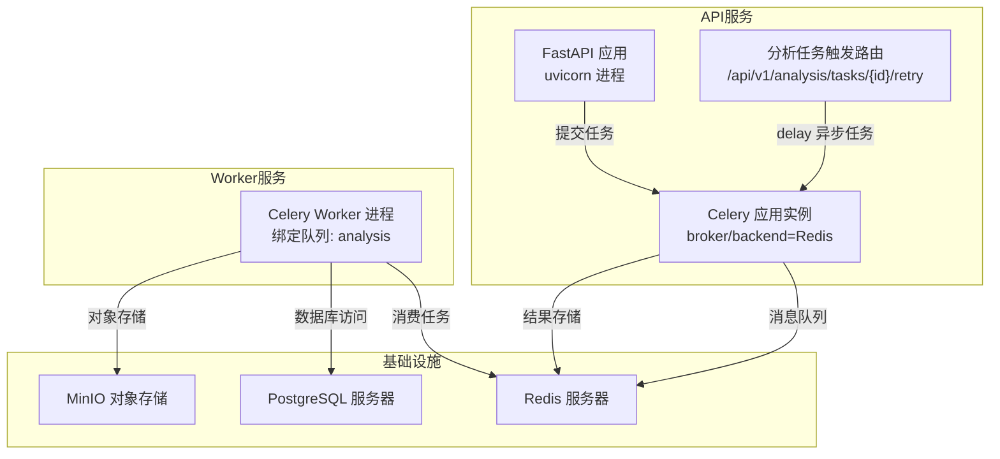
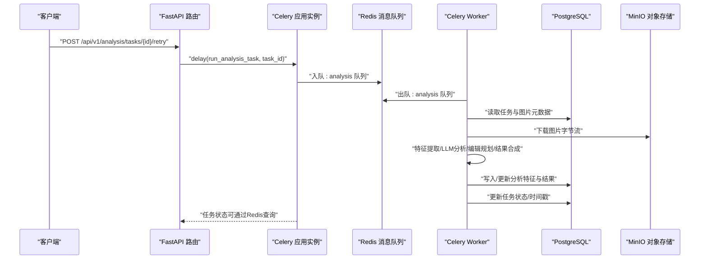
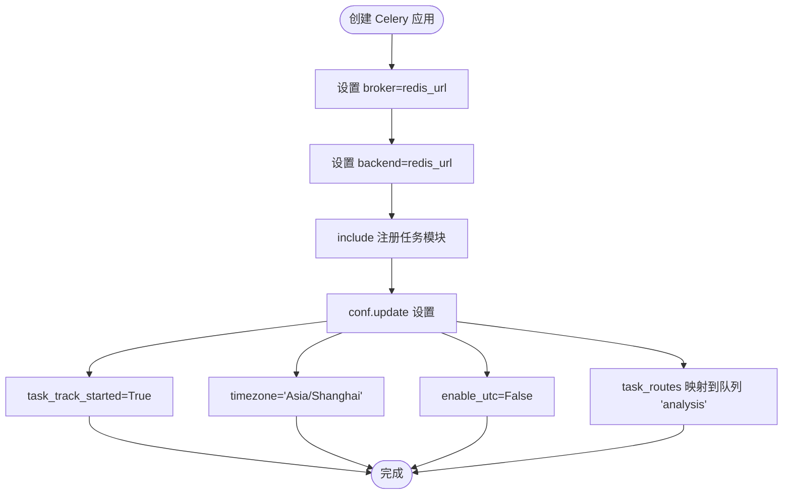
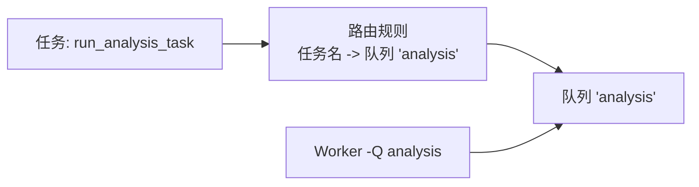
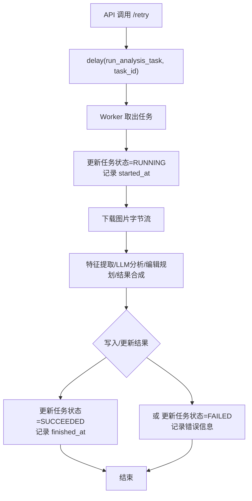
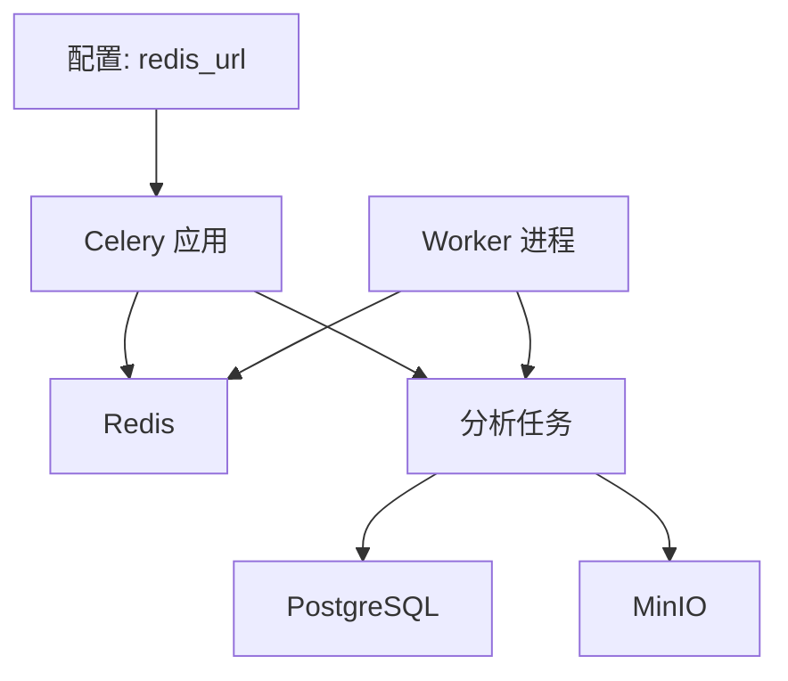

# Celery配置

<cite>
**本文引用的文件**
- [apps/api/app/core/celery_app.py](file://apps/api/app/core/celery_app.py)
- [apps/api/app/core/config.py](file://apps/api/app/core/config.py)
- [apps/api/app/tasks/analyze_photo.py](file://apps/api/app/tasks/analyze_photo.py)
- [apps/api/requirements.txt](file://apps/api/requirements.txt)
- [apps/api/Dockerfile](file://apps/api/Dockerfile)
- [apps/worker/Dockerfile](file://apps/worker/Dockerfile)
- [infra/docker-compose.yml](file://infra/docker-compose.yml)
- [infra/docker-compose.prod.yml](file://infra/docker-compose.prod.yml)
- [apps/api/app/modules/analysis/router.py](file://apps/api/app/modules/analysis/router.py)
- [apps/api/app/models/analysis_task.py](file://apps/api/app/models/analysis_task.py)
</cite>

## 目录
1. [简介](#简介)
2. [项目结构](#项目结构)
3. [核心组件](#核心组件)
4. [架构总览](#架构总览)
5. [详细组件分析](#详细组件分析)
6. [依赖分析](#依赖分析)
7. [性能考量](#性能考量)
8. [故障排查指南](#故障排查指南)
9. [结论](#结论)
10. [附录](#附录)

## 简介
本文件面向“AI摄影教练”项目中基于Celery的任务执行子系统，系统性梳理并解释以下关键点：
- Celery应用实例的创建过程与配置来源（broker与backend使用Redis）
- 任务路由配置与队列调度策略
- 时区与时钟相关配置（timezone与enable_utc）
- task_track_started参数的作用与影响
- 生产环境的部署与环境变量管理
- 安全与最佳实践、性能调优建议
- 常见配置问题与解决方案

## 项目结构
围绕Celery的关键文件与职责如下：
- 应用入口与配置
  - Celery应用实例与配置：apps/api/app/core/celery_app.py
  - 全局配置读取（含redis_url等）：apps/api/app/core/config.py
- 任务定义与执行
  - 分析任务实现：apps/api/app/tasks/analyze_photo.py
- 部署与运行
  - API服务容器：apps/api/Dockerfile
  - Worker容器：apps/worker/Dockerfile
  - 开发与生产编排：infra/docker-compose.yml、infra/docker-compose.prod.yml
- 依赖声明
  - Python依赖清单：apps/api/requirements.txt

图表来源
- [apps/api/app/core/celery_app.py:1-21](file://apps/api/app/core/celery_app.py#L1-L21)
- [apps/api/app/tasks/analyze_photo.py:19-108](file://apps/api/app/tasks/analyze_photo.py#L19-L108)
- [apps/api/app/modules/analysis/router.py:128-150](file://apps/api/app/modules/analysis/router.py#L128-L150)
- [apps/worker/Dockerfile:19](file://apps/worker/Dockerfile#L19)
- [infra/docker-compose.yml:19-30](file://infra/docker-compose.yml#L19-L30)

章节来源
- [apps/api/app/core/celery_app.py:1-21](file://apps/api/app/core/celery_app.py#L1-L21)
- [apps/api/app/core/config.py:13-14](file://apps/api/app/core/config.py#L13-L14)
- [apps/api/app/tasks/analyze_photo.py:19-108](file://apps/api/app/tasks/analyze_photo.py#L19-L108)
- [apps/api/app/modules/analysis/router.py:128-150](file://apps/api/app/modules/analysis/router.py#L128-L150)
- [apps/worker/Dockerfile:19](file://apps/worker/Dockerfile#L19)
- [infra/docker-compose.yml:19-30](file://infra/docker-compose.yml#L19-L30)

## 核心组件
- Celery应用实例
  - 实例创建时指定broker与backend均为Redis地址，并include分析任务模块，确保任务注册可用。
  - 后续通过conf.update集中设置任务行为与路由。
- 配置来源
  - Redis连接字符串从全局配置settings.redis_url读取，支持通过环境变量覆盖。
- 任务路由
  - 将特定任务名映射到队列analysis，实现任务隔离与资源控制。
- 时区与时钟
  - 设置时区为“Asia/Shanghai”，禁用UTC（enable_utc=False），任务状态跟踪开启（task_track_started=True）。

章节来源
- [apps/api/app/core/celery_app.py:5-19](file://apps/api/app/core/celery_app.py#L5-L19)
- [apps/api/app/core/config.py:13-14](file://apps/api/app/core/config.py#L13-L14)
- [apps/api/app/tasks/analyze_photo.py:19](file://apps/api/app/tasks/analyze_photo.py#L19)

## 架构总览
下图展示从API触发到Worker执行再到结果回写的关键流程，以及Redis在其中作为消息中间件与结果存储的双重角色。

图表来源
- [apps/api/app/modules/analysis/router.py:128-150](file://apps/api/app/modules/analysis/router.py#L128-L150)
- [apps/api/app/core/celery_app.py:12-19](file://apps/api/app/core/celery_app.py#L12-L19)
- [apps/api/app/tasks/analyze_photo.py:19-108](file://apps/api/app/tasks/analyze_photo.py#L19-L108)
- [apps/worker/Dockerfile:19](file://apps/worker/Dockerfile#L19)

## 详细组件分析

### Celery应用实例与配置
- 实例创建
  - 使用settings.redis_url作为broker与backend，确保消息与结果共享同一Redis实例。
  - include注册分析任务模块，保证任务名称与函数映射正确。
- 配置项
  - task_track_started=True：启用任务启动跟踪，便于追踪任务生命周期状态。
  - timezone="Asia/Shanghai"：设定任务时区，影响任务日志与状态时间显示。
  - enable_utc=False：关闭UTC强制，避免与本地时区产生歧义。
  - task_routes：将任务名精确路由到队列analysis，实现任务隔离与并发控制。

图表来源
- [apps/api/app/core/celery_app.py:5-19](file://apps/api/app/core/celery_app.py#L5-L19)

章节来源
- [apps/api/app/core/celery_app.py:5-19](file://apps/api/app/core/celery_app.py#L5-L19)

### 任务路由与队列
- 路由规则
  - 任务名与队列analysis绑定，确保所有分析任务进入该队列。
- Worker绑定
  - Worker容器命令行显式指定-Q analysis，仅消费analysis队列，避免无关任务干扰。
- 生产编排
  - docker-compose中API与Worker均注入相同的REDIS_URL，保证两者连接一致的Redis实例。

图表来源
- [apps/api/app/core/celery_app.py:16-18](file://apps/api/app/core/celery_app.py#L16-L18)
- [apps/worker/Dockerfile:19](file://apps/worker/Dockerfile#L19)

章节来源
- [apps/api/app/core/celery_app.py:16-18](file://apps/api/app/core/celery_app.py#L16-L18)
- [apps/worker/Dockerfile:19](file://apps/worker/Dockerfile#L19)
- [infra/docker-compose.yml:57-67](file://infra/docker-compose.yml#L57-L67)

### 时区与时钟配置
- timezone="Asia/Shanghai"
  - 影响任务日志时间戳与状态字段的本地化显示。
- enable_utc=False
  - 关闭UTC强制，避免与本地时区混用导致的时间偏差。
- task_track_started=True
  - 启用后，任务在启动时会记录状态，便于监控与调试；同时对性能有轻微开销。

章节来源
- [apps/api/app/core/celery_app.py:12-19](file://apps/api/app/core/celery_app.py#L12-L19)

### 任务执行流程与数据库交互
- 触发路径
  - API路由接收重试请求，将任务ID传入run_analysis_task.delay，交由Celery异步执行。
- 执行细节
  - 任务内部获取数据库会话，更新任务状态为RUNNING并记录开始时间。
  - 下载图片字节流，依次进行特征提取、LLM分析、编辑规划与结果合成。
  - 写入/更新分析特征与结果，最终将任务状态置为SUCCEEDED或FAILED并记录错误信息。
- 时间字段
  - 任务模型包含created_at、started_at、finished_at等字段，均使用带时区的DateTime类型，确保跨时区一致性。

图表来源
- [apps/api/app/modules/analysis/router.py:128-150](file://apps/api/app/modules/analysis/router.py#L128-L150)
- [apps/api/app/tasks/analyze_photo.py:19-108](file://apps/api/app/tasks/analyze_photo.py#L19-L108)
- [apps/api/app/models/analysis_task.py:27-30](file://apps/api/app/models/analysis_task.py#L27-L30)

章节来源
- [apps/api/app/modules/analysis/router.py:128-150](file://apps/api/app/modules/analysis/router.py#L128-L150)
- [apps/api/app/tasks/analyze_photo.py:19-108](file://apps/api/app/tasks/analyze_photo.py#L19-L108)
- [apps/api/app/models/analysis_task.py:27-30](file://apps/api/app/models/analysis_task.py#L27-L30)

### 部署与环境变量管理
- 开发环境
  - docker-compose.yml中API与Worker均设置REDIS_URL为redis://redis:6379/0，依赖本地Redis服务。
- 生产环境
  - docker-compose.prod.yml同样注入REDIS_URL，配合外部部署的Redis服务。
- 环境变量来源
  - settings.redis_url默认值来自配置类，实际运行时由容器环境变量覆盖。
- 依赖声明
  - requirements.txt包含celery与redis依赖，确保运行时可用。

章节来源
- [infra/docker-compose.yml:57-67](file://infra/docker-compose.yml#L57-L67)
- [infra/docker-compose.prod.yml:67-77](file://infra/docker-compose.prod.yml#L67-L77)
- [apps/api/app/core/config.py:13-14](file://apps/api/app/core/config.py#L13-L14)
- [apps/api/requirements.txt:7-8](file://apps/api/requirements.txt#L7-L8)

## 依赖分析
- 组件耦合
  - Celery应用依赖settings.redis_url，形成配置中心到执行层的单向依赖。
  - 任务实现依赖数据库与对象存储服务，形成执行层到数据层的多向依赖。
- 外部依赖
  - Redis作为消息中间件与结果存储（通过Celery结果后端）。
  - PostgreSQL与MinIO分别承担持久化与对象存储职责。
- 队列与Worker绑定
  - 任务路由与Worker队列绑定保持一致，避免任务丢失或重复消费。

图表来源
- [apps/api/app/core/celery_app.py:7-8](file://apps/api/app/core/celery_app.py#L7-L8)
- [apps/api/app/tasks/analyze_photo.py:6-16](file://apps/api/app/tasks/analyze_photo.py#L6-L16)
- [apps/worker/Dockerfile:19](file://apps/worker/Dockerfile#L19)

章节来源
- [apps/api/app/core/celery_app.py:7-8](file://apps/api/app/core/celery_app.py#L7-L8)
- [apps/api/app/tasks/analyze_photo.py:6-16](file://apps/api/app/tasks/analyze_photo.py#L6-L16)
- [apps/worker/Dockerfile:19](file://apps/worker/Dockerfile#L19)

## 性能考量
- 任务并发与队列隔离
  - 通过队列analysis隔离分析任务，避免与其他任务争抢资源；可根据需要扩展更多专用队列。
- Worker绑定与并发
  - Worker通过-Q绑定队列，结合进程数与并发数（如prefetch、concurrency）优化吞吐。
- 结果后端与Redis压力
  - Redis同时承担消息队列与结果存储，需关注内存与持久化策略，必要时拆分实例。
- 任务跟踪开销
  - task_track_started=True带来额外的状态写入，建议在高负载场景评估是否保留或降级。
- 时区与UTC
  - enable_utc=False简化了本地化显示，但需确保数据库与前端统一处理时区，避免显示偏差。

[本节为通用性能建议，不直接分析具体文件]

## 故障排查指南
- 无法连接Redis
  - 确认REDIS_URL与网络连通；开发与生产环境的URL应一致且可达。
  - 检查容器编排文件中环境变量注入是否正确。
- 任务未被消费
  - 确认Worker命令行参数-Q与路由配置一致；检查队列名称拼写。
  - 查看Redis中analysis队列是否有消息堆积。
- 任务状态异常
  - 检查task_track_started是否按预期记录启动状态；核对timezone与enable_utc设置。
  - 若出现时间显示异常，优先检查数据库字段是否使用带时区的DateTime类型。
- 重试失败
  - 确认API路由中任务状态限制与重试逻辑；检查任务ID合法性与数据库中任务存在性。

章节来源
- [apps/api/app/core/celery_app.py:12-19](file://apps/api/app/core/celery_app.py#L12-L19)
- [apps/api/app/modules/analysis/router.py:128-150](file://apps/api/app/modules/analysis/router.py#L128-L150)
- [apps/api/app/models/analysis_task.py:27-30](file://apps/api/app/models/analysis_task.py#L27-L30)

## 结论
本项目采用“单一Redis实例承载消息与结果”的简洁方案，通过明确的任务路由与队列绑定，实现了分析任务的稳定执行。配置层面以settings.redis_url为中心，结合容器环境变量实现灵活部署。建议在生产环境中进一步完善Redis资源隔离、Worker并发参数与监控告警，以提升稳定性与可观测性。

[本节为总结性内容，不直接分析具体文件]

## 附录

### 配置要点速查
- Broker与Backend：使用settings.redis_url，确保API与Worker一致。
- 任务路由：将任务名映射至analysis队列。
- 时区与时钟：Asia/Shanghai，禁用UTC。
- 任务跟踪：开启task_track_started，便于状态追踪。
- 依赖：celery与redis在requirements.txt中声明。

章节来源
- [apps/api/app/core/celery_app.py:7-19](file://apps/api/app/core/celery_app.py#L7-L19)
- [apps/api/requirements.txt:7-8](file://apps/api/requirements.txt#L7-L8)