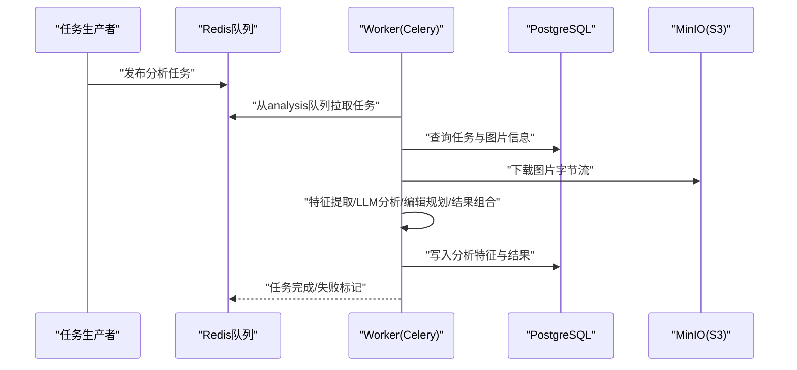
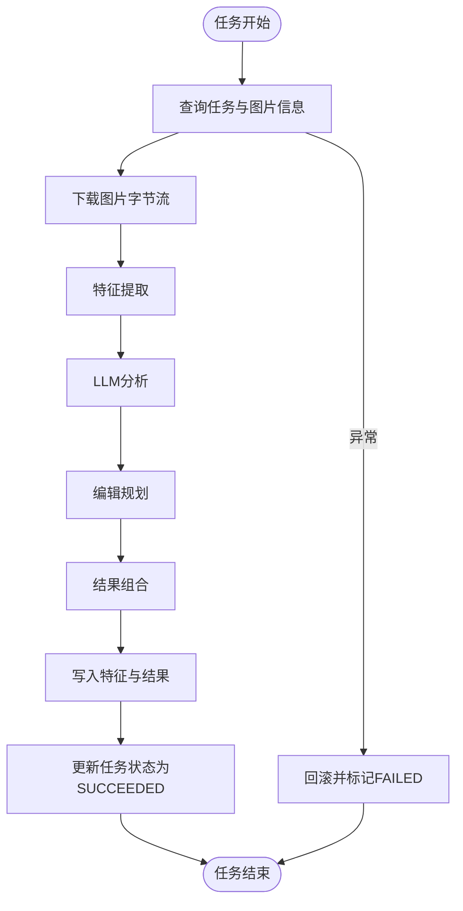
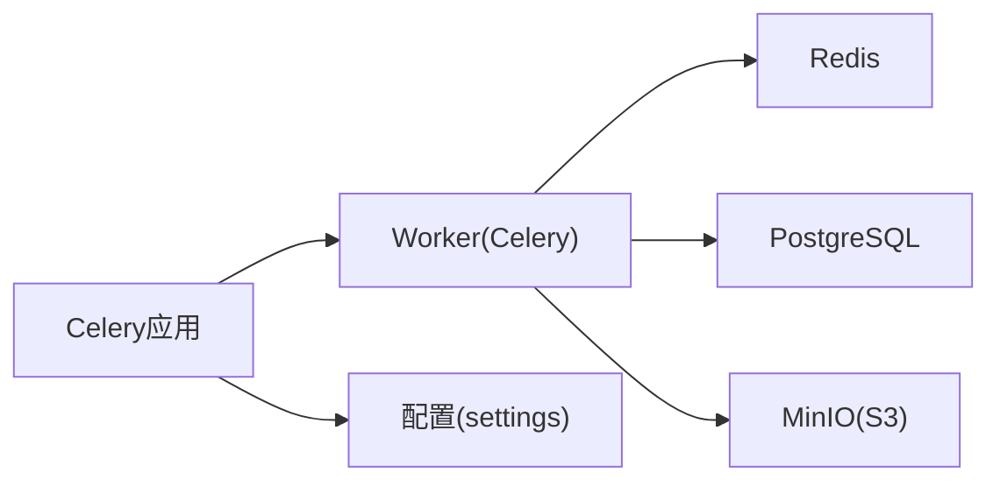

# Worker部署

<cite>
**本文引用的文件**
- [apps/worker/Dockerfile](file://apps/worker/Dockerfile)
- [apps/api/app/core/celery_app.py](file://apps/api/app/core/celery_app.py)
- [apps/api/app/core/config.py](file://apps/api/app/core/config.py)
- [apps/api/app/tasks/analyze_photo.py](file://apps/api/app/tasks/analyze_photo.py)
- [apps/api/app/main.py](file://apps/api/app/main.py)
- [infra/docker-compose.prod.yml](file://infra/docker-compose.prod.yml)
- [infra/docker-compose.yml](file://infra/docker-compose.yml)
- [infra/deploy.sh](file://infra/deploy.sh)
- [infra/nginx/default.conf](file://infra/nginx/default.conf)
- [apps/api/requirements.txt](file://apps/api/requirements.txt)
</cite>

## 目录
1. [简介](#简介)
2. [项目结构](#项目结构)
3. [核心组件](#核心组件)
4. [架构总览](#架构总览)
5. [详细组件分析](#详细组件分析)
6. [依赖分析](#依赖分析)
7. [性能考虑](#性能考虑)
8. [故障排除指南](#故障排除指南)
9. [结论](#结论)
10. [附录](#附录)

## 简介
本文件面向AI摄影教练项目的Worker服务部署，聚焦于Worker容器的Docker镜像构建、启动命令与环境变量配置、与Redis消息代理的连接方式、多实例部署与负载均衡策略、健康检查与重启机制、监控与日志采集、资源限制与性能调优，以及常见故障排除与维护操作。内容基于仓库中的实际配置文件进行梳理与总结，帮助运维与开发人员快速理解并稳定运行Worker服务。

## 项目结构
Worker服务位于apps/worker目录，采用独立的Dockerfile进行构建；其运行时通过Celery从Redis队列拉取任务并执行图像分析工作。生产与开发环境均通过docker-compose编排，包含PostgreSQL、Redis、MinIO等依赖服务，并在生产环境中由Nginx反向代理到API服务。

```mermaid
graph TB
subgraph "应用层"
WEB["Web前端容器"]
API["API服务容器"]
WORKER["Worker容器"]
end
subgraph "基础设施层"
PG["PostgreSQL"]
RD["Redis"]
S3["MinIO(S3)"]
end
Nginx["Nginx反向代理"]
WEB --> Nginx
Nginx --> API
API <- --> RD
API <- --> PG
API <- --> S3
WORKER <- --> RD
WORKER <- --> PG
WORKER <- --> S3
```

图表来源
- [infra/docker-compose.prod.yml:1-128](file://infra/docker-compose.prod.yml#L1-L128)
- [infra/docker-compose.yml:1-107](file://infra/docker-compose.yml#L1-L107)
- [apps/worker/Dockerfile:1-20](file://apps/worker/Dockerfile#L1-L20)

章节来源
- [apps/worker/Dockerfile:1-20](file://apps/worker/Dockerfile#L1-L20)
- [infra/docker-compose.prod.yml:98-122](file://infra/docker-compose.prod.yml#L98-L122)
- [infra/docker-compose.yml:78-101](file://infra/docker-compose.yml#L78-L101)

## 核心组件
- Worker容器镜像与启动命令
  - 基于Python 3.12精简镜像，安装依赖后以Celery Worker进程启动，绑定analysis队列，日志级别为info。
  - 启动命令直接指向Celery应用实例与队列参数，确保任务路由到analysis队列。
- Celery应用与Redis连接
  - Celery应用使用settings.redis_url作为broker与backend，任务路由将分析任务定向至analysis队列。
- 配置管理
  - 通过Pydantic Settings加载环境变量，支持DB_URL、REDIS_URL、S3相关参数、模型名称与提示版本等。
- 任务实现
  - 分析任务从数据库读取任务状态与图片对象键，下载图片字节流，依次调用特征提取、LLM分析、编辑规划与结果组合服务，最终写回分析结果并更新任务状态。
- 编排与部署
  - docker-compose定义了Worker服务的构建上下文、环境变量注入与依赖健康检查；生产脚本负责校验环境变量并启动栈。

章节来源
- [apps/worker/Dockerfile:19-19](file://apps/worker/Dockerfile#L19-L19)
- [apps/api/app/core/celery_app.py:5-19](file://apps/api/app/core/celery_app.py#L5-L19)
- [apps/api/app/core/config.py:6-46](file://apps/api/app/core/config.py#L6-L46)
- [apps/api/app/tasks/analyze_photo.py:19-108](file://apps/api/app/tasks/analyze_photo.py#L19-L108)
- [infra/docker-compose.prod.yml:98-122](file://infra/docker-compose.prod.yml#L98-L122)
- [infra/docker-compose.yml:78-101](file://infra/docker-compose.yml#L78-L101)

## 架构总览
下图展示了Worker在整体系统中的位置：它从Redis队列接收分析任务，访问PostgreSQL存储任务与结果，从MinIO下载图片并写回分析结果，同时通过API对外暴露健康检查端点。



图表来源
- [apps/api/app/tasks/analyze_photo.py:19-108](file://apps/api/app/tasks/analyze_photo.py#L19-L108)
- [apps/api/app/core/celery_app.py:5-19](file://apps/api/app/core/celery_app.py#L5-L19)
- [apps/api/app/core/config.py:13-19](file://apps/api/app/core/config.py#L13-L19)

## 详细组件分析

### Worker容器镜像与构建
- 基础镜像与工作目录
  - 使用ARG传入Python基础镜像，WORKDIR设为/app。
- 环境变量
  - 设置PYTHONDONTWRITEBYTECODE与PYTHONUNBUFFERED以优化Python行为。
- 用户与权限
  - 创建非特权用户app并切换，提升安全性。
- 依赖安装与复制
  - 复制API服务requirements.txt并一次性安装，随后复制API源码，最后变更所有权。
- 启动命令
  - 通过CMD指定celery worker，绑定analysis队列，日志级别为info。

章节来源
- [apps/worker/Dockerfile:1-20](file://apps/worker/Dockerfile#L1-L20)

### Worker启动命令与环境变量
- 启动命令
  - CMD中明确指定Celery应用实例、worker子命令、日志级别与队列参数，确保Worker只处理analysis队列的任务。
- 环境变量注入
  - 生产与开发compose文件均向Worker注入DB_URL、REDIS_URL、S3相关参数、模型名称与提示版本等，保证Worker可连接数据库、Redis与对象存储。
- 依赖健康检查
  - Worker依赖PostgreSQL、Redis、MinIO健康，仅在这些服务就绪后才启动。

章节来源
- [apps/worker/Dockerfile:19-19](file://apps/worker/Dockerfile#L19-L19)
- [infra/docker-compose.prod.yml:105-114](file://infra/docker-compose.prod.yml#L105-L114)
- [infra/docker-compose.yml:85-94](file://infra/docker-compose.yml#L85-L94)

### Worker与Redis消息代理连接
- 连接配置
  - Celery broker与backend均使用settings.redis_url，确保任务状态与消息一致。
- 队列与路由
  - 通过task_routes将分析任务定向到analysis队列，Worker启动时绑定该队列，避免与其他队列冲突。
- 环境变量
  - REDIS_URL在compose文件中被注入到Worker容器，值形如redis://redis:6379/0，指向编排网络内的Redis服务。

章节来源
- [apps/api/app/core/celery_app.py:7-18](file://apps/api/app/core/celery_app.py#L7-L18)
- [apps/api/app/core/config.py:14](file://apps/api/app/core/config.py#L14)
- [infra/docker-compose.prod.yml:107](file://infra/docker-compose.prod.yml#L107)
- [infra/docker-compose.yml:87](file://infra/docker-compose.yml#L87)

### 多Worker实例部署与负载均衡
- 实例扩展
  - docker-compose支持通过scale扩展Worker副本数量（例如在生产编排中添加scale: N），实现水平扩展。
- 负载均衡
  - 由于所有Worker共享同一Redis队列，任务在队列内自动分发，无需额外LB组件。
- 队列隔离
  - 若需隔离不同类型的分析任务，可在Celery中新增队列并通过task_routes分别路由，再按队列启动专用Worker。

章节来源
- [infra/docker-compose.prod.yml:98-122](file://infra/docker-compose.prod.yml#L98-L122)
- [apps/api/app/core/celery_app.py:16-18](file://apps/api/app/core/celery_app.py#L16-L18)

### 健康检查与重启机制
- Worker健康检查
  - compose文件未为Worker单独配置healthcheck，但其依赖PostgreSQL、Redis、MinIO健康，间接保障运行环境可用。
- 重启策略
  - restart: unless-stopped确保容器异常退出后自动重启，提升可用性。
- API健康检查参考
  - API服务提供/healthz端点，Nginx将其代理到API，可作为系统健康观测参考。

章节来源
- [infra/docker-compose.prod.yml:122](file://infra/docker-compose.prod.yml#L122)
- [apps/api/app/main.py:32-34](file://apps/api/app/main.py#L32-L34)
- [infra/nginx/default.conf:17-24](file://infra/nginx/default.conf#L17-L24)

### 监控与日志收集
- 日志输出
  - Worker以info级别输出日志，便于在容器日志中追踪任务执行与错误。
- 日志采集
  - 可结合Docker日志驱动或集中式日志平台（如ELK/Fluentd）采集容器日志。
- 健康检查
  - API的/healthz端点可用于外部健康探测，Nginx将其代理至API服务。

章节来源
- [apps/worker/Dockerfile:19](file://apps/worker/Dockerfile#L19)
- [apps/api/app/main.py:32-34](file://apps/api/app/main.py#L32-L34)
- [infra/nginx/default.conf:17-24](file://infra/nginx/default.conf#L17-L24)

### 资源限制与性能调优
- CPU与内存限制
  - 可在docker-compose中为worker服务设置deploy.resources.limits（CPU/内存）与reservations，避免资源争用。
- 并发与并发消费者
  - Celery worker支持通过命令行参数调整并发数（如–concurrency），建议根据CPU核数与I/O特性调优。
- 队列与路由
  - 将高优先级任务路由到独立队列，配合专用Worker实例，提升关键路径吞吐。
- 数据库与存储
  - 控制数据库连接池大小与超时，确保I/O密集型分析任务不会阻塞连接池。

章节来源
- [apps/api/app/core/celery_app.py:5-19](file://apps/api/app/core/celery_app.py#L5-L19)
- [apps/api/requirements.txt:7](file://apps/api/requirements.txt#L7)

### Worker任务流程与数据流
- 任务生命周期
  - 任务状态从PENDING变为RUNNING，成功则SUCCEEDED并写入结果，失败则FAILED并记录错误信息。
- 数据流
  - 从MinIO下载图片字节流，经特征提取、LLM分析、编辑规划生成建议，最终由结果组合器整合并持久化到PostgreSQL。



图表来源
- [apps/api/app/tasks/analyze_photo.py:19-108](file://apps/api/app/tasks/analyze_photo.py#L19-L108)

## 依赖分析
- 组件耦合
  - Worker依赖Redis队列、PostgreSQL与MinIO；Celery应用与配置模块解耦，便于在不同环境复用。
- 外部依赖
  - Celery与Redis用于消息传递；SQLAlchemy与PostgreSQL用于持久化；Boto3与MinIO用于对象存储。
- 潜在风险
  - 若Redis或数据库不可用，Worker无法拉取/写入任务；若S3不可用，图片下载失败导致任务失败。



图表来源
- [apps/api/app/core/celery_app.py:3-10](file://apps/api/app/core/celery_app.py#L3-L10)
- [apps/api/app/core/config.py:6-46](file://apps/api/app/core/config.py#L6-L46)

章节来源
- [apps/api/app/core/celery_app.py:1-21](file://apps/api/app/core/celery_app.py#L1-L21)
- [apps/api/app/core/config.py:1-47](file://apps/api/app/core/config.py#L1-L47)
- [apps/api/requirements.txt:1-19](file://apps/api/requirements.txt#L1-L19)

## 性能考虑
- 队列与并发
  - 将分析任务路由到独立队列，结合–concurrency参数与CPU核数调优，避免I/O瓶颈。
- 数据库连接池
  - 控制SQLAlchemy连接池大小与超时，减少连接竞争。
- 对象存储
  - 批量下载与缓存热点图片，降低S3访问延迟。
- 日志级别
  - 在生产中保持info级别，必要时降为warn以减少I/O开销。

## 故障排除指南
- Worker无法启动
  - 检查REDIS_URL是否正确注入且Redis可达；确认DB_URL可连接PostgreSQL；验证S3 Endpoint与凭据。
- 任务不执行
  - 确认Worker已绑定analysis队列；检查任务是否正确发布到Redis；查看API侧任务路由配置。
- 任务失败
  - 查看Worker容器日志定位异常；检查数据库事务回滚与错误字段；确认MinIO对象是否存在。
- 健康检查
  - 若API/Worker不健康，先排查依赖服务健康状态；使用docker compose ps与logs定位问题。
- 部署与运维
  - 使用部署脚本前确保环境变量文件存在且包含必需键；通过scale扩展Worker副本；结合Nginx代理与API健康端点进行系统观测。

章节来源
- [infra/deploy.sh:17-42](file://infra/deploy.sh#L17-L42)
- [apps/api/app/tasks/analyze_photo.py:97-107](file://apps/api/app/tasks/analyze_photo.py#L97-L107)
- [apps/api/app/main.py:32-34](file://apps/api/app/main.py#L32-L34)

## 结论
Worker服务通过Celery与Redis实现可靠的任务分发，结合PostgreSQL与MinIO完成完整的分析流水线。生产编排提供了稳定的依赖服务与健康检查，配合日志与健康端点可实现可观测性。通过队列隔离、并发调优与资源限制，可在高负载场景下获得更好的稳定性与性能表现。

## 附录
- 关键配置要点
  - Worker镜像：基于Python 3.12精简镜像，非root用户运行，CMD绑定analysis队列。
  - 环境变量：DB_URL、REDIS_URL、S3_ENDPOINT/S3_ACCESS_KEY/S3_SECRET_KEY/S3_BUCKET/S3_REGION、MODEL_NAME、PROMPT_VERSION。
  - 队列与路由：analysis队列与对应路由规则。
  - 健康检查：依赖服务健康；API提供/healthz端点。
  - 部署脚本：校验环境变量并启动栈，提供常用日志与URL指引。

章节来源
- [apps/worker/Dockerfile:1-20](file://apps/worker/Dockerfile#L1-L20)
- [infra/docker-compose.prod.yml:105-114](file://infra/docker-compose.prod.yml#L105-L114)
- [apps/api/app/core/celery_app.py:16-18](file://apps/api/app/core/celery_app.py#L16-L18)
- [apps/api/app/main.py:32-34](file://apps/api/app/main.py#L32-L34)
- [infra/deploy.sh:35-42](file://infra/deploy.sh#L35-L42)