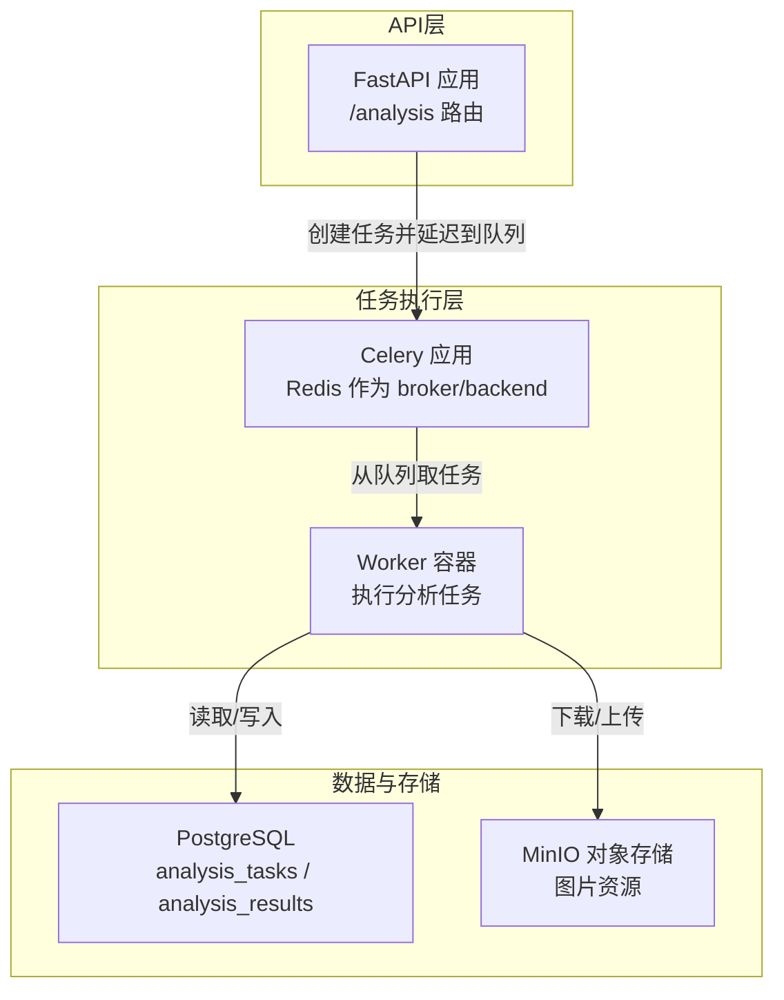
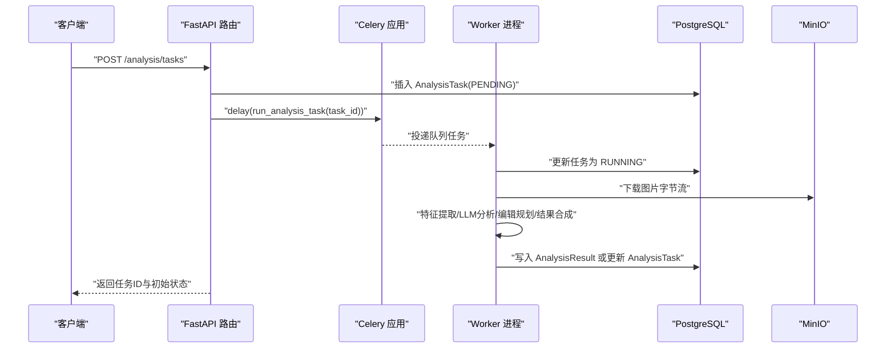
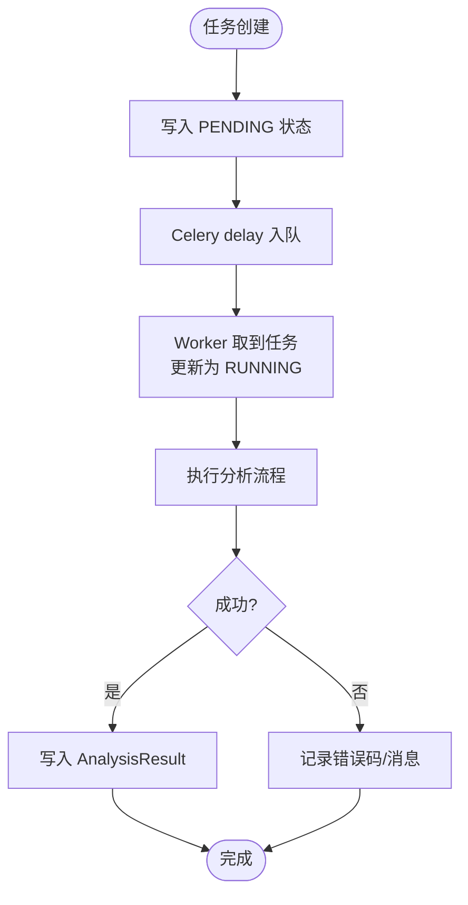
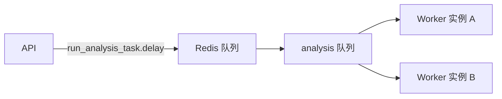
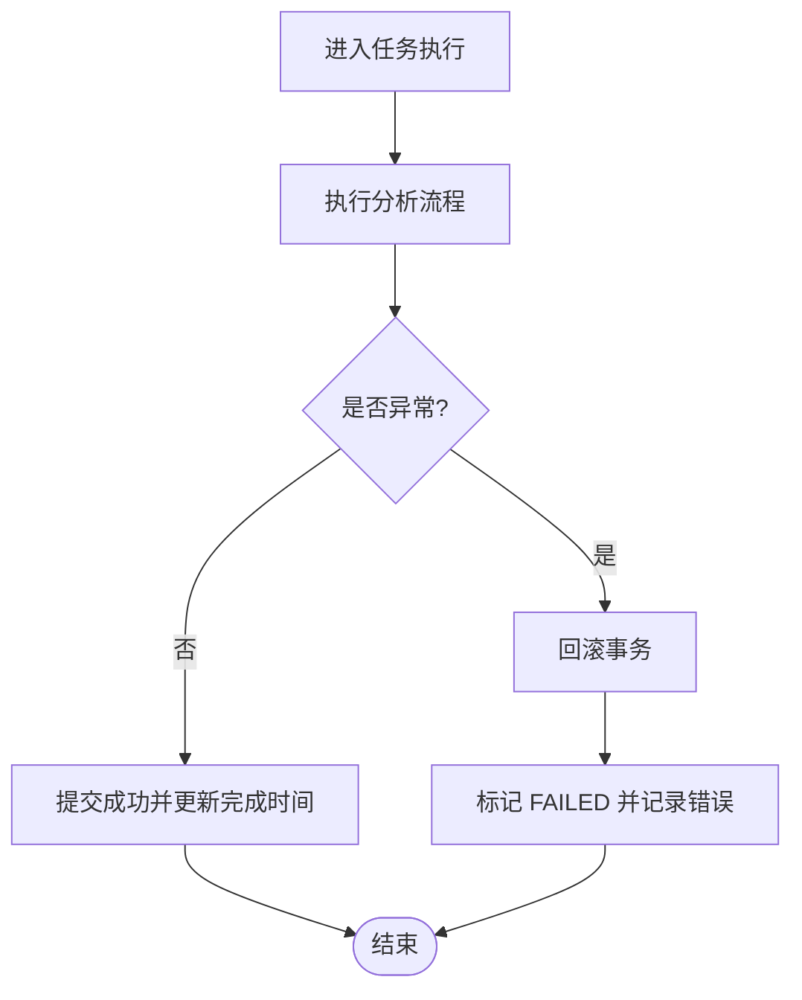
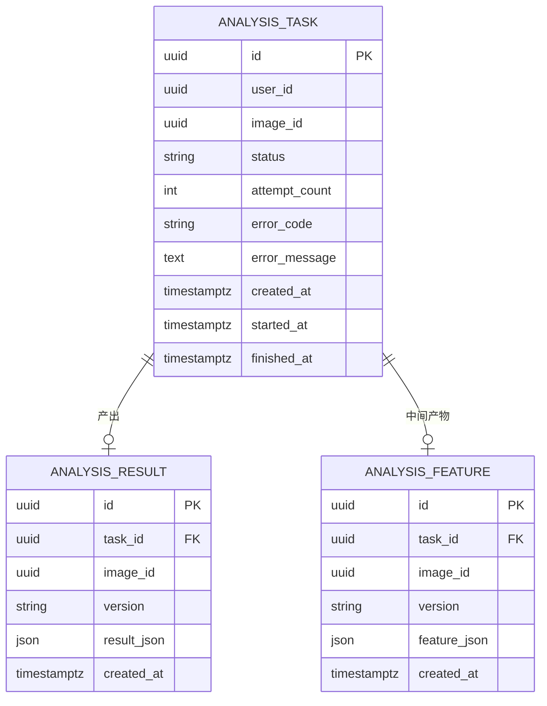
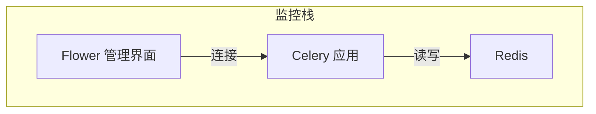
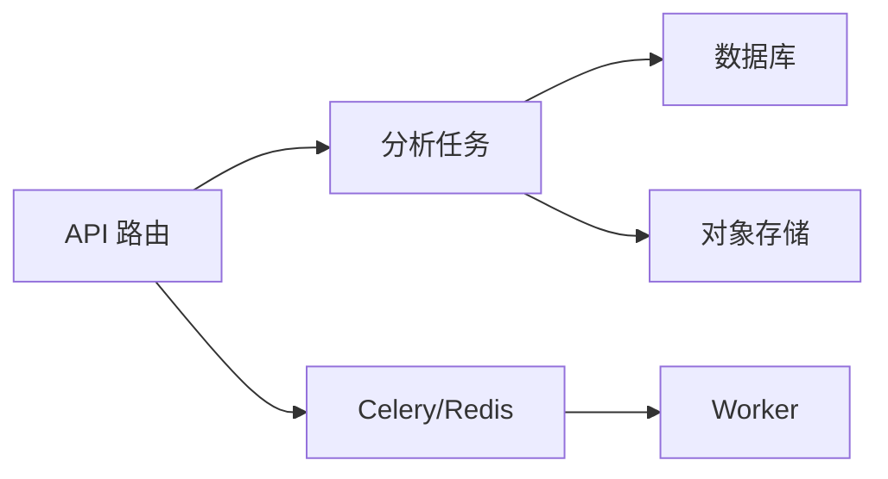

# 任务监控

<cite>
**本文引用的文件**
- [apps/api/app/core/celery_app.py](file://apps/api/app/core/celery_app.py)
- [apps/api/app/tasks/analyze_photo.py](file://apps/api/app/tasks/analyze_photo.py)
- [apps/api/app/models/analysis_task.py](file://apps/api/app/models/analysis_task.py)
- [apps/api/app/modules/analysis/router.py](file://apps/api/app/modules/analysis/router.py)
- [apps/api/app/core/config.py](file://apps/api/app/core/config.py)
- [apps/api/app/core/database.py](file://apps/api/app/core/database.py)
- [apps/api/app/schemas/analysis.py](file://apps/api/app/schemas/analysis.py)
- [apps/api/app/services/composer/result_composer.py](file://apps/api/app/services/composer/result_composer.py)
- [apps/api/app/main.py](file://apps/api/app/main.py)
- [apps/api/requirements.txt](file://apps/api/requirements.txt)
- [infra/docker-compose.yml](file://infra/docker-compose.yml)
</cite>

## 目录
1. [简介](#简介)
2. [项目结构](#项目结构)
3. [核心组件](#核心组件)
4. [架构总览](#架构总览)
5. [详细组件分析](#详细组件分析)
6. [依赖分析](#依赖分析)
7. [性能考量](#性能考量)
8. [故障排查指南](#故障排查指南)
9. [结论](#结论)
10. [附录](#附录)

## 简介
本技术文档围绕“AI摄影教练”项目中的异步任务监控展开，重点解释任务状态跟踪与进度报告的实现机制，覆盖以下主题：
- 如何监控任务执行状态、队列长度与Worker负载
- Celery Flower监控工具的配置与使用方法
- 任务性能指标的采集与分析
- 任务失败的监控与告警机制
- 执行时间统计与瓶颈识别策略
- 监控数据的可视化与报表生成
- 监控系统的维护与优化建议

当前代码库已内置基于Redis的Celery任务队列与数据库持久化，前端通过FastAPI接口提交任务并轮询状态；Worker容器负责实际执行分析任务。

## 项目结构
项目采用前后端分离与容器化部署，核心异步任务链路如下：
- API服务：接收请求、创建任务、调度Celery任务
- Redis：作为消息代理与结果后端
- PostgreSQL：存储任务与结果元数据
- MinIO：对象存储图片资源
- Worker容器：消费队列任务并执行分析流程

图表来源
- [apps/api/app/modules/analysis/router.py:45-74](file://apps/api/app/modules/analysis/router.py#L45-L74)
- [apps/api/app/core/celery_app.py:5-19](file://apps/api/app/core/celery_app.py#L5-L19)
- [apps/api/app/tasks/analyze_photo.py:19-20](file://apps/api/app/tasks/analyze_photo.py#L19-L20)
- [apps/api/app/core/database.py:21-25](file://apps/api/app/core/database.py#L21-L25)
- [infra/docker-compose.yml:50-101](file://infra/docker-compose.yml#L50-L101)

章节来源
- [apps/api/app/main.py:11-24](file://apps/api/app/main.py#L11-L24)
- [apps/api/app/modules/analysis/router.py:24-24](file://apps/api/app/modules/analysis/router.py#L24-L24)
- [apps/api/app/core/celery_app.py:5-19](file://apps/api/app/core/celery_app.py#L5-L19)
- [apps/api/app/tasks/analyze_photo.py:19-20](file://apps/api/app/tasks/analyze_photo.py#L19-L20)
- [apps/api/app/core/database.py:21-25](file://apps/api/app/core/database.py#L21-L25)
- [infra/docker-compose.yml:1-107](file://infra/docker-compose.yml#L1-L107)

## 核心组件
- Celery应用与路由
  - 创建Celery实例，设置broker与backend为Redis，并注册分析任务模块
  - 启用任务启动跟踪，设置时区与路由规则将分析任务投递至“analysis”队列
- 分析任务
  - 以任务ID为参数，查询任务状态并更新为RUNNING
  - 下载图片字节流，调用特征提取、LLM分析、编辑规划与结果合成
  - 成功则写入分析结果，失败则回滚并记录错误码与错误信息
- 数据模型
  - AnalysisTask：任务元数据（状态、尝试次数、错误信息、时间戳）
  - AnalysisResult：分析结果JSON与关联任务
  - AnalysisFeature：中间特征JSON与版本控制
- API路由
  - 创建任务：写入数据库并调用delay触发Celery任务
  - 查询任务详情：返回任务状态与结果摘要
  - 历史查询：按用户与时间排序返回任务列表
  - 重试任务：将失败或成功的任务重置为PENDING并重新入队

章节来源
- [apps/api/app/core/celery_app.py:5-19](file://apps/api/app/core/celery_app.py#L5-L19)
- [apps/api/app/tasks/analyze_photo.py:19-108](file://apps/api/app/tasks/analyze_photo.py#L19-L108)
- [apps/api/app/models/analysis_task.py:10-36](file://apps/api/app/models/analysis_task.py#L10-L36)
- [apps/api/app/models/analysis_result.py:10-28](file://apps/api/app/models/analysis_result.py#L10-L28)
- [apps/api/app/models/analysis_feature.py:10-29](file://apps/api/app/models/analysis_feature.py#L10-L29)
- [apps/api/app/modules/analysis/router.py:45-151](file://apps/api/app/modules/analysis/router.py#L45-L151)
- [apps/api/app/schemas/analysis.py:8-52](file://apps/api/app/schemas/analysis.py#L8-L52)

## 架构总览
下图展示从API到Worker再到数据库与对象存储的完整链路，以及任务状态流转的关键节点。

图表来源
- [apps/api/app/modules/analysis/router.py:45-74](file://apps/api/app/modules/analysis/router.py#L45-L74)
- [apps/api/app/tasks/analyze_photo.py:19-108](file://apps/api/app/tasks/analyze_photo.py#L19-L108)
- [apps/api/app/core/database.py:21-25](file://apps/api/app/core/database.py#L21-L25)
- [apps/api/app/core/celery_app.py:5-19](file://apps/api/app/core/celery_app.py#L5-L19)

## 详细组件分析

### 组件A：任务状态跟踪与进度报告
- 状态字段
  - AnalysisTask包含status、attempt_count、error_code、error_message、created_at、started_at、finished_at等字段，用于记录任务生命周期
- 进度与结果
  - 任务执行前将状态置为RUNNING并记录开始时间
  - 成功后写入AnalysisResult，失败则记录错误码与消息
  - API提供任务详情与历史接口，返回状态、时间戳与结果摘要
- 轮询策略
  - 前端可通过GET /analysis/tasks/{task_id}轮询任务状态
  - 历史接口支持分页与时间排序，便于展示任务列表

图表来源
- [apps/api/app/tasks/analyze_photo.py:19-108](file://apps/api/app/tasks/analyze_photo.py#L19-L108)
- [apps/api/app/models/analysis_task.py:21-30](file://apps/api/app/models/analysis_task.py#L21-L30)
- [apps/api/app/models/analysis_result.py:13-22](file://apps/api/app/models/analysis_result.py#L13-L22)
- [apps/api/app/modules/analysis/router.py:76-89](file://apps/api/app/modules/analysis/router.py#L76-L89)

章节来源
- [apps/api/app/models/analysis_task.py:10-36](file://apps/api/app/models/analysis_task.py#L10-L36)
- [apps/api/app/models/analysis_result.py:10-28](file://apps/api/app/models/analysis_result.py#L10-L28)
- [apps/api/app/modules/analysis/router.py:76-125](file://apps/api/app/modules/analysis/router.py#L76-L125)

### 组件B：队列长度与Worker负载监控
- 队列路由
  - 通过task_routes将分析任务路由到“analysis”队列，便于隔离与观测
- Worker负载
  - 当前未启用多Worker实例与并发限制配置，建议在生产环境增加并发与队列拆分
- 监控点
  - 使用Celery Flower查看队列长度、任务耗时、Worker处理数量等指标
  - 结合数据库索引与查询优化，避免阻塞导致队列堆积

图表来源
- [apps/api/app/core/celery_app.py:16-18](file://apps/api/app/core/celery_app.py#L16-L18)
- [apps/api/app/tasks/analyze_photo.py:19-20](file://apps/api/app/tasks/analyze_photo.py#L19-L20)

章节来源
- [apps/api/app/core/celery_app.py:16-18](file://apps/api/app/core/celery_app.py#L16-L18)
- [apps/api/app/tasks/analyze_photo.py:19-20](file://apps/api/app/tasks/analyze_photo.py#L19-L20)

### 组件C：任务失败监控与告警
- 失败记录
  - 任务异常时捕获异常，回滚事务，记录error_code与error_message，并将状态置为FAILED
- 告警建议
  - 建议集成外部告警系统（如邮件/SMS/Webhook），在FAILED状态出现时触发
  - 可结合错误码进行分类统计，定位高频失败原因

图表来源
- [apps/api/app/tasks/analyze_photo.py:97-107](file://apps/api/app/tasks/analyze_photo.py#L97-L107)

章节来源
- [apps/api/app/tasks/analyze_photo.py:97-107](file://apps/api/app/tasks/analyze_photo.py#L97-L107)

### 组件D：性能指标采集与分析
- 指标清单
  - 任务执行时间：finished_at - started_at
  - 队列等待时间：task.created_at 到 task.started_at
  - 尝试次数：attempt_count
  - 错误率与错误分布：按error_code统计
- 采集方式
  - 通过数据库查询聚合统计，或在任务完成后上报到指标系统
- 分析维度
  - 按用户、模型、提示词版本、队列等维度进行分组分析
  - 识别慢任务与异常峰值，定位瓶颈环节（下载、特征提取、LLM分析、结果合成）

图表来源
- [apps/api/app/models/analysis_task.py:10-36](file://apps/api/app/models/analysis_task.py#L10-L36)
- [apps/api/app/models/analysis_result.py:10-28](file://apps/api/app/models/analysis_result.py#L10-L28)
- [apps/api/app/models/analysis_feature.py:10-29](file://apps/api/app/models/analysis_feature.py#L10-L29)

章节来源
- [apps/api/app/models/analysis_task.py:21-30](file://apps/api/app/models/analysis_task.py#L21-L30)
- [apps/api/app/models/analysis_result.py:20-22](file://apps/api/app/models/analysis_result.py#L20-L22)
- [apps/api/app/models/analysis_feature.py:20-21](file://apps/api/app/models/analysis_feature.py#L20-L21)

### 组件E：监控数据可视化与报表生成
- 可视化建议
  - 使用Grafana + Prometheus或自建仪表盘展示：队列长度、任务吞吐、平均/分位执行时间、错误率、Worker负载
  - 报表维度：日/周/月趋势、Top N慢任务、失败Top N错误码
- 数据来源
  - 从PostgreSQL导出任务与结果数据，或通过Celery事件系统实时采集

[本节为概念性内容，不直接分析具体文件，故无章节来源]

### 组件F：Celery Flower监控工具配置与使用
- 配置
  - 在部署环境中添加Flower服务，绑定到Redis后端，暴露管理界面
  - 可通过环境变量或命令行参数指定broker与result_backend
- 使用
  - 查看任务状态、队列长度、Worker健康与处理速率
  - 观察单个任务的执行轨迹与耗时分解

图表来源
- [apps/api/app/core/celery_app.py:7-8](file://apps/api/app/core/celery_app.py#L7-L8)
- [apps/api/requirements.txt:7-7](file://apps/api/requirements.txt#L7-L7)

章节来源
- [apps/api/app/core/celery_app.py:7-8](file://apps/api/app/core/celery_app.py#L7-L8)
- [apps/api/requirements.txt:7-7](file://apps/api/requirements.txt#L7-L7)

## 依赖分析
- 组件耦合
  - API路由依赖Celery任务模块与数据库会话
  - 任务模块依赖数据库、存储服务与各分析服务
- 外部依赖
  - Celery与Redis：任务编排与队列
  - PostgreSQL：任务与结果持久化
  - MinIO：图片资源存取
- 潜在风险
  - 单一Worker可能导致队列堆积与延迟放大
  - 缺少任务幂等键与去重策略，可能重复执行

图表来源
- [apps/api/app/modules/analysis/router.py:45-74](file://apps/api/app/modules/analysis/router.py#L45-L74)
- [apps/api/app/tasks/analyze_photo.py:19-108](file://apps/api/app/tasks/analyze_photo.py#L19-L108)
- [apps/api/app/core/database.py:21-25](file://apps/api/app/core/database.py#L21-L25)
- [apps/api/app/core/celery_app.py:5-19](file://apps/api/app/core/celery_app.py#L5-L19)
- [infra/docker-compose.yml:50-101](file://infra/docker-compose.yml#L50-L101)

章节来源
- [apps/api/app/modules/analysis/router.py:45-74](file://apps/api/app/modules/analysis/router.py#L45-L74)
- [apps/api/app/tasks/analyze_photo.py:19-108](file://apps/api/app/tasks/analyze_photo.py#L19-L108)
- [apps/api/app/core/database.py:21-25](file://apps/api/app/core/database.py#L21-L25)
- [apps/api/app/core/celery_app.py:5-19](file://apps/api/app/core/celery_app.py#L5-L19)
- [infra/docker-compose.yml:50-101](file://infra/docker-compose.yml#L50-L101)

## 性能考量
- 队列与并发
  - 建议按业务拆分队列（如analysis、cleanup等），并根据负载扩展Worker副本数
  - 设置合理并发与预取数，避免Worker空闲与任务积压
- 数据库优化
  - 已有常用索引，建议定期分析慢查询，必要时增加复合索引
  - 控制单次任务耗时，避免长事务锁竞争
- 存储与网络
  - 图片下载与上传应设置超时与重试，避免阻塞Worker
  - 对热点资源进行缓存或CDN加速
- 指标与告警
  - 建立SLA阈值（队列等待时间、执行时间、错误率），超过阈值自动告警

[本节提供通用指导，不直接分析具体文件，故无章节来源]

## 故障排查指南
- 常见问题
  - 任务长时间处于PENDING：检查Redis连通性与队列是否堆积
  - 任务报错FAILED：查看error_code与error_message，定位具体环节
  - 结果缺失：确认AnalysisResult是否写入，或任务被重试覆盖
- 排查步骤
  - 通过API查询任务详情，核对状态与时间戳
  - 在Flower中查看任务执行轨迹与Worker状态
  - 检查数据库索引与慢查询日志
- 重试机制
  - 支持将FAILED或SUCCEEDED的任务重置为PENDING并重新入队

章节来源
- [apps/api/app/modules/analysis/router.py:128-151](file://apps/api/app/modules/analysis/router.py#L128-L151)
- [apps/api/app/tasks/analyze_photo.py:97-107](file://apps/api/app/tasks/analyze_photo.py#L97-L107)

## 结论
本项目已具备完整的异步任务链路与基础监控能力：任务状态持久化、队列路由与基本失败记录。建议在生产环境中补充：
- Celery Flower部署与可视化监控
- Worker横向扩展与队列拆分
- 指标采集与报表体系
- 失败告警与根因分析
- 性能瓶颈定位与容量规划

[本节为总结性内容，不直接分析具体文件，故无章节来源]

## 附录
- 关键实现路径
  - 任务创建与入队：[apps/api/app/modules/analysis/router.py:45-74](file://apps/api/app/modules/analysis/router.py#L45-L74)
  - 任务执行与状态更新：[apps/api/app/tasks/analyze_photo.py:19-108](file://apps/api/app/tasks/analyze_photo.py#L19-L108)
  - 任务模型定义：[apps/api/app/models/analysis_task.py:10-36](file://apps/api/app/models/analysis_task.py#L10-L36)
  - 结果模型定义：[apps/api/app/models/analysis_result.py:10-28](file://apps/api/app/models/analysis_result.py#L10-L28)
  - 配置与环境变量：[apps/api/app/core/config.py:13-28](file://apps/api/app/core/config.py#L13-L28)
  - 数据库初始化与索引：[apps/api/app/core/database.py:21-51](file://apps/api/app/core/database.py#L21-L51)
  - Celery应用与路由：[apps/api/app/core/celery_app.py:5-19](file://apps/api/app/core/celery_app.py#L5-L19)
  - 部署编排（含Redis/Postgres/MinIO）：[infra/docker-compose.yml:1-107](file://infra/docker-compose.yml#L1-L107)
  - 依赖声明（含Celery）：[apps/api/requirements.txt:7-7](file://apps/api/requirements.txt#L7-L7)

[本节为汇总性内容，不直接分析具体文件，故无章节来源]