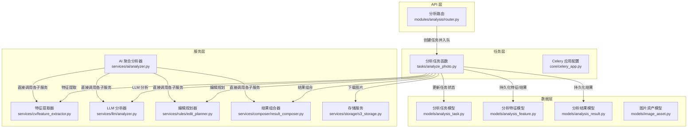
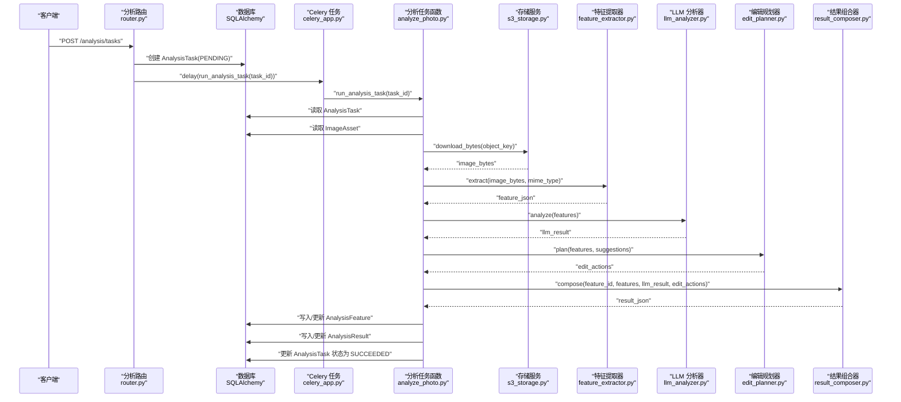
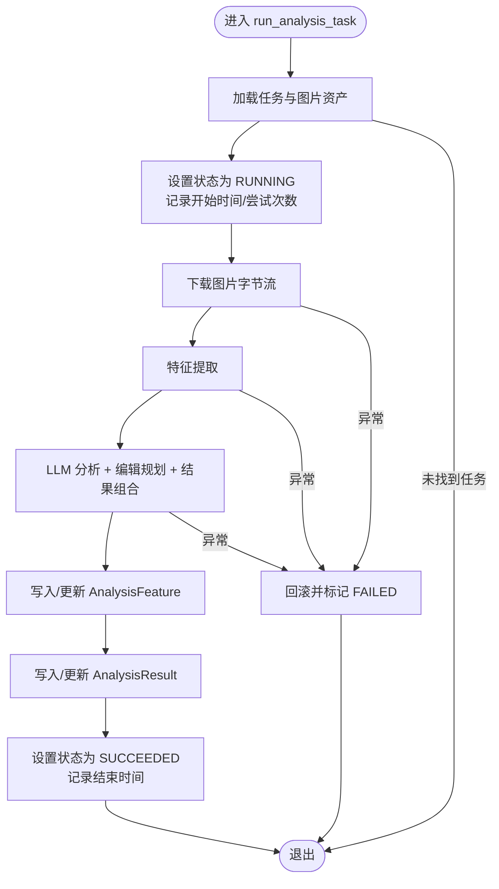
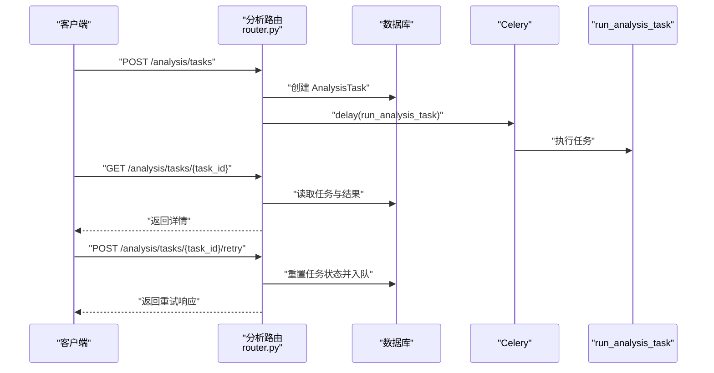
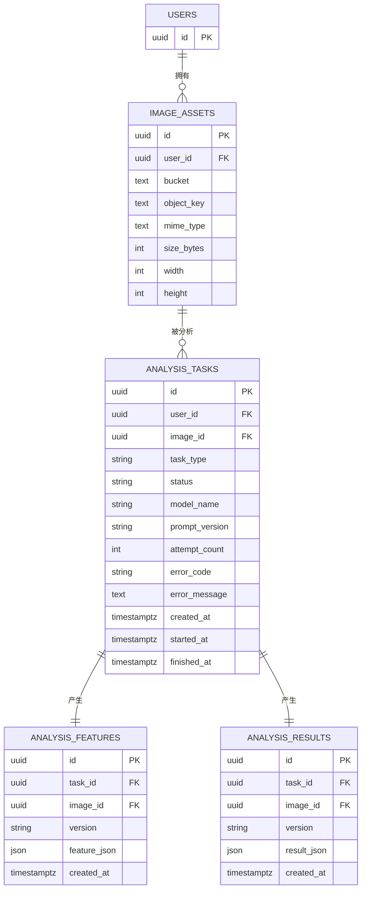
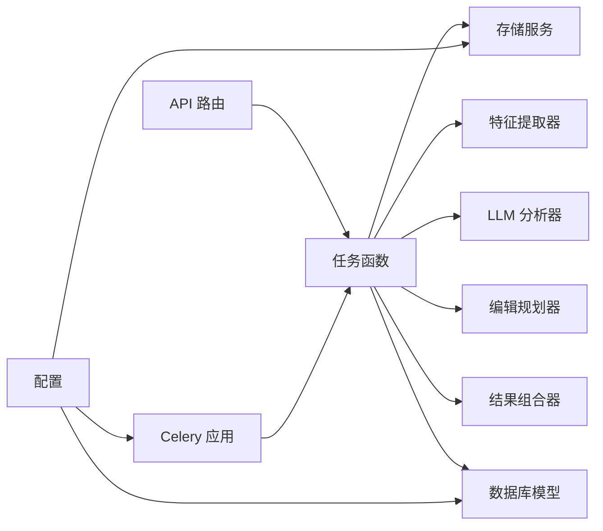

# 分析任务定义

<cite>
**本文引用的文件**
- [apps/api/app/tasks/analyze_photo.py](file://apps/api/app/tasks/analyze_photo.py)
- [apps/api/app/models/analysis_task.py](file://apps/api/app/models/analysis_task.py)
- [apps/api/app/models/analysis_feature.py](file://apps/api/app/models/analysis_feature.py)
- [apps/api/app/models/analysis_result.py](file://apps/api/app/models/analysis_result.py)
- [apps/api/app/models/image_asset.py](file://apps/api/app/models/image_asset.py)
- [apps/api/app/services/ai/analyzer.py](file://apps/api/app/services/ai/analyzer.py)
- [apps/api/app/services/cv/feature_extractor.py](file://apps/api/app/services/cv/feature_extractor.py)
- [apps/api/app/services/llm/analyzer.py](file://apps/api/app/services/llm/analyzer.py)
- [apps/api/app/services/composer/result_composer.py](file://apps/api/app/services/composer/result_composer.py)
- [apps/api/app/services/rules/edit_planner.py](file://apps/api/app/services/rules/edit_planner.py)
- [apps/api/app/services/storage/s3_storage.py](file://apps/api/app/services/storage/s3_storage.py)
- [apps/api/app/modules/analysis/router.py](file://apps/api/app/modules/analysis/router.py)
- [apps/api/app/core/celery_app.py](file://apps/api/app/core/celery_app.py)
- [apps/api/app/core/config.py](file://apps/api/app/core/config.py)
- [apps/api/app/schemas/analysis.py](file://apps/api/app/schemas/analysis.py)
- [apps/api/requirements.txt](file://apps/api/requirements.txt)
</cite>

## 目录
1. [简介](#简介)
2. [项目结构](#项目结构)
3. [核心组件](#核心组件)
4. [架构总览](#架构总览)
5. [详细组件分析](#详细组件分析)
6. [依赖分析](#依赖分析)
7. [性能考虑](#性能考虑)
8. [故障排查指南](#故障排查指南)
9. [结论](#结论)
10. [附录](#附录)

## 简介
本文件面向“AI摄影分析任务”的技术实现，围绕任务函数设计、参数传递、状态更新与进度报告、与AI分析服务的集成（特征提取、LLM分析、编辑动作规划与结果组合）、超时与异常处理、重试与失败恢复、性能监控与日志记录最佳实践，以及调试与诊断方法进行系统化说明。目标是帮助开发者快速理解并维护该分析流水线。

## 项目结构
后端采用FastAPI + SQLAlchemy + Celery异步队列的分层架构：
- API层：提供REST接口，负责任务创建、查询与重试。
- 任务层：Celery Worker执行分析任务，完成图像特征提取、LLM分析、规则编辑动作规划与结果组合。
- 服务层：封装CV特征提取、LLM分析器、编辑动作规划器、结果组合器与存储服务。
- 数据模型层：定义任务、特征、结果与图片资产的数据库结构。
- 配置层：统一管理数据库、Redis、S3等外部依赖配置。

图表来源
- [apps/api/app/modules/analysis/router.py:45-74](file://apps/api/app/modules/analysis/router.py#L45-L74)
- [apps/api/app/tasks/analyze_photo.py:19-108](file://apps/api/app/tasks/analyze_photo.py#L19-L108)
- [apps/api/app/core/celery_app.py:5-21](file://apps/api/app/core/celery_app.py#L5-L21)
- [apps/api/app/services/ai/analyzer.py:10-27](file://apps/api/app/services/ai/analyzer.py#L10-L27)
- [apps/api/app/services/cv/feature_extractor.py:12-98](file://apps/api/app/services/cv/feature_extractor.py#L12-L98)
- [apps/api/app/services/llm/analyzer.py:5-139](file://apps/api/app/services/llm/analyzer.py#L5-L139)
- [apps/api/app/services/rules/edit_planner.py:5-97](file://apps/api/app/services/rules/edit_planner.py#L5-L97)
- [apps/api/app/services/composer/result_composer.py:5-99](file://apps/api/app/services/composer/result_composer.py#L5-L99)
- [apps/api/app/services/storage/s3_storage.py:11-59](file://apps/api/app/services/storage/s3_storage.py#L11-L59)
- [apps/api/app/models/analysis_task.py:10-36](file://apps/api/app/models/analysis_task.py#L10-L36)
- [apps/api/app/models/analysis_feature.py:10-29](file://apps/api/app/models/analysis_feature.py#L10-L29)
- [apps/api/app/models/analysis_result.py:10-28](file://apps/api/app/models/analysis_result.py#L10-L28)
- [apps/api/app/models/image_asset.py:10-32](file://apps/api/app/models/image_asset.py#L10-L32)

章节来源
- [apps/api/app/modules/analysis/router.py:45-74](file://apps/api/app/modules/analysis/router.py#L45-L74)
- [apps/api/app/tasks/analyze_photo.py:19-108](file://apps/api/app/tasks/analyze_photo.py#L19-L108)
- [apps/api/app/core/celery_app.py:5-21](file://apps/api/app/core/celery_app.py#L5-L21)

## 核心组件
- 任务函数：接收任务ID，初始化数据库会话，设置任务状态为运行中，拉取图片字节流，依次执行特征提取、LLM分析、编辑动作规划与结果组合，最终写回特征与结果，并更新任务状态为成功；异常时回滚并标记失败。
- 服务组件：
  - 特征提取器：从图像字节流计算亮度、对比度、主体框、高光/阴影区域、地平线参考线等特征。
  - LLM分析器：基于特征生成摘要、建议与评分。
  - 编辑规划器：基于特征与建议生成可预览的非破坏性/破坏性编辑动作。
  - 结果组合器：将特征、LLM结果、编辑动作与注解整合为统一结果。
  - 存储服务：通过S3兼容接口下载图片字节流。
- 数据模型：任务表、特征表、结果表、图片资产表，均使用UUID主键与UTC时间字段，支持GIN索引以加速JSON查询。
- API路由：创建任务、查询详情、历史查询、重试任务。

章节来源
- [apps/api/app/tasks/analyze_photo.py:19-108](file://apps/api/app/tasks/analyze_photo.py#L19-L108)
- [apps/api/app/services/cv/feature_extractor.py:12-98](file://apps/api/app/services/cv/feature_extractor.py#L12-L98)
- [apps/api/app/services/llm/analyzer.py:5-139](file://apps/api/app/services/llm/analyzer.py#L5-L139)
- [apps/api/app/services/rules/edit_planner.py:5-97](file://apps/api/app/services/rules/edit_planner.py#L5-L97)
- [apps/api/app/services/composer/result_composer.py:5-99](file://apps/api/app/services/composer/result_composer.py#L5-L99)
- [apps/api/app/services/storage/s3_storage.py:11-59](file://apps/api/app/services/storage/s3_storage.py#L11-L59)
- [apps/api/app/models/analysis_task.py:10-36](file://apps/api/app/models/analysis_task.py#L10-L36)
- [apps/api/app/models/analysis_feature.py:10-29](file://apps/api/app/models/analysis_feature.py#L10-L29)
- [apps/api/app/models/analysis_result.py:10-28](file://apps/api/app/models/analysis_result.py#L10-L28)
- [apps/api/app/models/image_asset.py:10-32](file://apps/api/app/models/image_asset.py#L10-L32)
- [apps/api/app/schemas/analysis.py:8-52](file://apps/api/app/schemas/analysis.py#L8-L52)

## 架构总览
分析任务的端到端流程如下：

图表来源
- [apps/api/app/modules/analysis/router.py:45-74](file://apps/api/app/modules/analysis/router.py#L45-L74)
- [apps/api/app/core/celery_app.py:5-21](file://apps/api/app/core/celery_app.py#L5-L21)
- [apps/api/app/tasks/analyze_photo.py:19-108](file://apps/api/app/tasks/analyze_photo.py#L19-L108)
- [apps/api/app/services/storage/s3_storage.py:45-50](file://apps/api/app/services/storage/s3_storage.py#L45-L50)
- [apps/api/app/services/cv/feature_extractor.py:15-16](file://apps/api/app/services/cv/feature_extractor.py#L15-L16)
- [apps/api/app/services/llm/analyzer.py:8-12](file://apps/api/app/services/llm/analyzer.py#L8-L12)
- [apps/api/app/services/rules/edit_planner.py:6-34](file://apps/api/app/services/rules/edit_planner.py#L6-L34)
- [apps/api/app/services/composer/result_composer.py:8-23](file://apps/api/app/services/composer/result_composer.py#L8-L23)

## 详细组件分析

### 任务函数 run_analysis_task
- 参数与入口
  - 接收字符串形式的任务ID，内部转换为UUID。
  - 使用独立数据库会话，确保任务并发安全。
- 状态更新与进度
  - 执行前将任务状态置为运行中，记录开始时间与尝试次数。
  - 成功后置为成功，清空错误字段，记录结束时间。
  - 异常时回滚，将任务状态置为失败，记录错误码与消息。
- 数据持久化
  - 特征：若已存在对应任务的特征记录则更新，否则新增。
  - 结果：若已存在对应任务的结果记录则更新，否则新增。
- 处理流程
  - 下载图片字节流 → 特征提取 → LLM分析 → 规划编辑动作 → 组合结果 → 写库 → 更新任务状态。

图表来源
- [apps/api/app/tasks/analyze_photo.py:19-108](file://apps/api/app/tasks/analyze_photo.py#L19-L108)

章节来源
- [apps/api/app/tasks/analyze_photo.py:19-108](file://apps/api/app/tasks/analyze_photo.py#L19-L108)

### 服务组件：特征提取器
- 输入：图像字节流与MIME类型。
- 输出：版本号、图像尺寸与类型、统计值（亮度、对比度、构图平衡）、主体框、高光/阴影区域、地平线参考线。
- 关键点：使用缓存装饰器，单实例复用以降低开销。

章节来源
- [apps/api/app/services/cv/feature_extractor.py:12-98](file://apps/api/app/services/cv/feature_extractor.py#L12-L98)

### 服务组件：LLM分析器
- 输入：特征字典。
- 输出：版本号、摘要、建议列表（含问题、动作、文本、优先级）与评分（构图、曝光、色彩、故事）。
- 关键点：根据主体重心与平均亮度生成建议与评分，评分范围经边界裁剪。

章节来源
- [apps/api/app/services/llm/analyzer.py:5-139](file://apps/api/app/services/llm/analyzer.py#L5-L139)

### 服务组件：编辑规划器
- 输入：特征与LLM建议。
- 输出：编辑动作列表（裁剪、曝光、白平衡等），含动作参数、原因、是否可预览、应用模式。
- 关键点：根据主体重心偏移自动规划裁剪；根据亮度阈值自动规划曝光调整。

章节来源
- [apps/api/app/services/rules/edit_planner.py:5-97](file://apps/api/app/services/rules/edit_planner.py#L5-L97)

### 服务组件：结果组合器
- 输入：特征ID、特征、LLM结果、编辑动作。
- 输出：统一结果结构（版本号、摘要、建议、评分、特征引用、注解、编辑动作）。
- 注解：将主体、高光、阴影、地平线等特征映射为注解，便于前端展示与交互。

章节来源
- [apps/api/app/services/composer/result_composer.py:5-99](file://apps/api/app/services/composer/result_composer.py#L5-L99)

### 服务组件：存储服务
- 功能：确保桶存在、上传/下载图片字节流。
- 错误：网络或服务端异常统一抛出HTTP 503，由上层任务捕获并标记失败。

章节来源
- [apps/api/app/services/storage/s3_storage.py:11-59](file://apps/api/app/services/storage/s3_storage.py#L11-L59)

### API路由：任务生命周期
- 创建任务：校验图片归属，写入任务记录，立即入队异步执行。
- 查询详情：返回任务基础信息与结果JSON（若存在）。
- 历史查询：按用户与时间倒序列出任务摘要。
- 重试任务：仅允许失败或成功的任务重试，重置状态与时间戳后重新入队。

图表来源
- [apps/api/app/modules/analysis/router.py:45-151](file://apps/api/app/modules/analysis/router.py#L45-L151)

章节来源
- [apps/api/app/modules/analysis/router.py:45-151](file://apps/api/app/modules/analysis/router.py#L45-L151)
- [apps/api/app/schemas/analysis.py:8-52](file://apps/api/app/schemas/analysis.py#L8-L52)

### 数据模型：任务、特征、结果与图片资产
- AnalysisTask：任务元数据、状态、尝试次数、错误信息、时间戳。
- AnalysisFeature：任务唯一关联的特征记录，JSON字段支持Gin索引。
- AnalysisResult：任务唯一关联的结果记录，JSON字段支持Gin索引。
- ImageAsset：图片资产元数据，包含存储桶、对象键、MIME类型、尺寸等。

图表来源
- [apps/api/app/models/analysis_task.py:10-36](file://apps/api/app/models/analysis_task.py#L10-L36)
- [apps/api/app/models/analysis_feature.py:10-29](file://apps/api/app/models/analysis_feature.py#L10-L29)
- [apps/api/app/models/analysis_result.py:10-28](file://apps/api/app/models/analysis_result.py#L10-L28)
- [apps/api/app/models/image_asset.py:10-32](file://apps/api/app/models/image_asset.py#L10-L32)

章节来源
- [apps/api/app/models/analysis_task.py:10-36](file://apps/api/app/models/analysis_task.py#L10-L36)
- [apps/api/app/models/analysis_feature.py:10-29](file://apps/api/app/models/analysis_feature.py#L10-L29)
- [apps/api/app/models/analysis_result.py:10-28](file://apps/api/app/models/analysis_result.py#L10-L28)
- [apps/api/app/models/image_asset.py:10-32](file://apps/api/app/models/image_asset.py#L10-L32)

### AI聚合分析器（可选）
- 提供一次性直连特征提取、LLM分析、编辑规划与结果组合的门面接口，适合无需持久化的在线分析场景。
- 使用LRU缓存保证单实例复用。

章节来源
- [apps/api/app/services/ai/analyzer.py:10-27](file://apps/api/app/services/ai/analyzer.py#L10-L27)

## 依赖分析
- 外部依赖
  - Redis：作为Celery Broker与Backend，支持任务跟踪与队列调度。
  - PostgreSQL：存储任务、特征、结果与图片资产。
  - MinIO/S3：存储图片对象。
- 内部模块耦合
  - API路由依赖任务函数与数据库模型。
  - 任务函数依赖存储服务、特征提取器、LLM分析器、编辑规划器与结果组合器。
  - 各服务组件通过工厂函数懒加载，避免重复初始化。

图表来源
- [apps/api/app/modules/analysis/router.py:45-74](file://apps/api/app/modules/analysis/router.py#L45-L74)
- [apps/api/app/tasks/analyze_photo.py:19-108](file://apps/api/app/tasks/analyze_photo.py#L19-L108)
- [apps/api/app/core/celery_app.py:5-21](file://apps/api/app/core/celery_app.py#L5-L21)
- [apps/api/app/core/config.py:6-47](file://apps/api/app/core/config.py#L6-L47)
- [apps/api/requirements.txt:1-19](file://apps/api/requirements.txt#L1-L19)

章节来源
- [apps/api/app/core/celery_app.py:5-21](file://apps/api/app/core/celery_app.py#L5-L21)
- [apps/api/app/core/config.py:6-47](file://apps/api/app/core/config.py#L6-L47)
- [apps/api/requirements.txt:1-19](file://apps/api/requirements.txt#L1-L19)

## 性能考虑
- 缓存策略
  - 各服务组件普遍使用LRU缓存，避免重复初始化与计算开销。
- I/O优化
  - 存储服务设置连接与读取超时，减少阻塞。
  - 特征与结果JSON字段建立Gin索引，加速查询与过滤。
- 并发与队列
  - 任务路由至专用队列，避免与其他任务争抢资源。
  - Celery启用任务启动跟踪，便于观测执行时延。
- 数据库事务
  - 任务函数内严格控制事务边界，失败回滚，成功提交，避免脏写。

章节来源
- [apps/api/app/services/cv/feature_extractor.py:94-98](file://apps/api/app/services/cv/feature_extractor.py#L94-L98)
- [apps/api/app/services/llm/analyzer.py:135-139](file://apps/api/app/services/llm/analyzer.py#L135-L139)
- [apps/api/app/services/rules/edit_planner.py:93-97](file://apps/api/app/services/rules/edit_planner.py#L93-L97)
- [apps/api/app/services/composer/result_composer.py:95-99](file://apps/api/app/services/composer/result_composer.py#L95-L99)
- [apps/api/app/services/storage/s3_storage.py:13-20](file://apps/api/app/services/storage/s3_storage.py#L13-L20)
- [apps/api/app/models/analysis_feature.py:26-27](file://apps/api/app/models/analysis_feature.py#L26-L27)
- [apps/api/app/models/analysis_result.py:26-27](file://apps/api/app/models/analysis_result.py#L26-L27)
- [apps/api/app/core/celery_app.py:12-19](file://apps/api/app/core/celery_app.py#L12-L19)

## 故障排查指南
- 常见错误与定位
  - 图片不存在：任务函数在加载图片资产失败时抛出异常并标记失败。
  - 存储不可用：存储服务在S3请求异常时抛出HTTP 503，任务捕获后回滚并标记失败。
  - 数据库异常：事务回滚后任务状态置为失败，检查数据库连接与权限。
- 日志与可观测性
  - 启用Celery任务启动跟踪，结合Redis查看任务状态与耗时。
  - 在生产环境增加结构化日志，记录任务ID、阶段、耗时与错误上下文。
- 重试与恢复
  - 支持对失败或成功的任务进行重试，重置状态后重新入队。
  - 对于幂等性需求，可在任务中引入幂等键并在API层限制重复提交。

章节来源
- [apps/api/app/tasks/analyze_photo.py:35-36](file://apps/api/app/tasks/analyze_photo.py#L35-L36)
- [apps/api/app/services/storage/s3_storage.py:45-50](file://apps/api/app/services/storage/s3_storage.py#L45-L50)
- [apps/api/app/modules/analysis/router.py:128-151](file://apps/api/app/modules/analysis/router.py#L128-L151)

## 结论
该分析任务通过清晰的分层设计与服务化组件，实现了从图像到建议与编辑动作的完整闭环。任务函数负责编排与状态管理，服务组件聚焦单一职责，API层提供简洁的生命周期接口。通过缓存、索引与队列隔离等手段，系统具备良好的扩展性与稳定性。建议在生产环境中进一步完善超时控制、重试策略与日志体系，以提升可靠性与可运维性。

## 附录
- 关键路径参考
  - 任务创建与入队：[apps/api/app/modules/analysis/router.py:45-74](file://apps/api/app/modules/analysis/router.py#L45-L74)
  - 任务执行与状态更新：[apps/api/app/tasks/analyze_photo.py:19-108](file://apps/api/app/tasks/analyze_photo.py#L19-L108)
  - 特征提取：[apps/api/app/services/cv/feature_extractor.py:15-91](file://apps/api/app/services/cv/feature_extractor.py#L15-L91)
  - LLM分析：[apps/api/app/services/llm/analyzer.py:8-118](file://apps/api/app/services/llm/analyzer.py#L8-L118)
  - 编辑规划：[apps/api/app/services/rules/edit_planner.py:6-90](file://apps/api/app/services/rules/edit_planner.py#L6-L90)
  - 结果组合：[apps/api/app/services/composer/result_composer.py:8-92](file://apps/api/app/services/composer/result_composer.py#L8-L92)
  - 存储下载：[apps/api/app/services/storage/s3_storage.py:45-50](file://apps/api/app/services/storage/s3_storage.py#L45-L50)
  - 数据模型：[apps/api/app/models/analysis_task.py:10-36](file://apps/api/app/models/analysis_task.py#L10-L36)、[apps/api/app/models/analysis_feature.py:10-29](file://apps/api/app/models/analysis_feature.py#L10-L29)、[apps/api/app/models/analysis_result.py:10-28](file://apps/api/app/models/analysis_result.py#L10-L28)、[apps/api/app/models/image_asset.py:10-32](file://apps/api/app/models/image_asset.py#L10-L32)
  - 配置与依赖：[apps/api/app/core/config.py:6-47](file://apps/api/app/core/config.py#L6-L47)、[apps/api/requirements.txt:1-19](file://apps/api/requirements.txt#L1-L19)