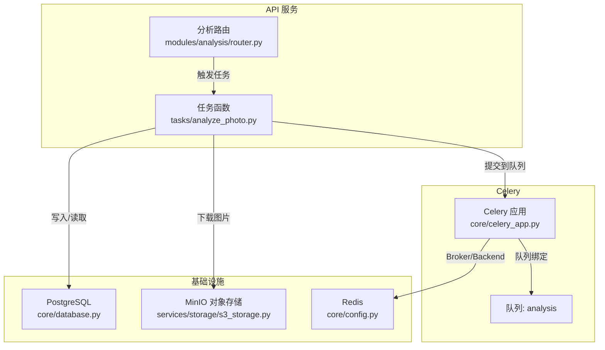
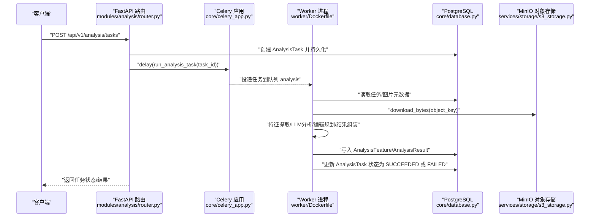
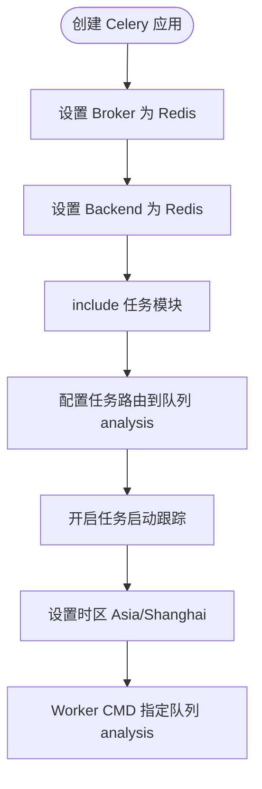
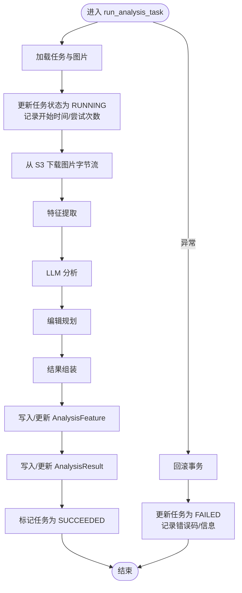
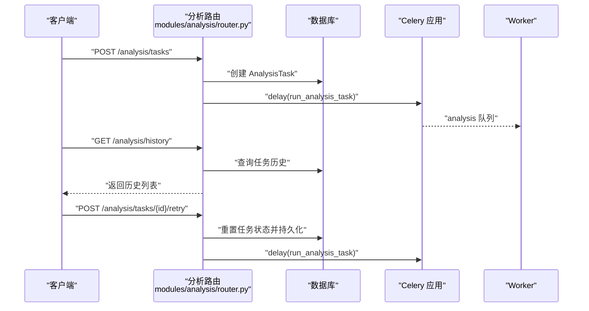
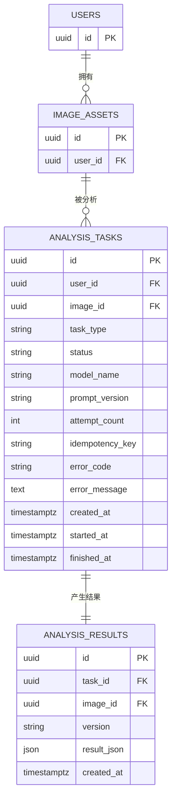
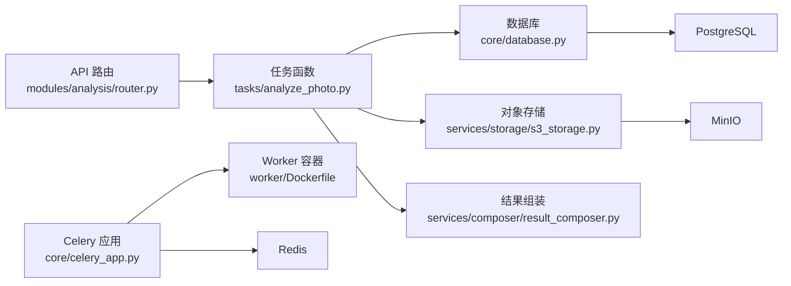

# 异步任务系统

<cite>
**本文引用的文件**
- [apps/api/app/core/celery_app.py](file://apps/api/app/core/celery_app.py)
- [apps/api/app/tasks/analyze_photo.py](file://apps/api/app/tasks/analyze_photo.py)
- [apps/api/app/modules/analysis/router.py](file://apps/api/app/modules/analysis/router.py)
- [apps/api/app/models/analysis_task.py](file://apps/api/app/models/analysis_task.py)
- [apps/api/app/models/analysis_result.py](file://apps/api/app/models/analysis_result.py)
- [apps/api/app/services/composer/result_composer.py](file://apps/api/app/services/composer/result_composer.py)
- [apps/api/app/services/storage/s3_storage.py](file://apps/api/app/services/storage/s3_storage.py)
- [apps/api/app/core/config.py](file://apps/api/app/core/config.py)
- [apps/api/app/core/database.py](file://apps/api/app/core/database.py)
- [apps/api/requirements.txt](file://apps/api/requirements.txt)
- [apps/worker/Dockerfile](file://apps/worker/Dockerfile)
- [infra/docker-compose.yml](file://infra/docker-compose.yml)
- [infra/docker-compose.prod.yml](file://infra/docker-compose.prod.yml)
</cite>

## 目录
1. [简介](#简介)
2. [项目结构](#项目结构)
3. [核心组件](#核心组件)
4. [架构总览](#架构总览)
5. [详细组件分析](#详细组件分析)
6. [依赖分析](#依赖分析)
7. [性能考虑](#性能考虑)
8. [故障排除指南](#故障排除指南)
9. [结论](#结论)
10. [附录](#附录)

## 简介
本文件为“AI摄影教练”项目的异步任务系统技术文档，聚焦于基于 Celery 的分布式任务队列在分析照片任务中的应用。系统采用 Redis 作为消息代理（Broker），并在当前实现中将 Redis 同时用作结果后端（Backend）。PostgreSQL 作为持久化数据库，保存任务元数据与分析结果；MinIO 提供对象存储，用于图片资源的下载与上传。前端通过 API 触发任务，后台 Worker 消费队列并执行分析流程，最终将结果写入数据库。

## 项目结构
围绕异步任务系统的关键目录与文件如下：
- 应用核心
  - 配置：[apps/api/app/core/config.py](file://apps/api/app/core/config.py)
  - 数据库：[apps/api/app/core/database.py](file://apps/api/app/core/database.py)
  - Celery 应用：[apps/api/app/core/celery_app.py](file://apps/api/app/core/celery_app.py)
- 任务定义
  - 分析任务：[apps/api/app/tasks/analyze_photo.py](file://apps/api/app/tasks/analyze_photo.py)
- API 路由
  - 分析模块路由：[apps/api/app/modules/analysis/router.py](file://apps/api/app/modules/analysis/router.py)
- 数据模型
  - 任务模型：[apps/api/app/models/analysis_task.py](file://apps/api/app/models/analysis_task.py)
  - 结果模型：[apps/api/app/models/analysis_result.py](file://apps/api/app/models/analysis_result.py)
- 服务层
  - 结果组装器：[apps/api/app/services/composer/result_composer.py](file://apps/api/app/services/composer/result_composer.py)
  - 存储服务：[apps/api/app/services/storage/s3_storage.py](file://apps/api/app/services/storage/s3_storage.py)
- Worker 部署
  - Worker 容器：[apps/worker/Dockerfile](file://apps/worker/Dockerfile)
- 运维编排
  - 开发环境编排：[infra/docker-compose.yml](file://infra/docker-compose.yml)
  - 生产环境编排：[infra/docker-compose.prod.yml](file://infra/docker-compose.prod.yml)
  - 依赖清单：[apps/api/requirements.txt](file://apps/api/requirements.txt)

图表来源
- [apps/api/app/modules/analysis/router.py:45-74](file://apps/api/app/modules/analysis/router.py#L45-L74)
- [apps/api/app/tasks/analyze_photo.py:19-108](file://apps/api/app/tasks/analyze_photo.py#L19-L108)
- [apps/api/app/core/celery_app.py:5-19](file://apps/api/app/core/celery_app.py#L5-L19)
- [apps/api/app/core/database.py:9-18](file://apps/api/app/core/database.py#L9-L18)
- [apps/api/app/core/config.py:13-14](file://apps/api/app/core/config.py#L13-L14)
- [apps/api/app/services/storage/s3_storage.py:45-50](file://apps/api/app/services/storage/s3_storage.py#L45-L50)

章节来源
- [apps/api/app/core/config.py:13-14](file://apps/api/app/core/config.py#L13-L14)
- [apps/api/app/core/database.py:9-18](file://apps/api/app/core/database.py#L9-L18)
- [apps/api/app/core/celery_app.py:5-19](file://apps/api/app/core/celery_app.py#L5-L19)
- [apps/api/app/tasks/analyze_photo.py:19-108](file://apps/api/app/tasks/analyze_photo.py#L19-L108)
- [apps/api/app/modules/analysis/router.py:45-74](file://apps/api/app/modules/analysis/router.py#L45-L74)
- [apps/api/app/services/composer/result_composer.py:5-23](file://apps/api/app/services/composer/result_composer.py#L5-L23)
- [apps/api/app/services/storage/s3_storage.py:45-50](file://apps/api/app/services/storage/s3_storage.py#L45-L50)
- [apps/worker/Dockerfile](file://apps/worker/Dockerfile#L19)
- [infra/docker-compose.yml:57-67](file://infra/docker-compose.yml#L57-L67)
- [infra/docker-compose.prod.yml:67-76](file://infra/docker-compose.prod.yml#L67-L76)

## 核心组件
- Celery 应用与配置
  - 应用初始化：指定 Broker 与 Backend 为 Redis，并注册分析任务模块。
  - 任务路由：将分析任务绑定到名为 “analysis” 的队列。
  - 其他配置：启用任务启动跟踪、设置时区等。
- 任务函数
  - 接收任务 ID，更新任务状态为 RUNNING，记录开始时间与尝试次数。
  - 下载图片字节流，调用特征提取、LLM 分析、编辑规划与结果组装。
  - 将中间特征与最终结果写入数据库，成功则标记为 SUCCEEDED，失败则回滚并记录错误。
- API 路由
  - 创建任务：校验图片归属，写入任务记录，立即投递分析任务到队列。
  - 查询任务详情与历史：支持分页查询与摘要提取。
  - 重试任务：仅 FAILED/SUCCEEDED 的任务允许重试，重置状态并重新投递。
- 数据模型
  - AnalysisTask：任务元数据、状态、错误信息、时间戳等。
  - AnalysisResult：与任务一一对应的分析结果 JSON 及版本号。
- 服务层
  - ResultComposer：统一组装结果结构，包含摘要、建议、评分、标注与编辑动作。
  - S3StorageService：封装 MinIO 客户端，提供桶存在性检查、上传与下载。
- 部署与运行
  - Worker 容器：以 Celery Worker 方式启动，监听 “analysis” 队列。
  - 编排文件：开发与生产环境均声明 PostgreSQL、Redis、MinIO 与 API/Worker 服务。

章节来源
- [apps/api/app/core/celery_app.py:5-19](file://apps/api/app/core/celery_app.py#L5-L19)
- [apps/api/app/tasks/analyze_photo.py:19-108](file://apps/api/app/tasks/analyze_photo.py#L19-L108)
- [apps/api/app/modules/analysis/router.py:45-151](file://apps/api/app/modules/analysis/router.py#L45-L151)
- [apps/api/app/models/analysis_task.py:10-36](file://apps/api/app/models/analysis_task.py#L10-L36)
- [apps/api/app/models/analysis_result.py:10-28](file://apps/api/app/models/analysis_result.py#L10-L28)
- [apps/api/app/services/composer/result_composer.py:5-23](file://apps/api/app/services/composer/result_composer.py#L5-L23)
- [apps/api/app/services/storage/s3_storage.py:11-50](file://apps/api/app/services/storage/s3_storage.py#L11-L50)
- [apps/worker/Dockerfile](file://apps/worker/Dockerfile#L19)
- [infra/docker-compose.yml:57-67](file://infra/docker-compose.yml#L57-L67)
- [infra/docker-compose.prod.yml:67-76](file://infra/docker-compose.prod.yml#L67-L76)

## 架构总览
下图展示从 API 到 Worker 的完整异步调用链路，以及与数据库、对象存储的交互。

图表来源
- [apps/api/app/modules/analysis/router.py:45-74](file://apps/api/app/modules/analysis/router.py#L45-L74)
- [apps/api/app/core/celery_app.py:5-19](file://apps/api/app/core/celery_app.py#L5-L19)
- [apps/worker/Dockerfile](file://apps/worker/Dockerfile#L19)
- [apps/api/app/tasks/analyze_photo.py:19-108](file://apps/api/app/tasks/analyze_photo.py#L19-L108)
- [apps/api/app/core/database.py:9-18](file://apps/api/app/core/database.py#L9-L18)
- [apps/api/app/services/storage/s3_storage.py:45-50](file://apps/api/app/services/storage/s3_storage.py#L45-L50)

## 详细组件分析

### 组件一：Celery 应用与任务路由
- 初始化要点
  - Broker 与 Backend 使用同一 Redis 实例。
  - 注册任务模块，确保 Worker 可发现任务。
  - 通过路由将分析任务绑定到 “analysis” 队列，便于隔离与扩展。
- 配置要点
  - 启动跟踪：便于追踪任务生命周期。
  - 时区：设置为 Asia/Shanghai，避免 UTC 时间差异带来的误解。
- Worker 启动
  - CMD 指定队列名称，确保只消费分析任务。

图表来源
- [apps/api/app/core/celery_app.py:5-19](file://apps/api/app/core/celery_app.py#L5-L19)
- [apps/worker/Dockerfile](file://apps/worker/Dockerfile#L19)

章节来源
- [apps/api/app/core/celery_app.py:5-19](file://apps/api/app/core/celery_app.py#L5-L19)
- [apps/worker/Dockerfile](file://apps/worker/Dockerfile#L19)

### 组件二：分析任务执行流程
- 关键步骤
  - 读取任务与图片，更新状态为 RUNNING，记录开始时间与尝试次数。
  - 从对象存储下载图片字节流。
  - 依次调用特征提取、LLM 分析、编辑规划与结果组装。
  - 写入或更新 AnalysisFeature 与 AnalysisResult，最后将任务标记为 SUCCEEDED。
  - 异常时回滚事务，记录错误码与错误信息，标记为 FAILED。
- 数据一致性
  - 使用 SQLAlchemy 会话管理事务，异常回滚，finally 关闭会话。
  - 特征与结果按任务 ID 去重更新，保证幂等。

图表来源
- [apps/api/app/tasks/analyze_photo.py:19-108](file://apps/api/app/tasks/analyze_photo.py#L19-L108)
- [apps/api/app/services/storage/s3_storage.py:45-50](file://apps/api/app/services/storage/s3_storage.py#L45-L50)
- [apps/api/app/services/composer/result_composer.py:5-23](file://apps/api/app/services/composer/result_composer.py#L5-L23)

章节来源
- [apps/api/app/tasks/analyze_photo.py:19-108](file://apps/api/app/tasks/analyze_photo.py#L19-L108)

### 组件三：API 路由与任务生命周期
- 创建任务
  - 校验图片归属，创建 AnalysisTask 并持久化。
  - 立即投递 run_analysis_task 到队列，返回任务初始状态。
- 查询任务详情与历史
  - 支持按用户维度查询，历史接口可提取摘要字段。
- 重试任务
  - 仅 FAILED/SUCCEEDED 的任务允许重试，重置状态并重新投递。

图表来源
- [apps/api/app/modules/analysis/router.py:45-151](file://apps/api/app/modules/analysis/router.py#L45-L151)

章节来源
- [apps/api/app/modules/analysis/router.py:45-151](file://apps/api/app/modules/analysis/router.py#L45-L151)

### 组件四：数据模型与索引设计
- AnalysisTask
  - 字段覆盖任务类型、状态、错误信息、时间戳、尝试次数等。
  - 复合索引覆盖用户与创建时间、状态与创建时间，便于查询与排序。
- AnalysisResult
  - 与任务一对一关联，JSON 字段存储结果，包含 GIN 索引以优化查询。
- 设计意图
  - 通过索引提升历史查询与摘要提取效率。
  - JSON 字段便于承载多版本结果，配合版本号字段进行演进。

图表来源
- [apps/api/app/models/analysis_task.py:10-36](file://apps/api/app/models/analysis_task.py#L10-L36)
- [apps/api/app/models/analysis_result.py:10-28](file://apps/api/app/models/analysis_result.py#L10-L28)

章节来源
- [apps/api/app/models/analysis_task.py:10-36](file://apps/api/app/models/analysis_task.py#L10-L36)
- [apps/api/app/models/analysis_result.py:10-28](file://apps/api/app/models/analysis_result.py#L10-L28)

### 组件五：服务层与外部集成
- ResultComposer
  - 组装统一结果结构，包含版本、摘要、建议、评分、标注与编辑动作。
- S3StorageService
  - 初始化客户端，确保桶存在，提供上传与下载方法，异常统一转换为 HTTP 503。
- 缓存与单例
  - 使用 LRU 缓存的工厂函数提供单例实例，减少重复初始化成本。

章节来源
- [apps/api/app/services/composer/result_composer.py:5-23](file://apps/api/app/services/composer/result_composer.py#L5-L23)
- [apps/api/app/services/storage/s3_storage.py:11-50](file://apps/api/app/services/storage/s3_storage.py#L11-L50)

### 组件六：Worker 部署与监控
- Worker 容器
  - 基于 Python 3.12 Slim，安装依赖后以 Celery Worker 方式启动，监听 “analysis” 队列。
- 编排文件
  - 开发与生产环境均声明 PostgreSQL、Redis、MinIO 与 API/Worker 服务。
  - API/Worker 服务依赖上述基础设施健康检查，确保顺序启动与可用性。
- 监控建议
  - 使用 Redis CLI 或可视化工具查看队列长度与任务积压。
  - 在生产环境为 API/Worker 添加健康检查端点，结合容器编排重启策略。

章节来源
- [apps/worker/Dockerfile](file://apps/worker/Dockerfile#L19)
- [infra/docker-compose.yml:78-101](file://infra/docker-compose.yml#L78-L101)
- [infra/docker-compose.prod.yml:98-122](file://infra/docker-compose.prod.yml#L98-L122)

## 依赖分析
- 组件耦合
  - API 路由依赖任务函数与数据库会话；任务函数依赖数据库、对象存储与各分析服务。
  - Celery 应用与配置集中管理，Worker 通过队列路由与之解耦。
- 外部依赖
  - Redis：消息代理与结果后端。
  - PostgreSQL：持久化任务与结果。
  - MinIO：图片资源存储。
- 依赖关系图

图表来源
- [apps/api/app/modules/analysis/router.py:45-151](file://apps/api/app/modules/analysis/router.py#L45-L151)
- [apps/api/app/tasks/analyze_photo.py:19-108](file://apps/api/app/tasks/analyze_photo.py#L19-L108)
- [apps/api/app/core/celery_app.py:5-19](file://apps/api/app/core/celery_app.py#L5-L19)
- [apps/worker/Dockerfile](file://apps/worker/Dockerfile#L19)
- [apps/api/app/core/database.py:9-18](file://apps/api/app/core/database.py#L9-L18)
- [apps/api/app/services/storage/s3_storage.py:11-50](file://apps/api/app/services/storage/s3_storage.py#L11-L50)
- [apps/api/app/services/composer/result_composer.py:5-23](file://apps/api/app/services/composer/result_composer.py#L5-L23)

章节来源
- [apps/api/app/core/celery_app.py:5-19](file://apps/api/app/core/celery_app.py#L5-L19)
- [apps/api/app/tasks/analyze_photo.py:19-108](file://apps/api/app/tasks/analyze_photo.py#L19-L108)
- [apps/api/app/modules/analysis/router.py:45-151](file://apps/api/app/modules/analysis/router.py#L45-L151)
- [apps/api/app/core/database.py:9-18](file://apps/api/app/core/database.py#L9-L18)
- [apps/api/app/services/storage/s3_storage.py:11-50](file://apps/api/app/services/storage/s3_storage.py#L11-L50)
- [apps/api/app/services/composer/result_composer.py:5-23](file://apps/api/app/services/composer/result_composer.py#L5-L23)
- [apps/worker/Dockerfile](file://apps/worker/Dockerfile#L19)

## 性能考虑
- 并发与队列隔离
  - 当前将分析任务路由至 “analysis” 队列，便于独立扩容 Worker。
  - 建议根据业务峰值增加 Worker 数量，或拆分更多专用队列（如 “feature”, “llm”, “compose”）以进一步隔离热点。
- 数据库连接池与事务
  - 使用 SQLAlchemy 会话管理，避免长事务；在任务中尽量缩短持有连接的时间。
  - 对高频查询建立合适索引（已见模型索引），避免全表扫描。
- 对象存储访问
  - S3 客户端配置了超时与重试参数，建议在高并发场景下限制并发下载/上传数量，避免打满网络带宽。
- 结果后端选择
  - 当前 Redis 同时承担 Broker 与 Backend，建议在生产环境中将 Backend 迁移至更稳定的持久化存储（如 Redis 或专用结果存储），以降低内存抖动对 Broker 的影响。
- 缓存与复用
  - 服务层普遍使用 LRU 缓存工厂函数，减少重复初始化开销。
- 任务幂等与去重
  - 任务尝试次数与幂等键字段存在，可在路由层或任务内部加入去重逻辑，避免重复执行。

[本节为通用性能建议，不直接分析具体文件]

## 故障排除指南
- 任务未被消费
  - 检查 Worker 是否正确监听 “analysis” 队列，确认容器日志与编排健康检查。
  - 确认 Redis 可达且队列中是否存在任务积压。
- 任务执行失败
  - 查看任务记录的错误码与错误信息字段，定位具体异常类型与描述。
  - 在任务函数的异常分支中，确保回滚与状态更新已执行。
- 图片下载失败
  - 检查 S3 客户端配置、桶权限与对象键是否存在。
  - 关注客户端超时与重试配置，必要时调整网络参数。
- 数据库连接问题
  - 确认 PostgreSQL 健康检查通过，连接字符串与凭据正确。
  - 检查连接池参数与并发上限，避免连接耗尽。
- 结果后端不可用
  - 若使用 Redis 作为 Backend，需确保其内存充足且无阻塞操作。
  - 考虑迁移 Backend 至更稳定的持久化方案。

章节来源
- [apps/api/app/tasks/analyze_photo.py:97-107](file://apps/api/app/tasks/analyze_photo.py#L97-L107)
- [apps/api/app/services/storage/s3_storage.py:45-50](file://apps/api/app/services/storage/s3_storage.py#L45-L50)
- [apps/worker/Dockerfile](file://apps/worker/Dockerfile#L19)
- [infra/docker-compose.yml:78-101](file://infra/docker-compose.yml#L78-L101)
- [infra/docker-compose.prod.yml:98-122](file://infra/docker-compose.prod.yml#L98-L122)

## 结论
该异步任务系统以 Celery + Redis + PostgreSQL + MinIO 为基础，实现了从 API 触发到 Worker 执行再到结果落库的完整闭环。通过队列隔离与任务状态机，系统具备良好的可扩展性与可观测性。建议在生产环境中完善结果后端、引入更细粒度的队列与监控告警，并持续优化数据库索引与外部依赖的连接参数，以获得更稳定的吞吐与更低的延迟。

[本节为总结性内容，不直接分析具体文件]

## 附录
- 依赖清单
  - 关键依赖包括 FastAPI、SQLAlchemy、Celery、Redis、boto3、Pillow 等。
- 开发与生产编排
  - 开发环境与生产环境均声明 PostgreSQL、Redis、MinIO 与 API/Worker 服务，API/Worker 依赖基础设施健康检查。

章节来源
- [apps/api/requirements.txt:1-19](file://apps/api/requirements.txt#L1-L19)
- [infra/docker-compose.yml:57-67](file://infra/docker-compose.yml#L57-L67)
- [infra/docker-compose.prod.yml:67-76](file://infra/docker-compose.prod.yml#L67-L76)