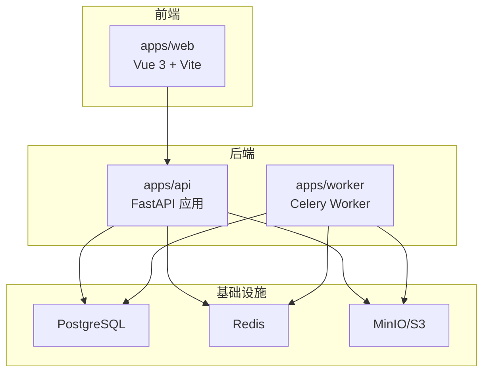
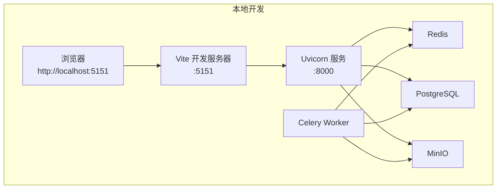
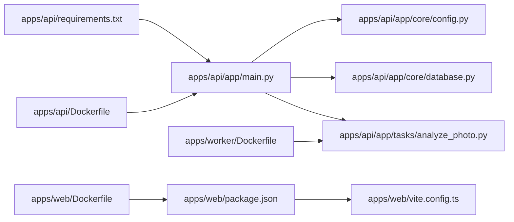

# 快速开始

<cite>
**本文引用的文件**
- [README.md](file://README.md)
- [docker-compose.yml](file://infra/docker-compose.yml)
- [docker-compose.prod.yml](file://infra/docker-compose.prod.yml)
- [Dockerfile（API）](file://apps/api/Dockerfile)
- [Dockerfile（Worker）](file://apps/worker/Dockerfile)
- [Dockerfile（Web）](file://apps/web/Dockerfile)
- [requirements.txt（API）](file://apps/api/requirements.txt)
- [package.json（Web）](file://apps/web/package.json)
- [vite.config.ts（Web）](file://apps/web/vite.config.ts)
- [main.py（API）](file://apps/api/app/main.py)
- [config.py（API 核心配置）](file://apps/api/app/core/config.py)
- [database.py（API 数据库初始化）](file://apps/api/app/core/database.py)
- [security.py（API 安全与认证）](file://apps/api/app/core/security.py)
- [analyze_photo.py（API 分析任务）](file://apps/api/app/tasks/analyze_photo.py)
</cite>

## 目录
1. [简介](#简介)
2. [项目结构](#项目结构)
3. [核心组件](#核心组件)
4. [架构总览](#架构总览)
5. [详细组件分析](#详细组件分析)
6. [依赖关系分析](#依赖关系分析)
7. [性能注意事项](#性能注意事项)
8. [故障排除指南](#故障排除指南)
9. [结论](#结论)
10. [附录](#附录)

## 简介
本指南面向新手开发者，帮助你在最短时间内完成 AI 摄影教练项目的本地开发与一键部署。你将获得：
- 环境要求与前置条件（Python 3.12、Node.js、Docker 等）
- 从克隆仓库到启动开发服务器的完整步骤
- 本地开发环境配置与示例
- 使用 Docker Compose 的一键部署流程
- 常见安装问题的排查与解决思路

## 项目结构
该项目采用多应用分层结构，包含：
- Web 前端（Vue 3 + Vite）
- API 后端（FastAPI + Celery + Redis + PostgreSQL + MinIO）
- Worker（Celery Worker）
- 基础设施编排（Docker Compose）

图表来源
- [docker-compose.yml:1-107](file://infra/docker-compose.yml#L1-L107)
- [main.py（API）:1-36](file://apps/api/app/main.py#L1-L36)
- [Dockerfile（API）:1-23](file://apps/api/Dockerfile#L1-L23)
- [Dockerfile（Worker）:1-20](file://apps/worker/Dockerfile#L1-L20)
- [Dockerfile（Web）:1-22](file://apps/web/Dockerfile#L1-L22)

章节来源
- [README.md:34-52](file://README.md#L34-L52)

## 核心组件
- Web 前端：基于 Vue 3 与 Vite，开发端口 5151，默认代理到后端 API。
- API 服务：FastAPI 提供 REST 接口，支持健康检查、CORS、数据库初始化与路由注册。
- Worker：Celery Worker 处理异步分析任务，队列名为 analysis。
- 基础设施：PostgreSQL、Redis、MinIO，通过 Docker Compose 编排。

章节来源
- [package.json（Web）:1-26](file://apps/web/package.json#L1-L26)
- [vite.config.ts（Web）:1-26](file://apps/web/vite.config.ts#L1-L26)
- [main.py（API）:1-36](file://apps/api/app/main.py#L1-L36)
- [docker-compose.yml:1-107](file://infra/docker-compose.yml#L1-L107)

## 架构总览
下图展示了本地开发与生产部署两种场景下的系统交互：

图表来源
- [docker-compose.yml:1-107](file://infra/docker-compose.yml#L1-L107)
- [vite.config.ts（Web）:1-26](file://apps/web/vite.config.ts#L1-L26)
- [main.py（API）:1-36](file://apps/api/app/main.py#L1-L36)
- [Dockerfile（API）:1-23](file://apps/api/Dockerfile#L1-L23)
- [Dockerfile（Worker）:1-20](file://apps/worker/Dockerfile#L1-L20)

## 详细组件分析

### 环境要求与前置条件
- Python 3.12：用于后端 API 与 Worker 的运行时。
- Node.js 22：用于前端开发与构建。
- Docker 与 Docker Compose：用于一键编排与部署。
- Git：用于克隆仓库。

章节来源
- [Dockerfile（API）:1-23](file://apps/api/Dockerfile#L1-L23)
- [Dockerfile（Worker）:1-20](file://apps/worker/Dockerfile#L1-L20)
- [Dockerfile（Web）:1-22](file://apps/web/Dockerfile#L1-L22)
- [README.md:151-157](file://README.md#L151-L157)

### 本地开发环境搭建

#### 步骤一：克隆仓库
- 使用 Git 克隆项目到本地目录。

章节来源
- [README.md:1-216](file://README.md#L1-L216)

#### 步骤二：启动基础服务（可选）
- 若希望使用本地 Docker 网络快速启动，可直接使用 Compose 文件启动所有依赖服务（PostgreSQL、Redis、MinIO）。
- 命令参考：在根目录执行 docker compose 并指定 infra/docker-compose.yml。

章节来源
- [README.md:98-102](file://README.md#L98-L102)
- [docker-compose.yml:1-107](file://infra/docker-compose.yml#L1-L107)

#### 步骤三：启动前端开发服务器
- 进入 apps/web 目录，安装依赖并启动开发服务器。
- 默认访问地址：http://localhost:5151
- Vite 将代理 /api 与 /healthz 到后端 API 地址。

章节来源
- [README.md:84-90](file://README.md#L84-L90)
- [package.json（Web）:6-10](file://apps/web/package.json#L6-L10)
- [vite.config.ts（Web）:1-26](file://apps/web/vite.config.ts#L1-L26)

#### 步骤四：启动后端 API 服务
- 在 apps/api 目录下安装 Python 依赖并启动服务。
- 默认访问地址：
  - API 文档：http://localhost:8000/docs
  - 健康检查：http://localhost:8000/healthz
- MinIO 控制台：http://localhost:9001

章节来源
- [README.md:96-111](file://README.md#L96-L111)
- [requirements.txt（API）:1-19](file://apps/api/requirements.txt#L1-L19)
- [main.py（API）:1-36](file://apps/api/app/main.py#L1-L36)

#### 步骤五：启动 Celery Worker
- 在 apps/api 目录下启动 Celery Worker，监听 analysis 队列。
- 确保 Redis 可用，以便任务调度。

章节来源
- [Dockerfile（Worker）:1-20](file://apps/worker/Dockerfile#L1-L20)
- [analyze_photo.py（API 分析任务）:1-108](file://apps/api/app/tasks/analyze_photo.py#L1-L108)

### 本地开发环境配置

#### 环境变量与配置文件
- 后端配置通过 pydantic-settings 读取 .env 文件，支持数据库、Redis、S3、CORS、JWT 等参数。
- 常用变量包括：DB_URL、REDIS_URL、S3_ENDPOINT、S3_ACCESS_KEY、S3_SECRET_KEY、S3_BUCKET、S3_REGION、MODEL_NAME、PROMPT_VERSION、CORS_ORIGINS。
- CORS 默认允许前端开发端口（5151）与后端端口（8000）。

章节来源
- [config.py（API 核心配置）:1-47](file://apps/api/app/core/config.py#L1-L47)
- [README.md:112-126](file://README.md#L112-L126)

#### 数据库初始化与增量更新
- 应用启动时会创建表并执行开发环境的增量更新（如添加列、索引等）。

章节来源
- [database.py（API 数据库初始化）:1-51](file://apps/api/app/core/database.py#L1-L51)

#### 认证与安全
- 支持 JWT 访问/刷新令牌，密码使用 bcrypt 哈希。
- 提供令牌校验与过期处理。

章节来源
- [security.py（API 安全与认证）:1-72](file://apps/api/app/core/security.py#L1-L72)

### Docker Compose 一键部署

#### 本地开发一键启动
- 在根目录执行 docker compose 并指定 infra/docker-compose.yml。
- 该文件定义了 PostgreSQL、Redis、MinIO、API、Worker 服务及其依赖关系与环境变量。

章节来源
- [README.md:98-102](file://README.md#L98-L102)
- [docker-compose.yml:1-107](file://infra/docker-compose.yml#L1-L107)

#### 生产环境一键部署
- 使用 infra/docker-compose.prod.yml 进行生产部署，前端与 API 通过 Nginx 提供服务。
- 部署前需复制并编辑环境文件，设置服务器 IP、数据库与 S3 密钥等敏感信息。
- 健康检查与日志查看命令已在 README 中给出。

章节来源
- [README.md:139-215](file://README.md#L139-L215)
- [docker-compose.prod.yml:1-128](file://infra/docker-compose.prod.yml#L1-L128)

## 依赖关系分析

图表来源
- [package.json（Web）:1-26](file://apps/web/package.json#L1-L26)
- [vite.config.ts（Web）:1-26](file://apps/web/vite.config.ts#L1-L26)
- [requirements.txt（API）:1-19](file://apps/api/requirements.txt#L1-L19)
- [main.py（API）:1-36](file://apps/api/app/main.py#L1-L36)
- [config.py（API 核心配置）:1-47](file://apps/api/app/core/config.py#L1-L47)
- [database.py（API 数据库初始化）:1-51](file://apps/api/app/core/database.py#L1-L51)
- [analyze_photo.py（API 分析任务）:1-108](file://apps/api/app/tasks/analyze_photo.py#L1-L108)
- [Dockerfile（API）:1-23](file://apps/api/Dockerfile#L1-L23)
- [Dockerfile（Worker）:1-20](file://apps/worker/Dockerfile#L1-L20)
- [Dockerfile（Web）:1-22](file://apps/web/Dockerfile#L1-L22)

## 性能注意事项
- 使用 Docker Compose 编排可减少本地环境差异带来的性能波动。
- 前端开发服务器启用代理，避免跨域问题；生产环境由 Nginx 统一处理静态资源与反向代理。
- Celery Worker 仅监听 analysis 队列，建议按任务类型拆分队列以提升并发与隔离性。

## 故障排除指南

- Docker 拉取超时
  - 现象：镜像拉取失败或超时。
  - 处理：配置 Docker 镜像加速源，使用 docker info 验证连接状态。
  
  章节来源
  - [README.md:209-215](file://README.md#L209-L215)

- docker compose 无法连接守护进程
  - 现象：提示无法连接 Docker 守护进程。
  - 处理：检查 docker.service、docker.socket 以及 /run/docker.sock 权限与状态。

  章节来源
  - [README.md:209-215](file://README.md#L209-L215)

- 页面可打开但 /healthz 返回 504
  - 现象：首页正常，健康检查接口异常。
  - 处理：优先查看 api、postgres、minio 的日志，定位单个服务问题后再调整配置。

  章节来源
  - [README.md:209-215](file://README.md#L209-L215)

- 前端无法访问后端 API
  - 现象：浏览器控制台出现跨域错误或请求被拒绝。
  - 处理：确认 VITE_DEV_API_PROXY_TARGET 设置正确，或在 .env 中配置 CORS_ORIGINS 包含前端地址。

  章节来源
  - [vite.config.ts（Web）:1-26](file://apps/web/vite.config.ts#L1-L26)
  - [config.py（API 核心配置）:25-28](file://apps/api/app/core/config.py#L25-L28)

- 数据库迁移或表结构变更导致异常
  - 现象：启动时报错或字段缺失。
  - 处理：确认数据库初始化脚本已执行，必要时手动执行增量更新语句。

  章节来源
  - [database.py（API 数据库初始化）:28-51](file://apps/api/app/core/database.py#L28-L51)

## 结论
通过本指南，你可以快速完成本地开发环境搭建与一键部署。建议优先使用 Docker Compose 进行本地联调，确保前后端与基础设施的一致性；生产部署时遵循 README 中的生产流程与健康检查命令，便于运维与排障。

## 附录

### 常用命令清单
- 启动本地开发：在根目录执行 docker compose 并指定 infra/docker-compose.yml。
- 前端开发：进入 apps/web，安装依赖并启动开发服务器。
- 后端开发：进入 apps/api，安装依赖并启动服务。
- Worker：在 apps/api 目录下启动 Celery Worker。
- 生产部署：复制并编辑 .env.prod，执行部署脚本。

章节来源
- [README.md:82-111](file://README.md#L82-L111)
- [README.md:139-215](file://README.md#L139-L215)