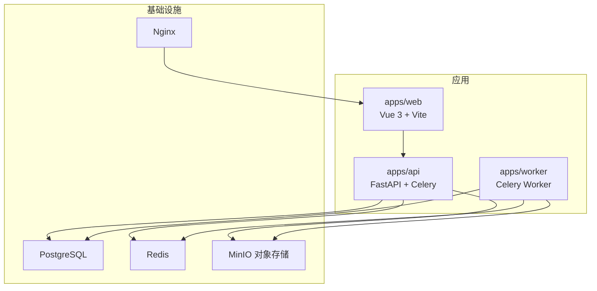
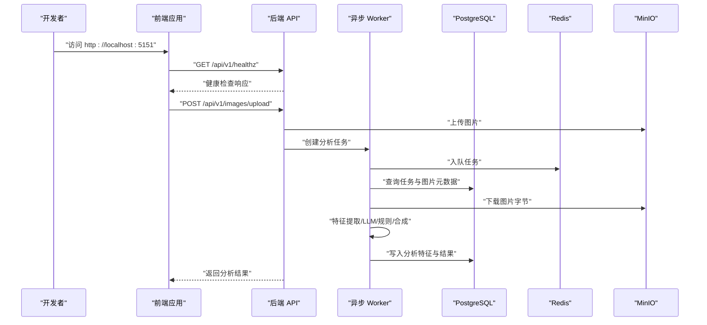
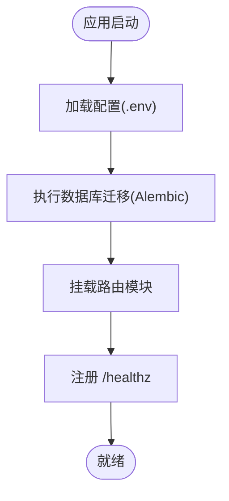
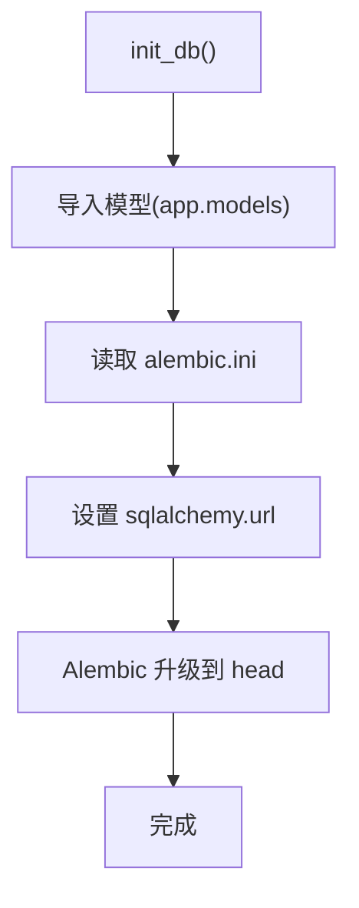
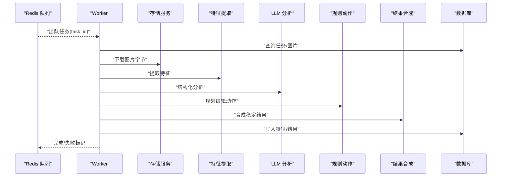

# 快速开始

<cite>
**本文引用的文件**
- [apps/api/Dockerfile](file://apps/api/Dockerfile)
- [apps/web/Dockerfile](file://apps/web/Dockerfile)
- [infra/docker-compose.yml](file://infra/docker-compose.yml)
- [apps/api/requirements.txt](file://apps/api/requirements.txt)
- [apps/web/package.json](file://apps/web/package.json)
- [apps/api/alembic.ini](file://apps/api/alembic.ini)
- [apps/api/app/core/config.py](file://apps/api/app/core/config.py)
- [apps/api/app/main.py](file://apps/api/app/main.py)
- [apps/api/app/core/database.py](file://apps/api/app/core/database.py)
- [apps/api/app/tasks/analyze_photo.py](file://apps/api/app/tasks/analyze_photo.py)
- [apps/api/app/services/ai/analyzer.py](file://apps/api/app/services/ai/analyzer.py)
- [apps/api/app/services/composer/result_composer.py](file://apps/api/app/services/composer/result_composer.py)
- [apps/web/vite.config.ts](file://apps/web/vite.config.ts)
- [apps/web/src/env.d.ts](file://apps/web/src/env.d.ts)
- [docs/architecture-v2.md](file://docs/architecture-v2.md)
- [infra/deploy.sh](file://infra/deploy.sh)
</cite>

## 目录
1. [简介](#简介)
2. [项目结构](#项目结构)
3. [核心组件](#核心组件)
4. [架构总览](#架构总览)
5. [详细组件分析](#详细组件分析)
6. [依赖分析](#依赖分析)
7. [性能考虑](#性能考虑)
8. [故障排除指南](#故障排除指南)
9. [结论](#结论)
10. [附录](#附录)

## 简介
本指南面向新加入的开发者，帮助你在最短时间内完成本地开发环境搭建，成功运行 AI 摄影教练项目（后端 API、前端 Web、异步 Worker 以及数据库、缓存、对象存储等依赖）。你将获得：
- 环境准备清单（Python、Node.js、Docker）
- 本地开发环境搭建步骤（数据库初始化、API 服务启动、前端应用运行）
- 完整命令行示例与关键配置说明
- 常见问题与故障排除建议

## 项目结构
项目采用多仓（multi-app）组织方式，包含三个主要应用与基础设施：
- apps/api：FastAPI 后端 API 与 Celery Worker
- apps/web：Vue 3 + Vite 前端
- apps/worker：独立的 Celery Worker 容器
- infra：Docker Compose 编排与 Nginx 配置
- docs：架构文档
- packages/contracts：跨模块契约（JSON Schema）

图表来源
- [infra/docker-compose.yml:1-107](file://infra/docker-compose.yml#L1-L107)
- [apps/api/Dockerfile:1-23](file://apps/api/Dockerfile#L1-L23)
- [apps/web/Dockerfile:1-22](file://apps/web/Dockerfile#L1-L22)

章节来源
- [docs/architecture-v2.md:73-105](file://docs/architecture-v2.md#L73-L105)

## 核心组件
- 后端 API（FastAPI）
  - 路由：图像、分析、认证、用户
  - 中间件：CORS
  - 启动事件：应用启动时执行数据库迁移
- 数据库与迁移
  - SQLAlchemy 引擎与会话工厂
  - Alembic 迁移配置与执行
- 异步任务（Celery）
  - 分析任务：特征提取 → LLM 分析 → 规则动作规划 → 结果合成
- 前端（Vue 3 + Vite）
  - 开发服务器：端口 5151，代理到后端 8000
  - 与后端通过 /api 前缀通信
- 基础设施编排（Docker Compose）
  - PostgreSQL、Redis、MinIO、API、Worker、Nginx
  - 环境变量集中管理

章节来源
- [apps/api/app/main.py:1-36](file://apps/api/app/main.py#L1-L36)
- [apps/api/app/core/database.py:1-39](file://apps/api/app/core/database.py#L1-L39)
- [apps/api/app/tasks/analyze_photo.py:1-108](file://apps/api/app/tasks/analyze_photo.py#L1-L108)
- [apps/web/vite.config.ts:1-26](file://apps/web/vite.config.ts#L1-L26)
- [infra/docker-compose.yml:1-107](file://infra/docker-compose.yml#L1-L107)

## 架构总览
下图展示了本地开发时各组件之间的交互关系与数据流向。

图表来源
- [apps/api/app/tasks/analyze_photo.py:19-108](file://apps/api/app/tasks/analyze_photo.py#L19-L108)
- [apps/api/app/services/composer/result_composer.py:5-99](file://apps/api/app/services/composer/result_composer.py#L5-L99)
- [apps/api/app/services/ai/analyzer.py:10-27](file://apps/api/app/services/ai/analyzer.py#L10-L27)
- [apps/api/app/core/database.py:27-39](file://apps/api/app/core/database.py#L27-L39)
- [infra/docker-compose.yml:50-101](file://infra/docker-compose.yml#L50-L101)

## 详细组件分析

### 后端 API（FastAPI）
- 启动与路由
  - 在应用启动事件中执行数据库迁移，确保模式一致
  - 注册图像、分析、认证、用户模块路由，前缀为 /api/v1
- 配置与环境
  - 从 .env 读取设置，支持 CORS 来源列表
  - 默认连接本地 PostgreSQL、Redis、MinIO
- 健康检查
  - 提供 /healthz 接口用于存活探测

图表来源
- [apps/api/app/main.py:27-36](file://apps/api/app/main.py#L27-L36)
- [apps/api/app/core/database.py:27-39](file://apps/api/app/core/database.py#L27-L39)
- [apps/api/app/core/config.py:6-47](file://apps/api/app/core/config.py#L6-L47)

章节来源
- [apps/api/app/main.py:1-36](file://apps/api/app/main.py#L1-L36)
- [apps/api/app/core/config.py:1-47](file://apps/api/app/core/config.py#L1-L47)
- [apps/api/app/core/database.py:1-39](file://apps/api/app/core/database.py#L1-L39)

### 数据库与迁移（SQLAlchemy + Alembic）
- 初始化流程
  - 创建引擎与会话工厂
  - 读取 alembic.ini 并设置 sqlalchemy.url
  - 升级到最新版本（head）
- 迁移配置
  - script_location 指向 app/migrations
  - prepend_sys_path 保证导入模型

图表来源
- [apps/api/app/core/database.py:27-39](file://apps/api/app/core/database.py#L27-L39)
- [apps/api/alembic.ini:1-147](file://apps/api/alembic.ini#L1-L147)

章节来源
- [apps/api/app/core/database.py:1-39](file://apps/api/app/core/database.py#L1-L39)
- [apps/api/alembic.ini:1-147](file://apps/api/alembic.ini#L1-L147)

### 异步任务（Celery）
- 任务入口
  - run_analysis_task：接收任务 ID，更新任务状态，下载图片，执行特征提取、LLM 分析、规则动作规划与结果合成，最后写入分析特征与结果
- 依赖注入
  - 通过服务工厂函数获取存储、CV、LLM、规则与结果合成器实例

图表来源
- [apps/api/app/tasks/analyze_photo.py:19-108](file://apps/api/app/tasks/analyze_photo.py#L19-L108)
- [apps/api/app/services/ai/analyzer.py:10-27](file://apps/api/app/services/ai/analyzer.py#L10-L27)
- [apps/api/app/services/composer/result_composer.py:5-99](file://apps/api/app/services/composer/result_composer.py#L5-L99)

章节来源
- [apps/api/app/tasks/analyze_photo.py:1-108](file://apps/api/app/tasks/analyze_photo.py#L1-L108)
- [apps/api/app/services/ai/analyzer.py:1-27](file://apps/api/app/services/ai/analyzer.py#L1-L27)
- [apps/api/app/services/composer/result_composer.py:1-99](file://apps/api/app/services/composer/result_composer.py#L1-L99)

### 前端（Vue 3 + Vite）
- 开发服务器
  - 端口 5151，代理 /api 与 /healthz 到后端 8000
- 类型声明
  - 支持 .vue 模块声明

章节来源
- [apps/web/vite.config.ts:1-26](file://apps/web/vite.config.ts#L1-L26)
- [apps/web/src/env.d.ts:1-9](file://apps/web/src/env.d.ts#L1-L9)

### 基础设施编排（Docker Compose）
- 服务
  - postgres、redis、minio：提供数据库、缓存与对象存储
  - api：后端 API，暴露 8000
  - worker：异步 Worker
- 环境变量
  - 数据库、Redis、S3 等连接参数
  - CORS 允许的前端地址
- 健康检查
  - postgres、redis、minio 提供健康检查指令

章节来源
- [infra/docker-compose.yml:1-107](file://infra/docker-compose.yml#L1-L107)

## 依赖分析
- 后端依赖
  - FastAPI、SQLAlchemy、Celery、Redis、PostgreSQL、Boto3（S3）、Pydantic Settings、Alembic、Pillow、Passlib、HTTPX、pytest 等
- 前端依赖
  - Vue 3、Vue Router、Pinia、Axios、Vite、TypeScript
- 容器镜像
  - Python 3.12 slim（后端）
  - Node 22 Alpine（前端构建），Nginx 1.27 Alpine（静态资源服务）

章节来源
- [apps/api/requirements.txt:1-19](file://apps/api/requirements.txt#L1-L19)
- [apps/web/package.json:1-26](file://apps/web/package.json#L1-L26)
- [apps/api/Dockerfile:1-23](file://apps/api/Dockerfile#L1-L23)
- [apps/web/Dockerfile:1-22](file://apps/web/Dockerfile#L1-L22)

## 性能考虑
- 数据库连接池与预检
  - 使用 pool_pre_ping，提升连接稳定性
- 异步任务并发
  - 通过 Redis 队列与多个 Worker 实例实现水平扩展
- 存储与网络
  - MinIO 作为 S3 兼容对象存储，注意网络带宽与延迟对分析任务的影响
- 前端构建
  - 生产构建使用 Nginx 提供静态资源，减少 Node 服务压力

章节来源
- [apps/api/app/core/database.py:12-13](file://apps/api/app/core/database.py#L12-L13)
- [apps/api/app/tasks/analyze_photo.py:19-108](file://apps/api/app/tasks/analyze_photo.py#L19-L108)
- [apps/web/Dockerfile:1-22](file://apps/web/Dockerfile#L1-L22)

## 故障排除指南
- 无法连接数据库
  - 检查 docker-compose 是否正确启动 postgres 服务，确认端口 5432 映射与健康检查状态
  - 确认 .env 或环境变量中的 DB_URL 正确
- 前端无法访问后端接口
  - 确认 Vite 代理配置指向 http://localhost:8000
  - 检查 CORS 设置是否包含 http://localhost:5151
- 异步任务无响应
  - 确认 Redis 健康，检查队列是否入队
  - 查看 Worker 日志，确认数据库与 S3 凭据正确
- 健康检查失败
  - 使用 docker compose ps 查看容器状态
  - 使用 docker compose logs api/worker 查看最近日志
- 生产部署缺少环境变量
  - 部署脚本会校验必要变量，按提示创建并填充 infra/.env.prod

章节来源
- [apps/api/app/core/config.py:25-38](file://apps/api/app/core/config.py#L25-L38)
- [apps/web/vite.config.ts:10-22](file://apps/web/vite.config.ts#L10-L22)
- [infra/docker-compose.yml:13-17](file://infra/docker-compose.yml#L13-L17)
- [infra/deploy.sh:35-42](file://infra/deploy.sh#L35-L42)

## 结论
通过本指南，你可以快速完成本地开发环境搭建与验证。建议先使用 Docker Compose 启动完整栈，再分别运行前端与后端开发服务，逐步熟悉各模块职责与交互流程。随着功能演进，可按架构文档的分层与协议约定持续扩展。

## 附录

### 环境准备与安装
- Python 3.9+
  - 推荐使用 3.12（容器镜像采用此版本）
- Node.js 22+
  - 用于前端开发与构建
- Docker 与 Docker Compose
  - 用于本地一键编排后端 API、Worker、数据库、缓存与对象存储

章节来源
- [apps/api/Dockerfile:1-2](file://apps/api/Dockerfile#L1-L2)
- [apps/web/Dockerfile:1-1](file://apps/web/Dockerfile#L1-L1)
- [infra/docker-compose.yml:1-1](file://infra/docker-compose.yml#L1-L1)

### 本地开发环境搭建步骤
- 启动依赖服务
  - 使用 docker compose 启动 postgres、redis、minio、api、worker
  - 确认各服务健康检查通过
- 初始化数据库
  - 后端启动时会自动执行 Alembic 迁移；也可手动执行迁移命令（根据你的开发方式）
- 启动后端 API
  - 进入 apps/api，安装依赖并启动 Uvicorn 服务（端口 8000）
- 启动前端
  - 进入 apps/web，安装依赖并启动 Vite 开发服务器（端口 5151）
  - 通过 /api 前缀访问后端接口，代理已配置
- 验证
  - 访问 http://localhost:5151，打开浏览器控制台查看 /api/v1/healthz 响应

章节来源
- [infra/docker-compose.yml:50-101](file://infra/docker-compose.yml#L50-L101)
- [apps/api/app/core/database.py:27-39](file://apps/api/app/core/database.py#L27-L39)
- [apps/api/app/main.py:27-36](file://apps/api/app/main.py#L27-L36)
- [apps/web/vite.config.ts:10-22](file://apps/web/vite.config.ts#L10-L22)

### 关键配置说明
- 后端配置（apps/api/app/core/config.py）
  - 数据库连接、Redis 连接、S3 连接、CORS 允许来源、JWT 配置
- 前端配置（apps/web/vite.config.ts）
  - 代理目标默认 http://localhost:8000，开发服务器端口 5151
- 数据库迁移（apps/api/alembic.ini）
  - 迁移脚本路径、日志级别等

章节来源
- [apps/api/app/core/config.py:1-47](file://apps/api/app/core/config.py#L1-L47)
- [apps/web/vite.config.ts:4-22](file://apps/web/vite.config.ts#L4-L22)
- [apps/api/alembic.ini:1-147](file://apps/api/alembic.ini#L1-L147)

### 命令行示例（请按需替换路径）
- 启动完整开发栈
  - docker compose -f infra/docker-compose.yml up -d
- 停止开发栈
  - docker compose -f infra/docker-compose.yml down
- 查看服务状态
  - docker compose -f infra/docker-compose.yml ps
- 查看日志
  - docker compose -f infra/docker-compose.yml logs api --tail 100
  - docker compose -f infra/docker-compose.yml logs worker --tail 100
- 后端安装依赖与启动
  - pip install -r apps/api/requirements.txt
  - uvicorn apps/api/app/main:app --host 0.0.0.0 --port 8000
- 前端安装依赖与启动
  - npm install
  - npm run dev
- 生产部署
  - ./infra/deploy.sh

章节来源
- [infra/docker-compose.yml:1-107](file://infra/docker-compose.yml#L1-L107)
- [apps/api/requirements.txt:1-19](file://apps/api/requirements.txt#L1-L19)
- [apps/web/package.json:6-10](file://apps/web/package.json#L6-L10)
- [infra/deploy.sh:1-63](file://infra/deploy.sh#L1-L63)