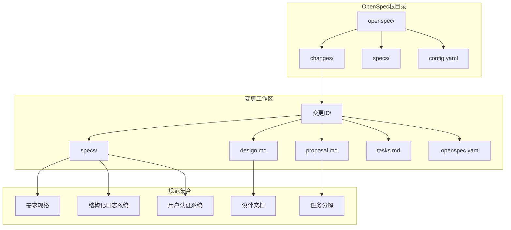
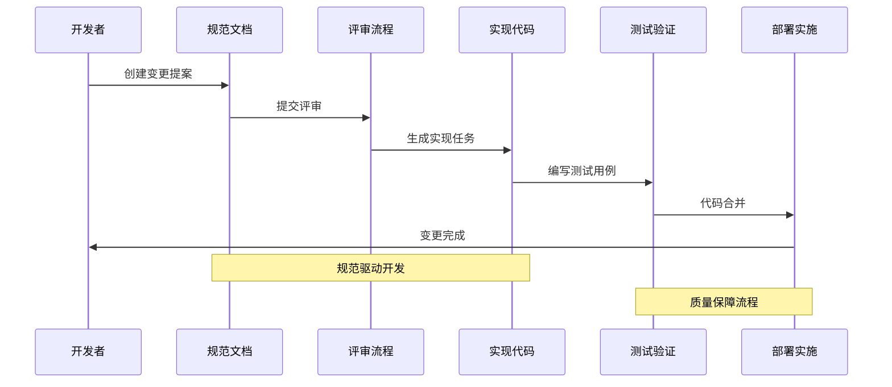
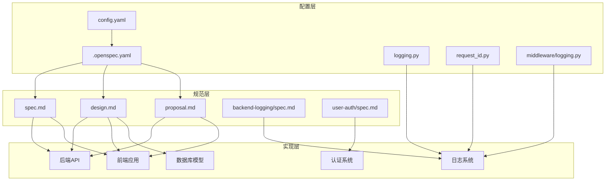
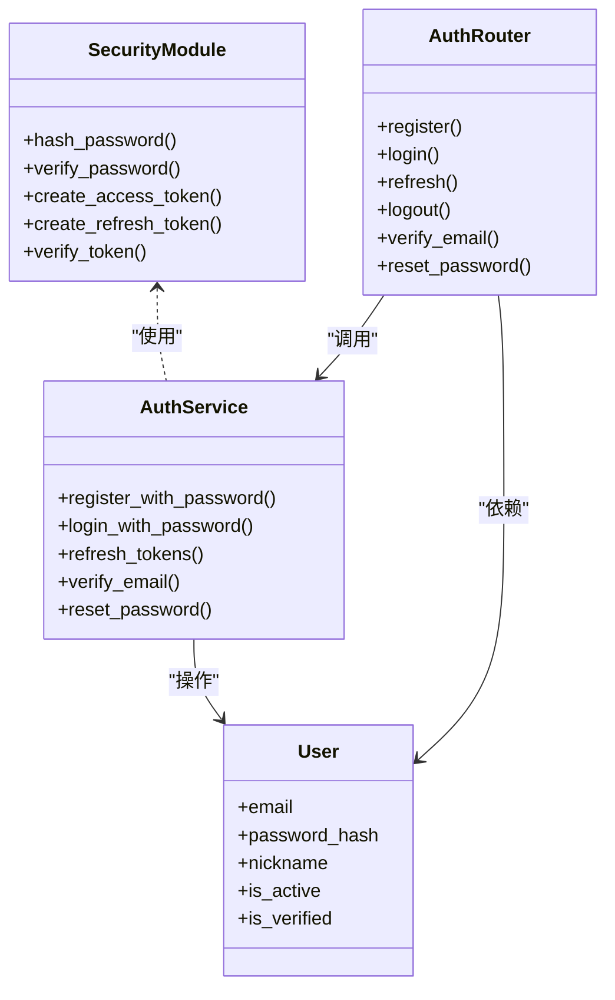
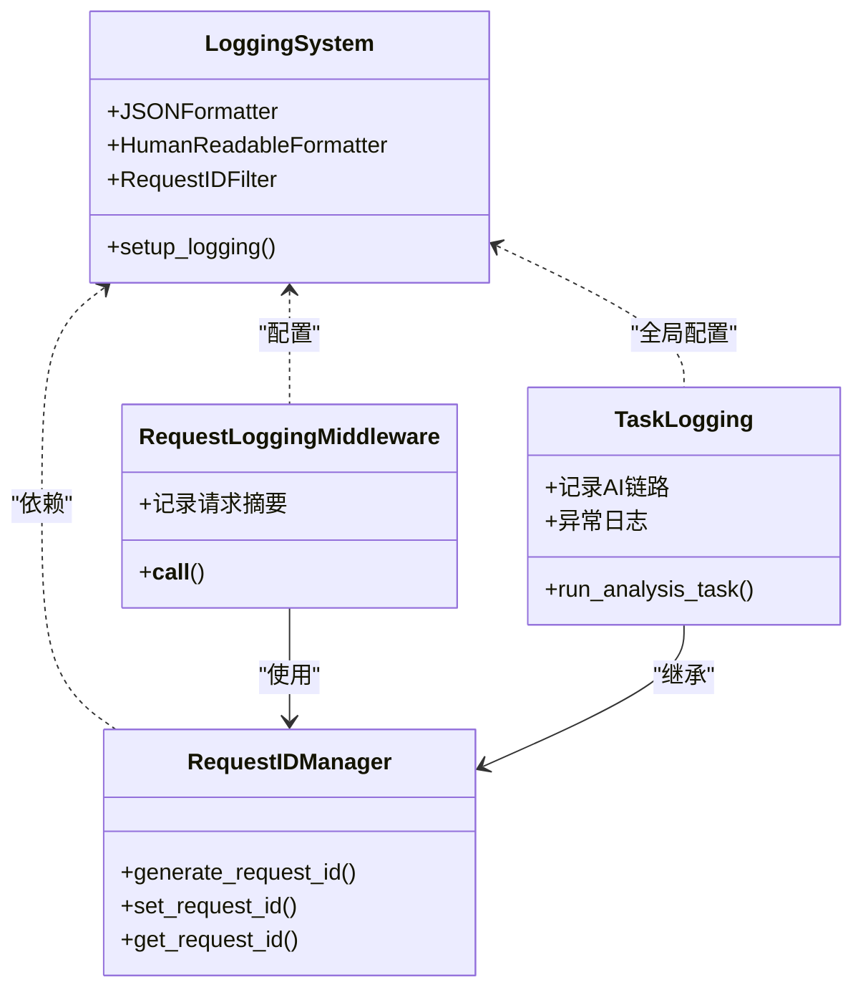

# OpenSpec变更管理

<cite>
**本文档引用的文件**
- [openspec/config.yaml](file://openspec/config.yaml)
- [openspec/changes/add-user-auth/.openspec.yaml](file://openspec/changes/add-user-auth/.openspec.yaml)
- [openspec/changes/add-user-auth/proposal.md](file://openspec/changes/add-user-auth/proposal.md)
- [openspec/changes/add-user-auth/design.md](file://openspec/changes/add-user-auth/design.md)
- [openspec/changes/add-user-auth/tasks.md](file://openspec/changes/add-user-auth/tasks.md)
- [openspec/changes/add-user-auth/specs/user-auth/spec.md](file://openspec/changes/add-user-auth/specs/user-auth/spec.md)
- [openspec/changes/archive/2026-06-02-add-structured-logging/.openspec.yaml](file://openspec/changes/archive/2026-06-02-add-structured-logging/.openspec.yaml)
- [openspec/changes/archive/2026-06-02-add-structured-logging/proposal.md](file://openspec/changes/archive/2026-06-02-add-structured-logging/proposal.md)
- [openspec/changes/archive/2026-06-02-add-structured-logging/tasks.md](file://openspec/changes/archive/2026-06-02-add-structured-logging/tasks.md)
- [openspec/changes/archive/2026-06-02-add-structured-logging/specs/backend-logging/spec.md](file://openspec/changes/archive/2026-06-02-add-structured-logging/specs/backend-logging/spec.md)
- [apps/api/app/core/logging.py](file://apps/api/app/core/logging.py)
- [apps/api/app/middleware/logging.py](file://apps/api/app/middleware/logging.py)
- [apps/api/app/core/request_id.py](file://apps/api/app/core/request_id.py)
- [apps/api/app/main.py](file://apps/api/app/main.py)
- [apps/api/app/tasks/analyze_photo.py](file://apps/api/app/tasks/analyze_photo.py)
- [apps/api/app/deps.py](file://apps/api/app/deps.py)
- [apps/api/app/core/security.py](file://apps/api/app/core/security.py)
- [apps/api/app/core/config.py](file://apps/api/app/core/config.py)
- [apps/api/app/models/user.py](file://apps/api/app/models/user.py)
- [apps/api/app/modules/auth/service.py](file://apps/api/app/modules/auth/service.py)
- [apps/api/app/modules/auth/router.py](file://apps/api/app/modules/auth/router.py)
- [apps/web/src/api/http.ts](file://apps/web/src/api/http.ts)
- [apps/web/src/stores/auth.ts](file://apps/web/src/stores/auth.ts)
</cite>

## 更新摘要
**所做更改**
- 新增结构化日志系统变更案例分析
- 更新变更提案、设计文档、任务分解和规范说明模板
- 增强日志系统架构和实现细节说明
- 完善OpenSpec变更管理的最佳实践指南

## 目录
1. [简介](#简介)
2. [项目结构](#项目结构)
3. [核心组件](#核心组件)
4. [架构概览](#架构概览)
5. [详细组件分析](#详细组件分析)
6. [依赖分析](#依赖分析)
7. [性能考虑](#性能考虑)
8. [故障排除指南](#故障排除指南)
9. [结论](#结论)
10. [附录](#附录)

## 简介

AI摄影教练项目的OpenSpec变更管理系统是一个基于规范驱动开发的工程化变更管理框架。该系统通过标准化的文档模板和严格的变更流程，确保系统演进的可控性和可追溯性。

OpenSpec系统的核心价值在于：
- **规范驱动**：所有变更都以明确的需求规格说明书为起点
- **可追溯性**：完整的变更历史和影响分析
- **质量保证**：通过多维度文档确保变更的完整性和正确性
- **团队协作**：统一的变更语言和评审标准

**更新** 新增结构化日志系统的完整变更案例，展示OpenSpec系统在实际生产环境中的应用效果

## 项目结构

OpenSpec变更管理系统采用分层组织结构，主要包含以下核心目录：



**图表来源**
- [openspec/config.yaml:1-21](file://openspec/config.yaml#L1-L21)
- [openspec/changes/add-user-auth/.openspec.yaml:1-3](file://openspec/changes/add-user-auth/.openspec.yaml#L1-L3)
- [openspec/changes/archive/2026-06-02-add-structured-logging/.openspec.yaml:1-3](file://openspec/changes/archive/2026-06-02-add-structured-logging/.openspec.yaml#L1-L3)

**章节来源**
- [openspec/config.yaml:1-21](file://openspec/config.yaml#L1-L21)
- [openspec/changes/add-user-auth/.openspec.yaml:1-3](file://openspec/changes/add-user-auth/.openspec.yaml#L1-L3)
- [openspec/changes/archive/2026-06-02-add-structured-logging/.openspec.yaml:1-3](file://openspec/changes/archive/2026-06-02-add-structured-logging/.openspec.yaml#L1-L3)

## 核心组件

### OpenSpec配置系统

OpenSpec系统通过配置文件定义整体行为和约束规则：

**全局配置规则**
- `schema: spec-driven` - 指定使用规范驱动模式
- `context` - 项目上下文信息，用于AI辅助生成
- `rules` - 针对特定工件的自定义规则

**章节来源**
- [openspec/config.yaml:1-21](file://openspec/config.yaml#L1-L21)

### 变更工作流组件

每个变更都包含四个核心文档，形成完整的变更生命周期：

**变更容器结构**
- `.openspec.yaml` - 变更元数据和时间戳
- `proposal.md` - 变更提案和影响分析
- `design.md` - 技术设计方案和决策记录
- `tasks.md` - 具体实现任务清单
- `specs/` - 需求规格说明书集合

**更新** 新增结构化日志系统的变更工作流，展示完整的变更管理流程

**章节来源**
- [openspec/changes/add-user-auth/.openspec.yaml:1-3](file://openspec/changes/add-user-auth/.openspec.yaml#L1-L3)
- [openspec/changes/add-user-auth/proposal.md:1-35](file://openspec/changes/add-user-auth/proposal.md#L1-L35)
- [openspec/changes/add-user-auth/design.md:1-102](file://openspec/changes/add-user-auth/design.md#L1-L102)
- [openspec/changes/add-user-auth/tasks.md:1-54](file://openspec/changes/add-user-auth/tasks.md#L1-L54)
- [openspec/changes/archive/2026-06-02-add-structured-logging/proposal.md:1-44](file://openspec/changes/archive/2026-06-02-add-structured-logging/proposal.md#L1-L44)
- [openspec/changes/archive/2026-06-02-add-structured-logging/tasks.md:1-52](file://openspec/changes/archive/2026-06-02-add-structured-logging/tasks.md#L1-L52)

## 架构概览

OpenSpec变更管理系统的整体架构采用"文档驱动 + 代码实现"的双轨制设计：



**图表来源**
- [openspec/changes/add-user-auth/proposal.md:1-35](file://openspec/changes/add-user-auth/proposal.md#L1-L35)
- [openspec/changes/add-user-auth/design.md:1-102](file://openspec/changes/add-user-auth/design.md#L1-L102)
- [openspec/changes/add-user-auth/tasks.md:1-54](file://openspec/changes/add-user-auth/tasks.md#L1-L54)
- [openspec/changes/archive/2026-06-02-add-structured-logging/proposal.md:1-44](file://openspec/changes/archive/2026-06-02-add-structured-logging/proposal.md#L1-L44)
- [openspec/changes/archive/2026-06-02-add-structured-logging/tasks.md:1-52](file://openspec/changes/archive/2026-06-02-add-structured-logging/tasks.md#L1-L52)

## 详细组件分析

### 需求规格说明书(spec.md)规范

需求规格说明书是OpenSpec系统的核心产物，采用行为驱动的场景描述方式：

**文档结构规范**
- `## ADDED Requirements` - 新增功能需求
- 详细的功能场景描述
- 明确的前置条件和预期结果
- 标准化的场景模板

**场景描述模板**
```markdown
### Requirement: 功能名称

系统应...（功能描述）

#### Scenario: 场景名称

- **WHEN** （触发条件）
- **THEN** （预期结果）
```

**更新** 结构化日志系统的spec.md展示了完整的JSON结构化日志需求，包括请求ID追踪、Celery任务日志和HTTP中间件日志等场景

**章节来源**
- [openspec/changes/add-user-auth/specs/user-auth/spec.md:1-134](file://openspec/changes/add-user-auth/specs/user-auth/spec.md#L1-L134)
- [openspec/changes/archive/2026-06-02-add-structured-logging/specs/backend-logging/spec.md:1-133](file://openspec/changes/archive/2026-06-02-add-structured-logging/specs/backend-logging/spec.md#L1-L133)

### 设计文档(design.md)模板

设计文档详细记录技术决策和架构方案：

**设计文档要素**
- **Context** - 项目背景和技术现状
- **Goals / Non-Goals** - 明确目标边界
- **Decisions** - 关键技术决策及其权衡
- **Risks / Trade-offs** - 风险评估和折中方案
- **Migration Plan** - 迁移策略和回滚方案

**决策记录格式**
```markdown
### 1. 技术方案选择

**选择**: 具体方案
**替代方案**: 其他可选方案
**理由**: 选择该方案的原因
```

**更新** 结构化日志系统的设计文档展示了基于contextvars的request_id传递机制和JSON格式化日志的实现方案

**章节来源**
- [openspec/changes/add-user-auth/design.md:1-102](file://openspec/changes/add-user-auth/design.md#L1-L102)
- [openspec/changes/archive/2026-06-02-add-structured-logging/proposal.md:1-44](file://openspec/changes/archive/2026-06-02-add-structured-logging/proposal.md#L1-L44)

### 任务分解(tasks.md)规范

任务分解文档将设计转化为可执行的工作项：

**任务分类结构**
- `## 1. 认证基础设施`
- `## 2. 用户模型扩展`
- 具体的实现步骤清单
- 完成状态标记

**任务描述规范**
- `[x] 1.1` - 已完成的任务
- 详细的技术实现要点
- 文件路径和具体修改内容

**更新** 结构化日志系统的任务分解展示了分阶段交付策略，包括P0级基础设施和P1级增强功能

**章节来源**
- [openspec/changes/add-user-auth/tasks.md:1-54](file://openspec/changes/add-user-auth/tasks.md#L1-L54)
- [openspec/changes/archive/2026-06-02-add-structured-logging/tasks.md:1-52](file://openspec/changes/archive/2026-06-02-add-structured-logging/tasks.md#L1-L52)

### 变更提案(proposal.md)模板

变更提案文档阐述变更的必要性和影响范围：

**提案文档结构**
- `## Why` - 变更原因和动机
- `## What Changes` - 具体变更内容
- `## Capabilities` - 新增和修改的能力
- `## Impact` - 影响分析和风险评估

**更新** 结构化日志系统的变更提案展示了完整的分阶段交付计划，从基础设施到全链路追踪的渐进式实现

**章节来源**
- [openspec/changes/add-user-auth/proposal.md:1-35](file://openspec/changes/add-user-auth/proposal.md#L1-L35)
- [openspec/changes/archive/2026-06-02-add-structured-logging/proposal.md:1-44](file://openspec/changes/archive/2026-06-02-add-structured-logging/proposal.md#L1-L44)

## 依赖分析

OpenSpec系统中的关键依赖关系体现了规范与实现的对应关系：



**图表来源**
- [openspec/changes/add-user-auth/specs/user-auth/spec.md:1-134](file://openspec/changes/add-user-auth/specs/user-auth/spec.md#L1-L134)
- [openspec/changes/archive/2026-06-02-add-structured-logging/specs/backend-logging/spec.md:1-133](file://openspec/changes/archive/2026-06-02-add-structured-logging/specs/backend-logging/spec.md#L1-L133)
- [openspec/changes/add-user-auth/design.md:1-102](file://openspec/changes/add-user-auth/design.md#L1-L102)
- [openspec/changes/add-user-auth/proposal.md:1-35](file://openspec/changes/add-user-auth/proposal.md#L1-L35)
- [openspec/changes/add-user-auth/.openspec.yaml:1-3](file://openspec/changes/add-user-auth/.openspec.yaml#L1-L3)
- [openspec/config.yaml:1-21](file://openspec/config.yaml#L1-L21)

### 认证系统依赖关系

认证系统的实现展示了OpenSpec规范到代码的映射关系：



**图表来源**
- [apps/api/app/core/security.py:1-72](file://apps/api/app/core/security.py#L1-L72)
- [apps/api/app/modules/auth/service.py:1-145](file://apps/api/app/modules/auth/service.py#L1-L145)
- [apps/api/app/models/user.py:1-28](file://apps/api/app/models/user.py#L1-L28)
- [apps/api/app/modules/auth/router.py:1-93](file://apps/api/app/modules/auth/router.py#L1-L93)

### 结构化日志系统依赖关系

**更新** 新增结构化日志系统的依赖关系图，展示日志基础设施与各组件的集成关系



**图表来源**
- [apps/api/app/core/logging.py:1-163](file://apps/api/app/core/logging.py#L1-L163)
- [apps/api/app/core/request_id.py:1-32](file://apps/api/app/core/request_id.py#L1-L32)
- [apps/api/app/middleware/logging.py:1-63](file://apps/api/app/middleware/logging.py#L1-L63)
- [apps/api/app/tasks/analyze_photo.py:1-200](file://apps/api/app/tasks/analyze_photo.py#L1-L200)

**章节来源**
- [apps/api/app/core/security.py:1-72](file://apps/api/app/core/security.py#L1-L72)
- [apps/api/app/modules/auth/service.py:1-145](file://apps/api/app/modules/auth/service.py#L1-L145)
- [apps/api/app/models/user.py:1-28](file://apps/api/app/models/user.py#L1-L28)
- [apps/api/app/modules/auth/router.py:1-93](file://apps/api/app/modules/auth/router.py#L1-L93)
- [apps/api/app/core/logging.py:1-163](file://apps/api/app/core/logging.py#L1-L163)
- [apps/api/app/core/request_id.py:1-32](file://apps/api/app/core/request_id.py#L1-L32)
- [apps/api/app/middleware/logging.py:1-63](file://apps/api/app/middleware/logging.py#L1-L63)
- [apps/api/app/tasks/analyze_photo.py:1-200](file://apps/api/app/tasks/analyze_photo.py#L1-L200)

## 性能考虑

OpenSpec变更管理系统在性能方面的考量主要体现在以下几个方面：

### 变更效率优化
- **并行评审**：多个变更可以并行进行评审和实施
- **增量更新**：变更只影响相关的部分，避免全量重构
- **自动化验证**：通过规范驱动减少手工测试工作量

### 资源利用优化
- **文档复用**：设计文档和需求规格可以在多个变更中复用
- **模板标准化**：统一的文档模板减少学习成本
- **版本控制集成**：与Git深度集成，便于追踪变更历史

**更新** 结构化日志系统的性能优化策略，包括异步写入、日志级别控制和文件轮转机制

### 日志系统性能优化
- **异步日志写入**：日志写入对请求延迟影响小于1ms
- **智能级别过滤**：DEBUG及以上级别按配置输出
- **文件轮转管理**：10MB自动轮转，保留5个备份
- **模块级别覆盖**：针对第三方库的性能优化

**章节来源**
- [openspec/changes/add-user-auth/proposal.md:1-35](file://openspec/changes/add-user-auth/proposal.md#L1-L35)
- [openspec/changes/add-user-auth/design.md:1-102](file://openspec/changes/add-user-auth/design.md#L1-L102)
- [openspec/changes/add-user-auth/tasks.md:1-54](file://openspec/changes/add-user-auth/tasks.md#L1-L54)
- [openspec/changes/archive/2026-06-02-add-structured-logging/proposal.md:36-42](file://openspec/changes/archive/2026-06-02-add-structured-logging/proposal.md#L36-L42)

## 故障排除指南

### 常见问题及解决方案

**变更提案不完整**
- 检查是否包含完整的Why、What Changes、Capabilities、Impact部分
- 确认所有影响的系统组件都已在Impact中列出

**设计文档缺乏技术细节**
- 补充具体的架构图和决策依据
- 添加风险评估和缓解措施

**任务分解不准确**
- 将大任务拆分为更小的可执行单元
- 明确每个任务的验收标准

**配置文件错误**
- 验证YAML语法正确性
- 检查必需字段是否完整

**更新** 结构化日志系统的故障排除指南

### 日志系统故障排除
- **日志格式异常**：检查JSONFormatter配置和extra字段
- **request_id缺失**：验证contextvars上下文传递
- **日志级别不生效**：确认LOG_LEVEL环境变量设置
- **文件写入权限**：检查logs目录权限和磁盘空间
- **Celery任务日志**：验证task_id参数传递和worker配置

**章节来源**
- [openspec/changes/add-user-auth/proposal.md:1-35](file://openspec/changes/add-user-auth/proposal.md#L1-L35)
- [openspec/changes/add-user-auth/design.md:1-102](file://openspec/changes/add-user-auth/design.md#L1-L102)
- [openspec/changes/add-user-auth/tasks.md:1-54](file://openspec/changes/add-user-auth/tasks.md#L1-L54)
- [openspec/changes/archive/2026-06-02-add-structured-logging/proposal.md:1-44](file://openspec/changes/archive/2026-06-02-add-structured-logging/proposal.md#L1-L44)

## 结论

OpenSpec变更管理系统为AI摄影教练项目提供了一个完整的工程化变更管理框架。通过规范驱动的方法，确保了系统演进的可控性和可追溯性。

该系统的主要优势包括：
- **完整性**：从需求到实现的全流程覆盖
- **可追溯性**：完整的变更历史和影响分析
- **质量保证**：多维度文档确保变更质量
- **团队协作**：统一的变更语言和评审标准

**更新** 结构化日志系统的成功实施证明了OpenSpec系统的实用性和有效性，为后续的系统监控和运维提供了坚实基础。

建议在实际使用中：
1. 严格遵循文档模板规范
2. 及时更新变更状态和完成情况
3. 定期回顾和优化变更流程
4. 建立变更知识库和最佳实践分享机制
5. 结合实际需求持续改进OpenSpec系统

## 附录

### OpenSpec配置文件详解

**全局配置选项**
- `schema` - 指定使用规范驱动模式
- `context` - 项目上下文信息，用于AI辅助生成
- `rules` - 针对特定工件的自定义规则

**章节来源**
- [openspec/config.yaml:1-21](file://openspec/config.yaml#L1-L21)

### 变更实施最佳实践

**实施流程建议**
1. 创建变更提案并获得批准
2. 编写详细的设计文档
3. 分解任务并分配给开发人员
4. 实现代码并通过测试验证
5. 更新相关文档和配置
6. 进行部署和回归测试

**质量保证措施**
- 代码审查和同行评议
- 自动化测试覆盖率要求
- 性能基准测试
- 安全性评估

**更新** 结构化日志系统的最佳实践总结

### 日志系统实施最佳实践
- **渐进式部署**：分阶段实现P0和P1功能
- **环境适配**：开发环境双通道输出，生产环境单通道优化
- **性能监控**：确保日志写入对系统性能影响最小
- **安全考虑**：避免记录敏感信息和请求体内容
- **可维护性**：统一的日志格式和命名规范

**章节来源**
- [openspec/changes/archive/2026-06-02-add-structured-logging/proposal.md:19-25](file://openspec/changes/archive/2026-06-02-add-structured-logging/proposal.md#L19-L25)
- [openspec/changes/archive/2026-06-02-add-structured-logging/tasks.md:1-52](file://openspec/changes/archive/2026-06-02-add-structured-logging/tasks.md#L1-L52)
- [apps/api/app/core/logging.py:81-163](file://apps/api/app/core/logging.py#L81-L163)
- [apps/api/app/middleware/logging.py:17-63](file://apps/api/app/middleware/logging.py#L17-L63)
- [apps/api/app/core/request_id.py:19-32](file://apps/api/app/core/request_id.py#L19-L32)