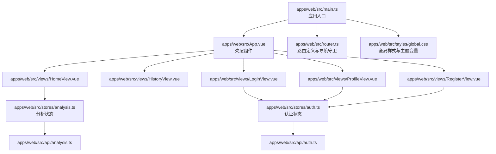
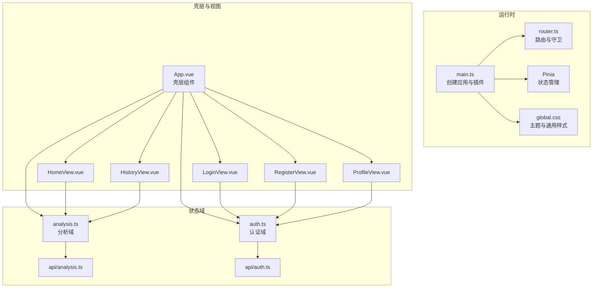
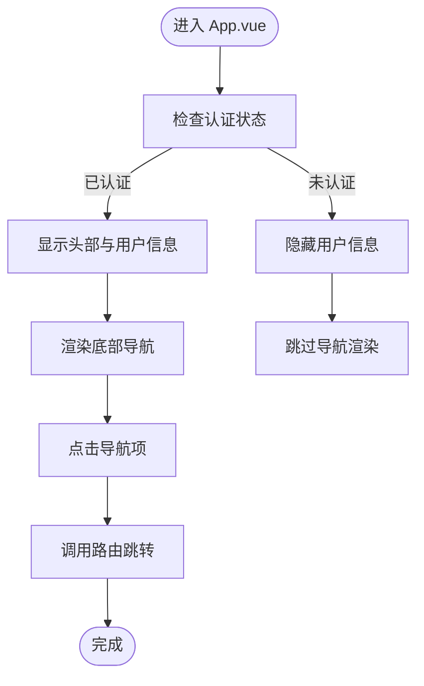
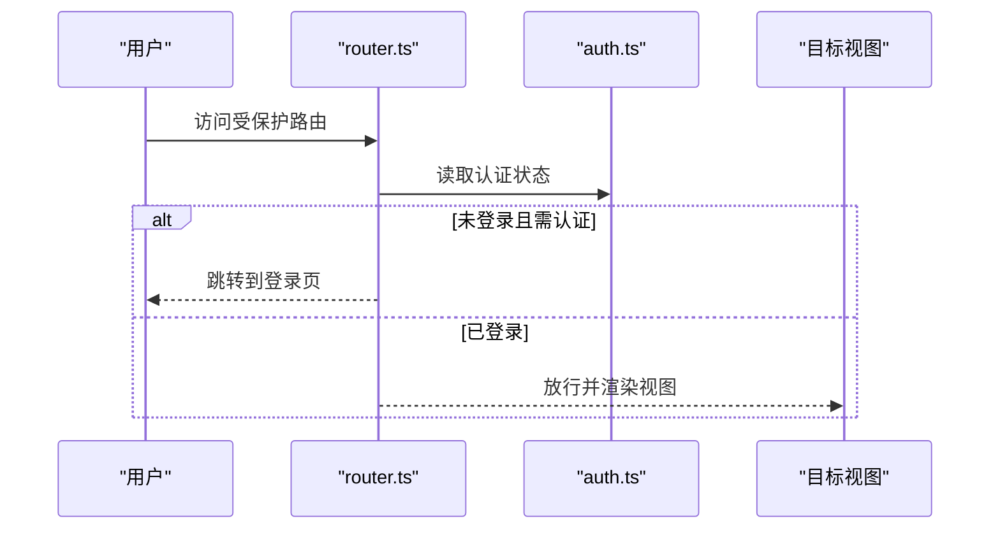
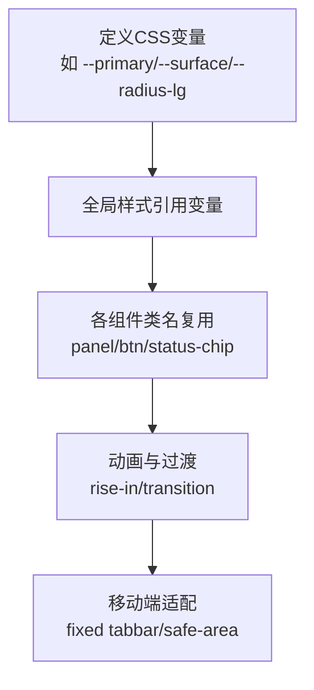
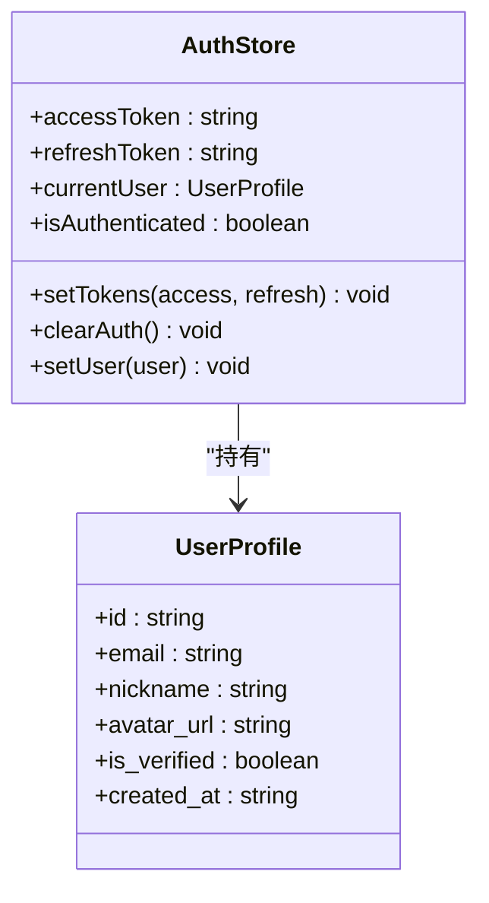
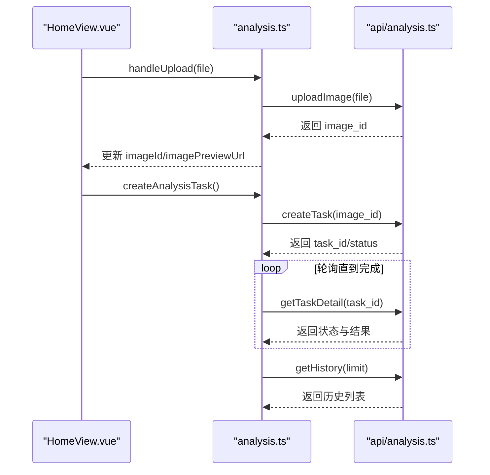
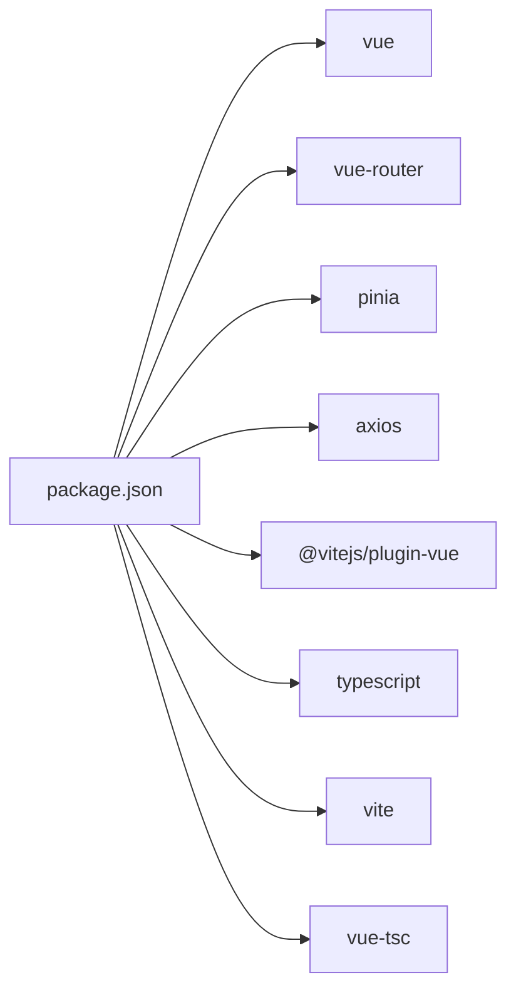

# UI组件定制

<cite>
**本文引用的文件**
- [apps/web/src/main.ts](file://apps/web/src/main.ts)
- [apps/web/src/App.vue](file://apps/web/src/App.vue)
- [apps/web/src/router.ts](file://apps/web/src/router.ts)
- [apps/web/src/styles/global.css](file://apps/web/src/styles/global.css)
- [apps/web/package.json](file://apps/web/package.json)
- [apps/web/vite.config.ts](file://apps/web/vite.config.ts)
- [apps/web/src/stores/auth.ts](file://apps/web/src/stores/auth.ts)
- [apps/web/src/stores/analysis.ts](file://apps/web/src/stores/analysis.ts)
- [apps/web/src/views/HomeView.vue](file://apps/web/src/views/HomeView.vue)
- [apps/web/src/views/LoginView.vue](file://apps/web/src/views/LoginView.vue)
- [apps/web/src/views/HistoryView.vue](file://apps/web/src/views/HistoryView.vue)
- [apps/web/src/views/ProfileView.vue](file://apps/web/src/views/ProfileView.vue)
- [apps/web/src/views/RegisterView.vue](file://apps/web/src/views/RegisterView.vue)
- [apps/web/src/api/auth.ts](file://apps/web/src/api/auth.ts)
- [apps/web/src/api/analysis.ts](file://apps/web/src/api/analysis.ts)
</cite>

## 目录
1. [简介](#简介)
2. [项目结构](#项目结构)
3. [核心组件](#核心组件)
4. [架构总览](#架构总览)
5. [详细组件分析](#详细组件分析)
6. [依赖分析](#依赖分析)
7. [性能考虑](#性能考虑)
8. [故障排查指南](#故障排查指南)
9. [结论](#结论)
10. [附录](#附录)

## 简介
本文件面向“AI摄影教练”前端工程，提供一套完整的UI组件定制指南，涵盖：
- Vue.js 组件的定制与扩展方法
- 主题样式与CSS变量体系
- Pinia 状态管理的扩展与状态定制
- 视图组件与页面布局的新增流程
- 响应式设计与移动端适配策略
- 动画与过渡效果的定制方案
- 无障碍访问与用户体验优化最佳实践

## 项目结构
前端位于 apps/web，采用 Vite + Vue 3 + TypeScript + Pinia + Vue Router 架构。应用入口初始化 Pinia 与路由，并通过全局样式统一主题风格。

**图表来源**
- [apps/web/src/main.ts:1-14](file://apps/web/src/main.ts#L1-L14)
- [apps/web/src/App.vue:1-96](file://apps/web/src/App.vue#L1-L96)
- [apps/web/src/router.ts:1-30](file://apps/web/src/router.ts#L1-L30)
- [apps/web/src/styles/global.css:1-303](file://apps/web/src/styles/global.css#L1-L303)
- [apps/web/src/views/HomeView.vue:1-111](file://apps/web/src/views/HomeView.vue#L1-L111)
- [apps/web/src/views/HistoryView.vue:1-42](file://apps/web/src/views/HistoryView.vue#L1-L42)
- [apps/web/src/views/LoginView.vue:1-127](file://apps/web/src/views/LoginView.vue#L1-L127)
- [apps/web/src/views/ProfileView.vue:1-243](file://apps/web/src/views/ProfileView.vue#L1-L243)
- [apps/web/src/views/RegisterView.vue:1-160](file://apps/web/src/views/RegisterView.vue#L1-L160)
- [apps/web/src/stores/analysis.ts:1-142](file://apps/web/src/stores/analysis.ts#L1-L142)
- [apps/web/src/stores/auth.ts:1-41](file://apps/web/src/stores/auth.ts#L1-L41)
- [apps/web/src/api/analysis.ts:1-101](file://apps/web/src/api/analysis.ts#L1-L101)
- [apps/web/src/api/auth.ts:1-56](file://apps/web/src/api/auth.ts#L1-L56)

**章节来源**
- [apps/web/src/main.ts:1-14](file://apps/web/src/main.ts#L1-L14)
- [apps/web/src/router.ts:1-30](file://apps/web/src/router.ts#L1-L30)
- [apps/web/src/styles/global.css:1-303](file://apps/web/src/styles/global.css#L1-L303)

## 核心组件
- 应用壳层：负责头部、主内容区与底部导航栏的布局与交互，同时集成认证状态显示与登出逻辑。
- 路由系统：定义受保护页面与访客页面，配合导航守卫进行权限控制。
- 全局样式：集中管理主题变量、通用组件类名与动画，确保跨组件一致性。
- 状态管理：Pinia Store 提供认证与分析两大域的状态与业务方法。
- 视图组件：按页面职责拆分，分别处理上传、分析、历史、登录、注册与个人资料等场景。

**章节来源**
- [apps/web/src/App.vue:1-96](file://apps/web/src/App.vue#L1-L96)
- [apps/web/src/router.ts:1-30](file://apps/web/src/router.ts#L1-L30)
- [apps/web/src/styles/global.css:1-303](file://apps/web/src/styles/global.css#L1-L303)
- [apps/web/src/stores/auth.ts:1-41](file://apps/web/src/stores/auth.ts#L1-L41)
- [apps/web/src/stores/analysis.ts:1-142](file://apps/web/src/stores/analysis.ts#L1-L142)

## 架构总览
应用采用“壳层 + 多视图 + 状态管理”的分层架构。壳层组件承载通用UI与导航；各视图组件聚焦具体业务；Pinia Store 抽象数据与异步流程；全局样式统一视觉与交互体验。

**图表来源**
- [apps/web/src/main.ts:1-14](file://apps/web/src/main.ts#L1-L14)
- [apps/web/src/App.vue:1-96](file://apps/web/src/App.vue#L1-L96)
- [apps/web/src/router.ts:1-30](file://apps/web/src/router.ts#L1-L30)
- [apps/web/src/styles/global.css:1-303](file://apps/web/src/styles/global.css#L1-L303)
- [apps/web/src/stores/analysis.ts:1-142](file://apps/web/src/stores/analysis.ts#L1-L142)
- [apps/web/src/stores/auth.ts:1-41](file://apps/web/src/stores/auth.ts#L1-L41)
- [apps/web/src/api/analysis.ts:1-101](file://apps/web/src/api/analysis.ts#L1-L101)
- [apps/web/src/api/auth.ts:1-56](file://apps/web/src/api/auth.ts#L1-L56)

## 详细组件分析

### 壳层组件 App.vue
- 职责：渲染头部标题、用户信息与登出按钮；根据认证状态决定是否显示底部导航；通过 RouterView 展示当前视图。
- 关键点：
  - 认证态计算属性用于条件渲染与跳转。
  - 底部导航项与当前路径联动，点击切换路由。
  - 使用 CSS 变量与 scoped 样式保证主题一致性。

**图表来源**
- [apps/web/src/App.vue:10-32](file://apps/web/src/App.vue#L10-L32)

**章节来源**
- [apps/web/src/App.vue:1-96](file://apps/web/src/App.vue#L1-L96)

### 路由与导航守卫 router.ts
- 路由定义：登录、注册、首页、历史、个人资料五个页面，区分访客页与需认证页。
- 导航守卫：在进入路由前判断 meta 标记，未登录访问受保护页则跳转登录；已登录访问访客页则跳转首页。

**图表来源**
- [apps/web/src/router.ts:21-30](file://apps/web/src/router.ts#L21-L30)
- [apps/web/src/stores/auth.ts:10](file://apps/web/src/stores/auth.ts#L10)

**章节来源**
- [apps/web/src/router.ts:1-30](file://apps/web/src/router.ts#L1-L30)

### 全局样式与主题变量 global.css
- 主题变量：定义背景渐变、表面色、文本色、品牌色、圆角半径与阴影等变量，集中管理视觉风格。
- 通用类名：panel、btn、status-chip、history-*、suggestion-* 等，形成跨组件一致的样式基线。
- 动画：rise-in 用于面板级入场动画，提升交互质感。
- 移动端适配：固定容器宽度、安全区域适配、固定底部导航等。

**图表来源**
- [apps/web/src/styles/global.css:1-16](file://apps/web/src/styles/global.css#L1-L16)
- [apps/web/src/styles/global.css:46-301](file://apps/web/src/styles/global.css#L46-L301)

**章节来源**
- [apps/web/src/styles/global.css:1-303](file://apps/web/src/styles/global.css#L1-L303)

### Pinia 状态管理扩展

#### 认证域 useAuthStore（auth.ts）
- 状态：访问令牌、刷新令牌、当前用户、认证态计算属性。
- 方法：设置令牌、清除认证、设置用户。
- 扩展建议：增加令牌刷新、用户信息轮询、多语言与主题偏好持久化。

**图表来源**
- [apps/web/src/stores/auth.ts:5-40](file://apps/web/src/stores/auth.ts#L5-L40)
- [apps/web/src/api/auth.ts:3-10](file://apps/web/src/api/auth.ts#L3-L10)

**章节来源**
- [apps/web/src/stores/auth.ts:1-41](file://apps/web/src/stores/auth.ts#L1-L41)
- [apps/web/src/api/auth.ts:1-56](file://apps/web/src/api/auth.ts#L1-L56)

#### 分析域 useAnalysisStore（analysis.ts）
- 状态：图像ID、预览URL、任务ID、任务状态、任务详情、历史列表、加载与错误标志、轮询开关。
- 方法：上传图片、创建分析任务、轮询任务、停止轮询、拉取历史、重试任务。
- 扩展建议：引入任务取消、并发控制、错误重试策略、结果缓存。

**图表来源**
- [apps/web/src/views/HomeView.vue:34-48](file://apps/web/src/views/HomeView.vue#L34-L48)
- [apps/web/src/stores/analysis.ts:34-104](file://apps/web/src/stores/analysis.ts#L34-L104)
- [apps/web/src/api/analysis.ts:82-100](file://apps/web/src/api/analysis.ts#L82-L100)

**章节来源**
- [apps/web/src/stores/analysis.ts:1-142](file://apps/web/src/stores/analysis.ts#L1-L142)
- [apps/web/src/api/analysis.ts:1-101](file://apps/web/src/api/analysis.ts#L1-L101)

### 视图组件定制指南

#### 新增视图组件与页面布局
- 在 apps/web/src/views 下新建 .vue 文件，遵循现有结构：script setup + template + scoped style。
- 在 router.ts 中注册路由，设置 meta 标记以控制访问权限。
- 在 App.vue 的底部导航中添加对应导航项，保持与路由 path 一致。
- 如需共享样式，优先使用 global.css 中的通用类名，避免重复定义。

**章节来源**
- [apps/web/src/router.ts:10-19](file://apps/web/src/router.ts#L10-L19)
- [apps/web/src/App.vue:10-27](file://apps/web/src/App.vue#L10-L27)

#### 组件级别的样式覆盖与主题配置
- 通用样式：panel、btn、status-chip、history-*、suggestion-* 等类名可直接复用。
- 主题变量：通过修改 :root 中的 CSS 变量快速切换主题色板与圆角、阴影等。
- 动画与过渡：利用 rise-in 动画与全局 transition，确保交互一致性。

**章节来源**
- [apps/web/src/styles/global.css:46-301](file://apps/web/src/styles/global.css#L46-L301)

#### 响应式设计与移动端适配
- 固定容器宽度与安全区域：.app-shell 设置最大宽度与内边距，适配刘海屏与底部安全区。
- 固定底部导航：.tabbar 使用 fixed 定位与 transform 居中，网格布局三等分。
- 图片预览：.preview-image 限制最大高度与对象填充，保证在不同设备上稳定显示。

**章节来源**
- [apps/web/src/styles/global.css:46-290](file://apps/web/src/styles/global.css#L46-L290)

#### 动画效果与过渡效果定制
- 面板入场：.panel 使用 rise-in 动画，提升内容出现的自然感。
- 按钮反馈：.btn 定义 active 状态与 transition，提供按下反馈。
- 自定义动画：可在 scoped style 中新增 keyframes 并在类名上引用，保持作用域隔离。

**章节来源**
- [apps/web/src/styles/global.css:87](file://apps/web/src/styles/global.css#L87)
- [apps/web/src/styles/global.css:110](file://apps/web/src/styles/global.css#L110)
- [apps/web/src/styles/global.css:292-301](file://apps/web/src/styles/global.css#L292-L301)

#### 无障碍访问与用户体验优化
- 表单与输入：使用语义化 label 与占位提示，聚焦态高亮与键盘可操作性。
- 状态提示：status-chip 提供清晰的任务状态反馈；错误信息使用 error-text 统一颜色与字号。
- 加载与禁用：按钮 disabled 状态与提交中文案，避免重复提交与误操作。
- 导航与跳转：底部导航与路由联动，减少用户认知负担。

**章节来源**
- [apps/web/src/views/LoginView.vue:55-76](file://apps/web/src/views/LoginView.vue#L55-L76)
- [apps/web/src/views/RegisterView.vue:76-110](file://apps/web/src/views/RegisterView.vue#L76-L110)
- [apps/web/src/views/ProfileView.vue:133-150](file://apps/web/src/views/ProfileView.vue#L133-L150)
- [apps/web/src/views/HomeView.vue:64-92](file://apps/web/src/views/HomeView.vue#L64-L92)

## 依赖分析
- 运行时依赖：vue、vue-router、pinia、axios。
- 开发依赖：@vitejs/plugin-vue、typescript、vite、vue-tsc。
- 构建与开发：Vite 提供热更新与代理，支持本地联调后端接口。

**图表来源**
- [apps/web/package.json:11-23](file://apps/web/package.json#L11-L23)

**章节来源**
- [apps/web/package.json:1-26](file://apps/web/package.json#L1-L26)
- [apps/web/vite.config.ts:1-26](file://apps/web/vite.config.ts#L1-L26)

## 性能考虑
- 轮询策略：分析任务轮询间隔为固定毫秒数，建议根据实际后端延迟动态调整，避免频繁请求。
- 资源释放：组件卸载时停止轮询，避免内存泄漏与后台任务堆积。
- 图片预览：上传后及时释放 ObjectURL，防止内存占用。
- 渲染优化：使用 computed 与 storeToRefs 减少不必要的重渲染。

**章节来源**
- [apps/web/src/stores/analysis.ts:15-21](file://apps/web/src/stores/analysis.ts#L15-L21)
- [apps/web/src/stores/analysis.ts:46-53](file://apps/web/src/stores/analysis.ts#L46-L53)
- [apps/web/src/stores/analysis.ts:92-94](file://apps/web/src/stores/analysis.ts#L92-L94)
- [apps/web/src/views/HomeView.vue:46-48](file://apps/web/src/views/HomeView.vue#L46-L48)

## 故障排查指南
- 登录/注册失败：检查表单校验与错误提示文案，关注 400/401/409 等状态码对应的提示。
- 任务状态异常：确认轮询是否被意外停止，检查任务详情接口返回与状态枚举。
- 导航跳转异常：核对路由 meta 标记与导航守卫逻辑，确保认证状态同步。
- 样式冲突：优先使用全局类名与 CSS 变量，避免在组件内重复定义相同规则。

**章节来源**
- [apps/web/src/views/LoginView.vue:36-46](file://apps/web/src/views/LoginView.vue#L36-L46)
- [apps/web/src/views/RegisterView.vue:55-67](file://apps/web/src/views/RegisterView.vue#L55-L67)
- [apps/web/src/router.ts:22-30](file://apps/web/src/router.ts#L22-L30)
- [apps/web/src/stores/analysis.ts:76-90](file://apps/web/src/stores/analysis.ts#L76-L90)

## 结论
本项目以简洁的壳层组件承载通用布局，通过 Pinia 将认证与分析两大域解耦，配合全局样式与路由守卫实现一致的主题与权限控制。按本文档的定制方法，可快速扩展新视图、增强状态域能力、优化移动端体验并提升整体交互质量。

## 附录
- 新增视图步骤清单
  - 创建视图文件并编写模板与逻辑
  - 在路由中注册新页面并设置 meta
  - 在壳层导航中添加对应项
  - 复用全局类名与主题变量，必要时在组件内新增 scoped 样式
- 状态域扩展清单
  - 在 stores 下新增模块文件，导出 useXxxStore
  - 在 api 下新增对应接口封装
  - 在视图中通过 storeToRefs 使用状态与方法
- 主题定制清单
  - 修改 :root 中的 CSS 变量
  - 统一调整 panel/btn/status-chip 等通用类名
  - 为新组件补充必要的动画与过渡