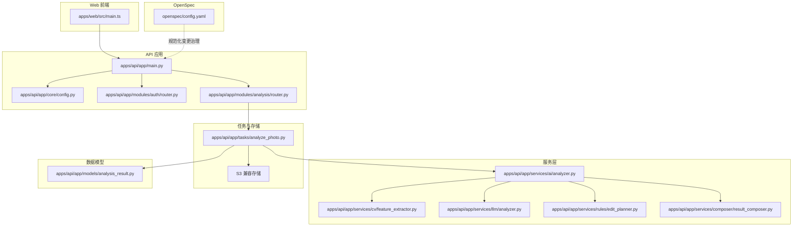
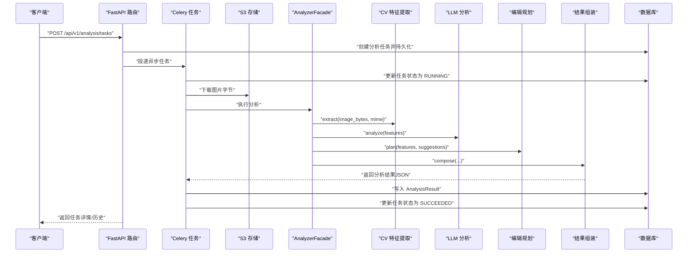
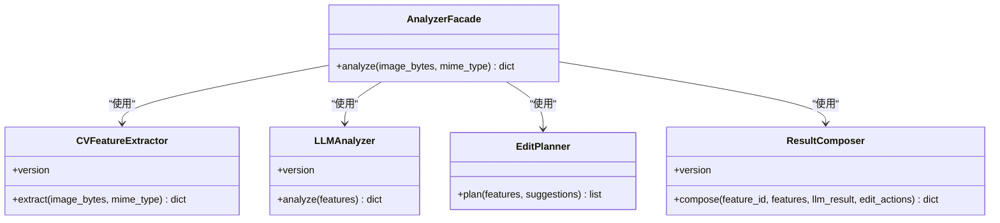
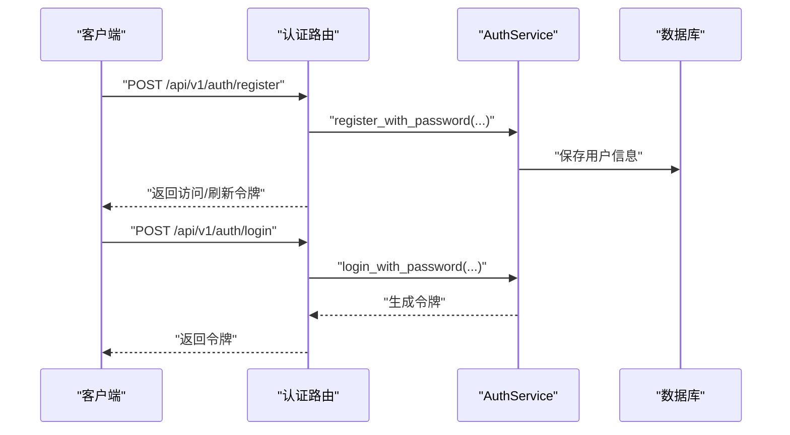
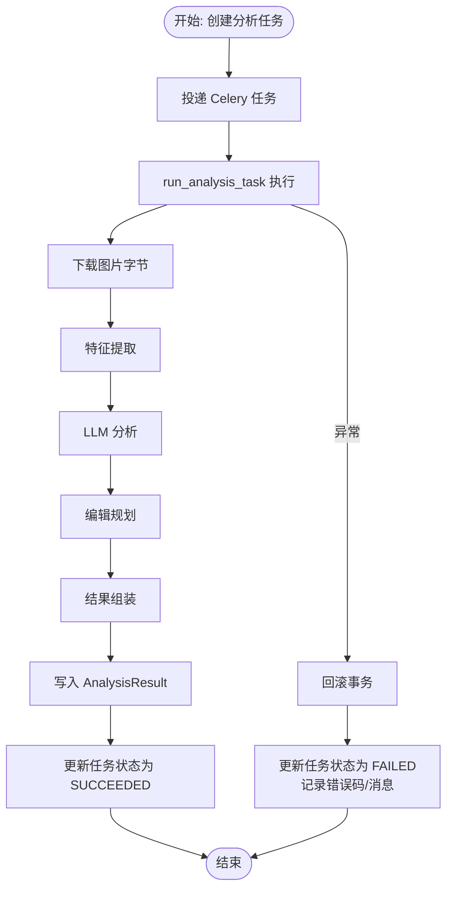
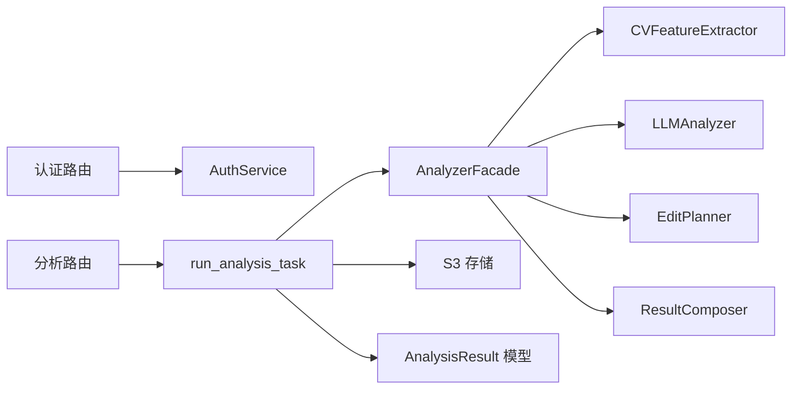

# 扩展和定制

<cite>
**本文引用的文件**
- [apps/api/app/main.py](file://apps/api/app/main.py)
- [apps/api/app/core/config.py](file://apps/api/app/core/config.py)
- [apps/api/app/modules/analysis/router.py](file://apps/api/app/modules/analysis/router.py)
- [apps/api/app/modules/auth/router.py](file://apps/api/app/modules/auth/router.py)
- [apps/api/app/services/ai/analyzer.py](file://apps/api/app/services/ai/analyzer.py)
- [apps/api/app/services/composer/result_composer.py](file://apps/api/app/services/composer/result_composer.py)
- [apps/api/app/services/cv/feature_extractor.py](file://apps/api/app/services/cv/feature_extractor.py)
- [apps/api/app/services/llm/analyzer.py](file://apps/api/app/services/llm/analyzer.py)
- [apps/api/app/services/rules/edit_planner.py](file://apps/api/app/services/rules/edit_planner.py)
- [apps/api/app/tasks/analyze_photo.py](file://apps/api/app/tasks/analyze_photo.py)
- [apps/api/app/models/analysis_result.py](file://apps/api/app/models/analysis_result.py)
- [apps/api/app/schemas/analysis.py](file://apps/api/app/schemas/analysis.py)
- [apps/web/src/main.ts](file://apps/web/src/main.ts)
- [openspec/config.yaml](file://openspec/config.yaml)
</cite>

## 目录
1. [简介](#简介)
2. [项目结构](#项目结构)
3. [核心组件](#核心组件)
4. [架构总览](#架构总览)
5. [详细组件分析](#详细组件分析)
6. [依赖分析](#依赖分析)
7. [性能考虑](#性能考虑)
8. [故障排查指南](#故障排查指南)
9. [结论](#结论)
10. [附录](#附录)

## 简介
本文件面向“AI摄影教练”项目的扩展与定制需求，系统化阐述如何：
- 添加新的AI分析模块（如第三方视觉/语言模型）
- 集成第三方服务（对象存储、消息队列、外部API）
- 自定义业务逻辑（规则引擎、编辑动作规划）
- 使用 OpenSpec 变更管理系统进行规范化的变更治理
- 设计插件式架构与接口契约
- 扩展认证提供者与接入第三方AI模型
- 扩展配置系统与环境变量管理
- 定制前端UI组件与主题配置
- 性能优化与功能增强最佳实践

## 项目结构
后端采用FastAPI + SQLAlchemy + Celery的分层架构；前端基于Vue 3 + Pinia；数据持久化使用PostgreSQL，缓存使用Redis，对象存储使用S3兼容服务；分析流程通过异步任务队列执行。

图表来源
- [apps/api/app/main.py:1-36](file://apps/api/app/main.py#L1-L36)
- [apps/api/app/core/config.py:1-47](file://apps/api/app/core/config.py#L1-L47)
- [apps/api/app/modules/analysis/router.py:1-151](file://apps/api/app/modules/analysis/router.py#L1-L151)
- [apps/api/app/modules/auth/router.py:1-93](file://apps/api/app/modules/auth/router.py#L1-L93)
- [apps/api/app/services/ai/analyzer.py:1-27](file://apps/api/app/services/ai/analyzer.py#L1-L27)
- [apps/api/app/services/composer/result_composer.py:1-99](file://apps/api/app/services/composer/result_composer.py#L1-L99)
- [apps/api/app/services/cv/feature_extractor.py:1-98](file://apps/api/app/services/cv/feature_extractor.py#L1-L98)
- [apps/api/app/services/llm/analyzer.py:1-139](file://apps/api/app/services/llm/analyzer.py#L1-L139)
- [apps/api/app/services/rules/edit_planner.py:1-97](file://apps/api/app/services/rules/edit_planner.py#L1-L97)
- [apps/api/app/tasks/analyze_photo.py:1-108](file://apps/api/app/tasks/analyze_photo.py#L1-L108)
- [apps/api/app/models/analysis_result.py:1-28](file://apps/api/app/models/analysis_result.py#L1-L28)
- [openspec/config.yaml:1-21](file://openspec/config.yaml#L1-L21)

章节来源
- [apps/api/app/main.py:1-36](file://apps/api/app/main.py#L1-L36)
- [apps/api/app/core/config.py:1-47](file://apps/api/app/core/config.py#L1-L47)

## 核心组件
- 应用入口与路由聚合：应用启动时加载CORS中间件，按前缀挂载各模块路由（认证、分析、图片、用户），并在启动事件中初始化数据库。
- 配置中心：统一从环境变量加载应用配置，支持数据库、Redis、S3、跨域、JWT等参数，并提供CORS来源解析。
- 分析流水线：分析任务由路由触发，异步任务执行器拉取图片字节，依次经特征提取、LLM分析、规则编辑规划、结果组装，最终写入分析结果表。
- 结果模型：分析结果以JSON形式持久化，包含版本号、摘要、建议、评分、标注与编辑动作等字段。

章节来源
- [apps/api/app/main.py:1-36](file://apps/api/app/main.py#L1-L36)
- [apps/api/app/core/config.py:1-47](file://apps/api/app/core/config.py#L1-L47)
- [apps/api/app/modules/analysis/router.py:1-151](file://apps/api/app/modules/analysis/router.py#L1-L151)
- [apps/api/app/tasks/analyze_photo.py:1-108](file://apps/api/app/tasks/analyze_photo.py#L1-L108)
- [apps/api/app/models/analysis_result.py:1-28](file://apps/api/app/models/analysis_result.py#L1-L28)

## 架构总览
下图展示从客户端到后端服务、任务执行与存储的完整链路。

图表来源
- [apps/api/app/modules/analysis/router.py:45-74](file://apps/api/app/modules/analysis/router.py#L45-L74)
- [apps/api/app/tasks/analyze_photo.py:19-108](file://apps/api/app/tasks/analyze_photo.py#L19-L108)
- [apps/api/app/services/ai/analyzer.py:10-27](file://apps/api/app/services/ai/analyzer.py#L10-L27)
- [apps/api/app/services/composer/result_composer.py:5-27](file://apps/api/app/services/composer/result_composer.py#L5-L27)
- [apps/api/app/services/cv/feature_extractor.py:12-92](file://apps/api/app/services/cv/feature_extractor.py#L12-L92)
- [apps/api/app/services/llm/analyzer.py:5-118](file://apps/api/app/services/llm/analyzer.py#L5-L118)
- [apps/api/app/services/rules/edit_planner.py:5-34](file://apps/api/app/services/rules/edit_planner.py#L5-L34)
- [apps/api/app/models/analysis_result.py:10-28](file://apps/api/app/models/analysis_result.py#L10-L28)

## 详细组件分析

### 组件A：分析流水线与扩展点
- AnalyzerFacade：作为门面协调CV特征提取、LLM分析、规则编辑规划与结果组装，便于替换或扩展任一环节。
- ResultComposer：负责将多源结果整合为统一输出结构，便于前端消费与渲染。
- EditPlanner：基于图像统计与建议生成编辑动作（裁剪、曝光、白平衡等），可按业务策略扩展动作类型与强度。
- FeatureExtractor：提供基础视觉特征（亮度、对比度、主体框、高光/阴影区域、地平线参考线）。
- LLMAnalyzer：基于特征生成摘要、建议与评分，可替换为外部大模型或本地推理服务。

图表来源
- [apps/api/app/services/ai/analyzer.py:10-27](file://apps/api/app/services/ai/analyzer.py#L10-L27)
- [apps/api/app/services/composer/result_composer.py:5-27](file://apps/api/app/services/composer/result_composer.py#L5-L27)
- [apps/api/app/services/cv/feature_extractor.py:12-92](file://apps/api/app/services/cv/feature_extractor.py#L12-L92)
- [apps/api/app/services/llm/analyzer.py:5-118](file://apps/api/app/services/llm/analyzer.py#L5-L118)
- [apps/api/app/services/rules/edit_planner.py:5-34](file://apps/api/app/services/rules/edit_planner.py#L5-L34)

章节来源
- [apps/api/app/services/ai/analyzer.py:1-27](file://apps/api/app/services/ai/analyzer.py#L1-L27)
- [apps/api/app/services/composer/result_composer.py:1-99](file://apps/api/app/services/composer/result_composer.py#L1-L99)
- [apps/api/app/services/cv/feature_extractor.py:1-98](file://apps/api/app/services/cv/feature_extractor.py#L1-L98)
- [apps/api/app/services/llm/analyzer.py:1-139](file://apps/api/app/services/llm/analyzer.py#L1-L139)
- [apps/api/app/services/rules/edit_planner.py:1-97](file://apps/api/app/services/rules/edit_planner.py#L1-L97)

### 组件B：认证与授权扩展
- 认证路由提供注册、登录、刷新、登出、邮箱验证、忘记/重置密码等端点，便于扩展第三方登录（如OAuth）、企业身份提供商等。
- 配置中心提供JWT密钥、算法、过期时间等参数，支持生产环境安全加固。

图表来源
- [apps/api/app/modules/auth/router.py:24-46](file://apps/api/app/modules/auth/router.py#L24-L46)
- [apps/api/app/core/config.py:30-35](file://apps/api/app/core/config.py#L30-L35)

章节来源
- [apps/api/app/modules/auth/router.py:1-93](file://apps/api/app/modules/auth/router.py#L1-L93)
- [apps/api/app/core/config.py:1-47](file://apps/api/app/core/config.py#L1-L47)

### 组件C：分析任务与重试机制
- 路由层负责创建任务、查询任务详情、拉取历史、重试失败任务。
- 任务执行器负责下载图片、执行分析流水线、写入结果与更新任务状态，异常时回滚并记录错误码与消息。

图表来源
- [apps/api/app/modules/analysis/router.py:45-74](file://apps/api/app/modules/analysis/router.py#L45-L74)
- [apps/api/app/tasks/analyze_photo.py:19-108](file://apps/api/app/tasks/analyze_photo.py#L19-L108)

章节来源
- [apps/api/app/modules/analysis/router.py:1-151](file://apps/api/app/modules/analysis/router.py#L1-L151)
- [apps/api/app/tasks/analyze_photo.py:1-108](file://apps/api/app/tasks/analyze_photo.py#L1-L108)

### 组件D：配置系统与环境变量管理
- 配置类统一加载.env文件，支持数据库URL、Redis、S3、模型名称、提示词版本、JWT参数、CORS来源等。
- CORS来源列表通过逗号分隔字符串解析为数组，便于前端多域名调试与部署。

章节来源
- [apps/api/app/core/config.py:1-47](file://apps/api/app/core/config.py#L1-L47)

### 组件E：前端应用入口与主题
- 前端应用通过main.ts挂载Pinia与路由，全局样式在入口处引入，便于主题与UI组件定制。

章节来源
- [apps/web/src/main.ts:1-14](file://apps/web/src/main.ts#L1-L14)

## 依赖分析
- 组件内聚与耦合：分析流水线通过门面解耦具体实现；服务层均以单例工厂函数暴露，降低耦合度。
- 外部依赖：数据库（PostgreSQL）、缓存（Redis）、对象存储（S3）、消息队列（Celery）。
- 可能的循环依赖：当前模块间为单向依赖（路由->任务->服务->存储），未见循环导入迹象。

图表来源
- [apps/api/app/modules/auth/router.py:1-93](file://apps/api/app/modules/auth/router.py#L1-L93)
- [apps/api/app/modules/analysis/router.py:1-151](file://apps/api/app/modules/analysis/router.py#L1-L151)
- [apps/api/app/tasks/analyze_photo.py:1-108](file://apps/api/app/tasks/analyze_photo.py#L1-L108)
- [apps/api/app/services/ai/analyzer.py:1-27](file://apps/api/app/services/ai/analyzer.py#L1-L27)
- [apps/api/app/models/analysis_result.py:1-28](file://apps/api/app/models/analysis_result.py#L1-L28)

## 性能考虑
- 缓存与单例：特征提取、LLM分析、编辑规划、结果组装均使用LRU单例工厂，减少重复初始化开销。
- 异步处理：分析任务放入Celery队列，避免阻塞HTTP请求，提升吞吐。
- 数据索引：分析结果表对JSON字段建立GIN索引，便于复杂查询与聚合。
- I/O优化：对象存储下载与数据库写入分离，避免单点瓶颈。
- 建议：对热点特征与结果进行Redis缓存；对大图进行预缩放；对LLM调用增加超时与重试退避。

## 故障排查指南
- 任务失败：检查任务状态是否为FAILED，查看错误码与错误消息字段；确认存储连接、模型参数与数据库权限。
- 权限问题：分析任务与图片需绑定当前用户，若返回403，请确认鉴权头与用户上下文。
- CORS问题：确认前端地址在CORS来源列表中，或在开发环境调整cors_origins。
- 配置问题：核对.env文件中的数据库、Redis、S3、JWT等参数是否正确。

章节来源
- [apps/api/app/modules/analysis/router.py:128-151](file://apps/api/app/modules/analysis/router.py#L128-L151)
- [apps/api/app/tasks/analyze_photo.py:97-107](file://apps/api/app/tasks/analyze_photo.py#L97-L107)
- [apps/api/app/core/config.py:25-38](file://apps/api/app/core/config.py#L25-L38)

## 结论
本项目提供了清晰的分层架构与可扩展的分析流水线。通过门面模式与服务工厂，可以方便地接入第三方AI模型与外部服务；借助Celery与异步任务，保障高并发下的稳定性；通过OpenSpec规范化变更流程，确保演进过程的可控性。建议在生产环境中完善监控、告警与缓存策略，并持续迭代规则引擎与编辑动作集。

## 附录

### 扩展新AI分析模块的步骤
- 新建服务模块：在服务目录新增子包与分析器类，遵循现有版本号与输入输出约定。
- 注册门面：在AnalyzerFacade中组合新分析器，或新增门面以支持多模型切换。
- 配置与注入：在工厂函数中按需加载新模型参数；在配置中心新增相关键值。
- 任务编排：在任务执行器中调用新分析器，并将结果合并至统一结构。
- 单元测试：补充针对新模块的单元测试与集成测试。

章节来源
- [apps/api/app/services/ai/analyzer.py:10-27](file://apps/api/app/services/ai/analyzer.py#L10-L27)
- [apps/api/app/tasks/analyze_photo.py:19-108](file://apps/api/app/tasks/analyze_photo.py#L19-L108)
- [apps/api/app/core/config.py:1-47](file://apps/api/app/core/config.py#L1-L47)

### 集成第三方服务与自定义业务逻辑
- 对象存储：通过存储服务抽象封装S3操作，便于替换为其他云厂商或本地MinIO。
- 规则引擎：在EditPlanner中扩展动作类型（锐化、去噪、色调映射等），并为每个动作提供参数与预览能力标记。
- 业务规则：在LLMAnalyzer中扩展建议与评分维度，或引入外部规则服务进行决策。

章节来源
- [apps/api/app/services/rules/edit_planner.py:1-97](file://apps/api/app/services/rules/edit_planner.py#L1-L97)
- [apps/api/app/services/llm/analyzer.py:1-139](file://apps/api/app/services/llm/analyzer.py#L1-L139)

### OpenSpec变更管理系统使用指南
- 目录结构：变更应放置在openspec/changes下，包含spec、design、proposal、tasks等文件。
- 配置：openspec/config.yaml定义变更治理规则与上下文，可按需扩展artifact规则。
- 流程：变更提案→设计评审→任务拆分→实施→归档，确保每次改动可追溯。

章节来源
- [openspec/config.yaml:1-21](file://openspec/config.yaml#L1-L21)

### 插件开发的架构设计与接口定义
- 接口契约：所有分析器与规划器遵循统一的输入输出协议（特征字典、建议列表、动作参数）。
- 工厂与缓存：通过工厂函数与LRU缓存保证实例复用与线程安全。
- 扩展点：AnalyzerFacade、ResultComposer、EditPlanner均为可插拔扩展点。

章节来源
- [apps/api/app/services/ai/analyzer.py:10-27](file://apps/api/app/services/ai/analyzer.py#L10-L27)
- [apps/api/app/services/composer/result_composer.py:5-27](file://apps/api/app/services/composer/result_composer.py#L5-L27)
- [apps/api/app/services/rules/edit_planner.py:5-34](file://apps/api/app/services/rules/edit_planner.py#L5-L34)

### 自定义认证提供者的集成指南
- 在认证路由中新增第三方登录端点，调用对应服务完成用户绑定与令牌发放。
- 在配置中心新增第三方提供商的密钥与回调地址。
- 在用户模型中扩展第三方标识字段，确保唯一性与迁移兼容。

章节来源
- [apps/api/app/modules/auth/router.py:1-93](file://apps/api/app/modules/auth/router.py#L1-L93)
- [apps/api/app/core/config.py:30-35](file://apps/api/app/core/config.py#L30-L35)

### 第三方AI模型的接入方法
- 替换LLMAnalyzer：将内部逻辑替换为对外部API的调用，保持输入输出格式一致。
- 参数化配置：在配置中心新增模型URL、API Key、版本号等参数。
- 错误处理：对外部调用增加超时、重试与熔断策略，避免级联故障。

章节来源
- [apps/api/app/services/llm/analyzer.py:1-139](file://apps/api/app/services/llm/analyzer.py#L1-L139)
- [apps/api/app/core/config.py:22-24](file://apps/api/app/core/config.py#L22-L24)

### 配置系统的扩展方式与环境变量管理
- 新增配置项：在配置类中添加字段与默认值，确保.env文件存在对应键。
- 动态解析：对逗号分隔的列表字段（如CORS来源）提供解析属性。
- 运行时校验：在启动阶段打印关键配置摘要，便于运维核对。

章节来源
- [apps/api/app/core/config.py:1-47](file://apps/api/app/core/config.py#L1-L47)

### UI组件定制与主题配置
- 入口挂载：在前端入口统一注册状态管理与路由，便于全局主题与布局控制。
- 样式组织：通过全局CSS变量与模块化样式实现主题切换与组件复用。
- 组件扩展：基于现有视图组件（如历史、个人资料）进行二次开发，保持API一致性。

章节来源
- [apps/web/src/main.ts:1-14](file://apps/web/src/main.ts#L1-L14)