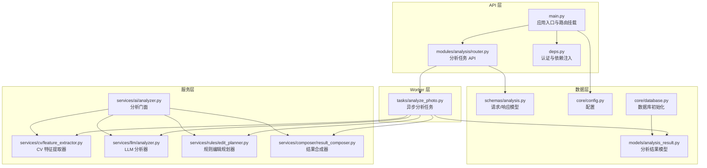
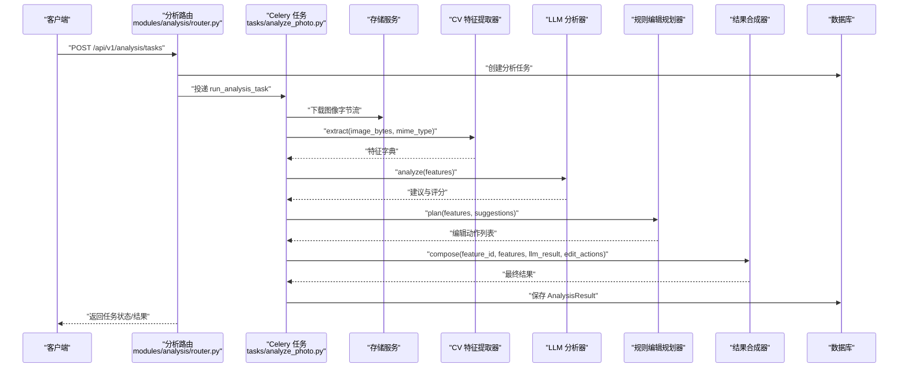
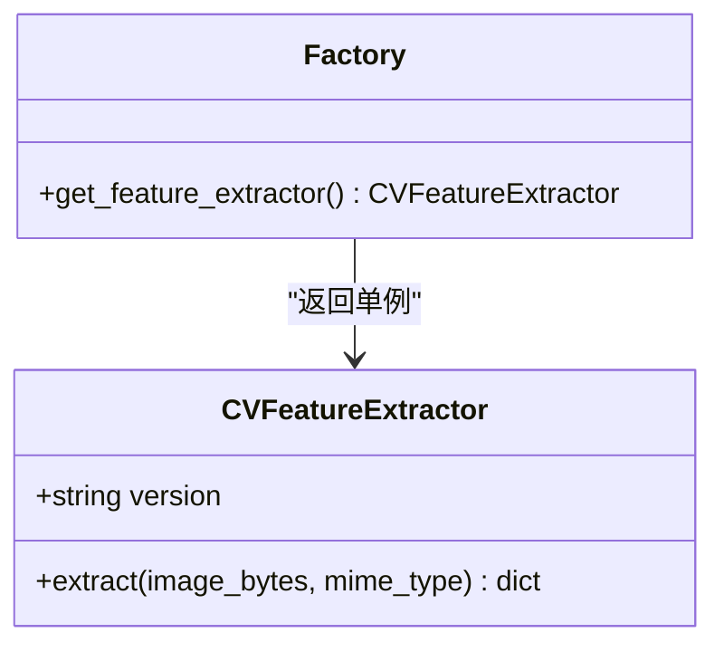
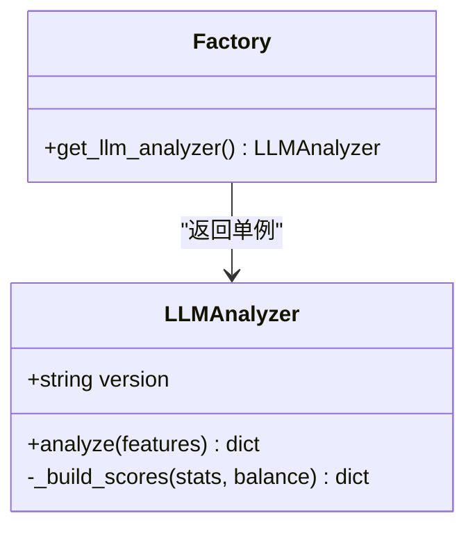
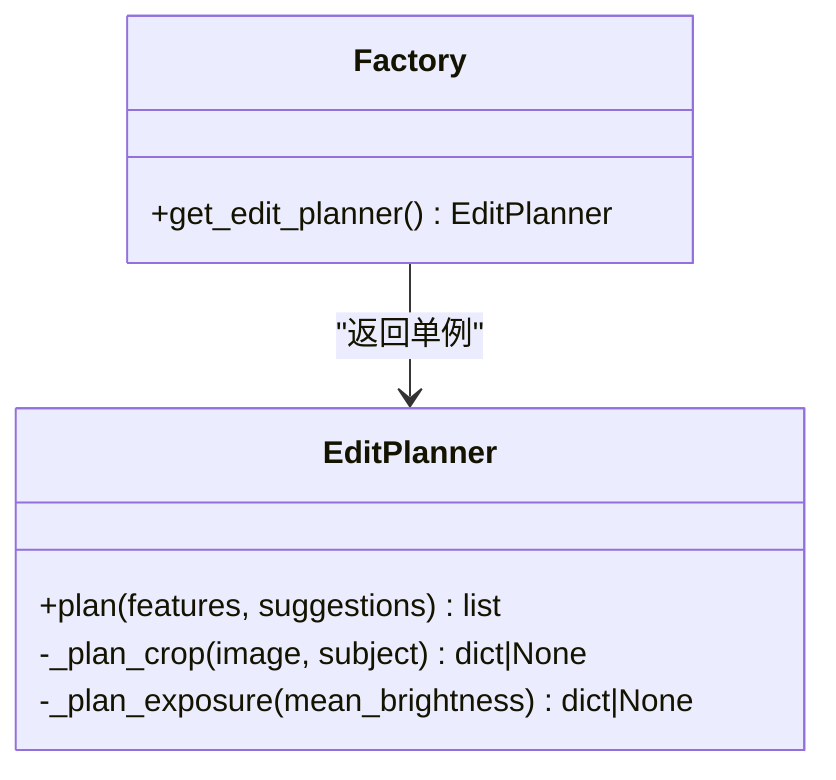
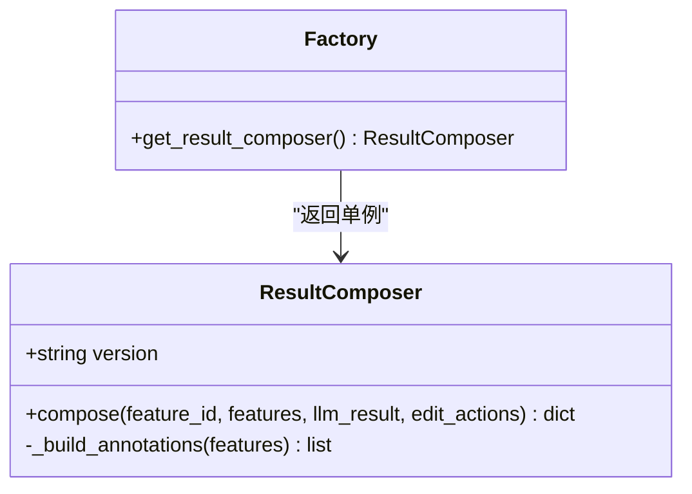
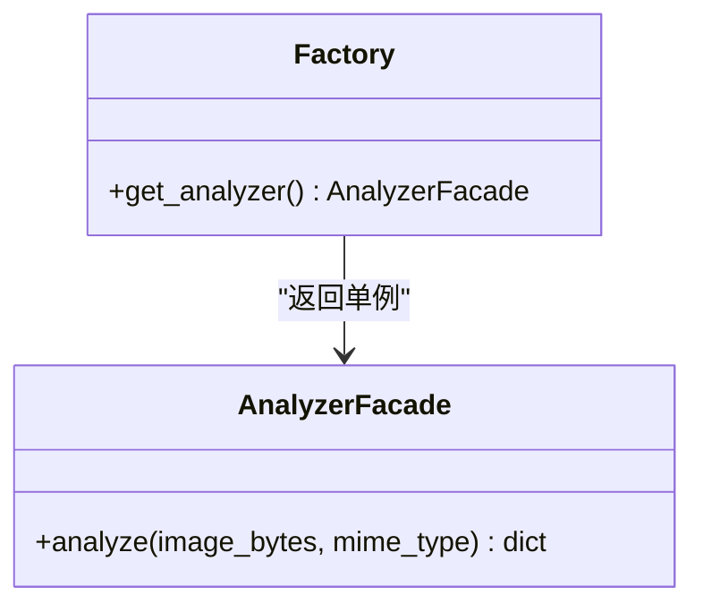
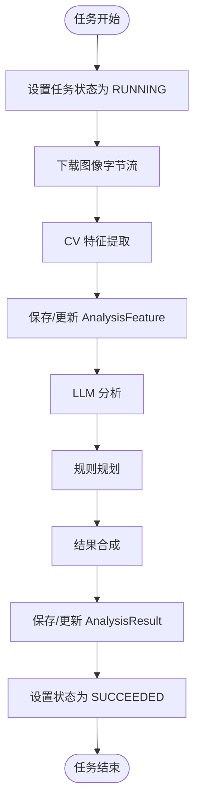
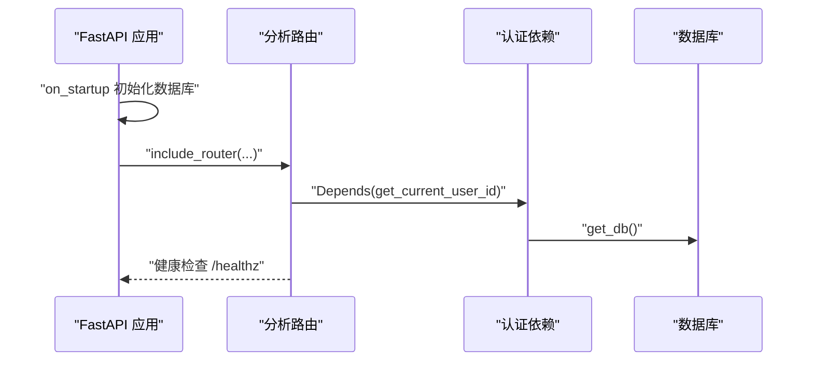
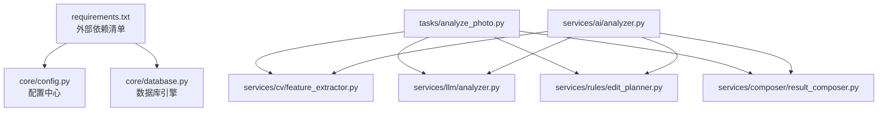

# 插件开发指南

<cite>
**本文引用的文件**
- [apps/api/app/main.py](file://apps/api/app/main.py)
- [apps/api/app/deps.py](file://apps/api/app/deps.py)
- [apps/api/app/services/cv/feature_extractor.py](file://apps/api/app/services/cv/feature_extractor.py)
- [apps/api/app/services/llm/analyzer.py](file://apps/api/app/services/llm/analyzer.py)
- [apps/api/app/services/rules/edit_planner.py](file://apps/api/app/services/rules/edit_planner.py)
- [apps/api/app/services/composer/result_composer.py](file://apps/api/app/services/composer/result_composer.py)
- [apps/api/app/services/ai/analyzer.py](file://apps/api/app/services/ai/analyzer.py)
- [apps/api/app/tasks/analyze_photo.py](file://apps/api/app/tasks/analyze_photo.py)
- [apps/api/app/modules/analysis/router.py](file://apps/api/app/modules/analysis/router.py)
- [apps/api/app/models/analysis_result.py](file://apps/api/app/models/analysis_result.py)
- [apps/api/app/schemas/analysis.py](file://apps/api/app/schemas/analysis.py)
- [apps/api/app/core/config.py](file://apps/api/app/core/config.py)
- [apps/api/app/core/database.py](file://apps/api/app/core/database.py)
- [apps/api/requirements.txt](file://apps/api/requirements.txt)
- [docs/architecture-v2.md](file://docs/architecture-v2.md)
</cite>

## 目录
1. [简介](#简介)
2. [项目结构](#项目结构)
3. [核心组件](#核心组件)
4. [架构总览](#架构总览)
5. [详细组件分析](#详细组件分析)
6. [依赖分析](#依赖分析)
7. [性能考虑](#性能考虑)
8. [故障排查指南](#故障排查指南)
9. [结论](#结论)
10. [附录](#附录)

## 简介
本指南面向希望为“AI摄影教练”项目开发新插件的开发者，重点讲解如何扩展以下三类能力：
- 计算机视觉（CV）模块：图像特征提取器
- 大语言模型（LLM）模块：分析器与建议生成
- 规则引擎：编辑规划器与动作生成

文档将阐述插件接口设计原则、实现规范、注册机制、生命周期管理与依赖注入方式，并提供测试方法、调试技巧、性能优化建议与最佳实践。

## 项目结构
后端采用 FastAPI + Celery 异步任务架构，核心模块按职责分层：
- API 层：FastAPI 路由与认证依赖注入
- Worker 层：Celery 任务执行
- 服务层：CV 特征提取、LLM 分析、规则编辑规划、结果合成
- 数据层：SQLAlchemy 模型与 Alembic 迁移
- 配置层：Pydantic Settings 与数据库连接

图表来源
- [apps/api/app/main.py:1-36](file://apps/api/app/main.py#L1-L36)
- [apps/api/app/modules/analysis/router.py:1-151](file://apps/api/app/modules/analysis/router.py#L1-L151)
- [apps/api/app/tasks/analyze_photo.py:1-108](file://apps/api/app/tasks/analyze_photo.py#L1-L108)
- [apps/api/app/services/cv/feature_extractor.py:1-98](file://apps/api/app/services/cv/feature_extractor.py#L1-L98)
- [apps/api/app/services/llm/analyzer.py:1-139](file://apps/api/app/services/llm/analyzer.py#L1-L139)
- [apps/api/app/services/rules/edit_planner.py:1-97](file://apps/api/app/services/rules/edit_planner.py#L1-L97)
- [apps/api/app/services/composer/result_composer.py:1-99](file://apps/api/app/services/composer/result_composer.py#L1-L99)
- [apps/api/app/services/ai/analyzer.py:1-27](file://apps/api/app/services/ai/analyzer.py#L1-L27)
- [apps/api/app/models/analysis_result.py:1-28](file://apps/api/app/models/analysis_result.py#L1-L28)
- [apps/api/app/schemas/analysis.py:1-52](file://apps/api/app/schemas/analysis.py#L1-L52)
- [apps/api/app/core/config.py:1-47](file://apps/api/app/core/config.py#L1-L47)
- [apps/api/app/core/database.py:1-39](file://apps/api/app/core/database.py#L1-L39)

章节来源
- [apps/api/app/main.py:1-36](file://apps/api/app/main.py#L1-L36)
- [apps/api/app/core/config.py:1-47](file://apps/api/app/core/config.py#L1-L47)
- [apps/api/app/core/database.py:1-39](file://apps/api/app/core/database.py#L1-L39)

## 核心组件
本项目通过“CV 事实 + LLM 解释 + 规则动作”的分层设计，确保插件扩展的稳定性与可维护性。核心组件如下：
- CV 特征提取器：从图像字节流中提取统计特征、主体区域、高光/阴影区域与构图辅助线
- LLM 分析器：基于 CV 特征生成摘要、建议与评分
- 规则编辑规划器：基于特征与建议生成可执行的编辑动作
- 结果合成器：统一输出协议，包含摘要、建议、评分、标注与编辑动作
- 分析门面：协调各子服务，提供统一分析入口
- 异步任务：拉取图像、执行分析、持久化结果

章节来源
- [apps/api/app/services/cv/feature_extractor.py:12-98](file://apps/api/app/services/cv/feature_extractor.py#L12-L98)
- [apps/api/app/services/llm/analyzer.py:5-139](file://apps/api/app/services/llm/analyzer.py#L5-L139)
- [apps/api/app/services/rules/edit_planner.py:5-97](file://apps/api/app/services/rules/edit_planner.py#L5-L97)
- [apps/api/app/services/composer/result_composer.py:5-99](file://apps/api/app/services/composer/result_composer.py#L5-L99)
- [apps/api/app/services/ai/analyzer.py:10-27](file://apps/api/app/services/ai/analyzer.py#L10-L27)
- [apps/api/app/tasks/analyze_photo.py:19-108](file://apps/api/app/tasks/analyze_photo.py#L19-L108)

## 架构总览
下图展示了从 API 调用到异步任务执行、再到结果持久化的完整链路，以及各插件模块之间的协作关系。

图表来源
- [apps/api/app/modules/analysis/router.py:45-74](file://apps/api/app/modules/analysis/router.py#L45-L74)
- [apps/api/app/tasks/analyze_photo.py:19-108](file://apps/api/app/tasks/analyze_photo.py#L19-L108)
- [apps/api/app/services/cv/feature_extractor.py:15-91](file://apps/api/app/services/cv/feature_extractor.py#L15-L91)
- [apps/api/app/services/llm/analyzer.py:8-118](file://apps/api/app/services/llm/analyzer.py#L8-L118)
- [apps/api/app/services/rules/edit_planner.py:6-34](file://apps/api/app/services/rules/edit_planner.py#L6-L34)
- [apps/api/app/services/composer/result_composer.py:8-23](file://apps/api/app/services/composer/result_composer.py#L8-L23)
- [apps/api/app/models/analysis_result.py:10-28](file://apps/api/app/models/analysis_result.py#L10-L28)

## 详细组件分析

### CV 计算机视觉模块（特征提取器）
- 设计原则
  - 输入：图像字节流与 MIME 类型
  - 输出：标准化特征字典，包含图像尺寸、统计值、主体区域、高光/阴影区域、构图辅助线
  - 版本化：通过版本字段保证前后兼容
- 实现要点
  - 使用缓存工厂函数提供单例实例，降低重复初始化开销
  - 对图像进行灰度转换与统计计算，避免对原始像素的重复处理
  - 将坐标统一为原图像素坐标，便于前端渲染与动作应用
- 扩展建议
  - 新增检测器时，遵循现有特征字典结构，补充对应键值
  - 保持输入输出协议稳定，必要时增加版本号
  - 在工厂函数中注册新提取器，供门面统一调用

图表来源
- [apps/api/app/services/cv/feature_extractor.py:12-98](file://apps/api/app/services/cv/feature_extractor.py#L12-L98)

章节来源
- [apps/api/app/services/cv/feature_extractor.py:12-98](file://apps/api/app/services/cv/feature_extractor.py#L12-L98)

### LLM 大语言模型模块（分析器）
- 设计原则
  - 输入：CV 提取的特征字典
  - 输出：摘要、建议列表与评分
  - 建议包含问题描述与可执行动作，便于规则引擎进一步规划
- 实现要点
  - 基于主体重心与平均亮度等指标生成建议
  - 评分计算综合构图、曝光、色彩与故事性
  - 工厂函数提供单例，避免重复初始化
- 扩展建议
  - 将提示词与规则逻辑封装为独立模块，便于迭代
  - 建议与评分字段需与前端协议一致，避免解析歧义

图表来源
- [apps/api/app/services/llm/analyzer.py:5-139](file://apps/api/app/services/llm/analyzer.py#L5-L139)

章节来源
- [apps/api/app/services/llm/analyzer.py:5-139](file://apps/api/app/services/llm/analyzer.py#L5-L139)

### 规则引擎（编辑规划器）
- 设计原则
  - 输入：CV 特征与 LLM 建议
  - 输出：可执行编辑动作列表，包含裁剪、曝光、白平衡等
  - 动作需包含预览性、非破坏性/破坏性模式与参数
- 实现要点
  - 基于主体重心偏移自动规划裁剪区域
  - 基于亮度阈值自动规划曝光调整
  - 为后续调色预留轻量白平衡动作
- 扩展建议
  - 新增动作类型时，完善参数结构与应用模式
  - 保持动作来源标注（如 rule），便于追踪与审计

图表来源
- [apps/api/app/services/rules/edit_planner.py:5-97](file://apps/api/app/services/rules/edit_planner.py#L5-L97)

章节来源
- [apps/api/app/services/rules/edit_planner.py:5-97](file://apps/api/app/services/rules/edit_planner.py#L5-L97)

### 结果合成器（统一输出协议）
- 设计原则
  - 将 CV 特征、LLM 建议与规则动作整合为统一协议
  - 输出包含摘要、建议、评分、标注与编辑动作
- 实现要点
  - 标注支持多种几何类型与来源（cv/llm/rule）
  - 动作包含预览性与应用模式，便于前端执行
- 扩展建议
  - 新增标注类别时，完善几何类型与消息内容
  - 保持版本号，确保前后端兼容

图表来源
- [apps/api/app/services/composer/result_composer.py:5-99](file://apps/api/app/services/composer/result_composer.py#L5-L99)

章节来源
- [apps/api/app/services/composer/result_composer.py:5-99](file://apps/api/app/services/composer/result_composer.py#L5-L99)

### 分析门面（统一分析入口）
- 设计原则
  - 协调 CV、LLM、规则与合成器，提供统一分析接口
  - 通过工厂函数获取各子服务实例，简化调用
- 实现要点
  - 串行执行特征提取 → LLM 分析 → 规则规划 → 结果合成
  - 缓存门面实例，避免重复初始化

图表来源
- [apps/api/app/services/ai/analyzer.py:10-27](file://apps/api/app/services/ai/analyzer.py#L10-L27)

章节来源
- [apps/api/app/services/ai/analyzer.py:10-27](file://apps/api/app/services/ai/analyzer.py#L10-L27)

### 异步任务（分析流水线）
- 设计原则
  - 任务驱动：通过 Celery 异步执行，避免阻塞 API
  - 安全性：任务执行前更新任务状态、计数与时间戳
  - 可恢复性：异常时记录错误码与消息，支持重试
- 实现要点
  - 下载图像字节流 → 特征提取 → LLM 分析 → 规则规划 → 结果合成 → 持久化
  - 重复特征与结果记录时，采用更新策略而非重复插入

图表来源
- [apps/api/app/tasks/analyze_photo.py:19-108](file://apps/api/app/tasks/analyze_photo.py#L19-L108)

章节来源
- [apps/api/app/tasks/analyze_photo.py:19-108](file://apps/api/app/tasks/analyze_photo.py#L19-L108)

### API 路由与认证（插件注册与生命周期）
- 路由挂载：在应用启动时挂载分析、认证、图片与用户相关路由
- 认证依赖：通过依赖注入获取当前用户，确保任务权限校验
- 生命周期：应用启动时初始化数据库；任务执行时建立数据库会话并提交事务

图表来源
- [apps/api/app/main.py:27-36](file://apps/api/app/main.py#L27-L36)
- [apps/api/app/deps.py:15-41](file://apps/api/app/deps.py#L15-L41)
- [apps/api/app/core/database.py:27-39](file://apps/api/app/core/database.py#L27-L39)

章节来源
- [apps/api/app/main.py:1-36](file://apps/api/app/main.py#L1-L36)
- [apps/api/app/deps.py:15-41](file://apps/api/app/deps.py#L15-L41)
- [apps/api/app/core/database.py:27-39](file://apps/api/app/core/database.py#L27-L39)

## 依赖分析
- 外部依赖：FastAPI、Celery、SQLAlchemy、Pillow、Redis、MinIO 等
- 内部依赖：服务层通过工厂函数解耦，API 层与任务层仅依赖服务接口
- 配置依赖：通过 Pydantic Settings 统一管理数据库、存储与 CORS 等配置

图表来源
- [apps/api/requirements.txt:1-19](file://apps/api/requirements.txt#L1-L19)
- [apps/api/app/core/config.py:6-47](file://apps/api/app/core/config.py#L6-L47)
- [apps/api/app/core/database.py:12-39](file://apps/api/app/core/database.py#L12-L39)
- [apps/api/app/services/ai/analyzer.py:4-7](file://apps/api/app/services/ai/analyzer.py#L4-L7)
- [apps/api/app/tasks/analyze_photo.py:12-16](file://apps/api/app/tasks/analyze_photo.py#L12-L16)

章节来源
- [apps/api/requirements.txt:1-19](file://apps/api/requirements.txt#L1-L19)
- [apps/api/app/core/config.py:6-47](file://apps/api/app/core/config.py#L6-L47)
- [apps/api/app/core/database.py:12-39](file://apps/api/app/core/database.py#L12-L39)

## 性能考虑
- 缓存与单例
  - 使用工厂函数配合 LRU 缓存，避免重复初始化
  - 建议对耗时操作（如模型加载、图像解码）进行缓存
- I/O 优化
  - 存储服务应支持流式下载与断点续传
  - 数据库批量写入与索引优化，减少锁竞争
- 并发与队列
  - Celery 任务池大小与并发度需结合硬件资源调优
  - 任务优先级与路由分离，避免长耗时任务阻塞短任务
- 前端渲染
  - 标注与动作坐标统一使用原图像素，前端仅做比例映射
  - 预览动作与非破坏性编辑优先，减少不可逆操作

## 故障排查指南
- 认证失败
  - 检查 Bearer Token 是否正确传递与签名验证是否通过
  - 确认用户状态有效且未被禁用
- 任务执行异常
  - 查看任务状态与错误码/消息，定位具体环节
  - 检查存储服务可用性与权限
  - 核对数据库连接与迁移状态
- 结果缺失或版本不匹配
  - 确认 AnalysisResult 是否成功写入
  - 检查版本号与协议一致性
- 性能瓶颈
  - 关注 CV 特征提取与 LLM 分析耗时
  - 评估缓存命中率与数据库查询计划

章节来源
- [apps/api/app/deps.py:15-41](file://apps/api/app/deps.py#L15-L41)
- [apps/api/app/tasks/analyze_photo.py:97-107](file://apps/api/app/tasks/analyze_photo.py#L97-L107)
- [apps/api/app/models/analysis_result.py:10-28](file://apps/api/app/models/analysis_result.py#L10-L28)

## 结论
通过“CV 事实 + LLM 解释 + 规则动作”的分层设计，项目实现了插件化扩展的清晰边界与稳定协议。开发者可按照本文档的接口设计原则与实现规范，快速开发新的 CV、LLM 或规则插件，并通过工厂函数与依赖注入机制无缝接入现有流水线。

## 附录

### 插件接口设计原则与实现规范
- 统一输入输出协议
  - CV：输入图像字节流与 MIME 类型；输出特征字典（含版本）
  - LLM：输入特征字典；输出摘要、建议与评分
  - 规则：输入特征与建议；输出动作列表（含参数与应用模式）
- 版本化与兼容性
  - 每个插件维护版本号，输出协议包含版本字段
  - 建议向前兼容，避免破坏性变更
- 工厂函数与单例
  - 通过工厂函数提供单例实例，避免重复初始化
  - 门面统一协调各子服务，简化调用方复杂度
- 错误处理与可观测性
  - 任务异常时记录错误码与消息，支持重试
  - 为每个动作与标注添加来源与理由，便于审计

章节来源
- [apps/api/app/services/cv/feature_extractor.py:12-98](file://apps/api/app/services/cv/feature_extractor.py#L12-L98)
- [apps/api/app/services/llm/analyzer.py:5-139](file://apps/api/app/services/llm/analyzer.py#L5-L139)
- [apps/api/app/services/rules/edit_planner.py:5-97](file://apps/api/app/services/rules/edit_planner.py#L5-L97)
- [apps/api/app/services/composer/result_composer.py:5-99](file://apps/api/app/services/composer/result_composer.py#L5-L99)
- [apps/api/app/services/ai/analyzer.py:10-27](file://apps/api/app/services/ai/analyzer.py#L10-L27)

### 具体示例（代码片段路径）
- 自定义 CV 特征提取器
  - 参考路径：[apps/api/app/services/cv/feature_extractor.py:15-91](file://apps/api/app/services/cv/feature_extractor.py#L15-L91)
- 自定义 LLM 分析器
  - 参考路径：[apps/api/app/services/llm/analyzer.py:8-118](file://apps/api/app/services/llm/analyzer.py#L8-L118)
- 自定义规则编辑规划器
  - 参考路径：[apps/api/app/services/rules/edit_planner.py:6-34](file://apps/api/app/services/rules/edit_planner.py#L6-L34)
- 自定义结果合成器
  - 参考路径：[apps/api/app/services/composer/result_composer.py:8-23](file://apps/api/app/services/composer/result_composer.py#L8-L23)
- 分析门面协调
  - 参考路径：[apps/api/app/services/ai/analyzer.py:11-20](file://apps/api/app/services/ai/analyzer.py#L11-L20)

### 插件注册机制、生命周期管理与依赖注入
- 注册机制
  - 通过工厂函数暴露单例实例，供门面与任务统一调用
- 生命周期管理
  - 应用启动时初始化数据库；任务执行时建立/关闭数据库会话
- 依赖注入
  - API 层通过依赖注入获取当前用户与数据库会话
  - 任务层通过工厂函数获取各服务实例

章节来源
- [apps/api/app/services/ai/analyzer.py:4-7](file://apps/api/app/services/ai/analyzer.py#L4-L7)
- [apps/api/app/tasks/analyze_photo.py:12-16](file://apps/api/app/tasks/analyze_photo.py#L12-L16)
- [apps/api/app/deps.py:15-41](file://apps/api/app/deps.py#L15-L41)
- [apps/api/app/core/database.py:19-39](file://apps/api/app/core/database.py#L19-L39)

### 测试方法与调试技巧
- 单元测试
  - 针对每个插件编写独立单元测试，模拟输入与断言输出
  - 使用内存数据库或测试专用配置，隔离外部依赖
- 集成测试
  - 通过 API 路由创建任务，观察任务状态与结果
  - 使用最小化图像样本验证完整流水线
- 调试技巧
  - 在任务中打印关键中间结果（特征、建议、动作）
  - 使用 Redis/数据库可视化工具检查任务队列与持久化状态
  - 前后端联调时，严格遵循标注与动作协议

章节来源
- [apps/api/app/modules/analysis/router.py:45-151](file://apps/api/app/modules/analysis/router.py#L45-L151)
- [apps/api/app/tasks/analyze_photo.py:19-108](file://apps/api/app/tasks/analyze_photo.py#L19-L108)

### 性能优化建议与最佳实践
- 缓存策略
  - 对图像解码、模型推理与特征提取结果进行缓存
  - 控制缓存大小与过期策略，避免内存膨胀
- I/O 优化
  - 使用流式下载与压缩传输，减少网络延迟
  - 数据库批量写入与索引优化，避免热点更新
- 并发与队列
  - 合理设置 Celery 并发度与任务路由
  - 区分长耗时与短任务，避免相互阻塞
- 协议与版本
  - 严格遵守输出协议，避免前端二次解析
  - 版本化输出，确保前后端兼容

章节来源
- [apps/api/app/services/cv/feature_extractor.py:94-98](file://apps/api/app/services/cv/feature_extractor.py#L94-L98)
- [apps/api/app/services/llm/analyzer.py:135-139](file://apps/api/app/services/llm/analyzer.py#L135-L139)
- [apps/api/app/services/rules/edit_planner.py:93-97](file://apps/api/app/services/rules/edit_planner.py#L93-L97)
- [apps/api/app/services/composer/result_composer.py:95-99](file://apps/api/app/services/composer/result_composer.py#L95-L99)
- [apps/api/app/services/ai/analyzer.py:23-27](file://apps/api/app/services/ai/analyzer.py#L23-L27)