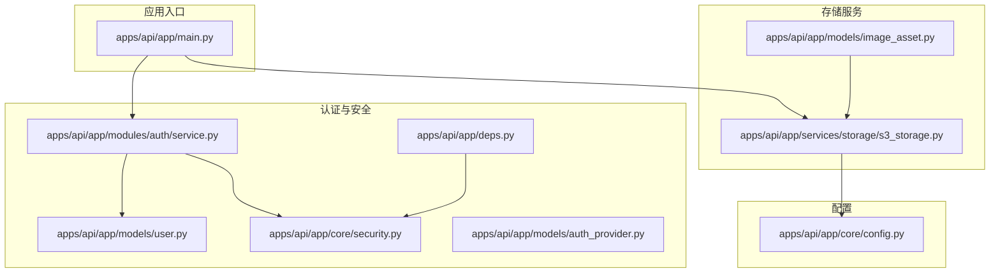
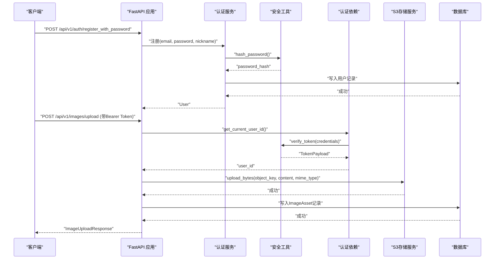
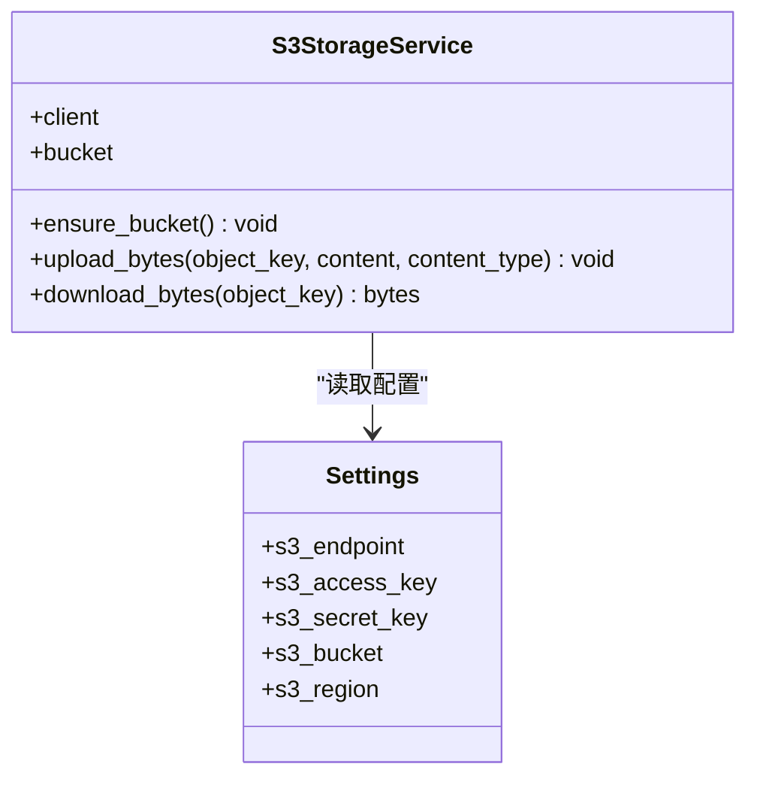
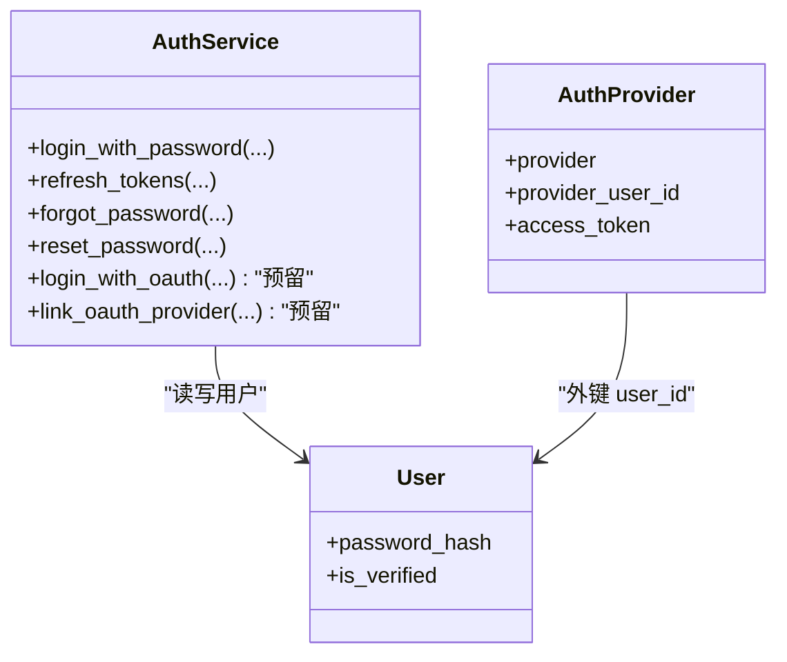
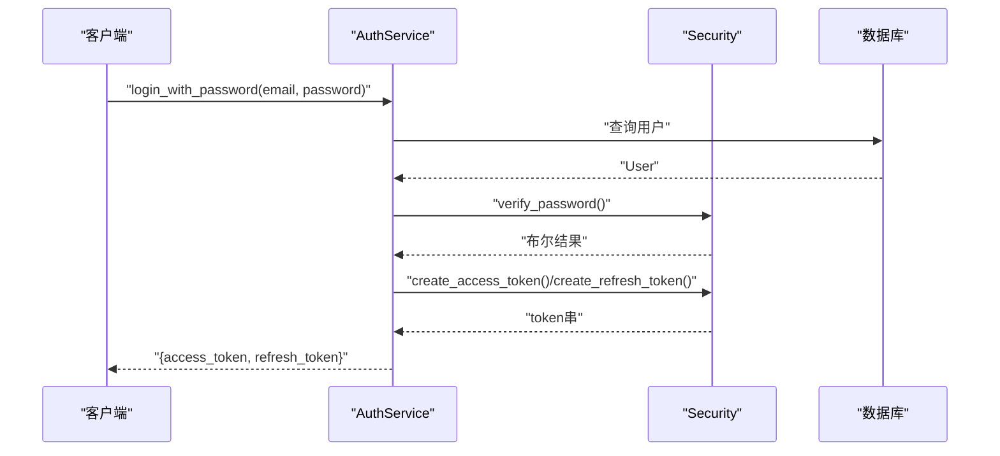
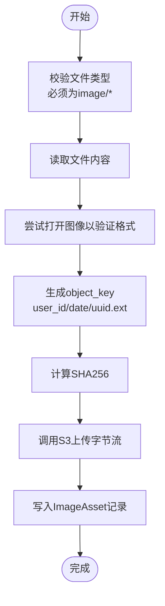
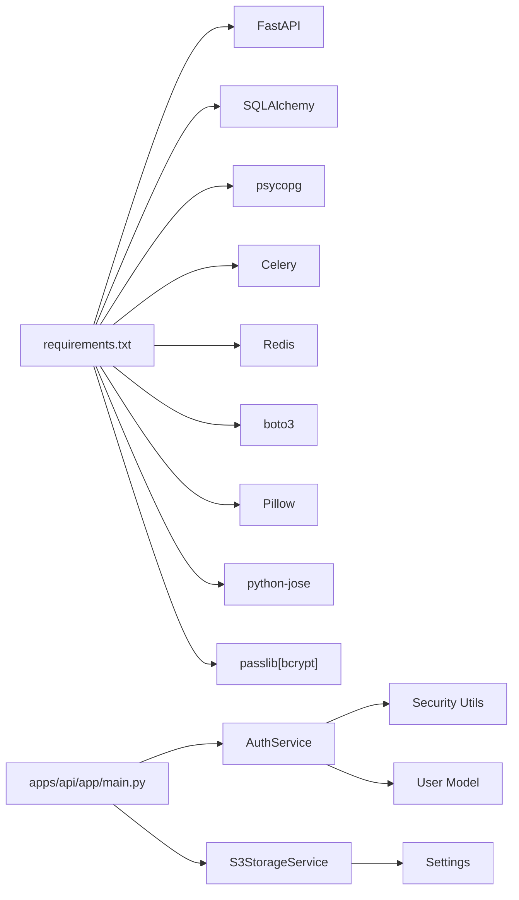

# 第三方服务集成

<cite>
**本文引用的文件**
- [apps/api/app/core/config.py](file://apps/api/app/core/config.py)
- [apps/api/app/services/storage/s3_storage.py](file://apps/api/app/services/storage/s3_storage.py)
- [apps/api/app/modules/auth/service.py](file://apps/api/app/modules/auth/service.py)
- [apps/api/app/core/security.py](file://apps/api/app/core/security.py)
- [apps/api/app/deps.py](file://apps/api/app/deps.py)
- [apps/api/app/models/auth_provider.py](file://apps/api/app/models/auth_provider.py)
- [apps/api/app/models/user.py](file://apps/api/app/models/user.py)
- [apps/api/app/modules/images/router.py](file://apps/api/app/modules/images/router.py)
- [apps/api/app/models/image_asset.py](file://apps/api/app/models/image_asset.py)
- [apps/api/app/main.py](file://apps/api/app/main.py)
- [apps/api/requirements.txt](file://apps/api/requirements.txt)
</cite>

## 目录
1. [简介](#简介)
2. [项目结构](#项目结构)
3. [核心组件](#核心组件)
4. [架构总览](#架构总览)
5. [详细组件分析](#详细组件分析)
6. [依赖分析](#依赖分析)
7. [性能考虑](#性能考虑)
8. [故障排除指南](#故障排除指南)
9. [结论](#结论)
10. [附录](#附录)

## 简介
本文件面向“AI摄影教练”项目的第三方服务集成，重点覆盖以下方面：
- S3兼容存储（MinIO）的集成方法与配置项
- OAuth2第三方认证的实现预留与AuthProvider表设计
- 认证服务扩展至多Provider的实现路径
- API密钥管理、服务配置与错误处理最佳实践
- 具体集成步骤与常见问题排查

## 项目结构
后端采用FastAPI应用，按功能模块组织，认证与安全、存储、AI分析、图片上传等均在独立模块中实现。S3存储服务通过boto3客户端封装，认证体系基于JWT与密码哈希。

图表来源
- [apps/api/app/main.py:1-36](file://apps/api/app/main.py#L1-L36)
- [apps/api/app/modules/auth/service.py:1-145](file://apps/api/app/modules/auth/service.py#L1-L145)
- [apps/api/app/core/security.py:1-72](file://apps/api/app/core/security.py#L1-L72)
- [apps/api/app/deps.py:1-41](file://apps/api/app/deps.py#L1-L41)
- [apps/api/app/models/user.py:1-28](file://apps/api/app/models/user.py#L1-L28)
- [apps/api/app/models/auth_provider.py:1-24](file://apps/api/app/models/auth_provider.py#L1-L24)
- [apps/api/app/services/storage/s3_storage.py:1-59](file://apps/api/app/services/storage/s3_storage.py#L1-L59)
- [apps/api/app/models/image_asset.py:1-32](file://apps/api/app/models/image_asset.py#L1-L32)
- [apps/api/app/core/config.py:1-47](file://apps/api/app/core/config.py#L1-L47)

章节来源
- [apps/api/app/main.py:1-36](file://apps/api/app/main.py#L1-L36)
- [apps/api/app/core/config.py:1-47](file://apps/api/app/core/config.py#L1-L47)

## 核心组件
- 配置中心：集中管理数据库、Redis、S3、JWT等配置项，提供缓存实例与CORS来源列表转换。
- S3存储服务：封装boto3客户端，提供桶检查、对象上传/下载、异常转HTTP状态码。
- 认证服务：提供邮箱+密码注册/登录、刷新令牌、邮箱验证、忘记/重置密码；预留OAuth2接口。
- 安全工具：密码哈希/校验、JWT签发/校验、Token载荷模型。
- 认证依赖：从Bearer Token解析用户，统一鉴权入口。
- 图片上传模块：接收图片、校验格式、调用S3存储、写入资产表。
- 用户与第三方Provider模型：用户模型与AuthProvider预留表结构。

章节来源
- [apps/api/app/core/config.py:1-47](file://apps/api/app/core/config.py#L1-L47)
- [apps/api/app/services/storage/s3_storage.py:1-59](file://apps/api/app/services/storage/s3_storage.py#L1-L59)
- [apps/api/app/modules/auth/service.py:1-145](file://apps/api/app/modules/auth/service.py#L1-L145)
- [apps/api/app/core/security.py:1-72](file://apps/api/app/core/security.py#L1-L72)
- [apps/api/app/deps.py:1-41](file://apps/api/app/deps.py#L1-L41)
- [apps/api/app/models/user.py:1-28](file://apps/api/app/models/user.py#L1-L28)
- [apps/api/app/models/auth_provider.py:1-24](file://apps/api/app/models/auth_provider.py#L1-L24)
- [apps/api/app/modules/images/router.py:1-77](file://apps/api/app/modules/images/router.py#L1-L77)
- [apps/api/app/models/image_asset.py:1-32](file://apps/api/app/models/image_asset.py#L1-L32)

## 架构总览
下图展示从客户端到认证、存储与AI分析的整体流程。

图表来源
- [apps/api/app/modules/auth/service.py:27-48](file://apps/api/app/modules/auth/service.py#L27-L48)
- [apps/api/app/core/security.py:22-29](file://apps/api/app/core/security.py#L22-L29)
- [apps/api/app/deps.py:15-33](file://apps/api/app/deps.py#L15-L33)
- [apps/api/app/modules/images/router.py:20-77](file://apps/api/app/modules/images/router.py#L20-L77)
- [apps/api/app/services/storage/s3_storage.py:34-43](file://apps/api/app/services/storage/s3_storage.py#L34-L43)

## 详细组件分析

### S3兼容存储集成（MinIO）
- 集成方式
  - 使用boto3客户端，通过endpoint_url、access_key、secret_key、region_name连接S3兼容服务。
  - 默认桶名来自配置，启动时自动检查并创建桶。
  - 提供上传字节流、下载字节流方法，并在异常时统一抛出HTTP 503。
- 关键配置项
  - s3_endpoint：S3服务地址（默认本地MinIO）
  - s3_access_key / s3_secret_key：访问凭据
  - s3_bucket：目标桶名称
  - s3_region：区域标识
- 错误处理
  - ClientError/BotoCoreError统一包装为HTTP 503，便于前端识别存储不可用。
- 使用示例（路径）
  - 上传流程参考：[apps/api/app/modules/images/router.py:48-49](file://apps/api/app/modules/images/router.py#L48-L49)
  - 存储服务初始化与桶确保：[apps/api/app/services/storage/s3_storage.py:53-57](file://apps/api/app/services/storage/s3_storage.py#L53-L57)

图表来源
- [apps/api/app/services/storage/s3_storage.py:11-59](file://apps/api/app/services/storage/s3_storage.py#L11-L59)
- [apps/api/app/core/config.py:16-20](file://apps/api/app/core/config.py#L16-L20)

章节来源
- [apps/api/app/services/storage/s3_storage.py:1-59](file://apps/api/app/services/storage/s3_storage.py#L1-L59)
- [apps/api/app/core/config.py:16-20](file://apps/api/app/core/config.py#L16-L20)
- [apps/api/app/modules/images/router.py:48-49](file://apps/api/app/modules/images/router.py#L48-L49)

### OAuth2第三方认证与AuthProvider表
- 当前状态
  - 用户模型允许OAuth用户无密码字段，认证服务预留OAuth方法接口（注释形式）。
  - AuthProvider表已建模，字段包括provider类型、第三方用户ID、access_token等，便于未来绑定。
- 扩展建议
  - 在AuthService中实现OAuth登录与Provider绑定方法，使用AuthProvider表记录第三方账号与本地用户的映射。
  - 结合现有JWT体系，登录成功后返回access/refresh token。
- 使用方法（路径）
  - 用户模型字段设计：[apps/api/app/models/user.py:17](file://apps/api/app/models/user.py#L17)
  - AuthProvider表结构：[apps/api/app/models/auth_provider.py:12-24](file://apps/api/app/models/auth_provider.py#L12-L24)
  - 认证服务预留接口：[apps/api/app/modules/auth/service.py:142-144](file://apps/api/app/modules/auth/service.py#L142-L144)

图表来源
- [apps/api/app/models/user.py:12-28](file://apps/api/app/models/user.py#L12-L28)
- [apps/api/app/models/auth_provider.py:12-24](file://apps/api/app/models/auth_provider.py#L12-L24)
- [apps/api/app/modules/auth/service.py:21-145](file://apps/api/app/modules/auth/service.py#L21-L145)

章节来源
- [apps/api/app/models/user.py:17](file://apps/api/app/models/user.py#L17)
- [apps/api/app/models/auth_provider.py:12-24](file://apps/api/app/models/auth_provider.py#L12-L24)
- [apps/api/app/modules/auth/service.py:142-144](file://apps/api/app/modules/auth/service.py#L142-L144)

### 认证服务与JWT令牌
- 功能要点
  - 注册：邮箱唯一性检查，密码bcrypt哈希，返回用户对象。
  - 登录：校验密码与账户状态，签发access/refresh token。
  - 刷新：使用refresh token换取新的access token。
  - 邮箱验证：短期JWT作为验证链接，验证后标记用户已验证。
  - 忘记/重置密码：短期JWT用于重置流程。
- 安全工具
  - 密码哈希/校验：bcrypt上下文。
  - JWT签发/校验：密钥、算法、过期时间由配置控制。
- 依赖注入
  - 通过HTTP Bearer获取当前用户，校验失败返回401。
- 使用示例（路径）
  - 注册流程：[apps/api/app/modules/auth/service.py:27-48](file://apps/api/app/modules/auth/service.py#L27-L48)
  - 登录流程：[apps/api/app/modules/auth/service.py:50-75](file://apps/api/app/modules/auth/service.py#L50-L75)
  - 刷新流程：[apps/api/app/modules/auth/service.py:77-92](file://apps/api/app/modules/auth/service.py#L77-L92)
  - 验证/重置流程：[apps/api/app/modules/auth/service.py:98-140](file://apps/api/app/modules/auth/service.py#L98-L140)
  - JWT工具：[apps/api/app/core/security.py:22-71](file://apps/api/app/core/security.py#L22-L71)
  - 依赖注入：[apps/api/app/deps.py:15-33](file://apps/api/app/deps.py#L15-L33)

图表来源
- [apps/api/app/modules/auth/service.py:50-75](file://apps/api/app/modules/auth/service.py#L50-L75)
- [apps/api/app/core/security.py:32-46](file://apps/api/app/core/security.py#L32-L46)

章节来源
- [apps/api/app/modules/auth/service.py:27-140](file://apps/api/app/modules/auth/service.py#L27-L140)
- [apps/api/app/core/security.py:22-71](file://apps/api/app/core/security.py#L22-L71)
- [apps/api/app/deps.py:15-33](file://apps/api/app/deps.py#L15-L33)

### 图片上传与存储集成
- 流程概览
  - 校验文件类型与内容，计算SHA256，生成object_key（用户ID/日期/UUID）。
  - 调用S3存储上传字节流，写入ImageAsset记录（含桶名、对象键、MIME、尺寸、哈希等）。
- 关键点
  - 上传前的格式校验与异常处理。
  - 对象键命名规则与去重约束（ImageAsset表联合唯一索引）。
- 使用示例（路径）
  - 上传路由：[apps/api/app/modules/images/router.py:20-77](file://apps/api/app/modules/images/router.py#L20-L77)
  - 存储服务：[apps/api/app/services/storage/s3_storage.py:34-50](file://apps/api/app/services/storage/s3_storage.py#L34-L50)
  - 资产模型：[apps/api/app/models/image_asset.py:10-32](file://apps/api/app/models/image_asset.py#L10-L32)

图表来源
- [apps/api/app/modules/images/router.py:20-77](file://apps/api/app/modules/images/router.py#L20-L77)
- [apps/api/app/services/storage/s3_storage.py:34-50](file://apps/api/app/services/storage/s3_storage.py#L34-L50)
- [apps/api/app/models/image_asset.py:10-32](file://apps/api/app/models/image_asset.py#L10-L32)

章节来源
- [apps/api/app/modules/images/router.py:20-77](file://apps/api/app/modules/images/router.py#L20-L77)
- [apps/api/app/models/image_asset.py:10-32](file://apps/api/app/models/image_asset.py#L10-L32)

## 依赖分析
- 外部依赖
  - FastAPI、SQLAlchemy、PostgreSQL驱动、Celery/Redis、boto3、Pillow、JWTS、bcrypt等。
- 内部模块耦合
  - 认证模块依赖安全工具与用户模型；图片模块依赖存储服务与资产模型；应用入口聚合各模块路由。
- 配置依赖
  - S3存储服务依赖配置中的S3参数；认证依赖JWT密钥与算法；CORS依赖配置中的来源列表。

图表来源
- [apps/api/requirements.txt:1-19](file://apps/api/requirements.txt#L1-L19)
- [apps/api/app/main.py:6-24](file://apps/api/app/main.py#L6-L24)
- [apps/api/app/modules/auth/service.py:16](file://apps/api/app/modules/auth/service.py#L16)
- [apps/api/app/core/security.py:9](file://apps/api/app/core/security.py#L9)
- [apps/api/app/services/storage/s3_storage.py:8](file://apps/api/app/services/storage/s3_storage.py#L8)

章节来源
- [apps/api/requirements.txt:1-19](file://apps/api/requirements.txt#L1-L19)
- [apps/api/app/main.py:6-24](file://apps/api/app/main.py#L6-L24)

## 性能考虑
- S3客户端超时与重试
  - 连接超时、读取超时与重试次数已在客户端配置中设置，避免长时间阻塞请求。
- 缓存策略
  - 存储服务与配置均使用LRU缓存，减少重复初始化开销。
- 图像处理
  - 上传时仅做基础格式校验与尺寸读取，避免大内存占用；AI分析通过多服务组合，建议异步任务队列执行。
- CORS与中间件
  - 启动时一次性解析CORS来源列表，减少运行时字符串处理。

章节来源
- [apps/api/app/services/storage/s3_storage.py:13-20](file://apps/api/app/services/storage/s3_storage.py#L13-L20)
- [apps/api/app/core/config.py:37-38](file://apps/api/app/core/config.py#L37-L38)

## 故障排除指南
- S3存储不可用
  - 现象：上传/下载返回HTTP 503。
  - 排查：确认endpoint、access_key、secret_key、bucket、region配置正确；MinIO服务可达；桶存在或可创建。
  - 参考：[apps/api/app/services/storage/s3_storage.py:23-32](file://apps/api/app/services/storage/s3_storage.py#L23-L32)
- JWT无效或过期
  - 现象：401未认证。
  - 排查：确认密钥与算法一致；refresh token未过期；客户端携带正确的Authorization头。
  - 参考：[apps/api/app/core/security.py:49-71](file://apps/api/app/core/security.py#L49-L71)，[apps/api/app/deps.py:20-32](file://apps/api/app/deps.py#L20-L32)
- 图片上传失败
  - 现象：400错误（类型不符/空文件/无效图像）。
  - 排查：确认Content-Type为image/*；文件非空；Pillow可识别图像格式。
  - 参考：[apps/api/app/modules/images/router.py:26-37](file://apps/api/app/modules/images/router.py#L26-L37)
- CORS跨域问题
  - 现象：浏览器跨域报错。
  - 排查：核对配置中的cors_origins，确认前端域名与端口在列表内。
  - 参考：[apps/api/app/core/config.py:25-28](file://apps/api/app/core/config.py#L25-L28)，[apps/api/app/main.py:13-19](file://apps/api/app/main.py#L13-L19)

章节来源
- [apps/api/app/services/storage/s3_storage.py:23-32](file://apps/api/app/services/storage/s3_storage.py#L23-L32)
- [apps/api/app/core/security.py:49-71](file://apps/api/app/core/security.py#L49-L71)
- [apps/api/app/deps.py:20-32](file://apps/api/app/deps.py#L20-L32)
- [apps/api/app/modules/images/router.py:26-37](file://apps/api/app/modules/images/router.py#L26-L37)
- [apps/api/app/core/config.py:25-28](file://apps/api/app/core/config.py#L25-L28)
- [apps/api/app/main.py:13-19](file://apps/api/app/main.py#L13-L19)

## 结论
本项目已为第三方服务集成打下坚实基础：S3存储通过boto3与配置中心无缝对接；认证体系基于JWT与密码哈希，具备扩展OAuth2的能力；图片上传模块与存储服务解耦良好。后续可按需接入具体AI服务与第三方Provider，遵循现有安全与配置规范即可快速落地。

## 附录
- 配置项清单（摘自配置中心）
  - 数据库与缓存：db_url、redis_url
  - S3存储：s3_endpoint、s3_access_key、s3_secret_key、s3_bucket、s3_region
  - AI模型：model_name、prompt_version
  - CORS：cors_origins
  - JWT：jwt_secret_key、jwt_algorithm、access_token_expire_minutes、refresh_token_expire_days
- 外部依赖（节选）
  - FastAPI、SQLAlchemy、psycopg、Celery、Redis、boto3、Pillow、python-jose、passlib[bcrypt]、alembic、pytest等

章节来源
- [apps/api/app/core/config.py:9-38](file://apps/api/app/core/config.py#L9-L38)
- [apps/api/requirements.txt:1-19](file://apps/api/requirements.txt#L1-L19)