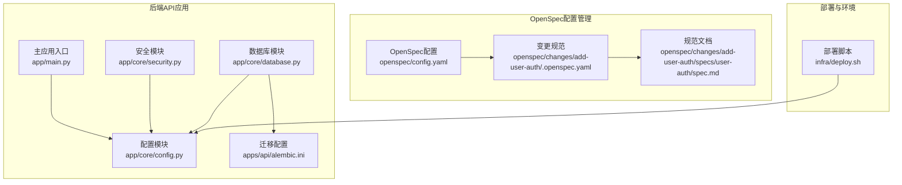
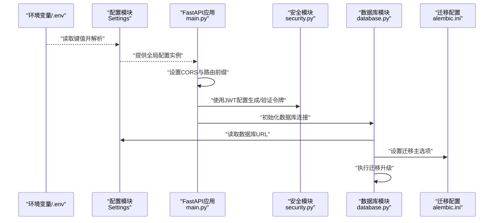
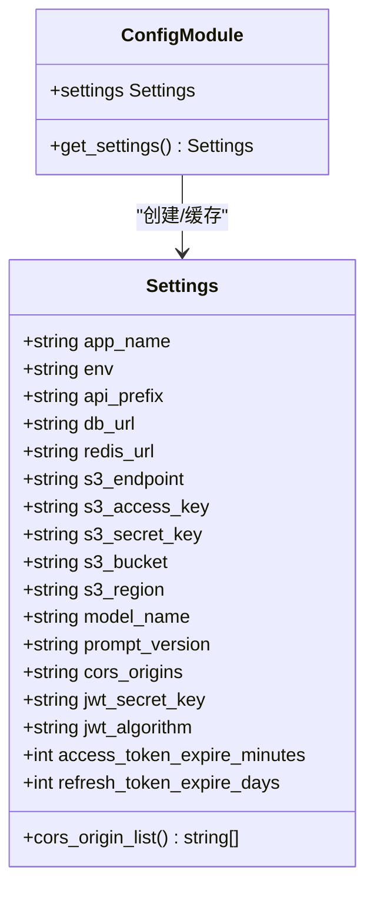
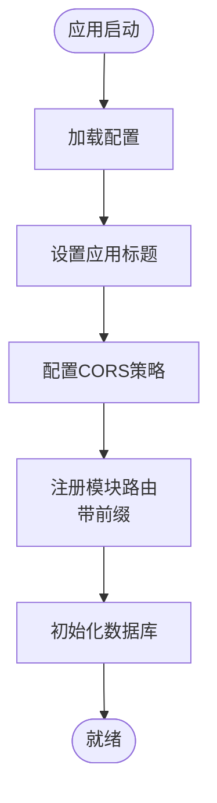
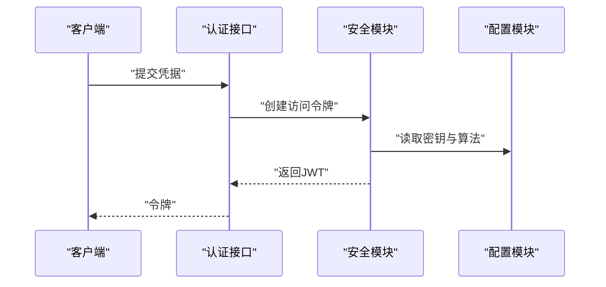
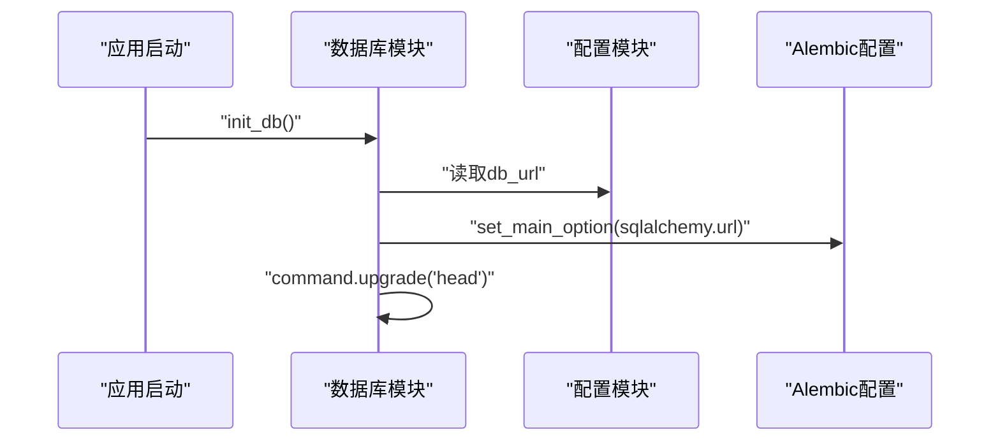
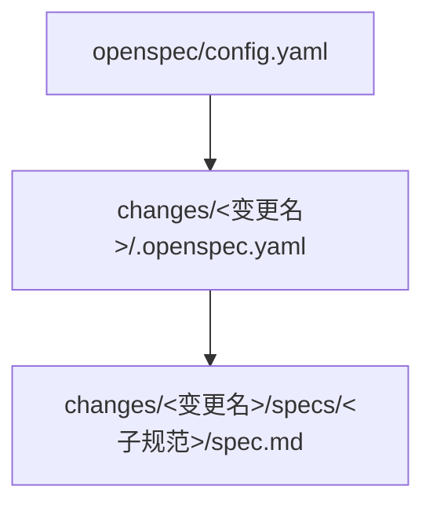
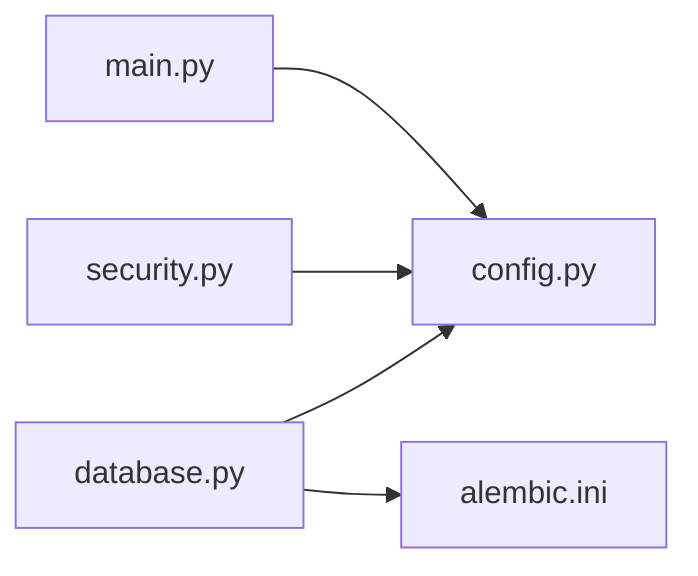

# 配置系统扩展

<cite>
**本文档引用的文件**
- [apps/api/app/core/config.py](file://apps/api/app/core/config.py)
- [apps/api/app/main.py](file://apps/api/app/main.py)
- [apps/api/app/core/security.py](file://apps/api/app/core/security.py)
- [apps/api/app/core/database.py](file://apps/api/app/core/database.py)
- [apps/api/alembic.ini](file://apps/api/alembic.ini)
- [openspec/config.yaml](file://openspec/config.yaml)
- [openspec/changes/add-user-auth/specs/user-auth/spec.md](file://openspec/changes/add-user-auth/specs/user-auth/spec.md)
- [openspec/changes/add-user-auth/.openspec.yaml](file://openspec/changes/add-user-auth/.openspec.yaml)
- [infra/deploy.sh](file://infra/deploy.sh)
</cite>

## 目录
1. [简介](#简介)
2. [项目结构](#项目结构)
3. [核心组件](#核心组件)
4. [架构总览](#架构总览)
5. [详细组件分析](#详细组件分析)
6. [依赖分析](#依赖分析)
7. [性能考虑](#性能考虑)
8. [故障排查指南](#故障排查指南)
9. [结论](#结论)
10. [附录](#附录)

## 简介
本文件面向“AI摄影教练”项目的配置系统扩展，目标是帮助开发者在现有基础上安全地新增环境变量与配置项，规范OpenSpec配置管理流程，明确配置文件组织与命名约定，提供配置验证、类型检查、环境特定配置、热重载与运行时修改、以及配置迁移与版本管理的最佳实践。本文档严格基于仓库中的实际代码与配置文件进行分析与总结。

## 项目结构
本项目采用分层与功能模块结合的组织方式：
- 后端API应用位于 apps/api，核心配置集中在 app/core/config.py 中，通过缓存单例提供全局访问。
- OpenSpec配置管理位于 openspec，用于规范变更与规范文档的结构化管理。
- 部署脚本 infra/deploy.sh 演示了生产环境变量的加载与校验方式。
- Alembic数据库迁移配置位于 apps/api/alembic.ini，与数据库连接配置强关联。

**图表来源**
- [apps/api/app/core/config.py:1-47](file://apps/api/app/core/config.py#L1-L47)
- [apps/api/app/main.py:1-36](file://apps/api/app/main.py#L1-L36)
- [apps/api/app/core/security.py:1-72](file://apps/api/app/core/security.py#L1-L72)
- [apps/api/app/core/database.py:1-39](file://apps/api/app/core/database.py#L1-L39)
- [apps/api/alembic.ini:1-147](file://apps/api/alembic.ini#L1-L147)
- [openspec/config.yaml:1-21](file://openspec/config.yaml#L1-L21)
- [openspec/changes/add-user-auth/.openspec.yaml:1-3](file://openspec/changes/add-user-auth/.openspec.yaml#L1-L3)
- [openspec/changes/add-user-auth/specs/user-auth/spec.md:1-134](file://openspec/changes/add-user-auth/specs/user-auth/spec.md#L1-L134)
- [infra/deploy.sh:1-62](file://infra/deploy.sh#L1-L62)

**章节来源**
- [apps/api/app/core/config.py:1-47](file://apps/api/app/core/config.py#L1-L47)
- [apps/api/app/main.py:1-36](file://apps/api/app/main.py#L1-L36)
- [apps/api/app/core/security.py:1-72](file://apps/api/app/core/security.py#L1-L72)
- [apps/api/app/core/database.py:1-39](file://apps/api/app/core/database.py#L1-L39)
- [apps/api/alembic.ini:1-147](file://apps/api/alembic.ini#L1-L147)
- [openspec/config.yaml:1-21](file://openspec/config.yaml#L1-L21)
- [openspec/changes/add-user-auth/.openspec.yaml:1-3](file://openspec/changes/add-user-auth/.openspec.yaml#L1-L3)
- [openspec/changes/add-user-auth/specs/user-auth/spec.md:1-134](file://openspec/changes/add-user-auth/specs/user-auth/spec.md#L1-L134)
- [infra/deploy.sh:1-62](file://infra/deploy.sh#L1-L62)

## 核心组件
- 配置类与缓存单例
  - 通过 pydantic-settings 的 BaseSettings 定义配置项，支持从 .env 文件读取键值，编码为 UTF-8，额外键忽略。
  - 提供 app_name、env、api_prefix 等应用级配置；数据库连接、Redis连接、S3对象存储等外部服务配置；模型名称与提示词版本；CORS来源列表；JWT认证参数等。
  - 使用 LRU 缓存装饰器提供单例实例，避免重复解析环境变量与配置文件。
- 主应用与中间件
  - FastAPI 应用根据配置动态设置标题、CORS策略与路由前缀。
- 安全模块
  - JWT密钥、算法、过期时间等由配置驱动，确保令牌生成与验证的一致性。
- 数据库模块
  - 通过配置中的数据库URL创建引擎，启用 pre_ping；迁移命令通过 Alembic 配置文件与主配置联动。
- OpenSpec配置管理
  - openspec/config.yaml 定义规范驱动的项目上下文与规则；变更目录下包含 .openspec.yaml 与规范文档，形成结构化的变更与规范体系。
- 部署脚本
  - 生产环境通过 docker compose 加载 .env.prod，校验关键变量的存在性，确保部署前配置可用。

**章节来源**
- [apps/api/app/core/config.py:6-47](file://apps/api/app/core/config.py#L6-L47)
- [apps/api/app/main.py:11-24](file://apps/api/app/main.py#L11-L24)
- [apps/api/app/core/security.py:32-46](file://apps/api/app/core/security.py#L32-L46)
- [apps/api/app/core/database.py:12-38](file://apps/api/app/core/database.py#L12-L38)
- [openspec/config.yaml:1-21](file://openspec/config.yaml#L1-L21)
- [openspec/changes/add-user-auth/.openspec.yaml:1-3](file://openspec/changes/add-user-auth/.openspec.yaml#L1-L3)
- [infra/deploy.sh:35-42](file://infra/deploy.sh#L35-L42)

## 架构总览
下图展示了配置系统在应用启动阶段的关键交互路径，包括配置加载、中间件设置、数据库初始化与迁移。

**图表来源**
- [apps/api/app/core/config.py:6-47](file://apps/api/app/core/config.py#L6-L47)
- [apps/api/app/main.py:11-29](file://apps/api/app/main.py#L11-L29)
- [apps/api/app/core/security.py:32-46](file://apps/api/app/core/security.py#L32-L46)
- [apps/api/app/core/database.py:27-38](file://apps/api/app/core/database.py#L27-L38)
- [apps/api/alembic.ini:84-86](file://apps/api/alembic.ini#L84-L86)

## 详细组件分析

### 配置类与缓存单例
- 设计要点
  - 继承 BaseSettings，定义 Settings 类型安全的配置字段。
  - model_config 指定 env_file 与编码，extra="ignore" 保证未知键不干扰。
  - 提供 cors_origin_list 属性，将逗号分隔字符串转换为列表。
  - 使用 LRU 缓存装饰器提供单例，提升性能与一致性。
- 扩展建议
  - 新增配置项时，优先在 Settings 类中声明字段与默认值，确保类型推断与校验。
  - 若涉及敏感信息，务必通过 .env 文件管理并在部署脚本中校验其存在性。

**图表来源**
- [apps/api/app/core/config.py:6-47](file://apps/api/app/core/config.py#L6-L47)

**章节来源**
- [apps/api/app/core/config.py:6-47](file://apps/api/app/core/config.py#L6-L47)

### 主应用与中间件
- 关键行为
  - 使用 settings.app_name 设置应用标题。
  - 使用 settings.cors_origin_list 配置 CORS 策略。
  - 使用 settings.api_prefix 为各模块路由统一添加前缀。
- 扩展建议
  - 如需新增中间件或路由前缀策略，直接从配置读取，避免硬编码。

**图表来源**
- [apps/api/app/main.py:11-24](file://apps/api/app/main.py#L11-L24)

**章节来源**
- [apps/api/app/main.py:11-24](file://apps/api/app/main.py#L11-L24)

### 安全模块（JWT）
- 关键行为
  - 使用 settings.jwt_secret_key 与 settings.jwt_algorithm 生成与验证令牌。
  - 使用 settings.access_token_expire_minutes 与 settings.refresh_token_expire_days 控制令牌有效期。
- 扩展建议
  - 更改密钥或算法时，确保与部署环境变量一致；令牌过期策略应与业务需求匹配。

**图表来源**
- [apps/api/app/core/security.py:32-46](file://apps/api/app/core/security.py#L32-L46)
- [apps/api/app/core/config.py:31-34](file://apps/api/app/core/config.py#L31-L34)

**章节来源**
- [apps/api/app/core/security.py:32-46](file://apps/api/app/core/security.py#L32-L46)
- [apps/api/app/core/config.py:31-34](file://apps/api/app/core/config.py#L31-L34)

### 数据库模块与迁移
- 关键行为
  - 使用 settings.db_url 创建数据库引擎并启用 pre_ping。
  - 在 init_db 中读取 alembic.ini，设置 sqlalchemy.url 为主配置的数据库URL，然后执行迁移升级到 head。
- 扩展建议
  - 数据库URL变更时，确保 Alembic 配置与主配置同步；迁移脚本应与 schema 版本控制一致。

**图表来源**
- [apps/api/app/core/database.py:27-38](file://apps/api/app/core/database.py#L27-L38)
- [apps/api/alembic.ini:84-86](file://apps/api/alembic.ini#L84-L86)

**章节来源**
- [apps/api/app/core/database.py:12-38](file://apps/api/app/core/database.py#L12-L38)
- [apps/api/alembic.ini:84-86](file://apps/api/alembic.ini#L84-L86)

### OpenSpec配置管理
- 结构与规范
  - openspec/config.yaml 定义规范驱动的项目上下文与规则。
  - 变更目录（如 add-user-auth）包含 .openspec.yaml 与规范文档（spec.md），形成结构化的变更与规范体系。
- 扩展建议
  - 新增配置变更时，遵循 OpenSpec 目录结构，编写 .openspec.yaml 与规范文档，便于团队协作与审计。

**图表来源**
- [openspec/config.yaml:1-21](file://openspec/config.yaml#L1-L21)
- [openspec/changes/add-user-auth/.openspec.yaml:1-3](file://openspec/changes/add-user-auth/.openspec.yaml#L1-L3)
- [openspec/changes/add-user-auth/specs/user-auth/spec.md:1-134](file://openspec/changes/add-user-auth/specs/user-auth/spec.md#L1-L134)

**章节来源**
- [openspec/config.yaml:1-21](file://openspec/config.yaml#L1-L21)
- [openspec/changes/add-user-auth/.openspec.yaml:1-3](file://openspec/changes/add-user-auth/.openspec.yaml#L1-L3)
- [openspec/changes/add-user-auth/specs/user-auth/spec.md:1-134](file://openspec/changes/add-user-auth/specs/user-auth/spec.md#L1-L134)

### 部署与环境变量
- 关键行为
  - 部署脚本 infra/deploy.sh 通过 docker compose 加载 .env.prod，校验关键变量（如 SERVER_IP、POSTGRES_*、S3_* 等）是否存在。
- 扩展建议
  - 新增配置项时，同步更新部署脚本中的校验清单，确保生产环境变量完整。

**章节来源**
- [infra/deploy.sh:35-42](file://infra/deploy.sh#L35-L42)

## 依赖分析
- 组件耦合
  - main.py 依赖配置模块以设置标题、CORS与路由前缀。
  - security.py 依赖配置模块以获取JWT密钥与算法。
  - database.py 依赖配置模块以获取数据库URL，并与 alembic.ini 协作完成迁移。
- 外部依赖
  - pydantic-settings 提供类型安全的配置解析。
  - Alembic 提供数据库迁移能力。
  - Docker Compose 与 .env 文件提供环境变量注入。

**图表来源**
- [apps/api/app/main.py:4](file://apps/api/app/main.py#L4)
- [apps/api/app/core/config.py:46](file://apps/api/app/core/config.py#L46)
- [apps/api/app/core/security.py:9](file://apps/api/app/core/security.py#L9)
- [apps/api/app/core/database.py:9](file://apps/api/app/core/database.py#L9)
- [apps/api/alembic.ini:8](file://apps/api/alembic.ini#L8)

**章节来源**
- [apps/api/app/main.py:4-24](file://apps/api/app/main.py#L4-L24)
- [apps/api/app/core/security.py:9](file://apps/api/app/core/security.py#L9)
- [apps/api/app/core/database.py:9-38](file://apps/api/app/core/database.py#L9-L38)

## 性能考虑
- 配置缓存
  - 使用 LRU 缓存装饰器提供单例配置实例，避免重复解析与IO开销。
- 数据库连接池
  - engine 创建时启用 pool_pre_ping，提升连接稳定性与可用性。
- 迁移执行
  - 迁移在应用启动时执行，确保 schema 一致性；建议在CI/CD中单独执行迁移步骤，减少启动延迟。

**章节来源**
- [apps/api/app/core/config.py:41-43](file://apps/api/app/core/config.py#L41-L43)
- [apps/api/app/core/database.py:12](file://apps/api/app/core/database.py#L12)
- [apps/api/app/core/database.py:27-38](file://apps/api/app/core/database.py#L27-L38)

## 故障排查指南
- 配置未生效
  - 检查 .env 文件路径与编码是否正确，确认 model_config 的 env_file 与 env_file_encoding 设置。
  - 确认配置项拼写与大小写一致，extra="ignore" 不会报错但也不会注入未知键。
- CORS问题
  - 检查 cors_origins 是否为逗号分隔的有效URL列表，确认 cors_origin_list 属性解析逻辑。
- JWT错误
  - 确认 jwt_secret_key 与 jwt_algorithm 与部署环境一致；检查令牌过期时间是否合理。
- 数据库连接失败
  - 检查 db_url 格式与可达性；确认 Alembic 配置与主配置的 sqlalchemy.url 同步。
- 部署变量缺失
  - 按照部署脚本中的校验清单补齐 .env.prod 中的关键变量。

**章节来源**
- [apps/api/app/core/config.py:6-38](file://apps/api/app/core/config.py#L6-L38)
- [apps/api/app/core/security.py:50-71](file://apps/api/app/core/security.py#L50-L71)
- [apps/api/app/core/database.py:35-38](file://apps/api/app/core/database.py#L35-L38)
- [infra/deploy.sh:35-42](file://infra/deploy.sh#L35-L42)

## 结论
本项目配置系统以 pydantic-settings 为核心，结合 FastAPI 应用、JWT安全模块与数据库迁移，形成了类型安全、易于维护的配置体系。OpenSpec配置管理为规范与变更提供了结构化支撑。通过遵循本文档的扩展与最佳实践，可以在不影响稳定性的前提下安全地新增配置项、实现环境特定配置与迁移管理。

## 附录

### 配置文件组织与命名约定
- 配置类定义
  - 在 Settings 类中集中声明配置项与默认值，确保类型安全与可读性。
- 环境变量文件
  - 使用 .env 文件承载运行时变量，确保 env_file_encoding 与项目编码一致。
- OpenSpec变更目录
  - 变更根目录以变更名命名，包含 .openspec.yaml 与规范文档目录结构，便于追踪与审计。

**章节来源**
- [apps/api/app/core/config.py:6-47](file://apps/api/app/core/config.py#L6-L47)
- [openspec/changes/add-user-auth/.openspec.yaml:1-3](file://openspec/changes/add-user-auth/.openspec.yaml#L1-L3)
- [openspec/changes/add-user-auth/specs/user-auth/spec.md:1-134](file://openspec/changes/add-user-auth/specs/user-auth/spec.md#L1-L134)

### 新增配置类别与默认值设置
- 步骤
  - 在 Settings 类中新增字段与默认值。
  - 在 .env 文件中提供对应键值，或在部署脚本中补充校验清单。
  - 在需要使用的模块中引入配置并按需使用。
- 注意事项
  - 保持默认值与安全策略一致，敏感信息必须来自环境变量。
  - 新增配置项需同步更新 OpenSpec 规范文档以便团队共识。

**章节来源**
- [apps/api/app/core/config.py:6-47](file://apps/api/app/core/config.py#L6-L47)
- [openspec/config.yaml:1-21](file://openspec/config.yaml#L1-L21)

### 配置验证、类型检查与环境特定配置
- 类型检查
  - 通过 pydantic 的类型注解自动进行字段类型校验。
- 验证规则
  - 对于复杂校验（如URL格式、令牌算法等），可在 Settings 中添加属性或自定义验证逻辑。
- 环境特定配置
  - 通过不同 .env 文件（如 .env.dev、.env.prod）与部署脚本配合，实现多环境差异化配置。

**章节来源**
- [apps/api/app/core/config.py:6-47](file://apps/api/app/core/config.py#L6-L47)
- [infra/deploy.sh:35-42](file://infra/deploy.sh#L35-L42)

### 配置热重载与运行时修改
- 当前实现
  - 配置通过 LRU 缓存单例提供，启动后不会自动重新加载。
- 建议方案
  - 引入监听机制（如文件监控）在检测到 .env 或配置文件变化时重建配置实例。
  - 对于部分非敏感配置（如调试开关），可考虑在运行时通过管理端点动态更新并缓存。

**章节来源**
- [apps/api/app/core/config.py:41-43](file://apps/api/app/core/config.py#L41-L43)

### 配置迁移与版本管理
- 数据库迁移
  - 使用 Alembic 进行 schema 版本控制，迁移脚本与主配置联动，确保数据库一致性。
- OpenSpec变更
  - 通过变更目录与规范文档记录每次配置相关的变更，便于回溯与审计。
- 最佳实践
  - 在CI/CD中分离迁移执行步骤，确保配置变更与schema变更同步。
  - 对生产环境的配置变更进行双人复核与灰度发布。

**章节来源**
- [apps/api/app/core/database.py:27-38](file://apps/api/app/core/database.py#L27-L38)
- [openspec/changes/add-user-auth/.openspec.yaml:1-3](file://openspec/changes/add-user-auth/.openspec.yaml#L1-L3)
- [openspec/changes/add-user-auth/specs/user-auth/spec.md:1-134](file://openspec/changes/add-user-auth/specs/user-auth/spec.md#L1-L134)