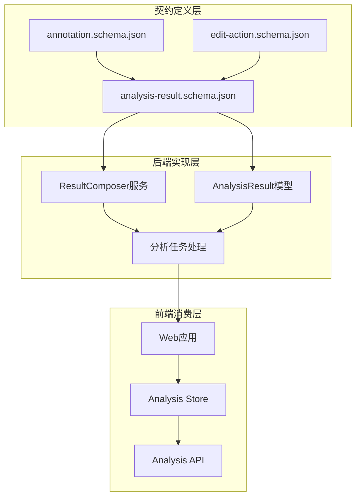
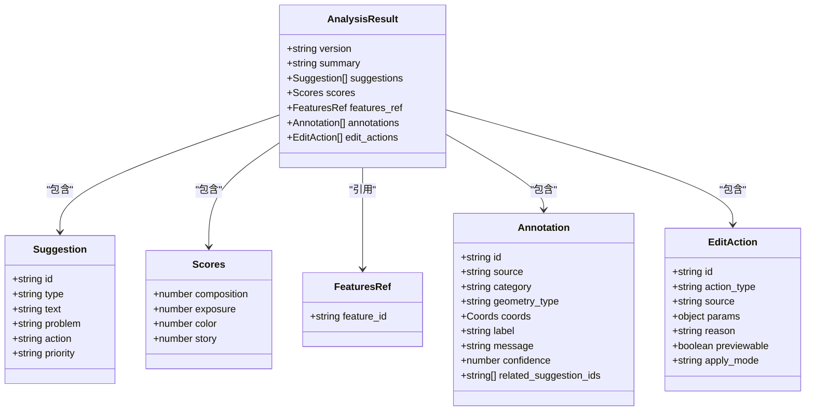
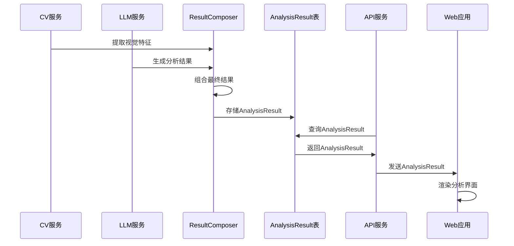
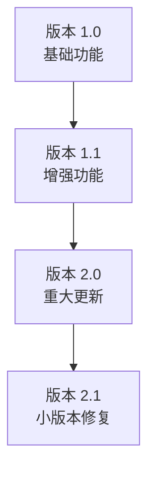
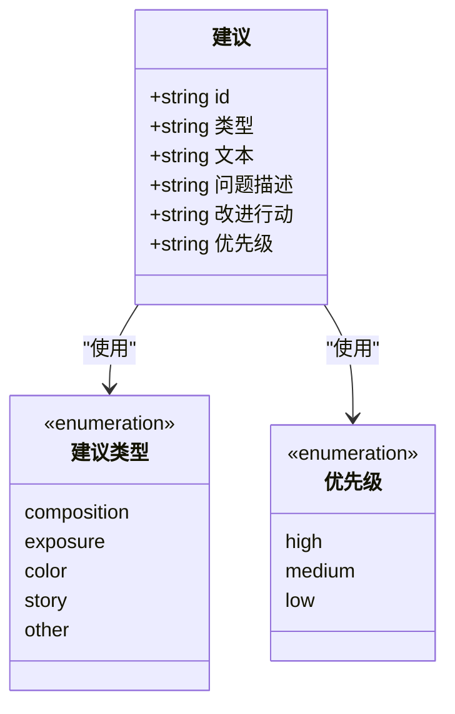
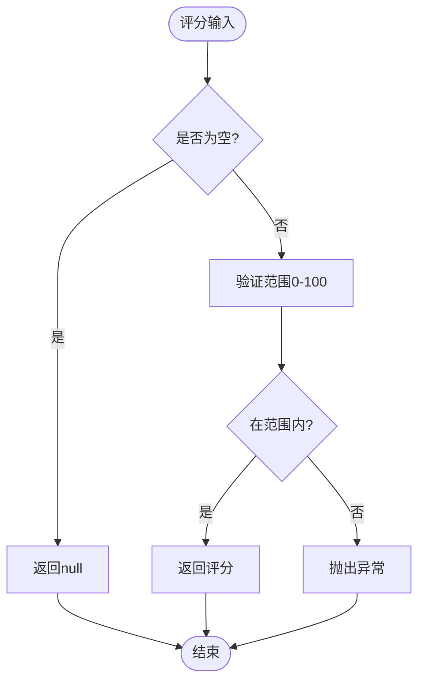
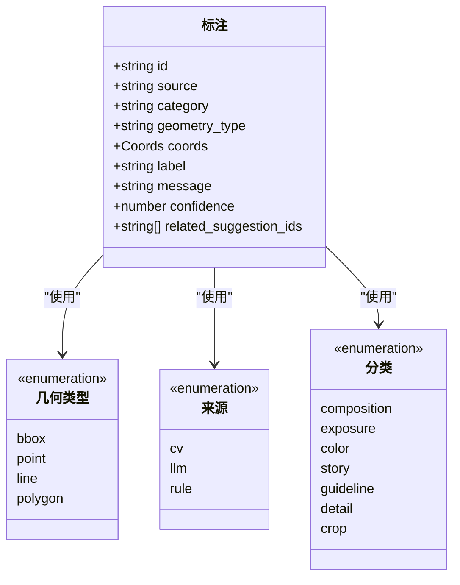
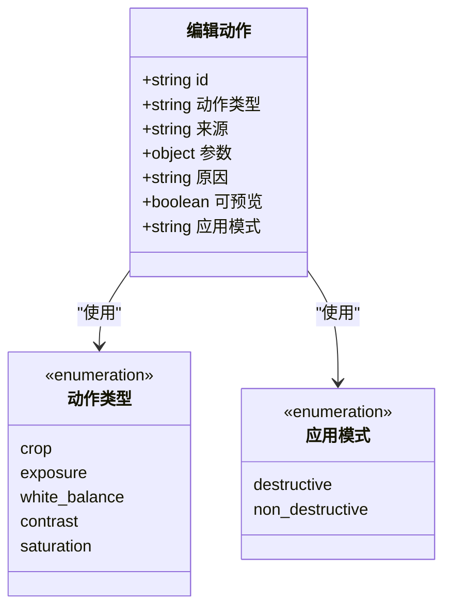
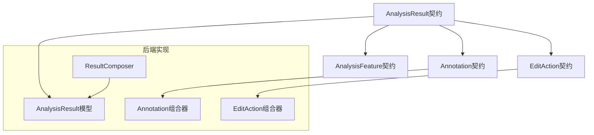

# 分析结果契约

<cite>
**本文档引用的文件**
- [analysis-result.schema.json](file://packages/contracts/analysis-result.schema.json)
- [annotation.schema.json](file://packages/contracts/annotation.schema.json)
- [edit-action.schema.json](file://packages/contracts/edit-action.schema.json)
- [analysis_result.py](file://apps/api/app/models/analysis_result.py)
- [result_composer.py](file://apps/api/app/services/composer/result_composer.py)
- [analyze_photo.py](file://apps/api/app/tasks/analyze_photo.py)
- [analysis.py](file://apps/api/app/schemas/analysis.py)
- [architecture-v2.md](file://docs/architecture-v2.md)
- [analysis.ts](file://apps/web/src/api/analysis.ts)
</cite>

## 目录
1. [简介](#简介)
2. [项目结构](#项目结构)
3. [核心组件](#核心组件)
4. [架构概览](#架构概览)
5. [详细组件分析](#详细组件分析)
6. [依赖分析](#依赖分析)
7. [性能考虑](#性能考虑)
8. [故障排除指南](#故障排除指南)
9. [结论](#结论)
10. [附录](#附录)

## 简介
本文档为AI摄影教练项目的分析结果JSON Schema契约文档，详细说明AnalysisResult数据结构的完整定义。该契约定义了图像分析结果的标准格式，包括版本管理、质量评分、视觉建议、标注信息和编辑动作等核心组件，确保前后端数据交换的一致性和可靠性。

## 项目结构
AI摄影教练项目采用分层架构设计，AnalysisResult契约位于packages/contracts目录下，作为跨模块共享的数据契约定义。



**图表来源**
- [analysis-result.schema.json:1-76](file://packages/contracts/analysis-result.schema.json#L1-L76)
- [analysis_result.py:1-28](file://apps/api/app/models/analysis_result.py#L1-L28)
- [result_composer.py:1-99](file://apps/api/app/services/composer/result_composer.py#L1-L99)

**章节来源**
- [analysis-result.schema.json:1-76](file://packages/contracts/analysis-result.schema.json#L1-L76)
- [analysis_result.py:1-28](file://apps/api/app/models/analysis_result.py#L1-L28)

## 核心组件
AnalysisResult契约定义了完整的分析结果数据结构，包含以下核心组件：

### 数据契约层次结构


**图表来源**
- [analysis-result.schema.json:14-72](file://packages/contracts/analysis-result.schema.json#L14-L72)
- [annotation.schema.json:16-56](file://packages/contracts/annotation.schema.json#L16-L56)
- [edit-action.schema.json:6-26](file://packages/contracts/edit-action.schema.json#L6-L26)

**章节来源**
- [analysis-result.schema.json:14-72](file://packages/contracts/analysis-result.schema.json#L14-L72)

## 架构概览
AnalysisResult契约在整个系统中的作用和交互流程如下：



**图表来源**
- [result_composer.py:8-23](file://apps/api/app/services/composer/result_composer.py#L8-L23)
- [analyze_photo.py:69-96](file://apps/api/app/tasks/analyze_photo.py#L69-L96)
- [analysis_result.py:20-21](file://apps/api/app/models/analysis_result.py#L20-L21)

## 详细组件分析

### 版本管理系统
AnalysisResult采用版本控制机制，确保数据结构的向前兼容性。

#### 版本字段规范
- **字段名**: version
- **数据类型**: string
- **默认值**: "1.1"
- **长度限制**: 最大16字符
- **用途**: 标识AnalysisResult的数据结构版本

#### 版本演进策略


**章节来源**
- [analysis-result.schema.json:15-17](file://packages/contracts/analysis-result.schema.json#L15-L17)
- [analysis_result.py:20-20](file://apps/api/app/models/analysis_result.py#L20-L20)

### 摘要信息系统
summary字段提供简洁的分析结果概述。

#### 摘要字段规范
- **字段名**: summary
- **数据类型**: string
- **最小长度**: 1字符
- **用途**: 为用户提供快速理解的分析摘要

**章节来源**
- [analysis-result.schema.json:18-21](file://packages/contracts/analysis-result.schema.json#L18-L21)

### 建议系统
suggestions数组定义了具体的改进建议列表。

#### 建议类型枚举值
- **composition**: 构图建议
- **exposure**: 曝光建议  
- **color**: 色彩建议
- **story**: 故事性建议
- **other**: 其他建议

#### 优先级级别
- **high**: 高优先级
- **medium**: 中优先级
- **low**: 低优先级

#### 建议字段结构


**图表来源**
- [analysis-result.schema.json:29-38](file://packages/contracts/analysis-result.schema.json#L29-L38)

**章节来源**
- [analysis-result.schema.json:22-42](file://packages/contracts/analysis-result.schema.json#L22-L42)

### 评分系统
scores对象定义了多维度的质量评分。

#### 评分维度
- **composition**: 构图评分 (0-100)
- **exposure**: 曝光评分 (0-100)
- **color**: 色彩评分 (0-100)
- **story**: 故事性评分 (0-100)

#### 可扩展性设计
- 支持null值表示无评分
- additionalProperties设置为true，允许添加新的评分维度
- 数值范围严格限制在0-100之间



**图表来源**
- [analysis-result.schema.json:44-53](file://packages/contracts/analysis-result.schema.json#L44-L53)

**章节来源**
- [analysis-result.schema.json:44-53](file://packages/contracts/analysis-result.schema.json#L44-L53)

### 特征引用系统
features_ref对象提供了对视觉特征的引用关系。

#### 引用字段
- **feature_id**: 关联的特征ID
- **数据类型**: string
- **可空性**: 允许null

**章节来源**
- [analysis-result.schema.json:54-60](file://packages/contracts/analysis-result.schema.json#L54-L60)

### 标注数组系统
annotations数组包含了计算机视觉检测到的标注信息。

#### 标注字段规范


**图表来源**
- [annotation.schema.json:16-56](file://packages/contracts/annotation.schema.json#L16-L56)

**章节来源**
- [annotation.schema.json:1-60](file://packages/contracts/annotation.schema.json#L1-L60)

### 编辑动作数组系统
edit_actions数组定义了可执行的图像编辑建议。

#### 动作类型枚举值
- **crop**: 裁剪
- **exposure**: 曝光调整
- **white_balance**: 白平衡
- **contrast**: 对比度
- **saturation**: 饱和度

#### 应用模式
- **destructive**: 破坏性编辑
- **non_destructive**: 非破坏性编辑



**图表来源**
- [edit-action.schema.json:9-25](file://packages/contracts/edit-action.schema.json#L9-L25)

**章节来源**
- [edit-action.schema.json:1-30](file://packages/contracts/edit-action.schema.json#L1-L30)

## 依赖分析
AnalysisResult契约与其他数据契约存在明确的引用关系。



**图表来源**
- [analysis-result.schema.json:61-72](file://packages/contracts/analysis-result.schema.json#L61-L72)
- [annotation.schema.json:61-65](file://packages/contracts/annotation.schema.json#L61-L65)
- [edit-action.schema.json:67-71](file://packages/contracts/edit-action.schema.json#L67-L71)

**章节来源**
- [analysis-result.schema.json:61-72](file://packages/contracts/analysis-result.schema.json#L61-L72)

## 性能考虑
AnalysisResult契约在设计时充分考虑了性能优化：

### 数据存储优化
- 使用JSON字段存储完整的分析结果
- PostgreSQL GIN索引支持JSON查询
- 版本字段限制长度减少存储开销

### 查询性能
- 为image_id和created_at建立复合索引
- 支持按用户和时间范围快速检索
- 缓存机制减少重复计算

### 序列化性能
- 简化的数据结构减少序列化开销
- 可选字段避免不必要的数据传输
- 批量操作支持

## 故障排除指南
常见问题及解决方案：

### 数据验证错误
- **问题**: JSON Schema验证失败
- **原因**: 字段类型不匹配或缺少必需字段
- **解决**: 检查字段类型和必需字段完整性

### 版本兼容性问题
- **问题**: 新旧版本数据混用
- **原因**: 版本号不一致
- **解决**: 确保客户端和服务端版本同步

### 性能问题
- **问题**: 查询响应缓慢
- **原因**: 缺少必要的数据库索引
- **解决**: 创建适当的索引和优化查询

**章节来源**
- [analysis_result.py:24-27](file://apps/api/app/models/analysis_result.py#L24-L27)

## 结论
AnalysisResult契约通过标准化的数据结构定义，为AI摄影教练项目提供了可靠的数据交换基础。其设计特点包括：

1. **完整性**: 覆盖了从视觉分析到编辑建议的完整流程
2. **可扩展性**: 支持未来功能的增量扩展
3. **一致性**: 前后端共享同一套数据契约
4. **性能优化**: 考虑了实际部署的性能需求

该契约为项目的长期发展奠定了坚实的数据基础。

## 附录

### 完整JSON示例
基于架构文档中的示例，完整的AnalysisResult JSON结构如下：

```json
{
  "version": "1.1",
  "summary": "主体可读性还可以，但画面右侧空白偏多。",
  "suggestions": [
    {
      "id": "s1",
      "type": "composition",
      "priority": "high",
      "problem": "主体视觉重心偏左。",
      "action": "建议裁掉右侧约 15% 区域，让主体更靠近三分线。",
      "text": "主体视觉重心偏左，建议裁掉右侧约 15% 区域，让主体更靠近三分线。"
    }
  ],
  "scores": {
    "composition": 74,
    "exposure": 68,
    "color": 72,
    "story": 61
  },
  "features_ref": {
    "feature_id": "uuid"
  },
  "annotations": [],
  "edit_actions": []
}
```

### 数据验证最佳实践
1. **字段完整性检查**: 确保所有必需字段都存在
2. **类型验证**: 严格验证每个字段的数据类型
3. **范围检查**: 验证数值字段在允许范围内
4. **枚举值验证**: 确保枚举字段值在允许集合内
5. **嵌套结构验证**: 递归验证复杂对象结构
6. **性能监控**: 监控验证过程的性能影响

### 版本升级指南
当需要升级AnalysisResult版本时：

1. **向后兼容性**: 确保新版本能够处理旧版本数据
2. **迁移策略**: 制定数据迁移计划
3. **测试覆盖**: 全面测试新旧版本的兼容性
4. **文档更新**: 更新相关技术文档
5. **部署顺序**: 制定有序的部署计划

**章节来源**
- [architecture-v2.md:243-269](file://docs/architecture-v2.md#L243-L269)