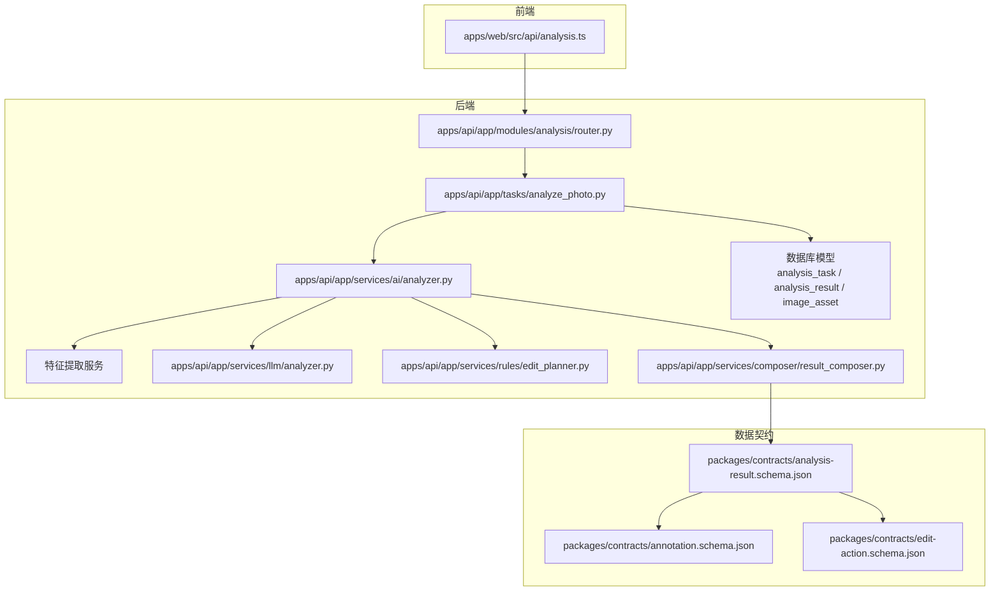
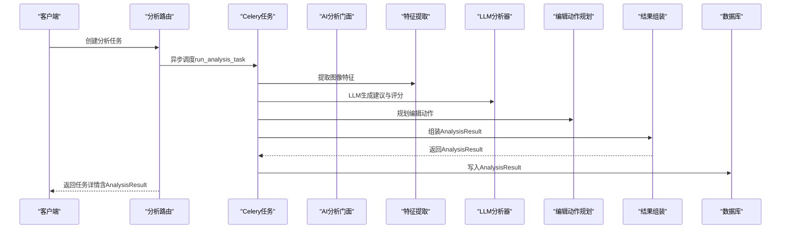
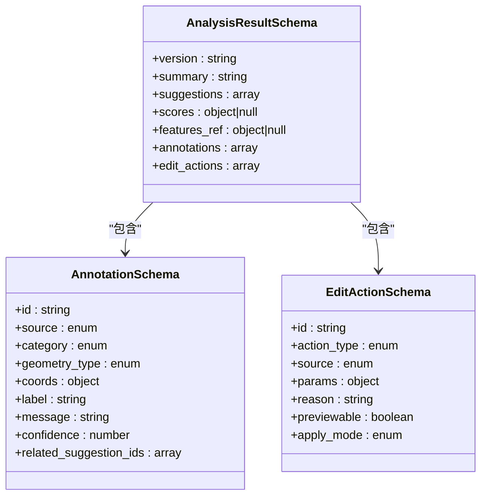
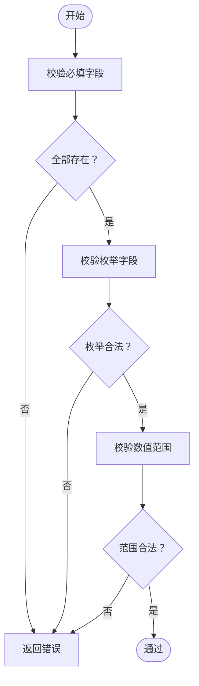
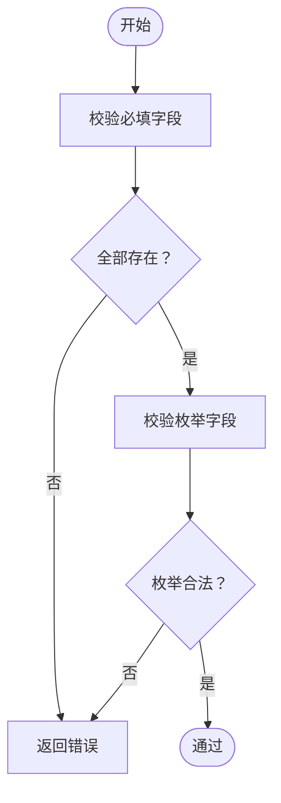
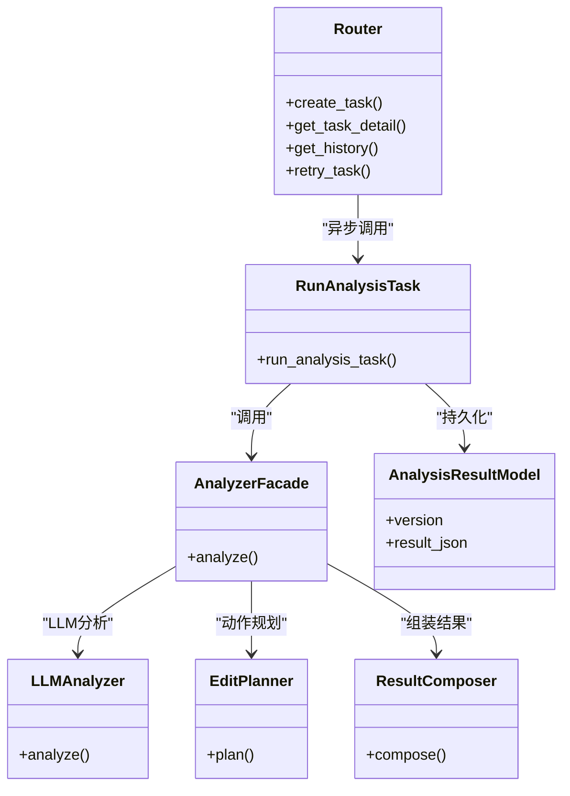
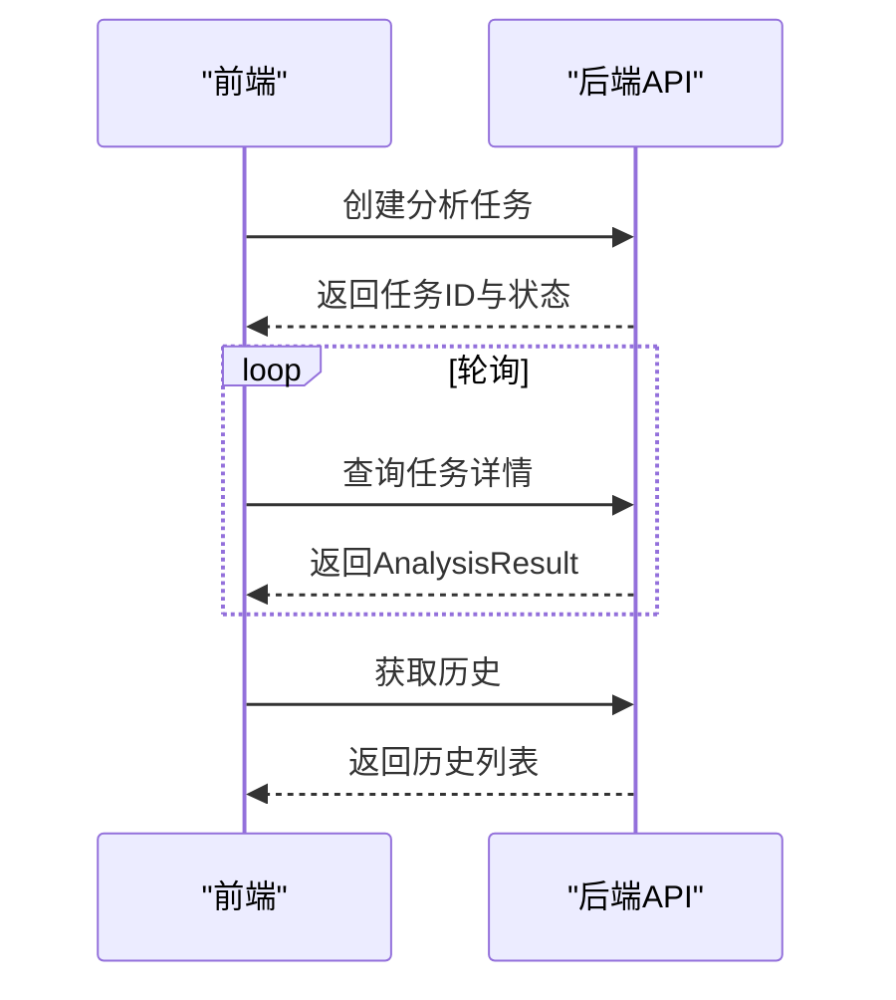
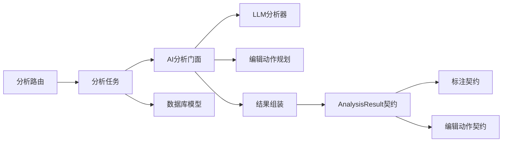
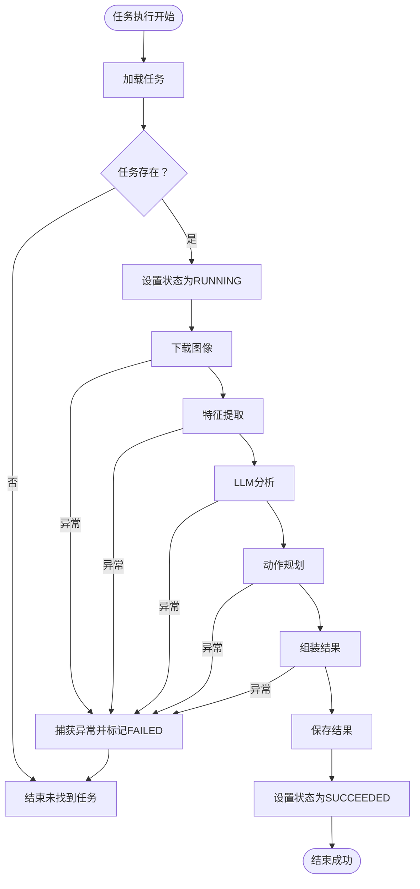

# 数据契约

<cite>
**本文引用的文件**
- [packages/contracts/analysis-result.schema.json](file://packages/contracts/analysis-result.schema.json)
- [packages/contracts/annotation.schema.json](file://packages/contracts/annotation.schema.json)
- [packages/contracts/edit-action.schema.json](file://packages/contracts/edit-action.schema.json)
- [apps/api/app/schemas/analysis.py](file://apps/api/app/schemas/analysis.py)
- [apps/api/app/schemas/image.py](file://apps/api/app/schemas/image.py)
- [apps/api/app/models/analysis_result.py](file://apps/api/app/models/analysis_result.py)
- [apps/api/app/models/analysis_task.py](file://apps/api/app/models/analysis_task.py)
- [apps/api/app/models/image_asset.py](file://apps/api/app/models/image_asset.py)
- [apps/api/app/services/composer/result_composer.py](file://apps/api/app/services/composer/result_composer.py)
- [apps/api/app/services/ai/analyzer.py](file://apps/api/app/services/ai/analyzer.py)
- [apps/api/app/services/llm/analyzer.py](file://apps/api/app/services/llm/analyzer.py)
- [apps/api/app/services/rules/edit_planner.py](file://apps/api/app/services/rules/edit_planner.py)
- [apps/api/app/tasks/analyze_photo.py](file://apps/api/app/tasks/analyze_photo.py)
- [apps/api/app/modules/analysis/router.py](file://apps/api/app/modules/analysis/router.py)
- [apps/web/src/api/analysis.ts](file://apps/web/src/api/analysis.ts)
</cite>

## 目录
1. [简介](#简介)
2. [项目结构](#项目结构)
3. [核心组件](#核心组件)
4. [架构总览](#架构总览)
5. [详细组件分析](#详细组件分析)
6. [依赖关系分析](#依赖关系分析)
7. [性能考量](#性能考量)
8. [故障排查指南](#故障排查指南)
9. [结论](#结论)
10. [附录](#附录)

## 简介
本文件为“AI摄影教练”项目的JSON Schema数据契约文档，系统性定义并规范三类核心数据契约：分析结果契约、标注契约与编辑动作契约。文档覆盖字段定义、验证规则、约束条件、版本与兼容性策略、序列化/反序列化流程、质量保障与错误处理机制，并提供前端与后端的使用示例与集成方法，帮助开发者在不同语言与运行环境中正确实现与消费这些数据契约。

## 项目结构
本项目采用分层与按功能域组织的结构：
- 前端（Vue）通过HTTP接口消费分析任务与结果，类型定义位于前端API模块。
- 后端（FastAPI + Celery）负责任务编排、特征提取、LLM分析、编辑动作规划与结果组装，最终持久化到数据库。
- 数据契约以JSON Schema形式沉淀在packages/contracts目录，作为跨语言、跨进程的一致性规范。

图表来源
- [apps/api/app/modules/analysis/router.py:1-151](file://apps/api/app/modules/analysis/router.py#L1-L151)
- [apps/api/app/tasks/analyze_photo.py:1-108](file://apps/api/app/tasks/analyze_photo.py#L1-L108)
- [apps/api/app/services/ai/analyzer.py:1-27](file://apps/api/app/services/ai/analyzer.py#L1-L27)
- [apps/api/app/services/llm/analyzer.py:1-139](file://apps/api/app/services/llm/analyzer.py#L1-L139)
- [apps/api/app/services/rules/edit_planner.py:1-97](file://apps/api/app/services/rules/edit_planner.py#L1-L97)
- [apps/api/app/services/composer/result_composer.py:1-99](file://apps/api/app/services/composer/result_composer.py#L1-L99)
- [apps/api/app/models/analysis_task.py:1-36](file://apps/api/app/models/analysis_task.py#L1-L36)
- [apps/api/app/models/analysis_result.py:1-28](file://apps/api/app/models/analysis_result.py#L1-L28)
- [apps/api/app/models/image_asset.py:1-32](file://apps/api/app/models/image_asset.py#L1-L32)
- [packages/contracts/analysis-result.schema.json:1-76](file://packages/contracts/analysis-result.schema.json#L1-L76)
- [packages/contracts/annotation.schema.json:1-60](file://packages/contracts/annotation.schema.json#L1-L60)
- [packages/contracts/edit-action.schema.json:1-30](file://packages/contracts/edit-action.schema.json#L1-L30)

章节来源
- [apps/api/app/modules/analysis/router.py:1-151](file://apps/api/app/modules/analysis/router.py#L1-L151)
- [apps/api/app/tasks/analyze_photo.py:1-108](file://apps/api/app/tasks/analyze_photo.py#L1-L108)
- [packages/contracts/analysis-result.schema.json:1-76](file://packages/contracts/analysis-result.schema.json#L1-L76)

## 核心组件
本节对三类数据契约进行逐项解析，给出字段定义、类型、约束与用途说明。

- 分析结果契约（AnalysisResult）
  - 字段与约束
    - version: 字符串；用于标识结果数据版本，便于演进与兼容。
    - summary: 字符串；分析摘要，最小长度为1。
    - suggestions: 数组；元素为建议对象，必含id、type、text、priority；type枚举限定；priority枚举限定。
    - scores: 对象或空；包含composition/exposure/color/story等评分，数值范围0~100。
    - features_ref: 对象或空；指向关联的特征资源标识。
    - annotations: 数组；元素符合标注契约。
    - edit_actions: 数组；元素符合编辑动作契约。
    - 额外属性：禁止。
  - 关键约束
    - 必填字段：version、summary、suggestions、scores、annotations、edit_actions。
    - 建议优先级与类别枚举受控，确保前端与后端一致性。
    - 评分字段范围受控，便于UI展示与统计。

- 标注契约（Annotation）
  - 字段与约束
    - id: 字符串；唯一标识。
    - source: 枚举["cv","llm","rule"]；来源类型。
    - category: 枚举["composition","exposure","color","story","guideline","detail","crop"]；标注类别。
    - geometry_type: 枚举["bbox","point","line","polygon"]；几何类型。
    - coords: 对象；包含坐标与坐标系；coord_space枚举限定为["image_pixels"]；允许扩展字段。
    - label/message: 字符串；标签与提示信息。
    - confidence: 数值0~1；置信度。
    - related_suggestion_ids: 字符串数组；与建议的关联ID列表。
    - 额外属性：允许扩展。
  - 关键约束
    - 必填字段：id、source、category、geometry_type、coords、label、message、confidence。
    - 坐标系与几何类型受控，确保渲染与交互一致性。

- 编辑动作契约（EditAction）
  - 字段与约束
    - id: 字符串；唯一标识。
    - action_type: 枚举["crop","exposure","white_balance","contrast","saturation"]；动作类型。
    - source: 枚举["cv","llm","rule"]；来源类型。
    - params: 对象；动作参数，具体键值由动作类型决定。
    - reason: 字符串；动作理由。
    - previewable: 布尔；是否可预览。
    - apply_mode: 枚举["destructive","non_destructive"]；应用模式。
    - 额外属性：禁止。
  - 关键约束
    - 必填字段：id、action_type、source、params、reason、previewable、apply_mode。

章节来源
- [packages/contracts/analysis-result.schema.json:1-76](file://packages/contracts/analysis-result.schema.json#L1-L76)
- [packages/contracts/annotation.schema.json:1-60](file://packages/contracts/annotation.schema.json#L1-L60)
- [packages/contracts/edit-action.schema.json:1-30](file://packages/contracts/edit-action.schema.json#L1-L30)

## 架构总览
下图展示了从任务创建到结果返回的端到端流程，以及数据契约在各环节中的作用。

图表来源
- [apps/api/app/modules/analysis/router.py:45-90](file://apps/api/app/modules/analysis/router.py#L45-L90)
- [apps/api/app/tasks/analyze_photo.py:19-108](file://apps/api/app/tasks/analyze_photo.py#L19-L108)
- [apps/api/app/services/ai/analyzer.py:10-26](file://apps/api/app/services/ai/analyzer.py#L10-L26)
- [apps/api/app/services/llm/analyzer.py:5-139](file://apps/api/app/services/llm/analyzer.py#L5-L139)
- [apps/api/app/services/rules/edit_planner.py:5-97](file://apps/api/app/services/rules/edit_planner.py#L5-L97)
- [apps/api/app/services/composer/result_composer.py:5-99](file://apps/api/app/services/composer/result_composer.py#L5-L99)
- [apps/api/app/models/analysis_result.py:10-28](file://apps/api/app/models/analysis_result.py#L10-L28)

## 详细组件分析

### 分析结果契约（AnalysisResult）
- 结构要点
  - 顶层字段与必填项由JSON Schema严格约束。
  - 嵌套数组与对象均引用独立契约，确保一致性。
  - 版本号用于演进控制，便于向后兼容。
- 复杂度与性能
  - 建议数组与标注数组规模通常较小，遍历成本低。
  - 评分对象为稀疏结构，查询与渲染开销可控。
- 错误处理
  - 若上游服务未产出scores或features_ref，应允许为空。
  - 前端与后端均需对缺失字段进行安全访问与默认值处理。

图表来源
- [packages/contracts/analysis-result.schema.json:1-76](file://packages/contracts/analysis-result.schema.json#L1-L76)
- [packages/contracts/annotation.schema.json:1-60](file://packages/contracts/annotation.schema.json#L1-L60)
- [packages/contracts/edit-action.schema.json:1-30](file://packages/contracts/edit-action.schema.json#L1-L30)

章节来源
- [packages/contracts/analysis-result.schema.json:1-76](file://packages/contracts/analysis-result.schema.json#L1-L76)

### 标注契约（Annotation）
- 结构要点
  - 几何类型与坐标系受控，便于前端渲染与交互。
  - 来源字段统一，便于追踪标注来源与质量。
  - 置信度字段用于排序与筛选。
- 复杂度与性能
  - 单个标注对象字段较少，批量处理时注意内存占用。
- 错误处理
  - coords中坐标键可能随几何类型变化，应做健壮性检查。

图表来源
- [packages/contracts/annotation.schema.json:1-60](file://packages/contracts/annotation.schema.json#L1-L60)

章节来源
- [packages/contracts/annotation.schema.json:1-60](file://packages/contracts/annotation.schema.json#L1-L60)

### 编辑动作契约（EditAction）
- 结构要点
  - 动作类型与应用模式明确，便于UI呈现与执行策略选择。
  - 参数对象为通用容器，需与前端约定具体键名。
- 复杂度与性能
  - 动作数组通常较小，排序与去重成本低。
- 错误处理
  - params键名与类型需与前端一致，否则执行阶段会失败。

图表来源
- [packages/contracts/edit-action.schema.json:1-30](file://packages/contracts/edit-action.schema.json#L1-L30)

章节来源
- [packages/contracts/edit-action.schema.json:1-30](file://packages/contracts/edit-action.schema.json#L1-L30)

### 后端实现与契约映射
- 路由与响应模型
  - 任务详情响应模型包含任务元数据与可选结果，结果字段类型为字典，实际结构遵循AnalysisResult契约。
- 任务执行与结果写入
  - 任务执行器按顺序调用特征提取、LLM分析、动作规划与结果组装，最终写入数据库。
  - 数据库模型中result_json字段存储完整的AnalysisResult对象，version字段同步更新。
- 服务层组合
  - AI分析门面协调CV、LLM与规则引擎，结果组装器负责拼接version、summary、suggestions、scores、annotations与edit_actions。

图表来源
- [apps/api/app/modules/analysis/router.py:45-151](file://apps/api/app/modules/analysis/router.py#L45-L151)
- [apps/api/app/tasks/analyze_photo.py:19-108](file://apps/api/app/tasks/analyze_photo.py#L19-L108)
- [apps/api/app/services/ai/analyzer.py:10-26](file://apps/api/app/services/ai/analyzer.py#L10-L26)
- [apps/api/app/services/llm/analyzer.py:5-139](file://apps/api/app/services/llm/analyzer.py#L5-L139)
- [apps/api/app/services/rules/edit_planner.py:5-97](file://apps/api/app/services/rules/edit_planner.py#L5-L97)
- [apps/api/app/services/composer/result_composer.py:5-99](file://apps/api/app/services/composer/result_composer.py#L5-L99)
- [apps/api/app/models/analysis_result.py:10-28](file://apps/api/app/models/analysis_result.py#L10-L28)

章节来源
- [apps/api/app/modules/analysis/router.py:1-151](file://apps/api/app/modules/analysis/router.py#L1-L151)
- [apps/api/app/tasks/analyze_photo.py:1-108](file://apps/api/app/tasks/analyze_photo.py#L1-L108)
- [apps/api/app/services/ai/analyzer.py:1-27](file://apps/api/app/services/ai/analyzer.py#L1-L27)
- [apps/api/app/services/llm/analyzer.py:1-139](file://apps/api/app/services/llm/analyzer.py#L1-L139)
- [apps/api/app/services/rules/edit_planner.py:1-97](file://apps/api/app/services/rules/edit_planner.py#L1-L97)
- [apps/api/app/services/composer/result_composer.py:1-99](file://apps/api/app/services/composer/result_composer.py#L1-L99)
- [apps/api/app/models/analysis_result.py:1-28](file://apps/api/app/models/analysis_result.py#L1-L28)

### 前端消费与类型映射
- 类型定义
  - 前端定义了AnalysisResult、Suggestion、Annotation、EditAction等接口，与后端契约一一对应。
- 接口调用
  - 通过HTTP接口创建任务、查询任务详情与历史、重试失败任务。
- 渲染与交互
  - 建议与标注用于UI展示与引导；编辑动作用于生成可预览的编辑指令。

图表来源
- [apps/web/src/api/analysis.ts:82-100](file://apps/web/src/api/analysis.ts#L82-L100)
- [apps/api/app/modules/analysis/router.py:76-125](file://apps/api/app/modules/analysis/router.py#L76-L125)

章节来源
- [apps/web/src/api/analysis.ts:1-101](file://apps/web/src/api/analysis.ts#L1-L101)
- [apps/api/app/modules/analysis/router.py:1-151](file://apps/api/app/modules/analysis/router.py#L1-L151)

## 依赖关系分析
- 组件耦合
  - 路由依赖任务执行器；任务执行器依赖服务层；服务层依赖契约与数据库模型。
  - 前端仅依赖API契约与类型定义，耦合度低。
- 外部依赖
  - JSON Schema作为契约标准，确保跨语言一致性。
  - Celery异步执行，降低请求延迟。
- 循环依赖
  - 当前结构无循环依赖，职责清晰。

图表来源
- [apps/api/app/modules/analysis/router.py:1-151](file://apps/api/app/modules/analysis/router.py#L1-L151)
- [apps/api/app/tasks/analyze_photo.py:1-108](file://apps/api/app/tasks/analyze_photo.py#L1-L108)
- [apps/api/app/services/ai/analyzer.py:1-27](file://apps/api/app/services/ai/analyzer.py#L1-L27)
- [apps/api/app/services/llm/analyzer.py:1-139](file://apps/api/app/services/llm/analyzer.py#L1-L139)
- [apps/api/app/services/rules/edit_planner.py:1-97](file://apps/api/app/services/rules/edit_planner.py#L1-L97)
- [apps/api/app/services/composer/result_composer.py:1-99](file://apps/api/app/services/composer/result_composer.py#L1-L99)
- [packages/contracts/analysis-result.schema.json:1-76](file://packages/contracts/analysis-result.schema.json#L1-L76)
- [packages/contracts/annotation.schema.json:1-60](file://packages/contracts/annotation.schema.json#L1-L60)
- [packages/contracts/edit-action.schema.json:1-30](file://packages/contracts/edit-action.schema.json#L1-L30)

章节来源
- [apps/api/app/modules/analysis/router.py:1-151](file://apps/api/app/modules/analysis/router.py#L1-L151)
- [apps/api/app/tasks/analyze_photo.py:1-108](file://apps/api/app/tasks/analyze_photo.py#L1-L108)
- [packages/contracts/analysis-result.schema.json:1-76](file://packages/contracts/analysis-result.schema.json#L1-L76)

## 性能考量
- 序列化/反序列化
  - AnalysisResult以JSON对象形式存储于数据库，读写成本低；建议在前端与后端统一使用原生JSON处理。
- 查询与索引
  - 数据库模型对关键字段建立索引，支持按用户与时间排序的历史查询。
- 缓存
  - 服务层广泛使用LRU缓存，降低重复初始化成本。
- 并发与异步
  - 使用Celery异步执行分析任务，避免阻塞请求线程。

章节来源
- [apps/api/app/models/analysis_result.py:24-27](file://apps/api/app/models/analysis_result.py#L24-L27)
- [apps/api/app/tasks/analyze_photo.py:1-108](file://apps/api/app/tasks/analyze_photo.py#L1-L108)
- [apps/api/app/services/ai/analyzer.py:23-25](file://apps/api/app/services/ai/analyzer.py#L23-L25)

## 故障排查指南
- 常见错误与定位
  - 任务不存在或权限不足：路由层返回404/403，需检查任务ID与用户绑定。
  - 图像缺失：任务执行器抛出异常并回滚，检查存储服务与对象键。
  - 结果为空：确认LLM与规则引擎输出是否正常，检查版本兼容性。
- 错误上报
  - 任务失败时记录错误码与简短错误消息，便于前端提示与日志追踪。
- 重试机制
  - 支持对失败或成功但需要重新分析的任务进行重试，重试前重置状态与计数。

图表来源
- [apps/api/app/tasks/analyze_photo.py:19-108](file://apps/api/app/tasks/analyze_photo.py#L19-L108)
- [apps/api/app/modules/analysis/router.py:128-151](file://apps/api/app/modules/analysis/router.py#L128-L151)

章节来源
- [apps/api/app/tasks/analyze_photo.py:1-108](file://apps/api/app/tasks/analyze_photo.py#L1-L108)
- [apps/api/app/modules/analysis/router.py:128-151](file://apps/api/app/modules/analysis/router.py#L128-L151)

## 结论
本数据契约文档以JSON Schema为核心，明确了分析结果、标注与编辑动作的字段、约束与关系，配合后端服务层与前端类型定义，实现了跨语言、跨模块的一致性与可演进性。通过严格的验证规则、版本控制与错误处理机制，确保系统在复杂场景下的稳定性与可维护性。

## 附录

### 数据契约字段与约束清单
- AnalysisResult
  - 必填字段：version、summary、suggestions、scores、annotations、edit_actions
  - 建议优先级：["high","medium","low"]
  - 建议类型：["composition","exposure","color","story","other"]
  - 评分范围：0~100
- Annotation
  - 必填字段：id、source、category、geometry_type、coords、label、message、confidence
  - 来源：["cv","llm","rule"]
  - 类别：["composition","exposure","color","story","guideline","detail","crop"]
  - 几何类型：["bbox","point","line","polygon"]
  - 坐标系：["image_pixels"]
  - 置信度范围：0~1
- EditAction
  - 必填字段：id、action_type、source、params、reason、previewable、apply_mode
  - 动作类型：["crop","exposure","white_balance","contrast","saturation"]
  - 来源：["cv","llm","rule"]
  - 应用模式：["destructive","non_destructive"]

章节来源
- [packages/contracts/analysis-result.schema.json:1-76](file://packages/contracts/analysis-result.schema.json#L1-L76)
- [packages/contracts/annotation.schema.json:1-60](file://packages/contracts/annotation.schema.json#L1-L60)
- [packages/contracts/edit-action.schema.json:1-30](file://packages/contracts/edit-action.schema.json#L1-L30)

### 版本兼容性与演进策略
- 版本字段
  - AnalysisResult.version：用于标识结果数据版本，便于向前/向后兼容。
  - LLMAnalyzer.version：标识LLM输出版本，便于模型升级后的兼容。
- 兼容策略
  - 新增非必填字段：保持向后兼容，旧消费者可忽略新字段。
  - 修改字段语义：引入新字段并保留旧字段，逐步迁移。
  - 枚举扩展：新增枚举值，旧消费者需具备兜底逻辑。
  - 数据库迁移：通过版本字段与索引策略，支持历史数据查询与新字段写入。

章节来源
- [apps/api/app/services/llm/analyzer.py](file://apps/api/app/services/llm/analyzer.py#L6)
- [apps/api/app/services/composer/result_composer.py](file://apps/api/app/services/composer/result_composer.py#L6)
- [apps/api/app/models/analysis_result.py](file://apps/api/app/models/analysis_result.py#L20)

### 序列化/反序列化与数据质量保证
- 序列化/反序列化
  - 后端使用原生JSON存储AnalysisResult，读写简单高效。
  - 前端类型定义与后端契约保持一致，避免类型不匹配。
- 数据质量保证
  - JSON Schema在契约层强制约束字段与范围。
  - 服务层在组装与规划阶段进行数据校验与补全。
  - 数据库模型对关键字段建立索引，支持高效查询与统计。

章节来源
- [apps/api/app/models/analysis_result.py:20-27](file://apps/api/app/models/analysis_result.py#L20-L27)
- [apps/api/app/services/composer/result_composer.py:14-23](file://apps/api/app/services/composer/result_composer.py#L14-L23)

### 使用示例与集成方法
- 前端集成
  - 使用analysis.ts提供的接口创建任务、查询详情、获取历史与重试任务。
  - 在UI中渲染AnalysisResult的summary、suggestions、annotations与edit_actions。
- 后端集成
  - 路由层接收CreateAnalysisTaskRequest，创建AnalysisTask并异步执行run_analysis_task。
  - 任务执行器调用服务层完成分析与结果组装，写入AnalysisResult。
  - 数据契约作为统一规范，贯穿服务层与数据库层。

章节来源
- [apps/web/src/api/analysis.ts:82-100](file://apps/web/src/api/analysis.ts#L82-L100)
- [apps/api/app/modules/analysis/router.py:45-151](file://apps/api/app/modules/analysis/router.py#L45-L151)
- [apps/api/app/tasks/analyze_photo.py:19-108](file://apps/api/app/tasks/analyze_photo.py#L19-L108)