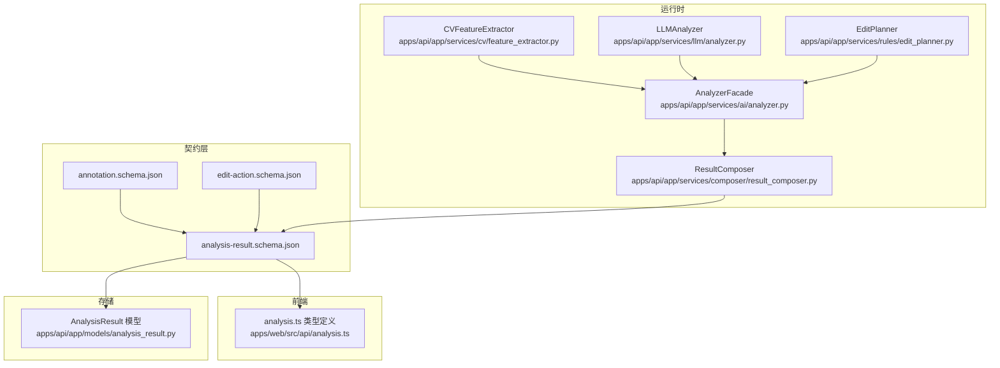
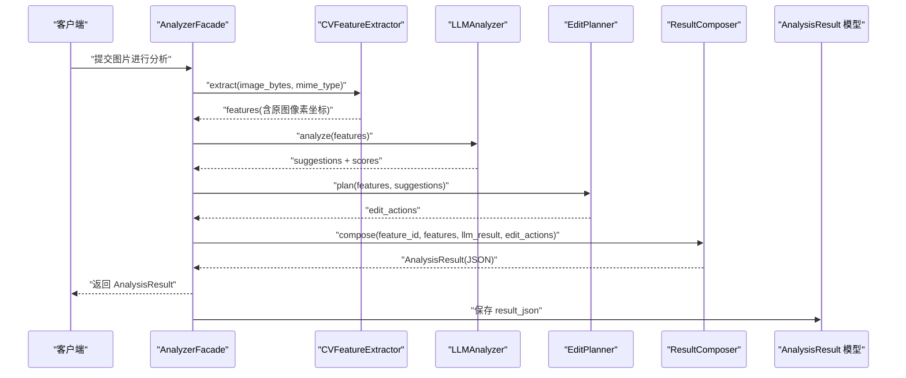
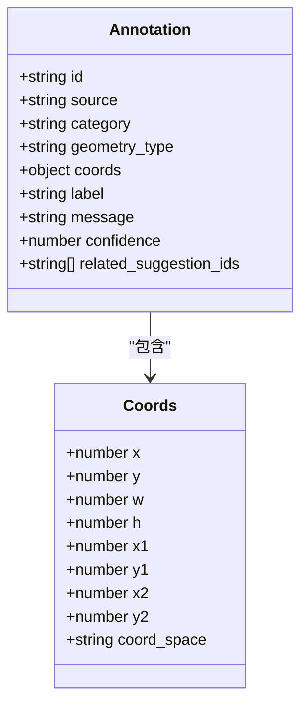
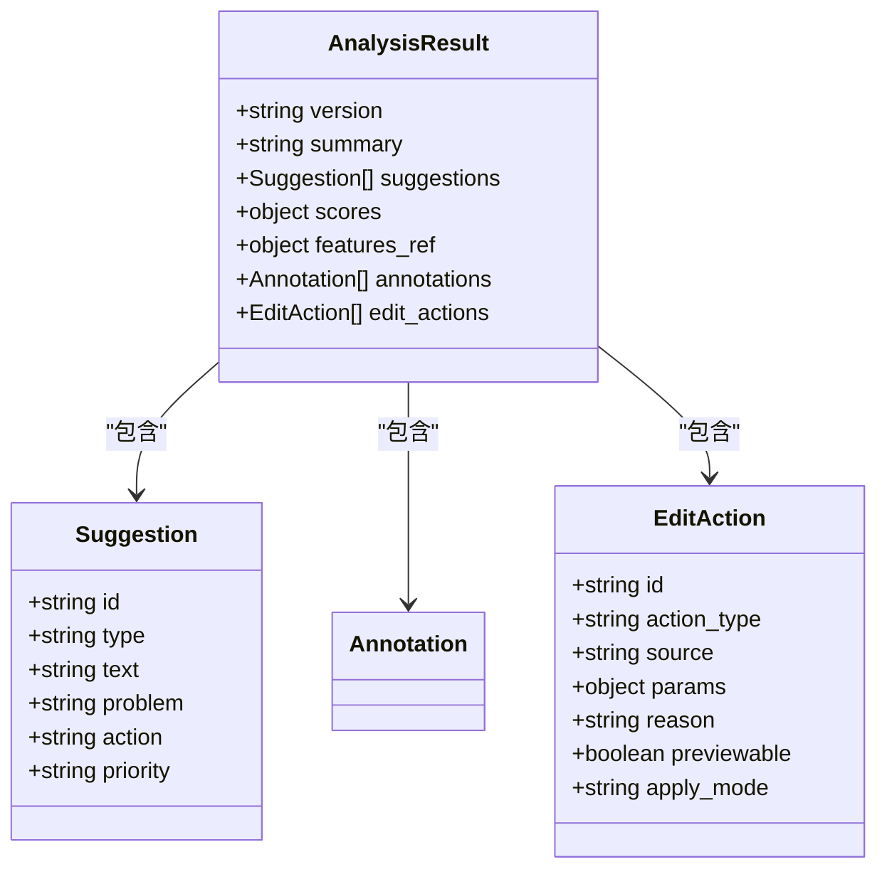
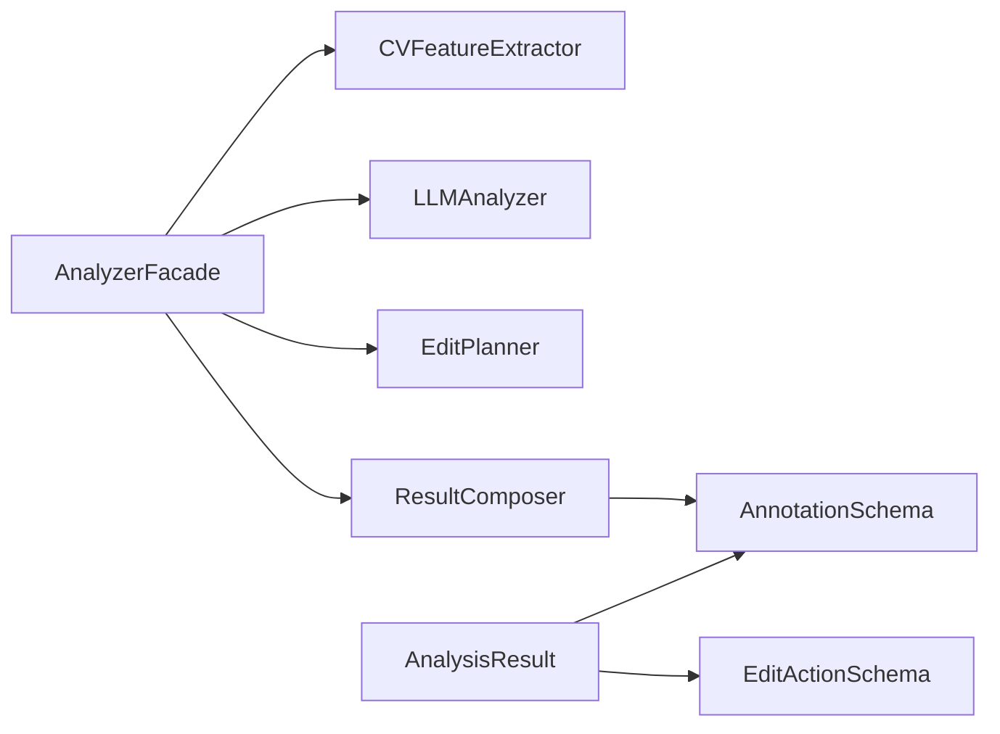

# 标注契约

<cite>
**本文引用的文件**
- [annotation.schema.json](file://packages/contracts/annotation.schema.json)
- [analysis-result.schema.json](file://packages/contracts/analysis-result.schema.json)
- [edit-action.schema.json](file://packages/contracts/edit-action.schema.json)
- [architecture-v2.md](file://docs/architecture-v2.md)
- [result_composer.py](file://apps/api/app/services/composer/result_composer.py)
- [feature_extractor.py](file://apps/api/app/services/cv/feature_extractor.py)
- [analyzer.py](file://apps/api/app/services/ai/analyzer.py)
- [analysis.ts](file://apps/web/src/api/analysis.ts)
- [analysis_result.py](file://apps/api/app/models/analysis_result.py)
</cite>

## 目录
1. [简介](#简介)
2. [项目结构](#项目结构)
3. [核心组件](#核心组件)
4. [架构总览](#架构总览)
5. [详细组件分析](#详细组件分析)
6. [依赖关系分析](#依赖关系分析)
7. [性能考量](#性能考量)
8. [故障排查指南](#故障排查指南)
9. [结论](#结论)
10. [附录](#附录)

## 简介
本文件为 AI 摄影教练项目的标注 JSON Schema 契约文档，系统性定义标注数据结构、几何表示与坐标系统、标注类别与用途、验证规则与约束、标注与分析结果的关联关系、数据流转过程、序列化格式与传输协议，以及标注工具集成与数据导入导出的最佳实践。目标是确保标注数据在前端、后端与外部工具之间的一致性与可验证性，支撑从图像分析到编辑建议与可执行动作的闭环。

## 项目结构
标注契约由三类 JSON Schema 组成：
- 标注契约：定义单个标注对象的结构与约束（含几何类型、坐标、置信度、来源与类别等）。
- 分析结果契约：定义一次分析输出的整体结构，包含版本、摘要、建议、评分、标注数组与编辑动作数组。
- 编辑动作契约：定义可执行的编辑动作对象，描述动作类型、参数、来源与应用模式等。

图表来源
- [annotation.schema.json:1-60](file://packages/contracts/annotation.schema.json#L1-L60)
- [analysis-result.schema.json:1-76](file://packages/contracts/analysis-result.schema.json#L1-L76)
- [edit-action.schema.json:1-30](file://packages/contracts/edit-action.schema.json#L1-L30)
- [analyzer.py:10-27](file://apps/api/app/services/ai/analyzer.py#L10-L27)
- [result_composer.py:39-98](file://apps/api/app/services/composer/result_composer.py#L39-L98)
- [feature_extractor.py:39-97](file://apps/api/app/services/cv/feature_extractor.py#L39-L97)
- [analysis.ts:14-44](file://apps/web/src/api/analysis.ts#L14-L44)
- [analysis_result.py:10-28](file://apps/api/app/models/analysis_result.py#L10-L28)

章节来源
- [annotation.schema.json:1-60](file://packages/contracts/annotation.schema.json#L1-L60)
- [analysis-result.schema.json:1-76](file://packages/contracts/analysis-result.schema.json#L1-L76)
- [edit-action.schema.json:1-30](file://packages/contracts/edit-action.schema.json#L1-L30)
- [analyzer.py:10-27](file://apps/api/app/services/ai/analyzer.py#L10-L27)

## 核心组件
- 标注对象（Annotation）
  - 必填字段：id、source、category、geometry_type、coords、label、message、confidence
  - 几何类型：支持 bbox、point、line、polygon
  - 坐标系统：统一采用原图像素坐标系（image_pixels），前端仅做比例映射
  - 置信度：范围 [0,1]，数值越高表示算法或规则越确信
  - 关联建议：related_suggestion_ids 可为空数组或字符串数组，用于将标注与建议建立多对多关系
- 分析结果对象（AnalysisResult）
  - 必填字段：version、summary、suggestions、scores、annotations、edit_actions
  - 建议数组：每项包含 id、type、text、priority；可选 problem、action
  - 评分数组：composition、exposure、color、story，取值范围 [0,100]
  - 标注数组：元素引用 annotation.schema.json
  - 编辑动作数组：元素引用 edit-action.schema.json
- 编辑动作对象（EditAction）
  - 必填字段：id、action_type、source、params、reason、previewable、apply_mode
  - 动作类型：crop、exposure、white_balance、contrast、saturation
  - 应用模式：destructive 或 non_destructive

章节来源
- [annotation.schema.json:6-57](file://packages/contracts/annotation.schema.json#L6-L57)
- [analysis-result.schema.json:6-74](file://packages/contracts/analysis-result.schema.json#L6-L74)
- [edit-action.schema.json:6-27](file://packages/contracts/edit-action.schema.json#L6-L27)

## 架构总览
标注数据在系统内的生成与消费流程如下：
- 计算机视觉模块提取图像特征（主体、高光/阴影区域、地平线等），返回原图像素坐标
- 大语言模型基于统计特征与规则生成建议与评分
- 结果合成器将特征、建议与动作整合为统一的分析结果
- 前端接收 AnalysisResult 并渲染标注与建议
- 存储层持久化 AnalysisResult 的 JSON 文档

图表来源
- [analyzer.py:10-27](file://apps/api/app/services/ai/analyzer.py#L10-L27)
- [feature_extractor.py:39-97](file://apps/api/app/services/cv/feature_extractor.py#L39-L97)
- [result_composer.py:39-98](file://apps/api/app/services/composer/result_composer.py#L39-L98)
- [analysis_result.py:10-28](file://apps/api/app/models/analysis_result.py#L10-L28)

## 详细组件分析

### 标注对象（Annotation）数据模型
- 字段与约束
  - id：字符串，唯一标识
  - source：枚举，cv（计算机视觉）、llm（大语言模型）、rule（规则引擎）
  - category：枚举，composition（构图）、exposure（曝光）、color（色彩）、story（故事性）、guideline（参考线）、detail（细节）、crop（裁剪）
  - geometry_type：枚举，bbox（矩形框）、point（点）、line（直线）、polygon（多边形）
  - coords：对象，必含 coord_space（image_pixels），可包含 x/y/w/h 或 x1/y1/x2/y2 等
  - label/message：字符串，用于展示与说明
  - confidence：数值，范围 [0,1]
  - related_suggestion_ids：字符串数组，可空
- 几何表示与坐标系统
  - 统一使用原图像素坐标系（image_pixels）
  - 前端仅做比例映射，不重新计算业务含义
- 典型用途
  - 构图：主体、三分线、引导线、对角线等
  - 曝光：高光/阴影区域标注，辅助曝光调整
  - 色彩：色温、饱和度相关区域
  - 故事性：前景/背景层次、视觉焦点
  - 参考线：地平线、网格线等
  - 细节：噪点、杂波等
  - 裁剪：建议裁剪区域

图表来源
- [annotation.schema.json:16-57](file://packages/contracts/annotation.schema.json#L16-L57)

章节来源
- [annotation.schema.json:6-57](file://packages/contracts/annotation.schema.json#L6-L57)
- [architecture-v2.md:277-319](file://docs/architecture-v2.md#L277-L319)

### 分析结果（AnalysisResult）数据模型
- 字段与约束
  - version：字符串，版本号
  - summary：字符串，摘要
  - suggestions：数组，每项含 id、type、text、priority；可选 problem、action
  - scores：对象或 null，包含 composition/exposure/color/story，取值 [0,100]
  - features_ref：可选引用，指向特征 ID
  - annotations：数组，元素为 Annotation
  - edit_actions：数组，元素为 EditAction
- 数据来源与规则
  - 建议与评分由 LLMAnalyzer 生成
  - 标注由 ResultComposer 基于 CVFeatureExtractor 的特征合成
  - 编辑动作由规则引擎规划

图表来源
- [analysis-result.schema.json:14-74](file://packages/contracts/analysis-result.schema.json#L14-L74)
- [edit-action.schema.json:7-27](file://packages/contracts/edit-action.schema.json#L7-L27)
- [annotation.schema.json:16-57](file://packages/contracts/annotation.schema.json#L16-L57)

章节来源
- [analysis-result.schema.json:6-74](file://packages/contracts/analysis-result.schema.json#L6-L74)
- [result_composer.py:39-98](file://apps/api/app/services/composer/result_composer.py#L39-L98)
- [feature_extractor.py:39-97](file://apps/api/app/services/cv/feature_extractor.py#L39-L97)

### 编辑动作（EditAction）数据模型
- 字段与约束
  - id：字符串
  - action_type：crop、exposure、white_balance、contrast、saturation
  - source：cv、llm、rule
  - params：对象，具体参数随动作类型而定
  - reason：字符串，动作理由
  - previewable：布尔，是否可预览
  - apply_mode：destructive 或 non_destructive
- 作用
  - 将建议转化为可执行对象，便于前端与后端协同处理

章节来源
- [edit-action.schema.json:6-27](file://packages/contracts/edit-action.schema.json#L6-L27)

### 标注与分析结果的关联关系
- 多对多关联
  - 一个标注可关联零条或多条建议（related_suggestion_ids）
  - 一条建议可被多个标注引用（通过标注 id）
- 关联策略
  - 建议优先级（high/medium/low）与置信度共同决定呈现顺序
  - 前端按建议与标注的关联关系进行分组展示

章节来源
- [annotation.schema.json:51-55](file://packages/contracts/annotation.schema.json#L51-L55)
- [analysis-result.schema.json:22-42](file://packages/contracts/analysis-result.schema.json#L22-L42)

### 数据验证与约束
- 标注对象
  - 必填字段齐全
  - geometry_type 与 coords 中的键组合一致（如 bbox 需要 x/y/w/h；line 需要 x1/y1/x2/y2）
  - confidence 在 [0,1] 区间
  - coords 必须包含 coord_space，并且值为 image_pixels
- 分析结果对象
  - 必填字段齐全
  - scores 中各指标在 [0,100] 区间
  - annotations 与 edit_actions 分别满足各自契约
- 建议对象
  - 每条建议必须包含 problem 与 action（架构文档约束）

章节来源
- [annotation.schema.json:6-57](file://packages/contracts/annotation.schema.json#L6-L57)
- [analysis-result.schema.json:6-74](file://packages/contracts/analysis-result.schema.json#L6-L74)
- [architecture-v2.md:271-276](file://docs/architecture-v2.md#L271-L276)

### 数据流与序列化
- 序列化格式
  - JSON（AnalysisResult）
  - 前端类型定义与契约保持一致
- 传输协议
  - 后端 API 返回 AnalysisResult
  - 前端通过 HTTP 接口获取任务详情与历史
- 存储
  - AnalysisResult 以 JSON 文档形式存入数据库

章节来源
- [analysis.ts:36-66](file://apps/web/src/api/analysis.ts#L36-L66)
- [analysis_result.py:10-28](file://apps/api/app/models/analysis_result.py#L10-L28)

## 依赖关系分析
- 组件耦合
  - AnalyzerFacade 作为门面，协调 CV、LLM、规则与合成器
  - ResultComposer 依赖 CV 特征与 LLM 建议，生成标注数组
  - EditPlanner 基于特征与建议生成可执行动作
- 外部依赖
  - JSON Schema 作为契约，约束前后端与工具链一致性
  - 前端类型定义与契约保持同步

图表来源
- [analyzer.py:10-27](file://apps/api/app/services/ai/analyzer.py#L10-L27)
- [result_composer.py:39-98](file://apps/api/app/services/composer/result_composer.py#L39-L98)
- [annotation.schema.json:1-60](file://packages/contracts/annotation.schema.json#L1-L60)
- [analysis-result.schema.json:1-76](file://packages/contracts/analysis-result.schema.json#L1-L76)
- [edit-action.schema.json:1-30](file://packages/contracts/edit-action.schema.json#L1-L30)

## 性能考量
- 坐标计算与映射
  - 统一使用原图像素坐标，前端仅做比例映射，避免重复计算
- 数据体积
  - 建议与标注数组规模控制，必要时进行聚合或采样
- 缓存
  - AnalyzerFacade 使用缓存，减少重复初始化成本
- 存储索引
  - AnalysisResult 表对 JSON 字段建立 GIN 索引，提升查询效率

章节来源
- [architecture-v2.md:314-318](file://docs/architecture-v2.md#L314-L318)
- [analysis_result.py:24-27](file://apps/api/app/models/analysis_result.py#L24-L27)

## 故障排查指南
- 常见问题
  - 缺失必填字段：检查 id、source、category、geometry_type、coords、label、message、confidence
  - 坐标不一致：确认 coord_space 为 image_pixels，且与实际特征一致
  - 置信度过高/过低：检查算法或规则逻辑，确保在 [0,1] 区间内
  - 建议缺失 problem/action：确保建议对象包含 problem 与 action
- 定位方法
  - 使用 JSON Schema 校验标注与分析结果
  - 对照前端类型定义，核对字段命名与类型
  - 查看后端日志与数据库存储状态

章节来源
- [annotation.schema.json:6-57](file://packages/contracts/annotation.schema.json#L6-L57)
- [analysis-result.schema.json:6-74](file://packages/contracts/analysis-result.schema.json#L6-L74)
- [architecture-v2.md:271-276](file://docs/architecture-v2.md#L271-L276)

## 结论
本标注契约文档明确了标注数据结构、几何表示、坐标系统、验证规则与数据流转路径，确保从图像分析到建议与可执行动作的全链路一致性。通过 JSON Schema 契约与前端类型定义的双重约束，结合统一的原图像素坐标系与明确的来源分类，为标注工具集成与数据导入导出提供了清晰规范。

## 附录

### 标注类型与应用场景速查
- 构图（composition）：主体、三分线、引导线、对角线
- 曝光（exposure）：高光/阴影区域，辅助曝光调整
- 色彩（color）：色温、饱和度相关区域
- 故事性（story）：前景/背景层次、视觉焦点
- 参考线（guideline）：地平线、网格线等
- 细节（detail）：噪点、杂波等
- 裁剪（crop）：建议裁剪区域

章节来源
- [annotation.schema.json:22-28](file://packages/contracts/annotation.schema.json#L22-L28)

### 坐标系统与几何类型对照
- 原图像素坐标系（image_pixels）
- 几何类型与典型键
  - bbox：x、y、w、h
  - point：x、y
  - line：x1、y1、x2、y2
  - polygon：多点序列（由前端/工具链补充）

章节来源
- [annotation.schema.json:30-47](file://packages/contracts/annotation.schema.json#L30-L47)
- [feature_extractor.py:39-97](file://apps/api/app/services/cv/feature_extractor.py#L39-L97)

### 最佳实践
- 工具集成
  - 导入：将现有标注转换为 Annotation 结构，确保 geometry_type 与 coords 键匹配
  - 导出：按 AnalysisResult 结构组织，包含 annotations 与 edit_actions
- 数据质量
  - 置信度阈值过滤与可视化分级
  - 建议与标注的关联关系应清晰可追溯
- 前后端协作
  - 前端严格遵循类型定义，后端严格遵循 JSON Schema
  - 统一坐标系与比例映射，避免重复计算

章节来源
- [architecture-v2.md:277-348](file://docs/architecture-v2.md#L277-L348)
- [analysis.ts:14-44](file://apps/web/src/api/analysis.ts#L14-L44)