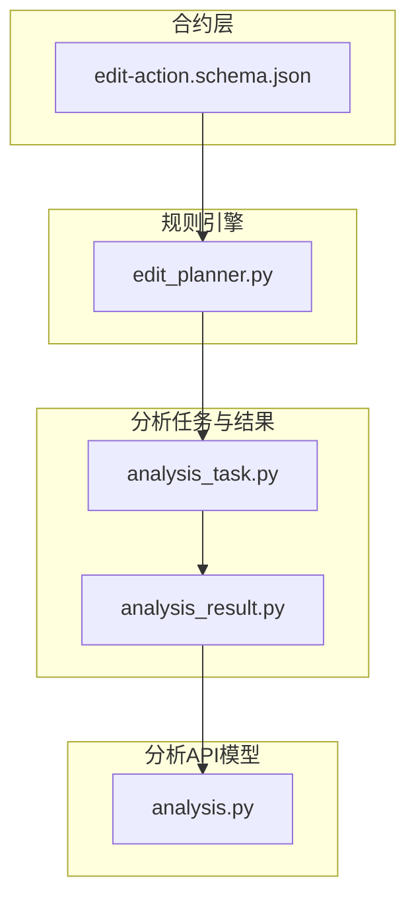
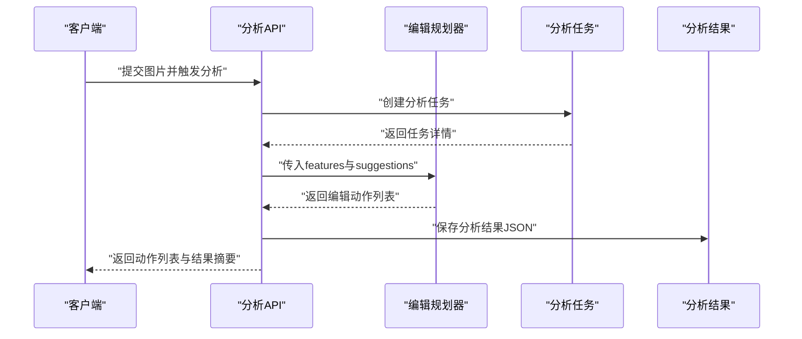
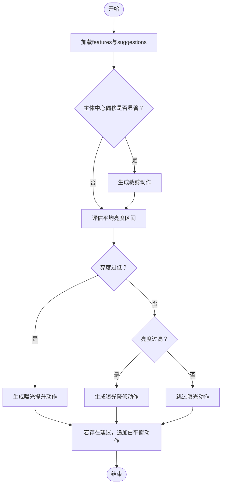
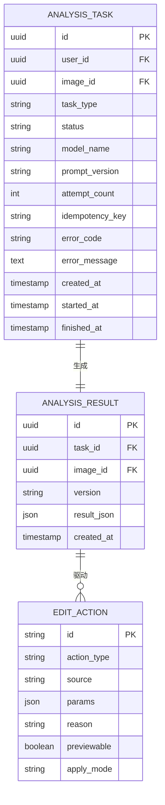
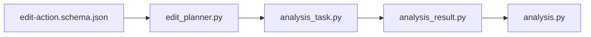

# 编辑动作契约

<cite>
**本文引用的文件**
- [edit-action.schema.json](file://packages/contracts/edit-action.schema.json)
- [edit-planner.py](file://apps/api/app/services/rules/edit_planner.py)
- [analysis_result.py](file://apps/api/app/models/analysis_result.py)
- [analysis_task.py](file://apps/api/app/models/analysis_task.py)
- [analysis.py](file://apps/api/app/schemas/analysis.py)
</cite>

## 目录
1. [简介](#简介)
2. [项目结构](#项目结构)
3. [核心组件](#核心组件)
4. [架构总览](#架构总览)
5. [详细组件分析](#详细组件分析)
6. [依赖分析](#依赖分析)
7. [性能考虑](#性能考虑)
8. [故障排查指南](#故障排查指南)
9. [结论](#结论)
10. [附录](#附录)

## 简介
本文件为“AI摄影教练”项目的“编辑动作JSON Schema契约”文档，目标是为编辑动作数据结构提供完整的契约定义与实施指南，覆盖以下关键主题：
- 编辑动作数据结构：动作类型、参数配置、执行顺序、影响范围等核心属性
- 支持的编辑操作类型与参数格式
- 编辑动作的链式执行机制与依赖关系
- 编辑动作的验证规则与安全检查机制
- 编辑动作与AI分析结果的对应关系与自动化生成逻辑
- 编辑动作的撤销/重做机制与状态管理
- 编辑工具集成与批量处理的最佳实践

该契约以JSON Schema作为权威规范，并结合后端规则引擎与分析任务模型，确保前端与后端在编辑流程上保持一致。

## 项目结构
围绕编辑动作契约，本项目的关键文件分布如下：
- 合约层（Schema）：packages/contracts/edit-action.schema.json
- 规则引擎（编辑规划）：apps/api/app/services/rules/edit_planner.py
- 分析任务与结果模型：apps/api/app/models/analysis_task.py、apps/api/app/models/analysis_result.py
- 分析任务API响应模型：apps/api/app/schemas/analysis.py

图表来源
- [edit-action.schema.json:1-30](file://packages/contracts/edit-action.schema.json#L1-L30)
- [edit-planner.py:1-97](file://apps/api/app/services/rules/edit_planner.py#L1-L97)
- [analysis_task.py:1-36](file://apps/api/app/models/analysis_task.py#L1-L36)
- [analysis_result.py:1-28](file://apps/api/app/models/analysis_result.py#L1-L28)
- [analysis.py:1-52](file://apps/api/app/schemas/analysis.py#L1-L52)

章节来源
- [edit-action.schema.json:1-30](file://packages/contracts/edit-action.schema.json#L1-L30)
- [edit-planner.py:1-97](file://apps/api/app/services/rules/edit_planner.py#L1-L97)
- [analysis_task.py:1-36](file://apps/api/app/models/analysis_task.py#L1-L36)
- [analysis_result.py:1-28](file://apps/api/app/models/analysis_result.py#L1-L28)
- [analysis.py:1-52](file://apps/api/app/schemas/analysis.py#L1-L52)

## 核心组件
本节从契约与实现两个维度，系统化梳理编辑动作的核心要素。

- 契约定义（JSON Schema）
  - 必填字段：id、action_type、source、params、reason、previewable、apply_mode
  - 动作类型枚举：crop、exposure、white_balance、contrast、saturation
  - 来源枚举：cv、llm、rule
  - 应用模式：destructive、non_destructive
  - 参数结构：params为对象，具体键值由各动作类型决定
  - 其他约束：禁止额外属性

- 规则引擎（EditPlanner）
  - 输入：features（含image、subject、stats）、suggestions
  - 输出：按顺序排列的动作列表（链式执行）
  - 决策逻辑：基于图像尺寸、主体位置、平均亮度等规则自动生成动作
  - 示例动作：
    - 裁剪（crop）：依据主体中心位置计算裁剪区域
    - 曝光（exposure）：依据平均亮度区间自动调整alpha/beta
    - 白平衡（white_balance）：基于规则生成轻量建议

- 分析任务与结果
  - AnalysisTask：记录任务元信息、状态、尝试次数、错误信息等
  - AnalysisResult：存储分析结果的JSON结构与版本号
  - 二者通过外键关联，支持按图片与时间索引查询

章节来源
- [edit-action.schema.json:6-27](file://packages/contracts/edit-action.schema.json#L6-L27)
- [edit-planner.py:5-34](file://apps/api/app/services/rules/edit_planner.py#L5-L34)
- [analysis_task.py:10-30](file://apps/api/app/models/analysis_task.py#L10-L30)
- [analysis_result.py:10-22](file://apps/api/app/models/analysis_result.py#L10-L22)

## 架构总览
编辑动作从AI分析到规则生成再到应用执行的整体流程如下：

图表来源
- [analysis.py:8-31](file://apps/api/app/schemas/analysis.py#L8-L31)
- [edit-planner.py:6-34](file://apps/api/app/services/rules/edit_planner.py#L6-L34)
- [analysis_task.py:10-30](file://apps/api/app/models/analysis_task.py#L10-L30)
- [analysis_result.py:10-22](file://apps/api/app/models/analysis_result.py#L10-L22)

## 详细组件分析

### JSON Schema契约详解
- 字段与约束
  - id：字符串，唯一标识动作
  - action_type：枚举，限定为crop、exposure、white_balance、contrast、saturation
  - source：枚举，cv（计算机视觉）、llm（大语言模型）、rule（规则引擎）
  - params：对象，承载动作所需参数；具体键由动作类型决定
  - reason：字符串，动作生成的原因说明
  - previewable：布尔，是否可预览
  - apply_mode：枚举，destructive或non_destructive
  - 额外属性：禁止

- 参数格式示例（基于规则引擎输出）
  - crop：params包含x、y、w、h、ratio
  - exposure：params包含alpha、beta
  - white_balance：params包含mode、strength
  - contrast/saturation：可扩展为后续版本

- 验证与安全
  - 使用JSON Schema进行强校验，确保字段齐全且类型正确
  - apply_mode为non_destructive时，适合预览与叠加；destructive用于最终写入

章节来源
- [edit-action.schema.json:6-27](file://packages/contracts/edit-action.schema.json#L6-L27)
- [edit-planner.py:52-66](file://apps/api/app/services/rules/edit_planner.py#L52-L66)
- [edit-planner.py:69-90](file://apps/api/app/services/rules/edit_planner.py#L69-L90)

### 规则引擎：编辑动作生成逻辑
- 输入特征
  - image：宽高等基础信息
  - subject：主体位置（x、y、w、h），用于计算主体中心
  - stats：统计信息，如平均亮度mean_brightness
  - suggestions：外部建议集合（可为空）

- 动作生成顺序与依赖
  - 优先生成裁剪动作（若主体偏离中心）
  - 再生成曝光动作（依据亮度区间）
  - 最后追加白平衡动作（轻量建议，便于后续调色）

- 关键决策点
  - 主体中心与画布中心的相对位置差阈值
  - 平均亮度的上下阈值
  - 白平衡强度与模式的默认值

图表来源
- [edit-planner.py:6-34](file://apps/api/app/services/rules/edit_planner.py#L6-L34)
- [edit-planner.py:37-66](file://apps/api/app/services/rules/edit_planner.py#L37-L66)
- [edit-planner.py:68-90](file://apps/api/app/services/rules/edit_planner.py#L68-L90)

章节来源
- [edit-planner.py:6-34](file://apps/api/app/services/rules/edit_planner.py#L6-L34)
- [edit-planner.py:37-66](file://apps/api/app/services/rules/edit_planner.py#L37-L66)
- [edit-planner.py:68-90](file://apps/api/app/services/rules/edit_planner.py#L68-L90)

### AI分析结果与编辑动作的对应关系
- 分析任务模型
  - 记录任务ID、用户ID、图片ID、任务类型、状态、尝试次数、错误信息等
  - 支持按用户与创建时间索引，便于历史查询

- 分析结果模型
  - 存储result_json（结构化分析结果）
  - 版本号version用于兼容不同结果格式
  - GIN索引优化JSON查询

- 对应关系
  - EditPlanner基于AnalysisResult中的features生成编辑动作
  - EditAction列表与AnalysisTask形成“建议-执行”的闭环

图表来源
- [analysis_task.py:10-30](file://apps/api/app/models/analysis_task.py#L10-L30)
- [analysis_result.py:10-22](file://apps/api/app/models/analysis_result.py#L10-L22)
- [edit-action.schema.json:6-27](file://packages/contracts/edit-action.schema.json#L6-L27)

章节来源
- [analysis_task.py:10-30](file://apps/api/app/models/analysis_task.py#L10-L30)
- [analysis_result.py:10-22](file://apps/api/app/models/analysis_result.py#L10-L22)
- [analysis.py:18-31](file://apps/api/app/schemas/analysis.py#L18-L31)

### 编辑动作的链式执行与依赖关系
- 执行顺序
  - crop → exposure → white_balance（若有建议）
- 依赖关系
  - crop可能改变画面比例与主体位置，影响后续exposure的视觉效果
  - exposure与white_balance通常可叠加，但需注意apply_mode选择
- 可预览性
  - previewable为true的动作适合在非破坏性模式下叠加展示

章节来源
- [edit-planner.py:11-34](file://apps/api/app/services/rules/edit_planner.py#L11-L34)
- [edit-action.schema.json:20-25](file://packages/contracts/edit-action.schema.json#L20-L25)

### 验证规则与安全检查机制
- JSON Schema强约束
  - 必填字段校验
  - 枚举值限制
  - 禁止额外属性
- 参数有效性
  - params键值需与action_type匹配
  - apply_mode与previewable需符合预期行为
- 安全建议
  - 非破坏性模式优先用于预览
  - 对外部输入的suggestions进行白名单过滤

章节来源
- [edit-action.schema.json:6-27](file://packages/contracts/edit-action.schema.json#L6-L27)

### 撤销/重做机制与状态管理
- 状态管理
  - AnalysisTask维护状态（如PENDING、RUNNING、SUCCESS、FAILED）
  - 支持错误码与错误消息，便于回溯
- 撤销/重做
  - 建议采用非破坏性动作栈，记录每一步的apply_mode与params
  - 提供“重置到初始状态”与“回退N步”的接口
  - 对destructive动作需谨慎处理，必要时保留备份

章节来源
- [analysis_task.py:20-27](file://apps/api/app/models/analysis_task.py#L20-L27)
- [analysis.py:18-31](file://apps/api/app/schemas/analysis.py#L18-L31)

### 编辑工具集成与批量处理最佳实践
- 工具集成
  - 将EditAction列表作为统一协议，前端与后端共享
  - 对每个动作提供previewable=true的预览能力
- 批量处理
  - 将多张图片的EditAction列表合并为批次任务
  - 控制并发度，避免对存储与计算资源造成瞬时压力
  - 对失败任务进行重试与降级处理

章节来源
- [edit-action.schema.json:6-27](file://packages/contracts/edit-action.schema.json#L6-L27)
- [analysis.py:8-16](file://apps/api/app/schemas/analysis.py#L8-L16)

## 依赖分析
- 组件耦合
  - EditPlanner依赖AnalysisResult中的features结构
  - EditAction契约被EditPlanner输出与前端消费共同依赖
  - AnalysisTask与AnalysisResult通过外键建立强关联
- 外部依赖
  - JSON Schema用于契约约束
  - SQLAlchemy ORM用于持久化

图表来源
- [edit-action.schema.json:1-30](file://packages/contracts/edit-action.schema.json#L1-L30)
- [edit-planner.py:1-97](file://apps/api/app/services/rules/edit_planner.py#L1-L97)
- [analysis_task.py:1-36](file://apps/api/app/models/analysis_task.py#L1-L36)
- [analysis_result.py:1-28](file://apps/api/app/models/analysis_result.py#L1-L28)
- [analysis.py:1-52](file://apps/api/app/schemas/analysis.py#L1-L52)

章节来源
- [edit-action.schema.json:1-30](file://packages/contracts/edit-action.schema.json#L1-L30)
- [edit-planner.py:1-97](file://apps/api/app/services/rules/edit_planner.py#L1-L97)
- [analysis_task.py:1-36](file://apps/api/app/models/analysis_task.py#L1-L36)
- [analysis_result.py:1-28](file://apps/api/app/models/analysis_result.py#L1-L28)
- [analysis.py:1-52](file://apps/api/app/schemas/analysis.py#L1-L52)

## 性能考虑
- 查询优化
  - 为AnalysisTask与AnalysisResult建立复合索引，加速按用户与时间的检索
  - AnalysisResult的result_json使用GIN索引，提升JSON查询效率
- 执行优化
  - EditPlanner使用LRU缓存实例，减少重复初始化开销
  - 动作生成遵循“先裁剪再曝光”的顺序，降低后续处理成本
- 扩展性
  - params结构允许未来扩展更多动作参数
  - apply_mode区分非破坏性与破坏性，便于渐进式优化

章节来源
- [analysis_task.py:32-35](file://apps/api/app/models/analysis_task.py#L32-L35)
- [analysis_result.py:24-27](file://apps/api/app/models/analysis_result.py#L24-L27)
- [edit-planner.py:93-97](file://apps/api/app/services/rules/edit_planner.py#L93-L97)

## 故障排查指南
- 常见问题
  - 动作缺失：检查EditPlanner的阈值设置与features完整性
  - 参数不匹配：核对params键与action_type是否一致
  - 预览异常：确认previewable与apply_mode组合是否合理
- 错误追踪
  - AnalysisTask记录error_code与error_message，便于定位失败原因
  - AnalysisResult保存result_json，可用于回放与复现

章节来源
- [analysis_task.py:25-27](file://apps/api/app/models/analysis_task.py#L25-L27)
- [analysis.py:18-31](file://apps/api/app/schemas/analysis.py#L18-L31)

## 结论
本契约文档以JSON Schema为权威规范，结合规则引擎与分析任务模型，构建了从AI分析到编辑动作生成与执行的完整闭环。通过明确的动作类型、参数格式、执行顺序与应用模式，以及完善的验证与安全机制，为编辑工具的集成与批量处理提供了清晰的实施路径。建议在生产环境中持续完善动作参数的类型化校验与状态管理策略，以进一步提升系统的稳定性与可维护性。

## 附录
- 术语
  - 非破坏性：可在不修改原始素材的前提下进行叠加与预览
  - 破坏性：直接修改原始素材，不可逆
- 版本演进
  - AnalysisResult.version用于兼容不同结果格式
  - EditAction.apply_mode与params可根据业务发展扩展