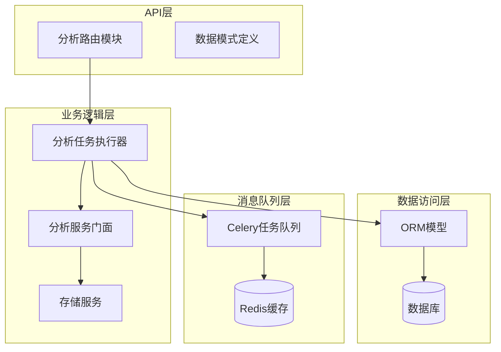
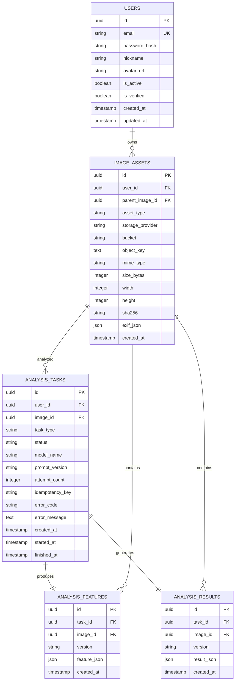
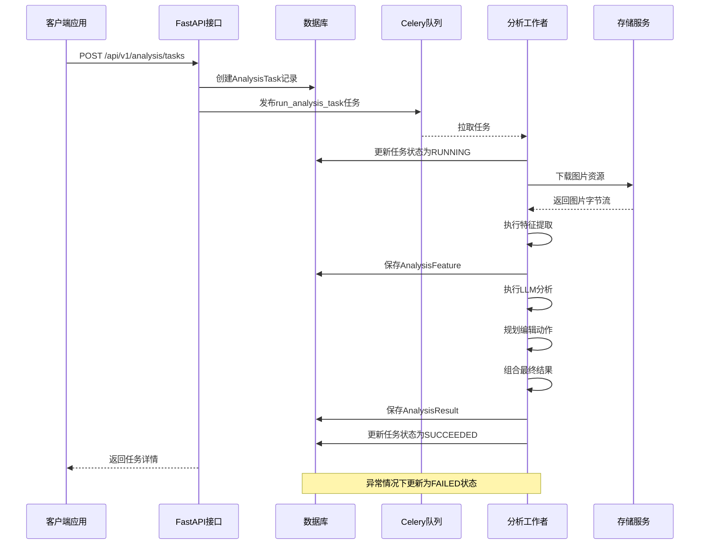
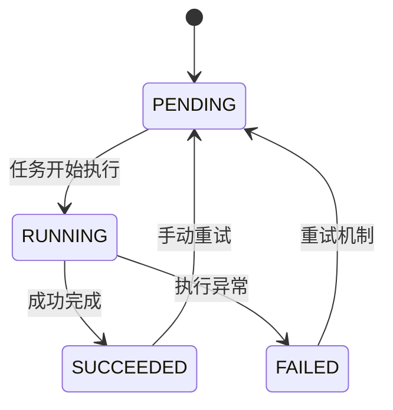
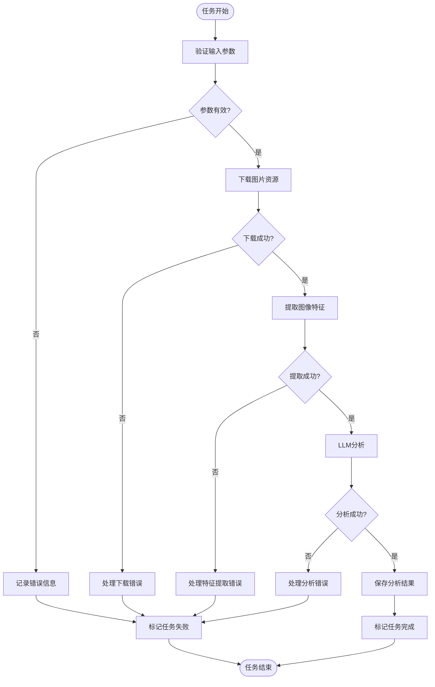
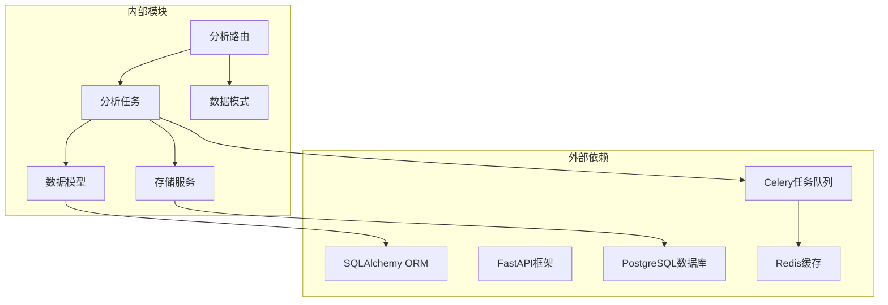

# 分析任务模型

<cite>
**本文档引用的文件**
- [apps/api/app/models/analysis_task.py](file://apps/api/app/models/analysis_task.py)
- [apps/api/app/models/analysis_feature.py](file://apps/api/app/models/analysis_feature.py)
- [apps/api/app/models/analysis_result.py](file://apps/api/app/models/analysis_result.py)
- [apps/api/app/models/image_asset.py](file://apps/api/app/models/image_asset.py)
- [apps/api/app/models/user.py](file://apps/api/app/models/user.py)
- [apps/api/app/models/base.py](file://apps/api/app/models/base.py)
- [apps/api/app/schemas/analysis.py](file://apps/api/app/schemas/analysis.py)
- [apps/api/app/modules/analysis/router.py](file://apps/api/app/modules/analysis/router.py)
- [apps/api/app/tasks/analyze_photo.py](file://apps/api/app/tasks/analyze_photo.py)
- [apps/api/app/core/celery_app.py](file://apps/api/app/core/celery_app.py)
- [apps/api/app/core/config.py](file://apps/api/app/core/config.py)
- [apps/api/app/services/storage/s3_storage.py](file://apps/api/app/services/storage/s3_storage.py)
</cite>

## 目录
1. [简介](#简介)
2. [项目结构](#项目结构)
3. [核心组件](#核心组件)
4. [架构概览](#架构概览)
5. [详细组件分析](#详细组件分析)
6. [依赖关系分析](#依赖关系分析)
7. [性能考虑](#性能考虑)
8. [故障排除指南](#故障排除指南)
9. [结论](#结论)

## 简介

本文件为AI照片教练系统的分析任务模型提供详细的数据模型文档。该系统实现了完整的异步图像分析任务处理流程，包括任务状态管理、重试机制、错误处理、进度跟踪等功能。本文档重点分析AnalysisTask实体的所有字段定义，解释异步任务的状态机设计，描述任务参数和配置选项的存储方式，并提供任务调度和重试机制的数据模型支持。

## 项目结构

AI照片教练系统采用分层架构设计，主要包含以下模块：

**图表来源**
- [apps/api/app/modules/analysis/router.py:1-151](file://apps/api/app/modules/analysis/router.py#L1-L151)
- [apps/api/app/tasks/analyze_photo.py:1-108](file://apps/api/app/tasks/analyze_photo.py#L1-L108)
- [apps/api/app/core/celery_app.py:1-21](file://apps/api/app/core/celery_app.py#L1-L21)

**章节来源**
- [apps/api/app/modules/analysis/router.py:1-151](file://apps/api/app/modules/analysis/router.py#L1-L151)
- [apps/api/app/core/celery_app.py:1-21](file://apps/api/app/core/celery_app.py#L1-L21)

## 核心组件

### AnalysisTask实体模型

AnalysisTask是系统的核心数据模型，负责跟踪每个图像分析任务的完整生命周期。该模型继承自Base类，使用SQLAlchemy ORM进行数据库映射。

**字段定义：**

| 字段名 | 类型 | 约束 | 默认值 | 描述 |
|--------|------|------|--------|------|
| id | UUID | 主键 | 自动生成 | 任务唯一标识符 |
| user_id | UUID | 外键(users.id) | - | 关联的用户标识符 |
| image_id | UUID | 外键(image_assets.id) | - | 关联的图片资源标识符 |
| task_type | String(32) | 非空 | "ANALYZE" | 任务类型标识 |
| status | String(16) | 非空 | "PENDING" | 任务当前状态 |
| model_name | String(64) | 非空 | - | 使用的AI模型名称 |
| prompt_version | String(32) | 非空 | - | 提示词版本号 |
| attempt_count | Integer | 非空 | 0 | 任务执行尝试次数 |
| idempotency_key | String(128) | 可空 | None | 幂等性键值 |
| error_code | String(64) | 可空 | None | 错误代码 |
| error_message | Text | 可空 | None | 错误详细信息 |
| created_at | DateTime | 非空 | 当前时间 | 任务创建时间 |
| started_at | DateTime | 可空 | None | 任务开始时间 |
| finished_at | DateTime | 可空 | None | 任务完成时间 |

**索引设计：**
- `idx_analysis_tasks_user_created`: 用户ID + 创建时间复合索引
- `idx_analysis_tasks_status_created`: 状态 + 创建时间复合索引

**章节来源**
- [apps/api/app/models/analysis_task.py:10-36](file://apps/api/app/models/analysis_task.py#L10-L36)

### AnalysisFeature实体模型

AnalysisFeature模型用于存储图像特征提取的结果，与AnalysisTask建立一对一关系。

**字段定义：**

| 字段名 | 类型 | 约束 | 默认值 | 描述 |
|--------|------|------|--------|------|
| id | UUID | 主键 | 自动生成 | 特征记录唯一标识符 |
| task_id | UUID | 外键(analysis_tasks.id) | - | 关联的任务标识符 |
| image_id | UUID | 外键(image_assets.id) | - | 关联的图片资源标识符 |
| version | String(16) | 非空 | "1.0" | 特征数据版本号 |
| feature_json | JSON | 非空 | - | 特征数据JSON格式 |
| created_at | DateTime | 非空 | 当前时间 | 记录创建时间 |

**索引设计：**
- `idx_analysis_features_image_created`: 图片ID + 创建时间复合索引
- `idx_analysis_features_feature_json_gin`: GIN索引优化JSON查询

**章节来源**
- [apps/api/app/models/analysis_feature.py:10-29](file://apps/api/app/models/analysis_feature.py#L10-L29)

### AnalysisResult实体模型

AnalysisResult模型用于存储最终的分析结果，同样与AnalysisTask建立一对一关系。

**字段定义：**

| 字段名 | 类型 | 约束 | 默认值 | 描述 |
|--------|------|------|--------|------|
| id | UUID | 主键 | 自动生成 | 结果记录唯一标识符 |
| task_id | UUID | 外键(analysis_tasks.id) | - | 关联的任务标识符 |
| image_id | UUID | 外键(image_assets.id) | - | 关联的图片资源标识符 |
| version | String(16) | 非空 | "1.1" | 结果数据版本号 |
| result_json | JSON | 非空 | - | 分析结果JSON格式 |
| created_at | DateTime | 非空 | 当前时间 | 记录创建时间 |

**索引设计：**
- `idx_analysis_results_image_created`: 图片ID + 创建时间复合索引
- `idx_analysis_results_result_json_gin`: GIN索引优化JSON查询

**章节来源**
- [apps/api/app/models/analysis_result.py:10-28](file://apps/api/app/models/analysis_result.py#L10-L28)

### 关联关系图

**图表来源**
- [apps/api/app/models/user.py:12-28](file://apps/api/app/models/user.py#L12-L28)
- [apps/api/app/models/image_asset.py:10-32](file://apps/api/app/models/image_asset.py#L10-L32)
- [apps/api/app/models/analysis_task.py:10-36](file://apps/api/app/models/analysis_task.py#L10-L36)
- [apps/api/app/models/analysis_feature.py:10-29](file://apps/api/app/models/analysis_feature.py#L10-L29)
- [apps/api/app/models/analysis_result.py:10-28](file://apps/api/app/models/analysis_result.py#L10-L28)

## 架构概览

系统采用异步任务处理架构，通过Celery实现任务队列管理，FastAPI提供RESTful API接口。

**图表来源**
- [apps/api/app/modules/analysis/router.py:45-74](file://apps/api/app/modules/analysis/router.py#L45-L74)
- [apps/api/app/tasks/analyze_photo.py:19-108](file://apps/api/app/tasks/analyze_photo.py#L19-L108)
- [apps/api/app/core/celery_app.py:5-19](file://apps/api/app/core/celery_app.py#L5-L19)

## 详细组件分析

### 任务状态机设计

系统实现了完整的任务状态管理机制，支持以下状态转换：

**状态转换规则：**

1. **初始状态**: 所有新创建的任务默认状态为`PENDING`
2. **执行中状态**: 任务被工作者拉取后状态变为`RUNNING`
3. **成功状态**: 任务正常完成时状态变为`SUCCEEDED`
4. **失败状态**: 任务执行过程中发生异常时状态变为`FAILED`
5. **重试机制**: 失败或成功的任务可以重新置为`PENDING`状态进行重试

**章节来源**
- [apps/api/app/tasks/analyze_photo.py:29-105](file://apps/api/app/tasks/analyze_photo.py#L29-L105)
- [apps/api/app/modules/analysis/router.py:128-151](file://apps/api/app/modules/analysis/router.py#L128-L151)

### 任务参数和配置存储

任务参数通过以下方式存储和管理：

1. **静态配置**: 从配置文件读取的模型名称和提示词版本
2. **动态参数**: 任务创建时的用户ID和图片ID
3. **运行时参数**: 执行过程中的尝试次数和幂等性键值

**配置项说明：**

| 配置项 | 类型 | 默认值 | 描述 |
|--------|------|--------|------|
| model_name | String | "mock-vision-v1" | AI模型名称 |
| prompt_version | String | "v1" | 提示词版本号 |
| redis_url | String | "redis://localhost:6379/0" | Redis连接地址 |
| s3_endpoint | String | "http://localhost:9000" | S3存储端点 |

**章节来源**
- [apps/api/app/core/config.py:22-23](file://apps/api/app/core/config.py#L22-L23)
- [apps/api/app/modules/analysis/router.py:58-66](file://apps/api/app/modules/analysis/router.py#L58-L66)

### 任务调度和重试机制

系统通过Celery实现分布式任务调度，支持自动重试和手动重试功能。

**调度机制：**
- 任务创建后立即发布到Celery队列
- 工作者从队列中拉取任务执行
- 任务按队列优先级顺序处理

**重试机制：**
- 自动重试: 通过Celery的重试装饰器实现
- 手动重试: 支持用户主动触发任务重试
- 尝试计数: 记录任务的总执行次数

**章节来源**
- [apps/api/app/tasks/analyze_photo.py:71-149](file://apps/api/app/tasks/analyze_photo.py#L71-L149)
- [apps/api/app/core/celery_app.py:16-18](file://apps/api/app/core/celery_app.py#L16-L18)

### 任务超时和失败处理

系统实现了完善的错误处理和超时管理机制：

**错误处理流程：**

**错误记录机制：**
- 错误代码: 记录异常类名
- 错误消息: 记录异常字符串（限制长度）
- 失败时间: 记录任务失败的具体时间

**章节来源**
- [apps/api/app/tasks/analyze_photo.py:97-107](file://apps/api/app/tasks/analyze_photo.py#L97-L107)

### 任务进度跟踪和中间结果存储

系统支持任务进度跟踪和中间结果的持久化存储：

**中间结果存储策略：**
1. **特征提取结果**: 存储在AnalysisFeature表中
2. **分析结果**: 存储在AnalysisResult表中
3. **版本控制**: 通过版本号管理数据结构变更

**进度跟踪机制：**
- 任务状态实时更新
- 时间戳记录关键节点
- 尝试次数统计

**章节来源**
- [apps/api/app/models/analysis_feature.py:20-22](file://apps/api/app/models/analysis_feature.py#L20-L22)
- [apps/api/app/models/analysis_result.py:20-22](file://apps/api/app/models/analysis_result.py#L20-L22)

### 任务查询和统计分析

系统提供了丰富的查询和统计功能：

**查询接口：**
- 任务详情查询: 获取单个任务的完整信息
- 历史记录查询: 获取用户的任务历史列表
- 条件过滤: 支持按状态、时间范围等条件查询

**统计分析：**
- 任务成功率统计
- 平均处理时间分析
- 用户活跃度统计

**章节来源**
- [apps/api/app/modules/analysis/router.py:76-125](file://apps/api/app/modules/analysis/router.py#L76-L125)

## 依赖关系分析

系统各组件之间的依赖关系如下：

**图表来源**
- [apps/api/app/models/base.py:1-5](file://apps/api/app/models/base.py#L1-L5)
- [apps/api/app/core/celery_app.py:1-21](file://apps/api/app/core/celery_app.py#L1-L21)

**依赖特点：**
- **低耦合**: 各模块职责明确，相互独立
- **高内聚**: 相关功能集中在同一模块内
- **可扩展**: 支持添加新的分析服务和存储后端

**章节来源**
- [apps/api/app/models/base.py:1-5](file://apps/api/app/models/base.py#L1-L5)
- [apps/api/app/core/celery_app.py:1-21](file://apps/api/app/core/celery_app.py#L1-L21)

## 性能考虑

系统在设计时充分考虑了性能优化：

**数据库性能优化：**
- 复合索引优化常用查询模式
- JSON字段GIN索引提升查询效率
- 连接池配置优化数据库连接

**任务队列性能：**
- 分离的任务队列避免资源竞争
- 异步处理提升系统吞吐量
- 重试机制保证任务可靠性

**存储性能：**
- CDN加速图片传输
- 缓存策略减少重复访问
- 流式处理降低内存占用

## 故障排除指南

**常见问题及解决方案：**

1. **任务长时间处于PENDING状态**
   - 检查Celery工作进程是否正常运行
   - 验证Redis连接配置
   - 查看任务队列是否有积压

2. **任务执行失败但无错误信息**
   - 检查异常捕获和日志记录
   - 验证存储服务可用性
   - 确认AI服务接口连通性

3. **图片下载失败**
   - 检查S3存储配置
   - 验证对象键是否存在
   - 确认网络连接稳定

**调试建议：**
- 启用详细的日志记录
- 使用数据库监控工具
- 实施性能指标监控
- 建立告警机制

**章节来源**
- [apps/api/app/tasks/analyze_photo.py:97-107](file://apps/api/app/tasks/analyze_photo.py#L97-L107)
- [apps/api/app/services/storage/s3_storage.py:45-50](file://apps/api/app/services/storage/s3_storage.py#L45-L50)

## 结论

AI照片教练系统的分析任务模型设计合理，实现了完整的异步任务处理流程。通过清晰的实体关系设计、完善的状态管理和错误处理机制，系统能够可靠地处理各种图像分析任务。模型支持灵活的配置管理、高效的查询接口和可扩展的架构设计，为后续的功能扩展奠定了良好的基础。

系统的主要优势包括：
- 清晰的数据模型设计和实体关系
- 完善的任务状态管理和重试机制
- 高效的数据库查询和索引优化
- 可靠的异步任务处理架构
- 丰富的查询和统计功能

未来可以考虑的改进方向：
- 添加任务超时配置和自动清理机制
- 实现更细粒度的任务进度报告
- 增强监控和告警功能
- 优化存储策略以支持更大规模的数据