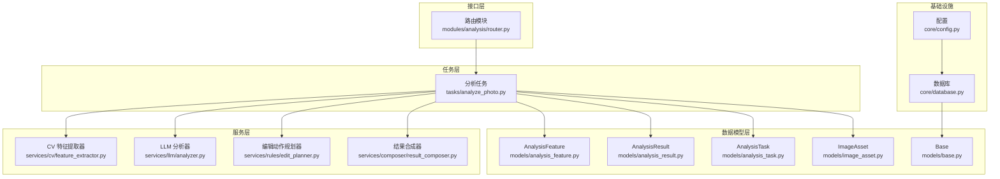
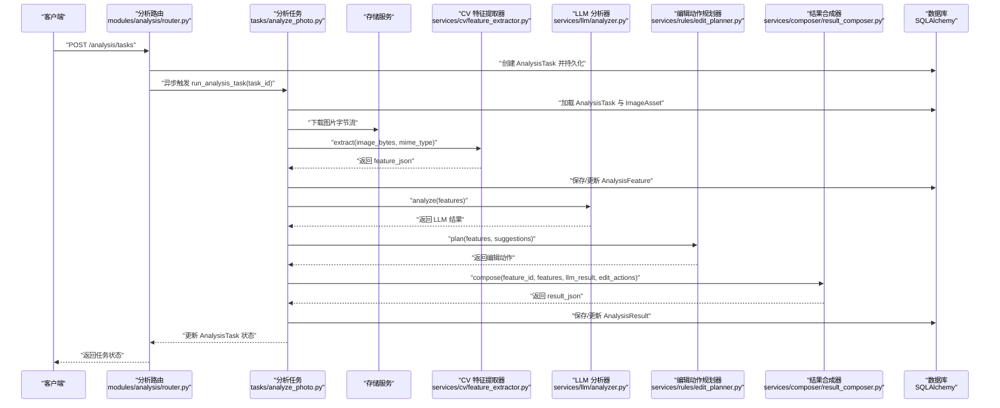
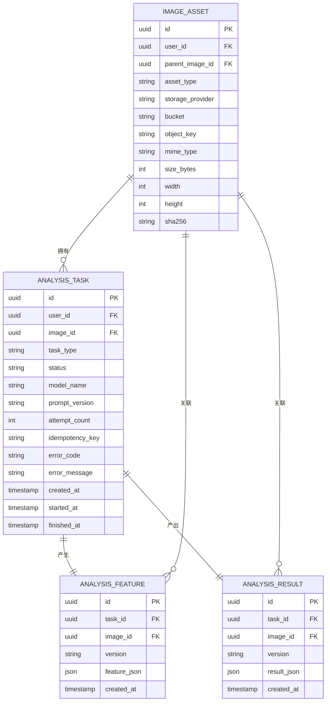
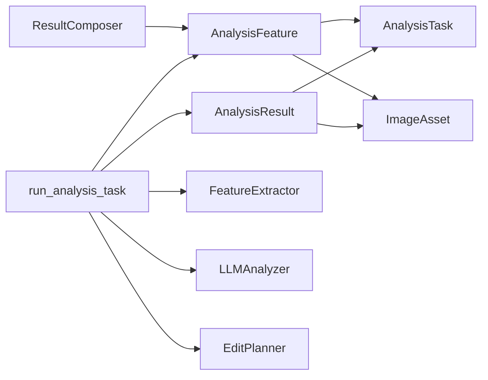

# 分析特征模型

<cite>
**本文档引用的文件**
- [apps/api/app/models/analysis_feature.py](file://apps/api/app/models/analysis_feature.py)
- [apps/api/app/models/analysis_result.py](file://apps/api/app/models/analysis_result.py)
- [apps/api/app/models/analysis_task.py](file://apps/api/app/models/analysis_task.py)
- [apps/api/app/models/image_asset.py](file://apps/api/app/models/image_asset.py)
- [apps/api/app/models/base.py](file://apps/api/app/models/base.py)
- [apps/api/app/services/cv/feature_extractor.py](file://apps/api/app/services/cv/feature_extractor.py)
- [apps/api/app/services/llm/analyzer.py](file://apps/api/app/services/llm/analyzer.py)
- [apps/api/app/services/composer/result_composer.py](file://apps/api/app/services/composer/result_composer.py)
- [apps/api/app/services/rules/edit_planner.py](file://apps/api/app/services/rules/edit_planner.py)
- [apps/api/app/tasks/analyze_photo.py](file://apps/api/app/tasks/analyze_photo.py)
- [apps/api/app/modules/analysis/router.py](file://apps/api/app/modules/analysis/router.py)
- [apps/api/app/core/database.py](file://apps/api/app/core/database.py)
- [apps/api/app/core/config.py](file://apps/api/app/core/config.py)
</cite>

## 目录
1. [引言](#引言)
2. [项目结构](#项目结构)
3. [核心组件](#核心组件)
4. [架构总览](#架构总览)
5. [详细组件分析](#详细组件分析)
6. [依赖分析](#依赖分析)
7. [性能考虑](#性能考虑)
8. [故障排查指南](#故障排查指南)
9. [结论](#结论)
10. [附录](#附录)

## 引言
本文件聚焦“分析特征模型”的数据模型设计与实现，围绕 AnalysisFeature 实体的字段定义、计算机视觉特征的存储与结构、序列化与反序列化机制、特征数据的归一化与标准化策略、特征重要性与相关性记录、特征与分析结果的关联关系与引用机制、批量处理与查询优化、以及压缩存储与检索性能优化建议进行系统化说明。目标是帮助开发者与产品人员准确理解特征数据的生命周期与使用方式。

## 项目结构
本项目采用分层与按功能模块划分的组织方式：
- 数据模型层：基于 SQLAlchemy ORM 定义实体与索引
- 服务层：负责特征提取、LLM 分析、编辑动作规划、结果合成
- 任务层：Celery 异步任务编排分析流程
- 接口层：FastAPI 路由暴露分析任务创建、详情查询与历史列表
- 配置与数据库：统一配置与初始化脚本

图表来源
- [apps/api/app/modules/analysis/router.py:1-151](file://apps/api/app/modules/analysis/router.py#L1-L151)
- [apps/api/app/tasks/analyze_photo.py:1-108](file://apps/api/app/tasks/analyze_photo.py#L1-L108)
- [apps/api/app/services/cv/feature_extractor.py:1-98](file://apps/api/app/services/cv/feature_extractor.py#L1-L98)
- [apps/api/app/services/llm/analyzer.py:1-139](file://apps/api/app/services/llm/analyzer.py#L1-L139)
- [apps/api/app/services/rules/edit_planner.py:1-97](file://apps/api/app/services/rules/edit_planner.py#L1-L97)
- [apps/api/app/services/composer/result_composer.py:1-99](file://apps/api/app/services/composer/result_composer.py#L1-L99)
- [apps/api/app/models/analysis_feature.py:1-29](file://apps/api/app/models/analysis_feature.py#L1-L29)
- [apps/api/app/models/analysis_result.py:1-28](file://apps/api/app/models/analysis_result.py#L1-L28)
- [apps/api/app/models/analysis_task.py:1-36](file://apps/api/app/models/analysis_task.py#L1-L36)
- [apps/api/app/models/image_asset.py:1-32](file://apps/api/app/models/image_asset.py#L1-L32)
- [apps/api/app/models/base.py:1-5](file://apps/api/app/models/base.py#L1-L5)
- [apps/api/app/core/config.py:1-47](file://apps/api/app/core/config.py#L1-L47)
- [apps/api/app/core/database.py:1-51](file://apps/api/app/core/database.py#L1-L51)

章节来源
- [apps/api/app/modules/analysis/router.py:1-151](file://apps/api/app/modules/analysis/router.py#L1-L151)
- [apps/api/app/tasks/analyze_photo.py:1-108](file://apps/api/app/tasks/analyze_photo.py#L1-L108)
- [apps/api/app/core/database.py:1-51](file://apps/api/app/core/database.py#L1-L51)

## 核心组件
本节聚焦 AnalysisFeature 实体及其相关模型，明确字段定义、约束与索引策略，解释其在整体分析流程中的作用。

- AnalysisFeature（特征实体）
  - 字段定义
    - id：主键，UUID 类型
    - task_id：外键，指向 analysis_tasks.id，级联删除；唯一性约束
    - image_id：外键，指向 image_assets.id，级联删除
    - version：字符串版本号，默认“1.0”
    - feature_json：JSON 字段，存储计算机视觉特征
    - created_at：服务器默认时间戳
  - 索引
    - 复合索引：image_id + created_at
    - GIN 索引：feature_json（PostgreSQL）
  - 关联关系
    - 与 AnalysisTask：一对一（task_id 唯一）
    - 与 ImageAsset：多对一
  - 存储格式
    - feature_json 以 JSON 结构存储，包含版本号与特征内容（见下节）

- AnalysisResult（分析结果实体）
  - 字段定义
    - id：主键，UUID 类型
    - task_id：外键，指向 analysis_tasks.id，级联删除；唯一性约束
    - image_id：外键，指向 image_assets.id，级联删除
    - version：字符串版本号，默认“1.1”
    - result_json：JSON 字段，存储最终分析结果
    - created_at：服务器默认时间戳
  - 索引
    - 复合索引：image_id + created_at
    - GIN 索引：result_json（PostgreSQL）
  - 关联关系
    - 与 AnalysisTask：一对一（task_id 唯一）
    - 与 ImageAsset：多对一

- AnalysisTask（分析任务实体）
  - 字段定义
    - id：主键，UUID 类型
    - user_id：外键，指向 users.id，级联删除
    - image_id：外键，指向 image_assets.id，级联删除
    - task_type：任务类型，默认“ANALYZE”
    - status：状态，默认“PENDING”
    - model_name、prompt_version：模型与提示词版本
    - attempt_count：尝试次数
    - idempotency_key：幂等键
    - error_code、error_message：错误信息
    - created_at、started_at、finished_at：时间戳
  - 索引
    - user_id + created_at
    - status + created_at

- ImageAsset（图像资产实体）
  - 字段定义
    - id：主键，UUID 类型
    - user_id：外键，指向 users.id，级联删除
    - parent_image_id：自引用外键（可空）
    - asset_type、storage_provider、bucket、object_key、mime_type、size_bytes、width、height、sha256、exif_json
    - created_at：时间戳
  - 约束
    - 唯一约束：bucket + object_key

章节来源
- [apps/api/app/models/analysis_feature.py:1-29](file://apps/api/app/models/analysis_feature.py#L1-L29)
- [apps/api/app/models/analysis_result.py:1-28](file://apps/api/app/models/analysis_result.py#L1-L28)
- [apps/api/app/models/analysis_task.py:1-36](file://apps/api/app/models/analysis_task.py#L1-L36)
- [apps/api/app/models/image_asset.py:1-32](file://apps/api/app/models/image_asset.py#L1-L32)

## 架构总览
从请求到结果的完整链路如下：

图表来源
- [apps/api/app/modules/analysis/router.py:45-74](file://apps/api/app/modules/analysis/router.py#L45-L74)
- [apps/api/app/tasks/analyze_photo.py:19-108](file://apps/api/app/tasks/analyze_photo.py#L19-L108)
- [apps/api/app/services/cv/feature_extractor.py:15-91](file://apps/api/app/services/cv/feature_extractor.py#L15-L91)
- [apps/api/app/services/llm/analyzer.py:8-118](file://apps/api/app/services/llm/analyzer.py#L8-L118)
- [apps/api/app/services/rules/edit_planner.py:6-90](file://apps/api/app/services/rules/edit_planner.py#L6-L90)
- [apps/api/app/services/composer/result_composer.py:8-23](file://apps/api/app/services/composer/result_composer.py#L8-L23)

## 详细组件分析

### AnalysisFeature 数据模型与字段定义
- 字段说明
  - id：全局唯一标识，便于跨表引用与审计
  - task_id：与 AnalysisTask 建立一对一关系，保证每个任务仅对应一份特征快照
  - image_id：与 ImageAsset 建立多对一关系，便于按图像维度聚合统计
  - version：特征 JSON 的版本号，便于演进与兼容
  - feature_json：JSON 结构，包含图像元信息、统计特征、主体区域、高光/阴影区域、参考线等
  - created_at：特征生成时间，配合索引支持快速查询
- 索引策略
  - image_id + created_at：加速按图像与时间范围的查询
  - feature_json GIN：利用 PostgreSQL 的 JSONB GIN 支持高效检索与过滤
- 存储格式与结构
  - feature_json 包含以下关键子结构（示例路径）
    - 版本号：见 [apps/api/app/services/cv/feature_extractor.py](file://apps/api/app/services/cv/feature_extractor.py#L13)
    - 图像元信息：宽高、MIME 类型
    - 统计特征：均值亮度、对比度、构图平衡度
    - 主体区域：坐标与尺寸，像素坐标系
    - 区域标注：高光/阴影区域，像素坐标系
    - 参考线：地平线等构图参考线
  - 具体结构字段请参考上述文件路径与注释说明

章节来源
- [apps/api/app/models/analysis_feature.py:10-29](file://apps/api/app/models/analysis_feature.py#L10-L29)
- [apps/api/app/services/cv/feature_extractor.py:15-91](file://apps/api/app/services/cv/feature_extractor.py#L15-L91)

### 计算机视觉特征的存储格式与数据结构
- 提取器输出结构
  - 版本号：用于后续兼容性判断
  - image：宽、高、MIME 类型
  - stats：mean_brightness、contrast、composition_balance
  - subject：主体矩形框（像素坐标）
  - regions：highlight、shadow（可为空）
  - guidelines：horizon（地平线线段）
- 存储策略
  - 使用 JSON 字段直接落库，便于灵活扩展
  - 通过 GIN 索引支持复杂查询（如按主体位置、高光区域存在性等条件检索）

章节来源
- [apps/api/app/services/cv/feature_extractor.py:15-91](file://apps/api/app/services/cv/feature_extractor.py#L15-L91)
- [apps/api/app/models/analysis_feature.py:24-27](file://apps/api/app/models/analysis_feature.py#L24-L27)

### 特征向量的序列化与反序列化机制
- 序列化
  - Python 字典 → JSON：特征提取器返回的 Python 字典直接写入 feature_json 字段
  - 版本号随 feature_json 一同存储，便于后续解析与兼容
- 反序列化
  - 读取时由 SQLAlchemy ORM 映射为 Python 字典，供上层服务消费
  - 版本号用于选择解析策略（如不同版本字段差异）
- 注意事项
  - 版本号字段与 JSON 内容保持一致，避免解析歧义
  - 建议在服务层增加版本校验与降级逻辑

章节来源
- [apps/api/app/services/cv/feature_extractor.py:65-91](file://apps/api/app/services/cv/feature_extractor.py#L65-L91)
- [apps/api/app/tasks/analyze_photo.py:46-65](file://apps/api/app/tasks/analyze_photo.py#L46-L65)

### 特征数据的归一化与标准化策略
- 归一化建议
  - 像素坐标：按图像宽高归一化至 [0,1]，便于跨分辨率比较
  - 统计指标：亮度、对比度等按经验阈值映射到统一区间，如 [0,100]
  - 角度/方向：统一为弧度或角度，必要时做周期性归一化
- 标准化建议
  - z-score 标准化：对亮度、对比度等连续变量做零均值单位方差
  - 分箱/离散化：对类别型特征（如曝光等级）做有序编码
- 在本项目中的体现
  - LLM 分析器内部计算分数时已对指标做边界裁剪与映射（见路径）
  - 编辑动作规划器对主体重心比例与亮度区间做规则化处理

章节来源
- [apps/api/app/services/llm/analyzer.py:121-132](file://apps/api/app/services/llm/analyzer.py#L121-L132)
- [apps/api/app/services/rules/edit_planner.py:37-90](file://apps/api/app/services/rules/edit_planner.py#L37-L90)

### 特征重要性与相关性记录
- 当前实现
  - AnalysisFeature 不直接记录“重要性”与“相关性”字段
  - AnalysisResult 中的 scores 字段提供各维度评分，可作为重要性参考
- 建议扩展
  - 在 AnalysisFeature 或 AnalysisResult 增加“重要性权重”与“相关性矩阵”字段
  - 通过外部规则或模型训练补充权重，便于排序与筛选

章节来源
- [apps/api/app/services/llm/analyzer.py:113-132](file://apps/api/app/services/llm/analyzer.py#L113-L132)
- [apps/api/app/services/composer/result_composer.py:14-23](file://apps/api/app/services/composer/result_composer.py#L14-L23)

### 特征与分析结果的关联关系与引用机制
- 关联关系
  - AnalysisFeature.task_id → AnalysisTask.id（一对一）
  - AnalysisResult.task_id → AnalysisTask.id（一对一）
  - 两者均通过 image_id 关联 ImageAsset
- 引用机制
  - ResultComposer 将 AnalysisFeature.id 作为 features_ref 写入 AnalysisResult，形成反向引用
  - 路由层在查询历史时，通过 AnalysisResult.task_id 获取对应结果 JSON

图表来源
- [apps/api/app/models/analysis_feature.py:10-29](file://apps/api/app/models/analysis_feature.py#L10-L29)
- [apps/api/app/models/analysis_result.py:10-28](file://apps/api/app/models/analysis_result.py#L10-L28)
- [apps/api/app/models/analysis_task.py:10-36](file://apps/api/app/models/analysis_task.py#L10-L36)
- [apps/api/app/models/image_asset.py:10-32](file://apps/api/app/models/image_asset.py#L10-L32)

章节来源
- [apps/api/app/services/composer/result_composer.py](file://apps/api/app/services/composer/result_composer.py#L20)
- [apps/api/app/modules/analysis/router.py:88-89](file://apps/api/app/modules/analysis/router.py#L88-L89)

### 批量处理与批量查询优化
- 批量处理
  - Celery 任务按任务 ID 异步执行，单任务内顺序处理：下载图片 → 提取特征 → LLM 分析 → 动作规划 → 结果合成 → 写库
  - 可通过并发队列与 worker 数量扩展吞吐
- 批量查询
  - 路由层提供历史查询接口，支持 limit 参数限制返回条数
  - 数据库侧通过复合索引与 GIN 索引加速查询
- 优化建议
  - 对 AnalysisTask 增加 task_type + created_at 索引（已有增量脚本）
  - 对 AnalysisFeature 与 AnalysisResult 的 JSON 字段建立 GIN 索引（已实现）
  - 使用分页与游标翻页替代 offset，降低大偏移查询成本

章节来源
- [apps/api/app/modules/analysis/router.py:92-125](file://apps/api/app/modules/analysis/router.py#L92-L125)
- [apps/api/app/core/database.py:28-50](file://apps/api/app/core/database.py#L28-L50)

### 压缩存储与检索性能优化建议
- 压缩存储
  - 图像原图：由存储服务管理，不在数据库中重复存储
  - 特征 JSON：可启用数据库压缩（PostgreSQL 11+ 提供表压缩），或在应用层对大字段做压缩后再入库
- 检索优化
  - GIN 索引：对 JSON 字段进行高效检索
  - 版本化：通过 version 字段区分结构差异，避免全表扫描
  - 缓存：对热点特征与结果进行缓存（Redis），减少数据库压力
- 其他建议
  - 对频繁查询的字段（如 created_at、image_id）建立复合索引
  - 对 JSON 查询使用合适的查询谓词（如 exists、@>、? 等）

章节来源
- [apps/api/app/models/analysis_feature.py:24-27](file://apps/api/app/models/analysis_feature.py#L24-L27)
- [apps/api/app/models/analysis_result.py:24-27](file://apps/api/app/models/analysis_result.py#L24-L27)
- [apps/api/app/core/config.py:13-20](file://apps/api/app/core/config.py#L13-L20)

## 依赖分析
- 组件耦合
  - AnalysisFeature 与 AnalysisTask 通过 task_id 强绑定，确保任务与特征一一对应
  - AnalysisResult 通过 task_id 与 AnalysisTask 绑定，并通过 features_ref 引用 AnalysisFeature
  - 服务层通过依赖注入获取各组件实例，降低模块间耦合
- 外部依赖
  - 数据库：PostgreSQL（GIN 索引、JSONB）
  - 存储：S3/MinIO（对象存储）
  - 消息队列：Redis（Celery broker/结果后端）
- 循环依赖
  - 未发现循环导入；模块职责清晰

图表来源
- [apps/api/app/models/analysis_feature.py:14-19](file://apps/api/app/models/analysis_feature.py#L14-L19)
- [apps/api/app/models/analysis_result.py:14-19](file://apps/api/app/models/analysis_result.py#L14-L19)
- [apps/api/app/models/analysis_task.py:14-19](file://apps/api/app/models/analysis_task.py#L14-L19)
- [apps/api/app/models/image_asset.py:15-19](file://apps/api/app/models/image_asset.py#L15-L19)
- [apps/api/app/services/composer/result_composer.py](file://apps/api/app/services/composer/result_composer.py#L20)
- [apps/api/app/tasks/analyze_photo.py:41-44](file://apps/api/app/tasks/analyze_photo.py#L41-L44)

章节来源
- [apps/api/app/tasks/analyze_photo.py:1-108](file://apps/api/app/tasks/analyze_photo.py#L1-L108)
- [apps/api/app/services/composer/result_composer.py:1-99](file://apps/api/app/services/composer/result_composer.py#L1-L99)

## 性能考虑
- 查询性能
  - 使用复合索引与 GIN 索引，避免全表扫描
  - 对历史查询限制数量，结合分页或游标翻页
- 写入性能
  - 单任务内顺序写入，减少锁竞争
  - flush 与 commit 合理拆分，避免长事务
- 缓存策略
  - 对热点特征与结果进行短期缓存，降低数据库访问频率
- 存储成本
  - 特征 JSON 体积可控，建议结合压缩与版本化管理

## 故障排查指南
- 常见问题
  - 图像不存在：任务创建时校验 ImageAsset，不存在则抛出 404
  - 权限不足：校验 image.user_id 与当前用户是否一致
  - 任务状态异常：仅 FAILED/SUCCEEDED 可重试，其他状态返回 400
  - 数据库连接失败：检查数据库 URL 与网络连通性
- 错误记录
  - AnalysisTask 记录 error_code 与 error_message，便于定位
  - 任务失败后回滚并更新状态与时间戳

章节来源
- [apps/api/app/modules/analysis/router.py:52-56](file://apps/api/app/modules/analysis/router.py#L52-L56)
- [apps/api/app/modules/analysis/router.py:134-140](file://apps/api/app/modules/analysis/router.py#L134-L140)
- [apps/api/app/tasks/analyze_photo.py:97-107](file://apps/api/app/tasks/analyze_photo.py#L97-L107)

## 结论
本项目通过 AnalysisFeature 与 AnalysisResult 的双轨数据模型，实现了从计算机视觉特征提取到 LLM 分析与编辑动作规划的完整闭环。特征以 JSON 结构存储，具备良好的扩展性；通过版本号与 GIN 索引保障了兼容性与查询效率。建议在后续迭代中引入特征重要性与相关性记录、缓存与压缩策略，以及更完善的批量处理与监控体系。

## 附录
- 版本演进
  - AnalysisFeature 默认版本“1.0”，AnalysisResult 默认版本“1.1”
  - 版本号与 JSON 内容保持一致，便于解析与兼容
- 开发与部署
  - 初始化数据库与增量更新脚本位于数据库模块
  - 配置项集中于配置模块，支持多环境切换

章节来源
- [apps/api/app/models/analysis_feature.py](file://apps/api/app/models/analysis_feature.py#L20)
- [apps/api/app/models/analysis_result.py](file://apps/api/app/models/analysis_result.py#L20)
- [apps/api/app/core/database.py:28-50](file://apps/api/app/core/database.py#L28-L50)
- [apps/api/app/core/config.py:13-23](file://apps/api/app/core/config.py#L13-L23)