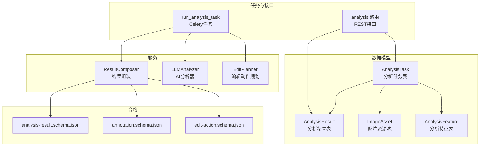
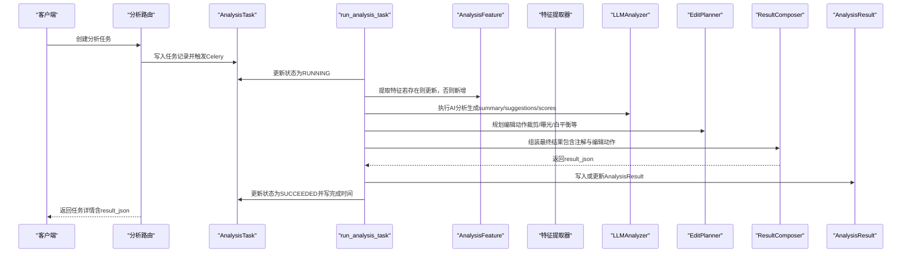
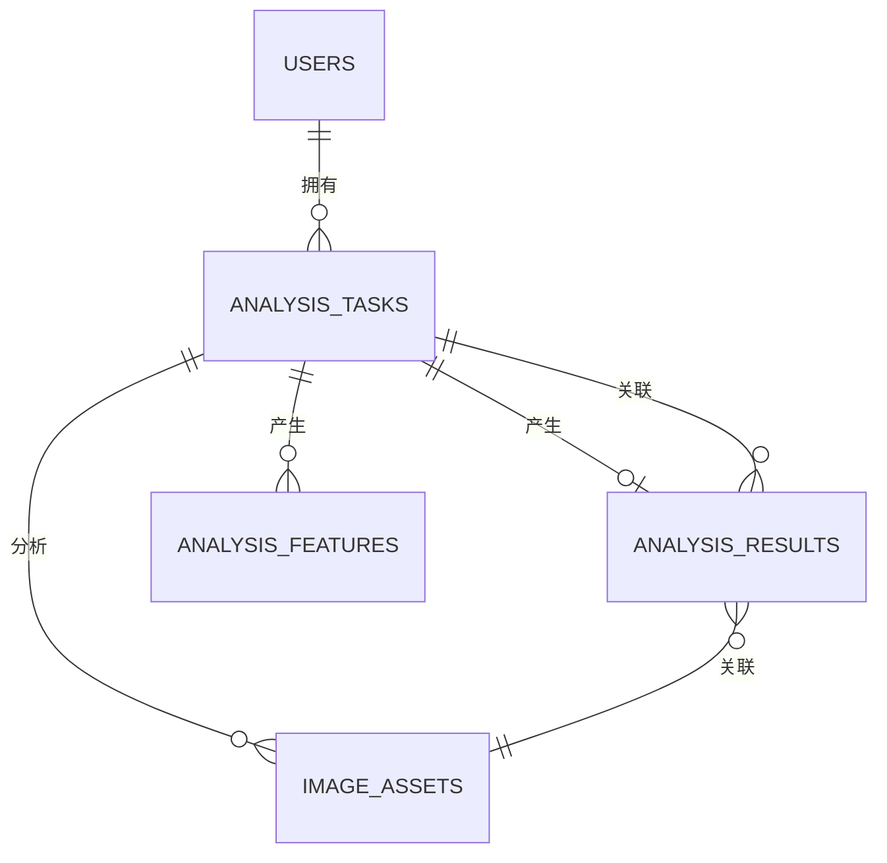
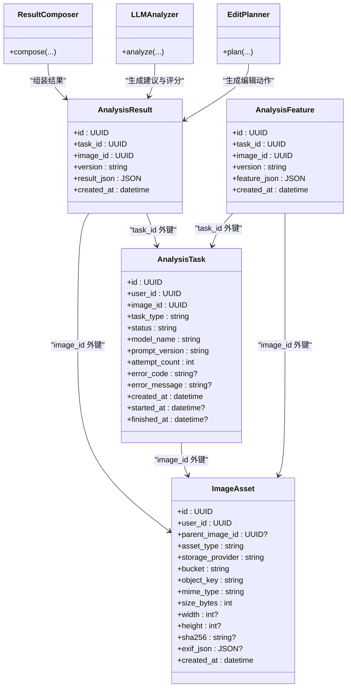
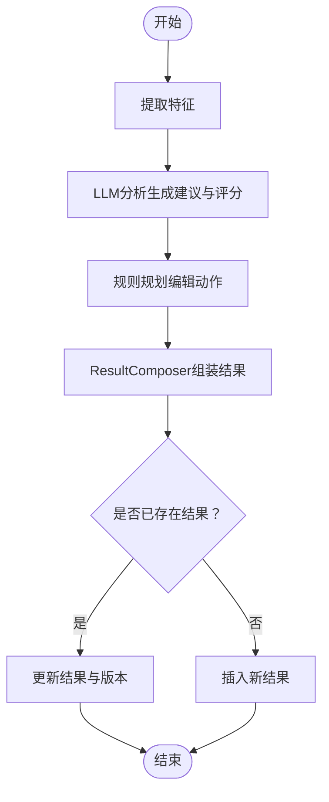

# 分析结果模型

<cite>
**本文引用的文件**
- [apps/api/app/models/analysis_result.py](file://apps/api/app/models/analysis_result.py)
- [apps/api/app/models/analysis_task.py](file://apps/api/app/models/analysis_task.py)
- [apps/api/app/models/image_asset.py](file://apps/api/app/models/image_asset.py)
- [apps/api/app/models/analysis_feature.py](file://apps/api/app/models/analysis_feature.py)
- [apps/api/app/schemas/analysis.py](file://apps/api/app/schemas/analysis.py)
- [apps/api/app/services/composer/result_composer.py](file://apps/api/app/services/composer/result_composer.py)
- [apps/api/app/services/llm/analyzer.py](file://apps/api/app/services/llm/analyzer.py)
- [apps/api/app/services/rules/edit_planner.py](file://apps/api/app/services/rules/edit_planner.py)
- [apps/api/app/tasks/analyze_photo.py](file://apps/api/app/tasks/analyze_photo.py)
- [apps/api/app/modules/analysis/router.py](file://apps/api/app/modules/analysis/router.py)
- [packages/contracts/analysis-result.schema.json](file://packages/contracts/analysis-result.schema.json)
- [packages/contracts/annotation.schema.json](file://packages/contracts/annotation.schema.json)
- [packages/contracts/edit-action.schema.json](file://packages/contracts/edit-action.schema.json)
</cite>

## 目录
1. [简介](#简介)
2. [项目结构](#项目结构)
3. [核心组件](#核心组件)
4. [架构总览](#架构总览)
5. [详细组件分析](#详细组件分析)
6. [依赖关系分析](#依赖关系分析)
7. [性能考量](#性能考量)
8. [故障排查指南](#故障排查指南)
9. [结论](#结论)
10. [附录](#附录)

## 简介
本文件为“分析结果模型”的数据模型文档，聚焦于 AnalysisResult 实体及其与分析任务、图片资源、特征数据、LLM 分析器、编辑动作规划器之间的关系。内容涵盖：
- AnalysisResult 字段定义与约束
- AI 分析结果的数据结构与 JSON 存储格式
- 结果验证与质量控制机制
- 版本管理与历史记录策略
- 导出与分享的数据格式设计
- 与分析任务和图片资源的关联关系
- 聚合统计与报表生成支持
- 查询与过滤的数据模型优化

## 项目结构
围绕分析结果模型的关键文件分布如下：
- 数据模型层：AnalysisResult、AnalysisTask、ImageAsset、AnalysisFeature
- 服务层：ResultComposer（结果组装）、LLMAnalyzer（AI 分析）、EditPlanner（编辑动作规划）
- 任务层：run_analysis_task（异步分析任务）
- 接口层：analysis 模块路由（任务创建、详情、历史、重试）
- 合约层：analysis-result、annotation、edit-action JSON Schema

图表来源
- [apps/api/app/models/analysis_result.py:10-27](file://apps/api/app/models/analysis_result.py#L10-L27)
- [apps/api/app/models/analysis_task.py:10-35](file://apps/api/app/models/analysis_task.py#L10-L35)
- [apps/api/app/models/image_asset.py:10-31](file://apps/api/app/models/image_asset.py#L10-L31)
- [apps/api/app/models/analysis_feature.py:10-27](file://apps/api/app/models/analysis_feature.py#L10-L27)
- [apps/api/app/services/composer/result_composer.py:5-23](file://apps/api/app/services/composer/result_composer.py#L5-L23)
- [apps/api/app/services/llm/analyzer.py:5-118](file://apps/api/app/services/llm/analyzer.py#L5-L118)
- [apps/api/app/services/rules/edit_planner.py:5-34](file://apps/api/app/services/rules/edit_planner.py#L5-L34)
- [apps/api/app/tasks/analyze_photo.py:19-107](file://apps/api/app/tasks/analyze_photo.py#L19-L107)
- [apps/api/app/modules/analysis/router.py:24-150](file://apps/api/app/modules/analysis/router.py#L24-L150)
- [packages/contracts/analysis-result.schema.json:1-76](file://packages/contracts/analysis-result.schema.json#L1-L76)
- [packages/contracts/annotation.schema.json:1-60](file://packages/contracts/annotation.schema.json#L1-L60)
- [packages/contracts/edit-action.schema.json:1-30](file://packages/contracts/edit-action.schema.json#L1-L30)

章节来源
- [apps/api/app/models/analysis_result.py:10-27](file://apps/api/app/models/analysis_result.py#L10-L27)
- [apps/api/app/models/analysis_task.py:10-35](file://apps/api/app/models/analysis_task.py#L10-L35)
- [apps/api/app/models/image_asset.py:10-31](file://apps/api/app/models/image_asset.py#L10-L31)
- [apps/api/app/models/analysis_feature.py:10-27](file://apps/api/app/models/analysis_feature.py#L10-L27)
- [apps/api/app/services/composer/result_composer.py:5-23](file://apps/api/app/services/composer/result_composer.py#L5-L23)
- [apps/api/app/services/llm/analyzer.py:5-118](file://apps/api/app/services/llm/analyzer.py#L5-L118)
- [apps/api/app/services/rules/edit_planner.py:5-34](file://apps/api/app/services/rules/edit_planner.py#L5-L34)
- [apps/api/app/tasks/analyze_photo.py:19-107](file://apps/api/app/tasks/analyze_photo.py#L19-L107)
- [apps/api/app/modules/analysis/router.py:24-150](file://apps/api/app/modules/analysis/router.py#L24-L150)
- [packages/contracts/analysis-result.schema.json:1-76](file://packages/contracts/analysis-result.schema.json#L1-L76)
- [packages/contracts/annotation.schema.json:1-60](file://packages/contracts/annotation.schema.json#L1-L60)
- [packages/contracts/edit-action.schema.json:1-30](file://packages/contracts/edit-action.schema.json#L1-L30)

## 核心组件
- AnalysisResult（分析结果）
  - 主键：id（UUID）
  - 外键：task_id（指向 analysis_tasks.id，级联删除；唯一索引），image_id（指向 image_assets.id，级联删除）
  - 字段：version（字符串，长度限制 16，默认 1.1），result_json（JSON 对象，必填），created_at（时间戳，服务器默认值）
  - 索引：按 image_id+created_at 组合索引；result_json 使用 GIN 索引（PostgreSQL）
- AnalysisTask（分析任务）
  - 关键字段：user_id、image_id、task_type、status、model_name、prompt_version、attempt_count、idempotency_key、error_code、error_message、created_at、started_at、finished_at
  - 索引：user_id+created_at、status+created_at
- ImageAsset（图片资源）
  - 关键字段：user_id、parent_image_id、asset_type、storage_provider、bucket、object_key、mime_type、size_bytes、width、height、sha256、exif_json、created_at
  - 唯一约束：bucket+object_key
- AnalysisFeature（分析特征）
  - 关键字段：task_id（唯一外键）、image_id、version、feature_json、created_at
  - 索引：image_id+created_at；feature_json 使用 GIN 索引（PostgreSQL）

章节来源
- [apps/api/app/models/analysis_result.py:10-27](file://apps/api/app/models/analysis_result.py#L10-L27)
- [apps/api/app/models/analysis_task.py:10-35](file://apps/api/app/models/analysis_task.py#L10-L35)
- [apps/api/app/models/image_asset.py:10-31](file://apps/api/app/models/image_asset.py#L10-L31)
- [apps/api/app/models/analysis_feature.py:10-27](file://apps/api/app/models/analysis_feature.py#L10-L27)

## 架构总览
分析结果模型贯穿“特征提取 → AI 分析 → 编辑动作规划 → 结果组装 → 存储与查询”的完整链路。

图表来源
- [apps/api/app/modules/analysis/router.py:45-73](file://apps/api/app/modules/analysis/router.py#L45-L73)
- [apps/api/app/tasks/analyze_photo.py:19-107](file://apps/api/app/tasks/analyze_photo.py#L19-L107)
- [apps/api/app/services/composer/result_composer.py:8-23](file://apps/api/app/services/composer/result_composer.py#L8-L23)
- [apps/api/app/services/llm/analyzer.py:8-118](file://apps/api/app/services/llm/analyzer.py#L8-L118)
- [apps/api/app/services/rules/edit_planner.py:6-34](file://apps/api/app/services/rules/edit_planner.py#L6-L34)

## 详细组件分析

### AnalysisResult 数据模型与字段定义
- id：主键，UUID 类型
- task_id：外键，指向 AnalysisTask.id，删除时级联；唯一索引，确保每个任务仅对应一条结果
- image_id：外键，指向 ImageAsset.id，删除时级联
- version：字符串，长度不超过 16，默认 1.1，用于结果格式版本控制
- result_json：JSON 类型，必填，存储完整的分析结果对象
- created_at：时间戳，服务器默认值
- 索引：
  - idx_analysis_results_image_created：image_id + created_at，便于按图片检索最新结果
  - idx_analysis_results_result_json_gin：result_json 使用 GIN 索引（PostgreSQL），加速 JSON 查询与过滤

章节来源
- [apps/api/app/models/analysis_result.py:10-27](file://apps/api/app/models/analysis_result.py#L10-L27)

### AI 分析结果的数据结构与 JSON 存储格式
- 结构要求（analysis-result.schema.json）：
  - 必填字段：version、summary、suggestions、scores、annotations、edit_actions
  - version：字符串
  - summary：字符串，最小长度 1
  - suggestions：数组，元素对象包含 id、type、text、priority；type 枚举：["composition","exposure","color","story","other"]；priority 枚举：["high","medium","low"]
  - scores：对象或 null，包含 composition/exposure/color/story 数值（0-100）
  - features_ref：对象或 null，包含 feature_id 引用
  - annotations：数组，元素符合 annotation.schema.json
  - edit_actions：数组，元素符合 edit-action.schema.json
- 注解（annotation.schema.json）：
  - id、source（cv/llm/rule）、category（composition/exposure/color/story/guideline/detail/crop）、geometry_type（bbox/point/line/polygon）、coords（坐标结构）、label、message、confidence（0-1）、related_suggestion_ids[]
- 编辑动作（edit-action.schema.json）：
  - id、action_type（crop/exposure/white_balance/contrast/saturation）、source、params、reason、previewable、apply_mode（destructive/non_destructive）

章节来源
- [packages/contracts/analysis-result.schema.json:6-74](file://packages/contracts/analysis-result.schema.json#L6-L74)
- [packages/contracts/annotation.schema.json:6-56](file://packages/contracts/annotation.schema.json#L6-L56)
- [packages/contracts/edit-action.schema.json:6-26](file://packages/contracts/edit-action.schema.json#L6-L26)

### 结果验证与质量控制机制
- 任务状态机与错误处理：
  - run_analysis_task 将任务状态从 PENDING 更新为 RUNNING，异常时回滚并设置 FAILED、错误码与错误消息，最后统一关闭会话
- JSON Schema 验证：
  - analysis-result.schema.json 定义了严格的字段与类型约束，确保 result_json 的结构一致性
- 版本控制：
  - AnalysisResult.version 默认 1.1，ResultComposer.version 固定为 1.1；LLMAnalyzer.version 为 1.0；ResultComposer 在组装时将 version 写入结果
- 注解与建议的关联：
  - ResultComposer 为注解添加 related_suggestion_ids，便于前端展示与交互

章节来源
- [apps/api/app/tasks/analyze_photo.py:97-107](file://apps/api/app/tasks/analyze_photo.py#L97-L107)
- [packages/contracts/analysis-result.schema.json:6-13](file://packages/contracts/analysis-result.schema.json#L6-L13)
- [apps/api/app/services/composer/result_composer.py:6-6](file://apps/api/app/services/composer/result_composer.py#L6-L6)
- [apps/api/app/services/llm/analyzer.py:6-6](file://apps/api/app/services/llm/analyzer.py#L6-L6)

### 版本管理与历史记录策略
- 版本管理：
  - AnalysisResult.version：结果版本（默认 1.1）
  - AnalysisFeature.version：特征版本（默认 1.0）
  - ResultComposer.version：结果组装版本（固定 1.1）
  - LLMAnalyzer.version：LLM 分析版本（固定 1.0）
- 历史记录：
  - history 接口返回 AnalysisTask 列表及摘要（summary），通过 AnalysisResult.result_json 获取
  - 支持 limit 参数限制数量（1-100）

章节来源
- [apps/api/app/models/analysis_result.py:20-20](file://apps/api/app/models/analysis_result.py#L20-L20)
- [apps/api/app/models/analysis_feature.py:20-20](file://apps/api/app/models/analysis_feature.py#L20-L20)
- [apps/api/app/services/composer/result_composer.py:6-6](file://apps/api/app/services/composer/result_composer.py#L6-L6)
- [apps/api/app/services/llm/analyzer.py:6-6](file://apps/api/app/services/llm/analyzer.py#L6-L6)
- [apps/api/app/modules/analysis/router.py:92-125](file://apps/api/app/modules/analysis/router.py#L92-L125)

### 导出与分享的数据格式设计
- 导出格式：
  - AnalysisResult.result_json 即为标准导出格式，遵循 analysis-result.schema.json
  - annotations 与 edit_actions 符合各自 schema，便于第三方工具解析
- 分享策略：
  - 可直接分享 AnalysisResult.result_json
  - 建议在分享前进行脱敏处理（如去除用户标识、敏感路径等）

章节来源
- [apps/api/app/models/analysis_result.py:21-21](file://apps/api/app/models/analysis_result.py#L21-L21)
- [packages/contracts/analysis-result.schema.json:14-72](file://packages/contracts/analysis-result.schema.json#L14-L72)

### 结果与分析任务、图片资源的关联关系
- AnalysisResult.task_id → AnalysisTask.id（一对一，唯一）
- AnalysisResult.image_id → ImageAsset.id（一对多）
- AnalysisTask.user_id → 用户（用于权限校验）
- AnalysisFeature.task_id → AnalysisTask.id（一对一，唯一），用于存储中间特征

图表来源
- [apps/api/app/models/analysis_task.py:14-16](file://apps/api/app/models/analysis_task.py#L14-L16)
- [apps/api/app/models/analysis_result.py:14-19](file://apps/api/app/models/analysis_result.py#L14-L19)
- [apps/api/app/models/image_asset.py:15-16](file://apps/api/app/models/image_asset.py#L15-L16)
- [apps/api/app/models/analysis_feature.py:14-16](file://apps/api/app/models/analysis_feature.py#L14-L16)

### 聚合统计与报表生成支持
- 当前实现：
  - history 接口返回 AnalysisTask 列表与 summary 字段，便于前端展示简要统计
- 建议扩展：
  - 基于 AnalysisResult.result_json 中的 scores 字段进行聚合（如平均分、分布直方图）
  - 基于 suggestions.type 与 priority 进行分类统计
  - 基于 annotations.category 与 confidence 进行质量评估统计

章节来源
- [apps/api/app/modules/analysis/router.py:92-125](file://apps/api/app/modules/analysis/router.py#L92-L125)
- [packages/contracts/analysis-result.schema.json:44-53](file://packages/contracts/analysis-result.schema.json#L44-L53)

### 查询与过滤的数据模型优化
- 现有索引：
  - AnalysisResult：image_id+created_at 组合索引；result_json GIN 索引（PostgreSQL）
  - AnalysisTask：user_id+created_at、status+created_at 组合索引
  - AnalysisFeature：image_id+created_at 组合索引；feature_json GIN 索引（PostgreSQL）
- 查询优化建议：
  - 基于 result_json 的常用查询（如按 category、priority、confidence）可考虑物化列或二级索引
  - 历史查询按 user_id+created_at 排序，已具备良好索引支持
  - 若需跨任务统计，可在业务层增加汇总表或缓存

章节来源
- [apps/api/app/models/analysis_result.py:24-27](file://apps/api/app/models/analysis_result.py#L24-L27)
- [apps/api/app/models/analysis_task.py:32-35](file://apps/api/app/models/analysis_task.py#L32-L35)
- [apps/api/app/models/analysis_feature.py:24-27](file://apps/api/app/models/analysis_feature.py#L24-L27)

## 依赖关系分析

图表来源
- [apps/api/app/models/analysis_result.py:10-27](file://apps/api/app/models/analysis_result.py#L10-L27)
- [apps/api/app/models/analysis_task.py:10-35](file://apps/api/app/models/analysis_task.py#L10-L35)
- [apps/api/app/models/image_asset.py:10-31](file://apps/api/app/models/image_asset.py#L10-L31)
- [apps/api/app/models/analysis_feature.py:10-27](file://apps/api/app/models/analysis_feature.py#L10-L27)
- [apps/api/app/services/composer/result_composer.py:5-23](file://apps/api/app/services/composer/result_composer.py#L5-L23)
- [apps/api/app/services/llm/analyzer.py:5-118](file://apps/api/app/services/llm/analyzer.py#L5-L118)
- [apps/api/app/services/rules/edit_planner.py:5-34](file://apps/api/app/services/rules/edit_planner.py#L5-L34)

## 性能考量
- 索引策略：
  - AnalysisResult.result_json 使用 GIN 索引，适合复杂 JSON 查询
  - AnalysisTask 与 AnalysisFeature 的组合索引覆盖常见查询模式
- 查询模式：
  - 按用户与时间排序的历史查询已具备良好索引支持
  - 按图片检索最新结果使用 image_id+created_at 组合索引
- 异步执行：
  - run_analysis_task 通过 Celery 异步执行，避免阻塞请求线程
- 缓存：
  - ResultComposer、LLMAnalyzer、EditPlanner 均使用 LRU 缓存，降低重复初始化开销

章节来源
- [apps/api/app/models/analysis_result.py:24-27](file://apps/api/app/models/analysis_result.py#L24-L27)
- [apps/api/app/models/analysis_task.py:32-35](file://apps/api/app/models/analysis_task.py#L32-L35)
- [apps/api/app/models/analysis_feature.py:24-27](file://apps/api/app/models/analysis_feature.py#L24-L27)
- [apps/api/app/tasks/analyze_photo.py:19-107](file://apps/api/app/tasks/analyze_photo.py#L19-L107)
- [apps/api/app/services/composer/result_composer.py:95-99](file://apps/api/app/services/composer/result_composer.py#L95-L99)
- [apps/api/app/services/llm/analyzer.py:135-139](file://apps/api/app/services/llm/analyzer.py#L135-L139)
- [apps/api/app/services/rules/edit_planner.py:93-97](file://apps/api/app/services/rules/edit_planner.py#L93-L97)

## 故障排查指南
- 常见问题与定位：
  - 任务状态非预期：检查 AnalysisTask.status、error_code、error_message
  - 结果缺失：确认 AnalysisResult.task_id 是否匹配 AnalysisTask.id，以及是否成功写入 result_json
  - 权限错误：确认 AnalysisTask.user_id 与当前用户一致
- 排查步骤：
  - 查看 run_analysis_task 的异常捕获与回滚逻辑
  - 校验 JSON Schema 合法性（analysis-result.schema.json）
  - 检查索引是否存在且生效（GIN 索引、组合索引）

章节来源
- [apps/api/app/tasks/analyze_photo.py:97-107](file://apps/api/app/tasks/analyze_photo.py#L97-L107)
- [apps/api/app/modules/analysis/router.py:82-89](file://apps/api/app/modules/analysis/router.py#L82-L89)

## 结论
AnalysisResult 模型以 JSON Schema 为核心，结合 AnalysisTask、ImageAsset、AnalysisFeature 形成完整的分析闭环。通过版本控制、Schema 验证、索引优化与异步任务执行，系统实现了高可用的结果存储与查询能力。建议在现有基础上进一步完善聚合统计与报表能力，并持续优化 JSON 查询性能与缓存策略。

## 附录
- 关键流程图（结果组装与存储）

图表来源
- [apps/api/app/tasks/analyze_photo.py:46-90](file://apps/api/app/tasks/analyze_photo.py#L46-L90)
- [apps/api/app/services/composer/result_composer.py:8-23](file://apps/api/app/services/composer/result_composer.py#L8-L23)
- [apps/api/app/services/llm/analyzer.py:8-118](file://apps/api/app/services/llm/analyzer.py#L8-L118)
- [apps/api/app/services/rules/edit_planner.py:6-34](file://apps/api/app/services/rules/edit_planner.py#L6-L34)