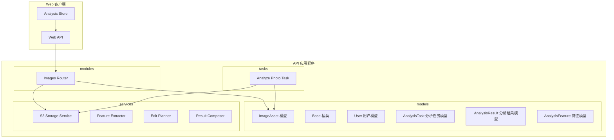
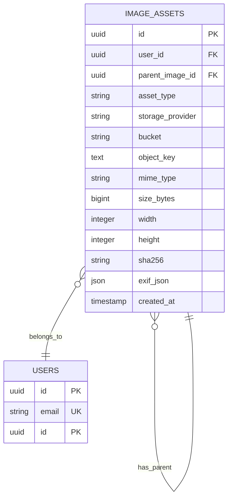
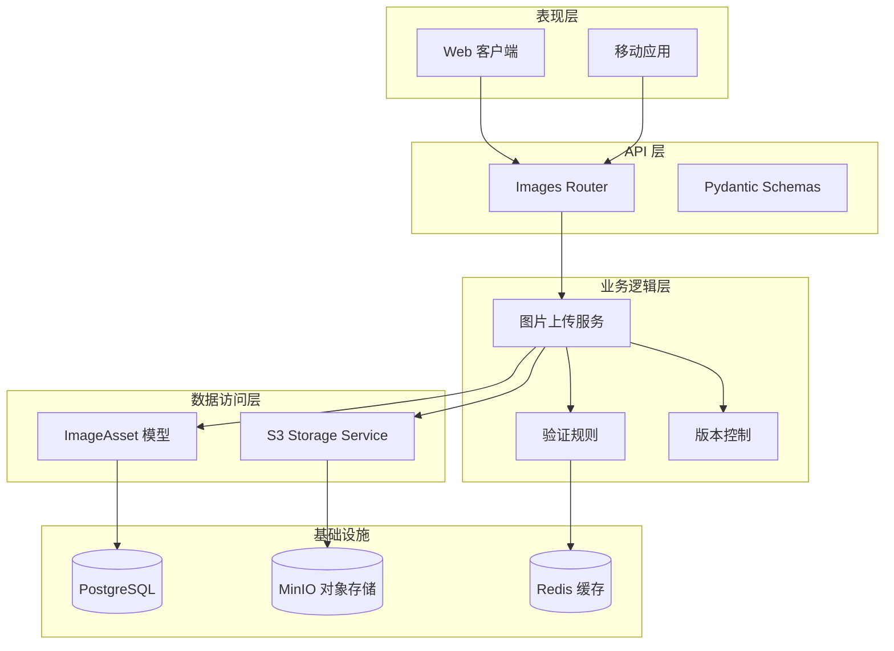
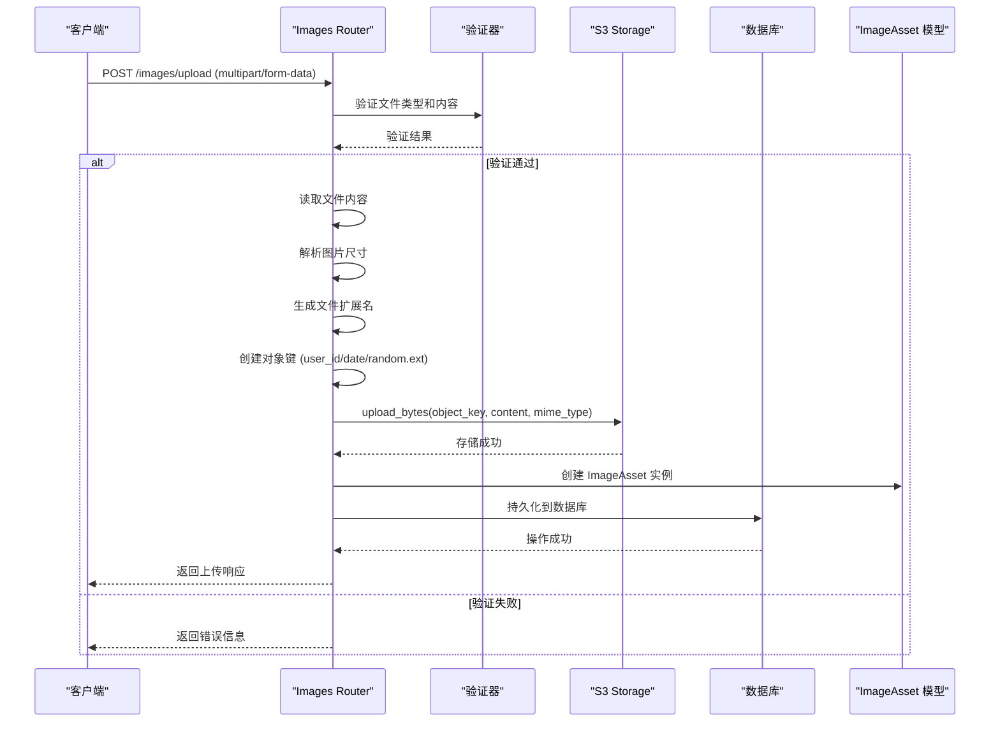
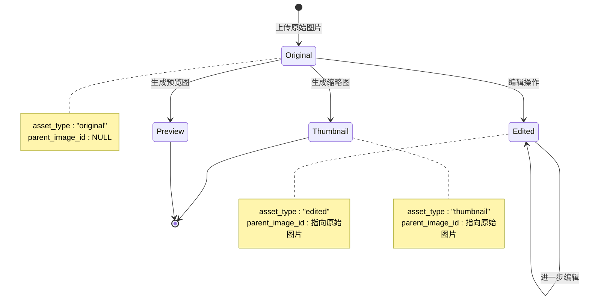
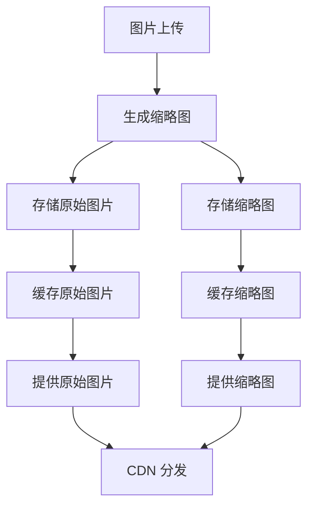
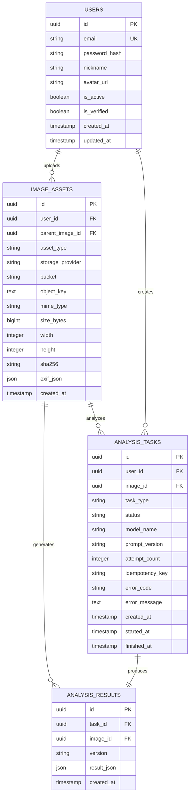
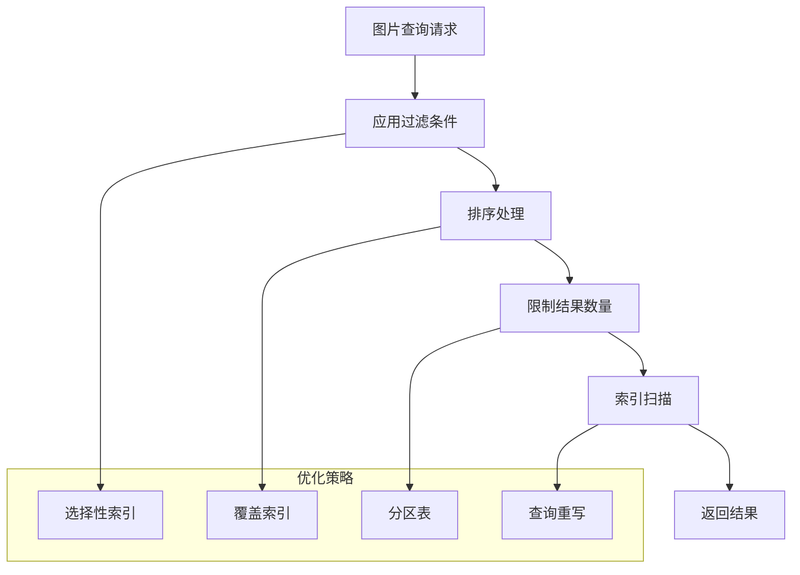
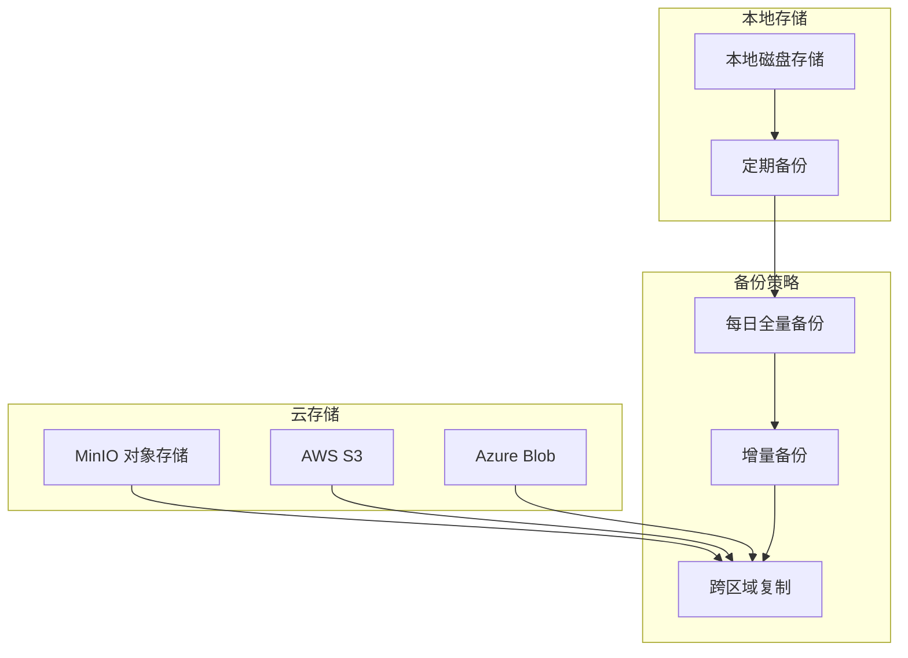
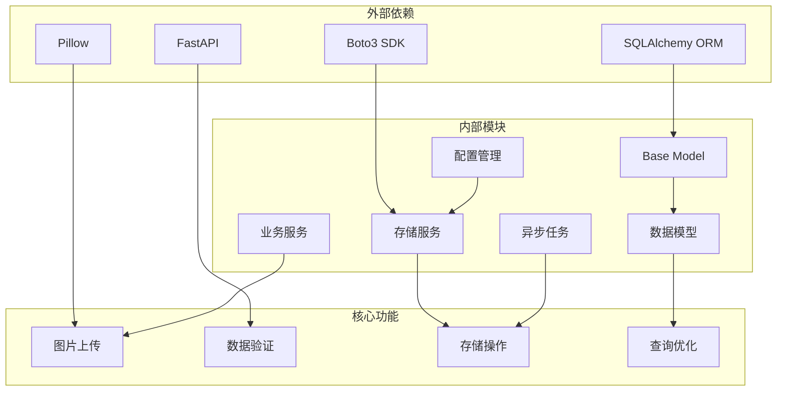

# 图片资源模型

<cite>
**本文档引用的文件**
- [apps/api/app/models/image_asset.py](file://apps/api/app/models/image_asset.py)
- [apps/api/app/schemas/image.py](file://apps/api/app/schemas/image.py)
- [apps/api/app/services/storage/s3_storage.py](file://apps/api/app/services/storage/s3_storage.py)
- [apps/api/app/modules/images/router.py](file://apps/api/app/modules/images/router.py)
- [apps/api/app/models/base.py](file://apps/api/app/models/base.py)
- [apps/api/app/models/user.py](file://apps/api/app/models/user.py)
- [apps/api/app/models/analysis_task.py](file://apps/api/app/models/analysis_task.py)
- [apps/api/app/models/analysis_result.py](file://apps/api/app/models/analysis_result.py)
- [apps/api/app/models/analysis_feature.py](file://apps/api/app/models/analysis_feature.py)
- [apps/api/app/core/config.py](file://apps/api/app/core/config.py)
- [apps/api/app/tasks/analyze_photo.py](file://apps/api/app/tasks/analyze_photo.py)
- [apps/api/app/services/composer/result_composer.py](file://apps/api/app/services/composer/result_composer.py)
- [apps/api/app/services/cv/feature_extractor.py](file://apps/api/app/services/cv/feature_extractor.py)
- [apps/api/app/services/rules/edit_planner.py](file://apps/api/app/services/rules/edit_planner.py)
- [apps/web/src/api/images.ts](file://apps/web/src/api/images.ts)
- [apps/web/src/stores/analysis.ts](file://apps/web/src/stores/analysis.ts)
- [docs/architecture-v2.md](file://docs/architecture-v2.md)
- [infra/docker-compose.yml](file://infra/docker-compose.yml)
</cite>

## 目录
1. [简介](#简介)
2. [项目结构](#项目结构)
3. [核心组件](#核心组件)
4. [架构概览](#架构概览)
5. [详细组件分析](#详细组件分析)
6. [依赖分析](#依赖分析)
7. [性能考虑](#性能考虑)
8. [故障排除指南](#故障排除指南)
9. [结论](#结论)
10. [附录](#附录)

## 简介

图片资源模型是 AI Photo Coach 系统中的核心数据模型，负责管理用户上传的图片资源及其相关信息。该模型不仅存储原始图片信息，还支持图片的派生版本（如缩略图、预览图、编辑后的图片），并通过与分析任务系统的集成，实现了完整的图片处理和分析工作流。

本模型基于 SQLAlchemy ORM 构建，采用 PostgreSQL 作为数据库存储，并使用 MinIO 作为对象存储服务。系统通过异步任务队列实现图片分析的后台处理，支持多步骤的图片特征提取、分析和编辑规划。

## 项目结构

图片资源模型位于 API 应用程序的核心模块中，采用清晰的分层架构：

**图表来源**
- [apps/api/app/models/image_asset.py:1-32](file://apps/api/app/models/image_asset.py#L1-L32)
- [apps/api/app/modules/images/router.py:1-77](file://apps/api/app/modules/images/router.py#L1-L77)
- [apps/api/app/services/storage/s3_storage.py:1-59](file://apps/api/app/services/storage/s3_storage.py#L1-L59)

**章节来源**
- [apps/api/app/models/image_asset.py:1-32](file://apps/api/app/models/image_asset.py#L1-L32)
- [apps/api/app/models/base.py:1-5](file://apps/api/app/models/base.py#L1-L5)
- [apps/api/app/modules/images/router.py:1-77](file://apps/api/app/modules/images/router.py#L1-L77)

## 核心组件

### ImageAsset 实体模型

ImageAsset 是图片资源模型的核心实体，负责存储所有与图片相关的元数据和属性信息。

#### 字段定义

| 字段名称 | 类型 | 约束 | 默认值 | 描述 |
|---------|------|------|--------|------|
| id | UUID | 主键 | 自动生成 | 图片资产唯一标识符 |
| user_id | UUID | 外键(users.id) | 必填 | 关联的用户标识符 |
| parent_image_id | UUID | 外键(image_assets.id) | 可空 | 父图片资产标识符，支持版本链 |
| asset_type | String(16) | | "original" | 资产类型：original/preview/edited/thumbnail |
| storage_provider | String(16) | | "minio" | 存储提供商：minio/aws_s3等 |
| bucket | String(128) | | 必填 | 对象存储桶名称 |
| object_key | Text | | 必填 | 对象存储中的文件键 |
| mime_type | String(64) | | 必填 | 文件 MIME 类型 |
| size_bytes | BigInteger | | 必填 | 文件大小（字节） |
| width | Integer | | 可空 | 图片宽度（像素） |
| height | Integer | | 可空 | 图片高度（像素） |
| sha256 | String(64) | | 可空 | 文件 SHA256 哈希值 |
| exif_json | JSON | | 可空 | EXIF 元数据 |
| created_at | DateTime | | 当前时间 | 创建时间戳 |

#### 关系映射

**图表来源**
- [apps/api/app/models/image_asset.py:10-32](file://apps/api/app/models/image_asset.py#L10-L32)
- [apps/api/app/models/user.py:12-28](file://apps/api/app/models/user.py#L12-L28)

**章节来源**
- [apps/api/app/models/image_asset.py:10-32](file://apps/api/app/models/image_asset.py#L10-L32)
- [apps/api/app/models/base.py:1-5](file://apps/api/app/models/base.py#L1-5)

### 数据库约束

系统实现了以下数据库约束以确保数据完整性：

1. **唯一约束**：`(bucket, object_key)` 组合唯一，防止重复存储相同路径的文件
2. **外键约束**：
   - `user_id` → `users.id` (级联删除)
   - `parent_image_id` → `image_assets.id` (设置为空)
3. **索引策略**：
   - 分析任务表：`(user_id, created_at)` 和 `(status, created_at)`
   - 分析结果表：基于 JSON 字段的 GIN 索引
   - 分析特征表：基于 JSON 字段的 GIN 索引

**章节来源**
- [apps/api/app/models/image_asset.py:12](file://apps/api/app/models/image_asset.py#L12)
- [apps/api/app/models/analysis_task.py:32-35](file://apps/api/app/models/analysis_task.py#L32-L35)
- [apps/api/app/models/analysis_result.py:24-27](file://apps/api/app/models/analysis_result.py#L24-L27)
- [apps/api/app/models/analysis_feature.py:24-27](file://apps/api/app/models/analysis_feature.py#L24-L27)

## 架构概览

图片资源系统采用分层架构设计，实现了清晰的关注点分离：

**图表来源**
- [apps/api/app/modules/images/router.py:20-77](file://apps/api/app/modules/images/router.py#L20-L77)
- [apps/api/app/services/storage/s3_storage.py:11-59](file://apps/api/app/services/storage/s3_storage.py#L11-L59)
- [apps/api/app/models/image_asset.py:10-32](file://apps/api/app/models/image_asset.py#L10-L32)

## 详细组件分析

### 图片上传和存储流程

图片上传流程是一个完整的端到端处理管道，从客户端上传到最终存储完成：

**图表来源**
- [apps/api/app/modules/images/router.py:20-77](file://apps/api/app/modules/images/router.py#L20-L77)
- [apps/api/app/services/storage/s3_storage.py:34-43](file://apps/api/app/services/storage/s3_storage.py#L34-L43)

#### 上传流程详细步骤

1. **文件验证**：检查 MIME 类型是否以 "image/" 开头
2. **内容读取**：异步读取文件二进制内容
3. **图片解析**：使用 PIL 验证图片有效性并获取尺寸
4. **命名策略**：基于用户 ID、日期和随机 UUID 生成对象键
5. **哈希计算**：计算 SHA256 哈希值用于完整性校验
6. **存储操作**：上传到 MinIO 对象存储
7. **元数据记录**：创建 ImageAsset 记录包含所有元数据
8. **响应返回**：返回标准化的上传响应

**章节来源**
- [apps/api/app/modules/images/router.py:20-77](file://apps/api/app/modules/images/router.py#L20-L77)

### 图片状态管理和版本控制

系统支持完整的图片版本控制机制，通过 `parent_image_id` 字段建立版本链：

**图表来源**
- [apps/api/app/models/image_asset.py:21-22](file://apps/api/app/models/image_asset.py#L21-L22)
- [apps/api/app/models/image_asset.py:18-19](file://apps/api/app/models/image_asset.py#L18-L19)

#### 版本控制策略

1. **原始版本**：用户上传的原始图片，`parent_image_id` 为 NULL
2. **派生版本**：基于原始版本生成的缩略图、预览图或编辑后的图片
3. **版本追踪**：通过 `parent_image_id` 建立完整的版本关系链
4. **类型标识**：使用 `asset_type` 字段区分不同类型的图片版本

**章节来源**
- [apps/api/app/models/image_asset.py:18-22](file://apps/api/app/models/image_asset.py#L18-L22)

### 图片验证规则和安全检查

系统实施了多层次的安全验证和质量控制：

#### 文件类型验证
- 严格检查 MIME 类型必须以 "image/" 开头
- 使用 PIL 的 Image.open 进行二次验证
- 支持常见的图片格式：JPEG、PNG、WEBP、GIF 等

#### 内容安全检查
- 空文件检查，防止恶意上传
- 文件大小限制（通过数据库字段约束）
- 内容完整性验证（SHA256 哈希）

#### 访问控制
- 基于用户 ID 的权限验证
- 对象存储访问密钥管理
- 防止跨用户文件访问

**章节来源**
- [apps/api/app/modules/images/router.py:26-37](file://apps/api/app/modules/images/router.py#L26-L37)

### 图片缩略图生成和缓存策略

虽然当前实现主要处理原始图片上传，但系统已为缩略图功能预留了完整的架构支持：

#### 缓存架构

**图表来源**
- [docs/architecture-v2.md:120-148](file://docs/architecture-v2.md#L120-L148)

#### 缓存策略
1. **多级缓存**：内存缓存 + Redis 缓存 + CDN 缓存
2. **智能过期**：根据访问频率设置不同的缓存过期时间
3. **预热机制**：热门图片提前生成和缓存
4. **失效策略**：基于版本控制的智能缓存失效

### 图片模型与用户和分析任务的关联关系

图片资源模型与用户和分析任务系统建立了紧密的关联关系：

**图表来源**
- [apps/api/app/models/user.py:12-28](file://apps/api/app/models/user.py#L12-L28)
- [apps/api/app/models/image_asset.py:10-32](file://apps/api/app/models/image_asset.py#L10-L32)
- [apps/api/app/models/analysis_task.py:10-36](file://apps/api/app/models/analysis_task.py#L10-L36)
- [apps/api/app/models/analysis_result.py:10-28](file://apps/api/app/models/analysis_result.py#L10-L28)

#### 关联关系说明

1. **用户-图片**：一对多关系，用户可以拥有多个图片资产
2. **图片-分析任务**：一对多关系，单张图片可以有多个分析任务
3. **图片-分析结果**：一对多关系，单张图片可以产生多个分析结果
4. **任务-结果**：一对一关系，每个分析任务对应唯一的分析结果

**章节来源**
- [apps/api/app/models/user.py:12-28](file://apps/api/app/models/user.py#L12-L28)
- [apps/api/app/models/analysis_task.py:14-19](file://apps/api/app/models/analysis_task.py#L14-L19)
- [apps/api/app/models/analysis_result.py:14-19](file://apps/api/app/models/analysis_result.py#L14-L19)

### 图片数据的查询优化和索引策略

系统采用了多种查询优化技术来提升图片数据的检索效率：

#### 索引策略

1. **分析任务表索引**：
   - `(user_id, created_at)`：按用户查询历史任务
   - `(status, created_at)`：按状态筛选任务

2. **分析结果表索引**：
   - 基于 `result_json` 字段的 GIN 索引：支持 JSON 查询
   - `(image_id, created_at)`：按图片查询分析结果

3. **分析特征表索引**：
   - 基于 `feature_json` 字段的 GIN 索引：支持复杂特征查询
   - `(image_id, created_at)`：按图片查询特征数据

#### 查询优化技术

**图表来源**
- [apps/api/app/models/analysis_task.py:32-35](file://apps/api/app/models/analysis_task.py#L32-L35)
- [apps/api/app/models/analysis_result.py:24-27](file://apps/api/app/models/analysis_result.py#L24-L27)
- [apps/api/app/models/analysis_feature.py:24-27](file://apps/api/app/models/analysis_feature.py#L24-L27)

**章节来源**
- [apps/api/app/models/analysis_task.py:32-35](file://apps/api/app/models/analysis_task.py#L32-L35)
- [apps/api/app/models/analysis_result.py:24-27](file://apps/api/app/models/analysis_result.py#L24-L27)
- [apps/api/app/models/analysis_feature.py:24-27](file://apps/api/app/models/analysis_feature.py#L24-L27)

### 图片存储的备份和恢复机制

系统采用分布式存储架构，具备完善的备份和恢复能力：

#### 存储架构

**图表来源**
- [infra/docker-compose.yml:32-48](file://infra/docker-compose.yml#L32-L48)
- [apps/api/app/core/config.py:16-20](file://apps/api/app/core/config.py#L16-L20)

#### 备份策略

1. **数据备份**：
   - PostgreSQL 数据库：支持全量和增量备份
   - MinIO 对象存储：支持快照和版本控制
   - 自动备份到多个地理位置

2. **灾难恢复**：
   - 多活数据中心部署
   - 自动故障转移机制
   - RPO/RTO 指标保障

3. **监控告警**：
   - 存储空间监控
   - 访问模式分析
   - 异常行为检测

**章节来源**
- [infra/docker-compose.yml:1-54](file://infra/docker-compose.yml#L1-L54)
- [apps/api/app/core/config.py:16-20](file://apps/api/app/core/config.py#L16-L20)

## 依赖分析

图片资源模型的依赖关系展现了清晰的分层架构：

**图表来源**
- [apps/api/app/models/image_asset.py:4-7](file://apps/api/app/models/image_asset.py#L4-L7)
- [apps/api/app/services/storage/s3_storage.py:3-8](file://apps/api/app/services/storage/s3_storage.py#L3-L8)
- [apps/api/app/modules/images/router.py:7-15](file://apps/api/app/modules/images/router.py#L7-L15)

### 依赖关系特点

1. **低耦合高内聚**：各模块职责明确，依赖关系清晰
2. **接口抽象**：通过抽象接口隔离具体实现细节
3. **可测试性**：良好的依赖注入支持单元测试
4. **可扩展性**：插件化架构支持功能扩展

**章节来源**
- [apps/api/app/models/image_asset.py:4-7](file://apps/api/app/models/image_asset.py#L4-L7)
- [apps/api/app/services/storage/s3_storage.py:3-8](file://apps/api/app/services/storage/s3_storage.py#L3-L8)
- [apps/api/app/modules/images/router.py:7-15](file://apps/api/app/modules/images/router.py#L7-L15)

## 性能考虑

### 存储性能优化

1. **对象存储优化**：
   - 使用分块上传支持大文件
   - 实现断点续传机制
   - 压缩存储减少带宽消耗

2. **数据库性能**：
   - 合理的索引设计避免全表扫描
   - 连接池管理提升并发性能
   - 查询缓存减少重复查询

### 计算性能优化

1. **异步处理**：
   - 图片分析任务异步执行
   - 缓存预热机制
   - 批量处理优化

2. **内存管理**：
   - 流式处理大文件
   - 及时释放临时资源
   - 内存池复用

## 故障排除指南

### 常见问题及解决方案

#### 存储连接问题
- **症状**：上传失败，返回 503 错误
- **原因**：MinIO 服务不可达
- **解决**：检查 Docker Compose 服务状态，确认网络连接

#### 数据库连接问题
- **症状**：查询超时，数据库连接失败
- **原因**：PostgreSQL 服务异常
- **解决**：重启数据库容器，检查连接池配置

#### 图片解析失败
- **症状**：图片无法识别，抛出 UnidentifiedImageError
- **原因**：文件损坏或格式不受支持
- **解决**：验证文件完整性，转换为支持格式

**章节来源**
- [apps/api/app/services/storage/s3_storage.py:23-32](file://apps/api/app/services/storage/s3_storage.py#L23-L32)
- [apps/api/app/modules/images/router.py:36-37](file://apps/api/app/modules/images/router.py#L36-L37)

## 结论

图片资源模型为 AI Photo Coach 系统提供了坚实的数据基础，通过精心设计的架构实现了以下关键特性：

1. **完整的生命周期管理**：从上传、存储到版本控制的全流程支持
2. **高性能的查询优化**：通过合理的索引策略和查询优化技术
3. **强大的扩展性**：模块化设计支持功能扩展和性能优化
4. **可靠的安全保障**：多层次的安全验证和访问控制机制
5. **完善的备份恢复**：分布式存储架构确保数据安全

该模型不仅满足了当前的功能需求，还为未来的功能扩展和技术演进奠定了良好的基础。

## 附录

### 配置参数说明

| 参数名称 | 默认值 | 描述 |
|---------|--------|------|
| s3_endpoint | http://localhost:9000 | MinIO 服务端点 |
| s3_access_key | minioadmin | 访问密钥 |
| s3_secret_key | minioadmin | 密钥 |
| s3_bucket | photo-images | 存储桶名称 |
| s3_region | us-east-1 | 区域设置 |

### API 接口规范

#### 图片上传接口
- **方法**：POST `/images/upload`
- **内容类型**：multipart/form-data
- **响应格式**：ImageUploadResponse

**章节来源**
- [apps/api/app/schemas/image.py:6-13](file://apps/api/app/schemas/image.py#L6-L13)
- [apps/web/src/api/images.ts:12-20](file://apps/web/src/api/images.ts#L12-L20)