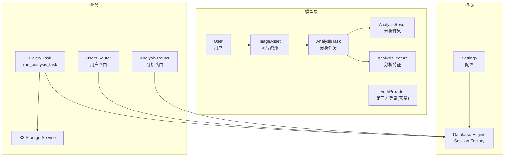
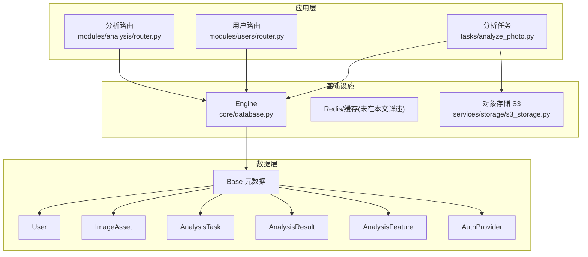
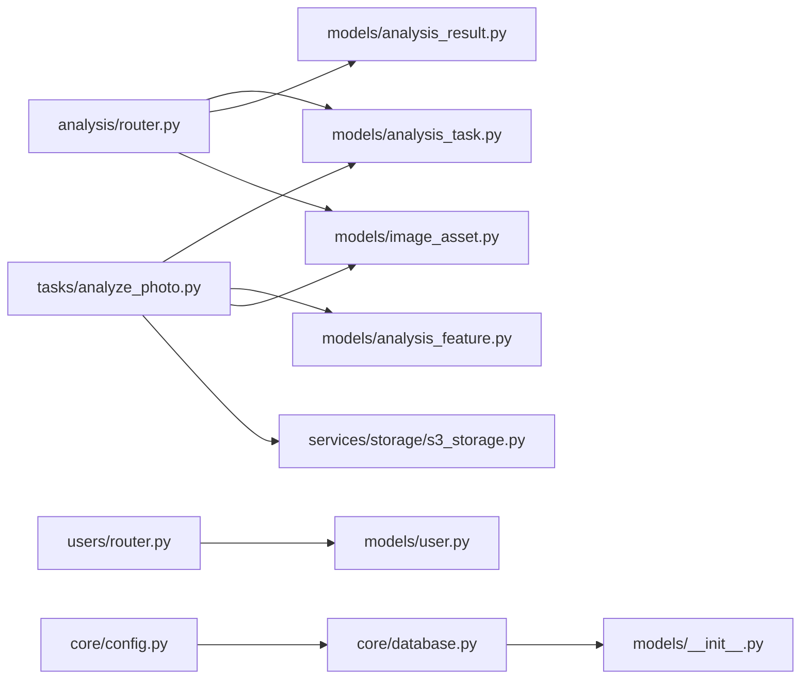

# 数据库设计

<cite>
**本文引用的文件**
- [apps/api/app/models/base.py](file://apps/api/app/models/base.py)
- [apps/api/app/models/user.py](file://apps/api/app/models/user.py)
- [apps/api/app/models/image_asset.py](file://apps/api/app/models/image_asset.py)
- [apps/api/app/models/analysis_task.py](file://apps/api/app/models/analysis_task.py)
- [apps/api/app/models/analysis_result.py](file://apps/api/app/models/analysis_result.py)
- [apps/api/app/models/analysis_feature.py](file://apps/api/app/models/analysis_feature.py)
- [apps/api/app/models/auth_provider.py](file://apps/api/app/models/auth_provider.py)
- [apps/api/app/models/__init__.py](file://apps/api/app/models/__init__.py)
- [apps/api/app/core/database.py](file://apps/api/app/core/database.py)
- [apps/api/app/core/config.py](file://apps/api/app/core/config.py)
- [apps/api/app/tasks/analyze_photo.py](file://apps/api/app/tasks/analyze_photo.py)
- [apps/api/app/modules/analysis/router.py](file://apps/api/app/modules/analysis/router.py)
- [apps/api/app/modules/users/router.py](file://apps/api/app/modules/users/router.py)
- [apps/api/app/services/storage/s3_storage.py](file://apps/api/app/services/storage/s3_storage.py)
</cite>

## 目录
1. [简介](#简介)
2. [项目结构](#项目结构)
3. [核心组件](#核心组件)
4. [架构总览](#架构总览)
5. [详细组件分析](#详细组件分析)
6. [依赖分析](#依赖分析)
7. [性能考虑](#性能考虑)
8. [故障排查指南](#故障排查指南)
9. [结论](#结论)
10. [附录](#附录)

## 简介
本文件面向“AI摄影教练”项目的数据库设计，基于 SQLAlchemy ORM 模型与实际业务流程，系统化梳理 ER 模型、字段定义、约束与索引策略、表间关系与外键约束、数据访问模式与 ORM 使用方式、数据与业务规则、迁移策略与版本管理，以及性能优化与查询技巧。目标是帮助开发者与运维人员快速理解并高效维护数据库层。

## 项目结构
数据库相关代码集中在后端 API 应用中，采用“按领域分层 + 按模块划分”的组织方式：
- 模型层：位于 app/models，定义用户、图片资源、分析任务、分析结果、分析特征等核心实体及其字段、约束与索引。
- 核心配置与连接：位于 app/core，包含数据库引擎、会话工厂、初始化与增量迁移逻辑。
- 业务路由与任务：位于 app/modules 与 app/tasks，体现典型的数据访问模式与工作流。
- 存储服务：位于 app/services/storage，负责对象存储交互。



图表来源
- [apps/api/app/models/user.py:12-28](file://apps/api/app/models/user.py#L12-L28)
- [apps/api/app/models/image_asset.py:10-32](file://apps/api/app/models/image_asset.py#L10-L32)
- [apps/api/app/models/analysis_task.py:10-36](file://apps/api/app/models/analysis_task.py#L10-L36)
- [apps/api/app/models/analysis_result.py:10-28](file://apps/api/app/models/analysis_result.py#L10-L28)
- [apps/api/app/models/analysis_feature.py:10-29](file://apps/api/app/models/analysis_feature.py#L10-L29)
- [apps/api/app/core/database.py:9-25](file://apps/api/app/core/database.py#L9-L25)
- [apps/api/app/core/config.py:13](file://apps/api/app/core/config.py#L13)
- [apps/api/app/modules/analysis/router.py:24](file://apps/api/app/modules/analysis/router.py#L24)
- [apps/api/app/modules/users/router.py:13](file://apps/api/app/modules/users/router.py#L13)
- [apps/api/app/tasks/analyze_photo.py:19-108](file://apps/api/app/tasks/analyze_photo.py#L19-L108)
- [apps/api/app/services/storage/s3_storage.py:11-59](file://apps/api/app/services/storage/s3_storage.py#L11-L59)

章节来源
- [apps/api/app/models/base.py:1-5](file://apps/api/app/models/base.py#L1-L5)
- [apps/api/app/models/__init__.py:1-9](file://apps/api/app/models/__init__.py#L1-L9)
- [apps/api/app/core/database.py:9-25](file://apps/api/app/core/database.py#L9-L25)
- [apps/api/app/core/config.py:13](file://apps/api/app/core/config.py#L13)

## 核心组件
本节对核心实体进行逐项说明，涵盖字段、数据类型、约束与索引策略，并给出业务含义与使用建议。

- 用户(User)
  - 字段与类型
    - id: 主键，UUID
    - email: 唯一、非空、字符串
    - password_hash: 可空、字符串（OAuth用户可为空）
    - nickname: 可空、字符串
    - avatar_url: 可空、字符串
    - is_active: 布尔，默认真
    - is_verified: 布尔，默认假
    - created_at: 时间戳，默认服务器时间
    - updated_at: 时间戳，可空
  - 约束与索引
    - email 唯一
    - updated_at 可空，用于审计更新时间
  - 业务规则
    - OAuth用户允许无密码；普通用户需有密码哈希
    - is_active 控制账户可用性；is_verified 标识邮箱/身份验证状态

- 图片资源(ImageAsset)
  - 字段与类型
    - id: 主键，UUID
    - user_id: 外键(users.id)，级联删除
    - parent_image_id: 外键(image_assets.id)，删除时设为空
    - asset_type: 字符串，缺省“original”
    - storage_provider: 字符串，缺省“minio”
    - bucket: 字符串
    - object_key: 文本
    - mime_type: 字符串
    - size_bytes: 整数
    - width/height: 可空整数
    - sha256: 可空字符串
    - exif_json: JSON，可空
    - created_at: 时间戳
  - 约束与索引
    - 唯一约束：(bucket, object_key)
    - 外键：user_id → users.id（CASCADE）
    - 外键：parent_image_id → image_assets.id（SET NULL）
  - 业务规则
    - 同一桶内对象键唯一
    - 支持原图与派生图的父子关系
    - EXIF与元信息以JSON存储

- 分析任务(AnalysisTask)
  - 字段与类型
    - id: 主键，UUID
    - user_id: 外键(users.id)，级联删除
    - image_id: 外键(image_assets.id)，级联删除
    - task_type: 字符串，缺省“ANALYZE”
    - status: 字符串，缺省“PENDING”
    - model_name: 字符串
    - prompt_version: 字符串
    - attempt_count: 整数，默认0
    - idempotency_key: 可空字符串
    - error_code/error_message: 可空
    - created_at/started_at/finished_at: 时间戳
  - 约束与索引
    - user_id + created_at 组合索引
    - status + created_at 组合索引
    - user_id + image_id + created_at 组合索引（建议）
  - 业务规则
    - 任务状态机：PENDING → RUNNING → SUCCEEDED/FAILED
    - 幂等键用于去重提交
    - 记录尝试次数与错误信息

- 分析结果(AnalysisResult)
  - 字段与类型
    - id: 主键，UUID
    - task_id: 外键(analysis_tasks.id)，级联删除，唯一
    - image_id: 外键(image_assets.id)，级联删除
    - version: 字符串，缺省“1.1”
    - result_json: JSON，非空
    - created_at: 时间戳
  - 约束与索引
    - image_id + created_at 组合索引
    - result_json 列上 GIN 索引（PostgreSQL）
  - 业务规则
    - 一对一对应任务结果
    - JSON中包含结构化建议与摘要

- 分析特征(AnalysisFeature)
  - 字段与类型
    - id: 主键，UUID
    - task_id: 外键(analysis_tasks.id)，级联删除，唯一
    - image_id: 外键(image_assets.id)，级联删除
    - version: 字符串，缺省“1.0”
    - feature_json: JSON，非空
    - created_at: 时间戳
  - 约束与索引
    - image_id + created_at 组合索引
    - feature_json 列上 GIN 索引（PostgreSQL）
  - 业务规则
    - 与任务一一对应，存储计算机视觉提取的特征向量或统计特征

- 第三方登录(AuthProvider，预留)
  - 字段与类型
    - id: 主键，UUID
    - user_id: 外键(users.id)，索引
    - provider: 字符串（如 google/github/wechat）
    - provider_user_id: 字符串
    - access_token: 可空
    - created_at: 时间戳
  - 约束与索引
    - user_id 索引
  - 业务规则
    - 为未来OAuth集成预留

章节来源
- [apps/api/app/models/user.py:12-28](file://apps/api/app/models/user.py#L12-L28)
- [apps/api/app/models/image_asset.py:10-32](file://apps/api/app/models/image_asset.py#L10-L32)
- [apps/api/app/models/analysis_task.py:10-36](file://apps/api/app/models/analysis_task.py#L10-L36)
- [apps/api/app/models/analysis_result.py:10-28](file://apps/api/app/models/analysis_result.py#L10-L28)
- [apps/api/app/models/analysis_feature.py:10-29](file://apps/api/app/models/analysis_feature.py#L10-L29)
- [apps/api/app/models/auth_provider.py:12-24](file://apps/api/app/models/auth_provider.py#L12-L24)

## 架构总览
下图展示数据库层在整体系统中的位置与交互关系，包括模型定义、会话管理、业务路由与任务执行、以及对象存储服务。



图表来源
- [apps/api/app/modules/analysis/router.py:24](file://apps/api/app/modules/analysis/router.py#L24)
- [apps/api/app/modules/users/router.py:13](file://apps/api/app/modules/users/router.py#L13)
- [apps/api/app/tasks/analyze_photo.py:19-108](file://apps/api/app/tasks/analyze_photo.py#L19-L108)
- [apps/api/app/core/database.py:9-25](file://apps/api/app/core/database.py#L9-L25)
- [apps/api/app/services/storage/s3_storage.py:11-59](file://apps/api/app/services/storage/s3_storage.py#L11-L59)

## 详细组件分析

### 实体关系图(ER)
```mermaid
erDiagram
USERS {
uuid id PK
string email UK
string password_hash
string nickname
string avatar_url
boolean is_active
boolean is_verified
timestamptz created_at
timestamptz updated_at
}
IMAGE_ASSETS {
uuid id PK
uuid user_id FK
uuid parent_image_id FK
string asset_type
string storage_provider
string bucket
text object_key
string mime_type
bigint size_bytes
int width
int height
string sha256
jsonb exif_json
timestamptz created_at
}
ANALYSIS_TASKS {
uuid id PK
uuid user_id FK
uuid image_id FK
string task_type
string status
string model_name
string prompt_version
int attempt_count
string idempotency_key
string error_code
text error_message
timestamptz created_at
timestamptz started_at
timestamptz finished_at
}
ANALYSIS_RESULTS {
uuid id PK
uuid task_id FK UK
uuid image_id FK
string version
jsonb result_json
timestamptz created_at
}
ANALYSIS_FEATURES {
uuid id PK
uuid task_id FK UK
uuid image_id FK
string version
jsonb feature_json
timestamptz created_at
}
AUTH_PROVIDERS {
uuid id PK
uuid user_id FK I
string provider
string provider_user_id
string access_token
timestamptz created_at
}
USERS ||--o{ IMAGE_ASSETS : "拥有"
IMAGE_ASSETS ||--o{ ANALYSIS_TASKS : "被分析"
IMAGE_ASSETS ||--o{ ANALYSIS_RESULTS : "产生结果"
IMAGE_ASSETS ||--o{ ANALYSIS_FEATURES : "产生特征"
ANALYSIS_TASKS ||--|| ANALYSIS_RESULTS : "生成"
ANALYSIS_TASKS ||--|| ANALYSIS_FEATURES : "生成"
USERS ||--o{ AUTH_PROVIDERS : "绑定"
```

图表来源
- [apps/api/app/models/user.py:12-28](file://apps/api/app/models/user.py#L12-L28)
- [apps/api/app/models/image_asset.py:10-32](file://apps/api/app/models/image_asset.py#L10-L32)
- [apps/api/app/models/analysis_task.py:10-36](file://apps/api/app/models/analysis_task.py#L10-L36)
- [apps/api/app/models/analysis_result.py:10-28](file://apps/api/app/models/analysis_result.py#L10-L28)
- [apps/api/app/models/analysis_feature.py:10-29](file://apps/api/app/models/analysis_feature.py#L10-L29)
- [apps/api/app/models/auth_provider.py:12-24](file://apps/api/app/models/auth_provider.py#L12-L24)

章节来源
- [apps/api/app/models/user.py:12-28](file://apps/api/app/models/user.py#L12-L28)
- [apps/api/app/models/image_asset.py:10-32](file://apps/api/app/models/image_asset.py#L10-L32)
- [apps/api/app/models/analysis_task.py:10-36](file://apps/api/app/models/analysis_task.py#L10-L36)
- [apps/api/app/models/analysis_result.py:10-28](file://apps/api/app/models/analysis_result.py#L10-L28)
- [apps/api/app/models/analysis_feature.py:10-29](file://apps/api/app/models/analysis_feature.py#L10-L29)
- [apps/api/app/models/auth_provider.py:12-24](file://apps/api/app/models/auth_provider.py#L12-L24)

### 关系映射与外键约束
- 用户与图片资源：一对多；删除用户级联删除其图片。
- 图片资源自引用：父子关系，支持原图与派生图；删除父图时设为空。
- 任务与用户/图片：多对一；删除用户或图片时级联删除任务。
- 任务与结果/特征：一对一；通过 task_id 建立一对一映射，且该列唯一。

章节来源
- [apps/api/app/models/image_asset.py:15-20](file://apps/api/app/models/image_asset.py#L15-L20)
- [apps/api/app/models/analysis_task.py:14-19](file://apps/api/app/models/analysis_task.py#L14-L19)
- [apps/api/app/models/analysis_result.py:14-16](file://apps/api/app/models/analysis_result.py#L14-L16)
- [apps/api/app/models/analysis_feature.py:14-16](file://apps/api/app/models/analysis_feature.py#L14-L16)

### 数据访问模式与ORM使用示例
- 会话与初始化
  - 引擎与会话工厂在核心模块中创建，提供依赖注入式 get_db。
  - 初始化时创建所有表并应用开发期增量更新。
- 路由中的典型读写
  - 创建分析任务：校验图片归属，写入 AnalysisTask，触发 Celery 任务。
  - 查询历史与详情：按用户维度过滤，关联 AnalysisResult 获取结果。
- 任务执行中的读写
  - 从 S3 下载图片字节，调用特征提取与LLM分析，写入 AnalysisFeature 与 AnalysisResult。
  - 使用 select + scalar_one_or_none 实现幂等更新或插入。

章节来源
- [apps/api/app/core/database.py:9-25](file://apps/api/app/core/database.py#L9-L25)
- [apps/api/app/modules/analysis/router.py:45-74](file://apps/api/app/modules/analysis/router.py#L45-L74)
- [apps/api/app/modules/analysis/router.py:76-89](file://apps/api/app/modules/analysis/router.py#L76-L89)
- [apps/api/app/modules/analysis/router.py:92-125](file://apps/api/app/modules/analysis/router.py#L92-L125)
- [apps/api/app/tasks/analyze_photo.py:19-108](file://apps/api/app/tasks/analyze_photo.py#L19-L108)

### 数据验证与业务规则
- 用户
  - OAuth账户可无密码；修改密码前需验证当前密码。
- 图片资源
  - 同桶内对象键唯一；EXIF以JSON存储；支持宽高与哈希。
- 分析任务
  - 状态机：PENDING → RUNNING → SUCCEEDED/FAILED；失败时记录错误码与消息。
  - 幂等键避免重复提交；记录尝试次数。
- 分析结果/特征
  - JSON字段结构化存储；版本号用于兼容升级。
- 第三方登录
  - 预留表，暂不启用。

章节来源
- [apps/api/app/modules/users/router.py:51-71](file://apps/api/app/modules/users/router.py#L51-L71)
- [apps/api/app/models/analysis_task.py:20-30](file://apps/api/app/models/analysis_task.py#L20-L30)
- [apps/api/app/models/analysis_result.py:20-22](file://apps/api/app/models/analysis_result.py#L20-L22)
- [apps/api/app/models/analysis_feature.py:20-22](file://apps/api/app/models/analysis_feature.py#L20-L22)
- [apps/api/app/models/auth_provider.py:12-24](file://apps/api/app/models/auth_provider.py#L12-L24)

### 数据库迁移策略与版本管理
- 初始化
  - 创建所有表：init_db 调用 create_all。
- 开发期增量更新
  - 通过 apply_dev_schema_updates 执行 ALTER/CREATE 语句，确保新增列、索引与默认值一致。
- 生产迁移建议
  - 将增量更新脚本化，按版本号顺序执行，记录迁移日志。
  - 对大表变更采用“影子表+切换”或在线DDL工具，降低停机风险。

章节来源
- [apps/api/app/core/database.py:21-51](file://apps/api/app/core/database.py#L21-L51)

## 依赖分析
- 模块耦合
  - 路由依赖数据库会话与当前用户上下文，间接依赖模型层。
  - Celery任务直接依赖模型与存储服务，形成跨进程数据一致性挑战。
- 外部依赖
  - PostgreSQL（GIN索引）、Redis（未在本文详述）、MinIO/S3（对象存储）。
- 循环依赖
  - 模型导入通过 __init__.py 聚合，避免循环导入问题。



图表来源
- [apps/api/app/modules/analysis/router.py:24](file://apps/api/app/modules/analysis/router.py#L24)
- [apps/api/app/modules/users/router.py:13](file://apps/api/app/modules/users/router.py#L13)
- [apps/api/app/tasks/analyze_photo.py:19-108](file://apps/api/app/tasks/analyze_photo.py#L19-L108)
- [apps/api/app/core/database.py:9-25](file://apps/api/app/core/database.py#L9-L25)
- [apps/api/app/core/config.py:13](file://apps/api/app/core/config.py#L13)
- [apps/api/app/models/__init__.py:1-9](file://apps/api/app/models/__init__.py#L1-L9)

章节来源
- [apps/api/app/models/__init__.py:1-9](file://apps/api/app/models/__init__.py#L1-L9)
- [apps/api/app/core/database.py:9-25](file://apps/api/app/core/database.py#L9-L25)

## 性能考虑
- 索引策略
  - AnalysisTask：user_id+created_at、status+created_at、建议增加 task_type+created_at。
  - AnalysisResult/AnalysisFeature：image_id+created_at、JSON列 GIN 索引。
  - ImageAsset：(bucket, object_key) 唯一索引。
- 查询优化
  - 使用组合索引覆盖常见过滤条件（用户、状态、时间）。
  - JSON字段查询尽量限定键路径，减少全表扫描。
- 写入优化
  - 批量插入与幂等更新（存在即更新），减少重复写入。
  - 对象存储上传/下载设置超时与重试策略，避免阻塞数据库事务。
- 缓存与异步
  - 结果与特征可结合Redis做短期缓存，减轻数据库压力。
  - 任务执行异步化，避免请求线程阻塞。

章节来源
- [apps/api/app/models/analysis_task.py:32-36](file://apps/api/app/models/analysis_task.py#L32-L36)
- [apps/api/app/models/analysis_result.py:24-28](file://apps/api/app/models/analysis_result.py#L24-L28)
- [apps/api/app/models/analysis_feature.py:24-28](file://apps/api/app/models/analysis_feature.py#L24-L28)
- [apps/api/app/models/image_asset.py:12](file://apps/api/app/models/image_asset.py#L12)
- [apps/api/app/services/storage/s3_storage.py:13-20](file://apps/api/app/services/storage/s3_storage.py#L13-L20)

## 故障排查指南
- 任务失败
  - 检查 AnalysisTask 的 error_code 与 error_message 字段，定位异常类型与消息。
  - 确认对象存储可用性与权限，必要时重试。
- 权限与可见性
  - 路由层已按用户维度校验图片与任务归属，若出现403，请检查当前用户与资源归属。
- 数据一致性
  - 任务执行中采用事务包裹，异常回滚并更新任务状态；若发现状态异常，可手动重试任务。
- 迁移问题
  - 若出现列缺失或索引不存在，确认 apply_dev_schema_updates 是否执行成功。

章节来源
- [apps/api/app/modules/analysis/router.py:128-151](file://apps/api/app/modules/analysis/router.py#L128-L151)
- [apps/api/app/tasks/analyze_photo.py:97-107](file://apps/api/app/tasks/analyze_photo.py#L97-L107)
- [apps/api/app/modules/analysis/router.py:52-56](file://apps/api/app/modules/analysis/router.py#L52-L56)
- [apps/api/app/core/database.py:28-51](file://apps/api/app/core/database.py#L28-L51)

## 结论
本数据库设计围绕用户、图片资源、分析任务、结果与特征构建清晰的ER模型，配合合理的索引与约束保障性能与一致性。通过路由与任务层的典型数据访问模式，实现了从提交任务到异步分析再到结果查询的完整闭环。建议在生产环境中进一步完善迁移脚本、监控与缓存策略，持续优化查询与写入性能。

## 附录
- 配置要点
  - 数据库URL在配置中集中管理，便于不同环境切换。
- 版本与兼容
  - 结果与特征均带版本号字段，便于后续演进与回溯。

章节来源
- [apps/api/app/core/config.py:13](file://apps/api/app/core/config.py#L13)
- [apps/api/app/models/analysis_result.py:20](file://apps/api/app/models/analysis_result.py#L20)
- [apps/api/app/models/analysis_feature.py:20](file://apps/api/app/models/analysis_feature.py#L20)