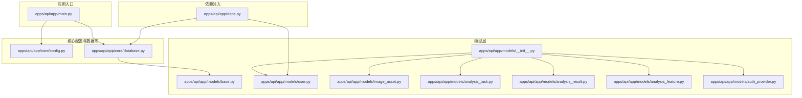
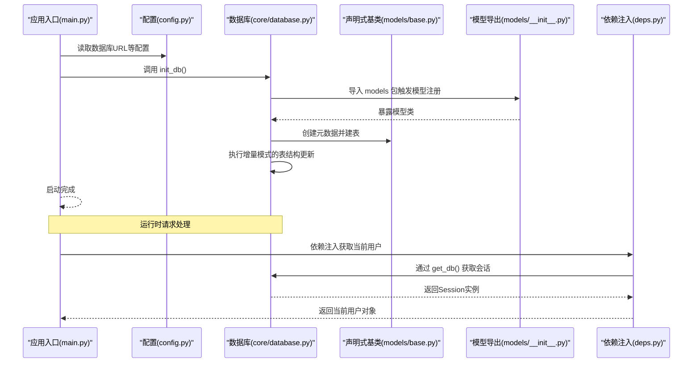
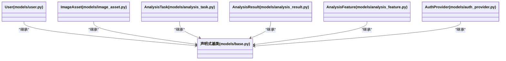
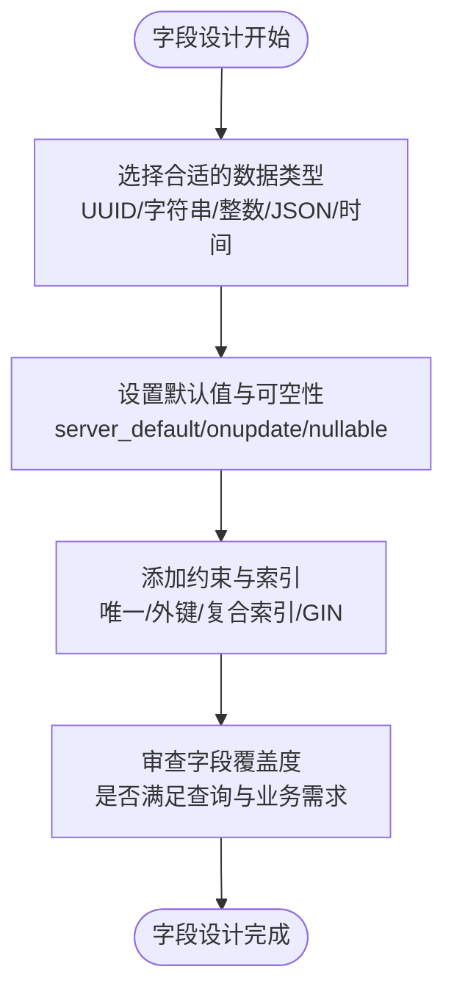
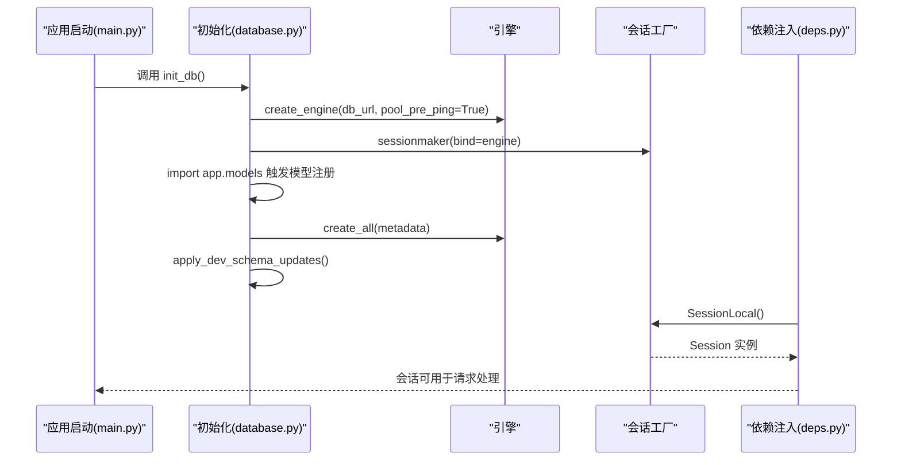
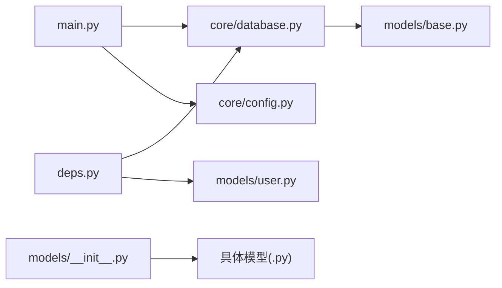

# 数据模型概览

<cite>
**本文引用的文件**
- [apps/api/app/models/base.py](file://apps/api/app/models/base.py)
- [apps/api/app/models/__init__.py](file://apps/api/app/models/__init__.py)
- [apps/api/app/core/database.py](file://apps/api/app/core/database.py)
- [apps/api/app/core/config.py](file://apps/api/app/core/config.py)
- [apps/api/app/main.py](file://apps/api/app/main.py)
- [apps/api/app/deps.py](file://apps/api/app/deps.py)
- [apps/api/app/models/user.py](file://apps/api/app/models/user.py)
- [apps/api/app/models/image_asset.py](file://apps/api/app/models/image_asset.py)
- [apps/api/app/models/analysis_task.py](file://apps/api/app/models/analysis_task.py)
- [apps/api/app/models/analysis_result.py](file://apps/api/app/models/analysis_result.py)
- [apps/api/app/models/analysis_feature.py](file://apps/api/app/models/analysis_feature.py)
- [apps/api/app/models/auth_provider.py](file://apps/api/app/models/auth_provider.py)
</cite>

## 目录
1. [简介](#简介)
2. [项目结构](#项目结构)
3. [核心组件](#核心组件)
4. [架构总览](#架构总览)
5. [详细组件分析](#详细组件分析)
6. [依赖分析](#依赖分析)
7. [性能考虑](#性能考虑)
8. [故障排查指南](#故障排查指南)
9. [结论](#结论)
10. [附录](#附录)

## 简介
本文件面向“AI摄影教练”项目的数据模型与ORM基础设施，系统性阐述基于SQLAlchemy的声明式基类设计、模型继承体系、通用字段与索引策略、数据库连接与会话管理、模型导入与初始化最佳实践、命名约定与代码组织原则，以及模型装饰器与元数据配置。文档同时兼顾初学者的ORM入门知识与有经验开发者的高级配置要点。

## 项目结构
本项目采用按功能域分层的模块化组织方式：核心配置与数据库在 core 下，业务模型集中在 models，路由与服务在 modules，依赖注入在 deps，入口应用在 main。数据模型围绕统一的声明式基类展开，通过会话工厂与依赖注入在运行时提供一致的数据库访问体验。

图表来源
- [apps/api/app/main.py:1-36](file://apps/api/app/main.py#L1-L36)
- [apps/api/app/core/config.py:1-47](file://apps/api/app/core/config.py#L1-L47)
- [apps/api/app/core/database.py:1-51](file://apps/api/app/core/database.py#L1-L51)
- [apps/api/app/models/base.py:1-5](file://apps/api/app/models/base.py#L1-L5)
- [apps/api/app/models/__init__.py:1-9](file://apps/api/app/models/__init__.py#L1-L9)
- [apps/api/app/models/user.py:1-28](file://apps/api/app/models/user.py#L1-L28)
- [apps/api/app/models/image_asset.py:1-32](file://apps/api/app/models/image_asset.py#L1-L32)
- [apps/api/app/models/analysis_task.py:1-36](file://apps/api/app/models/analysis_task.py#L1-L36)
- [apps/api/app/models/analysis_result.py:1-28](file://apps/api/app/models/analysis_result.py#L1-L28)
- [apps/api/app/models/analysis_feature.py:1-29](file://apps/api/app/models/analysis_feature.py#L1-L29)
- [apps/api/app/models/auth_provider.py:1-24](file://apps/api/app/models/auth_provider.py#L1-L24)
- [apps/api/app/deps.py:1-41](file://apps/api/app/deps.py#L1-L41)

章节来源
- [apps/api/app/main.py:1-36](file://apps/api/app/main.py#L1-L36)
- [apps/api/app/core/config.py:1-47](file://apps/api/app/core/config.py#L1-L47)
- [apps/api/app/core/database.py:1-51](file://apps/api/app/core/database.py#L1-L51)
- [apps/api/app/models/base.py:1-5](file://apps/api/app/models/base.py#L1-L5)
- [apps/api/app/models/__init__.py:1-9](file://apps/api/app/models/__init__.py#L1-L9)

## 核心组件
- 声明式基类与模型继承
  - 统一的声明式基类用于所有模型，确保共享元数据与表行为。
  - 所有业务模型均直接或间接继承该基类，形成清晰的继承体系。
- 会话与连接管理
  - 使用引擎与会话工厂创建线程安全的数据库会话。
  - 提供依赖注入函数以在请求生命周期内自动获取与释放会话。
- 初始化与迁移增强
  - 应用启动时自动创建所有已注册的表。
  - 开发环境提供增量模式的表结构更新，避免破坏现有数据。
- 依赖注入与认证
  - 通过HTTP Bearer Token解析用户身份，结合数据库会话完成鉴权流程。

章节来源
- [apps/api/app/models/base.py:1-5](file://apps/api/app/models/base.py#L1-L5)
- [apps/api/app/core/database.py:1-51](file://apps/api/app/core/database.py#L1-L51)
- [apps/api/app/deps.py:1-41](file://apps/api/app/deps.py#L1-L41)
- [apps/api/app/main.py:27-29](file://apps/api/app/main.py#L27-L29)

## 架构总览
下图展示了从应用启动到数据库初始化、模型注册、会话获取与依赖注入的整体流程。

图表来源
- [apps/api/app/main.py:27-29](file://apps/api/app/main.py#L27-L29)
- [apps/api/app/core/config.py:13](file://apps/api/app/core/config.py#L13)
- [apps/api/app/core/database.py:21-25](file://apps/api/app/core/database.py#L21-L25)
- [apps/api/app/models/__init__.py:1-9](file://apps/api/app/models/__init__.py#L1-L9)
- [apps/api/app/models/base.py:1-5](file://apps/api/app/models/base.py#L1-L5)
- [apps/api/app/deps.py:15-33](file://apps/api/app/deps.py#L15-L33)

## 详细组件分析

### 声明式基类与模型继承体系
- 设计要点
  - 声明式基类集中于 models/base.py，所有模型统一继承，保证元数据一致性与表行为标准化。
  - 模型导出文件负责聚合各模型类，便于集中导入与初始化。
- 继承关系示意

图表来源
- [apps/api/app/models/base.py:1-5](file://apps/api/app/models/base.py#L1-L5)
- [apps/api/app/models/user.py:12-28](file://apps/api/app/models/user.py#L12-L28)
- [apps/api/app/models/image_asset.py:10-32](file://apps/api/app/models/image_asset.py#L10-L32)
- [apps/api/app/models/analysis_task.py:10-36](file://apps/api/app/models/analysis_task.py#L10-L36)
- [apps/api/app/models/analysis_result.py:10-28](file://apps/api/app/models/analysis_result.py#L10-L28)
- [apps/api/app/models/analysis_feature.py:10-29](file://apps/api/app/models/analysis_feature.py#L10-L29)
- [apps/api/app/models/auth_provider.py:12-24](file://apps/api/app/models/auth_provider.py#L12-L24)

章节来源
- [apps/api/app/models/base.py:1-5](file://apps/api/app/models/base.py#L1-L5)
- [apps/api/app/models/__init__.py:1-9](file://apps/api/app/models/__init__.py#L1-L9)

### 通用字段与表约束设计
- 字段类型与默认值
  - 主键普遍使用UUID类型并设置默认值；时间字段统一使用带时区的时间类型，并通过服务器默认值或更新回调维护。
  - 可空性与默认值遵循业务语义，如OAuth用户可无密码哈希、部分扩展字段允许为空。
- 约束与索引
  - 图像资产表定义了存储桶与对象键的唯一约束，防止重复记录。
  - 分析任务、结果与特征表均定义了复合索引，优化查询路径与GIN索引以支持JSON字段检索。
- 典型字段设计流程

图表来源
- [apps/api/app/models/user.py:15-27](file://apps/api/app/models/user.py#L15-L27)
- [apps/api/app/models/image_asset.py:14-31](file://apps/api/app/models/image_asset.py#L14-L31)
- [apps/api/app/models/analysis_task.py:13-35](file://apps/api/app/models/analysis_task.py#L13-L35)
- [apps/api/app/models/analysis_result.py:13-27](file://apps/api/app/models/analysis_result.py#L13-L27)
- [apps/api/app/models/analysis_feature.py:13-28](file://apps/api/app/models/analysis_feature.py#L13-L28)

章节来源
- [apps/api/app/models/user.py:15-27](file://apps/api/app/models/user.py#L15-L27)
- [apps/api/app/models/image_asset.py:12-31](file://apps/api/app/models/image_asset.py#L12-L31)
- [apps/api/app/models/analysis_task.py:32-35](file://apps/api/app/models/analysis_task.py#L32-L35)
- [apps/api/app/models/analysis_result.py:24-27](file://apps/api/app/models/analysis_result.py#L24-L27)
- [apps/api/app/models/analysis_feature.py:24-27](file://apps/api/app/models/analysis_feature.py#L24-L27)

### 数据库连接配置与会话管理
- 引擎与会话工厂
  - 通过配置中的数据库URL创建引擎，并启用连接池预检查以提升稳定性。
  - 会话工厂绑定引擎，禁用自动刷新与自动提交，确保事务可控。
- 会话生命周期
  - 依赖注入函数在每次请求中创建会话并最终关闭，避免资源泄漏。
- 初始化流程
  - 应用启动事件中调用初始化函数，导入模型包以注册所有表，随后创建表并执行增量模式的结构更新。

图表来源
- [apps/api/app/main.py:27-29](file://apps/api/app/main.py#L27-L29)
- [apps/api/app/core/database.py:9-18](file://apps/api/app/core/database.py#L9-L18)
- [apps/api/app/core/database.py:21-25](file://apps/api/app/core/database.py#L21-L25)
- [apps/api/app/core/database.py:28-50](file://apps/api/app/core/database.py#L28-L50)
- [apps/api/app/deps.py:15-18](file://apps/api/app/deps.py#L15-L18)

章节来源
- [apps/api/app/core/config.py:13](file://apps/api/app/core/config.py#L13)
- [apps/api/app/core/database.py:9-18](file://apps/api/app/core/database.py#L9-L18)
- [apps/api/app/core/database.py:21-25](file://apps/api/app/core/database.py#L21-L25)
- [apps/api/app/core/database.py:28-50](file://apps/api/app/core/database.py#L28-L50)
- [apps/api/app/deps.py:15-18](file://apps/api/app/deps.py#L15-L18)

### 模型导入与初始化最佳实践
- 导入顺序
  - 在初始化函数中显式导入模型包，确保所有模型类被注册到基类元数据中。
- 表创建与增量更新
  - 使用统一的元数据创建所有表，随后执行增量模式的结构更新，避免生产环境破坏性变更。
- 启动事件
  - 将初始化逻辑绑定到应用启动事件，确保服务启动即具备可用的数据库结构。

章节来源
- [apps/api/app/core/database.py:21-25](file://apps/api/app/core/database.py#L21-L25)
- [apps/api/app/main.py:27-29](file://apps/api/app/main.py#L27-L29)

### 命名约定与代码组织原则
- 模型命名
  - 单数形式的类名对应数据库表，如用户模型对应 users 表。
- 字段命名
  - 使用小写加下划线风格，主键统一为 id，时间戳统一为 created_at 与 updated_at。
- 表约束与索引
  - 唯一约束与复合索引在模型层面集中声明，明确查询路径与性能优化点。
- 代码组织
  - 模型按业务域划分文件，统一通过导出文件聚合，便于集中导入与初始化。

章节来源
- [apps/api/app/models/user.py:13](file://apps/api/app/models/user.py#L13)
- [apps/api/app/models/image_asset.py:11](file://apps/api/app/models/image_asset.py#L11)
- [apps/api/app/models/analysis_task.py:11](file://apps/api/app/models/analysis_task.py#L11)
- [apps/api/app/models/analysis_result.py:11](file://apps/api/app/models/analysis_result.py#L11)
- [apps/api/app/models/analysis_feature.py:11](file://apps/api/app/models/analysis_feature.py#L11)
- [apps/api/app/models/auth_provider.py:14](file://apps/api/app/models/auth_provider.py#L14)

### 模型装饰器与元数据配置
- 映射装饰器
  - 使用映射列装饰器声明字段类型、约束与默认值，确保类型安全与默认行为一致。
- 元数据与表配置
  - 通过基类元数据统一管理表结构，模型内部通过表名、唯一约束与索引声明表级配置。
- JSON字段与Gin索引
  - 对JSON字段使用PostgreSQL GIN索引以提升查询性能，需在模型层面显式声明。

章节来源
- [apps/api/app/models/user.py:15-27](file://apps/api/app/models/user.py#L15-L27)
- [apps/api/app/models/image_asset.py:12-31](file://apps/api/app/models/image_asset.py#L12-L31)
- [apps/api/app/models/analysis_result.py:24-27](file://apps/api/app/models/analysis_result.py#L24-L27)
- [apps/api/app/models/analysis_feature.py:24-27](file://apps/api/app/models/analysis_feature.py#L24-L27)

## 依赖分析
- 模块耦合
  - 模型层仅依赖声明式基类，低耦合高内聚；数据库层集中处理连接与会话，避免分散配置。
- 外部依赖
  - SQLAlchemy提供ORM能力；FastAPI提供依赖注入与路由集成。
- 循环依赖
  - 通过延迟导入与启动事件避免循环依赖问题。

图表来源
- [apps/api/app/main.py:1-36](file://apps/api/app/main.py#L1-L36)
- [apps/api/app/core/database.py:1-51](file://apps/api/app/core/database.py#L1-L51)
- [apps/api/app/core/config.py:1-47](file://apps/api/app/core/config.py#L1-L47)
- [apps/api/app/models/base.py:1-5](file://apps/api/app/models/base.py#L1-L5)
- [apps/api/app/models/__init__.py:1-9](file://apps/api/app/models/__init__.py#L1-L9)
- [apps/api/app/deps.py:1-41](file://apps/api/app/deps.py#L1-L41)

章节来源
- [apps/api/app/main.py:1-36](file://apps/api/app/main.py#L1-L36)
- [apps/api/app/core/database.py:1-51](file://apps/api/app/core/database.py#L1-L51)
- [apps/api/app/core/config.py:1-47](file://apps/api/app/core/config.py#L1-L47)
- [apps/api/app/models/base.py:1-5](file://apps/api/app/models/base.py#L1-L5)
- [apps/api/app/models/__init__.py:1-9](file://apps/api/app/models/__init__.py#L1-L9)
- [apps/api/app/deps.py:1-41](file://apps/api/app/deps.py#L1-L41)

## 性能考虑
- 连接池与预检查
  - 启用连接池预检查以减少无效连接带来的开销与错误。
- 索引策略
  - 针对高频查询字段建立复合索引；对JSON字段使用PostgreSQL GIN索引提升检索效率。
- 事务与会话
  - 显式控制事务边界，避免长事务占用资源；在请求结束时及时关闭会话。
- 字段设计
  - 合理设置默认值与可空性，减少空值处理成本；统一时间字段与时区，避免转换开销。

## 故障排查指南
- 初始化失败
  - 确认数据库URL正确且可达；检查初始化函数是否导入了模型包；查看增量更新语句是否与现有表结构冲突。
- 会话异常
  - 检查依赖注入函数是否正确创建与关闭会话；确认会话工厂参数与应用生命周期匹配。
- 查询性能问题
  - 审视模型索引声明，补充缺失的复合索引；对JSON字段评估是否需要GIN索引。
- 字段不一致
  - 对照模型字段定义与实际表结构，必要时通过增量更新修复差异。

章节来源
- [apps/api/app/core/database.py:21-25](file://apps/api/app/core/database.py#L21-L25)
- [apps/api/app/core/database.py:28-50](file://apps/api/app/core/database.py#L28-L50)
- [apps/api/app/deps.py:15-18](file://apps/api/app/deps.py#L15-L18)

## 结论
本项目以声明式基类为核心，构建了统一、可扩展的数据模型体系；通过集中化的数据库连接与会话管理、完善的初始化与增量更新机制，确保了开发与生产的稳定性与可维护性。遵循统一的命名与组织原则，配合合理的索引与字段设计，能够有效支撑业务演进与性能优化。

## 附录
- 初学者建议
  - 从声明式基类与简单模型入手，逐步掌握字段装饰器与表约束声明。
  - 关注会话生命周期与依赖注入，避免资源泄漏与并发问题。
- 高级配置建议
  - 结合业务场景调整索引策略与JSON字段索引；在生产环境谨慎使用增量更新，建议通过迁移工具替代直接SQL。
  - 对复杂查询建立复合索引，定期分析慢查询日志并优化。