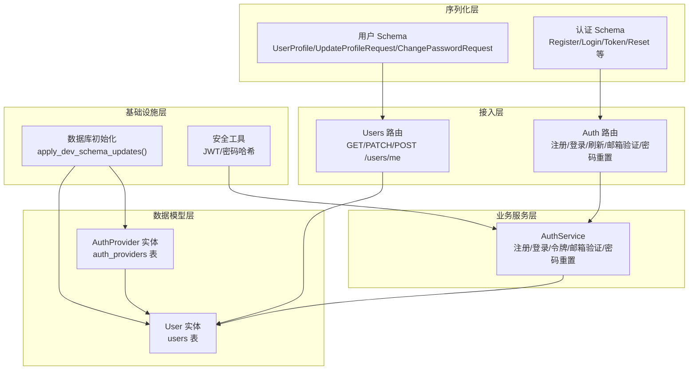
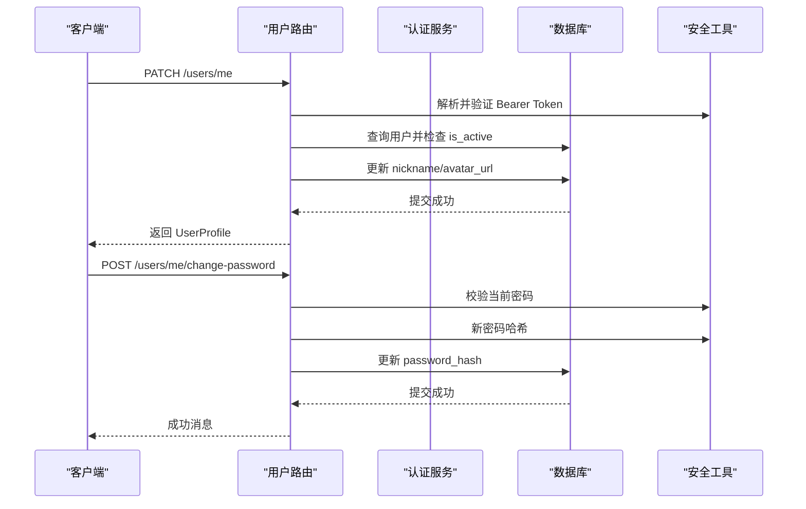
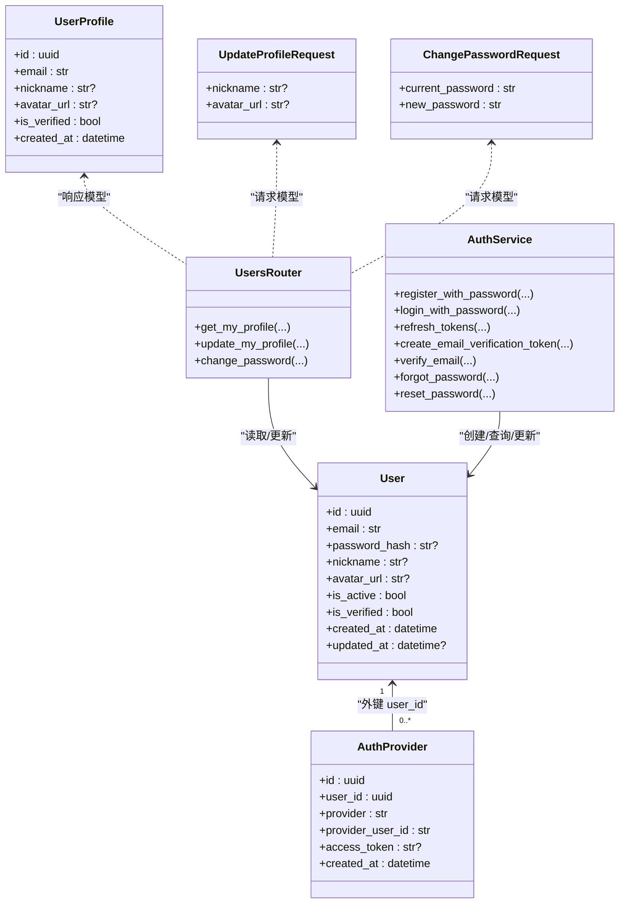

# 用户模型

<cite>
**本文档引用的文件**
- [apps/api/app/models/user.py](file://apps/api/app/models/user.py)
- [apps/api/app/models/auth_provider.py](file://apps/api/app/models/auth_provider.py)
- [apps/api/app/models/base.py](file://apps/api/app/models/base.py)
- [apps/api/app/schemas/user.py](file://apps/api/app/schemas/user.py)
- [apps/api/app/schemas/auth.py](file://apps/api/app/schemas/auth.py)
- [apps/api/app/modules/users/router.py](file://apps/api/app/modules/users/router.py)
- [apps/api/app/modules/auth/service.py](file://apps/api/app/modules/auth/service.py)
- [apps/api/app/core/database.py](file://apps/api/app/core/database.py)
- [apps/api/app/core/security.py](file://apps/api/app/core/security.py)
- [apps/api/tests/test_users.py](file://apps/api/tests/test_users.py)
</cite>

## 目录
1. [简介](#简介)
2. [项目结构](#项目结构)
3. [核心组件](#核心组件)
4. [架构总览](#架构总览)
5. [详细组件分析](#详细组件分析)
6. [依赖关系分析](#依赖关系分析)
7. [性能考虑](#性能考虑)
8. [故障排除指南](#故障排除指南)
9. [结论](#结论)

## 简介
本文件系统性梳理用户模型的数据结构、字段定义、约束规则、认证提供者关联、状态与权限控制、生命周期管理以及与其他实体的关联关系。同时给出数据访问模式与查询优化建议，并结合现有测试用例说明关键行为边界。

## 项目结构
用户模型位于后端应用的 ORM 层，配合认证服务、路由层与数据库初始化脚本共同构成完整的用户生命周期管理能力：
- 数据模型层：用户实体与第三方认证提供者绑定记录
- 序列化层：Pydantic 模型用于请求/响应校验与转换
- 业务服务层：认证服务封装注册、登录、令牌刷新、邮箱验证、密码重置等流程
- 接入层：用户资料路由处理个人资料查询、更新与密码修改
- 基础设施层：数据库引擎与初始化脚本，安全工具模块提供密码哈希与 JWT 工具

图表来源
- [apps/api/app/models/user.py:12-28](file://apps/api/app/models/user.py#L12-L28)
- [apps/api/app/models/auth_provider.py:12-24](file://apps/api/app/models/auth_provider.py#L12-L24)
- [apps/api/app/schemas/user.py:8-30](file://apps/api/app/schemas/user.py#L8-L30)
- [apps/api/app/schemas/auth.py:5-37](file://apps/api/app/schemas/auth.py#L5-L37)
- [apps/api/app/modules/users/router.py:17-71](file://apps/api/app/modules/users/router.py#L17-L71)
- [apps/api/app/modules/auth/service.py:21-145](file://apps/api/app/modules/auth/service.py#L21-L145)
- [apps/api/app/core/database.py:28-51](file://apps/api/app/core/database.py#L28-L51)
- [apps/api/app/core/security.py:12-72](file://apps/api/app/core/security.py#L12-L72)

章节来源
- [apps/api/app/models/user.py:12-28](file://apps/api/app/models/user.py#L12-L28)
- [apps/api/app/models/auth_provider.py:12-24](file://apps/api/app/models/auth_provider.py#L12-L24)
- [apps/api/app/schemas/user.py:8-30](file://apps/api/app/schemas/user.py#L8-L30)
- [apps/api/app/schemas/auth.py:5-37](file://apps/api/app/schemas/auth.py#L5-L37)
- [apps/api/app/modules/users/router.py:17-71](file://apps/api/app/modules/users/router.py#L17-L71)
- [apps/api/app/modules/auth/service.py:21-145](file://apps/api/app/modules/auth/service.py#L21-L145)
- [apps/api/app/core/database.py:28-51](file://apps/api/app/core/database.py#L28-L51)
- [apps/api/app/core/security.py:12-72](file://apps/api/app/core/security.py#L12-L72)

## 核心组件
- 用户实体 User：承载用户身份、认证凭据、状态与元数据
- 第三方认证提供者 AuthProvider：为未来 OAuth2 支持预留的绑定记录
- 用户资料 Schema：UserProfile、UpdateProfileRequest、ChangePasswordRequest
- 认证 Schema：RegisterRequest、LoginRequest、TokenResponse、RefreshRequest、VerifyEmailRequest、ForgotPasswordRequest、ResetPasswordRequest
- 用户路由：提供“获取/更新资料”和“修改密码”的接口
- 认证服务：封装注册、登录、令牌刷新、邮箱验证、密码重置等逻辑
- 数据库初始化：在开发环境为 users 表增量添加列与索引
- 安全工具：JWT 生成/验证、密码哈希/校验

章节来源
- [apps/api/app/models/user.py:12-28](file://apps/api/app/models/user.py#L12-L28)
- [apps/api/app/models/auth_provider.py:12-24](file://apps/api/app/models/auth_provider.py#L12-L24)
- [apps/api/app/schemas/user.py:8-30](file://apps/api/app/schemas/user.py#L8-L30)
- [apps/api/app/schemas/auth.py:5-37](file://apps/api/app/schemas/auth.py#L5-L37)
- [apps/api/app/modules/users/router.py:17-71](file://apps/api/app/modules/users/router.py#L17-L71)
- [apps/api/app/modules/auth/service.py:21-145](file://apps/api/app/modules/auth/service.py#L21-L145)
- [apps/api/app/core/database.py:28-51](file://apps/api/app/core/database.py#L28-L51)
- [apps/api/app/core/security.py:12-72](file://apps/api/app/core/security.py#L12-L72)

## 架构总览
用户模型贯穿数据持久化、认证授权、接口交互与安全工具链路，形成从请求到落库的闭环。

图表来源
- [apps/api/app/modules/users/router.py:17-71](file://apps/api/app/modules/users/router.py#L17-L71)
- [apps/api/app/modules/auth/service.py:21-145](file://apps/api/app/modules/auth/service.py#L21-L145)
- [apps/api/app/core/security.py:22-72](file://apps/api/app/core/security.py#L22-L72)
- [apps/api/app/core/database.py:28-51](file://apps/api/app/core/database.py#L28-L51)

## 详细组件分析

### 用户实体 User 字段定义与约束
- 主键 id：UUID 类型，主键，自动生成
- 邮箱 email：字符串，唯一、非空
- 密码哈希 password_hash：字符串，可空（OAuth 用户可能无密码）
- 昵称 nickname：字符串，最大长度 50，可空
- 头像地址 avatar_url：字符串，可空
- 激活状态 is_active：布尔，默认 True
- 已验证状态 is_verified：布尔，默认 False
- 创建时间 created_at：带时区的时间戳，默认服务器时间
- 更新时间 updated_at：带时区的时间戳，可空，更新时自动写入

字段验证与约束要点
- 邮箱唯一性：数据库层唯一约束，注册时通过查询保证
- 昵称长度限制：Schema 中限制最大 50 字符
- 密码最小长度：注册与重置密码场景中要求至少 8 位
- OAuth 场景：password_hash 可为空，密码修改接口对空密码哈希做保护
- 状态控制：is_active 为 False 的账户禁止登录；is_verified 用于邮箱验证流程

生命周期与软删除策略
- 当前实现未见软删除字段或标志位；用户删除通常通过物理删除或禁用账户（is_active=False）实现
- 若需软删除，建议引入 deleted_at 或 deleted 标志位，并在查询层默认过滤已删除记录

章节来源
- [apps/api/app/models/user.py:15-27](file://apps/api/app/models/user.py#L15-L27)
- [apps/api/app/schemas/user.py:20-30](file://apps/api/app/schemas/user.py#L20-L30)
- [apps/api/app/schemas/auth.py:5-37](file://apps/api/app/schemas/auth.py#L5-L37)
- [apps/api/app/modules/auth/service.py:27-48](file://apps/api/app/modules/auth/service.py#L27-L48)
- [apps/api/app/modules/users/router.py:51-71](file://apps/api/app/modules/users/router.py#L51-L71)

### 认证提供者实体 AuthProvider 关联关系
- 主键 id：UUID 类型
- 外键 user_id：指向 users.id，建立一对一或多对一关系
- provider：字符串，标识第三方提供商（如 google、github、wechat）
- provider_user_id：字符串，第三方平台的用户标识
- access_token：字符串，可空，存储第三方访问令牌
- created_at：带时区的时间戳，默认服务器时间

多 Provider 支持说明
- provider 字段用于区分不同第三方来源
- 该表为 OAuth2 预留表，当前认证服务未实现 OAuth 登录逻辑，但已具备扩展基础

章节来源
- [apps/api/app/models/auth_provider.py:12-24](file://apps/api/app/models/auth_provider.py#L12-L24)
- [apps/api/app/modules/auth/service.py:142-145](file://apps/api/app/modules/auth/service.py#L142-L145)

### 用户状态字段与权限控制机制
- is_active：登录与令牌刷新时均会检查用户是否激活，未激活则拒绝
- is_verified：邮箱验证流程将该字段置为 True
- 路由层使用 HTTPBearer 依赖解析并验证 JWT，随后按用户状态进一步判定有效性

章节来源
- [apps/api/app/modules/users/router.py:17-27](file://apps/api/app/modules/users/router.py#L17-L27)
- [apps/api/app/modules/auth/service.py:58-67](file://apps/api/app/modules/auth/service.py#L58-L67)
- [apps/api/app/modules/auth/service.py:80-87](file://apps/api/app/modules/auth/service.py#L80-L87)
- [apps/api/app/modules/auth/service.py:98-114](file://apps/api/app/modules/auth/service.py#L98-L114)

### 字段验证规则与约束条件
- 注册请求：邮箱格式校验、密码最小长度 8、昵称可选
- 登录请求：邮箱格式校验、密码必填
- 修改密码请求：当前密码必填、新密码最小长度 8
- 更新资料请求：昵称最大长度 50、头像 URL 可选
- 数据库层面：邮箱唯一、时间戳默认值与更新触发器

章节来源
- [apps/api/app/schemas/auth.py:5-14](file://apps/api/app/schemas/auth.py#L5-L14)
- [apps/api/app/schemas/user.py:20-30](file://apps/api/app/schemas/user.py#L20-L30)
- [apps/api/app/modules/auth/service.py:27-48](file://apps/api/app/modules/auth/service.py#L27-L48)
- [apps/api/app/modules/users/router.py:51-71](file://apps/api/app/modules/users/router.py#L51-L71)

### 用户数据生命周期管理
- 注册：邮箱唯一性检查，密码哈希后创建用户
- 登录：校验邮箱与密码，返回访问/刷新令牌
- 刷新：使用刷新令牌换取新的访问令牌
- 邮箱验证：生成短期令牌，验证后设置 is_verified=True
- 密码重置：生成短期令牌，验证后更新密码哈希
- 资料更新：支持更新昵称与头像，长度限制在 Schema 中体现
- 密码修改：仅当用户具备密码哈希时允许修改，否则报错

章节来源
- [apps/api/app/modules/auth/service.py:27-48](file://apps/api/app/modules/auth/service.py#L27-L48)
- [apps/api/app/modules/auth/service.py:50-75](file://apps/api/app/modules/auth/service.py#L50-L75)
- [apps/api/app/modules/auth/service.py:77-92](file://apps/api/app/modules/auth/service.py#L77-L92)
- [apps/api/app/modules/auth/service.py:94-114](file://apps/api/app/modules/auth/service.py#L94-L114)
- [apps/api/app/modules/auth/service.py:116-140](file://apps/api/app/modules/auth/service.py#L116-L140)
- [apps/api/app/modules/users/router.py:35-48](file://apps/api/app/modules/users/router.py#L35-L48)
- [apps/api/app/modules/users/router.py:51-71](file://apps/api/app/modules/users/router.py#L51-L71)

### 与其他实体的关联关系与外键约束
- User 与 AuthProvider：一对多关系（一个用户可绑定多个第三方提供商），外键 user_id 指向 users.id
- 其他实体：当前仓库中未发现与 User 存在直接外键关联的实体（如分析任务、图片资源等）

章节来源
- [apps/api/app/models/auth_provider.py:17-17](file://apps/api/app/models/auth_provider.py#L17-L17)
- [apps/api/app/models/user.py:15-15](file://apps/api/app/models/user.py#L15-L15)

### 数据访问模式与查询优化建议
- 查询模式
  - 按邮箱查询：注册/登录时按 email 进行唯一查询
  - 按主键查询：路由层按 id 获取当前用户
  - 按外键查询：第三方绑定记录按 user_id 查询
- 索引建议
  - users.email：唯一索引（数据库已保证唯一）
  - auth_providers.user_id：索引（已创建）
  - auth_providers.provider + auth_providers.provider_user_id：复合索引以支持快速查找第三方用户
- 性能建议
  - 在高频查询路径上避免 N+1 查询，优先使用 join 或批量查询
  - 对于大表，考虑对 created_at、updated_at 等时间字段建立索引以优化排序与分页
  - 使用只读副本或缓存热点用户资料（注意缓存一致性）

章节来源
- [apps/api/app/core/database.py:28-51](file://apps/api/app/core/database.py#L28-L51)
- [apps/api/app/models/auth_provider.py:17-17](file://apps/api/app/models/auth_provider.py#L17-L17)
- [apps/api/app/modules/users/router.py:17-27](file://apps/api/app/modules/users/router.py#L17-L27)

## 依赖关系分析

图表来源
- [apps/api/app/models/user.py:12-28](file://apps/api/app/models/user.py#L12-L28)
- [apps/api/app/models/auth_provider.py:12-24](file://apps/api/app/models/auth_provider.py#L12-L24)
- [apps/api/app/schemas/user.py:8-30](file://apps/api/app/schemas/user.py#L8-L30)
- [apps/api/app/modules/users/router.py:17-71](file://apps/api/app/modules/users/router.py#L17-L71)
- [apps/api/app/modules/auth/service.py:21-145](file://apps/api/app/modules/auth/service.py#L21-L145)

## 性能考虑
- 数据库层
  - users 表已增加 nickname、avatar_url、is_active、is_verified、updated_at 等列，满足当前功能需求
  - 建议为常用查询字段建立索引（如 email、updated_at）
- 应用层
  - 使用 HTTPBearer 依赖统一鉴权，减少重复校验
  - 批量更新与提交事务，降低数据库往返次数
- 缓存策略
  - 对热点用户资料进行缓存，注意与数据库的一致性（可采用写后失效或版本号）

[本节为通用性能指导，无需特定文件来源]

## 故障排除指南
- 登录失败
  - 邮箱不存在或密码错误：检查邮箱唯一性与密码哈希匹配
  - 账户未激活：确认 is_active=True
- 修改密码失败
  - OAuth 账户无密码哈希：提示无法修改密码
  - 当前密码错误：校验 verify_password 结果
  - 新密码长度不足：Schema 校验失败
- 邮箱验证失败
  - 验证令牌无效或过期：检查令牌签名与有效期
- 路由访问异常
  - 未携带有效 Bearer Token：HTTP 401/403
  - Token 解析失败：检查 JWT 签名与算法配置

章节来源
- [apps/api/app/modules/auth/service.py:50-75](file://apps/api/app/modules/auth/service.py#L50-L75)
- [apps/api/app/modules/auth/service.py:58-67](file://apps/api/app/modules/auth/service.py#L58-L67)
- [apps/api/app/modules/auth/service.py:98-114](file://apps/api/app/modules/auth/service.py#L98-L114)
- [apps/api/app/modules/users/router.py:51-71](file://apps/api/app/modules/users/router.py#L51-L71)
- [apps/api/tests/test_users.py:121-144](file://apps/api/tests/test_users.py#L121-L144)

## 结论
用户模型以简洁清晰的字段设计支撑了邮箱+密码与 OAuth 的双路径认证体系，配合完善的 Schema 校验与安全工具，实现了从注册、登录、令牌管理到资料维护的完整闭环。当前未实现软删除，建议在需要时引入软删除字段并在查询层默认过滤。未来可基于 AuthProvider 表扩展 OAuth2 登录能力，并完善第三方绑定与解绑流程。