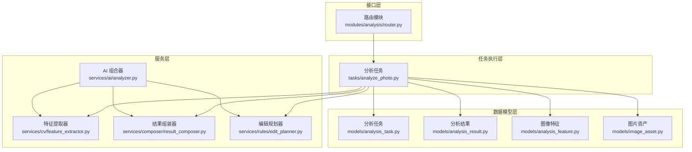
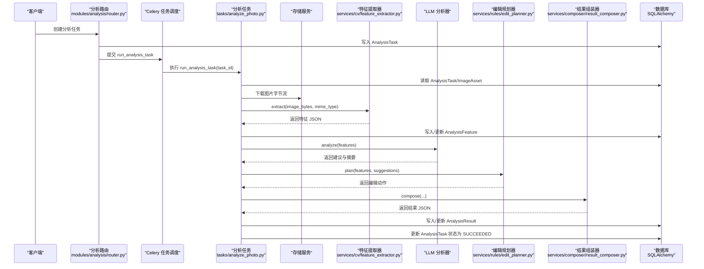
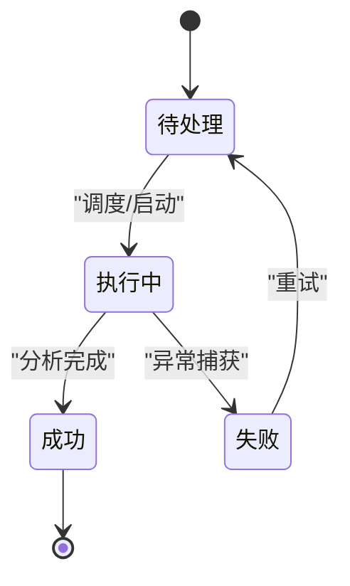
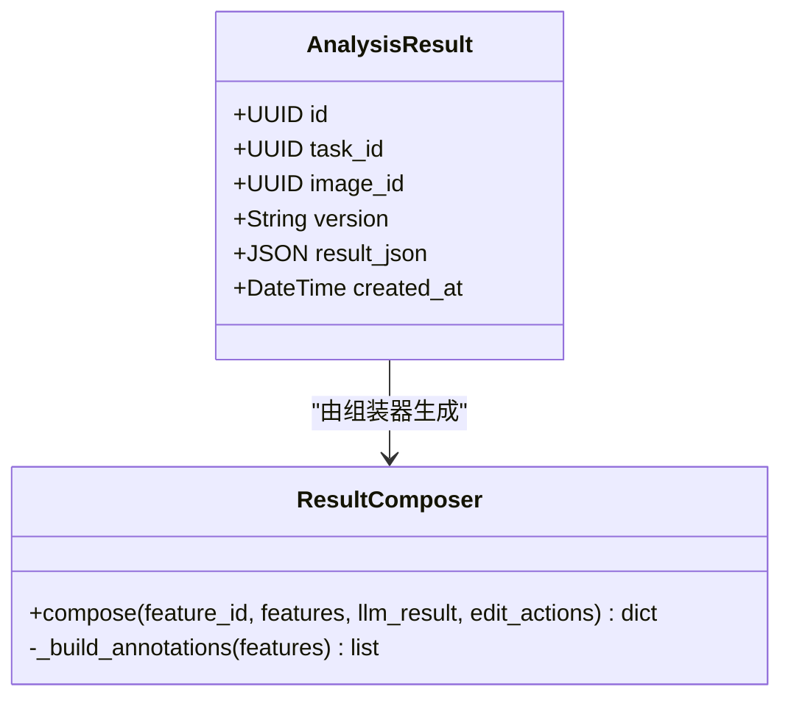
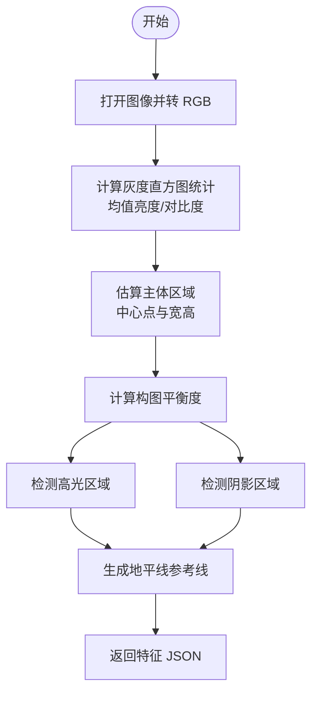
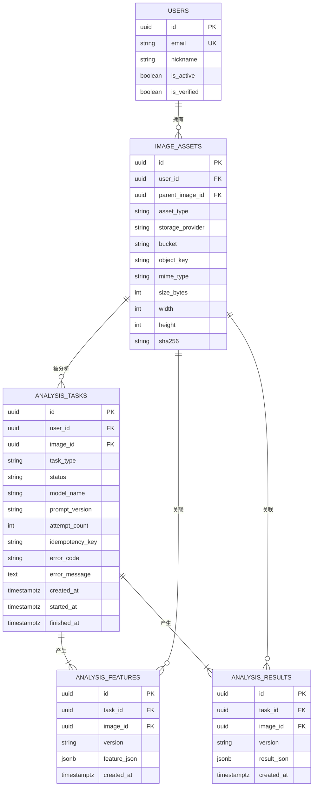
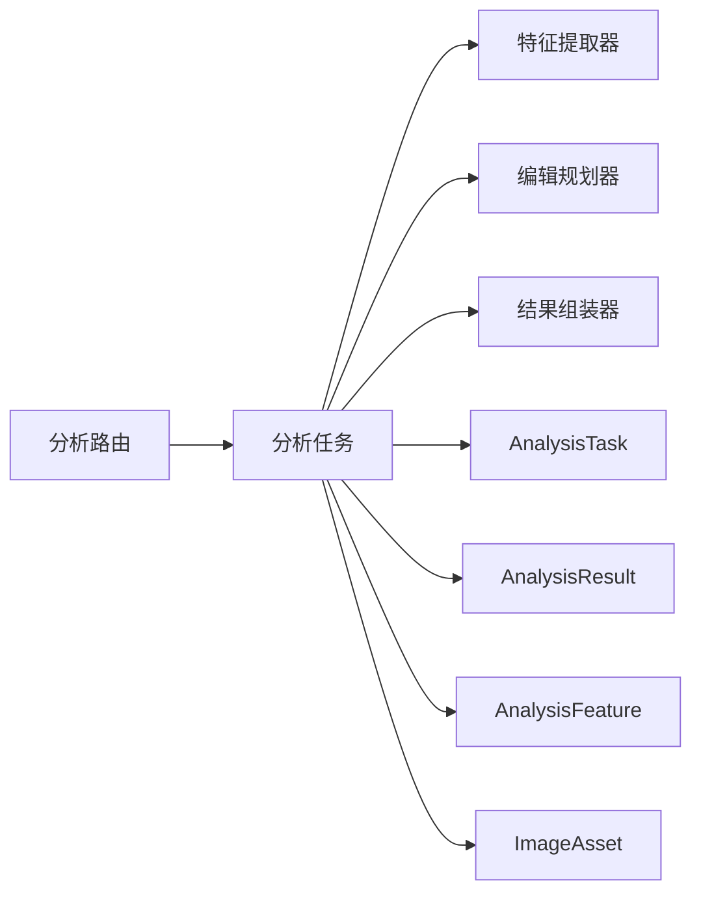

# 分析数据模型

<cite>
**本文引用的文件**
- [apps/api/app/models/analysis_task.py](file://apps/api/app/models/analysis_task.py)
- [apps/api/app/models/analysis_result.py](file://apps/api/app/models/analysis_result.py)
- [apps/api/app/models/analysis_feature.py](file://apps/api/app/models/analysis_feature.py)
- [apps/api/app/models/base.py](file://apps/api/app/models/base.py)
- [apps/api/app/models/image_asset.py](file://apps/api/app/models/image_asset.py)
- [apps/api/app/schemas/analysis.py](file://apps/api/app/schemas/analysis.py)
- [apps/api/app/services/ai/analyzer.py](file://apps/api/app/services/ai/analyzer.py)
- [apps/api/app/services/cv/feature_extractor.py](file://apps/api/app/services/cv/feature_extractor.py)
- [apps/api/app/services/composer/result_composer.py](file://apps/api/app/services/composer/result_composer.py)
- [apps/api/app/services/rules/edit_planner.py](file://apps/api/app/services/rules/edit_planner.py)
- [apps/api/app/tasks/analyze_photo.py](file://apps/api/app/tasks/analyze_photo.py)
- [apps/api/app/modules/analysis/router.py](file://apps/api/app/modules/analysis/router.py)
- [apps/api/app/migrations/versions/708d1432f72e_initial_schema.py](file://apps/api/app/migrations/versions/708d1432f72e_initial_schema.py)
- [apps/api/app/core/config.py](file://apps/api/app/core/config.py)
</cite>

## 目录
1. [引言](#引言)
2. [项目结构](#项目结构)
3. [核心组件](#核心组件)
4. [架构总览](#架构总览)
5. [详细组件分析](#详细组件分析)
6. [依赖分析](#依赖分析)
7. [性能考虑](#性能考虑)
8. [故障排查指南](#故障排查指南)
9. [结论](#结论)
10. [附录](#附录)

## 引言
本文件围绕 AI 摄影分析系统的数据模型展开，重点覆盖三类核心实体：AnalysisTask（分析任务）、AnalysisResult（分析结果）、AnalysisFeature（图像特征）。文档将从以下维度进行系统化说明：
- 任务状态管理、进度跟踪与错误处理机制
- 结果数据结构、评分体系与建议内容存储
- 图像特征提取、数据格式与计算方法
- 任务生命周期管理、结果与特征的序列化/反序列化策略
- 特征数据存储优化与查询索引设计
- 任务状态转换图与数据分析流程说明

## 项目结构
本项目采用分层架构与按功能域划分的组织方式：
- 数据模型层：位于 models 目录，定义 SQLAlchemy ORM 模型及数据库索引
- 业务服务层：位于 services 目录，封装特征提取、LLM 分析、编辑动作规划与结果组装
- 任务执行层：位于 tasks 目录，Celery 任务负责异步执行分析流程
- 接口层：位于 modules 目录，FastAPI 路由暴露分析任务的创建、查询与重试
- 配置与迁移：位于 core 与 migrations 目录，提供运行参数与数据库初始结构

图表来源
- [apps/api/app/modules/analysis/router.py:1-151](file://apps/api/app/modules/analysis/router.py#L1-L151)
- [apps/api/app/tasks/analyze_photo.py:1-108](file://apps/api/app/tasks/analyze_photo.py#L1-L108)
- [apps/api/app/services/ai/analyzer.py:1-27](file://apps/api/app/services/ai/analyzer.py#L1-L27)
- [apps/api/app/services/cv/feature_extractor.py:1-98](file://apps/api/app/services/cv/feature_extractor.py#L1-L98)
- [apps/api/app/services/composer/result_composer.py:1-99](file://apps/api/app/services/composer/result_composer.py#L1-L99)
- [apps/api/app/services/rules/edit_planner.py:1-97](file://apps/api/app/services/rules/edit_planner.py#L1-L97)
- [apps/api/app/models/analysis_task.py:1-36](file://apps/api/app/models/analysis_task.py#L1-L36)
- [apps/api/app/models/analysis_result.py:1-28](file://apps/api/app/models/analysis_result.py#L1-L28)
- [apps/api/app/models/analysis_feature.py:1-29](file://apps/api/app/models/analysis_feature.py#L1-L29)
- [apps/api/app/models/image_asset.py:1-32](file://apps/api/app/models/image_asset.py#L1-L32)

章节来源
- [apps/api/app/modules/analysis/router.py:1-151](file://apps/api/app/modules/analysis/router.py#L1-L151)
- [apps/api/app/tasks/analyze_photo.py:1-108](file://apps/api/app/tasks/analyze_photo.py#L1-L108)
- [apps/api/app/models/analysis_task.py:1-36](file://apps/api/app/models/analysis_task.py#L1-L36)
- [apps/api/app/models/analysis_result.py:1-28](file://apps/api/app/models/analysis_result.py#L1-L28)
- [apps/api/app/models/analysis_feature.py:1-29](file://apps/api/app/models/analysis_feature.py#L1-L29)
- [apps/api/app/models/image_asset.py:1-32](file://apps/api/app/models/image_asset.py#L1-L32)

## 核心组件
本节对三大数据模型进行逐项解析，涵盖字段语义、约束关系、索引设计与典型用途。

- AnalysisTask（分析任务）
  - 关键字段：任务标识、所属用户、关联图片、任务类型、状态、模型名、提示词版本、重试次数、幂等键、错误码与消息、时间戳（创建/开始/结束）
  - 约束与索引：外键到 users 与 image_assets；复合索引按用户与创建时间、状态与创建时间加速查询
  - 作用：承载一次分析任务的元数据与生命周期状态

- AnalysisResult（分析结果）
  - 关键字段：结果唯一标识、关联任务、关联图片、版本号、JSON 结果体、创建时间
  - 约束与索引：外键到 analysis_tasks 与 image_assets；唯一约束保证每个任务仅有一条结果；针对 JSON 字段建立 GIN 索引以支持高效检索
  - 作用：持久化最终分析产物，包含摘要、建议、评分、注解与编辑动作

- AnalysisFeature（图像特征）
  - 关键字段：特征唯一标识、关联任务、关联图片、版本号、JSON 特征体、创建时间
  - 约束与索引：外键到 analysis_tasks 与 image_assets；唯一约束保证每个任务仅有一条特征；针对 JSON 字段建立 GIN 索引
  - 作用：持久化计算机视觉提取的结构化特征，供 LLM 与规则引擎复用

- ImageAsset（图片资产）
  - 关键字段：存储提供方、桶与对象键、MIME 类型、尺寸、哈希、EXIF 等
  - 约束：唯一约束保证同一桶内对象键唯一
  - 作用：统一管理图片资源的元数据与存储位置

章节来源
- [apps/api/app/models/analysis_task.py:10-36](file://apps/api/app/models/analysis_task.py#L10-L36)
- [apps/api/app/models/analysis_result.py:10-28](file://apps/api/app/models/analysis_result.py#L10-L28)
- [apps/api/app/models/analysis_feature.py:10-29](file://apps/api/app/models/analysis_feature.py#L10-L29)
- [apps/api/app/models/image_asset.py:10-32](file://apps/api/app/models/image_asset.py#L10-L32)
- [apps/api/app/migrations/versions/708d1432f72e_initial_schema.py:69-117](file://apps/api/app/migrations/versions/708d1432f72e_initial_schema.py#L69-L117)

## 架构总览
下图展示从接口到任务执行再到数据持久化的完整链路，以及各组件之间的交互关系。

图表来源
- [apps/api/app/modules/analysis/router.py:45-74](file://apps/api/app/modules/analysis/router.py#L45-L74)
- [apps/api/app/tasks/analyze_photo.py:19-108](file://apps/api/app/tasks/analyze_photo.py#L19-L108)
- [apps/api/app/services/cv/feature_extractor.py:15-91](file://apps/api/app/services/cv/feature_extractor.py#L15-L91)
- [apps/api/app/services/rules/edit_planner.py:6-90](file://apps/api/app/services/rules/edit_planner.py#L6-L90)
- [apps/api/app/services/composer/result_composer.py:8-23](file://apps/api/app/services/composer/result_composer.py#L8-L23)

## 详细组件分析

### AnalysisTask（分析任务）模型
- 状态管理
  - 支持状态：PENDING（待处理）、RUNNING（执行中）、SUCCEEDED（成功）、FAILED（失败）
  - 生命周期：创建任务后进入 PENDING，调度执行后置为 RUNNING，成功写入结果后置为 SUCCEEDED，异常捕获后置为 FAILED 并记录错误码与消息
  - 重试机制：通过 attempt_count 记录尝试次数；提供重试端点将任务重置为 PENDING 并重新入队
- 进度跟踪
  - created_at：任务创建时间
  - started_at：首次开始执行时间
  - finished_at：最终完成时间（成功或失败）
- 错误处理
  - error_code：存储异常类名
  - error_message：存储异常字符串（截断至 500 字符）
- 关系与索引
  - 外键关联 users 与 image_assets，并设置级联删除
  - 复合索引按 user_id+created_at、status+created_at，便于历史查询与状态扫描

图表来源
- [apps/api/app/tasks/analyze_photo.py:24-107](file://apps/api/app/tasks/analyze_photo.py#L24-L107)
- [apps/api/app/modules/analysis/router.py:128-150](file://apps/api/app/modules/analysis/router.py#L128-L150)

章节来源
- [apps/api/app/models/analysis_task.py:10-36](file://apps/api/app/models/analysis_task.py#L10-L36)
- [apps/api/app/tasks/analyze_photo.py:19-108](file://apps/api/app/tasks/analyze_photo.py#L19-L108)
- [apps/api/app/modules/analysis/router.py:128-150](file://apps/api/app/modules/analysis/router.py#L128-L150)

### AnalysisResult（分析结果）模型
- 数据结构
  - version：结果版本号，默认 1.1
  - result_json：JSON 结构，包含摘要、建议、评分、特征引用、注解与编辑动作
- 评分体系
  - scores：可选的量化评分集合，由 LLM 分析器产出
- 建议内容
  - suggestions：自然语言建议列表，结合特征与规则生成
- 注解与特征引用
  - annotations：对关键区域（主体、高光、阴影、地平线）的几何标注
  - features_ref：指向 AnalysisFeature 的引用，便于回溯原始特征
- 编辑动作
  - edit_actions：规则引擎规划的具体可预览编辑操作（裁剪、曝光、白平衡等）

图表来源
- [apps/api/app/models/analysis_result.py:10-28](file://apps/api/app/models/analysis_result.py#L10-L28)
- [apps/api/app/services/composer/result_composer.py:5-99](file://apps/api/app/services/composer/result_composer.py#L5-L99)

章节来源
- [apps/api/app/models/analysis_result.py:10-28](file://apps/api/app/models/analysis_result.py#L10-L28)
- [apps/api/app/services/composer/result_composer.py:8-23](file://apps/api/app/services/composer/result_composer.py#L8-L23)

### AnalysisFeature（图像特征）模型
- 数据格式
  - version：特征版本号，默认 1.0
  - feature_json：结构化特征，包含图像尺寸、MIME 类型、统计量、主体框、高光/阴影区域、参考线等
- 计算方法
  - 基于 PIL 的图像处理与统计：灰度转换、亮度均值与对比度、主体区域坐标、高光/阴影区域、地平线参考线
  - 区域坐标采用像素坐标系，便于后续编辑动作定位
- 存储优化
  - 使用 JSONB 存储，配合 PostgreSQL GIN 索引，支持快速检索与条件过滤

图表来源
- [apps/api/app/services/cv/feature_extractor.py:15-91](file://apps/api/app/services/cv/feature_extractor.py#L15-L91)

章节来源
- [apps/api/app/models/analysis_feature.py:10-29](file://apps/api/app/models/analysis_feature.py#L10-L29)
- [apps/api/app/services/cv/feature_extractor.py:12-98](file://apps/api/app/services/cv/feature_extractor.py#L12-L98)

### 任务生命周期管理与序列化/反序列化
- 生命周期
  - 创建：接口层写入 AnalysisTask，状态为 PENDING
  - 执行：Celery 任务读取任务与图片，下载字节流，执行特征提取、LLM 分析与编辑规划，组装结果
  - 完成：写入 AnalysisFeature 与 AnalysisResult，更新 AnalysisTask 状态为 SUCCEEDED 或 FAILED
  - 重试：将状态重置为 PENDING 并重新入队
- 序列化/反序列化
  - 特征与结果均以 JSONB 存储，读取时直接反序列化为 Python 字典；前端通过 Pydantic 模型进行序列化输出
  - 版本号字段确保不同版本的数据兼容性与演进

章节来源
- [apps/api/app/tasks/analyze_photo.py:19-108](file://apps/api/app/tasks/analyze_photo.py#L19-L108)
- [apps/api/app/modules/analysis/router.py:45-74](file://apps/api/app/modules/analysis/router.py#L45-L74)
- [apps/api/app/schemas/analysis.py:8-52](file://apps/api/app/schemas/analysis.py#L8-L52)

### 数据模型关系与 ER 关系

图表来源
- [apps/api/app/migrations/versions/708d1432f72e_initial_schema.py:49-117](file://apps/api/app/migrations/versions/708d1432f72e_initial_schema.py#L49-L117)
- [apps/api/app/models/analysis_task.py:10-36](file://apps/api/app/models/analysis_task.py#L10-L36)
- [apps/api/app/models/analysis_result.py:10-28](file://apps/api/app/models/analysis_result.py#L10-L28)
- [apps/api/app/models/analysis_feature.py:10-29](file://apps/api/app/models/analysis_feature.py#L10-L29)
- [apps/api/app/models/image_asset.py:10-32](file://apps/api/app/models/image_asset.py#L10-L32)

## 依赖分析
- 组件耦合
  - AnalysisTask 与 AnalysisFeature/AnalysisResult 为一对一关系（通过 task_id 唯一约束），确保任务与特征/结果一一对应
  - AnalysisResult 依赖 AnalysisFeature 的引用，形成“先特征后结果”的数据依赖链
- 外部依赖
  - 存储服务：通过对象键下载图片字节流
  - 数据库：PostgreSQL JSONB 与 GIN 索引支撑特征与结果的高效检索
  - Redis：Celery broker（配置中提供 redis_url）
- 可能的循环依赖
  - 当前模块间为单向依赖（路由 → 任务 → 服务 → 模型），未发现循环导入

图表来源
- [apps/api/app/modules/analysis/router.py:1-151](file://apps/api/app/modules/analysis/router.py#L1-L151)
- [apps/api/app/tasks/analyze_photo.py:1-108](file://apps/api/app/tasks/analyze_photo.py#L1-L108)
- [apps/api/app/models/analysis_task.py:1-36](file://apps/api/app/models/analysis_task.py#L1-L36)
- [apps/api/app/models/analysis_result.py:1-28](file://apps/api/app/models/analysis_result.py#L1-L28)
- [apps/api/app/models/analysis_feature.py:1-29](file://apps/api/app/models/analysis_feature.py#L1-L29)
- [apps/api/app/models/image_asset.py:1-32](file://apps/api/app/models/image_asset.py#L1-L32)

章节来源
- [apps/api/app/core/config.py:13-14](file://apps/api/app/core/config.py#L13-L14)

## 性能考虑
- 查询索引
  - AnalysisTasks：按 user_id+created_at、status+created_at 建立复合索引，加速历史查询与状态扫描
  - AnalysisFeatures/AnalysisResults：对 JSONB 字段建立 GIN 索引，提升复杂条件检索效率
- 存储优化
  - 使用 JSONB 存储结构化数据，避免多表拆分带来的 JOIN 开销
  - 版本号字段用于演进控制，减少全量迁移成本
- 计算优化
  - 特征提取器与结果组装器均使用缓存装饰器，降低重复实例化开销
- I/O 优化
  - 通过对象键直接下载图片，避免本地临时文件写入

章节来源
- [apps/api/app/migrations/versions/708d1432f72e_initial_schema.py:88-117](file://apps/api/app/migrations/versions/708d1432f72e_initial_schema.py#L88-L117)
- [apps/api/app/services/ai/analyzer.py:23-25](file://apps/api/app/services/ai/analyzer.py#L23-L25)
- [apps/api/app/services/composer/result_composer.py:95-97](file://apps/api/app/services/composer/result_composer.py#L95-L97)

## 故障排查指南
- 常见问题
  - 任务状态长期为 PENDING：检查 Celery 是否正常运行、Redis 连接是否可用
  - 任务状态为 FAILED：查看 AnalysisTask 的 error_code 与 error_message，定位具体异常
  - 结果缺失：确认 AnalysisResult 是否成功写入，或是否存在并发更新导致的覆盖
- 排查步骤
  - 通过接口查询任务详情，确认状态与错误信息
  - 在数据库中核对 AnalysisFeature 与 AnalysisResult 的版本号与 JSON 内容
  - 检查存储服务对象键是否存在、权限是否正确
- 重试机制
  - 使用重试端点将任务状态重置为 PENDING，并重新入队执行

章节来源
- [apps/api/app/modules/analysis/router.py:128-150](file://apps/api/app/modules/analysis/router.py#L128-L150)
- [apps/api/app/tasks/analyze_photo.py:97-107](file://apps/api/app/tasks/analyze_photo.py#L97-L107)

## 结论
本文系统梳理了 AI 摄影分析的数据模型与执行流程，明确了任务状态机、结果与特征的数据结构、评分与建议体系、特征提取算法与存储优化策略。通过合理的索引设计与版本控制，系统在保证扩展性的同时兼顾了查询与计算性能。建议在后续迭代中持续关注：
- 版本演进策略与向后兼容性
- 特征与结果的增量更新与去重
- 大规模历史数据的归档与冷热分离

## 附录
- API 与模型映射
  - 接口层的 Pydantic 模型与数据库模型字段一一对应，便于序列化与反序列化
  - 任务详情响应包含 AnalysisTask 元数据与 AnalysisResult 的 result_json（若存在）

章节来源
- [apps/api/app/schemas/analysis.py:8-52](file://apps/api/app/schemas/analysis.py#L8-L52)
- [apps/api/app/modules/analysis/router.py:76-89](file://apps/api/app/modules/analysis/router.py#L76-L89)