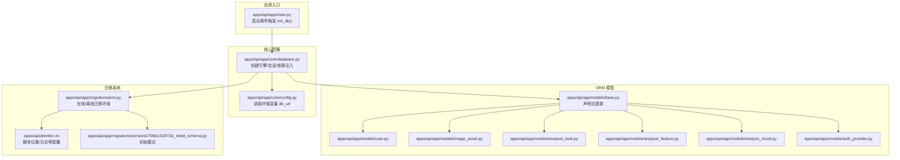
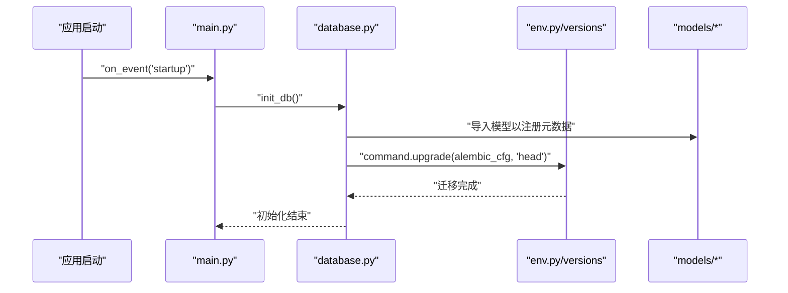
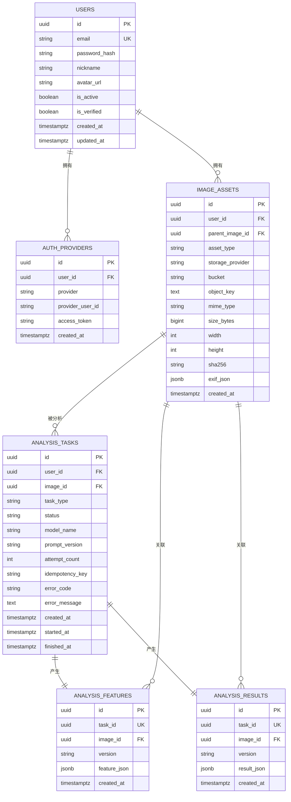
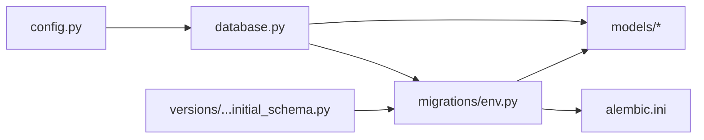

# 数据库架构

<cite>
**本文引用的文件**
- [apps/api/app/core/database.py](file://apps/api/app/core/database.py)
- [apps/api/app/core/config.py](file://apps/api/app/core/config.py)
- [apps/api/app/models/base.py](file://apps/api/app/models/base.py)
- [apps/api/app/models/user.py](file://apps/api/app/models/user.py)
- [apps/api/app/models/image_asset.py](file://apps/api/app/models/image_asset.py)
- [apps/api/app/models/analysis_task.py](file://apps/api/app/models/analysis_task.py)
- [apps/api/app/models/analysis_feature.py](file://apps/api/app/models/analysis_feature.py)
- [apps/api/app/models/analysis_result.py](file://apps/api/app/models/analysis_result.py)
- [apps/api/app/models/auth_provider.py](file://apps/api/app/models/auth_provider.py)
- [apps/api/app/migrations/versions/708d1432f72e_initial_schema.py](file://apps/api/app/migrations/versions/708d1432f72e_initial_schema.py)
- [apps/api/app/migrations/env.py](file://apps/api/app/migrations/env.py)
- [apps/api/alembic.ini](file://apps/api/alembic.ini)
- [apps/api/app/main.py](file://apps/api/app/main.py)
- [apps/api/app/deps.py](file://apps/api/app/deps.py)
- [apps/api/requirements.txt](file://apps/api/requirements.txt)
</cite>

## 更新摘要
**变更内容**
- 更新 Alembic 迁移系统章节，强调其完全替代手动模式管理的优势
- 新增版本控制与回滚支持的详细说明
- 强化数据库架构演进的安全性与可靠性
- 补充 Alembic 配置与使用最佳实践

## 目录
1. [简介](#简介)
2. [项目结构](#项目结构)
3. [核心组件](#核心组件)
4. [架构总览](#架构总览)
5. [详细组件分析](#详细组件分析)
6. [依赖分析](#依赖分析)
7. [性能考虑](#性能考虑)
8. [故障排查指南](#故障排查指南)
9. [结论](#结论)
10. [附录](#附录)

## 简介
本文件系统化梳理 AI 摄影教练项目的数据库架构，包括初始数据库模式设计、**Alembic 迁移体系完全替代手动模式管理**、数据库连接与会话管理、并发与事务策略、索引与查询优化、备份恢复与版本升级流程，以及数据库与应用的集成实践。目标是帮助开发者快速理解并安全地演进数据库层。

## 项目结构
数据库相关代码主要集中在 API 应用的 core、models、migrations 子模块，并通过 FastAPI 启动时自动执行迁移，确保 schema 与应用一致。

**图表来源**
- [apps/api/app/main.py:27-29](file://apps/api/app/main.py#L27-L29)
- [apps/api/app/core/database.py:12-13](file://apps/api/app/core/database.py#L12-L13)
- [apps/api/app/core/config.py:13](file://apps/api/app/core/config.py#L13)
- [apps/api/app/migrations/env.py:13-28](file://apps/api/app/migrations/env.py#L13-L28)
- [apps/api/alembic.ini:8](file://apps/api/alembic.ini#L8)
- [apps/api/app/migrations/versions/708d1432f72e_initial_schema.py:22-118](file://apps/api/app/migrations/versions/708d1432f72e_initial_schema.py#L22-L118)

**章节来源**
- [apps/api/app/main.py:1-36](file://apps/api/app/main.py#L1-L36)
- [apps/api/app/core/database.py:1-39](file://apps/api/app/core/database.py#L1-L39)
- [apps/api/app/core/config.py:1-47](file://apps/api/app/core/config.py#L1-L47)
- [apps/api/app/migrations/env.py:1-66](file://apps/api/app/migrations/env.py#L1-L66)
- [apps/api/alembic.ini:1-147](file://apps/api/alembic.ini#L1-L147)

## 核心组件
- **数据库引擎与会话**
  - 基于 SQLAlchemy 创建连接池，启用 pre_ping 以提升连接存活检测。
  - 使用 sessionmaker 构建本地会话工厂，默认关闭自动 flush/commit，由业务显式控制。
  - 提供依赖注入函数，每次请求返回独立 Session 并在 finally 中关闭，避免泄漏。
- **Alembic 迁移系统**
  - **完全替代手动模式管理**：在应用启动事件中调用 init_db，加载所有模型元数据后，通过 Alembic 将数据库升级到 head 版本，确保变更受控且可追溯。
  - **版本控制系统**：每个迁移脚本都有明确的修订标识，支持向前和向后版本控制。
  - **回滚支持**：提供 downgrade 函数，允许安全地回退到之前的数据库版本。
- **配置中心**
  - 通过 pydantic-settings 从 .env 加载 db_url 等配置；默认开发环境使用 PostgreSQL + psycopg。
- **迁移环境**
  - env.py 注入数据库 URL，扫描模型注册，支持在线/离线两种迁移模式。

**章节来源**
- [apps/api/app/core/database.py:12-38](file://apps/api/app/core/database.py#L12-L38)
- [apps/api/app/main.py:27-29](file://apps/api/app/main.py#L27-L29)
- [apps/api/app/core/config.py:13](file://apps/api/app/core/config.py#L13)
- [apps/api/app/migrations/env.py:20-28](file://apps/api/app/migrations/env.py#L20-L28)

## 架构总览
下图展示数据库层在应用中的角色与交互路径：FastAPI 启动时触发 Alembic 迁移，运行期通过依赖注入获取 Session，业务路由与服务层基于 ORM 操作模型。

**图表来源**
- [apps/api/app/main.py:27-29](file://apps/api/app/main.py#L27-L29)
- [apps/api/app/core/database.py:27-38](file://apps/api/app/core/database.py#L27-L38)
- [apps/api/app/migrations/env.py:45-65](file://apps/api/app/migrations/env.py#L45-L65)
- [apps/api/app/migrations/versions/708d1432f72e_initial_schema.py:22-118](file://apps/api/app/migrations/versions/708d1432f72e_initial_schema.py#L22-L118)

## 详细组件分析

### 初始数据库模式（版本 708d1432f72e）
该迁移定义了用户、图片资产、分析任务、特征与结果等核心表，以及必要的索引与约束，满足分析流水线的数据需求。

**图表来源**
- [apps/api/app/migrations/versions/708d1432f72e_initial_schema.py:25-117](file://apps/api/app/migrations/versions/708d1432f72e_initial_schema.py#L25-L117)

**章节来源**
- [apps/api/app/migrations/versions/708d1432f72e_initial_schema.py:22-118](file://apps/api/app/migrations/versions/708d1432f72e_initial_schema.py#L22-L118)

### 模型与索引设计要点
- **用户表**
  - 主键 id，唯一邮箱，布尔状态字段，时间戳字段使用带时区类型。
- **图片资产表**
  - 复合唯一约束用于存储定位唯一性；外键级联删除保证数据一致性；EXIF JSON 字段便于扩展。
- **分析任务表**
  - 为高频查询建立复合索引：按用户+创建时间、按状态+创建时间，利于分页与筛选。
- **特征与结果表**
  - 一对一映射通过唯一约束实现；JSONB 字段配合 GIN 索引支持复杂查询与过滤。
- **第三方认证表**
  - 为 user_id 建立索引，预留多平台绑定能力。

**章节来源**
- [apps/api/app/models/user.py:12-28](file://apps/api/app/models/user.py#L12-L28)
- [apps/api/app/models/image_asset.py:10-32](file://apps/api/app/models/image_asset.py#L10-L32)
- [apps/api/app/models/analysis_task.py:10-36](file://apps/api/app/models/analysis_task.py#L10-L36)
- [apps/api/app/models/analysis_feature.py:10-29](file://apps/api/app/models/analysis_feature.py#L10-L29)
- [apps/api/app/models/analysis_result.py:10-28](file://apps/api/app/models/analysis_result.py#L10-L28)
- [apps/api/app/models/auth_provider.py:12-24](file://apps/api/app/models/auth_provider.py#L12-L24)

### Alembic 迁移系统配置与使用
- **配置文件**
  - 指定脚本目录与日志级别，确保迁移脚本可被正确发现与执行。
- **环境脚本**
  - 注入数据库 URL，扫描模型注册，支持在线/离线两种迁移模式。
- **初始化流程**
  - 应用启动时调用 init_db，确保数据库 schema 与 head 版本一致。
- **版本控制优势**
  - **完全替代手动模式管理**：不再使用 create_all() 直接创建表，而是通过 Alembic 的版本控制系统进行受控变更。
  - **可追溯性**：每个迁移都有明确的修订标识和时间戳，便于追踪变更历史。
  - **安全性**：支持回滚操作，可以在出现问题时安全地恢复到之前的版本。
  - **团队协作**：多人开发时不会出现模式冲突，所有变更都通过正式的迁移流程。

**章节来源**
- [apps/api/alembic.ini:8](file://apps/api/alembic.ini#L8)
- [apps/api/app/migrations/env.py:20-28](file://apps/api/app/migrations/env.py#L20-L28)
- [apps/api/app/core/database.py:27-38](file://apps/api/app/core/database.py#L27-L38)

### 数据库连接配置、事务管理与并发控制
- **连接与会话**
  - 使用预连接检测提升稳定性；会话工厂禁用自动 flush/commit，由业务层显式控制。
- **依赖注入**
  - 通过依赖注入在请求生命周期内提供 Session，并在 finally 中关闭，避免资源泄露。
- **并发与事务**
  - 默认隔离级别与锁策略遵循 PostgreSQL/SQLAlchemy 默认行为；对长事务与批量写入场景建议显式开启事务块，减少锁竞争。
- **错误处理**
  - 迁移失败或连接异常需捕获并记录，必要时回滚或重试。

**章节来源**
- [apps/api/app/core/database.py:12-24](file://apps/api/app/core/database.py#L12-L24)
- [apps/api/app/deps.py:15-33](file://apps/api/app/deps.py#L15-L33)

## 依赖分析
- **组件耦合**
  - models 依赖 base，database 依赖 models 与 config；migrations/env 依赖 models 与 config。
- **外部依赖**
  - SQLAlchemy 2.x、PostgreSQL 驱动、Alembic。
- **潜在风险**
  - 迁移脚本与模型定义必须保持一致；避免在生产库直接使用 create_all。

**图表来源**
- [apps/api/app/core/config.py:13](file://apps/api/app/core/config.py#L13)
- [apps/api/app/core/database.py:12-13](file://apps/api/app/core/database.py#L12-L13)
- [apps/api/app/migrations/env.py:13-28](file://apps/api/app/migrations/env.py#L13-L28)
- [apps/api/alembic.ini:8](file://apps/api/alembic.ini#L8)
- [apps/api/app/migrations/versions/708d1432f72e_initial_schema.py:22-118](file://apps/api/app/migrations/versions/708d1432f72e_initial_schema.py#L22-L118)

**章节来源**
- [apps/api/requirements.txt:1-19](file://apps/api/requirements.txt#L1-L19)
- [apps/api/app/core/database.py:12-13](file://apps/api/app/core/database.py#L12-L13)
- [apps/api/app/migrations/env.py:13-28](file://apps/api/app/migrations/env.py#L13-L28)

## 性能考虑
- **索引设计原则**
  - 针对高频过滤与排序字段建立复合索引，如分析任务的用户+时间、状态+时间。
  - JSONB 查询热点使用 GIN 索引，平衡查询性能与写入开销。
- **查询优化技巧**
  - 使用 selectinload/eagerload 控制 N+1 查询；对大结果集分页查询，避免一次性加载。
  - 将只读查询与写入分离，减少锁竞争。
- **写入优化**
  - 批量插入/更新，合并事务提交；对高并发写入场景考虑分区或拆表。
- **监控与诊断**
  - 开启慢查询日志与执行计划分析，定期审查索引使用情况。

## 故障排查指南
- **迁移失败**
  - 检查 Alembic 配置与数据库 URL 是否一致；确认模型已注册；查看日志级别与输出。
  - **新增**：使用 `alembic downgrade` 回退到上一个稳定版本，然后重新应用修复后的迁移。
- **连接问题**
  - 核对 db_url、网络连通性与凭据；检查 pre_ping 与连接池参数。
- **会话泄漏**
  - 确认依赖注入中 Session 在 finally 中关闭；避免跨请求复用会话。
- **生产回滚**
  - 使用 down 操作回退到指定版本；回退前做好备份与影响评估。
  - **新增**：利用 Alembic 的版本控制系统，确保回滚过程可追踪和可审计。

**章节来源**
- [apps/api/app/migrations/env.py:45-65](file://apps/api/app/migrations/env.py#L45-L65)
- [apps/api/app/core/database.py:19-24](file://apps/api/app/core/database.py#L19-L24)

## 结论
本项目采用 SQLAlchemy + Alembic 的成熟组合，通过启动时迁移与依赖注入的会话管理，实现了可控、可演进的数据库架构。**Alembic 迁移系统完全替代了原有的手动模式管理，提供了版本控制、回滚支持和更安全的模式变更流程**。初始模式围绕用户、图片资产与分析任务构建，配合针对性索引与 JSONB 字段，满足 AI 分析场景的数据需求。建议在生产环境中强化监控、备份与回滚演练，持续优化索引与查询路径。

## 附录

### 数据库与应用集成最佳实践
- 在应用启动阶段统一执行 Alembic 迁移，避免手动干预。
- 使用依赖注入提供 Session，确保生命周期可控。
- 对关键写入操作使用显式事务，减少锁等待。
- 定期备份并验证恢复流程，制定灰度升级策略。
- **新增**：建立完善的迁移测试流程，确保每次变更都经过充分验证。

### 版本升级与迁移指南
- 新增/修改表结构时，优先编写 Alembic 迁移脚本而非直接修改模型。
- 本地开发先执行迁移预演，再在测试环境验证。
- 生产升级前冻结写入窗口，执行备份与健康检查。
- **新增**：建立迁移变更审查流程，确保所有数据库变更都经过代码审查。
- **新增**：使用 Alembic 的 `autogenerate` 功能自动生成迁移脚本，减少手工编写错误。

### Alembic 迁移系统高级特性
- **版本控制**：每个迁移都有唯一的修订标识，支持复杂的版本演进。
- **回滚支持**：提供完整的向上和向下迁移能力，确保变更的可逆性。
- **环境适配**：支持不同环境（开发、测试、生产）的配置分离。
- **并发安全**：通过 Alembic 的锁机制确保多个实例间的迁移协调。
- **审计跟踪**：完整的迁移历史记录，便于问题排查和合规审计。