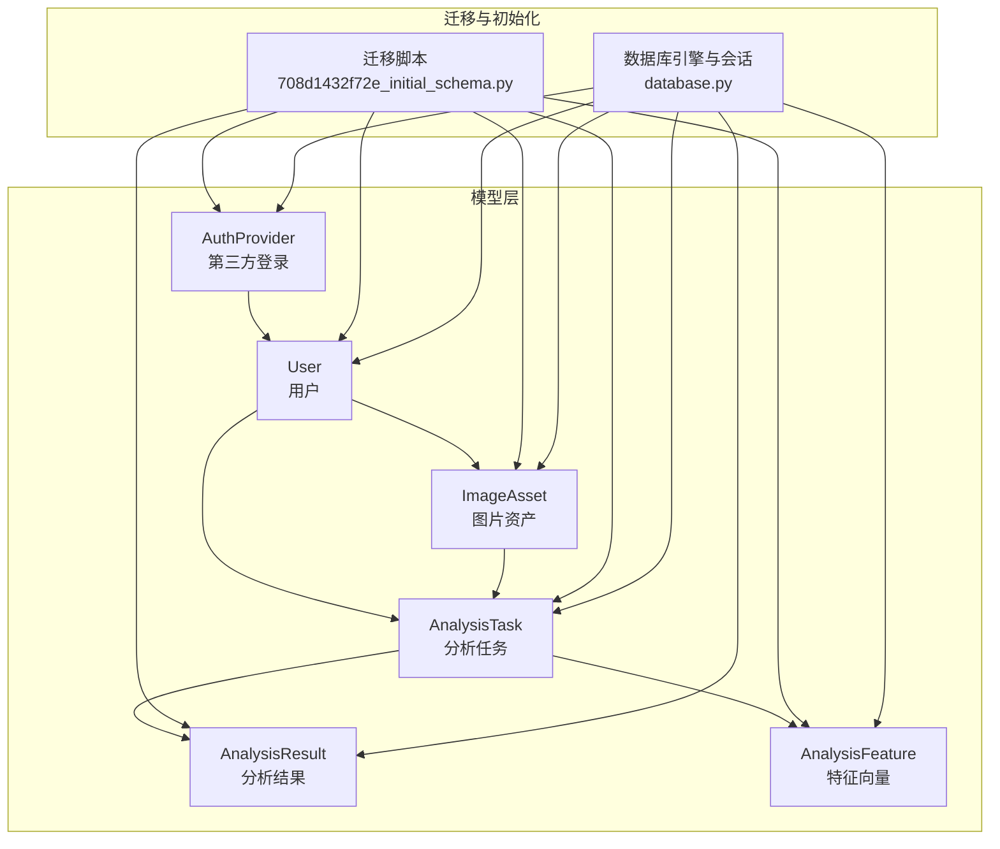
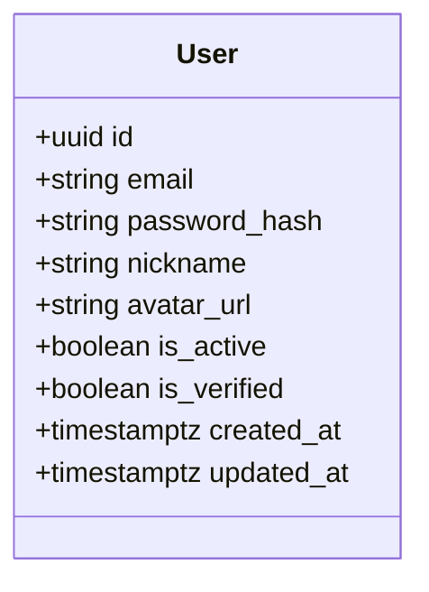
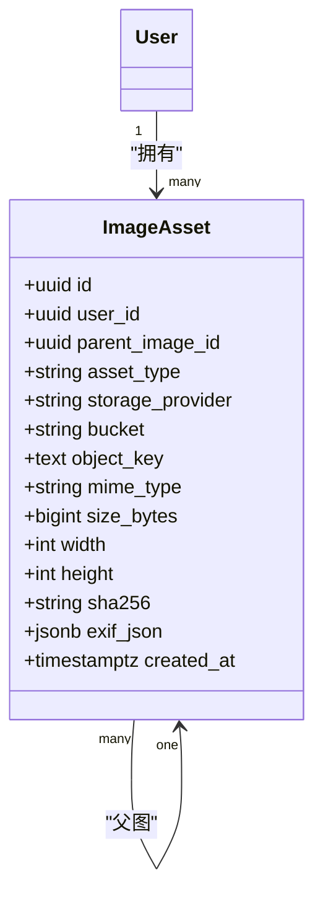
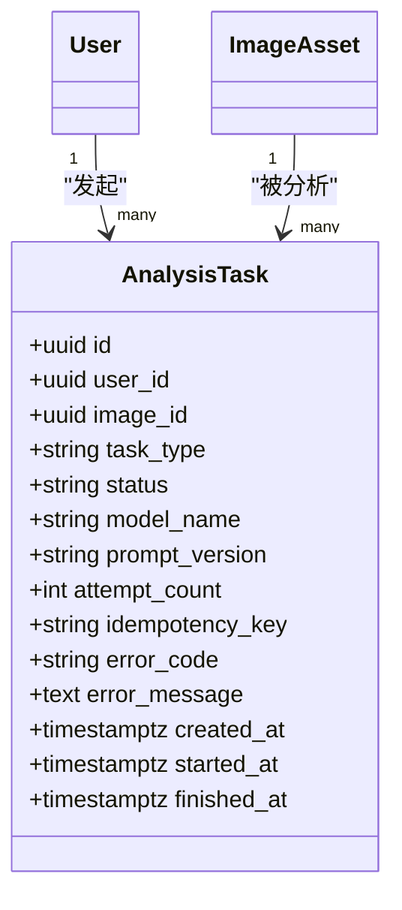
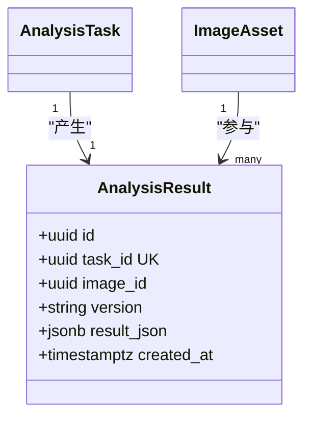
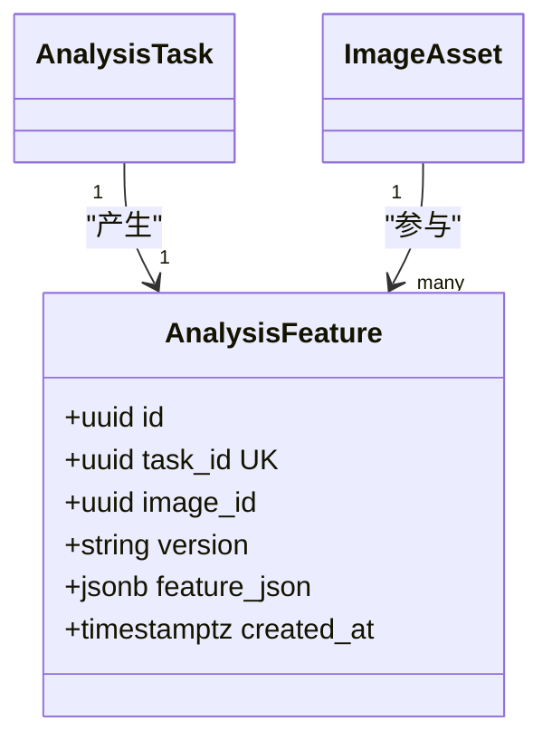
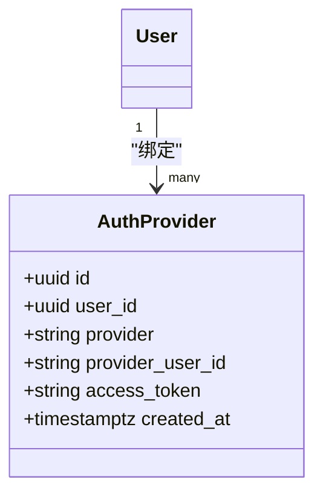
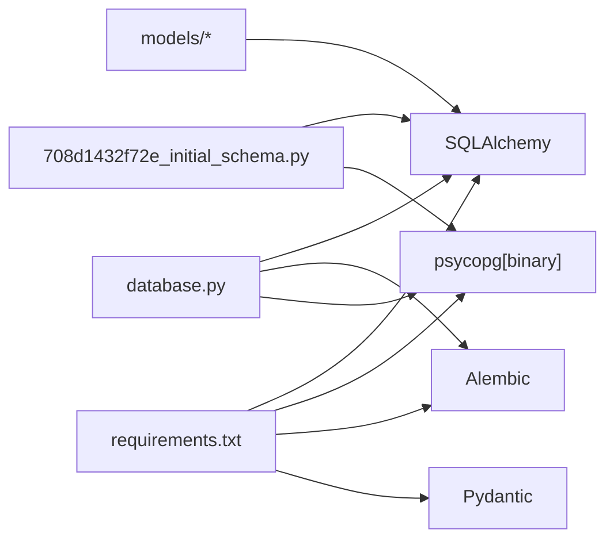

# 数据模型设计

<cite>
**本文引用的文件**
- [apps/api/app/models/base.py](file://apps/api/app/models/base.py)
- [apps/api/app/models/user.py](file://apps/api/app/models/user.py)
- [apps/api/app/models/image_asset.py](file://apps/api/app/models/image_asset.py)
- [apps/api/app/models/analysis_task.py](file://apps/api/app/models/analysis_task.py)
- [apps/api/app/models/analysis_result.py](file://apps/api/app/models/analysis_result.py)
- [apps/api/app/models/analysis_feature.py](file://apps/api/app/models/analysis_feature.py)
- [apps/api/app/models/auth_provider.py](file://apps/api/app/models/auth_provider.py)
- [apps/api/app/migrations/versions/708d1432f72e_initial_schema.py](file://apps/api/app/migrations/versions/708d1432f72e_initial_schema.py)
- [apps/api/app/schemas/user.py](file://apps/api/app/schemas/user.py)
- [apps/api/app/schemas/analysis.py](file://apps/api/app/schemas/analysis.py)
- [apps/api/app/schemas/image.py](file://apps/api/app/schemas/image.py)
- [apps/api/app/core/database.py](file://apps/api/app/core/database.py)
- [apps/api/app/deps.py](file://apps/api/app/deps.py)
- [apps/api/requirements.txt](file://apps/api/requirements.txt)
</cite>

## 目录
1. [简介](#简介)
2. [项目结构](#项目结构)
3. [核心组件](#核心组件)
4. [架构总览](#架构总览)
5. [详细组件分析](#详细组件分析)
6. [依赖分析](#依赖分析)
7. [性能考虑](#性能考虑)
8. [故障排查指南](#故障排查指南)
9. [结论](#结论)
10. [附录](#附录)

## 简介
本文件为“AI摄影教练”项目的数据库模型设计文档，聚焦于核心实体与关系：User（用户）、ImageAsset（图片资产）、AnalysisTask（分析任务）、AnalysisResult（分析结果）、AnalysisFeature（特征向量）、AuthProvider（第三方登录）。文档覆盖字段语义、数据类型、约束与索引设计、业务规则、数据完整性保障、查询优化与性能考量，并给出数据生命周期与迁移策略建议。

## 项目结构
后端采用 FastAPI + SQLAlchemy ORM + PostgreSQL + Alembic 迁移。模型定义集中在 app/models 下，迁移脚本在 app/migrations/versions 中，数据库连接与初始化在 app/core/database.py，依赖注入与认证在 app/deps.py。



**图表来源**
- [apps/api/app/models/user.py:12-28](file://apps/api/app/models/user.py#L12-L28)
- [apps/api/app/models/image_asset.py:10-32](file://apps/api/app/models/image_asset.py#L10-L32)
- [apps/api/app/models/analysis_task.py:10-36](file://apps/api/app/models/analysis_task.py#L10-L36)
- [apps/api/app/models/analysis_result.py:10-28](file://apps/api/app/models/analysis_result.py#L10-L28)
- [apps/api/app/models/analysis_feature.py:10-29](file://apps/api/app/models/analysis_feature.py#L10-L29)
- [apps/api/app/models/auth_provider.py:12-24](file://apps/api/app/models/auth_provider.py#L12-L24)
- [apps/api/app/migrations/versions/708d1432f72e_initial_schema.py:22-118](file://apps/api/app/migrations/versions/708d1432f72e_initial_schema.py#L22-L118)
- [apps/api/app/core/database.py:12-38](file://apps/api/app/core/database.py#L12-L38)

**章节来源**
- [apps/api/app/models/__init__.py:1-9](file://apps/api/app/models/__init__.py#L1-L9)
- [apps/api/app/core/database.py:12-38](file://apps/api/app/core/database.py#L12-L38)
- [apps/api/app/migrations/versions/708d1432f72e_initial_schema.py:22-118](file://apps/api/app/migrations/versions/708d1432f72e_initial_schema.py#L22-L118)

## 核心组件
本节对各核心实体进行字段级说明，含数据类型、约束、默认值、业务规则与索引设计要点。

- User（用户）
  - 字段与约束
    - id: 主键，UUID，默认生成
    - email: 唯一、非空，最大长度255
    - password_hash: 可空，OAuth用户可无密码
    - nickname: 可空，最大长度50
    - avatar_url: 可空
    - is_active: 布尔，默认True；用于软删除/封禁
    - is_verified: 布尔，默认False；邮箱或身份验证状态
    - created_at/updated_at: 时间戳，服务器默认值与更新触发
  - 业务规则
    - 登录态校验时需检查 is_active
    - 更新资料时 nickname 最大长度限制
  - 索引
    - 无显式索引，但 email 唯一约束具备唯一索引

- ImageAsset（图片资产）
  - 字段与约束
    - id: 主键，UUID
    - user_id: 外键 users.id，级联删除；非空
    - parent_image_id: 外键 image_assets.id，SET NULL；支持原图与派生图层级
    - asset_type: 枚举字符串，缺省"original"
    - storage_provider: 存储提供商标识，缺省"minio"
    - bucket/object_key: 唯一组合约束，定位存储对象
    - mime_type/size_bytes: 元信息与大小
    - width/height: 可空
    - sha256/exif_json: 可空
    - created_at: 服务器默认时间
  - 业务规则
    - 唯一约束确保同一桶内对象键唯一
    - 删除用户时级联删除其所有图片
    - 删除图片时父引用置空，保留层级关系
  - 索引
    - 无额外索引，唯一定位由唯一约束承担

- AnalysisTask（分析任务）
  - 字段与约束
    - id: 主键，UUID
    - user_id/image_id: 外键，均级联删除；非空
    - task_type: 任务类型，缺省"ANALYZE"
    - status: 状态枚举，缺省"PENDING"
    - model_name/prompt_version: 模型与提示词版本
    - attempt_count: 尝试次数，默认0
    - idempotency_key: 幂等键，可空
    - error_code/error_message: 错误码与消息，可空
    - created_at/started_at/finished_at: 时间戳
  - 业务规则
    - 任务与用户、图片强关联
    - 支持幂等提交（idempotency_key）
    - 状态机驱动（PENDING/RUNNING/SUCCEEDED/FAILED）
  - 索引
    - idx_analysis_tasks_user_created(user_id, created_at)
    - idx_analysis_tasks_status_created(status, created_at)

- AnalysisResult（分析结果）
  - 字段与约束
    - id: 主键，UUID
    - task_id: 外键 analysis_tasks.id，级联删除，唯一约束
    - image_id: 外键 image_assets.id，级联删除
    - version: 结果版本号，缺省"1.1"
    - result_json: JSON/JSONB，非空
    - created_at: 服务器默认时间
  - 业务规则
    - 一对一映射到 AnalysisTask（task_id 唯一）
    - 结果以 JSON 结构存储，便于检索与展示
  - 索引
    - idx_analysis_results_image_created(image_id, created_at)
    - idx_analysis_results_result_json_gin(result_json, GIN)

- AnalysisFeature（特征向量）
  - 字段与约束
    - id: 主键，UUID
    - task_id: 外键 analysis_tasks.id，级联删除，唯一约束
    - image_id: 外键 image_assets.id，级联删除
    - version: 特征版本号，缺省"1.0"
    - feature_json: JSON/JSONB，非空
    - created_at: 服务器默认时间
  - 业务规则
    - 一对一映射到 AnalysisTask（task_id 唯一）
    - 用于后续相似度检索或推荐
  - 索引
    - idx_analysis_features_image_created(image_id, created_at)
    - idx_analysis_features_feature_json_gin(feature_json, GIN)

- AuthProvider（第三方登录）
  - 字段与约束
    - id: 主键，UUID
    - user_id: 外键 users.id，带索引
    - provider/provider_user_id: 第三方提供商与用户标识
    - access_token: 可空
    - created_at: 服务器默认时间
  - 业务规则
    - 当前预留，暂未启用
  - 索引
    - ix_auth_providers_user_id(user_id)

**章节来源**
- [apps/api/app/models/user.py:12-28](file://apps/api/app/models/user.py#L12-L28)
- [apps/api/app/models/image_asset.py:10-32](file://apps/api/app/models/image_asset.py#L10-L32)
- [apps/api/app/models/analysis_task.py:10-36](file://apps/api/app/models/analysis_task.py#L10-L36)
- [apps/api/app/models/analysis_result.py:10-28](file://apps/api/app/models/analysis_result.py#L10-L28)
- [apps/api/app/models/analysis_feature.py:10-29](file://apps/api/app/models/analysis_feature.py#L10-L29)
- [apps/api/app/models/auth_provider.py:12-24](file://apps/api/app/models/auth_provider.py#L12-L24)
- [apps/api/app/migrations/versions/708d1432f72e_initial_schema.py:25-117](file://apps/api/app/migrations/versions/708d1432f72e_initial_schema.py#L25-L117)

## 架构总览
下图展示实体间的关系与外键约束，以及迁移脚本中定义的索引与唯一约束。

```mermaid
erDiagram
USERS {
uuid id PK
string email UK
string password_hash
string nickname
string avatar_url
boolean is_active
boolean is_verified
timestamptz created_at
timestamptz updated_at
}
AUTH_PROVIDERS {
uuid id PK
uuid user_id FK
string provider
string provider_user_id
string access_token
timestamptz created_at
}
IMAGE_ASSETS {
uuid id PK
uuid user_id FK
uuid parent_image_id FK
string asset_type
string storage_provider
string bucket
text object_key
string mime_type
bigint size_bytes
int width
int height
string sha256
jsonb exif_json
timestamptz created_at
}
ANALYSIS_TASKS {
uuid id PK
uuid user_id FK
uuid image_id FK
string task_type
string status
string model_name
string prompt_version
int attempt_count
string idempotency_key
string error_code
text error_message
timestamptz created_at
timestamptz started_at
timestamptz finished_at
}
ANALYSIS_FEATURES {
uuid id PK
uuid task_id UK FK
uuid image_id FK
string version
jsonb feature_json
timestamptz created_at
}
ANALYSIS_RESULTS {
uuid id PK
uuid task_id UK FK
uuid image_id FK
string version
jsonb result_json
timestamptz created_at
}
USERS ||--o{ IMAGE_ASSETS : "拥有"
IMAGE_ASSETS ||--o{ ANALYSIS_TASKS : "被分析"
USERS ||--o{ ANALYSIS_TASKS : "发起"
ANALYSIS_TASKS ||--|| ANALYSIS_FEATURES : "产生"
ANALYSIS_TASKS ||--|| ANALYSIS_RESULTS : "产生"
IMAGE_ASSETS ||--o{ ANALYSIS_FEATURES : "参与"
IMAGE_ASSETS ||--o{ ANALYSIS_RESULTS : "参与"
USERS ||--o{ AUTH_PROVIDERS : "绑定"
```

**图表来源**
- [apps/api/app/migrations/versions/708d1432f72e_initial_schema.py:25-117](file://apps/api/app/migrations/versions/708d1432f72e_initial_schema.py#L25-L117)
- [apps/api/app/models/user.py:12-28](file://apps/api/app/models/user.py#L12-L28)
- [apps/api/app/models/image_asset.py:10-32](file://apps/api/app/models/image_asset.py#L10-L32)
- [apps/api/app/models/analysis_task.py:10-36](file://apps/api/app/models/analysis_task.py#L10-L36)
- [apps/api/app/models/analysis_result.py:10-28](file://apps/api/app/models/analysis_result.py#L10-L28)
- [apps/api/app/models/analysis_feature.py:10-29](file://apps/api/app/models/analysis_feature.py#L10-L29)
- [apps/api/app/models/auth_provider.py:12-24](file://apps/api/app/models/auth_provider.py#L12-L24)

## 详细组件分析

### 用户模型 User
- 设计要点
  - 使用 UUID 作为主键，避免序列号泄露与分布式冲突
  - email 唯一约束，确保登录唯一性
  - is_active 与 is_verified 提供账户状态与验证状态管理
  - created_at/updated_at 使用服务器默认值，减少应用侧复杂度
- 业务规则
  - 登录流程通过依赖注入解析当前用户并校验 is_active
  - 资料更新时 nickname 最大长度限制
- 完整类图（仅展示关键属性与关系）



**图表来源**
- [apps/api/app/models/user.py:12-28](file://apps/api/app/models/user.py#L12-L28)
- [apps/api/app/schemas/user.py:8-17](file://apps/api/app/schemas/user.py#L8-L17)

**章节来源**
- [apps/api/app/models/user.py:12-28](file://apps/api/app/models/user.py#L12-L28)
- [apps/api/app/schemas/user.py:8-17](file://apps/api/app/schemas/user.py#L8-L17)
- [apps/api/app/deps.py:15-33](file://apps/api/app/deps.py#L15-L33)

### 图片资产模型 ImageAsset
- 设计要点
  - 唯一约束 (bucket, object_key) 保证对象键全局唯一
  - user_id 外键级联删除，确保数据一致性
  - parent_image_id 支持原图与派生图的层级关系，删除时 SET NULL
  - EXIF 与哈希字段便于去重与元信息管理
- 业务规则
  - 存储层抽象：storage_provider/bucket/object_key 统一定位
  - 图片上传后生成宽高、MIME、大小等元信息
- 完整类图（仅展示关键属性与关系）



**图表来源**
- [apps/api/app/models/image_asset.py:10-32](file://apps/api/app/models/image_asset.py#L10-L32)

**章节来源**
- [apps/api/app/models/image_asset.py:10-32](file://apps/api/app/models/image_asset.py#L10-L32)
- [apps/api/app/schemas/image.py:6-13](file://apps/api/app/schemas/image.py#L6-L13)

### 分析任务模型 AnalysisTask
- 设计要点
  - user_id 与 image_id 双外键，确保任务归属清晰
  - 状态字段与时间戳字段支持任务生命周期追踪
  - 幂等键 idempotency_key 避免重复提交
  - 两个复合索引分别按用户与状态+时间排序，支撑分页与筛选
- 业务规则
  - 任务类型与模型版本用于结果回溯与兼容性管理
  - 错误码与错误消息便于前端展示与重试策略
- 完整类图（仅展示关键属性与关系）



**图表来源**
- [apps/api/app/models/analysis_task.py:10-36](file://apps/api/app/models/analysis_task.py#L10-L36)

**章节来源**
- [apps/api/app/models/analysis_task.py:10-36](file://apps/api/app/models/analysis_task.py#L10-L36)
- [apps/api/app/schemas/analysis.py:8-31](file://apps/api/app/schemas/analysis.py#L8-L31)

### 分析结果模型 AnalysisResult
- 设计要点
  - 与 AnalysisTask 一一对应（task_id 唯一），保证结果幂等
  - result_json 采用 JSONB，配合 GIN 索引支持高效查询
  - image_id + created_at 复合索引支撑按图片维度的历史查询
- 业务规则
  - 结果版本号用于结构演进与兼容处理
  - 建议前端按版本号解析结果结构
- 完整类图（仅展示关键属性与关系）



**图表来源**
- [apps/api/app/models/analysis_result.py:10-28](file://apps/api/app/models/analysis_result.py#L10-L28)

**章节来源**
- [apps/api/app/models/analysis_result.py:10-28](file://apps/api/app/models/analysis_result.py#L10-L28)

### 特征向量模型 AnalysisFeature
- 设计要点
  - 与 AnalysisTask 一一对应（task_id 唯一），保证特征与任务强关联
  - feature_json 采用 JSONB，配合 GIN 索引支持相似度检索
  - image_id + created_at 复合索引支撑按图片维度的历史查询
- 业务规则
  - 版本号用于特征结构演进
  - 可用于后续相似图片检索或推荐系统
- 完整类图（仅展示关键属性与关系）



**图表来源**
- [apps/api/app/models/analysis_feature.py:10-29](file://apps/api/app/models/analysis_feature.py#L10-L29)

**章节来源**
- [apps/api/app/models/analysis_feature.py:10-29](file://apps/api/app/models/analysis_feature.py#L10-L29)

### 第三方登录模型 AuthProvider
- 设计要点
  - 预留第三方登录绑定，当前未启用
  - user_id 外键 + 索引，便于按用户查询绑定
- 业务规则
  - 后续可扩展 OAuth2 流程与令牌管理
- 完整类图（仅展示关键属性与关系）



**图表来源**
- [apps/api/app/models/auth_provider.py:12-24](file://apps/api/app/models/auth_provider.py#L12-L24)

**章节来源**
- [apps/api/app/models/auth_provider.py:12-24](file://apps/api/app/models/auth_provider.py#L12-L24)

### 数据访问模式与查询优化
- 访问模式
  - 依赖注入获取 Session，使用 ORM 查询与事务管理
  - 通过复合索引实现高频查询（按用户、状态、时间）
- 查询优化建议
  - AnalysisTask
    - 按用户分页：利用 idx_analysis_tasks_user_created
    - 按状态筛选：利用 idx_analysis_tasks_status_created
  - AnalysisResult/AnalysisFeature
    - 按图片历史：利用 idx_analysis_results_image_created / idx_analysis_features_image_created
    - JSONB 查询：利用 idx_analysis_results_result_json_gin / idx_analysis_features_feature_json_gin
- 性能考量
  - 使用 JSONB 与 GIN 索引提升半结构化数据检索效率
  - 避免 N+1 查询，优先使用 join 或批量加载
  - 对高频字段建立合适索引，平衡写入与读取性能

**章节来源**
- [apps/api/app/core/database.py:19-38](file://apps/api/app/core/database.py#L19-L38)
- [apps/api/app/deps.py:15-40](file://apps/api/app/deps.py#L15-L40)
- [apps/api/app/migrations/versions/708d1432f72e_initial_schema.py:88-117](file://apps/api/app/migrations/versions/708d1432f72e_initial_schema.py#L88-L117)

## 依赖分析
- 外部依赖
  - SQLAlchemy 2.x：ORM 与方言支持
  - psycopg[binary]：PostgreSQL 驱动
  - Alembic：数据库迁移
  - Pydantic：数据校验与序列化
- 内部依赖
  - 模型层依赖 Base（declarative_base）
  - 迁移脚本定义表结构、索引与约束
  - 依赖注入模块依赖数据库会话与安全模块



**图表来源**
- [apps/api/requirements.txt:1-19](file://apps/api/requirements.txt#L1-L19)
- [apps/api/app/core/database.py:12-38](file://apps/api/app/core/database.py#L12-L38)
- [apps/api/app/migrations/versions/708d1432f72e_initial_schema.py:10-12](file://apps/api/app/migrations/versions/708d1432f72e_initial_schema.py#L10-L12)

**章节来源**
- [apps/api/requirements.txt:1-19](file://apps/api/requirements.txt#L1-L19)
- [apps/api/app/core/database.py:12-38](file://apps/api/app/core/database.py#L12-L38)

## 性能考虑
- 索引策略
  - 复合索引：按用户与时间、按状态与时间，满足常见分页与筛选
  - JSONB GIN：加速半结构化数据检索
- 写入优化
  - 使用 JSONB 存储结构化结果，减少拆表带来的 JOIN 成本
  - 幂等键避免重复写入
- 读取优化
  - 通过 task_id 唯一约束保证结果/特征的一对一映射，简化查询
  - 利用 created_at 排序实现“最近优先”的历史列表
- 缓存与异步
  - 结果与特征可用于缓存热点数据
  - 大规模检索建议异步化并结合分页

## 故障排查指南
- 常见问题
  - 无法登录：确认 is_active 为真，Token 未过期
  - 重复提交任务：使用 idempotency_key 避免重复
  - 查询性能差：检查是否命中复合索引与 GIN 索引
- 排查步骤
  - 核对迁移是否执行至最新版本
  - 检查外键约束与唯一约束是否满足
  - 关注 created_at/started_at/finished_at 的时序一致性
- 相关实现参考
  - 依赖注入与认证：[apps/api/app/deps.py:15-33](file://apps/api/app/deps.py#L15-L33)
  - 初始化数据库与迁移：[apps/api/app/core/database.py:27-38](file://apps/api/app/core/database.py#L27-L38)
  - 迁移脚本：[apps/api/app/migrations/versions/708d1432f72e_initial_schema.py:22-118](file://apps/api/app/migrations/versions/708d1432f72e_initial_schema.py#L22-L118)

**章节来源**
- [apps/api/app/deps.py:15-33](file://apps/api/app/deps.py#L15-L33)
- [apps/api/app/core/database.py:27-38](file://apps/api/app/core/database.py#L27-L38)
- [apps/api/app/migrations/versions/708d1432f72e_initial_schema.py:22-118](file://apps/api/app/migrations/versions/708d1432f72e_initial_schema.py#L22-L118)

## 结论
本数据模型围绕用户、图片资产、分析任务与结果/特征构建，采用 UUID 主键、JSONB 存储与 GIN 索引，兼顾可扩展性与查询效率。迁移脚本统一管理结构变更，配合复合索引满足高频查询场景。建议在生产环境持续监控索引命中率与查询耗时，按业务增长迭代索引策略与缓存方案。

## 附录
- 数据生命周期管理
  - 任务与结果：按业务策略定期归档或清理历史任务
  - 图片资产：结合存储配额与去重策略清理冗余对象
  - 用户数据：遵循隐私政策进行定期清理与匿名化
- 迁移策略
  - 使用 Alembic 管理版本，禁止直接修改生产库结构
  - 新增索引与 GIN 索引需评估写入成本与停机窗口
  - 迁移前备份，灰度发布，逐步扩大范围