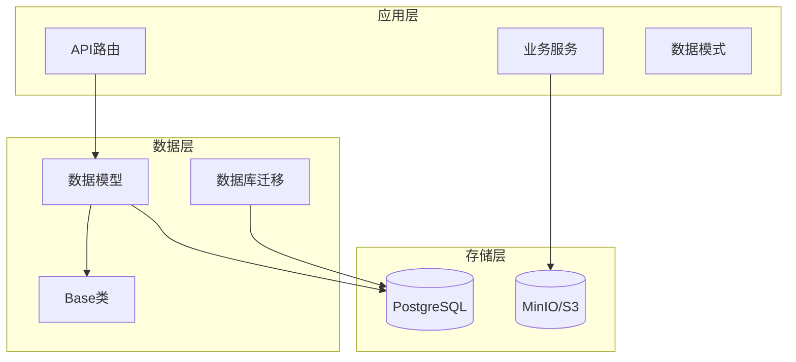
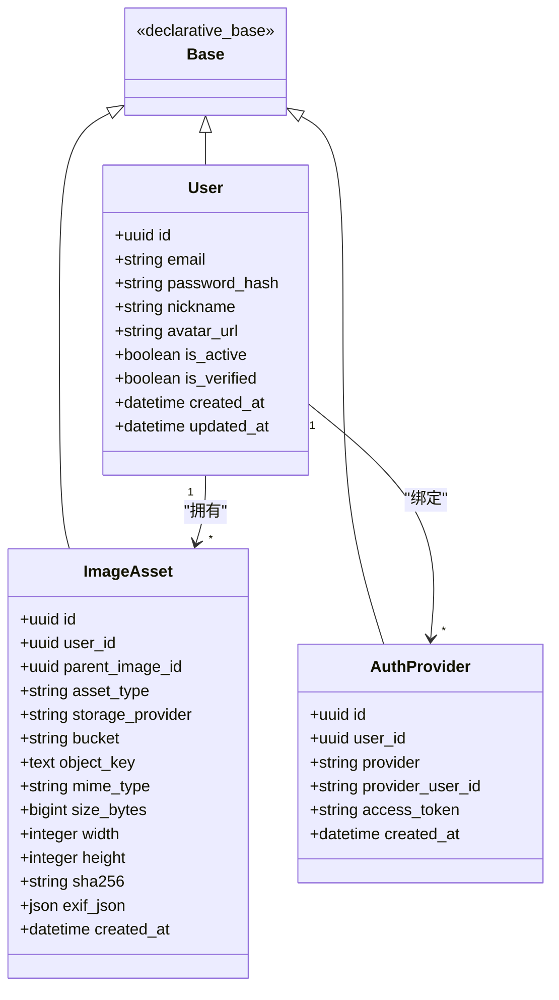
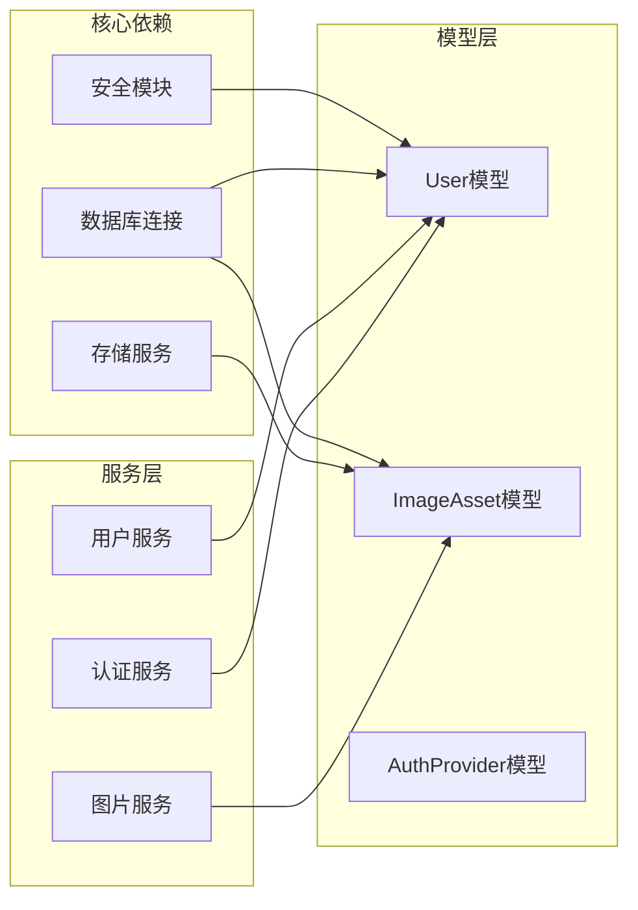

# 核心数据模型

<cite>
**本文档引用的文件**
- [base.py](file://apps/api/app/models/base.py)
- [user.py](file://apps/api/app/models/user.py)
- [image_asset.py](file://apps/api/app/models/image_asset.py)
- [auth_provider.py](file://apps/api/app/models/auth_provider.py)
- [__init__.py](file://apps/api/app/models/__init__.py)
- [708d1432f72e_initial_schema.py](file://apps/api/app/migrations/versions/708d1432f72e_initial_schema.py)
- [user.py](file://apps/api/app/schemas/user.py)
- [image.py](file://apps/api/app/schemas/image.py)
- [router.py](file://apps/api/app/modules/users/router.py)
- [router.py](file://apps/api/app/modules/images/router.py)
- [deps.py](file://apps/api/app/deps.py)
</cite>

## 目录
1. [简介](#简介)
2. [项目结构](#项目结构)
3. [核心组件](#核心组件)
4. [架构概览](#架构概览)
5. [详细组件分析](#详细组件分析)
6. [依赖分析](#依赖分析)
7. [性能考虑](#性能考虑)
8. [故障排除指南](#故障排除指南)
9. [结论](#结论)

## 简介

AI摄影教练项目采用基于SQLAlchemy ORM的数据模型设计，专注于用户管理和图片资产管理。本文档深入分析User用户模型和ImageAsset图片资产模型的设计理念、字段定义、数据类型和业务约束，解释认证相关字段、权限控制字段、图片元数据字段的设计考虑，并详细说明模型继承自Base类的ORM映射机制、主键生成策略和索引设计。

## 项目结构

项目采用分层架构设计，核心数据模型位于`apps/api/app/models/`目录下，通过SQLAlchemy ORM实现数据库映射。

**图表来源**
- [base.py:1-5](file://apps/api/app/models/base.py#L1-L5)
- [user.py:1-28](file://apps/api/app/models/user.py#L1-L28)
- [image_asset.py:1-32](file://apps/api/app/models/image_asset.py#L1-L32)

**章节来源**
- [base.py:1-5](file://apps/api/app/models/base.py#L1-L5)
- [__init__.py:1-9](file://apps/api/app/models/__init__.py#L1-L9)

## 核心组件

### Base类ORM映射机制

所有数据模型都继承自统一的Base类，该类通过SQLAlchemy的声明式基类实现ORM映射。

- **继承关系**: 所有模型类都继承自Base类
- **映射机制**: 使用SQLAlchemy的declarative_base()创建映射基类
- **统一管理**: 通过models/__init__.py导出所有模型类

### 主键生成策略

系统采用UUID作为主键生成策略，确保分布式环境下的唯一性：

- **UUIDv4生成**: 每个新记录自动分配唯一UUID
- **数据库存储**: 使用Uuid(as_uuid=True)类型存储UUID
- **性能优势**: 避免序列号冲突，支持水平扩展

### 数据库索引设计

关键字段建立了相应的数据库索引以优化查询性能：

- **唯一约束**: 用户邮箱唯一性约束
- **外键索引**: 外键字段建立索引提高关联查询效率
- **复合索引**: 分析任务表建立复合索引优化查询

**章节来源**
- [base.py:1-5](file://apps/api/app/models/base.py#L1-L5)
- [user.py:15-27](file://apps/api/app/models/user.py#L15-L27)
- [image_asset.py:14-31](file://apps/api/app/models/image_asset.py#L14-L31)
- [708d1432f72e_initial_schema.py:25-68](file://apps/api/app/migrations/versions/708d1432f72e_initial_schema.py#L25-L68)

## 架构概览

系统采用三层架构设计，清晰分离关注点：

**图表来源**
- [user.py:12-28](file://apps/api/app/models/user.py#L12-L28)
- [image_asset.py:10-32](file://apps/api/app/models/image_asset.py#L10-L32)
- [auth_provider.py:12-24](file://apps/api/app/models/auth_provider.py#L12-L24)

## 详细组件分析

### User用户模型

User模型是系统的核心实体，负责用户身份管理和认证控制。

#### 字段定义与数据类型

| 字段名 | 类型 | 约束 | 描述 |
|--------|------|------|------|
| id | UUID | 主键, 默认UUIDv4 | 用户唯一标识符 |
| email | String(255) | 唯一, 非空 | 用户邮箱地址 |
| password_hash | String | 可空 | 密码哈希值 |
| nickname | String(50) | 可空 | 用户昵称 |
| avatar_url | String | 可空 | 头像图片URL |
| is_active | Boolean | 默认True | 用户账户状态 |
| is_verified | Boolean | 默认False | 邮箱验证状态 |
| created_at | DateTime(timezone=True) | 非空, server_default | 创建时间 |
| updated_at | DateTime(timezone=True) | 可空, onupdate | 更新时间 |

#### 认证相关字段设计

- **密码哈希字段**: password_hash支持None值，允许OAuth用户无需密码
- **账户状态控制**: is_active字段用于禁用/启用用户账户
- **邮箱验证**: is_verified字段跟踪邮箱验证状态
- **时间戳管理**: 自动维护创建和更新时间

#### 权限控制字段

- **激活状态**: is_active控制用户是否可以登录系统
- **验证状态**: is_verified确保邮箱有效性
- **访问控制**: 结合JWT令牌实现细粒度权限控制

**章节来源**
- [user.py:12-28](file://apps/api/app/models/user.py#L12-L28)
- [708d1432f72e_initial_schema.py:25-37](file://apps/api/app/migrations/versions/708d1432f72e_initial_schema.py#L25-L37)

### ImageAsset图片资产模型

ImageAsset模型专门处理图片资源的元数据和存储信息。

#### 图片元数据字段设计

| 字段名 | 类型 | 约束 | 描述 |
|--------|------|------|------|
| id | UUID | 主键, 默认UUIDv4 | 图片资产唯一标识符 |
| user_id | UUID | 外键(users.id), 非空 | 所属用户ID |
| parent_image_id | UUID | 外键(image_assets.id) | 父图片ID(支持版本控制) |
| asset_type | String(16) | 默认"original" | 资产类型 |
| storage_provider | String(16) | 默认"minio" | 存储提供商 |
| bucket | String(128) | 非空 | 存储桶名称 |
| object_key | Text | 非空 | 对象存储键 |
| mime_type | String(64) | 非空 | MIME类型 |
| size_bytes | BigInteger | 非空 | 文件大小(字节) |
| width | Integer | 可空 | 图片宽度 |
| height | Integer | 可空 | 图片高度 |
| sha256 | String(64) | 可空 | 文件SHA256哈希 |
| exif_json | JSON | 可空 | EXIF元数据 |
| created_at | DateTime(timezone=True) | 非空, server_default | 创建时间 |

#### 存储约束设计

- **唯一约束**: (bucket, object_key)组合唯一，防止重复存储
- **级联删除**: 用户删除时级联删除其所有图片资产
- **可选父引用**: 支持图片版本控制和历史版本管理

#### 图片处理字段

- **尺寸信息**: width和height字段存储原始图片尺寸
- **哈希校验**: sha256字段用于文件完整性验证
- **元数据存储**: exif_json字段保存EXIF信息
- **类型标识**: asset_type字段区分原图、缩略图等不同类型

**章节来源**
- [image_asset.py:10-32](file://apps/api/app/models/image_asset.py#L10-L32)
- [708d1432f72e_initial_schema.py:49-68](file://apps/api/app/migrations/versions/708d1432f72e_initial_schema.py#L49-L68)

### AuthProvider第三方认证模型

AuthProvider模型预留第三方认证功能，支持Google、GitHub、微信等OAuth提供商。

#### 设计特点

- **预留架构**: 为未来OAuth功能扩展预留表结构
- **令牌存储**: 支持存储访问令牌用于第三方API调用
- **用户关联**: 通过user_id字段与User模型建立关联

**章节来源**
- [auth_provider.py:12-24](file://apps/api/app/models/auth_provider.py#L12-L24)

## 依赖分析

系统采用模块化设计，各组件间依赖关系清晰：

**图表来源**
- [deps.py:15-33](file://apps/api/app/deps.py#L15-L33)
- [router.py:17-26](file://apps/api/app/modules/users/router.py#L17-L26)
- [router.py:20-25](file://apps/api/app/modules/images/router.py#L20-L25)

### 关键依赖关系

- **认证依赖**: 所有受保护路由依赖JWT令牌验证
- **数据库依赖**: 所有模型操作依赖SQLAlchemy会话
- **存储依赖**: 图片上传依赖对象存储服务
- **安全依赖**: 密码处理依赖安全模块

**章节来源**
- [deps.py:1-41](file://apps/api/app/deps.py#L1-L41)
- [router.py:1-71](file://apps/api/app/modules/users/router.py#L1-L71)
- [router.py:1-77](file://apps/api/app/modules/images/router.py#L1-L77)

## 性能考虑

### 查询优化策略

1. **索引设计**
   - 用户邮箱建立唯一索引
   - 外键字段建立普通索引
   - 复合索引优化常用查询模式

2. **缓存策略**
   - 用户信息缓存减少数据库查询
   - 图片元数据缓存提升访问速度

3. **批量操作**
   - 支持批量图片上传
   - 批量元数据查询优化

### 存储优化

- **对象存储**: 使用MinIO/S3存储大文件
- **元数据分离**: 将大文件内容与元数据分离存储
- **压缩策略**: 支持图片格式转换和压缩

## 故障排除指南

### 常见问题及解决方案

#### 用户认证问题

**问题**: JWT令牌验证失败
- 检查令牌格式和有效期
- 验证用户账户状态(is_active)
- 确认数据库连接正常

**问题**: 密码修改失败
- 确认当前密码正确
- 验证OAuth账户无法修改密码
- 检查密码长度要求

#### 图片上传问题

**问题**: 图片上传失败
- 验证文件类型为图片格式
- 检查文件大小限制
- 确认存储服务可用性

**问题**: 图片元数据缺失
- 验证EXIF信息读取
- 检查图片格式兼容性
- 确认存储桶配置正确

**章节来源**
- [router.py:51-70](file://apps/api/app/modules/users/router.py#L51-L70)
- [router.py:20-38](file://apps/api/app/modules/images/router.py#L20-L38)

## 结论

AI摄影教练项目的核心数据模型设计体现了现代Web应用的最佳实践：

1. **统一架构**: 基于SQLAlchemy ORM的统一数据访问层
2. **扩展性**: UUID主键设计支持水平扩展
3. **安全性**: 完整的用户认证和授权机制
4. **性能**: 合理的索引设计和查询优化
5. **可维护性**: 清晰的模块划分和依赖关系

User和ImageAsset模型为系统的用户管理和图片资产管理提供了坚实的数据基础，支持未来的功能扩展和性能优化需求。