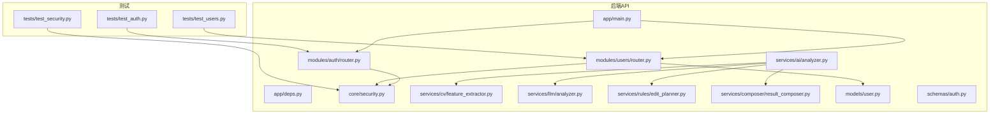
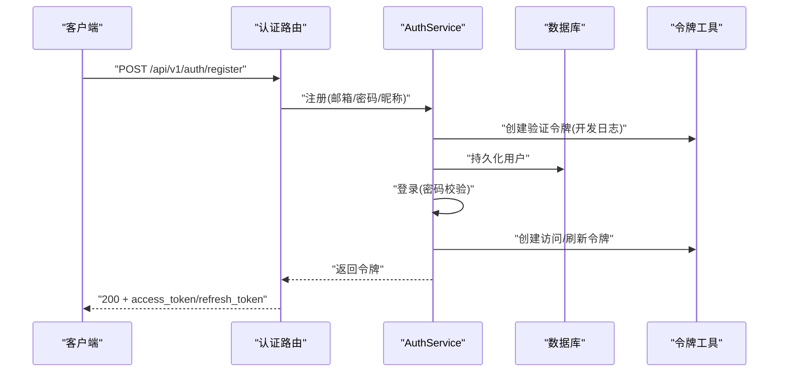
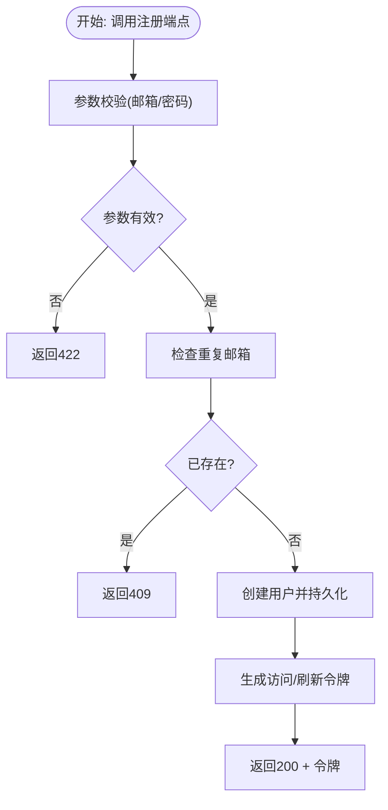
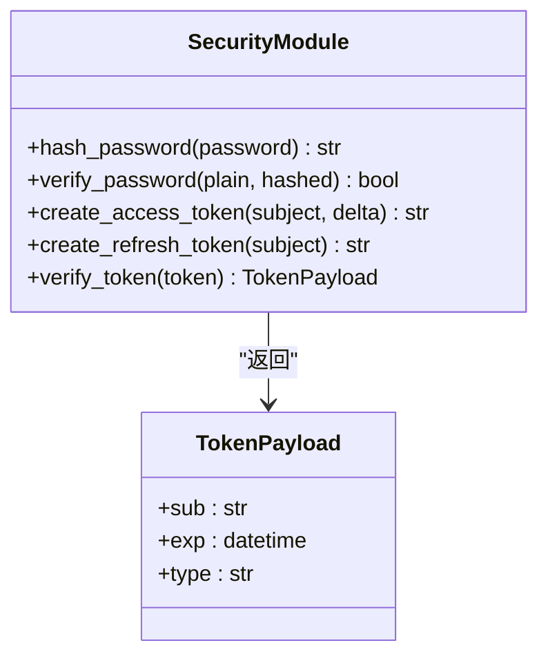
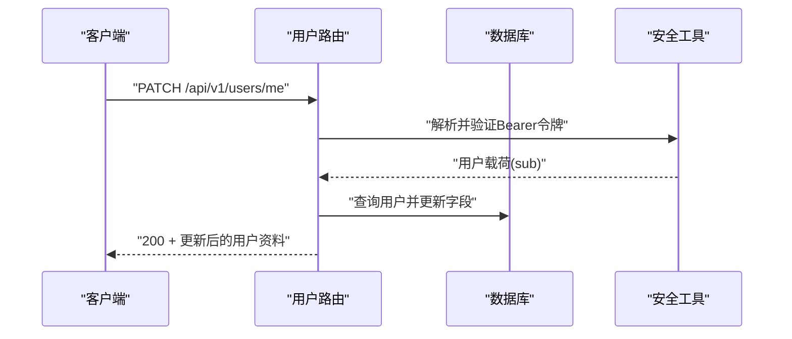
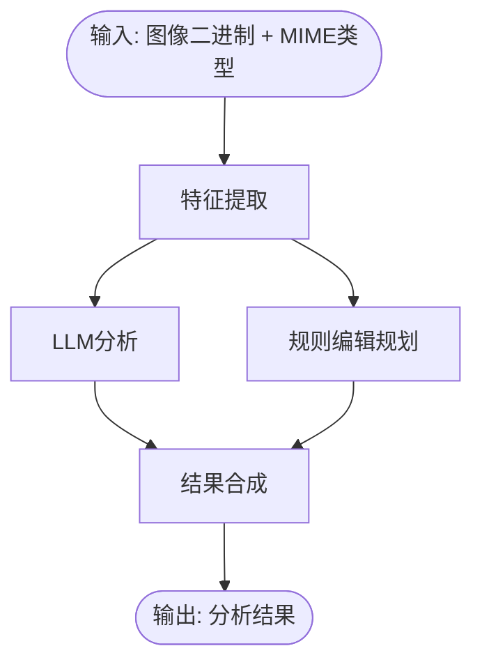
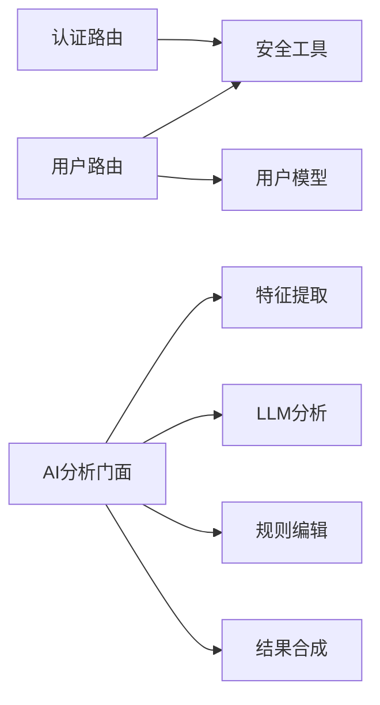

# 测试策略

<cite>
**本文引用的文件**
- [apps/api/tests/test_auth.py](file://apps/api/tests/test_auth.py)
- [apps/api/tests/test_security.py](file://apps/api/tests/test_security.py)
- [apps/api/tests/test_users.py](file://apps/api/tests/test_users.py)
- [apps/api/app/main.py](file://apps/api/app/main.py)
- [apps/api/app/deps.py](file://apps/api/app/deps.py)
- [apps/api/app/core/security.py](file://apps/api/app/core/security.py)
- [apps/api/app/modules/auth/router.py](file://apps/api/app/modules/auth/router.py)
- [apps/api/app/modules/users/router.py](file://apps/api/app/modules/users/router.py)
- [apps/api/app/services/ai/analyzer.py](file://apps/api/app/services/ai/analyzer.py)
- [apps/api/app/services/cv/feature_extractor.py](file://apps/api/app/services/cv/feature_extractor.py)
- [apps/api/app/services/llm/analyzer.py](file://apps/api/app/services/llm/analyzer.py)
- [apps/api/app/services/rules/edit_planner.py](file://apps/api/app/services/rules/edit_planner.py)
- [apps/api/app/services/composer/result_composer.py](file://apps/api/app/services/composer/result_composer.py)
- [apps/api/app/models/user.py](file://apps/api/app/models/user.py)
- [apps/api/app/schemas/auth.py](file://apps/api/app/schemas/auth.py)
</cite>

## 目录
1. [引言](#引言)
2. [项目结构](#项目结构)
3. [核心组件](#核心组件)
4. [架构总览](#架构总览)
5. [详细组件分析](#详细组件分析)
6. [依赖分析](#依赖分析)
7. [性能考虑](#性能考虑)
8. [故障排查指南](#故障排查指南)
9. [结论](#结论)
10. [附录](#附录)

## 引言
本测试策略文档面向“AI摄影教练”项目，系统化阐述单元测试、集成测试与API测试的实施方法，明确测试框架选择与配置（pytest）、测试数据管理策略、测试用例设计原则与覆盖率目标、自动化测试流程与持续集成配置建议、性能测试与安全测试方案、端到端测试思路、最佳实践与调试技巧，以及测试环境搭建与维护要点。文档以仓库现有实现为依据，结合代码结构与依赖关系，给出可落地的测试方案。

## 项目结构
后端采用FastAPI应用，按功能模块组织，测试位于apps/api/tests目录下，分别覆盖认证、安全工具与用户模块。前端位于apps/web，采用Vite+Vue+TypeScript；工作流服务由Celery任务队列支撑，分析流程由AI服务子模块协作完成。

图表来源
- [apps/api/app/main.py:1-36](file://apps/api/app/main.py#L1-L36)
- [apps/api/app/deps.py:1-41](file://apps/api/app/deps.py#L1-L41)
- [apps/api/app/modules/auth/router.py:1-93](file://apps/api/app/modules/auth/router.py#L1-L93)
- [apps/api/app/modules/users/router.py:1-71](file://apps/api/app/modules/users/router.py#L1-L71)
- [apps/api/app/core/security.py:1-72](file://apps/api/app/core/security.py#L1-L72)
- [apps/api/app/services/ai/analyzer.py:1-27](file://apps/api/app/services/ai/analyzer.py#L1-L27)
- [apps/api/app/services/cv/feature_extractor.py:1-98](file://apps/api/app/services/cv/feature_extractor.py#L1-L98)
- [apps/api/app/services/llm/analyzer.py:1-139](file://apps/api/app/services/llm/analyzer.py#L1-L139)
- [apps/api/app/services/rules/edit_planner.py:1-97](file://apps/api/app/services/rules/edit_planner.py#L1-L97)
- [apps/api/app/services/composer/result_composer.py:1-99](file://apps/api/app/services/composer/result_composer.py#L1-L99)
- [apps/api/app/models/user.py:1-28](file://apps/api/app/models/user.py#L1-L28)
- [apps/api/app/schemas/auth.py:1-37](file://apps/api/app/schemas/auth.py#L1-L37)
- [apps/api/tests/test_auth.py:1-191](file://apps/api/tests/test_auth.py#L1-L191)
- [apps/api/tests/test_security.py:1-98](file://apps/api/tests/test_security.py#L1-L98)
- [apps/api/tests/test_users.py:1-144](file://apps/api/tests/test_users.py#L1-L144)

章节来源
- [apps/api/app/main.py:1-36](file://apps/api/app/main.py#L1-L36)
- [apps/api/tests/test_auth.py:1-191](file://apps/api/tests/test_auth.py#L1-L191)
- [apps/api/tests/test_security.py:1-98](file://apps/api/tests/test_security.py#L1-L98)
- [apps/api/tests/test_users.py:1-144](file://apps/api/tests/test_users.py#L1-L144)

## 核心组件
- 认证与安全
  - JWT工具：密码哈希、令牌创建与校验、载荷结构
  - HTTP Bearer认证依赖注入：从Header解析并校验令牌，解析用户
- 用户模块
  - 用户资料查询、更新、改密等端点
  - 用户模型字段与约束
- AI分析流水线
  - 特征提取、LLM分析、规则编辑规划、结果合成
- 测试现状
  - 认证模块：注册/登录/刷新/登出/忘记密码等端点的集成测试
  - 安全模块：密码哈希、令牌创建与校验的单元测试
  - 用户模块：资料查询/更新/改密的集成测试

章节来源
- [apps/api/app/core/security.py:1-72](file://apps/api/app/core/security.py#L1-L72)
- [apps/api/app/deps.py:1-41](file://apps/api/app/deps.py#L1-L41)
- [apps/api/app/models/user.py:1-28](file://apps/api/app/models/user.py#L1-L28)
- [apps/api/app/modules/users/router.py:1-71](file://apps/api/app/modules/users/router.py#L1-L71)
- [apps/api/app/services/ai/analyzer.py:1-27](file://apps/api/app/services/ai/analyzer.py#L1-L27)
- [apps/api/tests/test_auth.py:1-191](file://apps/api/tests/test_auth.py#L1-L191)
- [apps/api/tests/test_security.py:1-98](file://apps/api/tests/test_security.py#L1-L98)
- [apps/api/tests/test_users.py:1-144](file://apps/api/tests/test_users.py#L1-L144)

## 架构总览
以下序列图展示认证端到端流程，体现测试关注点：请求进入、依赖注入、业务处理、响应返回与状态码断言。

图表来源
- [apps/api/app/modules/auth/router.py:24-39](file://apps/api/app/modules/auth/router.py#L24-L39)
- [apps/api/app/core/security.py:32-46](file://apps/api/app/core/security.py#L32-L46)
- [apps/api/app/models/user.py:12-28](file://apps/api/app/models/user.py#L12-L28)

## 详细组件分析

### 认证模块测试策略
- 测试范围
  - 注册：成功/重复邮箱/非法邮箱/密码长度不足
  - 登录：成功/密码错误/邮箱不存在
  - 刷新：成功/无效令牌
  - 登出：返回200
  - 忘记密码：存在/不存在邮箱均返回200（不泄露信息）
  - 重置密码：无效令牌返回400
- 数据与环境
  - 使用SQLite内存库，静态连接池，每个测试前重建表，结束后清理
  - 通过依赖覆盖将数据库会话替换为测试会话
  - TestClient启动应用，禁用startup初始化以避免外部依赖
- 断言重点
  - 状态码与响应体字段（access_token/refresh_token/token_type）
  - 错误场景的HTTP状态码与语义一致性

图表来源
- [apps/api/tests/test_auth.py:51-90](file://apps/api/tests/test_auth.py#L51-L90)
- [apps/api/app/modules/auth/router.py:24-39](file://apps/api/app/modules/auth/router.py#L24-L39)

章节来源
- [apps/api/tests/test_auth.py:1-191](file://apps/api/tests/test_auth.py#L1-L191)
- [apps/api/app/modules/auth/router.py:1-93](file://apps/api/app/modules/auth/router.py#L1-L93)

### 安全模块测试策略（单元测试）
- 测试范围
  - 密码哈希：输出非明文、不同密码产生不同哈希
  - 密码校验：正确/错误密码验证结果
  - 令牌创建：access/refresh令牌字符串非空
  - 令牌验证：有效载荷解析、无效/过期令牌抛出401
- 设计原则
  - 单元测试隔离底层依赖（数据库、网络），确保纯函数行为可预测
  - 使用参数化与边界值覆盖（过期时间、非法输入）

图表来源
- [apps/api/app/core/security.py:12-72](file://apps/api/app/core/security.py#L12-L72)

章节来源
- [apps/api/tests/test_security.py:1-98](file://apps/api/tests/test_security.py#L1-L98)
- [apps/api/app/core/security.py:1-72](file://apps/api/app/core/security.py#L1-L72)

### 用户模块测试策略
- 测试范围
  - 获取资料：已认证/未认证场景
  - 更新资料：昵称/头像更新与长度限制
  - 修改密码：正确旧密码+新密码、错误旧密码、新密码长度不足
- 数据与环境
  - 专用SQLite文件，仅创建users表，避免PostgreSQL专有类型
  - 通过fixture直接插入测试用户，生成Bearer令牌，构造认证头
  - 临时禁用startup事件，避免连接真实数据库
- 断言重点
  - 成功场景字段一致性与长度约束
  - 失败场景HTTP状态码（400/401/422）

图表来源
- [apps/api/tests/test_users.py:77-119](file://apps/api/tests/test_users.py#L77-L119)
- [apps/api/app/modules/users/router.py:35-48](file://apps/api/app/modules/users/router.py#L35-L48)
- [apps/api/app/core/security.py:49-72](file://apps/api/app/core/security.py#L49-L72)

章节来源
- [apps/api/tests/test_users.py:1-144](file://apps/api/tests/test_users.py#L1-L144)
- [apps/api/app/modules/users/router.py:1-71](file://apps/api/app/modules/users/router.py#L1-L71)
- [apps/api/app/models/user.py:1-28](file://apps/api/app/models/user.py#L1-L28)

### AI分析服务测试策略（单元测试）
- 组件职责
  - 特征提取：图像统计、主体框、高光/阴影区域、地平线辅助线
  - LLM分析：基于特征生成总结、建议与评分
  - 规则编辑：基于主体位置与亮度制定裁剪与曝光动作
  - 结果合成：汇总特征、建议、注释与编辑动作
- 测试策略
  - 单元测试：针对各服务类的纯函数行为，使用固定输入与期望输出断言
  - 缓存行为：验证lru_cache缓存实例唯一性
  - 边界条件：极端亮度、主体居中/偏移、空高光/阴影区域
- 关键断言
  - 输出结构完整性（版本号、摘要、建议列表、评分字典、注释与动作）
  - 几何注释与建议的关联关系

图表来源
- [apps/api/app/services/ai/analyzer.py:10-26](file://apps/api/app/services/ai/analyzer.py#L10-L26)
- [apps/api/app/services/cv/feature_extractor.py:15-91](file://apps/api/app/services/cv/feature_extractor.py#L15-L91)
- [apps/api/app/services/llm/analyzer.py:8-118](file://apps/api/app/services/llm/analyzer.py#L8-L118)
- [apps/api/app/services/rules/edit_planner.py:6-91](file://apps/api/app/services/rules/edit_planner.py#L6-L91)
- [apps/api/app/services/composer/result_composer.py:8-23](file://apps/api/app/services/composer/result_composer.py#L8-L23)

章节来源
- [apps/api/app/services/ai/analyzer.py:1-27](file://apps/api/app/services/ai/analyzer.py#L1-L27)
- [apps/api/app/services/cv/feature_extractor.py:1-98](file://apps/api/app/services/cv/feature_extractor.py#L1-L98)
- [apps/api/app/services/llm/analyzer.py:1-139](file://apps/api/app/services/llm/analyzer.py#L1-L139)
- [apps/api/app/services/rules/edit_planner.py:1-97](file://apps/api/app/services/rules/edit_planner.py#L1-L97)
- [apps/api/app/services/composer/result_composer.py:1-99](file://apps/api/app/services/composer/result_composer.py#L1-L99)

## 依赖分析
- 认证路由依赖安全工具与数据库，返回令牌；用户路由依赖安全工具解析用户并访问数据库；AI分析服务通过组合器串联CV、LLM与规则引擎。
- 测试对依赖的控制
  - 使用依赖覆盖将数据库会话替换为测试会话
  - 使用TestClient启动应用，禁用startup以避免外部依赖
  - 在用户测试中直接构造用户与令牌，减少端到端依赖

图表来源
- [apps/api/app/modules/auth/router.py:1-93](file://apps/api/app/modules/auth/router.py#L1-L93)
- [apps/api/app/modules/users/router.py:1-71](file://apps/api/app/modules/users/router.py#L1-L71)
- [apps/api/app/core/security.py:1-72](file://apps/api/app/core/security.py#L1-L72)
- [apps/api/app/services/ai/analyzer.py:1-27](file://apps/api/app/services/ai/analyzer.py#L1-L27)
- [apps/api/app/models/user.py:1-28](file://apps/api/app/models/user.py#L1-L28)

章节来源
- [apps/api/app/deps.py:1-41](file://apps/api/app/deps.py#L1-L41)
- [apps/api/app/modules/auth/router.py:1-93](file://apps/api/app/modules/auth/router.py#L1-L93)
- [apps/api/app/modules/users/router.py:1-71](file://apps/api/app/modules/users/router.py#L1-L71)
- [apps/api/app/services/ai/analyzer.py:1-27](file://apps/api/app/services/ai/analyzer.py#L1-L27)

## 性能考虑
- 单元测试
  - 使用lru_cache的服务需验证缓存实例唯一性，避免重复初始化导致性能抖动
  - 固定输入规模与边界值，避免大图像输入带来的内存与CPU压力
- 集成测试
  - 控制并发与数据库连接池大小，避免SQLite内存库竞争
  - 将耗时操作（如令牌生成）放入mock，聚焦业务逻辑断言
- 性能基准
  - 建议为AI分析服务建立基准测试，记录特征提取、LLM分析与编辑规划的耗时分布
  - 使用pytest-benchmark或类似插件，设定阈值与回归预警

## 故障排查指南
- 认证失败
  - 检查Bearer头格式与令牌有效性；确认依赖覆盖正确注入测试会话
  - 核对startup事件是否被禁用，避免连接真实数据库
- 用户资料异常
  - 核对用户ID类型（UUID）与令牌sub一致；检查昵称长度约束
- 安全工具异常
  - 核对JWT密钥与算法配置；验证过期时间设置与时区
- AI分析异常
  - 检查输入图像格式与MIME类型；验证特征提取边界条件（极亮/极暗/无主体）

章节来源
- [apps/api/tests/test_auth.py:31-46](file://apps/api/tests/test_auth.py#L31-L46)
- [apps/api/tests/test_users.py:37-49](file://apps/api/tests/test_users.py#L37-L49)
- [apps/api/app/deps.py:15-33](file://apps/api/app/deps.py#L15-L33)
- [apps/api/app/core/security.py:49-72](file://apps/api/app/core/security.py#L49-L72)

## 结论
本项目已具备良好的测试基础：认证与用户模块的集成测试覆盖关键路径，安全工具的单元测试保障核心加密与令牌逻辑，AI分析服务的模块化便于独立测试。建议在现有基础上补充：覆盖率目标、性能基准、安全扫描与端到端测试，完善CI流程与报告。

## 附录

### 测试框架与配置（pytest）
- 运行方式
  - 在apps/api目录执行pytest命令，自动发现tests目录下的测试文件
- 依赖覆盖
  - 使用app.dependency_overrides在测试中替换数据库会话
- 测试客户端
  - 使用fastapi.TestClient启动应用，禁用startup事件以避免外部依赖
- 数据库
  - 认证测试使用SQLite内存库；用户测试使用SQLite文件，仅创建users表

章节来源
- [apps/api/tests/test_auth.py:13-46](file://apps/api/tests/test_auth.py#L13-L46)
- [apps/api/tests/test_users.py:14-49](file://apps/api/tests/test_users.py#L14-L49)
- [apps/api/app/main.py:27-30](file://apps/api/app/main.py#L27-L30)

### 测试用例设计原则与覆盖率
- 原则
  - 每个功能分支至少一条成功与一条失败用例
  - 参数化边界值（密码长度、昵称长度、亮度阈值）
  - 独立性：用例间无状态耦合，使用fixtures隔离
- 覆盖率
  - 建议目标：函数级≥80%，分支级≥60%
  - 使用pytest-cov或coverage.py生成报告并接入CI

### 自动化测试与持续集成
- CI建议
  - 触发：push/pr触发，分支保护策略
  - 步骤：安装依赖、运行pytest（含覆盖率）、性能基准对比、安全扫描
  - 报告：JUnit XML、覆盖率报告、性能报告
- 可选工具
  - pytest-html生成测试报告
  - pytest-xdist并行执行
  - pytest-rerunfailures重试不稳定用例

### 性能测试与安全测试
- 性能测试
  - 针对AI分析服务建立基准，记录P50/P95耗时
  - 使用固定图像集与批次规模，避免噪声
- 安全测试
  - 输入验证：SQL注入、XSS、CSRF（CORS已配置）
  - 权限验证：未认证/权限不足场景
  - 令牌安全：过期与篡改检测

### 端到端测试（E2E）
- 范围
  - 完整用户旅程：注册→登录→获取/更新资料→修改密码→退出
  - 分析流程：上传图片→触发分析→查看建议与动作
- 工具建议
  - Playwright/Cypress（前端）或httpx（后端）
  - 使用真实数据库或容器化PostgreSQL，配合迁移脚本

### 测试最佳实践与调试技巧
- 最佳实践
  - 用例命名清晰，断言信息具体
  - 使用pytest.mark.parametrize参数化常见场景
  - 使用factory或fixture生成测试数据，避免硬编码
- 调试技巧
  - 在测试中打印关键中间结果（如令牌、特征字典）
  - 使用pytest --pdb快速定位异常
  - 逐步缩小问题范围：先单元后集成，再端到端