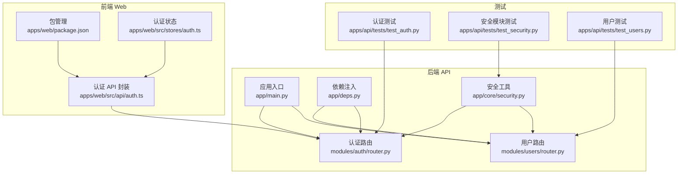
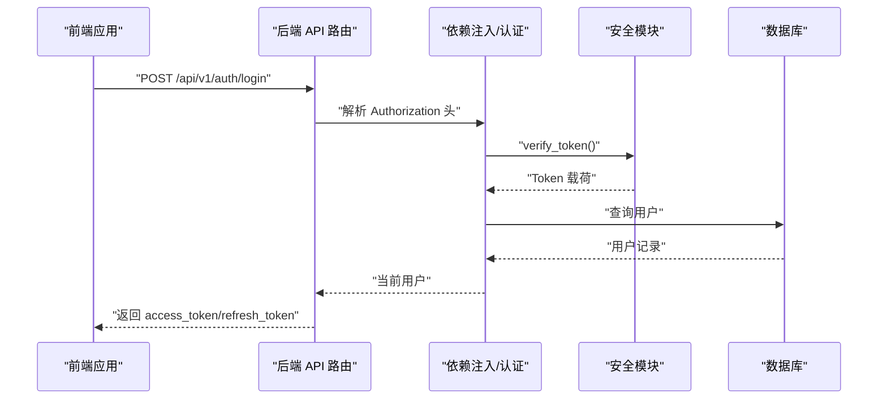
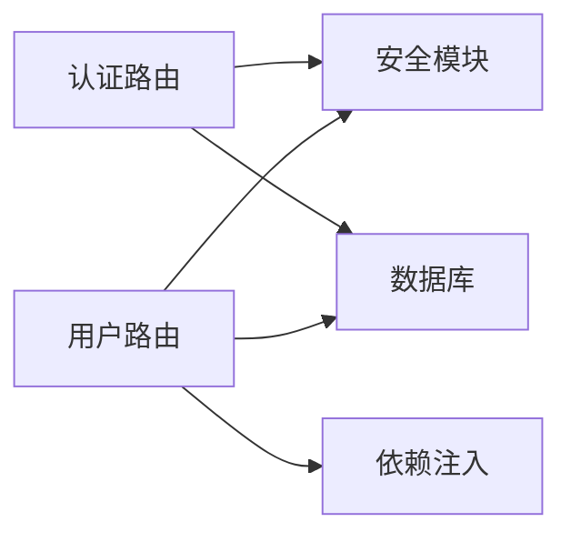

# 测试策略

<cite>
**本文引用的文件**
- [apps/api/tests/test_auth.py](file://apps/api/tests/test_auth.py)
- [apps/api/tests/test_security.py](file://apps/api/tests/test_security.py)
- [apps/api/tests/test_users.py](file://apps/api/tests/test_users.py)
- [apps/api/app/main.py](file://apps/api/app/main.py)
- [apps/api/app/deps.py](file://apps/api/app/deps.py)
- [apps/api/app/core/security.py](file://apps/api/app/core/security.py)
- [apps/api/app/modules/auth/router.py](file://apps/api/app/modules/auth/router.py)
- [apps/api/app/modules/users/router.py](file://apps/api/app/modules/users/router.py)
- [apps/web/src/api/auth.ts](file://apps/web/src/api/auth.ts)
- [apps/web/src/stores/auth.ts](file://apps/web/src/stores/auth.ts)
- [apps/web/package.json](file://apps/web/package.json)
</cite>

## 目录
1. [引言](#引言)
2. [项目结构](#项目结构)
3. [核心组件](#核心组件)
4. [架构总览](#架构总览)
5. [详细组件分析](#详细组件分析)
6. [依赖分析](#依赖分析)
7. [性能考虑](#性能考虑)
8. [故障排查指南](#故障排查指南)
9. [结论](#结论)
10. [附录](#附录)

## 引言
本测试策略文档面向“AI摄影教练”项目，系统化地规划单元测试、集成测试与端到端测试的实施路径，明确测试框架选择与配置（pytest）、API测试规范与断言策略、前端组件与用户交互测试指导、测试覆盖率与质量标准、CI中的自动化测试流程、性能与压力测试方案，以及测试环境搭建与测试数据准备的最佳实践。本文以现有代码库为基础，结合实际可落地的测试方法，帮助团队建立稳定、可维护、可扩展的测试体系。

## 项目结构
后端采用 FastAPI 应用，包含认证、用户、图片与分析等模块；前端基于 Vue 3 + Pinia + Axios 构建，通过 HTTP 接口与后端交互；测试集中在后端 Python 项目中，使用 pytest 与 FastAPI TestClient 进行 API 层测试；SQLite 内存数据库用于单元测试，PostgreSQL 用于集成测试与生产环境。

图表来源
- [apps/api/app/main.py:1-36](file://apps/api/app/main.py#L1-L36)
- [apps/api/app/deps.py:1-41](file://apps/api/app/deps.py#L1-L41)
- [apps/api/app/core/security.py:1-72](file://apps/api/app/core/security.py#L1-L72)
- [apps/api/app/modules/auth/router.py:1-93](file://apps/api/app/modules/auth/router.py#L1-L93)
- [apps/api/app/modules/users/router.py:1-71](file://apps/api/app/modules/users/router.py#L1-L71)
- [apps/web/src/api/auth.ts:1-56](file://apps/web/src/api/auth.ts#L1-L56)
- [apps/web/src/stores/auth.ts:1-41](file://apps/web/src/stores/auth.ts#L1-L41)
- [apps/api/tests/test_auth.py:1-191](file://apps/api/tests/test_auth.py#L1-L191)
- [apps/api/tests/test_security.py:1-98](file://apps/api/tests/test_security.py#L1-L98)
- [apps/api/tests/test_users.py:1-144](file://apps/api/tests/test_users.py#L1-L144)

章节来源
- [apps/api/app/main.py:1-36](file://apps/api/app/main.py#L1-L36)
- [apps/api/app/deps.py:1-41](file://apps/api/app/deps.py#L1-L41)
- [apps/api/app/core/security.py:1-72](file://apps/api/app/core/security.py#L1-L72)
- [apps/api/app/modules/auth/router.py:1-93](file://apps/api/app/modules/auth/router.py#L1-L93)
- [apps/api/app/modules/users/router.py:1-71](file://apps/api/app/modules/users/router.py#L1-L71)
- [apps/web/src/api/auth.ts:1-56](file://apps/web/src/api/auth.ts#L1-L56)
- [apps/web/src/stores/auth.ts:1-41](file://apps/web/src/stores/auth.ts#L1-L41)
- [apps/api/tests/test_auth.py:1-191](file://apps/api/tests/test_auth.py#L1-L191)
- [apps/api/tests/test_security.py:1-98](file://apps/api/tests/test_security.py#L1-L98)
- [apps/api/tests/test_users.py:1-144](file://apps/api/tests/test_users.py#L1-L144)

## 核心组件
- 认证与安全模块：提供密码哈希、JWT 创建与校验、HTTP Bearer 认证依赖注入。
- 认证路由：注册、登录、刷新、登出、邮箱验证、忘记/重置密码。
- 用户路由：获取/更新个人资料、修改密码。
- 前端认证封装：Axios 请求封装、Pinia 状态管理、本地存储令牌。
- 测试套件：pytest + FastAPI TestClient，SQLite 内存数据库，覆盖安全工具与业务路由。

章节来源
- [apps/api/app/core/security.py:1-72](file://apps/api/app/core/security.py#L1-L72)
- [apps/api/app/modules/auth/router.py:1-93](file://apps/api/app/modules/auth/router.py#L1-L93)
- [apps/api/app/modules/users/router.py:1-71](file://apps/api/app/modules/users/router.py#L1-L71)
- [apps/web/src/api/auth.ts:1-56](file://apps/web/src/api/auth.ts#L1-L56)
- [apps/web/src/stores/auth.ts:1-41](file://apps/web/src/stores/auth.ts#L1-L41)
- [apps/api/tests/test_security.py:1-98](file://apps/api/tests/test_security.py#L1-L98)
- [apps/api/tests/test_auth.py:1-191](file://apps/api/tests/test_auth.py#L1-L191)
- [apps/api/tests/test_users.py:1-144](file://apps/api/tests/test_users.py#L1-L144)

## 架构总览
下图展示测试视角下的系统交互：前端通过 Axios 调用后端 API，后端路由经由依赖注入解析用户身份，调用安全模块进行 JWT 校验与密码处理，并访问数据库完成业务操作。测试通过 TestClient 直接驱动路由，绕过网络层，聚焦业务逻辑与数据一致性。

图表来源
- [apps/api/app/modules/auth/router.py:42-46](file://apps/api/app/modules/auth/router.py#L42-L46)
- [apps/api/app/deps.py:15-33](file://apps/api/app/deps.py#L15-L33)
- [apps/api/app/core/security.py:49-71](file://apps/api/app/core/security.py#L49-L71)
- [apps/web/src/api/auth.ts:33-35](file://apps/web/src/api/auth.ts#L33-L35)

## 详细组件分析

### 单元测试策略
- 目标：确保安全模块与工具函数的正确性与鲁棒性。
- 覆盖范围：
  - 密码哈希与校验：正反例、不同输入产生不同哈希。
  - JWT 创建与验证：有效/无效/过期 token 的行为。
- 断言策略：
  - 类型与长度断言（如字符串非空）。
  - 结果内容断言（payload 字段、token 类型）。
  - 异常断言（HTTP 401）。
- 数据与环境：
  - 使用独立的内存数据库或纯函数测试，避免外部依赖。
  - 通过参数化与边界值覆盖典型场景。

章节来源
- [apps/api/tests/test_security.py:15-98](file://apps/api/tests/test_security.py#L15-L98)
- [apps/api/app/core/security.py:22-71](file://apps/api/app/core/security.py#L22-L71)

### 集成测试策略
- 目标：验证路由、依赖注入、数据库交互与业务流程。
- 覆盖范围：
  - 认证模块：注册、登录、刷新、登出、忘记/重置密码。
  - 用户模块：获取/更新资料、修改密码。
- 断言策略：
  - HTTP 状态码断言（200/400/401/403/409/422）。
  - 响应体字段断言（access_token、refresh_token、用户信息）。
  - 错误场景断言（重复邮箱、无效邮箱、密码过短、错误凭据）。
- 数据与环境：
  - 使用 SQLite 内存数据库或独立测试库，按需重建表结构。
  - 通过依赖覆盖（dependency override）替换真实数据库连接。
  - 启动事件与外部初始化的隔离（禁用或打桩）。

章节来源
- [apps/api/tests/test_auth.py:48-191](file://apps/api/tests/test_auth.py#L48-L191)
- [apps/api/tests/test_users.py:77-144](file://apps/api/tests/test_users.py#L77-L144)
- [apps/api/app/main.py:27-29](file://apps/api/app/main.py#L27-L29)
- [apps/api/app/deps.py:15-33](file://apps/api/app/deps.py#L15-L33)

### 端到端测试策略（建议）
- 目标：模拟真实用户在浏览器中的完整流程。
- 建议框架：Playwright 或 Cypress（与现有 Vite/Vue 生态契合）。
- 场景示例：
  - 注册 → 登录 → 获取资料 → 修改昵称/头像 → 修改密码 → 刷新 token → 登出。
  - 未认证访问受保护页面的拦截行为。
- 数据与环境：
  - 使用独立测试数据库实例，测试前导入种子数据。
  - 通过环境变量切换测试后端地址与密钥。

（本节为概念性指导，不直接分析具体文件）

### API 测试规范与断言策略
- 请求与响应：
  - 统一使用 JSON 负载，遵循后端 Schema。
  - 对必填字段、格式与长度进行校验（422）。
- 认证与授权：
  - 缺失/无效/过期 token 应返回 401。
  - 未认证访问受保护资源返回 401/403。
- 业务语义：
  - 成功场景返回 200，携带必要字段。
  - 业务错误返回 400，携带明确错误信息。
- 可观测性：
  - 记录关键请求/响应摘要，便于定位问题。

章节来源
- [apps/api/app/modules/auth/router.py:24-92](file://apps/api/app/modules/auth/router.py#L24-L92)
- [apps/api/app/modules/users/router.py:29-70](file://apps/api/app/modules/users/router.py#L29-L70)
- [apps/api/app/deps.py:15-33](file://apps/api/app/deps.py#L15-L33)

### 前端组件测试与用户交互测试（建议）
- 目标：保证认证流程、状态同步与 UI 行为一致。
- 建议框架：Vitest + @vue/test-utils（与 Vue 3 技术栈一致）。
- 测试要点：
  - Pinia Store 的 token 设置/清理与计算属性。
  - API 封装函数的调用与错误处理。
  - 登录/注册表单的输入校验与提交流程。
- 交互测试（E2E）：
  - 使用 Playwright/Cypress 录制并回归关键用户旅程。

章节来源
- [apps/web/src/stores/auth.ts:1-41](file://apps/web/src/stores/auth.ts#L1-L41)
- [apps/web/src/api/auth.ts:1-56](file://apps/web/src/api/auth.ts#L1-L56)
- [apps/web/package.json:1-26](file://apps/web/package.json#L1-L26)

### 测试数据管理
- 单元测试：纯函数无需外部数据，必要时使用参数化构造输入。
- 集成测试：使用 SQLite 内存数据库或独立测试库，按需创建/删除表。
- E2E 测试：使用最小化种子数据，避免敏感信息；通过脚本初始化测试数据。
- 数据隔离：每个测试进程使用独立数据库实例或命名空间。

章节来源
- [apps/api/tests/test_auth.py:13-36](file://apps/api/tests/test_auth.py#L13-L36)
- [apps/api/tests/test_users.py:14-34](file://apps/api/tests/test_users.py#L14-L34)

### 测试覆盖率与质量标准（建议）
- 覆盖率目标：
  - 行覆盖率 ≥ 85%，分支覆盖率 ≥ 70%。
  - 关键路径（认证、用户资料、密码变更）达到 100%。
- 质量门禁：
  - 通过 CI 执行 pytest 并输出覆盖率报告。
  - 失败用例必须附带日志与最小可复现步骤。

（本节为通用质量标准，不直接分析具体文件）

## 依赖分析
- 认证路由依赖安全模块进行 JWT 解码与校验，依赖数据库进行用户查询。
- 用户路由依赖 HTTP Bearer 依赖注入，间接依赖安全模块与数据库。
- 依赖注入提供统一的当前用户解析逻辑，贯穿多个路由。

图表来源
- [apps/api/app/modules/auth/router.py:1-93](file://apps/api/app/modules/auth/router.py#L1-L93)
- [apps/api/app/modules/users/router.py:1-71](file://apps/api/app/modules/users/router.py#L1-L71)
- [apps/api/app/core/security.py:1-72](file://apps/api/app/core/security.py#L1-L72)
- [apps/api/app/deps.py:1-41](file://apps/api/app/deps.py#L1-L41)

章节来源
- [apps/api/app/modules/auth/router.py:1-93](file://apps/api/app/modules/auth/router.py#L1-L93)
- [apps/api/app/modules/users/router.py:1-71](file://apps/api/app/modules/users/router.py#L1-L71)
- [apps/api/app/core/security.py:1-72](file://apps/api/app/core/security.py#L1-L72)
- [apps/api/app/deps.py:1-41](file://apps/api/app/deps.py#L1-L41)

## 性能考虑
- 单元测试：保持无外部依赖，执行快速；对 IO 密集逻辑使用打桩。
- 集成测试：尽量减少数据库迁移与重建，使用事务回滚或轻量级表。
- E2E 测试：使用无头浏览器，分层运行（组件优先，端到端收敛）。
- 性能基准与压力测试（建议）：
  - 使用 Locust 或 k6 对关键 API（登录、注册、分析任务）进行并发压测。
  - 设定 SLA（P95/P99 延迟阈值），在 CI 中作为可度量指标。

（本节为通用性能建议，不直接分析具体文件）

## 故障排查指南
- 认证失败（401/403）：
  - 检查前端是否正确设置 Authorization 头与本地存储。
  - 核对后端依赖注入是否正确解析 token。
- 数据库相关错误：
  - 确认测试数据库连接与表结构重建逻辑。
  - 检查启动事件是否被正确禁用或打桩。
- JWT 与密码问题：
  - 校验密钥与算法配置，确保前后端一致。
  - 对比哈希结果与明文校验逻辑。

章节来源
- [apps/web/src/stores/auth.ts:12-25](file://apps/web/src/stores/auth.ts#L12-L25)
- [apps/api/app/deps.py:15-33](file://apps/api/app/deps.py#L15-L33)
- [apps/api/tests/test_auth.py:31-45](file://apps/api/tests/test_auth.py#L31-L45)
- [apps/api/tests/test_users.py:37-48](file://apps/api/tests/test_users.py#L37-L48)

## 结论
本测试策略以现有代码库为基础，明确了单元、集成与端到端测试的职责边界与实施方法。通过 pytest 驱动的 API 测试、SQLite 内存数据库与依赖覆盖，能够高效验证安全模块与业务路由；配合前端组件与 E2E 测试，可进一步保障用户体验与系统稳定性。建议在 CI 中引入覆盖率统计与性能基线，持续提升质量门槛。

## 附录

### 测试执行与 CI 最佳实践
- 本地开发：
  - 使用 pytest 运行单个测试文件或类，便于快速迭代。
- CI 流水线：
  - 步骤建议：安装依赖 → 启动测试数据库 → 运行 pytest + 覆盖率 → 上传报告。
  - 并行策略：按模块拆分测试套件，缩短流水线时间。
- 日志与报告：
  - 输出详细日志与 HTML 覆盖率报告，便于回溯。

（本节为通用流程建议，不直接分析具体文件）