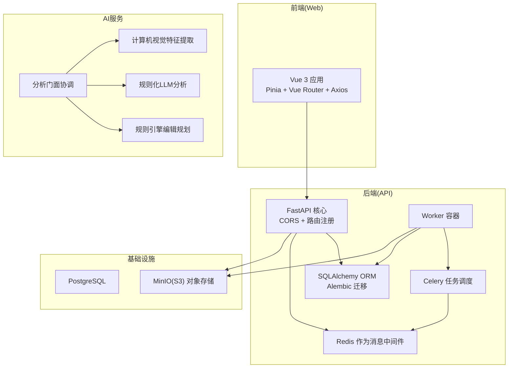
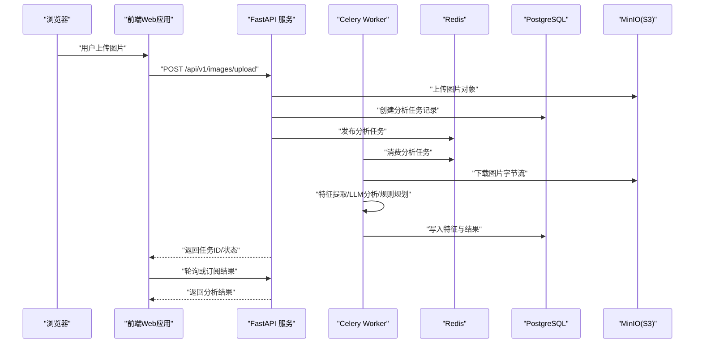
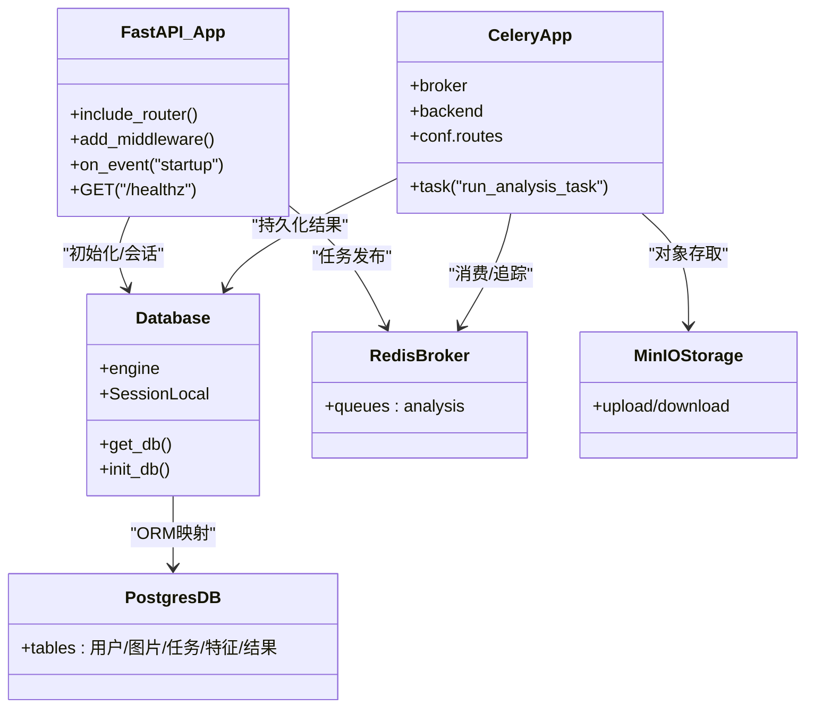
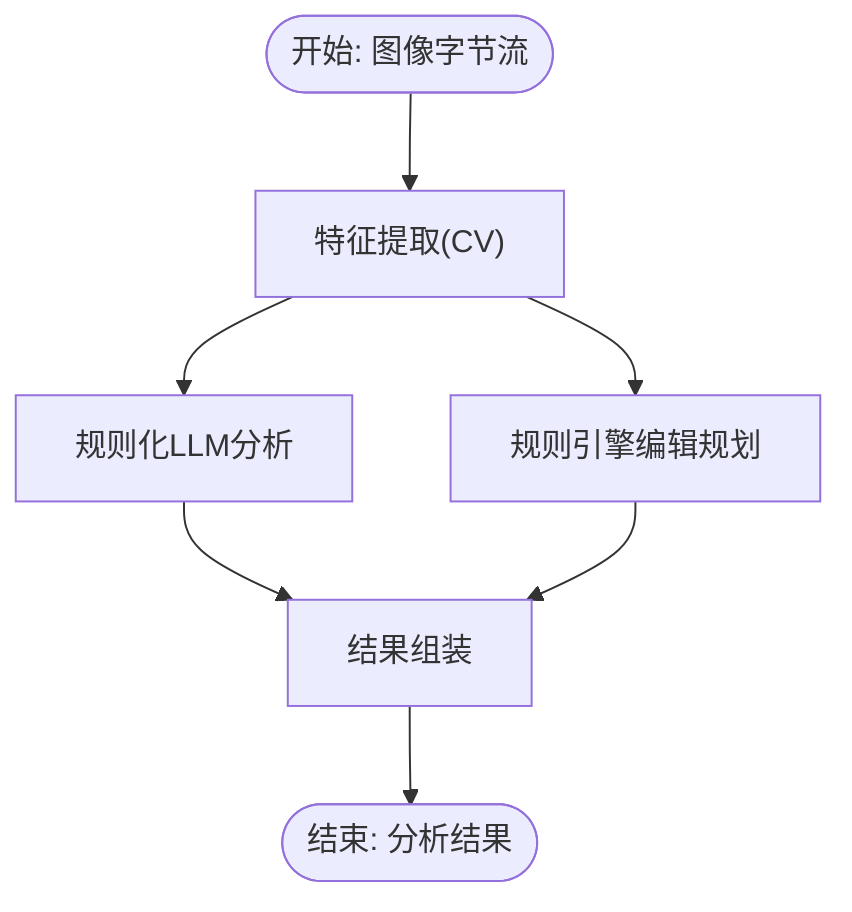
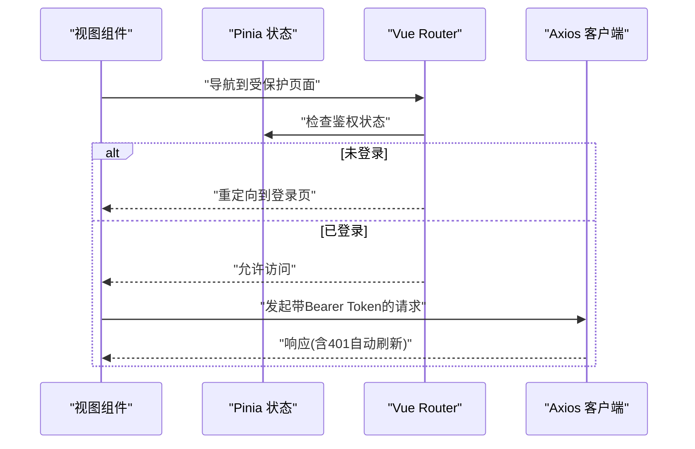
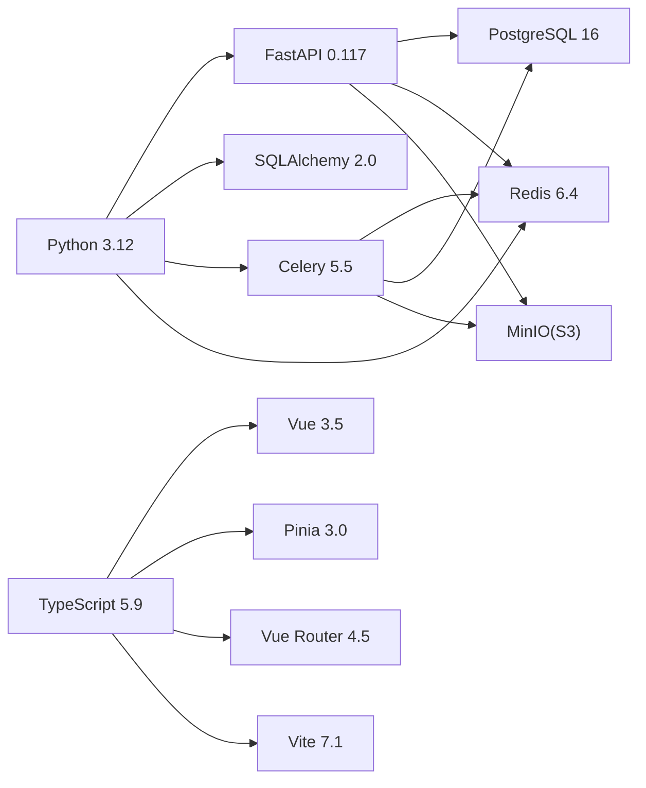

# 技术栈选型

<cite>
**本文引用的文件**
- [apps/api/requirements.txt](file://apps/api/requirements.txt)
- [apps/web/package.json](file://apps/web/package.json)
- [apps/api/app/core/config.py](file://apps/api/app/core/config.py)
- [apps/api/app/main.py](file://apps/api/app/main.py)
- [apps/api/app/core/celery_app.py](file://apps/api/app/core/celery_app.py)
- [apps/api/app/core/database.py](file://apps/api/app/core/database.py)
- [apps/api/app/services/ai/analyzer.py](file://apps/api/app/services/ai/analyzer.py)
- [apps/api/app/services/cv/feature_extractor.py](file://apps/api/app/services/cv/feature_extractor.py)
- [apps/api/app/services/llm/analyzer.py](file://apps/api/app/services/llm/analyzer.py)
- [apps/api/app/services/rules/edit_planner.py](file://apps/api/app/services/rules/edit_planner.py)
- [apps/api/app/tasks/analyze_photo.py](file://apps/api/app/tasks/analyze_photo.py)
- [apps/api/alembic.ini](file://apps/api/alembic.ini)
- [apps/web/src/main.ts](file://apps/web/src/main.ts)
- [apps/web/src/router.ts](file://apps/web/src/router.ts)
- [apps/web/src/stores/auth.ts](file://apps/web/src/stores/auth.ts)
- [apps/web/src/api/http.ts](file://apps/web/src/api/http.ts)
- [infra/docker-compose.yml](file://infra/docker-compose.yml)
</cite>

## 目录
1. [引言](#引言)
2. [项目结构](#项目结构)
3. [核心组件](#核心组件)
4. [架构总览](#架构总览)
5. [详细组件分析](#详细组件分析)
6. [依赖关系分析](#依赖关系分析)
7. [性能考虑](#性能考虑)
8. [故障排查指南](#故障排查指南)
9. [结论](#结论)
10. [附录](#附录)

## 引言
本技术栈选型文档面向“AI摄影教练”项目，系统阐述后端（FastAPI、Celery、SQLAlchemy、PostgreSQL、Redis）、前端（Vue.js 3、TypeScript、Pinia、Vue Router）、以及AI服务（计算机视觉、大语言模型、规则引擎）的技术选型理由、优势与适用场景，并给出版本信息、兼容性要求与协同工作机制。

## 项目结构
项目采用前后端分离与任务解耦的多服务架构：
- 后端API服务：基于FastAPI提供REST接口，使用SQLAlchemy进行ORM建模与Alembic做数据库迁移；通过Celery + Redis异步处理图像分析任务；数据持久化使用PostgreSQL；对象存储使用MinIO（S3兼容）。
- AI服务层：由计算机视觉特征提取、LLM风格的规则化分析、规则引擎编辑规划三部分组成，统一通过分析门面协调输出结果。
- 前端Web应用：基于Vue 3 + TypeScript + Vite构建，使用Pinia进行状态管理、Vue Router进行路由与鉴权守卫、Axios封装HTTP客户端与鉴权刷新流程。
- 部署：使用Docker Compose编排，包含PostgreSQL、Redis、MinIO与API/Worker容器。

图表来源
- [apps/api/app/main.py:1-36](file://apps/api/app/main.py#L1-L36)
- [apps/api/app/core/database.py:1-39](file://apps/api/app/core/database.py#L1-L39)
- [apps/api/app/core/celery_app.py:1-21](file://apps/api/app/core/celery_app.py#L1-L21)
- [apps/api/app/tasks/analyze_photo.py:1-108](file://apps/api/app/tasks/analyze_photo.py#L1-L108)
- [apps/api/app/services/ai/analyzer.py:1-27](file://apps/api/app/services/ai/analyzer.py#L1-L27)
- [apps/api/app/services/cv/feature_extractor.py:1-98](file://apps/api/app/services/cv/feature_extractor.py#L1-L98)
- [apps/api/app/services/llm/analyzer.py:1-139](file://apps/api/app/services/llm/analyzer.py#L1-L139)
- [apps/api/app/services/rules/edit_planner.py:1-97](file://apps/api/app/services/rules/edit_planner.py#L1-L97)
- [apps/web/src/main.ts:1-14](file://apps/web/src/main.ts#L1-L14)
- [apps/web/src/router.ts:1-30](file://apps/web/src/router.ts#L1-L30)
- [apps/web/src/api/http.ts:1-94](file://apps/web/src/api/http.ts#L1-L94)
- [infra/docker-compose.yml:1-107](file://infra/docker-compose.yml#L1-L107)

章节来源
- [apps/api/app/main.py:1-36](file://apps/api/app/main.py#L1-L36)
- [apps/api/app/core/database.py:1-39](file://apps/api/app/core/database.py#L1-L39)
- [apps/api/app/core/celery_app.py:1-21](file://apps/api/app/core/celery_app.py#L1-L21)
- [apps/api/app/tasks/analyze_photo.py:1-108](file://apps/api/app/tasks/analyze_photo.py#L1-L108)
- [apps/api/app/services/ai/analyzer.py:1-27](file://apps/api/app/services/ai/analyzer.py#L1-L27)
- [apps/web/src/main.ts:1-14](file://apps/web/src/main.ts#L1-L14)
- [apps/web/src/router.ts:1-30](file://apps/web/src/router.ts#L1-L30)
- [apps/web/src/api/http.ts:1-94](file://apps/web/src/api/http.ts#L1-L94)
- [infra/docker-compose.yml:1-107](file://infra/docker-compose.yml#L1-L107)

## 核心组件
- 后端框架与运行时
  - FastAPI：高性能异步Web框架，具备自动生成OpenAPI文档、Pydantic集成、中间件与依赖注入能力，适合本项目API的快速迭代与类型安全。
  - Uvicorn：ASGI服务器，配合FastAPI提供生产级HTTP服务。
- 数据访问与迁移
  - SQLAlchemy 2.x：现代ORM，支持类型注解与异步适配；结合Alembic进行数据库版本控制与迁移。
  - PostgreSQL：关系型数据库，满足结构化数据与事务一致性需求。
- 异步任务与消息中间件
  - Celery：分布式任务队列，支持任务路由、重试与状态跟踪；结合Redis实现Broker与结果后端。
- 存储与对象管理
  - MinIO（S3兼容）：对象存储用于图片资产的上传下载；Boto3提供S3 SDK能力。
- 前端框架与工具链
  - Vue 3 + TypeScript：组合式API与严格类型系统，提升开发体验与可维护性。
  - Pinia：轻量状态管理，替代Vuex，API简洁且与TS契合。
  - Vue Router：支持导航守卫与路由元信息，便于鉴权控制。
  - Vite：快速构建与热更新，提升开发效率。
  - Axios：HTTP客户端，内置拦截器与鉴权刷新逻辑。

章节来源
- [apps/api/requirements.txt:1-19](file://apps/api/requirements.txt#L1-L19)
- [apps/web/package.json:1-26](file://apps/web/package.json#L1-L26)
- [apps/api/app/main.py:1-36](file://apps/api/app/main.py#L1-L36)
- [apps/api/app/core/database.py:1-39](file://apps/api/app/core/database.py#L1-L39)
- [apps/api/app/core/celery_app.py:1-21](file://apps/api/app/core/celery_app.py#L1-L21)
- [apps/web/src/main.ts:1-14](file://apps/web/src/main.ts#L1-L14)
- [apps/web/src/router.ts:1-30](file://apps/web/src/router.ts#L1-L30)
- [apps/web/src/api/http.ts:1-94](file://apps/web/src/api/http.ts#L1-L94)

## 架构总览
下图展示从浏览器到后端API、再到异步任务与存储的完整链路，体现各组件间的协作关系与数据流向。

图表来源
- [apps/api/app/main.py:1-36](file://apps/api/app/main.py#L1-L36)
- [apps/api/app/tasks/analyze_photo.py:1-108](file://apps/api/app/tasks/analyze_photo.py#L1-L108)
- [apps/api/app/core/celery_app.py:1-21](file://apps/api/app/core/celery_app.py#L1-L21)
- [apps/api/app/core/database.py:1-39](file://apps/api/app/core/database.py#L1-L39)
- [apps/web/src/api/http.ts:1-94](file://apps/web/src/api/http.ts#L1-L94)
- [infra/docker-compose.yml:1-107](file://infra/docker-compose.yml#L1-L107)

## 详细组件分析

### 后端技术栈（FastAPI + SQLAlchemy + Celery + PostgreSQL + Redis）
- FastAPI
  - 负责路由注册、CORS中间件、启动事件与健康检查端点。
  - 通过依赖注入与Pydantic模型保证请求/响应的类型安全。
- SQLAlchemy + Alembic
  - 使用session工厂与上下文生成器管理连接生命周期。
  - 通过Alembic在启动时自动应用迁移，确保schema演进可控。
- Celery + Redis
  - 以Redis作为Broker与结果后端，定义任务路由至专用队列，保障分析任务隔离与可观测性。
- PostgreSQL
  - 作为关系型数据存储，承载用户、图片、任务、特征与结果等实体。
- MinIO（S3）
  - 提供对象存储能力，配合Boto3进行上传下载与元数据管理。

图表来源
- [apps/api/app/main.py:1-36](file://apps/api/app/main.py#L1-L36)
- [apps/api/app/core/database.py:1-39](file://apps/api/app/core/database.py#L1-L39)
- [apps/api/app/core/celery_app.py:1-21](file://apps/api/app/core/celery_app.py#L1-L21)
- [apps/api/app/tasks/analyze_photo.py:1-108](file://apps/api/app/tasks/analyze_photo.py#L1-L108)
- [apps/api/alembic.ini:1-147](file://apps/api/alembic.ini#L1-L147)

章节来源
- [apps/api/app/main.py:1-36](file://apps/api/app/main.py#L1-L36)
- [apps/api/app/core/database.py:1-39](file://apps/api/app/core/database.py#L1-L39)
- [apps/api/app/core/celery_app.py:1-21](file://apps/api/app/core/celery_app.py#L1-L21)
- [apps/api/app/tasks/analyze_photo.py:1-108](file://apps/api/app/tasks/analyze_photo.py#L1-L108)
- [apps/api/alembic.ini:1-147](file://apps/api/alembic.ini#L1-L147)

### AI服务技术栈（计算机视觉 + 大语言模型 + 规则引擎）
- 计算机视觉特征提取
  - 基于Pillow对输入图像进行亮度、对比度、主体位置与构图引导线等特征提取，输出结构化特征。
- 规则化LLM分析
  - 以规则驱动的方式模拟LLM风格的总结与建议生成，包含构图、曝光、色彩与故事性评分。
- 规则引擎编辑规划
  - 基于特征与建议生成可预览、可非破坏性应用的编辑动作（裁剪、曝光调整、白平衡）。
- 分析门面
  - 统一编排CV、LLM与规则引擎，输出最终分析结果。

图表来源
- [apps/api/app/services/ai/analyzer.py:1-27](file://apps/api/app/services/ai/analyzer.py#L1-L27)
- [apps/api/app/services/cv/feature_extractor.py:1-98](file://apps/api/app/services/cv/feature_extractor.py#L1-L98)
- [apps/api/app/services/llm/analyzer.py:1-139](file://apps/api/app/services/llm/analyzer.py#L1-L139)
- [apps/api/app/services/rules/edit_planner.py:1-97](file://apps/api/app/services/rules/edit_planner.py#L1-L97)

章节来源
- [apps/api/app/services/ai/analyzer.py:1-27](file://apps/api/app/services/ai/analyzer.py#L1-L27)
- [apps/api/app/services/cv/feature_extractor.py:1-98](file://apps/api/app/services/cv/feature_extractor.py#L1-L98)
- [apps/api/app/services/llm/analyzer.py:1-139](file://apps/api/app/services/llm/analyzer.py#L1-L139)
- [apps/api/app/services/rules/edit_planner.py:1-97](file://apps/api/app/services/rules/edit_planner.py#L1-L97)

### 前端技术栈（Vue 3 + TypeScript + Pinia + Vue Router）
- 应用入口与插件
  - 创建Vue实例，挂载Pinia与Vue Router。
- 路由与鉴权守卫
  - 基于meta字段区分游客页面与需要登录的页面，未登录用户跳转登录页。
- 状态管理
  - 使用Pinia存储访问令牌、刷新令牌与当前用户信息，持久化到localStorage。
- HTTP客户端
  - Axios封装基础URL、超时、请求头注入与401自动刷新流程，避免循环刷新与队列堆积。

图表来源
- [apps/web/src/main.ts:1-14](file://apps/web/src/main.ts#L1-L14)
- [apps/web/src/router.ts:1-30](file://apps/web/src/router.ts#L1-L30)
- [apps/web/src/stores/auth.ts:1-41](file://apps/web/src/stores/auth.ts#L1-L41)
- [apps/web/src/api/http.ts:1-94](file://apps/web/src/api/http.ts#L1-L94)

章节来源
- [apps/web/src/main.ts:1-14](file://apps/web/src/main.ts#L1-L14)
- [apps/web/src/router.ts:1-30](file://apps/web/src/router.ts#L1-L30)
- [apps/web/src/stores/auth.ts:1-41](file://apps/web/src/stores/auth.ts#L1-L41)
- [apps/web/src/api/http.ts:1-94](file://apps/web/src/api/http.ts#L1-L94)

## 依赖关系分析
- 版本与兼容性
  - Python 3.12（容器镜像参数化，便于替换）。
  - PostgreSQL 16；Redis 7；MinIO 最新版。
  - FastAPI 0.117.0；SQLAlchemy 2.0.43；Celery 5.5.3；Redis 6.4.0；Pydantic Settings 2.11.0；Alembic 1.16.3。
  - Vue 3.5.21；TypeScript 5.9.2；Pinia 3.0.3；Vue Router 4.5.1；Vite 7.1.3。
- 组件耦合
  - API服务与存储、数据库、消息中间件松耦合，通过环境变量与容器网络通信。
  - AI服务通过门面解耦，便于替换具体实现（如更换LLM或CV算法）。
  - 前端通过HTTP客户端与后端交互，鉴权与刷新逻辑内聚于Axios拦截器。

图表来源
- [apps/api/requirements.txt:1-19](file://apps/api/requirements.txt#L1-L19)
- [apps/web/package.json:1-26](file://apps/web/package.json#L1-L26)
- [infra/docker-compose.yml:1-107](file://infra/docker-compose.yml#L1-L107)

章节来源
- [apps/api/requirements.txt:1-19](file://apps/api/requirements.txt#L1-L19)
- [apps/web/package.json:1-26](file://apps/web/package.json#L1-L26)
- [infra/docker-compose.yml:1-107](file://infra/docker-compose.yml#L1-L107)

## 性能考虑
- 异步与并发
  - FastAPI原生异步支持，结合Uvicorn可获得高吞吐；Celery任务队列与Redis实现计算密集型分析的异步化，避免阻塞主服务。
- 数据库与缓存
  - SQLAlchemy连接池与pool_pre_ping降低连接失效风险；Redis作为任务中间件与结果缓存，减少重复计算。
- 存储与网络
  - MinIO提供高可用对象存储，建议在生产环境启用分片与备份策略。
- 前端性能
  - Vite提供快速冷启动与热更新；Axios设置合理超时与重试策略，避免长时间阻塞UI。

## 故障排查指南
- 健康检查
  - 后端提供健康端点，可用于容器编排健康探测。
- 日志与追踪
  - Alembic日志级别配置可用于迁移问题定位；Redis队列状态可通过任务ID查询。
- 常见问题
  - CORS跨域：确认前端与后端CORS配置一致。
  - 401/403：检查本地存储的访问/刷新令牌是否有效，必要时清理并重新登录。
  - 数据库迁移失败：核对Alembic配置与数据库URL，确保权限正确。

章节来源
- [apps/api/app/main.py:32-36](file://apps/api/app/main.py#L32-L36)
- [apps/api/alembic.ini:112-147](file://apps/api/alembic.ini#L112-L147)
- [apps/web/src/api/http.ts:19-91](file://apps/web/src/api/http.ts#L19-L91)

## 结论
本项目通过“FastAPI + SQLAlchemy + Celery + Redis + PostgreSQL + MinIO”的后端技术栈，结合“Vue 3 + TypeScript + Pinia + Vue Router”的前端技术栈，实现了高扩展、可维护、可异步化的AI摄影分析平台。AI服务采用模块化门面设计，便于未来引入真实大模型与更复杂的视觉算法。整体架构在开发效率、运行性能与运维稳定性之间取得良好平衡。

## 附录
- 环境变量与部署
  - 通过Docker Compose编排数据库、缓存、对象存储与API/Worker服务，环境变量集中管理。
- 开发与测试
  - 后端使用pytest与pytest-asyncio进行单元与集成测试；前端使用Vite进行开发与构建。

章节来源
- [apps/api/app/core/config.py:1-47](file://apps/api/app/core/config.py#L1-L47)
- [apps/api/app/tasks/analyze_photo.py:1-108](file://apps/api/app/tasks/analyze_photo.py#L1-L108)
- [apps/web/src/api/http.ts:1-94](file://apps/web/src/api/http.ts#L1-L94)
- [infra/docker-compose.yml:50-101](file://infra/docker-compose.yml#L50-L101)