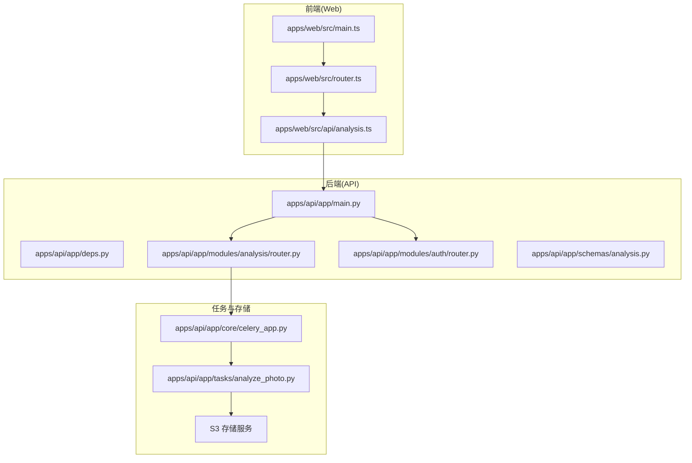
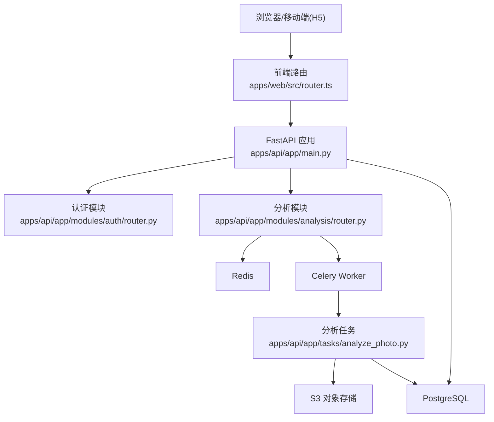
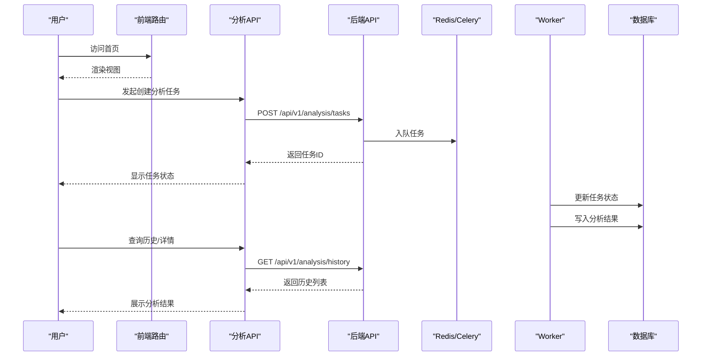
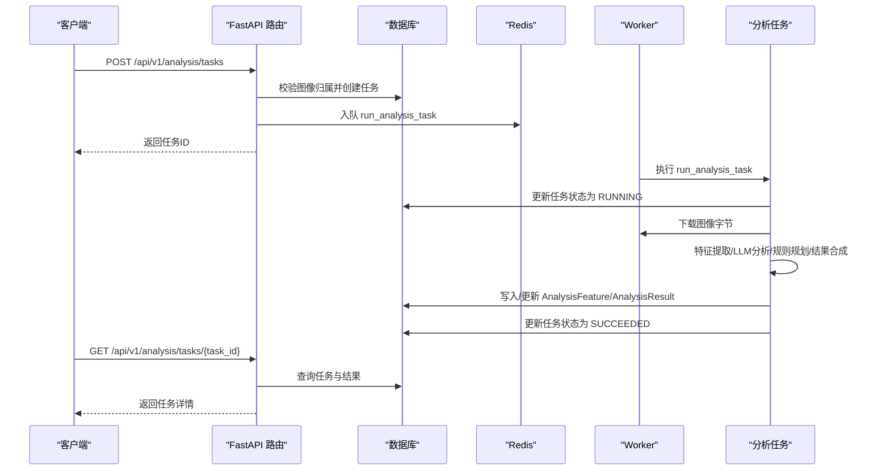
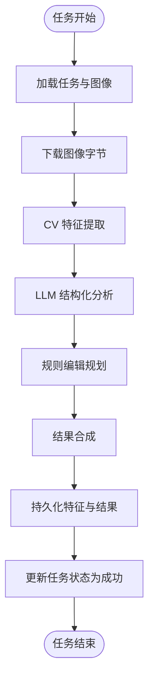
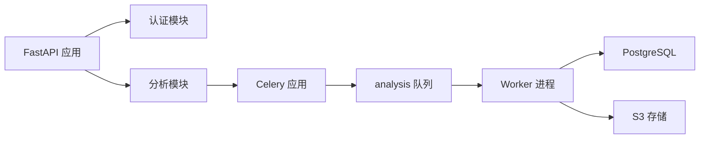

# 整体架构设计

<cite>
**本文引用的文件**
- [apps/api/app/main.py](file://apps/api/app/main.py)
- [apps/api/app/deps.py](file://apps/api/app/deps.py)
- [apps/api/app/core/config.py](file://apps/api/app/core/config.py)
- [apps/api/app/core/celery_app.py](file://apps/api/app/core/celery_app.py)
- [apps/api/app/modules/analysis/router.py](file://apps/api/app/modules/analysis/router.py)
- [apps/api/app/modules/auth/router.py](file://apps/api/app/modules/auth/router.py)
- [apps/api/app/services/ai/analyzer.py](file://apps/api/app/services/ai/analyzer.py)
- [apps/api/app/tasks/analyze_photo.py](file://apps/api/app/tasks/analyze_photo.py)
- [apps/api/app/schemas/analysis.py](file://apps/api/app/schemas/analysis.py)
- [apps/web/src/main.ts](file://apps/web/src/main.ts)
- [apps/web/src/router.ts](file://apps/web/src/router.ts)
- [apps/web/src/api/analysis.ts](file://apps/web/src/api/analysis.ts)
- [docs/architecture-v2.md](file://docs/architecture-v2.md)
</cite>

## 目录
1. [引言](#引言)
2. [项目结构](#项目结构)
3. [核心组件](#核心组件)
4. [架构总览](#架构总览)
5. [详细组件分析](#详细组件分析)
6. [依赖分析](#依赖分析)
7. [性能考量](#性能考量)
8. [故障排查指南](#故障排查指南)
9. [结论](#结论)
10. [附录](#附录)

## 引言
本文件面向“AI摄影教练”项目，提供整体架构设计文档。重点阐述系统的高层架构模式，包括前后端分离架构、API 层与 Worker 层的职责划分、异步任务处理架构、以及围绕 MVC 与分层架构的设计实践。文档还给出系统架构图、组件关系图、数据与控制流程，并讨论技术决策的权衡，涵盖可扩展性、性能与可维护性等方面。

## 项目结构
项目采用“单仓多应用”的组织方式，主要由以下子系统构成：
- Web 前端：基于 Vue 3 + TypeScript，通过 Pinia 状态管理与 Vue Router 路由导航，提供上传、分析、历史、个人中心等功能视图。
- API 后端：基于 FastAPI，提供 REST API，包含认证、图像、分析等模块；使用 SQLAlchemy 进行数据库访问；通过 Celery 处理异步任务。
- Worker：Celery Worker 进程，执行图像分析、特征提取等耗时任务。
- 文档与规范：架构设计文档与前后端协议契约（JSON Schema）。

图表来源
- [apps/web/src/main.ts:1-14](file://apps/web/src/main.ts#L1-L14)
- [apps/web/src/router.ts:1-30](file://apps/web/src/router.ts#L1-L30)
- [apps/web/src/api/analysis.ts:1-101](file://apps/web/src/api/analysis.ts#L1-L101)
- [apps/api/app/main.py:1-36](file://apps/api/app/main.py#L1-L36)
- [apps/api/app/modules/analysis/router.py:1-151](file://apps/api/app/modules/analysis/router.py#L1-L151)
- [apps/api/app/modules/auth/router.py:1-93](file://apps/api/app/modules/auth/router.py#L1-L93)
- [apps/api/app/core/celery_app.py:1-21](file://apps/api/app/core/celery_app.py#L1-L21)
- [apps/api/app/tasks/analyze_photo.py:1-108](file://apps/api/app/tasks/analyze_photo.py#L1-L108)

章节来源
- [apps/api/app/main.py:1-36](file://apps/api/app/main.py#L1-L36)
- [apps/web/src/main.ts:1-14](file://apps/web/src/main.ts#L1-L14)
- [apps/web/src/router.ts:1-30](file://apps/web/src/router.ts#L1-L30)
- [apps/web/src/api/analysis.ts:1-101](file://apps/web/src/api/analysis.ts#L1-L101)
- [apps/api/app/core/celery_app.py:1-21](file://apps/api/app/core/celery_app.py#L1-L21)
- [apps/api/app/tasks/analyze_photo.py:1-108](file://apps/api/app/tasks/analyze_photo.py#L1-L108)

## 核心组件
- 前端应用
  - 入口初始化：创建 Vue 应用、Pinia、路由并挂载根组件。
  - 路由守卫：根据认证状态进行页面跳转控制。
  - API 客户端：封装与后端交互的分析相关接口类型与方法。
- 后端 API
  - 应用入口：注册 CORS 中间件、挂载各模块路由、启动数据库连接。
  - 依赖注入：基于 Bearer Token 的认证依赖，解析当前用户并注入数据库会话。
  - 模块化路由：认证、图像、分析等模块按功能拆分，职责清晰。
  - 配置中心：集中管理数据库、Redis、S3、JWT 等配置项。
  - 异步任务：Celery 应用与任务队列配置，任务路由到专用队列。
- AI 分析服务
  - 分析门面：协调 CV 特征提取、LLM 分析、规则编辑规划与结果合成。
- 异步任务
  - 分析任务：下载图像、提取特征、调用分析器、生成结果并持久化。

章节来源
- [apps/web/src/main.ts:1-14](file://apps/web/src/main.ts#L1-L14)
- [apps/web/src/router.ts:1-30](file://apps/web/src/router.ts#L1-L30)
- [apps/web/src/api/analysis.ts:1-101](file://apps/web/src/api/analysis.ts#L1-L101)
- [apps/api/app/main.py:1-36](file://apps/api/app/main.py#L1-L36)
- [apps/api/app/deps.py:1-41](file://apps/api/app/deps.py#L1-L41)
- [apps/api/app/core/config.py:1-47](file://apps/api/app/core/config.py#L1-L47)
- [apps/api/app/core/celery_app.py:1-21](file://apps/api/app/core/celery_app.py#L1-L21)
- [apps/api/app/services/ai/analyzer.py:1-27](file://apps/api/app/services/ai/analyzer.py#L1-L27)
- [apps/api/app/tasks/analyze_photo.py:1-108](file://apps/api/app/tasks/analyze_photo.py#L1-L108)

## 架构总览
系统采用前后端分离与异步任务解耦的架构模式：
- 前端：Vue 单页应用，负责用户交互与可视化展示。
- 后端 API：FastAPI 提供 REST 接口，实现认证、资源管理与任务编排。
- 异步处理：Celery Worker 专注执行图像分析与特征提取等 CPU/IO 密集任务。
- 数据与存储：PostgreSQL 存放用户、任务、特征与结果；S3 存储图像资产。

图表来源
- [apps/web/src/router.ts:1-30](file://apps/web/src/router.ts#L1-L30)
- [apps/api/app/main.py:1-36](file://apps/api/app/main.py#L1-L36)
- [apps/api/app/modules/auth/router.py:1-93](file://apps/api/app/modules/auth/router.py#L1-L93)
- [apps/api/app/modules/analysis/router.py:1-151](file://apps/api/app/modules/analysis/router.py#L1-L151)
- [apps/api/app/tasks/analyze_photo.py:1-108](file://apps/api/app/tasks/analyze_photo.py#L1-L108)

## 详细组件分析

### 前端组件分析
- 应用入口与状态管理
  - 初始化 Vue 应用、Pinia、路由，挂载到 DOM。
- 路由与导航守卫
  - 定义登录、注册、首页、历史、个人中心等视图。
  - 通过 meta 字段区分是否需认证或仅访客可用，结合 Pinia 状态进行跳转控制。
- API 客户端
  - 定义分析任务、历史查询、重试等接口类型与方法，统一通过 HTTP 客户端发起请求。

图表来源
- [apps/web/src/router.ts:1-30](file://apps/web/src/router.ts#L1-L30)
- [apps/web/src/api/analysis.ts:1-101](file://apps/web/src/api/analysis.ts#L1-L101)
- [apps/api/app/modules/analysis/router.py:1-151](file://apps/api/app/modules/analysis/router.py#L1-L151)
- [apps/api/app/core/celery_app.py:1-21](file://apps/api/app/core/celery_app.py#L1-L21)
- [apps/api/app/tasks/analyze_photo.py:1-108](file://apps/api/app/tasks/analyze_photo.py#L1-L108)

章节来源
- [apps/web/src/main.ts:1-14](file://apps/web/src/main.ts#L1-L14)
- [apps/web/src/router.ts:1-30](file://apps/web/src/router.ts#L1-L30)
- [apps/web/src/api/analysis.ts:1-101](file://apps/web/src/api/analysis.ts#L1-L101)

### 后端组件分析
- 应用入口与中间件
  - 注册 CORS 中间件，允许跨域访问。
  - 挂载各模块路由，统一前缀与标签。
  - 启动事件中初始化数据库连接。
- 依赖注入与认证
  - 基于 HTTP Bearer Token 解析用户身份，校验令牌有效性与用户状态。
  - 提供获取当前用户与用户 ID 的依赖函数，贯穿各路由处理逻辑。
- 模块化设计
  - 认证模块：注册、登录、刷新、邮箱验证、忘记/重置密码等。
  - 分析模块：创建任务、查询详情、历史列表、重试任务。
- 配置中心
  - 集中管理数据库、Redis、S3、JWT 等配置项，支持环境变量覆盖。
- 异步任务
  - Celery 应用配置 Broker/Backend、任务路由到专用队列。
  - 分析任务：下载图像、提取特征、调用分析器、写入结果、更新任务状态。

图表来源
- [apps/api/app/modules/analysis/router.py:1-151](file://apps/api/app/modules/analysis/router.py#L1-L151)
- [apps/api/app/core/celery_app.py:1-21](file://apps/api/app/core/celery_app.py#L1-L21)
- [apps/api/app/tasks/analyze_photo.py:1-108](file://apps/api/app/tasks/analyze_photo.py#L1-L108)
- [apps/api/app/deps.py:1-41](file://apps/api/app/deps.py#L1-L41)

章节来源
- [apps/api/app/main.py:1-36](file://apps/api/app/main.py#L1-L36)
- [apps/api/app/deps.py:1-41](file://apps/api/app/deps.py#L1-L41)
- [apps/api/app/modules/auth/router.py:1-93](file://apps/api/app/modules/auth/router.py#L1-L93)
- [apps/api/app/modules/analysis/router.py:1-151](file://apps/api/app/modules/analysis/router.py#L1-L151)
- [apps/api/app/core/config.py:1-47](file://apps/api/app/core/config.py#L1-L47)
- [apps/api/app/core/celery_app.py:1-21](file://apps/api/app/core/celery_app.py#L1-L21)
- [apps/api/app/tasks/analyze_photo.py:1-108](file://apps/api/app/tasks/analyze_photo.py#L1-L108)

### AI 分析服务与任务流程
- 分析门面
  - 协调 CV 特征提取、LLM 分析、规则编辑规划与结果合成，形成统一输出。
- 任务执行
  - 从数据库加载任务与图像，下载图像字节，执行特征提取与分析，生成结构化结果并持久化。

图表来源
- [apps/api/app/services/ai/analyzer.py:1-27](file://apps/api/app/services/ai/analyzer.py#L1-L27)
- [apps/api/app/tasks/analyze_photo.py:1-108](file://apps/api/app/tasks/analyze_photo.py#L1-L108)

章节来源
- [apps/api/app/services/ai/analyzer.py:1-27](file://apps/api/app/services/ai/analyzer.py#L1-L27)
- [apps/api/app/tasks/analyze_photo.py:1-108](file://apps/api/app/tasks/analyze_photo.py#L1-L108)

## 依赖分析
- 组件耦合与内聚
  - API 层通过模块化路由实现高内聚低耦合；认证与分析模块职责清晰。
  - 依赖注入在路由层统一解析用户身份，减少重复逻辑。
  - 任务与服务通过门面模式解耦，便于替换与扩展。
- 外部依赖
  - 数据库：PostgreSQL（SQLAlchemy ORM）
  - 缓存/消息：Redis（Celery Broker/Backend）
  - 对象存储：S3（MinIO）
  - 认证：JWT Bearer Token
- 任务路由
  - 分析任务路由至 analysis 队列，便于隔离与扩容。

图表来源
- [apps/api/app/main.py:1-36](file://apps/api/app/main.py#L1-L36)
- [apps/api/app/modules/analysis/router.py:1-151](file://apps/api/app/modules/analysis/router.py#L1-L151)
- [apps/api/app/core/celery_app.py:1-21](file://apps/api/app/core/celery_app.py#L1-L21)
- [apps/api/app/tasks/analyze_photo.py:1-108](file://apps/api/app/tasks/analyze_photo.py#L1-L108)

章节来源
- [apps/api/app/main.py:1-36](file://apps/api/app/main.py#L1-L36)
- [apps/api/app/core/celery_app.py:1-21](file://apps/api/app/core/celery_app.py#L1-L21)

## 性能考量
- 异步解耦
  - 图像分析与特征提取在 Worker 中执行，避免阻塞 API 请求，提升吞吐量。
- 队列隔离
  - 通过任务路由将分析任务放入独立队列，便于资源分配与弹性伸缩。
- 缓存与序列化
  - 使用 LRU 缓存门面实例，降低重复初始化开销。
- 数据库与存储
  - 通过 ORM 管理连接与事务，避免长事务；对象存储用于大文件，减轻数据库压力。
- 前端优化
  - 路由懒加载与 Pinia 状态管理，减少不必要的渲染与网络请求。

## 故障排查指南
- 认证失败
  - 检查 Bearer Token 是否存在、有效且用户处于激活状态。
  - 关注依赖注入中的异常响应与状态码。
- 任务状态异常
  - 查看任务状态是否被正确更新为 RUNNING/SUCCEEDED/FAILED。
  - 检查 Worker 日志与队列消费情况。
- 数据一致性
  - 确认 AnalysisFeature 与 AnalysisResult 的版本号与写入逻辑。
- 存储问题
  - 校验 S3 凭据、桶名与对象键是否正确。
- 健康检查
  - 访问健康端点确认服务可用。

章节来源
- [apps/api/app/deps.py:1-41](file://apps/api/app/deps.py#L1-L41)
- [apps/api/app/tasks/analyze_photo.py:1-108](file://apps/api/app/tasks/analyze_photo.py#L1-L108)
- [apps/api/app/modules/analysis/router.py:1-151](file://apps/api/app/modules/analysis/router.py#L1-L151)

## 结论
本项目采用前后端分离与异步任务解耦的架构，结合模块化与分层设计，实现了清晰的职责边界与良好的可扩展性。通过引入任务队列与门面模式，系统在保证性能的同时提升了可维护性。建议在后续迭代中进一步完善鉴权、标注协议与可执行编辑动作，以支撑更丰富的摄影教学场景。

## 附录
- 架构设计文档要点
  - 前后端分层与职责：前端负责交互与展示；后端负责接口与任务编排；Worker 负责计算密集型任务。
  - 数据协议：统一分析结果、标注与编辑动作的结构化协议，确保前后端一致。
  - 迭代路径：从现有异步链路出发，逐步引入特征表、标注协议与自动修图能力。

章节来源
- [docs/architecture-v2.md:1-424](file://docs/architecture-v2.md#L1-L424)