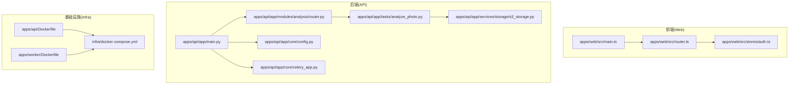
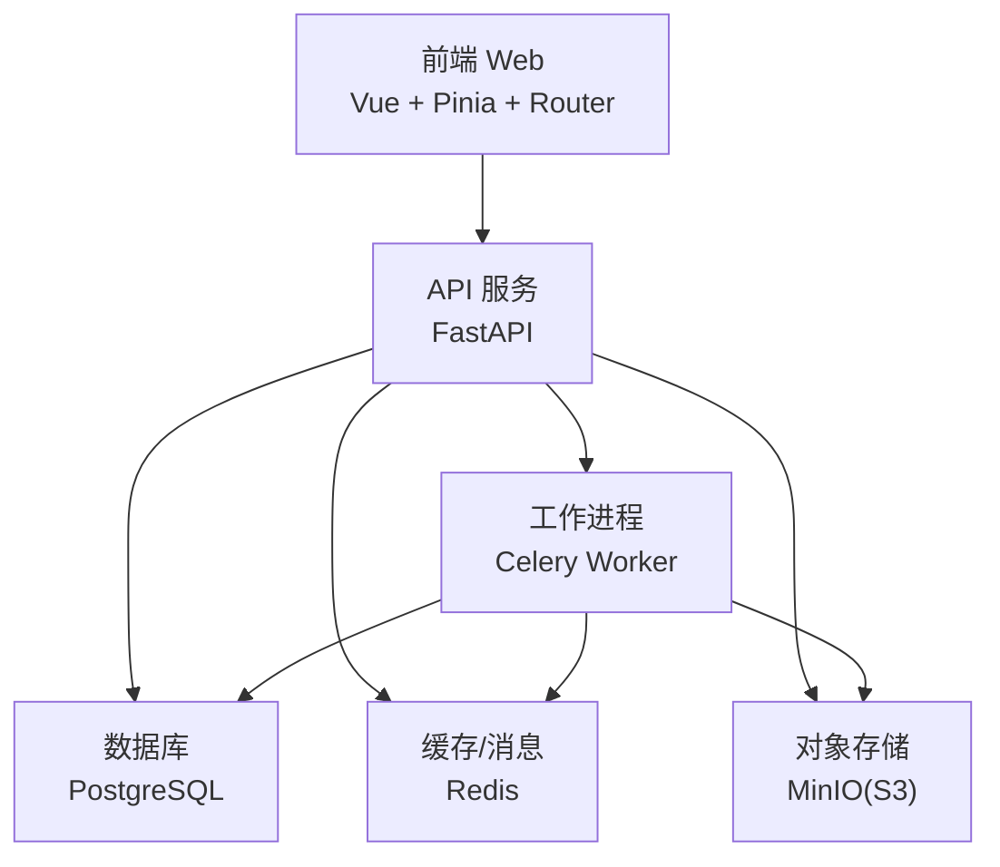
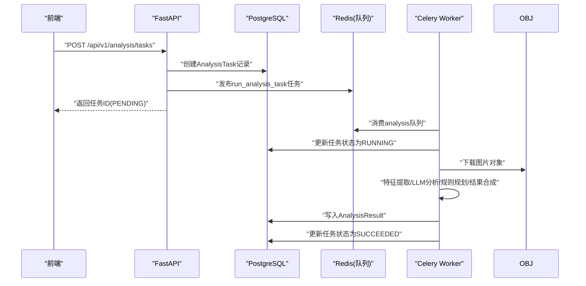
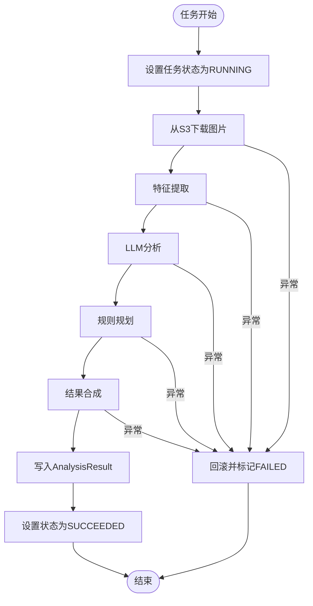
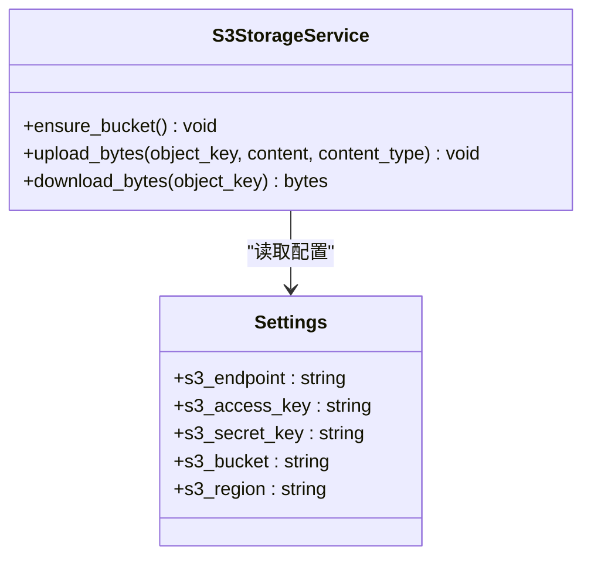
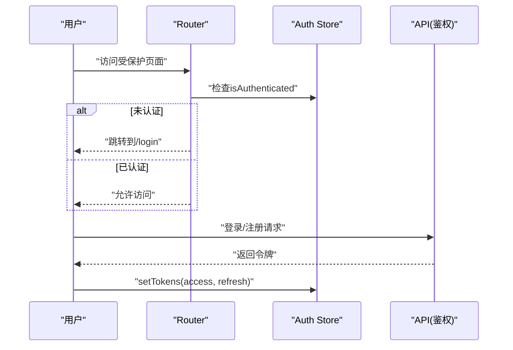
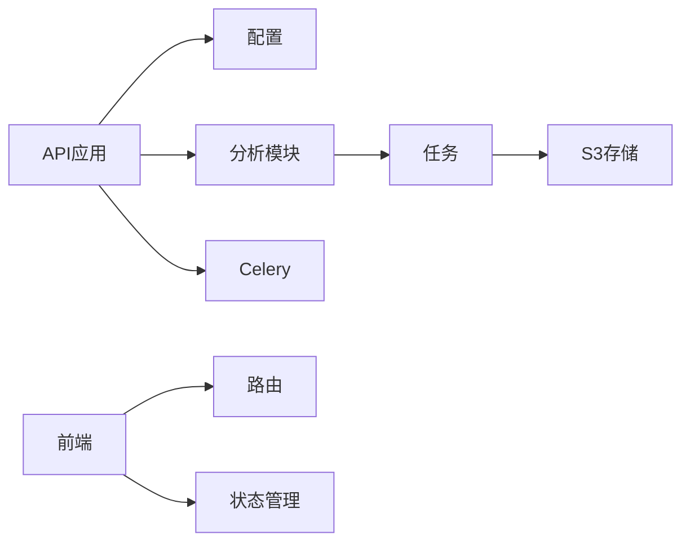
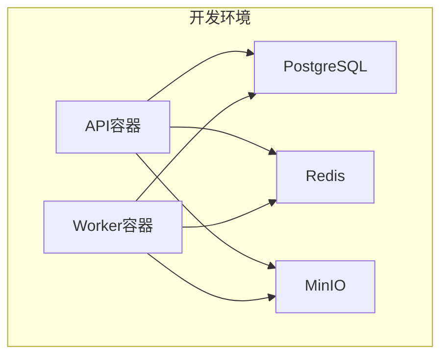

# 系统架构

<cite>
**本文引用的文件**
- [apps/api/app/main.py](file://apps/api/app/main.py)
- [apps/api/app/core/celery_app.py](file://apps/api/app/core/celery_app.py)
- [apps/api/app/core/config.py](file://apps/api/app/core/config.py)
- [apps/api/app/modules/analysis/router.py](file://apps/api/app/modules/analysis/router.py)
- [apps/api/app/tasks/analyze_photo.py](file://apps/api/app/tasks/analyze_photo.py)
- [apps/api/app/services/storage/s3_storage.py](file://apps/api/app/services/storage/s3_storage.py)
- [apps/api/app/services/ai/analyzer.py](file://apps/api/app/services/ai/analyzer.py)
- [apps/web/src/main.ts](file://apps/web/src/main.ts)
- [apps/web/src/router.ts](file://apps/web/src/router.ts)
- [apps/web/src/stores/auth.ts](file://apps/web/src/stores/auth.ts)
- [apps/api/Dockerfile](file://apps/api/Dockerfile)
- [apps/worker/Dockerfile](file://apps/worker/Dockerfile)
- [infra/docker-compose.yml](file://infra/docker-compose.yml)
- [apps/api/requirements.txt](file://apps/api/requirements.txt)
- [docs/architecture-v2.md](file://docs/architecture-v2.md)
</cite>

## 目录
1. [引言](#引言)
2. [项目结构](#项目结构)
3. [核心组件](#核心组件)
4. [架构总览](#架构总览)
5. [详细组件分析](#详细组件分析)
6. [依赖关系分析](#依赖关系分析)
7. [性能考量](#性能考量)
8. [故障排查指南](#故障排查指南)
9. [结论](#结论)
10. [附录](#附录)

## 引言
本项目为“AI摄影教练”应用，采用前后端分离架构，后端以FastAPI为核心构建REST API，结合Celery进行异步任务处理；前端使用Vue.js（TypeScript）与Pinia/Pinia实现状态管理与路由守卫。系统通过Docker容器化与Compose编排，本地开发环境包含PostgreSQL、Redis、MinIO等基础设施，形成可扩展、可演进的微服务风格后端与清晰的职责边界。

## 项目结构
- 后端API（FastAPI）
  - 核心配置与中间件：CORS、数据库初始化、路由注册
  - 模块化路由：analysis、auth、images、users
  - 任务定义与Celery集成
  - 服务层：AI/LLM/CV/规则/存储等
- 工作进程（Worker）
  - 基于Celery的异步任务执行器
- 前端（Vue.js）
  - 应用入口、路由、Pinia状态、视图组件
- 基础设施（Docker/Compose）
  - PostgreSQL、Redis、MinIO容器编排
- 文档与规范
  - 架构设计文档、协议schema

**图表来源**
- [apps/api/app/main.py:1-36](file://apps/api/app/main.py#L1-L36)
- [apps/api/app/core/config.py:1-47](file://apps/api/app/core/config.py#L1-L47)
- [apps/api/app/core/celery_app.py:1-21](file://apps/api/app/core/celery_app.py#L1-L21)
- [apps/api/app/modules/analysis/router.py:1-151](file://apps/api/app/modules/analysis/router.py#L1-L151)
- [apps/api/app/tasks/analyze_photo.py:1-108](file://apps/api/app/tasks/analyze_photo.py#L1-L108)
- [apps/api/app/services/storage/s3_storage.py:1-59](file://apps/api/app/services/storage/s3_storage.py#L1-L59)
- [apps/web/src/main.ts:1-14](file://apps/web/src/main.ts#L1-L14)
- [apps/web/src/router.ts:1-30](file://apps/web/src/router.ts#L1-L30)
- [apps/web/src/stores/auth.ts:1-41](file://apps/web/src/stores/auth.ts#L1-L41)
- [apps/api/Dockerfile:1-23](file://apps/api/Dockerfile#L1-L23)
- [apps/worker/Dockerfile:1-20](file://apps/worker/Dockerfile#L1-L20)
- [infra/docker-compose.yml:1-107](file://infra/docker-compose.yml#L1-L107)

**章节来源**
- [apps/api/app/main.py:1-36](file://apps/api/app/main.py#L1-L36)
- [apps/api/app/core/config.py:1-47](file://apps/api/app/core/config.py#L1-L47)
- [apps/api/app/core/celery_app.py:1-21](file://apps/api/app/core/celery_app.py#L1-L21)
- [apps/api/app/modules/analysis/router.py:1-151](file://apps/api/app/modules/analysis/router.py#L1-L151)
- [apps/api/app/tasks/analyze_photo.py:1-108](file://apps/api/app/tasks/analyze_photo.py#L1-L108)
- [apps/api/app/services/storage/s3_storage.py:1-59](file://apps/api/app/services/storage/s3_storage.py#L1-L59)
- [apps/web/src/main.ts:1-14](file://apps/web/src/main.ts#L1-L14)
- [apps/web/src/router.ts:1-30](file://apps/web/src/router.ts#L1-L30)
- [apps/web/src/stores/auth.ts:1-41](file://apps/web/src/stores/auth.ts#L1-L41)
- [apps/api/Dockerfile:1-23](file://apps/api/Dockerfile#L1-L23)
- [apps/worker/Dockerfile:1-20](file://apps/worker/Dockerfile#L1-L20)
- [infra/docker-compose.yml:1-107](file://infra/docker-compose.yml#L1-L107)

## 核心组件
- API网关与服务入口
  - FastAPI应用实例、CORS中间件、路由注册、启动事件
- 配置中心
  - 统一读取环境变量，提供数据库、缓存、存储、认证等配置
- 异步任务系统
  - Celery应用、任务路由、队列、任务执行器
- 分析模块
  - 任务创建、查询、重试；与任务执行器协作
- 存储服务
  - S3兼容对象存储封装，确保桶存在、上传下载
- 前端应用
  - Vue应用初始化、路由守卫、Pinia状态管理

**章节来源**
- [apps/api/app/main.py:1-36](file://apps/api/app/main.py#L1-L36)
- [apps/api/app/core/config.py:1-47](file://apps/api/app/core/config.py#L1-L47)
- [apps/api/app/core/celery_app.py:1-21](file://apps/api/app/core/celery_app.py#L1-L21)
- [apps/api/app/modules/analysis/router.py:1-151](file://apps/api/app/modules/analysis/router.py#L1-L151)
- [apps/api/app/tasks/analyze_photo.py:1-108](file://apps/api/app/tasks/analyze_photo.py#L1-L108)
- [apps/api/app/services/storage/s3_storage.py:1-59](file://apps/api/app/services/storage/s3_storage.py#L1-L59)
- [apps/web/src/main.ts:1-14](file://apps/web/src/main.ts#L1-L14)
- [apps/web/src/router.ts:1-30](file://apps/web/src/router.ts#L1-L30)
- [apps/web/src/stores/auth.ts:1-41](file://apps/web/src/stores/auth.ts#L1-L41)

## 架构总览
系统采用前后端分离与微服务风格后端：
- 前端：Vue.js（TypeScript），使用Pinia进行状态管理，Vue Router进行导航守卫
- 后端：FastAPI提供REST接口，Celery负责异步任务，PostgreSQL持久化，Redis用于消息与结果存储，MinIO提供对象存储
- 部署：Docker Compose编排，API与Worker分别容器化运行

**图表来源**
- [apps/api/app/main.py:1-36](file://apps/api/app/main.py#L1-L36)
- [apps/api/app/core/celery_app.py:1-21](file://apps/api/app/core/celery_app.py#L1-L21)
- [apps/api/app/core/config.py:13-20](file://apps/api/app/core/config.py#L13-L20)
- [apps/api/app/services/storage/s3_storage.py:11-22](file://apps/api/app/services/storage/s3_storage.py#L11-L22)
- [apps/worker/Dockerfile:19](file://apps/worker/Dockerfile#L19)
- [infra/docker-compose.yml:50-101](file://infra/docker-compose.yml#L50-L101)

## 详细组件分析

### API服务与路由
- 应用初始化：注册CORS、挂载各模块路由、启动数据库连接
- 分析模块：提供任务创建、详情查询、历史查询、重试等接口
- 权限与安全：依赖当前用户上下文校验资源归属

**图表来源**
- [apps/api/app/modules/analysis/router.py:45-74](file://apps/api/app/modules/analysis/router.py#L45-L74)
- [apps/api/app/tasks/analyze_photo.py:19-108](file://apps/api/app/tasks/analyze_photo.py#L19-L108)
- [apps/api/app/core/celery_app.py:5-19](file://apps/api/app/core/celery_app.py#L5-L19)
- [apps/api/app/services/storage/s3_storage.py:45-50](file://apps/api/app/services/storage/s3_storage.py#L45-L50)

**章节来源**
- [apps/api/app/main.py:11-35](file://apps/api/app/main.py#L11-L35)
- [apps/api/app/modules/analysis/router.py:1-151](file://apps/api/app/modules/analysis/router.py#L1-L151)
- [apps/api/app/tasks/analyze_photo.py:1-108](file://apps/api/app/tasks/analyze_photo.py#L1-L108)

### 异步任务与工作进程
- Celery应用：指定Broker/Backend、任务路由、时区与时钟
- 任务定义：run_analysis_task，包含状态流转、异常处理、数据库事务
- Worker容器：以队列名“analysis”启动Celery worker

**图表来源**
- [apps/api/app/core/celery_app.py:5-19](file://apps/api/app/core/celery_app.py#L5-L19)
- [apps/api/app/tasks/analyze_photo.py:19-108](file://apps/api/app/tasks/analyze_photo.py#L19-L108)

**章节来源**
- [apps/api/app/core/celery_app.py:1-21](file://apps/api/app/core/celery_app.py#L1-L21)
- [apps/api/app/tasks/analyze_photo.py:1-108](file://apps/api/app/tasks/analyze_photo.py#L1-L108)
- [apps/worker/Dockerfile:19](file://apps/worker/Dockerfile#L19)

### 存储服务与对象存储
- S3客户端封装：端点、凭证、区域、超时配置
- 桶检查与创建：ensure_bucket
- 上传/下载：upload_bytes/download_bytes
- 错误处理：统一抛出HTTP 503

**图表来源**
- [apps/api/app/services/storage/s3_storage.py:11-59](file://apps/api/app/services/storage/s3_storage.py#L11-L59)
- [apps/api/app/core/config.py:16-20](file://apps/api/app/core/config.py#L16-L20)

**章节来源**
- [apps/api/app/services/storage/s3_storage.py:1-59](file://apps/api/app/services/storage/s3_storage.py#L1-L59)
- [apps/api/app/core/config.py:1-47](file://apps/api/app/core/config.py#L1-L47)

### 前端应用与状态管理
- 应用入口：创建Vue应用、安装Pinia与Router
- 路由守卫：根据认证状态跳转登录/主页
- 认证状态：Pinia Store管理访问令牌、刷新令牌与用户信息

**图表来源**
- [apps/web/src/router.ts:21-30](file://apps/web/src/router.ts#L21-L30)
- [apps/web/src/stores/auth.ts:12-25](file://apps/web/src/stores/auth.ts#L12-L25)

**章节来源**
- [apps/web/src/main.ts:1-14](file://apps/web/src/main.ts#L1-L14)
- [apps/web/src/router.ts:1-30](file://apps/web/src/router.ts#L1-L30)
- [apps/web/src/stores/auth.ts:1-41](file://apps/web/src/stores/auth.ts#L1-L41)

### 技术选型与权衡
- FastAPI
  - 优点：高性能、自动生成OpenAPI文档、Pydantic集成、异步支持
  - 适用：本项目API轻量、异步任务解耦、数据库ORM集成良好
- Celery + Redis
  - 优点：成熟可靠的任务队列、易于水平扩展
  - 适用：分析任务耗时且可并行，队列隔离便于运维
- PostgreSQL
  - 优点：ACID、结构化强、迁移工具完善
  - 适用：任务与结果持久化、审计追踪
- MinIO
  - 优点：S3兼容、开发友好、对象版本与生命周期管理
  - 适用：图片资产存储与分发
- Vue.js + Pinia
  - 优点：生态成熟、TypeScript支持好、组件化开发
  - 适用：移动端H5、路由守卫与状态管理需求

**章节来源**
- [apps/api/requirements.txt:1-19](file://apps/api/requirements.txt#L1-L19)
- [apps/api/app/core/config.py:13-20](file://apps/api/app/core/config.py#L13-L20)
- [apps/api/app/services/storage/s3_storage.py:11-22](file://apps/api/app/services/storage/s3_storage.py#L11-L22)
- [apps/web/src/main.ts:1-14](file://apps/web/src/main.ts#L1-L14)

## 依赖关系分析
- 组件耦合
  - API模块依赖配置、数据库、Celery与任务模块
  - 任务模块依赖服务层（CV/LLM/规则/存储）
  - 前端依赖路由与状态管理
- 外部依赖
  - 数据库、缓存、对象存储均为外部服务，通过配置注入
- 可能的循环依赖
  - 当前结构按模块拆分，未见直接循环导入

**图表来源**
- [apps/api/app/main.py:11-24](file://apps/api/app/main.py#L11-L24)
- [apps/api/app/modules/analysis/router.py:1-24](file://apps/api/app/modules/analysis/router.py#L1-L24)
- [apps/api/app/tasks/analyze_photo.py:6-16](file://apps/api/app/tasks/analyze_photo.py#L6-L16)
- [apps/api/app/services/storage/s3_storage.py:8](file://apps/api/app/services/storage/s3_storage.py#L8)
- [apps/web/src/router.ts:1-19](file://apps/web/src/router.ts#L1-L19)
- [apps/web/src/stores/auth.ts:1-41](file://apps/web/src/stores/auth.ts#L1-L41)

**章节来源**
- [apps/api/app/main.py:1-36](file://apps/api/app/main.py#L1-L36)
- [apps/api/app/modules/analysis/router.py:1-151](file://apps/api/app/modules/analysis/router.py#L1-L151)
- [apps/api/app/tasks/analyze_photo.py:1-108](file://apps/api/app/tasks/analyze_photo.py#L1-L108)
- [apps/api/app/services/storage/s3_storage.py:1-59](file://apps/api/app/services/storage/s3_storage.py#L1-L59)
- [apps/web/src/router.ts:1-30](file://apps/web/src/router.ts#L1-L30)
- [apps/web/src/stores/auth.ts:1-41](file://apps/web/src/stores/auth.ts#L1-L41)

## 性能考量
- 异步化与解耦
  - 图片分析与特征提取等重任务放入Celery，避免阻塞API响应
- 数据库与缓存
  - 使用连接池与索引优化，Redis作为队列与结果缓存
- 对象存储
  - MinIO直连，减少中间层开销；合理设置超时与重试
- 前端
  - 路由懒加载与状态按需更新，避免全量刷新

[本节为通用性能指导，无需特定文件引用]

## 故障排查指南
- API健康检查
  - /healthz返回“ok”表示服务可用
- 任务失败
  - 查看任务状态与错误码/消息；确认Redis与数据库连通
- 存储异常
  - S3存储服务抛出HTTP 503，检查端点、密钥、桶是否存在
- 认证问题
  - 前端Store中令牌缺失或过期，触发登录流程

**章节来源**
- [apps/api/app/main.py:32-35](file://apps/api/app/main.py#L32-L35)
- [apps/api/app/tasks/analyze_photo.py:97-107](file://apps/api/app/tasks/analyze_photo.py#L97-L107)
- [apps/api/app/services/storage/s3_storage.py:23-32](file://apps/api/app/services/storage/s3_storage.py#L23-L32)
- [apps/web/src/stores/auth.ts:12-25](file://apps/web/src/stores/auth.ts#L12-L25)

## 结论
本项目在保持现有MVP接口与异步任务链路的基础上，通过模块化与职责分离，形成了清晰的前后端与服务边界。技术栈选择兼顾性能与可维护性，基础设施通过Docker Compose实现快速搭建。建议后续按架构文档逐步引入特征表、标注与编辑动作协议，持续提升系统的稳定性与扩展性。

[本节为总结性内容，无需特定文件引用]

## 附录

### 部署拓扑与基础设施
- 开发环境
  - PostgreSQL、Redis、MinIO容器化运行
  - API与Worker分别容器化，共享网络
- 关键环境变量
  - 数据库URL、Redis URL、S3端点与凭证、模型名称与提示版本、CORS来源

**图表来源**
- [infra/docker-compose.yml:1-107](file://infra/docker-compose.yml#L1-L107)
- [apps/api/Dockerfile:20-23](file://apps/api/Dockerfile#L20-L23)
- [apps/worker/Dockerfile:19](file://apps/worker/Dockerfile#L19)

**章节来源**
- [infra/docker-compose.yml:1-107](file://infra/docker-compose.yml#L1-L107)
- [apps/api/Dockerfile:1-23](file://apps/api/Dockerfile#L1-L23)
- [apps/worker/Dockerfile:1-20](file://apps/worker/Dockerfile#L1-L20)

### 协议与演进
- 架构文档明确了“CV产出事实、LLM产出解释、规则产出动作”的原则，并给出稳定结果协议、标注协议与编辑动作协议的schema建议，便于后续平滑演进。

**章节来源**
- [docs/architecture-v2.md:1-424](file://docs/architecture-v2.md#L1-L424)