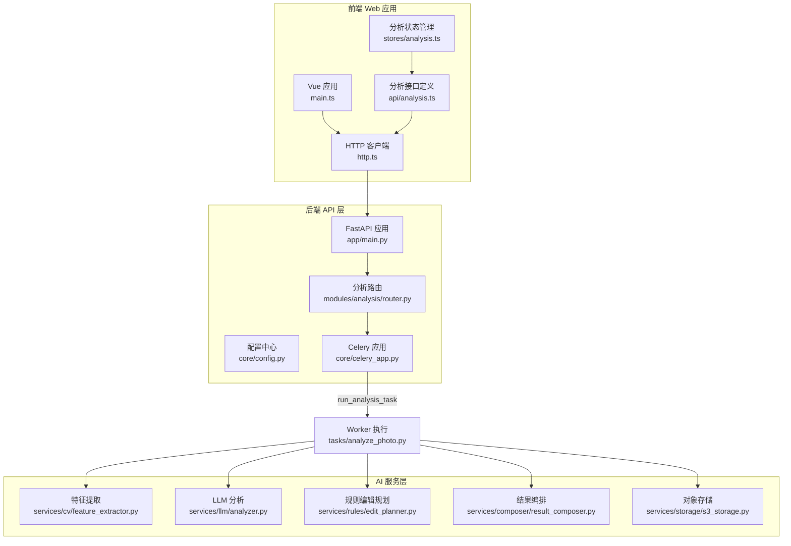
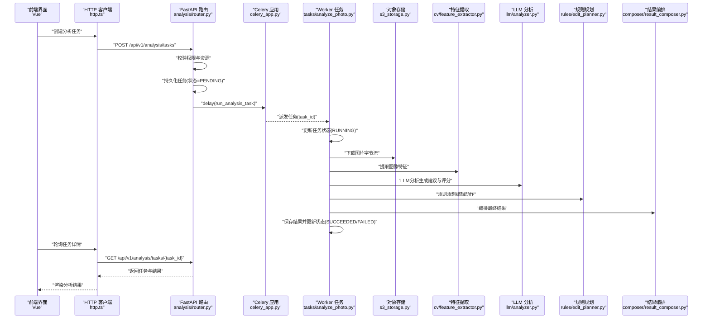
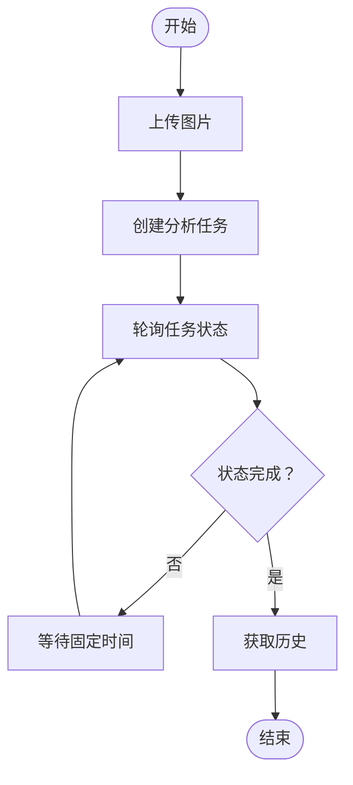
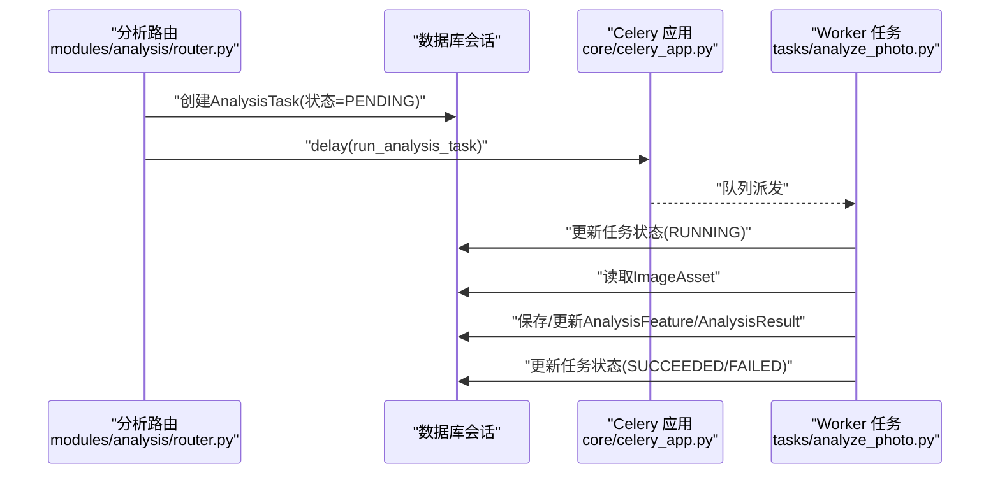
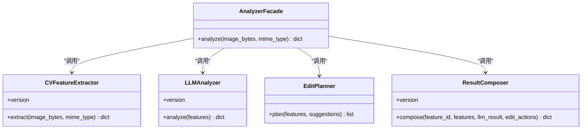
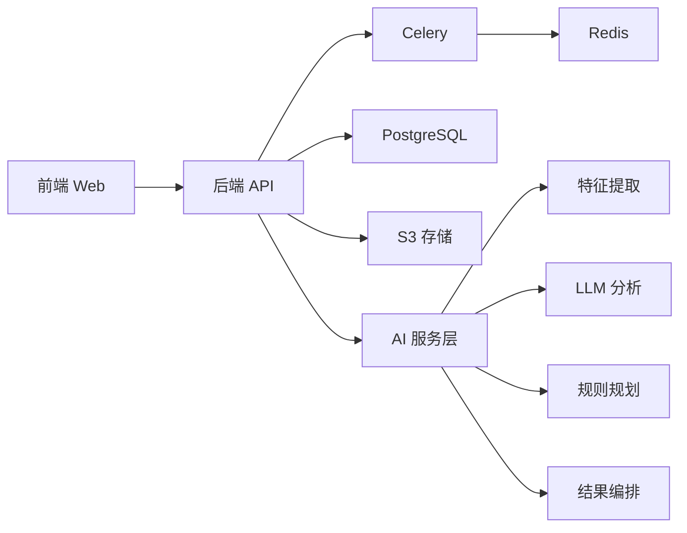

# 组件交互关系

<cite>
**本文引用的文件**
- [apps/api/app/main.py](file://apps/api/app/main.py)
- [apps/api/app/core/config.py](file://apps/api/app/core/config.py)
- [apps/api/app/core/celery_app.py](file://apps/api/app/core/celery_app.py)
- [apps/api/app/modules/analysis/router.py](file://apps/api/app/modules/analysis/router.py)
- [apps/api/app/tasks/analyze_photo.py](file://apps/api/app/tasks/analyze_photo.py)
- [apps/api/app/services/ai/analyzer.py](file://apps/api/app/services/ai/analyzer.py)
- [apps/api/app/services/composer/result_composer.py](file://apps/api/app/services/composer/result_composer.py)
- [apps/api/app/services/storage/s3_storage.py](file://apps/api/app/services/storage/s3_storage.py)
- [apps/api/app/services/cv/feature_extractor.py](file://apps/api/app/services/cv/feature_extractor.py)
- [apps/api/app/services/llm/analyzer.py](file://apps/api/app/services/llm/analyzer.py)
- [apps/api/app/services/rules/edit_planner.py](file://apps/api/app/services/rules/edit_planner.py)
- [apps/web/src/main.ts](file://apps/web/src/main.ts)
- [apps/web/src/api/http.ts](file://apps/web/src/api/http.ts)
- [apps/web/src/api/analysis.ts](file://apps/web/src/api/analysis.ts)
- [apps/web/src/stores/analysis.ts](file://apps/web/src/stores/analysis.ts)
</cite>

## 目录
1. [简介](#简介)
2. [项目结构](#项目结构)
3. [核心组件](#核心组件)
4. [架构总览](#架构总览)
5. [详细组件分析](#详细组件分析)
6. [依赖分析](#依赖分析)
7. [性能考虑](#性能考虑)
8. [故障排查指南](#故障排查指南)
9. [结论](#结论)

## 简介
本文件面向“AI摄影教练”项目，系统化梳理前后端组件交互关系与通信机制，覆盖以下方面：
- 前端Vue.js应用与后端FastAPI API的交互路径与数据契约
- API层到Worker层的任务调度与异步执行流程
- AI服务层（计算机视觉、大模型、规则引擎、结果编排）的协作关系
- 数据传递格式、错误处理与状态同步策略
- 异步任务执行时序图与调用关系图
- 微服务架构下的服务发现与服务通信机制（基于现有代码的实现边界）

## 项目结构
项目采用多模块分层组织：
- 后端API层：FastAPI应用、路由模块、数据库会话、Celery任务
- AI服务层：特征提取、LLM分析、规则编辑规划、结果编排、对象存储
- 前端Web层：Axios封装HTTP客户端、Pinia状态管理、分析任务状态轮询

图表来源
- [apps/api/app/main.py:1-36](file://apps/api/app/main.py#L1-L36)
- [apps/api/app/core/config.py:1-47](file://apps/api/app/core/config.py#L1-L47)
- [apps/api/app/core/celery_app.py:1-21](file://apps/api/app/core/celery_app.py#L1-L21)
- [apps/api/app/modules/analysis/router.py:1-151](file://apps/api/app/modules/analysis/router.py#L1-L151)
- [apps/api/app/tasks/analyze_photo.py:1-108](file://apps/api/app/tasks/analyze_photo.py#L1-L108)
- [apps/api/app/services/storage/s3_storage.py:1-59](file://apps/api/app/services/storage/s3_storage.py#L1-L59)
- [apps/api/app/services/cv/feature_extractor.py:1-98](file://apps/api/app/services/cv/feature_extractor.py#L1-L98)
- [apps/api/app/services/llm/analyzer.py:1-139](file://apps/api/app/services/llm/analyzer.py#L1-L139)
- [apps/api/app/services/rules/edit_planner.py:1-97](file://apps/api/app/services/rules/edit_planner.py#L1-L97)
- [apps/web/src/main.ts:1-14](file://apps/web/src/main.ts#L1-L14)
- [apps/web/src/api/http.ts:1-94](file://apps/web/src/api/http.ts#L1-L94)
- [apps/web/src/stores/analysis.ts:1-142](file://apps/web/src/stores/analysis.ts#L1-L142)
- [apps/web/src/api/analysis.ts:1-101](file://apps/web/src/api/analysis.ts#L1-L101)

章节来源
- [apps/api/app/main.py:1-36](file://apps/api/app/main.py#L1-L36)
- [apps/web/src/main.ts:1-14](file://apps/web/src/main.ts#L1-L14)

## 核心组件
- 前端应用
  - Vue应用入口与路由、状态管理
  - Axios封装的HTTP客户端，内置鉴权拦截与刷新逻辑
  - 分析接口定义与Pinia状态管理，负责轮询任务状态
- 后端API
  - FastAPI应用，CORS中间件、路由注册、启动事件
  - 配置中心，统一管理数据库、Redis、S3、JWT等参数
  - Celery应用，任务队列与路由配置
  - 分析路由模块，创建任务、查询详情、历史列表、重试
- AI服务层
  - 特征提取：图像统计与几何特征
  - LLM分析：生成摘要、建议与评分
  - 规则编辑规划：基于规则的动作计划
  - 结果编排：整合特征、建议、动作形成统一结果
  - 对象存储：S3兼容存储，确保桶存在与下载上传

章节来源
- [apps/web/src/api/http.ts:1-94](file://apps/web/src/api/http.ts#L1-L94)
- [apps/web/src/stores/analysis.ts:1-142](file://apps/web/src/stores/analysis.ts#L1-L142)
- [apps/api/app/main.py:1-36](file://apps/api/app/main.py#L1-L36)
- [apps/api/app/core/config.py:1-47](file://apps/api/app/core/config.py#L1-L47)
- [apps/api/app/core/celery_app.py:1-21](file://apps/api/app/core/celery_app.py#L1-L21)
- [apps/api/app/modules/analysis/router.py:1-151](file://apps/api/app/modules/analysis/router.py#L1-L151)
- [apps/api/app/services/storage/s3_storage.py:1-59](file://apps/api/app/services/storage/s3_storage.py#L1-L59)
- [apps/api/app/services/cv/feature_extractor.py:1-98](file://apps/api/app/services/cv/feature_extractor.py#L1-L98)
- [apps/api/app/services/llm/analyzer.py:1-139](file://apps/api/app/services/llm/analyzer.py#L1-L139)
- [apps/api/app/services/rules/edit_planner.py:1-97](file://apps/api/app/services/rules/edit_planner.py#L1-L97)
- [apps/api/app/services/composer/result_composer.py:1-99](file://apps/api/app/services/composer/result_composer.py#L1-L99)

## 架构总览
系统采用“前端单页应用 + 后端API + 异步Worker”的分层架构：
- 前端通过Axios与后端API交互，使用Bearer Token鉴权
- API层接收请求，持久化任务，投递Celery任务至队列
- Worker从队列拉取任务，串行执行AI服务链路，写入分析结果
- 前端通过轮询或重试接口获取任务状态与结果

图表来源
- [apps/api/app/modules/analysis/router.py:45-74](file://apps/api/app/modules/analysis/router.py#L45-L74)
- [apps/api/app/core/celery_app.py:5-19](file://apps/api/app/core/celery_app.py#L5-L19)
- [apps/api/app/tasks/analyze_photo.py:19-108](file://apps/api/app/tasks/analyze_photo.py#L19-L108)
- [apps/api/app/services/storage/s3_storage.py:45-50](file://apps/api/app/services/storage/s3_storage.py#L45-L50)
- [apps/api/app/services/cv/feature_extractor.py:15-91](file://apps/api/app/services/cv/feature_extractor.py#L15-L91)
- [apps/api/app/services/llm/analyzer.py:8-118](file://apps/api/app/services/llm/analyzer.py#L8-L118)
- [apps/api/app/services/rules/edit_planner.py:6-34](file://apps/api/app/services/rules/edit_planner.py#L6-L34)
- [apps/api/app/services/composer/result_composer.py:8-23](file://apps/api/app/services/composer/result_composer.py#L8-L23)
- [apps/web/src/api/analysis.ts:82-100](file://apps/web/src/api/analysis.ts#L82-L100)
- [apps/web/src/stores/analysis.ts:76-90](file://apps/web/src/stores/analysis.ts#L76-L90)

## 详细组件分析

### 前端组件交互
- 应用入口与依赖注入
  - 创建Vue应用，挂载Pinia与路由
- HTTP客户端
  - 注入Authorization头；401/403时自动刷新令牌并重试
  - 统一超时与基础URL配置
- 分析状态管理
  - 上传图片、创建任务、轮询任务状态、获取历史、重试任务
  - 轮询间隔固定，成功或失败即停止轮询并刷新历史

图表来源
- [apps/web/src/stores/analysis.ts:34-90](file://apps/web/src/stores/analysis.ts#L34-L90)
- [apps/web/src/api/analysis.ts:82-100](file://apps/web/src/api/analysis.ts#L82-L100)
- [apps/web/src/api/http.ts:10-91](file://apps/web/src/api/http.ts#L10-L91)

章节来源
- [apps/web/src/main.ts:1-14](file://apps/web/src/main.ts#L1-L14)
- [apps/web/src/api/http.ts:1-94](file://apps/web/src/api/http.ts#L1-L94)
- [apps/web/src/stores/analysis.ts:1-142](file://apps/web/src/stores/analysis.ts#L1-L142)
- [apps/web/src/api/analysis.ts:1-101](file://apps/web/src/api/analysis.ts#L1-L101)

### 后端API与任务调度
- 应用初始化
  - 注册CORS、包含分析/认证/图片/用户路由
  - 启动事件初始化数据库
- 配置中心
  - 统一管理数据库、Redis、S3、JWT等参数
- 分析路由
  - 创建任务：校验资源归属、持久化任务、投递异步任务
  - 查询详情：按用户权限返回任务与结果
  - 历史列表：按用户与时间排序返回摘要
  - 重试任务：仅允许失败或成功的任务重试
- Celery任务
  - 任务路由到analysis队列
  - 任务执行：更新状态、下载图片、调用AI服务链路、保存结果

图表来源
- [apps/api/app/modules/analysis/router.py:45-74](file://apps/api/app/modules/analysis/router.py#L45-L74)
- [apps/api/app/core/celery_app.py:5-19](file://apps/api/app/core/celery_app.py#L5-L19)
- [apps/api/app/tasks/analyze_photo.py:19-108](file://apps/api/app/tasks/analyze_photo.py#L19-L108)

章节来源
- [apps/api/app/main.py:1-36](file://apps/api/app/main.py#L1-L36)
- [apps/api/app/core/config.py:1-47](file://apps/api/app/core/config.py#L1-L47)
- [apps/api/app/modules/analysis/router.py:1-151](file://apps/api/app/modules/analysis/router.py#L1-L151)
- [apps/api/app/core/celery_app.py:1-21](file://apps/api/app/core/celery_app.py#L1-L21)
- [apps/api/app/tasks/analyze_photo.py:1-108](file://apps/api/app/tasks/analyze_photo.py#L1-L108)

### AI服务层协作
- 特征提取
  - 输入：图片字节流与MIME类型
  - 输出：图像尺寸、统计特征、主体区域、高光/阴影区域、地平线参考线
- LLM分析
  - 输入：特征
  - 输出：摘要、建议列表、评分
- 规则编辑规划
  - 输入：特征与建议
  - 输出：裁剪、曝光、白平衡等编辑动作
- 结果编排
  - 输入：特征ID、特征、LLM结果、编辑动作
  - 输出：统一结果结构，包含版本、摘要、建议、评分、标注、编辑动作

图表来源
- [apps/api/app/services/cv/feature_extractor.py:12-98](file://apps/api/app/services/cv/feature_extractor.py#L12-L98)
- [apps/api/app/services/llm/analyzer.py:5-139](file://apps/api/app/services/llm/analyzer.py#L5-L139)
- [apps/api/app/services/rules/edit_planner.py:5-97](file://apps/api/app/services/rules/edit_planner.py#L5-L97)
- [apps/api/app/services/composer/result_composer.py:5-99](file://apps/api/app/services/composer/result_composer.py#L5-L99)
- [apps/api/app/services/ai/analyzer.py:10-27](file://apps/api/app/services/ai/analyzer.py#L10-L27)

章节来源
- [apps/api/app/services/ai/analyzer.py:1-27](file://apps/api/app/services/ai/analyzer.py#L1-L27)
- [apps/api/app/services/composer/result_composer.py:1-99](file://apps/api/app/services/composer/result_composer.py#L1-L99)
- [apps/api/app/services/storage/s3_storage.py:1-59](file://apps/api/app/services/storage/s3_storage.py#L1-L59)
- [apps/api/app/services/cv/feature_extractor.py:1-98](file://apps/api/app/services/cv/feature_extractor.py#L1-L98)
- [apps/api/app/services/llm/analyzer.py:1-139](file://apps/api/app/services/llm/analyzer.py#L1-L139)
- [apps/api/app/services/rules/edit_planner.py:1-97](file://apps/api/app/services/rules/edit_planner.py#L1-L97)

## 依赖分析
- 组件耦合
  - API路由依赖数据库会话与Celery任务
  - Worker任务依赖存储服务与AI服务模块
  - 前端通过HTTP客户端与API交互，依赖鉴权与刷新机制
- 外部依赖
  - Redis作为Celery消息代理与结果后端
  - PostgreSQL作为主数据库
  - MinIO/S3兼容对象存储
- 可能的循环依赖
  - 当前模块间为单向依赖，未见循环导入

图表来源
- [apps/api/app/core/celery_app.py:5-19](file://apps/api/app/core/celery_app.py#L5-L19)
- [apps/api/app/core/config.py:13-20](file://apps/api/app/core/config.py#L13-L20)
- [apps/api/app/modules/analysis/router.py:1-24](file://apps/api/app/modules/analysis/router.py#L1-L24)
- [apps/api/app/tasks/analyze_photo.py:1-17](file://apps/api/app/tasks/analyze_photo.py#L1-L17)
- [apps/web/src/api/http.ts:1-94](file://apps/web/src/api/http.ts#L1-L94)

章节来源
- [apps/api/app/core/celery_app.py:1-21](file://apps/api/app/core/celery_app.py#L1-L21)
- [apps/api/app/core/config.py:1-47](file://apps/api/app/core/config.py#L1-L47)
- [apps/api/app/modules/analysis/router.py:1-24](file://apps/api/app/modules/analysis/router.py#L1-L24)
- [apps/api/app/tasks/analyze_photo.py:1-17](file://apps/api/app/tasks/analyze_photo.py#L1-L17)
- [apps/web/src/api/http.ts:1-94](file://apps/web/src/api/http.ts#L1-L94)

## 性能考虑
- 异步执行
  - 图片分析任务通过Celery异步执行，避免阻塞API响应
- 缓存与复用
  - AI服务与存储服务均使用LRU缓存，降低重复初始化开销
- 轮询策略
  - 前端固定轮询间隔，建议结合WebSocket或服务端推送以降低延迟
- I/O优化
  - 对象存储读写采用超时与重试配置，建议在网关层增加限流与熔断

## 故障排查指南
- 前端
  - 401/403自动刷新：检查本地存储的访问/刷新令牌是否有效
  - 轮询异常：确认任务状态变化与历史刷新逻辑
- 后端
  - 任务失败：查看任务表中的错误码与错误信息字段
  - 存储不可用：S3客户端异常映射为503，检查端点、密钥与桶状态
- 服务链路
  - 特征提取/LLM/规则/编排任一环节异常，需核对输入输出结构与版本号

章节来源
- [apps/web/src/api/http.ts:37-91](file://apps/web/src/api/http.ts#L37-L91)
- [apps/api/app/tasks/analyze_photo.py:97-107](file://apps/api/app/tasks/analyze_photo.py#L97-L107)
- [apps/api/app/services/storage/s3_storage.py:23-50](file://apps/api/app/services/storage/s3_storage.py#L23-L50)

## 结论
本项目通过清晰的前后端职责划分与异步任务执行，实现了从图片上传到分析结果呈现的完整闭环。API层负责鉴权、任务编排与状态管理，Worker层串联AI服务链路并持久化结果，前端通过状态管理与轮询实现良好的用户体验。建议在后续迭代中引入服务发现与服务治理（如基于现有配置中心扩展），并优化前端轮询策略以提升实时性与资源利用率。