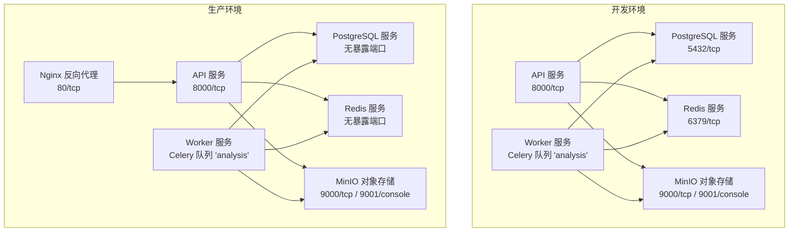
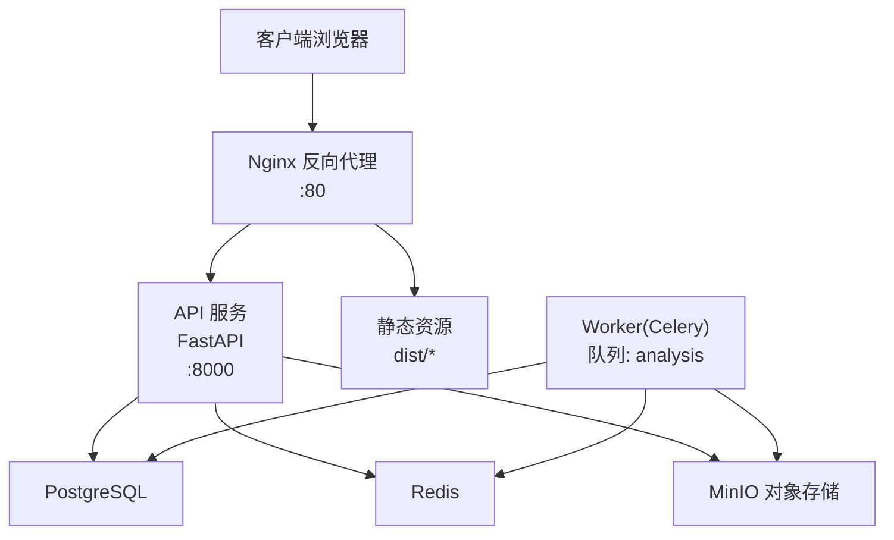
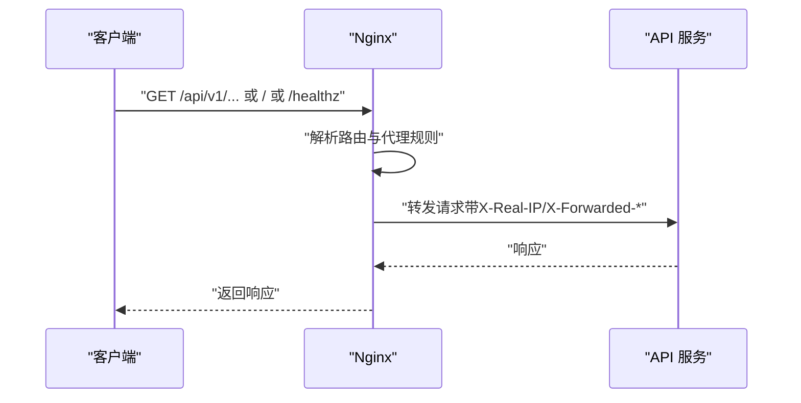
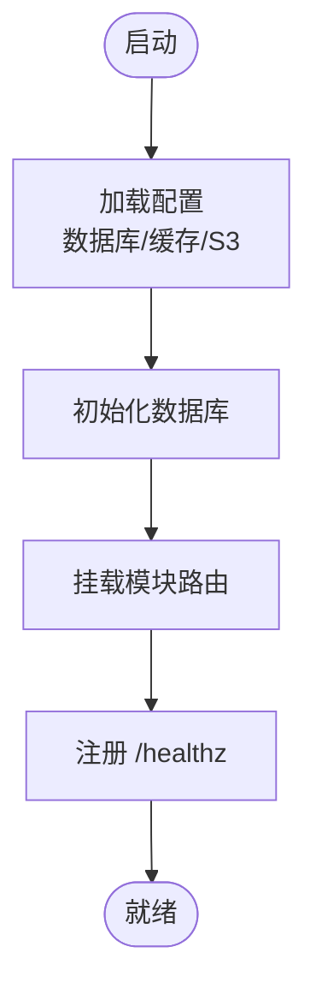
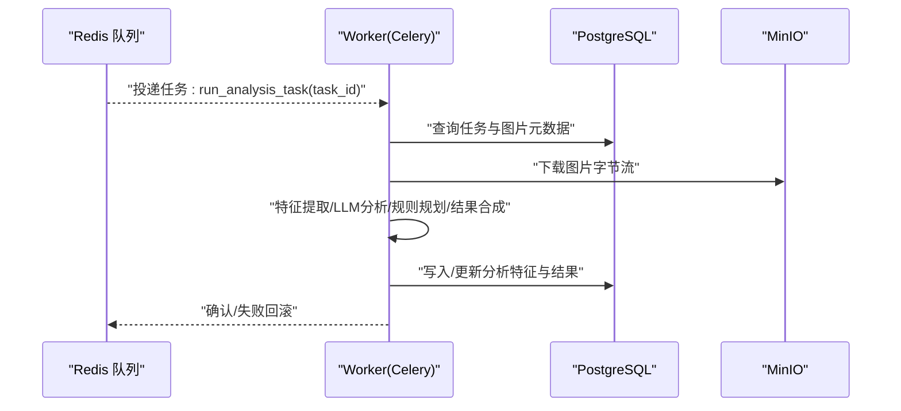
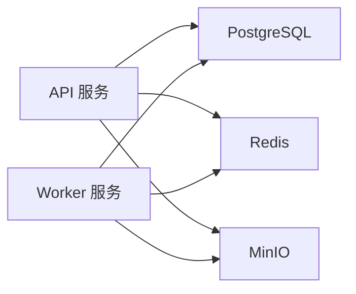
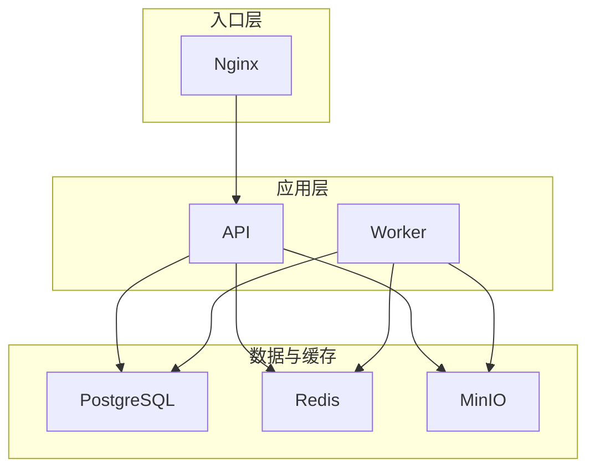

# 部署架构

<cite>
**本文引用的文件**
- [docker-compose.yml](file://infra/docker-compose.yml)
- [docker-compose.prod.yml](file://infra/docker-compose.prod.yml)
- [default.conf](file://infra/nginx/default.conf)
- [deploy.sh](file://infra/deploy.sh)
- [Dockerfile（API）](file://apps/api/Dockerfile)
- [Dockerfile（Web）](file://apps/web/Dockerfile)
- [Dockerfile（Worker）](file://apps/worker/Dockerfile)
- [requirements.txt（API）](file://apps/api/requirements.txt)
- [main.py（API）](file://apps/api/app/main.py)
- [config.py（API 核心配置）](file://apps/api/app/core/config.py)
- [celery_app.py（API 任务队列）](file://apps/api/app/core/celery_app.py)
- [analyze_photo.py（API 任务实现）](file://apps/api/app/tasks/analyze_photo.py)
- [架构文档（V2）](file://docs/architecture-v2.md)
</cite>

## 目录
1. [引言](#引言)
2. [项目结构](#项目结构)
3. [核心组件](#核心组件)
4. [架构总览](#架构总览)
5. [详细组件分析](#详细组件分析)
6. [依赖关系分析](#依赖关系分析)
7. [性能考虑](#性能考虑)
8. [故障排查指南](#故障排查指南)
9. [结论](#结论)
10. [附录](#附录)

## 引言
本文件面向AI摄影教练项目的部署团队与运维人员，系统化阐述生产级与开发级部署拓扑、容器化与反向代理配置、负载均衡策略、服务发现与健康检查、自动扩缩容与监控告警等运维特性，并给出可操作的部署脚本与配置要点。文档以仓库中的Compose与Nginx配置为基础，结合API应用的健康检查与任务队列机制，形成从入口到后端服务的完整部署视图。

## 项目结构
项目采用多仓单体风格，按功能划分为前端Web、后端API与异步Worker三部分，配合数据库、缓存与对象存储服务，通过Docker Compose进行编排。开发与生产环境分别使用不同的Compose文件与环境变量，确保本地开发与线上部署的一致性与隔离性。

图表来源
- [docker-compose.yml:1-107](file://infra/docker-compose.yml#L1-L107)
- [docker-compose.prod.yml:1-128](file://infra/docker-compose.prod.yml#L1-L128)

章节来源
- [docker-compose.yml:1-107](file://infra/docker-compose.yml#L1-L107)
- [docker-compose.prod.yml:1-128](file://infra/docker-compose.prod.yml#L1-L128)

## 核心组件
- Web/Nginx（生产入口）
  - 使用Nginx作为静态资源服务器与API反向代理，监听80端口，将/api前缀转发至API服务，根路径指向前端构建产物。
  - 提供健康检查端点/healthz，便于外部探活。
- API（后端服务）
  - 基于FastAPI，提供REST接口与健康检查端点；启动时初始化数据库；支持CORS跨域。
  - 通过环境变量配置数据库、缓存与对象存储连接；内置健康检查探测。
- Worker（异步任务）
  - 基于Celery，消费analysis队列的任务，执行图像分析与结果落库。
- 数据与缓存
  - PostgreSQL：持久化用户、图片、任务与分析结果。
  - Redis：任务队列与会话缓存。
  - MinIO：对象存储，存放原图与派生图。
- 开发与生产差异
  - 开发环境直接暴露数据库、缓存与对象存储端口，便于调试；生产环境隐藏内部端口，仅通过Nginx对外提供服务。

章节来源
- [default.conf:1-30](file://infra/nginx/default.conf#L1-L30)
- [main.py（API）:1-36](file://apps/api/app/main.py#L1-L36)
- [config.py（API 核心配置）:1-47](file://apps/api/app/core/config.py#L1-L47)
- [celery_app.py（API 任务队列）:1-21](file://apps/api/app/core/celery_app.py#L1-L21)
- [docker-compose.yml:1-107](file://infra/docker-compose.yml#L1-L107)
- [docker-compose.prod.yml:1-128](file://infra/docker-compose.prod.yml#L1-L128)

## 架构总览
下图展示生产环境的网络拓扑与流量走向：客户端请求经Nginx进入，静态资源由Nginx直接提供，API请求被代理到后端API服务；API与Worker通过共享的PostgreSQL、Redis与MinIO完成数据与任务协作。

图表来源
- [docker-compose.prod.yml:1-128](file://infra/docker-compose.prod.yml#L1-L128)
- [default.conf:1-30](file://infra/nginx/default.conf#L1-L30)
- [main.py（API）:1-36](file://apps/api/app/main.py#L1-L36)

## 详细组件分析

### Nginx 反向代理与静态资源
- 监听80端口，根路径提供前端构建产物；/api前缀转发至API服务；/healthz代理到API健康检查端点。
- 透传真实客户端IP与协议头，保证API侧日志与限流策略准确。
- 健康检查使用HTTP GET探测Nginx自身，便于容器编排器进行存活判断。

图表来源
- [default.conf:1-30](file://infra/nginx/default.conf#L1-L30)

章节来源
- [default.conf:1-30](file://infra/nginx/default.conf#L1-L30)

### API 服务（FastAPI）
- 启动时初始化数据库，注册模块路由与CORS中间件。
- 提供/healthz健康检查端点，用于容器编排器探活。
- 通过配置模块加载环境变量，设置数据库、缓存与对象存储连接字符串。

图表来源
- [main.py（API）:1-36](file://apps/api/app/main.py#L1-L36)
- [config.py（API 核心配置）:1-47](file://apps/api/app/core/config.py#L1-L47)

章节来源
- [main.py（API）:1-36](file://apps/api/app/main.py#L1-L36)
- [config.py（API 核心配置）:1-47](file://apps/api/app/core/config.py#L1-L47)

### Worker 服务（Celery）
- 以Celery worker形式运行，绑定analysis队列，消费异步任务。
- 任务实现中包含完整的数据库事务与异常处理逻辑，失败时记录错误码与消息，成功时更新任务状态与结果。

图表来源
- [celery_app.py（API 任务队列）:1-21](file://apps/api/app/core/celery_app.py#L1-L21)
- [analyze_photo.py（API 任务实现）:1-108](file://apps/api/app/tasks/analyze_photo.py#L1-L108)

章节来源
- [celery_app.py（API 任务队列）:1-21](file://apps/api/app/core/celery_app.py#L1-L21)
- [analyze_photo.py（API 任务实现）:1-108](file://apps/api/app/tasks/analyze_photo.py#L1-L108)

### 数据与缓存（PostgreSQL/Redis/MinIO）
- PostgreSQL：开发与生产均使用独立卷持久化数据，API与Worker通过连接串访问。
- Redis：作为Celery的broker与backend，提供任务队列与结果存储。
- MinIO：提供S3兼容的对象存储，API与Worker通过连接串访问桶与对象键。

图表来源
- [docker-compose.yml:1-107](file://infra/docker-compose.yml#L1-L107)
- [docker-compose.prod.yml:1-128](file://infra/docker-compose.prod.yml#L1-L128)

章节来源
- [docker-compose.yml:1-107](file://infra/docker-compose.yml#L1-L107)
- [docker-compose.prod.yml:1-128](file://infra/docker-compose.prod.yml#L1-L128)

### 容器镜像与端口暴露
- API镜像：基于Python slim镜像，安装依赖后以uvicorn运行FastAPI，默认暴露8000端口。
- Web镜像：基于Node构建产物，使用Nginx作为静态服务器，暴露80端口并内置健康检查。
- Worker镜像：基于Python slim镜像，安装依赖后以Celery worker运行，绑定analysis队列。

章节来源
- [Dockerfile（API）:1-23](file://apps/api/Dockerfile#L1-L23)
- [Dockerfile（Web）:1-22](file://apps/web/Dockerfile#L1-L22)
- [Dockerfile（Worker）:1-20](file://apps/worker/Dockerfile#L1-L20)

## 依赖关系分析
- 组件耦合
  - API对PostgreSQL、Redis与MinIO存在直接依赖；Worker同样依赖上述基础设施。
  - Nginx仅依赖API服务，不直接依赖数据库与缓存，降低耦合面。
- 间接依赖
  - Worker通过Redis队列与API解耦；API通过S3与对象存储解耦。
- 健康检查
  - API提供/healthz端点，Nginx提供自身健康检查；数据库、缓存与对象存储通过Compose健康检查探活。
- 自动扩缩容
  - 当前Compose未定义副本数，需在容器编排平台（如Kubernetes）中引入副本与HPA策略以实现横向扩展。

图表来源
- [docker-compose.prod.yml:1-128](file://infra/docker-compose.prod.yml#L1-L128)
- [default.conf:1-30](file://infra/nginx/default.conf#L1-L30)

章节来源
- [docker-compose.prod.yml:1-128](file://infra/docker-compose.prod.yml#L1-L128)
- [default.conf:1-30](file://infra/nginx/default.conf#L1-L30)

## 性能考虑
- 并发与资源
  - API使用uvicorn运行，建议在容器编排平台中根据CPU与内存限制设置并发进程与线程数。
  - Worker应按任务吞吐量配置副本数量与队列分区，避免热点队列阻塞。
- 存储与I/O
  - MinIO与PostgreSQL建议使用SSD存储卷，保障I/O性能。
  - 对象存储访问路径尽量直连内网地址，减少网络延迟。
- 缓存策略
  - Redis用于任务队列与会话缓存，建议开启持久化与合理淘汰策略。
- 网络与安全
  - 生产环境隐藏数据库与缓存端口，仅通过Nginx与API暴露；启用TLS与防火墙策略。
- 监控与日志
  - 建议接入APM与日志聚合系统，采集API与Worker的指标与错误日志。

## 故障排查指南
- 健康检查失败
  - API：检查/healthz端点是否可达，确认数据库、缓存与对象存储连通性。
  - Nginx：检查静态资源路径与代理规则，确认API服务已就绪。
- 任务积压
  - 检查Redis队列长度与Worker副本数；查看任务日志定位异常。
- 数据库问题
  - 检查PostgreSQL卷与连接串；确认迁移脚本已执行。
- 对象存储问题
  - 检查MinIO控制台与桶权限；确认S3连接串与凭证正确。

章节来源
- [deploy.sh:1-63](file://infra/deploy.sh#L1-L63)
- [docker-compose.prod.yml:85-96](file://infra/docker-compose.prod.yml#L85-L96)

## 结论
本部署方案以Docker Compose为核心，结合Nginx反向代理与健康检查，实现了从入口到后端服务的清晰边界与可运维性。生产环境通过隐藏内部端口与集中探活，提升了安全性与可观测性。未来可在容器编排平台中引入副本管理、HPA与服务网格，进一步增强弹性与可观测性。

## 附录

### 开发环境与生产环境差异
- 开发环境
  - 直接暴露数据库、缓存与对象存储端口，便于本地调试。
  - API与Worker通过Compose依赖关系启动，健康检查由Compose内置探针执行。
- 生产环境
  - 仅暴露Nginx端口，内部服务通过容器网络互通。
  - API提供/healthz端点，Nginx提供自身健康检查；部署脚本校验必需环境变量。

章节来源
- [docker-compose.yml:1-107](file://infra/docker-compose.yml#L1-L107)
- [docker-compose.prod.yml:1-128](file://infra/docker-compose.prod.yml#L1-L128)
- [deploy.sh:1-63](file://infra/deploy.sh#L1-L63)

### 部署命令与环境准备
- 使用生产部署脚本，指定.env.prod环境文件与docker-compose.prod.yml，自动构建并后台启动。
- 部署完成后可通过脚本提供的命令查看日志与健康检查URL。

章节来源
- [deploy.sh:1-63](file://infra/deploy.sh#L1-L63)

### 任务与数据流参考
- 任务类型与执行链路可参考架构文档，明确任务拆分与幂等控制需求，指导部署时的队列与副本规划。

章节来源
- [架构文档（V2）:350-362](file://docs/architecture-v2.md#L350-L362)