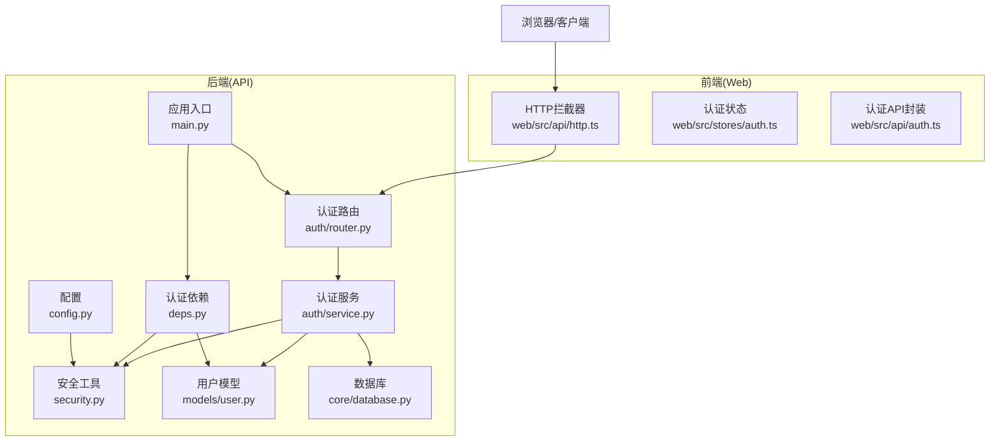
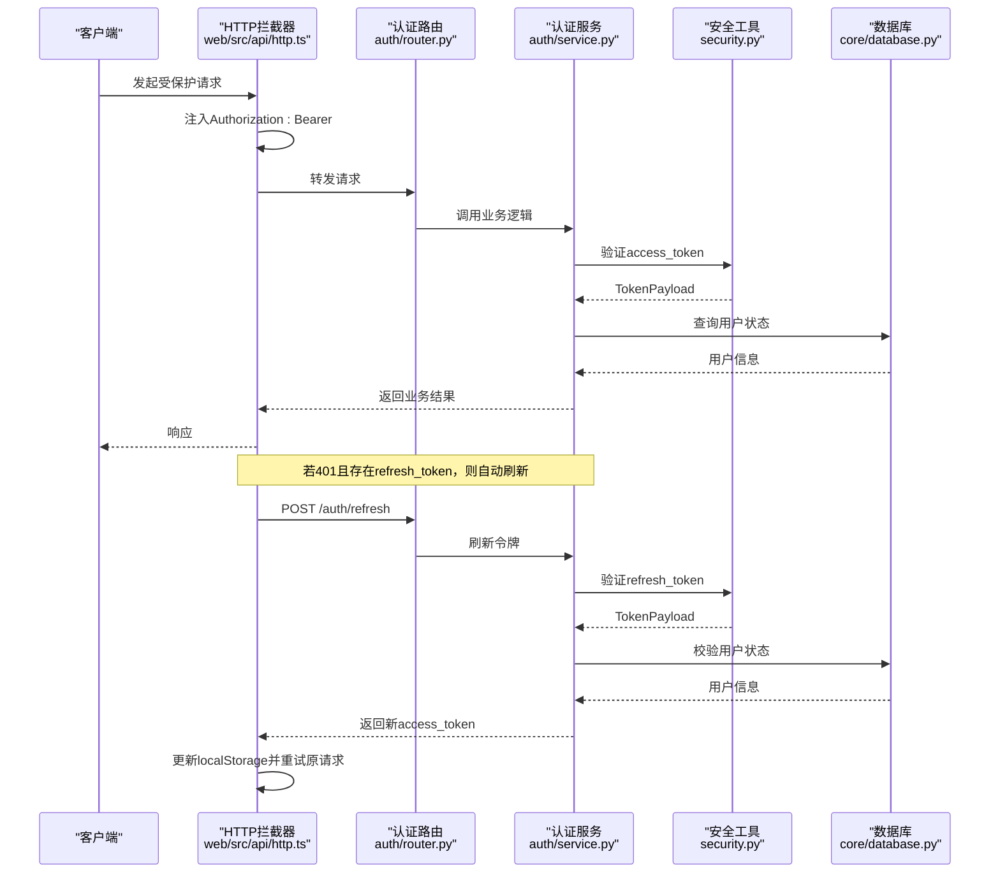
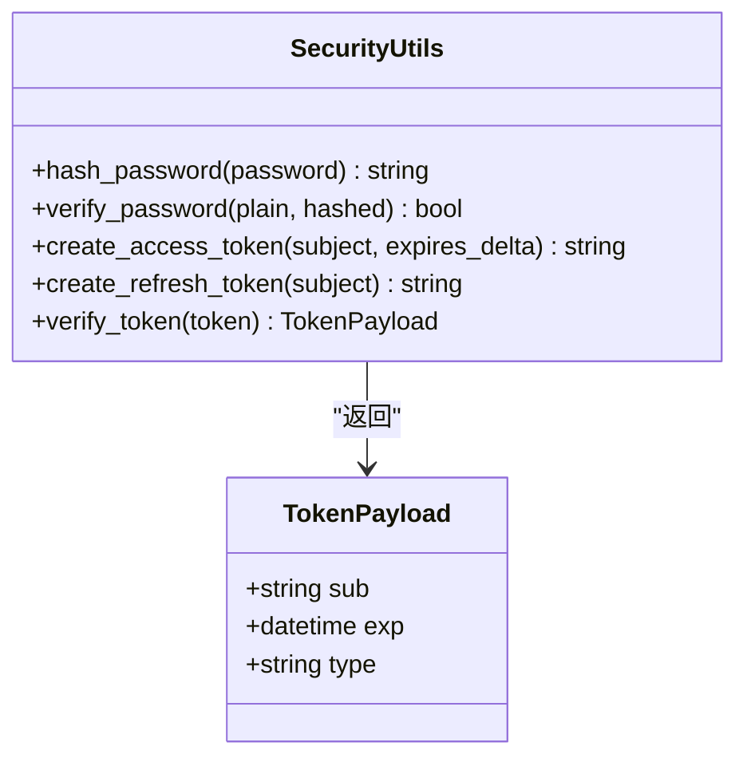
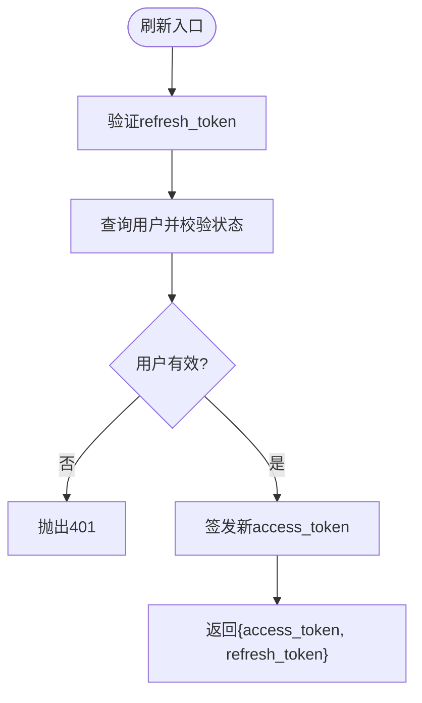
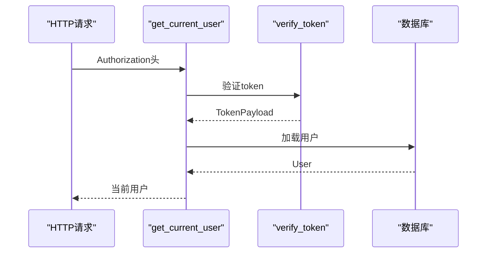
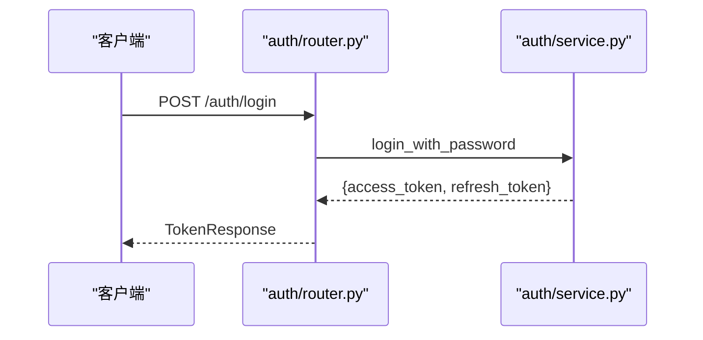
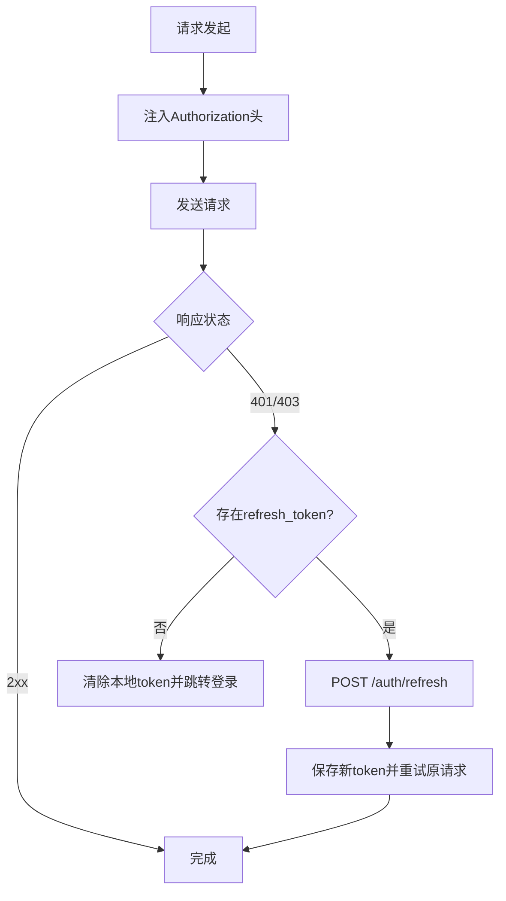
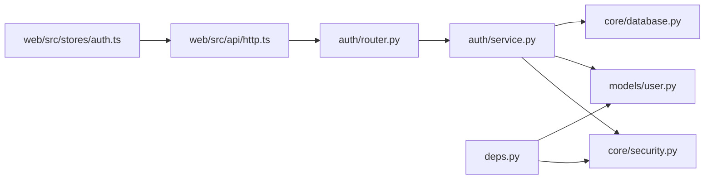

# JWT令牌管理

<cite>
**本文引用的文件**
- [apps/api/app/core/security.py](file://apps/api/app/core/security.py)
- [apps/api/app/modules/auth/service.py](file://apps/api/app/modules/auth/service.py)
- [apps/api/app/schemas/auth.py](file://apps/api/app/schemas/auth.py)
- [apps/api/app/deps.py](file://apps/api/app/deps.py)
- [apps/api/app/core/config.py](file://apps/api/app/core/config.py)
- [apps/api/app/modules/auth/router.py](file://apps/api/app/modules/auth/router.py)
- [apps/web/src/stores/auth.ts](file://apps/web/src/stores/auth.ts)
- [apps/web/src/api/auth.ts](file://apps/web/src/api/auth.ts)
- [apps/web/src/api/http.ts](file://apps/web/src/api/http.ts)
- [apps/api/app/models/user.py](file://apps/api/app/models/user.py)
- [apps/api/app/core/database.py](file://apps/api/app/core/database.py)
- [apps/api/tests/test_auth.py](file://apps/api/tests/test_auth.py)
- [apps/api/app/main.py](file://apps/api/app/main.py)
- [openspec/changes/add-user-auth/specs/user-auth/spec.md](file://openspec/changes/add-user-auth/specs/user-auth/spec.md)
- [openspec/changes/add-user-auth/design.md](file://openspec/changes/add-user-auth/design.md)
</cite>

## 目录
1. [简介](#简介)
2. [项目结构](#项目结构)
3. [核心组件](#核心组件)
4. [架构总览](#架构总览)
5. [详细组件分析](#详细组件分析)
6. [依赖分析](#依赖分析)
7. [性能考虑](#性能考虑)
8. [故障排除指南](#故障排除指南)
9. [结论](#结论)
10. [附录](#附录)

## 简介
本文件面向“AI摄影教练”项目的JWT令牌管理系统，系统性阐述access_token与refresh_token的生成、验证与刷新机制，覆盖生命周期管理、安全策略、过期处理、自动续期、异常处理、存储与传输最佳实践、HTTP请求头使用方式、安全响应头建议、调试工具与故障排除方法，以及安全审计与监控的实施指导。文档严格依据仓库现有实现进行分析，并提供可视化图示帮助理解。

## 项目结构
后端采用FastAPI + SQLAlchemy，认证模块位于apps/api/app/modules/auth，核心安全工具位于apps/api/app/core/security，前端位于apps/web，使用Pinia状态管理与Axios拦截器实现自动刷新与令牌持久化。

**图表来源**
- [apps/api/app/core/config.py:1-47](file://apps/api/app/core/config.py#L1-L47)
- [apps/api/app/core/security.py:1-72](file://apps/api/app/core/security.py#L1-L72)
- [apps/api/app/modules/auth/service.py:1-145](file://apps/api/app/modules/auth/service.py#L1-L145)
- [apps/api/app/modules/auth/router.py:1-93](file://apps/api/app/modules/auth/router.py#L1-L93)
- [apps/api/app/deps.py:1-41](file://apps/api/app/deps.py#L1-L41)
- [apps/api/app/models/user.py:1-28](file://apps/api/app/models/user.py#L1-L28)
- [apps/api/app/core/database.py:1-51](file://apps/api/app/core/database.py#L1-L51)
- [apps/api/app/main.py:1-36](file://apps/api/app/main.py#L1-L36)
- [apps/web/src/api/http.ts:1-94](file://apps/web/src/api/http.ts#L1-L94)
- [apps/web/src/stores/auth.ts:1-41](file://apps/web/src/stores/auth.ts#L1-L41)
- [apps/web/src/api/auth.ts:1-56](file://apps/web/src/api/auth.ts#L1-L56)

**章节来源**
- [apps/api/app/main.py:1-36](file://apps/api/app/main.py#L1-L36)
- [apps/api/app/core/config.py:1-47](file://apps/api/app/core/config.py#L1-L47)

## 核心组件
- 安全工具模块：提供密码哈希、JWT生成与验证、Token载荷模型等基础能力。
- 认证服务：实现注册、登录、刷新、邮箱验证、密码重置等业务流程。
- 认证依赖：从Authorization头解析Bearer Token并解析当前用户。
- 认证路由：对外暴露注册、登录、刷新、登出、邮箱验证、密码重置等端点。
- 前端HTTP拦截器：统一注入Authorization头，处理401自动刷新，持久化令牌。
- 配置：集中管理JWT密钥、算法与过期时间等参数。
- 用户模型：承载用户基本信息与认证相关字段。

**章节来源**
- [apps/api/app/core/security.py:1-72](file://apps/api/app/core/security.py#L1-L72)
- [apps/api/app/modules/auth/service.py:1-145](file://apps/api/app/modules/auth/service.py#L1-L145)
- [apps/api/app/deps.py:1-41](file://apps/api/app/deps.py#L1-L41)
- [apps/api/app/modules/auth/router.py:1-93](file://apps/api/app/modules/auth/router.py#L1-L93)
- [apps/web/src/api/http.ts:1-94](file://apps/web/src/api/http.ts#L1-L94)
- [apps/api/app/core/config.py:1-47](file://apps/api/app/core/config.py#L1-L47)
- [apps/api/app/models/user.py:1-28](file://apps/api/app/models/user.py#L1-L28)

## 架构总览
下图展示从客户端发起请求到后端鉴权与业务处理的整体流程，包括令牌生成、传输、验证与自动刷新。

**图表来源**
- [apps/web/src/api/http.ts:1-94](file://apps/web/src/api/http.ts#L1-L94)
- [apps/api/app/modules/auth/router.py:1-93](file://apps/api/app/modules/auth/router.py#L1-L93)
- [apps/api/app/modules/auth/service.py:1-145](file://apps/api/app/modules/auth/service.py#L1-L145)
- [apps/api/app/core/security.py:1-72](file://apps/api/app/core/security.py#L1-L72)
- [apps/api/app/core/database.py:1-51](file://apps/api/app/core/database.py#L1-L51)

## 详细组件分析

### 1) JWT生成与验证（security.py）
- Token载荷模型：包含sub、exp、type字段，默认type为access。
- 密码哈希：使用bcrypt，确保密码安全存储。
- access_token：默认30分钟过期，类型为access。
- refresh_token：默认7天过期，类型为refresh。
- 验证逻辑：解码JWT，校验签名与算法，提取sub与type，捕获过期与无效错误并转换为HTTP 401。

**图表来源**
- [apps/api/app/core/security.py:12-72](file://apps/api/app/core/security.py#L12-L72)

**章节来源**
- [apps/api/app/core/security.py:12-72](file://apps/api/app/core/security.py#L12-L72)

### 2) 认证服务（auth/service.py）
- 注册：检查邮箱唯一性，生成用户记录并返回access_token与refresh_token。
- 登录：校验邮箱与密码，返回token对。
- 刷新：使用refresh_token换取新的access_token，保持refresh_token不变。
- 邮箱验证：短期access_token用于验证邮箱。
- 密码重置：短期access_token用于重置密码，开发模式记录日志。

**图表来源**
- [apps/api/app/modules/auth/service.py:77-92](file://apps/api/app/modules/auth/service.py#L77-L92)

**章节来源**
- [apps/api/app/modules/auth/service.py:50-92](file://apps/api/app/modules/auth/service.py#L50-L92)

### 3) 认证依赖注入（deps.py）
- 从Authorization头解析Bearer Token。
- 解析失败或用户不存在/非活跃时返回401。
- 将当前用户注入到路由依赖链中。

**图表来源**
- [apps/api/app/deps.py:15-33](file://apps/api/app/deps.py#L15-L33)
- [apps/api/app/core/security.py:49-72](file://apps/api/app/core/security.py#L49-L72)
- [apps/api/app/models/user.py:12-28](file://apps/api/app/models/user.py#L12-L28)

**章节来源**
- [apps/api/app/deps.py:15-33](file://apps/api/app/deps.py#L15-L33)

### 4) 认证路由（auth/router.py）
- /auth/register：注册并返回token对。
- /auth/login：登录返回token对。
- /auth/refresh：使用refresh_token刷新access_token。
- /auth/logout：返回登出成功消息（客户端负责清理）。
- /auth/verify-email：邮箱验证。
- /auth/forgot-password：发送密码重置提示（开发模式记录日志）。
- /auth/reset-password：使用重置token更新密码。

**图表来源**
- [apps/api/app/modules/auth/router.py:42-46](file://apps/api/app/modules/auth/router.py#L42-L46)
- [apps/api/app/modules/auth/service.py:50-75](file://apps/api/app/modules/auth/service.py#L50-L75)

**章节来源**
- [apps/api/app/modules/auth/router.py:24-93](file://apps/api/app/modules/auth/router.py#L24-L93)

### 5) 前端HTTP拦截器与状态管理（web/src）
- http.ts：请求拦截器注入Authorization头；响应拦截器处理401自动刷新；并发刷新队列避免重复刷新。
- stores/auth.ts：在localStorage中持久化access_token与refresh_token。
- api/auth.ts：封装注册、登录、刷新、登出、个人资料等API。

**图表来源**
- [apps/web/src/api/http.ts:10-91](file://apps/web/src/api/http.ts#L10-L91)
- [apps/web/src/stores/auth.ts:6-25](file://apps/web/src/stores/auth.ts#L6-L25)
- [apps/web/src/api/auth.ts:29-43](file://apps/web/src/api/auth.ts#L29-L43)

**章节来源**
- [apps/web/src/api/http.ts:10-91](file://apps/web/src/api/http.ts#L10-L91)
- [apps/web/src/stores/auth.ts:6-25](file://apps/web/src/stores/auth.ts#L6-L25)
- [apps/web/src/api/auth.ts:29-43](file://apps/web/src/api/auth.ts#L29-L43)

### 6) 配置与生命周期（config.py）
- JWT密钥、算法、access_token过期分钟数、refresh_token过期天数集中配置。
- 默认值：access_token_expire_minutes=30，refresh_token_expire_days=7。

**章节来源**
- [apps/api/app/core/config.py:30-34](file://apps/api/app/core/config.py#L30-L34)

### 7) 数据模型与数据库初始化（models/user.py, core/database.py）
- 用户模型包含邮箱、密码哈希、昵称、头像、激活与验证状态等字段。
- 初始化时应用增量schema更新，确保字段存在。

**章节来源**
- [apps/api/app/models/user.py:12-28](file://apps/api/app/models/user.py#L12-L28)
- [apps/api/app/core/database.py:28-51](file://apps/api/app/core/database.py#L28-L51)

## 依赖分析
- 后端模块间依赖清晰：路由依赖服务，服务依赖安全工具与数据库，依赖注入模块依赖安全工具与用户模型。
- 前端依赖后端API，通过Axios拦截器统一处理认证与刷新。
- 配置集中管理，便于全局调整JWT行为。

**图表来源**
- [apps/api/app/modules/auth/router.py:1-93](file://apps/api/app/modules/auth/router.py#L1-L93)
- [apps/api/app/modules/auth/service.py:1-145](file://apps/api/app/modules/auth/service.py#L1-L145)
- [apps/api/app/core/security.py:1-72](file://apps/api/app/core/security.py#L1-L72)
- [apps/api/app/models/user.py:1-28](file://apps/api/app/models/user.py#L1-28)
- [apps/api/app/core/database.py:1-51](file://apps/api/app/core/database.py#L1-L51)
- [apps/api/app/deps.py:1-41](file://apps/api/app/deps.py#L1-L41)
- [apps/web/src/api/http.ts:1-94](file://apps/web/src/api/http.ts#L1-L94)
- [apps/web/src/stores/auth.ts:1-41](file://apps/web/src/stores/auth.ts#L1-L41)

**章节来源**
- [apps/api/app/modules/auth/router.py:1-93](file://apps/api/app/modules/auth/router.py#L1-L93)
- [apps/api/app/modules/auth/service.py:1-145](file://apps/api/app/modules/auth/service.py#L1-L145)
- [apps/api/app/deps.py:1-41](file://apps/api/app/deps.py#L1-L41)
- [apps/web/src/api/http.ts:1-94](file://apps/web/src/api/http.ts#L1-L94)

## 性能考虑
- access_token短生命周期（默认30分钟）降低泄露风险，结合refresh_token减少频繁登录开销。
- 前端并发请求的401自动刷新采用队列去重，避免重复网络请求。
- 数据库连接池与pre_ping优化提升连接稳定性。

[本节为通用性能讨论，不涉及具体文件分析]

## 故障排除指南
- 常见错误与处理
  - 401未认证：检查Authorization头是否正确注入Bearer token。
  - 401令牌过期：触发前端自动刷新流程；若refresh_token无效则清空本地token并跳转登录。
  - 401无效token：refresh_token被篡改或服务端校验失败。
  - 409邮箱已注册：注册时邮箱冲突。
  - 400邮箱验证/重置token无效：token过期或格式错误。
- 调试建议
  - 后端：开启日志，观察认证服务与依赖注入的错误堆栈。
  - 前端：检查localStorage中access_token与refresh_token；确认Axios拦截器是否注入Authorization头。
  - 单元测试：参考集成测试覆盖注册、登录、刷新、登出、密码重置等场景。

**章节来源**
- [apps/api/tests/test_auth.py:48-191](file://apps/api/tests/test_auth.py#L48-L191)
- [apps/web/src/api/http.ts:19-91](file://apps/web/src/api/http.ts#L19-L91)
- [apps/api/app/modules/auth/service.py:50-140](file://apps/api/app/modules/auth/service.py#L50-L140)

## 结论
本JWT系统以简洁的HS256算法与短生命周期access_token为核心，结合refresh_token实现安全与可用性的平衡。后端通过依赖注入统一鉴权，前端通过拦截器实现透明的自动刷新。建议在生产环境中强化安全措施：引入HTTPS与安全响应头、使用安全存储（如HttpOnly Cookie）、实现refresh_token黑名单与服务端撤销、加强CSP与XSS防护，并建立令牌审计与监控机制。

[本节为总结性内容，不涉及具体文件分析]

## 附录

### A. access_token与refresh_token区别与生命周期
- 类型与用途
  - access_token：短期访问令牌，用于受保护资源访问。
  - refresh_token：长期刷新令牌，用于换取新的access_token。
- 生命周期
  - access_token：默认30分钟过期。
  - refresh_token：默认7天过期。
- 安全策略
  - access_token短生命周期降低泄露影响面。
  - refresh_token在服务端不做撤销（MVP阶段），建议后续引入黑名单与服务端存储。

**章节来源**
- [apps/api/app/core/config.py:30-34](file://apps/api/app/core/config.py#L30-L34)
- [apps/api/app/core/security.py:32-46](file://apps/api/app/core/security.py#L32-L46)
- [openspec/changes/add-user-auth/design.md:83-86](file://openspec/changes/add-user-auth/design.md#L83-L86)

### B. 令牌存储、传输与验证最佳实践
- 存储
  - 前端：localStorage用于持久化，注意XSS防护与CSP策略。
  - 后端：仅存储密码哈希，不存储明文或refresh_token。
- 传输
  - 使用Authorization: Bearer头传输access_token。
  - HTTPS强制启用，防止中间人攻击。
- 验证
  - 服务端严格校验签名、算法与过期时间。
  - 依赖注入统一解析当前用户，避免路由分散处理。

**章节来源**
- [apps/web/src/api/http.ts:10-17](file://apps/web/src/api/http.ts#L10-L17)
- [apps/api/app/deps.py:15-33](file://apps/api/app/deps.py#L15-L33)
- [openspec/changes/add-user-auth/design.md:84-86](file://openspec/changes/add-user-auth/design.md#L84-L86)

### C. HTTP请求头与安全响应头
- 请求头
  - Authorization: Bearer <access_token>
- 安全响应头（建议）
  - Content-Security-Policy
  - Strict-Transport-Security
  - X-Content-Type-Options: nosniff
  - Referrer-Policy
  - SameSite（配合Cookie场景）

[本节为通用安全建议，不涉及具体文件分析]

### D. 令牌调试工具与监控
- 调试工具
  - 浏览器开发者工具Network面板查看Authorization头与响应状态。
  - 后端日志记录认证事件与错误。
- 监控建议
  - 认证成功率、401/403分布、刷新频率、用户活跃度。
  - 异常告警：频繁刷新、大量401、无效token比例上升。

[本节为通用指导，不涉及具体文件分析]

### E. 规范与需求对照
- 用户认证与令牌规范详见用户认证规格说明文档。

**章节来源**
- [openspec/changes/add-user-auth/specs/user-auth/spec.md:1-134](file://openspec/changes/add-user-auth/specs/user-auth/spec.md#L1-L134)