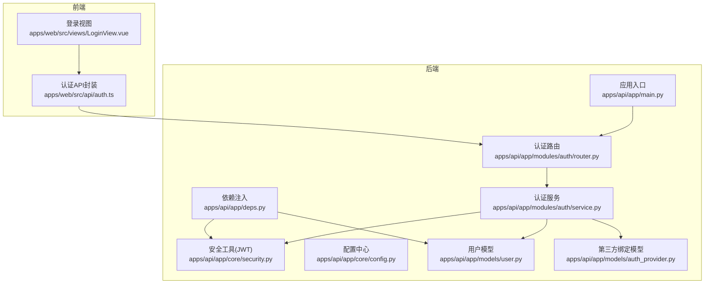
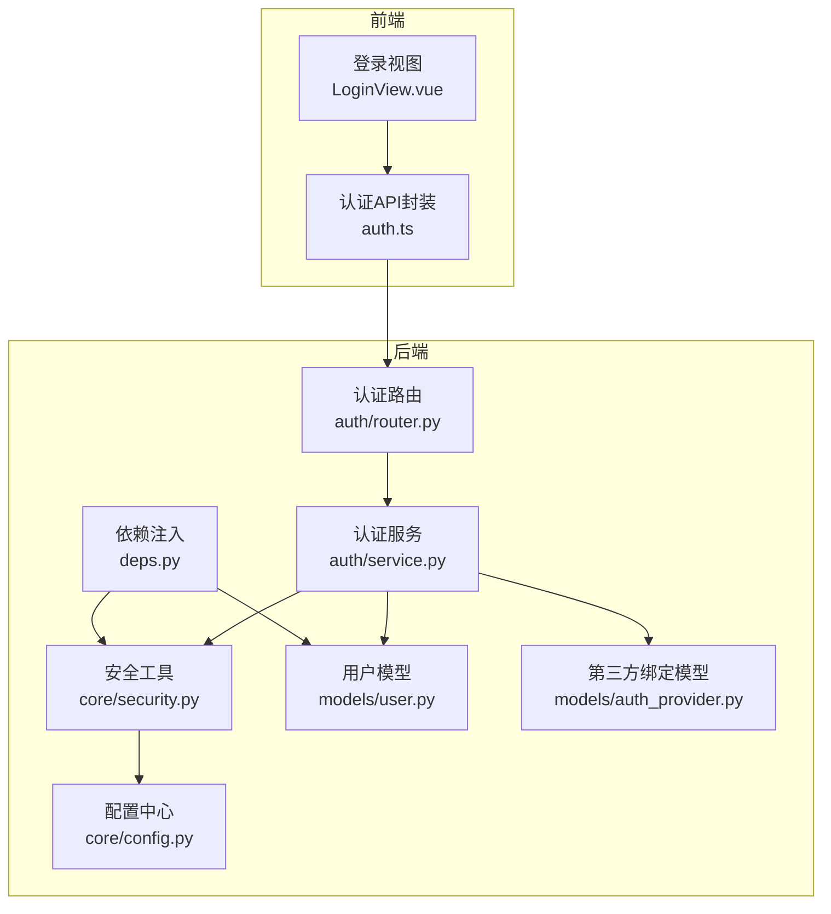
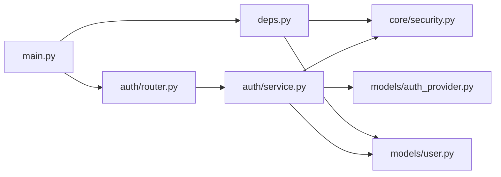
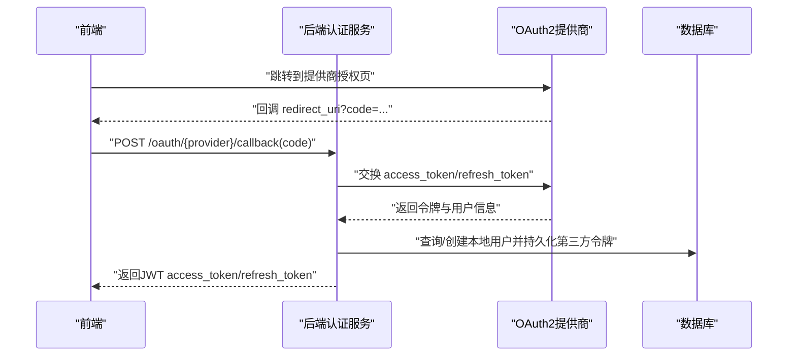

# OAuth2集成

<cite>
**本文引用的文件**
- [apps/api/app/models/auth_provider.py](file://apps/api/app/models/auth_provider.py)
- [apps/api/app/modules/auth/router.py](file://apps/api/app/modules/auth/router.py)
- [apps/api/app/modules/auth/service.py](file://apps/api/app/modules/auth/service.py)
- [apps/api/app/schemas/auth.py](file://apps/api/app/schemas/auth.py)
- [apps/api/app/core/security.py](file://apps/api/app/core/security.py)
- [apps/api/app/core/config.py](file://apps/api/app/core/config.py)
- [apps/api/app/models/user.py](file://apps/api/app/models/user.py)
- [apps/api/app/main.py](file://apps/api/app/main.py)
- [apps/api/app/deps.py](file://apps/api/app/deps.py)
- [apps/web/src/views/LoginView.vue](file://apps/web/src/views/LoginView.vue)
- [apps/web/src/api/auth.ts](file://apps/web/src/api/auth.ts)
- [apps/api/tests/test_auth.py](file://apps/api/tests/test_auth.py)
- [openspec/changes/add-user-auth/specs/user-auth/spec.md](file://openspec/changes/add-user-auth/specs/user-auth/spec.md)
- [openspec/changes/add-user-auth/design.md](file://openspec/changes/add-user-auth/design.md)
</cite>

## 目录
1. [简介](#简介)
2. [项目结构](#项目结构)
3. [核心组件](#核心组件)
4. [架构总览](#架构总览)
5. [详细组件分析](#详细组件分析)
6. [依赖分析](#依赖分析)
7. [性能考虑](#性能考虑)
8. [故障排查指南](#故障排查指南)
9. [结论](#结论)
10. [附录](#附录)

## 简介
本文件面向“AI摄影教练”项目的OAuth2集成开发，系统性梳理当前后端认证体系（基于JWT的密码登录与令牌刷新）、前端登录交互、以及为OAuth2第三方登录预留的扩展点。文档重点覆盖：
- OAuth2集成现状与扩展策略
- 支持的OAuth2提供商类型与配置要点
- OAuth2授权流程的实现思路（授权码获取、令牌交换、用户信息获取）
- 回调处理与错误处理机制
- 令牌存储与刷新策略
- 安全考量与最佳实践
- 扩展接口与自定义实现方法

当前仓库已具备完善的JWT认证基础设施与OAuth2预留能力，可作为OAuth2登录的“基座”，后续只需按规范扩展即可。

## 项目结构
后端采用FastAPI + SQLAlchemy架构，认证相关代码集中在以下模块：
- 认证路由与服务：apps/api/app/modules/auth
- 安全与令牌工具：apps/api/app/core/security.py
- 配置中心：apps/api/app/core/config.py
- 用户与第三方绑定模型：apps/api/app/models/user.py、apps/api/app/models/auth_provider.py
- 依赖注入与受保护路由：apps/api/app/deps.py
- 前端登录与API调用：apps/web/src/views/LoginView.vue、apps/web/src/api/auth.ts
- 规格与设计说明：openspec/changes/add-user-auth/*

图表来源
- [apps/api/app/main.py:1-36](file://apps/api/app/main.py#L1-L36)
- [apps/api/app/modules/auth/router.py:1-93](file://apps/api/app/modules/auth/router.py#L1-L93)
- [apps/api/app/modules/auth/service.py:1-145](file://apps/api/app/modules/auth/service.py#L1-L145)
- [apps/api/app/core/security.py:1-72](file://apps/api/app/core/security.py#L1-L72)
- [apps/api/app/core/config.py:1-47](file://apps/api/app/core/config.py#L1-L47)
- [apps/api/app/models/user.py:1-28](file://apps/api/app/models/user.py#L1-L28)
- [apps/api/app/models/auth_provider.py:1-24](file://apps/api/app/models/auth_provider.py#L1-L24)
- [apps/api/app/deps.py:1-41](file://apps/api/app/deps.py#L1-L41)
- [apps/web/src/views/LoginView.vue:1-127](file://apps/web/src/views/LoginView.vue#L1-L127)
- [apps/web/src/api/auth.ts:1-56](file://apps/web/src/api/auth.ts#L1-L56)

章节来源
- [apps/api/app/main.py:1-36](file://apps/api/app/main.py#L1-L36)
- [apps/api/app/modules/auth/router.py:1-93](file://apps/api/app/modules/auth/router.py#L1-L93)
- [apps/api/app/modules/auth/service.py:1-145](file://apps/api/app/modules/auth/service.py#L1-L145)
- [apps/api/app/core/security.py:1-72](file://apps/api/app/core/security.py#L1-L72)
- [apps/api/app/core/config.py:1-47](file://apps/api/app/core/config.py#L1-L47)
- [apps/api/app/models/user.py:1-28](file://apps/api/app/models/user.py#L1-L28)
- [apps/api/app/models/auth_provider.py:1-24](file://apps/api/app/models/auth_provider.py#L1-L24)
- [apps/api/app/deps.py:1-41](file://apps/api/app/deps.py#L1-L41)
- [apps/web/src/views/LoginView.vue:1-127](file://apps/web/src/views/LoginView.vue#L1-L127)
- [apps/web/src/api/auth.ts:1-56](file://apps/web/src/api/auth.ts#L1-L56)

## 核心组件
- 认证路由与端点：提供注册、登录、刷新、登出、邮箱验证、密码重置等端点，统一前缀与响应模型。
- 认证服务：封装业务逻辑，包括密码注册/登录、令牌刷新、邮箱验证、密码重置；预留OAuth2方法签名。
- 安全工具：JWT令牌创建与校验、密码哈希与校验。
- 配置中心：JWT密钥、算法、过期时间等全局配置。
- 模型层：用户模型与第三方绑定模型，后者为OAuth2预留。
- 依赖注入：HTTP Bearer认证，从Authorization头解析并校验JWT，注入当前用户。
- 前端：登录视图与API封装，调用后端认证端点并管理本地令牌。

章节来源
- [apps/api/app/modules/auth/router.py:1-93](file://apps/api/app/modules/auth/router.py#L1-L93)
- [apps/api/app/modules/auth/service.py:1-145](file://apps/api/app/modules/auth/service.py#L1-L145)
- [apps/api/app/core/security.py:1-72](file://apps/api/app/core/security.py#L1-L72)
- [apps/api/app/core/config.py:1-47](file://apps/api/app/core/config.py#L1-L47)
- [apps/api/app/models/user.py:1-28](file://apps/api/app/models/user.py#L1-L28)
- [apps/api/app/models/auth_provider.py:1-24](file://apps/api/app/models/auth_provider.py#L1-L24)
- [apps/api/app/deps.py:1-41](file://apps/api/app/deps.py#L1-L41)
- [apps/web/src/views/LoginView.vue:1-127](file://apps/web/src/views/LoginView.vue#L1-L127)
- [apps/web/src/api/auth.ts:1-56](file://apps/web/src/api/auth.ts#L1-L56)

## 架构总览
下图展示OAuth2集成的总体架构与关键交互：

图表来源
- [apps/api/app/modules/auth/router.py:1-93](file://apps/api/app/modules/auth/router.py#L1-L93)
- [apps/api/app/modules/auth/service.py:1-145](file://apps/api/app/modules/auth/service.py#L1-L145)
- [apps/api/app/core/security.py:1-72](file://apps/api/app/core/security.py#L1-L72)
- [apps/api/app/core/config.py:1-47](file://apps/api/app/core/config.py#L1-L47)
- [apps/api/app/models/user.py:1-28](file://apps/api/app/models/user.py#L1-L28)
- [apps/api/app/models/auth_provider.py:1-24](file://apps/api/app/models/auth_provider.py#L1-L24)
- [apps/api/app/deps.py:1-41](file://apps/api/app/deps.py#L1-L41)
- [apps/web/src/views/LoginView.vue:1-127](file://apps/web/src/views/LoginView.vue#L1-L127)
- [apps/web/src/api/auth.ts:1-56](file://apps/web/src/api/auth.ts#L1-L56)

## 详细组件分析

### 认证路由与端点
- 路由前缀与标签：统一使用/api/v1/auth，便于扩展OAuth2端点（如/oauth/google/callback）。
- 主要端点：
  - POST /auth/register：邮箱+密码注册，返回access_token与refresh_token。
  - POST /auth/login：邮箱+密码登录，返回token对。
  - POST /auth/refresh：使用refresh_token换取新access_token。
  - POST /auth/logout：登出提示（客户端清理令牌）。
  - POST /auth/verify-email：邮箱验证。
  - POST /auth/forgot-password：发送密码重置token（开发模式记录日志）。
  - POST /auth/reset-password：使用token重置密码。
- 响应模型：TokenResponse包含access_token、refresh_token与token_type。

章节来源
- [apps/api/app/modules/auth/router.py:1-93](file://apps/api/app/modules/auth/router.py#L1-L93)
- [apps/api/app/schemas/auth.py:16-24](file://apps/api/app/schemas/auth.py#L16-L24)

### 认证服务（AuthService）
- 密码注册/登录：检查邮箱唯一性、密码哈希、创建用户并返回JWT token对。
- 令牌刷新：校验refresh_token有效性，返回新access_token。
- 邮箱验证：使用短期JWT生成验证token，校验后更新用户状态。
- 密码重置：生成短期重置token（开发模式记录日志），校验后更新密码。
- OAuth2预留：在类注释中预留login_with_oauth与link_oauth_provider方法签名，auth_providers表与User.password_hash可空字段已就绪。

章节来源
- [apps/api/app/modules/auth/service.py:1-145](file://apps/api/app/modules/auth/service.py#L1-L145)
- [apps/api/app/models/user.py:17](file://apps/api/app/models/user.py#L17)
- [apps/api/app/models/auth_provider.py:18](file://apps/api/app/models/auth_provider.py#L18)

### 安全工具与JWT
- TokenPayload：JWT载荷结构（sub、exp、type）。
- 密码哈希：bcrypt，使用passlib上下文。
- 令牌创建：create_access_token与create_refresh_token，支持自定义过期时间。
- 令牌验证：verify_token，统一处理过期与无效token异常。

章节来源
- [apps/api/app/core/security.py:12-72](file://apps/api/app/core/security.py#L12-L72)

### 配置中心
- JWT密钥、算法、access_token过期分钟数、refresh_token过期天数。
- CORS跨域配置，便于前端SPA访问。

章节来源
- [apps/api/app/core/config.py:30-38](file://apps/api/app/core/config.py#L30-L38)

### 模型层
- User：用户基本信息，password_hash可空，支持OAuth-only用户。
- AuthProvider：第三方绑定记录，provider字段预留"google"、"github"、"wechat"等值。

章节来源
- [apps/api/app/models/user.py:15-27](file://apps/api/app/models/user.py#L15-L27)
- [apps/api/app/models/auth_provider.py:16-23](file://apps/api/app/models/auth_provider.py#L16-L23)

### 依赖注入与受保护路由
- HTTPBearer：从Authorization头提取Bearer token。
- get_current_user：校验token并加载用户，非活跃用户拒绝访问。
- get_current_user_id：兼容旧接口签名，保持路由签名不变。

章节来源
- [apps/api/app/deps.py:15-41](file://apps/api/app/deps.py#L15-L41)

### 前端登录与API调用
- LoginView.vue：收集邮箱/密码，调用login接口，设置access_token与refresh_token，随后拉取用户资料并跳转首页。
- auth.ts：封装注册、登录、刷新、登出、获取/更新用户资料、修改密码等API。

章节来源
- [apps/web/src/views/LoginView.vue:15-46](file://apps/web/src/views/LoginView.vue#L15-L46)
- [apps/web/src/api/auth.ts:29-55](file://apps/web/src/api/auth.ts#L29-L55)

### OAuth2集成现状与扩展策略
- 现状：后端已具备JWT认证、OAuth2预留表与模型、OAuth方法签名注释，前端登录流程已对接后端认证端点。
- 扩展策略：
  - 在AuthService中实现login_with_oauth与link_oauth_provider。
  - 在auth/router.py中新增/oauth/{provider}/authorize与/oauth/{provider}/callback端点。
  - 在AuthProvider表中持久化第三方用户标识与access_token。
  - 在deps.py中支持OAuth2用户上下文（若需要）。

章节来源
- [apps/api/app/modules/auth/service.py:142-145](file://apps/api/app/modules/auth/service.py#L142-L145)
- [apps/api/app/models/auth_provider.py:12-23](file://apps/api/app/models/auth_provider.py#L12-L23)
- [openspec/changes/add-user-auth/specs/user-auth/spec.md:121-133](file://openspec/changes/add-user-auth/specs/user-auth/spec.md#L121-L133)

## 依赖分析
后端认证模块的依赖关系如下：

图表来源
- [apps/api/app/modules/auth/router.py:1-93](file://apps/api/app/modules/auth/router.py#L1-L93)
- [apps/api/app/modules/auth/service.py:1-145](file://apps/api/app/modules/auth/service.py#L1-L145)
- [apps/api/app/core/security.py:1-72](file://apps/api/app/core/security.py#L1-L72)
- [apps/api/app/models/user.py:1-28](file://apps/api/app/models/user.py#L1-L28)
- [apps/api/app/models/auth_provider.py:1-24](file://apps/api/app/models/auth_provider.py#L1-L24)
- [apps/api/app/deps.py:1-41](file://apps/api/app/deps.py#L1-L41)
- [apps/api/app/main.py:1-36](file://apps/api/app/main.py#L1-L36)

章节来源
- [apps/api/app/main.py:1-36](file://apps/api/app/main.py#L1-L36)
- [apps/api/app/modules/auth/router.py:1-93](file://apps/api/app/modules/auth/router.py#L1-L93)
- [apps/api/app/modules/auth/service.py:1-145](file://apps/api/app/modules/auth/service.py#L1-L145)
- [apps/api/app/core/security.py:1-72](file://apps/api/app/core/security.py#L1-L72)
- [apps/api/app/models/user.py:1-28](file://apps/api/app/models/user.py#L1-L28)
- [apps/api/app/models/auth_provider.py:1-24](file://apps/api/app/models/auth_provider.py#L1-L24)
- [apps/api/app/deps.py:1-41](file://apps/api/app/deps.py#L1-L41)

## 性能考虑
- JWT令牌体积小、验证快速，适合高并发场景。
- Access Token短寿命（默认30分钟）降低泄露风险；Refresh Token（默认7天）用于安全刷新。
- 建议在生产环境启用HTTPS、CORS白名单与安全响应头，减少中间人攻击与跨站请求风险。
- 若引入第三方OAuth2，建议缓存用户信息与令牌，避免频繁调用外部API。

## 故障排查指南
- 常见错误与处理：
  - 401未认证/令牌无效：检查Authorization头格式与令牌有效期；确认verify_token异常分支。
  - 409邮箱已注册：注册时检查用户唯一性。
  - 400邮箱验证/重置token无效：确认token未过期且对应用户存在。
  - 401账户停用：登录时检查用户is_active状态。
- 单元测试参考：
  - 注册/登录/刷新/登出/密码重置等场景均有测试覆盖，可对照定位问题。

章节来源
- [apps/api/tests/test_auth.py:48-191](file://apps/api/tests/test_auth.py#L48-L191)
- [apps/api/app/core/security.py:49-72](file://apps/api/app/core/security.py#L49-L72)
- [apps/api/app/modules/auth/service.py:30-48](file://apps/api/app/modules/auth/service.py#L30-L48)
- [apps/api/app/modules/auth/service.py:52-67](file://apps/api/app/modules/auth/service.py#L52-L67)
- [apps/api/app/modules/auth/service.py:98-114](file://apps/api/app/modules/auth/service.py#L98-L114)
- [apps/api/app/modules/auth/service.py:124-140](file://apps/api/app/modules/auth/service.py#L124-L140)

## 结论
当前项目已具备完善的JWT认证基础与OAuth2扩展预留，可直接在此基础上实现第三方OAuth2登录。建议优先完成：
- 在AuthService中实现OAuth2登录与绑定方法
- 新增/oauth/{provider}授权与回调端点
- 在AuthProvider表中持久化第三方令牌
- 前端增加社交登录入口与回调处理

## 附录

### OAuth2提供商支持与配置参数
- 支持的提供商类型（预留）：google、github、wechat
- 配置参数（示例）：
  - 客户端ID与密钥（需在后端配置中心或环境变量中管理）
  - 重定向URI（需与前端/后端一致）
  - 作用域（scope）：如email、profile等
- 建议：
  - 将敏感配置集中管理，避免硬编码
  - 为不同环境（dev/staging/prod）分别配置

章节来源
- [apps/api/app/models/auth_provider.py:18](file://apps/api/app/models/auth_provider.py#L18)
- [apps/api/app/core/config.py:30-38](file://apps/api/app/core/config.py#L30-L38)

### OAuth2授权流程实现思路
- 授权码流程（Authorization Code Flow）：
  1) 前端引导用户至提供商授权页面（携带client_id、redirect_uri、scope、state等）
  2) 用户同意后，提供商回调redirect_uri并附带授权码（code）
  3) 后端使用授权码与client_secret交换access_token与可选refresh_token
  4) 后端调用提供商用户信息接口获取用户资料
  5) 关联本地用户或创建新用户，发放JWT access_token与refresh_token
- 回调处理与错误处理：
  - 校验state一致性，防止CSRF
  - 捕获并处理授权码无效、令牌交换失败、用户信息获取失败等异常
  - 统一返回友好错误信息并记录日志
- 令牌存储与刷新：
  - 将第三方access_token保存至AuthProvider表
  - 使用后端refresh_token机制进行刷新，必要时再刷新第三方令牌

图表来源
- [apps/api/app/modules/auth/service.py:142-145](file://apps/api/app/modules/auth/service.py#L142-L145)
- [apps/api/app/models/auth_provider.py:16-23](file://apps/api/app/models/auth_provider.py#L16-L23)

### OAuth2回调处理与错误处理机制
- 回调端点：/oauth/{provider}/callback
- 错误处理：
  - 授权码缺失或无效
  - 令牌交换失败
  - 用户信息获取失败
  - 用户被停用或不存在
- 建议：
  - 统一异常映射为HTTP 400/401/500
  - 记录详细日志，便于排障

章节来源
- [apps/api/app/modules/auth/service.py:142-145](file://apps/api/app/modules/auth/service.py#L142-L145)

### OAuth2令牌的存储与刷新策略
- 存储：
  - 在AuthProvider表中保存第三方access_token与provider_user_id
  - 本地JWT access_token与refresh_token用于应用内鉴权
- 刷新：
  - 本地refresh_token到期后，使用后端refresh端点换取新access_token
  - 如需刷新第三方令牌，可在调用第三方API前检查有效期并刷新

章节来源
- [apps/api/app/models/auth_provider.py:16-23](file://apps/api/app/models/auth_provider.py#L16-L23)
- [apps/api/app/modules/auth/service.py:77-92](file://apps/api/app/modules/auth/service.py#L77-L92)

### OAuth2集成的安全考虑与最佳实践
- 安全要点：
  - 使用HTTPS传输
  - Access Token短寿命，Refresh Token安全存储
  - 校验state参数，防止CSRF
  - 严格校验回调URI
  - 限制scope最小化
- 最佳实践：
  - 将第三方客户端凭据集中管理
  - 引入令牌黑名单（Redis）以支持主动撤销
  - 对第三方API调用增加超时与重试策略
  - 前端仅存储短期令牌，避免长期驻留

章节来源
- [openspec/changes/add-user-auth/design.md:81-96](file://openspec/changes/add-user-auth/design.md#L81-L96)

### OAuth2提供商的扩展接口与自定义实现方法
- 扩展接口：
  - AuthService.login_with_oauth(provider, code)
  - AuthService.link_oauth_provider(user_id, provider, code)
- 自定义实现步骤：
  1) 在配置中心新增提供商配置项
  2) 在auth/router.py中新增/provider/authorize与/provider/callback端点
  3) 在AuthService中实现令牌交换与用户信息获取
  4) 在AuthProvider表中持久化第三方令牌
  5) 前端增加对应按钮与回调处理

章节来源
- [apps/api/app/modules/auth/service.py:142-145](file://apps/api/app/modules/auth/service.py#L142-L145)
- [openspec/changes/add-user-auth/specs/user-auth/spec.md:121-133](file://openspec/changes/add-user-auth/specs/user-auth/spec.md#L121-L133)