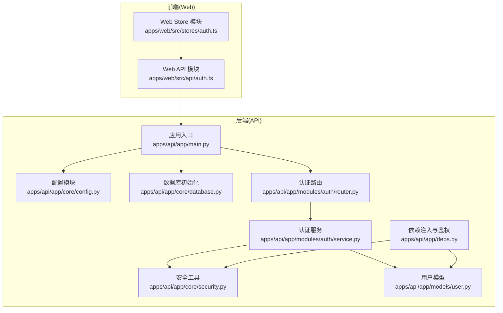
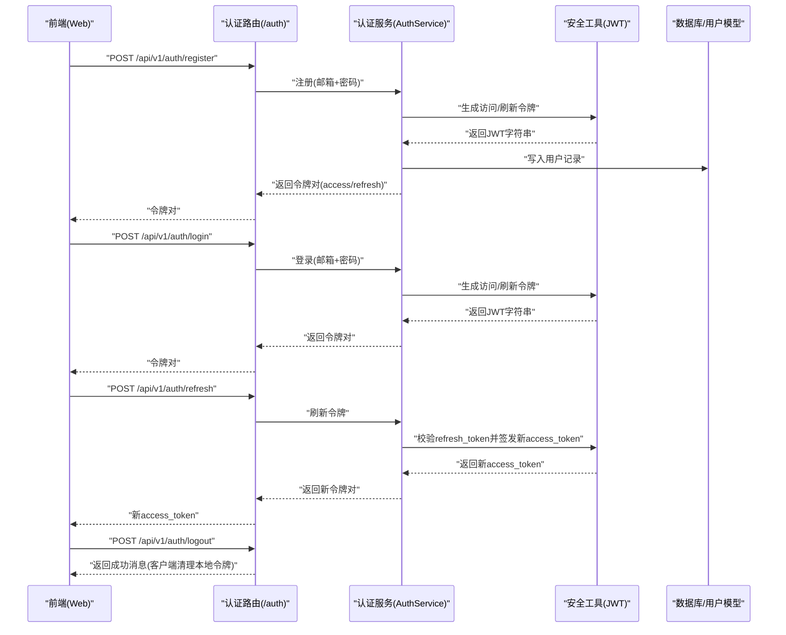
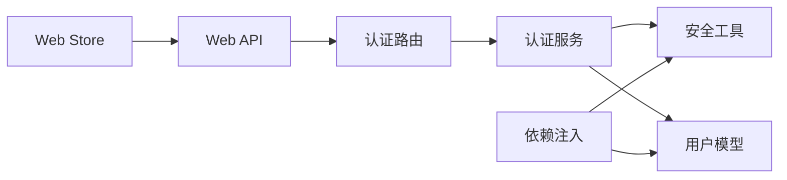
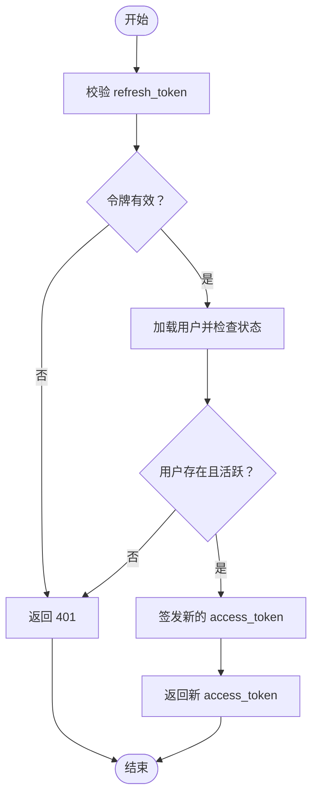
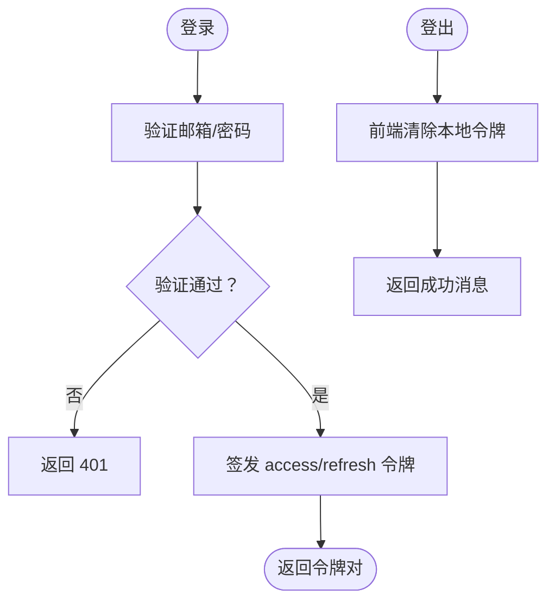

# 会话管理

<cite>
**本文引用的文件**
- [apps/api/app/core/security.py](file://apps/api/app/core/security.py)
- [apps/api/app/modules/auth/service.py](file://apps/api/app/modules/auth/service.py)
- [apps/api/app/modules/auth/router.py](file://apps/api/app/modules/auth/router.py)
- [apps/api/app/schemas/auth.py](file://apps/api/app/schemas/auth.py)
- [apps/api/app/deps.py](file://apps/api/app/deps.py)
- [apps/api/app/core/config.py](file://apps/api/app/core/config.py)
- [apps/api/app/models/user.py](file://apps/api/app/models/user.py)
- [apps/api/app/core/database.py](file://apps/api/app/core/database.py)
- [apps/api/app/main.py](file://apps/api/app/main.py)
- [apps/web/src/stores/auth.ts](file://apps/web/src/stores/auth.ts)
- [apps/web/src/api/auth.ts](file://apps/web/src/api/auth.ts)
- [apps/api/tests/test_auth.py](file://apps/api/tests/test_auth.py)
</cite>

## 目录
1. [简介](#简介)
2. [项目结构](#项目结构)
3. [核心组件](#核心组件)
4. [架构总览](#架构总览)
5. [详细组件分析](#详细组件分析)
6. [依赖分析](#依赖分析)
7. [性能考虑](#性能考虑)
8. [故障排查指南](#故障排查指南)
9. [结论](#结论)
10. [附录](#附录)

## 简介
本文件面向“AI摄影教练会话管理系统”，聚焦用户会话的创建、维护与销毁流程，系统性梳理会话状态持久化策略与内存管理方式，给出会话超时与自动登出的实现要点，并覆盖会话安全策略（如会话固定攻击防护与并发会话控制）、会话数据存储格式与访问权限控制、会话监控与审计建议，以及会话恢复与状态同步的技术方案。

## 项目结构
后端采用 FastAPI 架构，认证与会话围绕 JWT 实现；前端使用 Pinia 管理本地令牌与用户状态；数据库通过 SQLAlchemy ORM 管理用户实体；配置集中于 Settings 类，统一管理密钥、算法与过期时间等参数。

图表来源
- [apps/api/app/main.py:1-36](file://apps/api/app/main.py#L1-L36)
- [apps/api/app/core/config.py:1-47](file://apps/api/app/core/config.py#L1-L47)
- [apps/api/app/core/security.py:1-72](file://apps/api/app/core/security.py#L1-L72)
- [apps/api/app/deps.py:1-41](file://apps/api/app/deps.py#L1-L41)
- [apps/api/app/core/database.py:1-51](file://apps/api/app/core/database.py#L1-L51)
- [apps/api/app/models/user.py:1-28](file://apps/api/app/models/user.py#L1-L28)
- [apps/api/app/modules/auth/router.py:1-93](file://apps/api/app/modules/auth/router.py#L1-L93)
- [apps/api/app/modules/auth/service.py:1-145](file://apps/api/app/modules/auth/service.py#L1-L145)
- [apps/web/src/api/auth.ts:1-56](file://apps/web/src/api/auth.ts#L1-L56)
- [apps/web/src/stores/auth.ts:1-41](file://apps/web/src/stores/auth.ts#L1-L41)

章节来源
- [apps/api/app/main.py:1-36](file://apps/api/app/main.py#L1-L36)
- [apps/api/app/core/config.py:1-47](file://apps/api/app/core/config.py#L1-L47)
- [apps/api/app/core/database.py:1-51](file://apps/api/app/core/database.py#L1-L51)

## 核心组件
- JWT 工具与载荷定义：提供密码哈希、JWT 编解码、访问/刷新令牌生成与校验。
- 认证服务：封装注册、登录、刷新、邮箱验证、忘记/重置密码等业务逻辑。
- 认证路由：暴露 /auth/* 接口，返回令牌对或执行相关操作。
- 依赖注入与当前用户解析：从 Authorization 头中提取 Bearer 令牌，解析并加载用户对象。
- 前端会话存储：使用 Pinia Store 与 localStorage 存储 access_token/refresh_token，提供认证状态计算属性与清理方法。
- 数据库与用户模型：定义用户字段与激活/验证状态，支撑会话有效性判断。

章节来源
- [apps/api/app/core/security.py:1-72](file://apps/api/app/core/security.py#L1-L72)
- [apps/api/app/modules/auth/service.py:1-145](file://apps/api/app/modules/auth/service.py#L1-L145)
- [apps/api/app/modules/auth/router.py:1-93](file://apps/api/app/modules/auth/router.py#L1-L93)
- [apps/api/app/deps.py:1-41](file://apps/api/app/deps.py#L1-L41)
- [apps/web/src/stores/auth.ts:1-41](file://apps/web/src/stores/auth.ts#L1-L41)
- [apps/api/app/models/user.py:1-28](file://apps/api/app/models/user.py#L1-L28)

## 架构总览
下图展示从 Web 前端到后端 API 的会话交互路径，包括令牌创建、携带与验证、刷新与登出流程。

图表来源
- [apps/api/app/modules/auth/router.py:24-59](file://apps/api/app/modules/auth/router.py#L24-L59)
- [apps/api/app/modules/auth/service.py:27-92](file://apps/api/app/modules/auth/service.py#L27-L92)
- [apps/api/app/core/security.py:32-46](file://apps/api/app/core/security.py#L32-L46)
- [apps/web/src/api/auth.ts:29-43](file://apps/web/src/api/auth.ts#L29-L43)

## 详细组件分析

### 1) 会话创建与令牌发放
- 注册流程：注册成功后，系统生成邮箱验证短效 JWT，并立即返回 access_token 与 refresh_token 给前端。
- 登录流程：验证凭据后，签发 access_token 与 refresh_token 返回给前端。
- 令牌类型：
  - access_token：短期有效，用于受保护资源访问。
  - refresh_token：长期有效，用于换取新的 access_token。
- 令牌内容：包含 sub（用户标识）、exp（过期时间）、type（令牌类型）等字段。

章节来源
- [apps/api/app/modules/auth/router.py:24-39](file://apps/api/app/modules/auth/router.py#L24-L39)
- [apps/api/app/modules/auth/service.py:27-75](file://apps/api/app/modules/auth/service.py#L27-L75)
- [apps/api/app/core/security.py:12-16](file://apps/api/app/core/security.py#L12-L16)
- [apps/api/app/core/security.py:32-46](file://apps/api/app/core/security.py#L32-L46)

### 2) 会话维护与当前用户解析
- 依赖注入：HTTP Bearer 令牌由 HTTPBearer 提供，get_current_user 解析令牌并加载用户对象。
- 用户状态检查：若用户不存在或非活跃，直接拒绝请求。
- 令牌校验：verify_token 负责解码与过期校验，异常时返回 401。

章节来源
- [apps/api/app/deps.py:15-33](file://apps/api/app/deps.py#L15-L33)
- [apps/api/app/core/security.py:49-72](file://apps/api/app/core/security.py#L49-L72)
- [apps/api/app/models/user.py:20-21](file://apps/api/app/models/user.py#L20-L21)

### 3) 会话销毁与自动登出
- 后端 logout 接口：返回成功消息，实际登出由前端负责清除本地存储的 access_token/refresh_token。
- 前端实现：Pinia Store 提供 clearAuth 方法，移除 localStorage 中的令牌键值。

章节来源
- [apps/api/app/modules/auth/router.py:56-59](file://apps/api/app/modules/auth/router.py#L56-L59)
- [apps/web/src/stores/auth.ts:19-25](file://apps/web/src/stores/auth.ts#L19-L25)
- [apps/web/src/api/auth.ts:41-43](file://apps/web/src/api/auth.ts#L41-L43)

### 4) 会话超时与自动登出实现细节
- access_token 过期：verify_token 在解码时捕获过期异常并返回 401，前端应据此触发自动登出与跳转。
- refresh_token 过期：refresh_tokens 接口在 verify_token 后仍需检查用户是否仍然存在且活跃，避免过期令牌被滥用。
- 前端策略建议：在每次请求前检查 access_token 是否即将过期，若过期则调用刷新接口；若 refresh_token 也过期，则引导用户重新登录。

章节来源
- [apps/api/app/core/security.py:62-66](file://apps/api/app/core/security.py#L62-L66)
- [apps/api/app/modules/auth/service.py:77-92](file://apps/api/app/modules/auth/service.py#L77-L92)

### 5) 会话安全策略
- 会话固定攻击防护：
  - 登录成功后签发全新的 access_token/refresh_token，避免复用旧令牌。
  - 建议：在用户修改密码或安全事件发生时，主动吊销相关令牌（当前实现未内置撤销列表，可结合后端黑名单或缩短过期时间缓解风险）。
- 并发会话控制：
  - 当前实现未限制同一账户的并发会话数量。建议引入“会话会话ID”与“会话列表”机制，支持踢出指定会话或仅允许单点登录。
- 令牌传输与存储：
  - 前端使用 localStorage 存储令牌，注意 XSS 防护与 HttpOnly/Secure 属性建议（当前为前端本地存储，建议在生产环境配合安全头与 CSP）。
- 密码与敏感信息：
  - 密码采用 bcrypt 哈希存储，verify_password 用于校验。

章节来源
- [apps/api/app/modules/auth/service.py:69-75](file://apps/api/app/modules/auth/service.py#L69-L75)
- [apps/api/app/core/security.py:22-29](file://apps/api/app/core/security.py#L22-L29)

### 6) 会话状态持久化与内存管理
- 后端内存管理：FastAPI 请求生命周期内通过依赖注入获取数据库会话，请求结束自动关闭，避免连接泄漏。
- 令牌持久化：access_token/refresh_token 由前端本地存储，后端不保存会话状态，降低服务器内存占用。
- 用户状态：get_current_user 将用户对象注入到请求上下文中，按需读取，避免跨请求共享状态。

章节来源
- [apps/api/app/core/database.py:13-18](file://apps/api/app/core/database.py#L13-L18)
- [apps/api/app/deps.py:26-33](file://apps/api/app/deps.py#L26-L33)
- [apps/web/src/stores/auth.ts:6-8](file://apps/web/src/stores/auth.ts#L6-L8)

### 7) 会话数据存储格式与访问权限控制
- 令牌格式：JWT（HS256），包含 sub、exp、type 等声明。
- 用户数据：用户模型包含激活/验证状态，鉴权中间件基于该状态拒绝非活跃用户。
- 权限控制：受保护路由通过 get_current_user 依赖注入强制校验令牌与用户状态。

章节来源
- [apps/api/app/core/security.py:12-16](file://apps/api/app/core/security.py#L12-L16)
- [apps/api/app/models/user.py:20-21](file://apps/api/app/models/user.py#L20-L21)
- [apps/api/app/deps.py:26-33](file://apps/api/app/deps.py#L26-L33)

### 8) 会话监控与审计
- 建议方案：
  - 记录登录/登出事件（时间、IP、UA、用户ID）。
  - 记录令牌刷新与失效事件。
  - 对异常行为（频繁刷新、无效令牌）进行告警。
- 当前实现：忘记密码在开发模式下将重置令牌记录到日志，便于调试但不满足生产级审计要求。

章节来源
- [apps/api/app/modules/auth/service.py:116-122](file://apps/api/app/modules/auth/service.py#L116-L122)

### 9) 会话恢复与状态同步
- 会话恢复：前端在启动时读取 localStorage 中的 access_token/refresh_token，尝试刷新 access_token；若 refresh_token 也失效，则回退到登录页。
- 状态同步：Pinia Store 维护 currentUser，前端在获取用户资料后更新该状态，确保 UI 与后端一致。

章节来源
- [apps/web/src/stores/auth.ts:27-29](file://apps/web/src/stores/auth.ts#L27-L29)
- [apps/web/src/api/auth.ts:45-51](file://apps/web/src/api/auth.ts#L45-L51)

## 依赖分析
- 组件耦合：
  - 认证路由依赖认证服务；认证服务依赖安全工具与用户模型；依赖注入模块依赖安全工具与用户模型。
  - 前端 API 与 Store 与后端路由形成清晰边界，通过 HTTP 接口交互。
- 外部依赖：
  - JWT 编解码、密码哈希、数据库 ORM、CORS 中间件等。

图表来源
- [apps/api/app/modules/auth/router.py:1-93](file://apps/api/app/modules/auth/router.py#L1-L93)
- [apps/api/app/modules/auth/service.py:1-145](file://apps/api/app/modules/auth/service.py#L1-L145)
- [apps/api/app/core/security.py:1-72](file://apps/api/app/core/security.py#L1-L72)
- [apps/api/app/models/user.py:1-28](file://apps/api/app/models/user.py#L1-L28)
- [apps/api/app/deps.py:1-41](file://apps/api/app/deps.py#L1-L41)
- [apps/web/src/api/auth.ts:1-56](file://apps/web/src/api/auth.ts#L1-L56)
- [apps/web/src/stores/auth.ts:1-41](file://apps/web/src/stores/auth.ts#L1-L41)

## 性能考虑
- 令牌体积：JWT 作为无状态载体，减少服务器内存占用，适合水平扩展。
- 数据库访问：每次鉴权均需查询用户状态，建议在用户表上建立索引以优化查询。
- CORS 与中间件：生产环境应严格限制允许源与方法，减少不必要的预检请求。
- 刷新频率：合理设置 access_token 过期时间，避免频繁刷新导致的数据库压力。

## 故障排查指南
- 401 未认证/令牌无效：
  - 检查 Authorization 头是否正确携带 Bearer 令牌。
  - 确认令牌未过期，必要时使用 refresh_token 获取新令牌。
- 401 账户非活跃：
  - 用户被禁用或未验证，需联系管理员或引导用户完成邮箱验证。
- 409 邮箱已注册：
  - 注册阶段重复邮箱冲突，提示用户更换邮箱或直接登录。
- 400 令牌过期或无效：
  - refresh_token 也过期，需重新登录；检查服务器时间与密钥配置。

章节来源
- [apps/api/app/deps.py:20-32](file://apps/api/app/deps.py#L20-L32)
- [apps/api/app/modules/auth/service.py:52-67](file://apps/api/app/modules/auth/service.py#L52-L67)
- [apps/api/tests/test_auth.py:51-90](file://apps/api/tests/test_auth.py#L51-L90)
- [apps/api/tests/test_auth.py:146-151](file://apps/api/tests/test_auth.py#L146-L151)

## 结论
本系统采用 JWT 无状态会话模型，通过 access_token/refresh_token 实现会话的创建、维护与销毁。当前实现具备基础的安全能力（密码哈希、令牌校验、用户状态检查），但在并发会话控制、令牌撤销与生产级审计方面尚有改进空间。建议在生产环境中补充会话黑名单、单点登录策略与完善的监控审计体系，并强化前端安全措施（如 HttpOnly/Secure 令牌存储与 CSP）。

## 附录

### A. 关键流程图：令牌刷新

图表来源
- [apps/api/app/modules/auth/service.py:77-92](file://apps/api/app/modules/auth/service.py#L77-L92)
- [apps/api/app/core/security.py:49-72](file://apps/api/app/core/security.py#L49-L72)

### B. 关键流程图：登录与登出

图表来源
- [apps/api/app/modules/auth/service.py:50-75](file://apps/api/app/modules/auth/service.py#L50-L75)
- [apps/api/app/modules/auth/router.py:56-59](file://apps/api/app/modules/auth/router.py#L56-L59)
- [apps/web/src/stores/auth.ts:19-25](file://apps/web/src/stores/auth.ts#L19-L25)