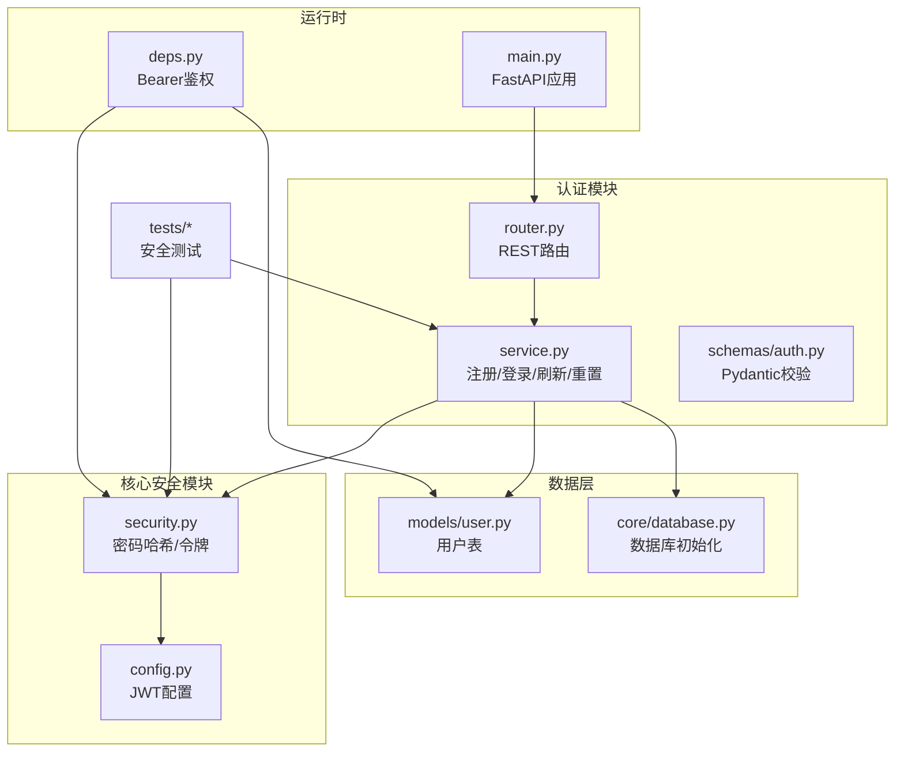
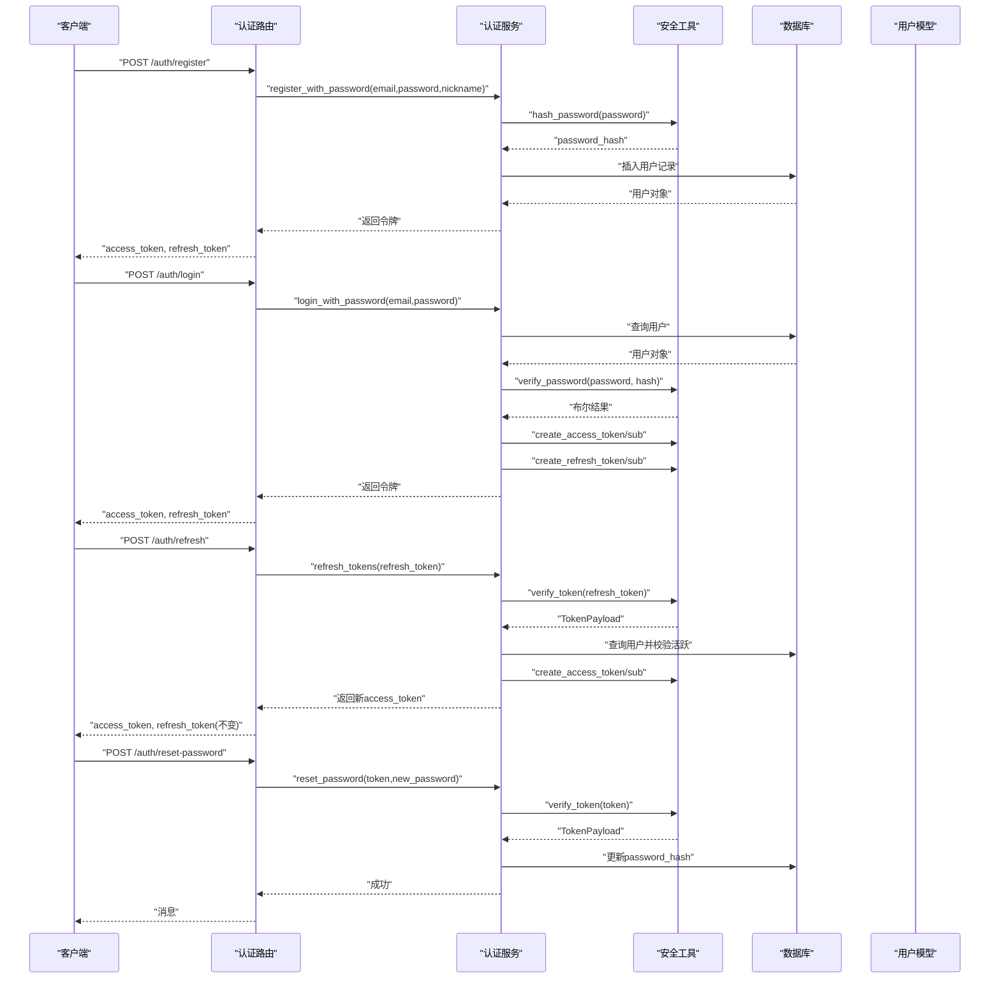
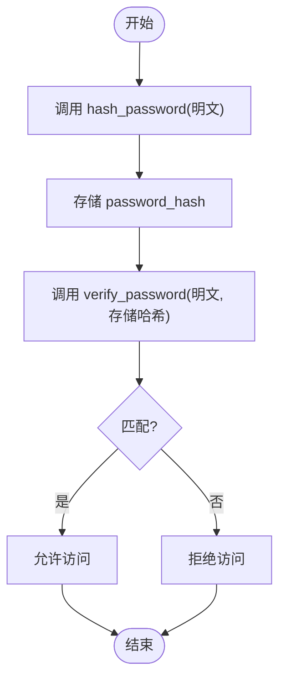
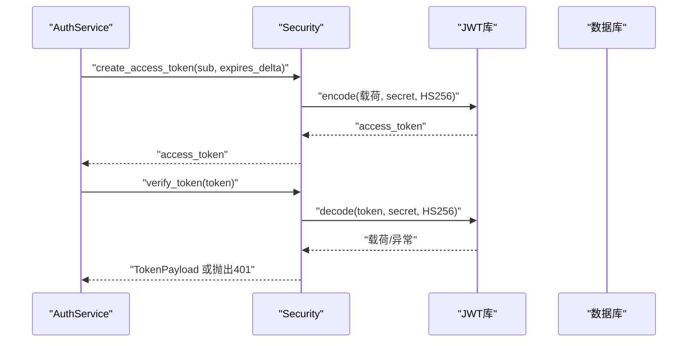
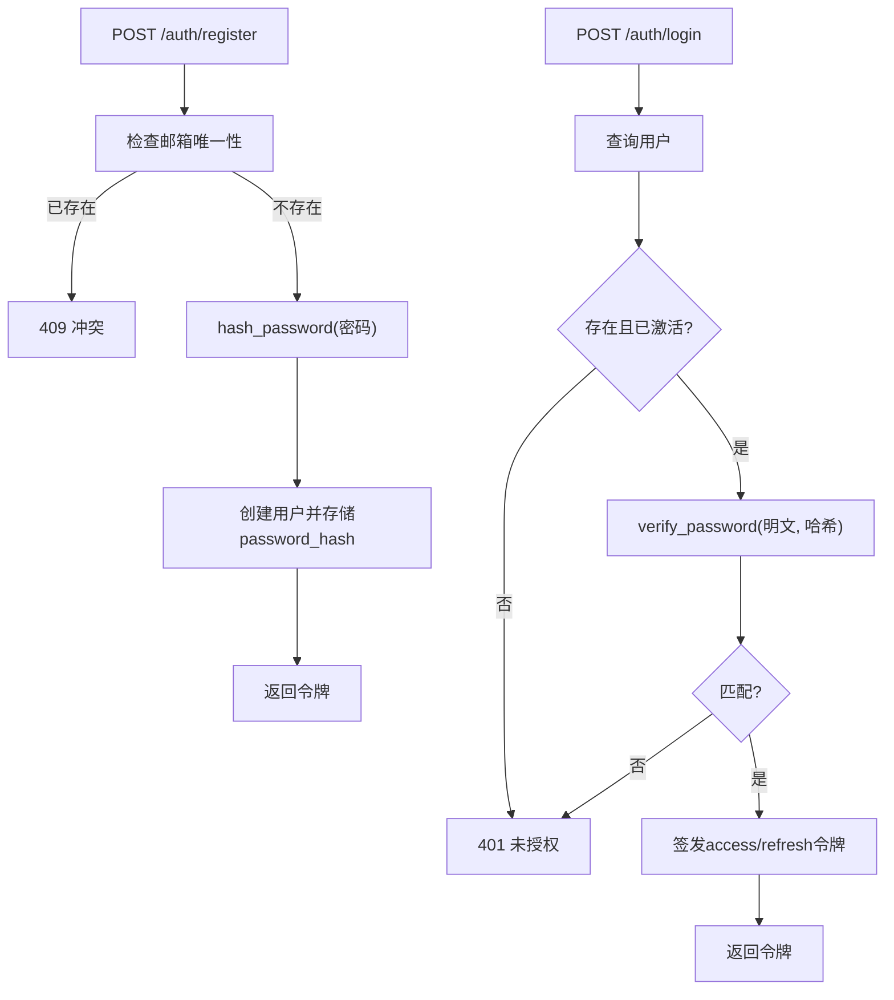
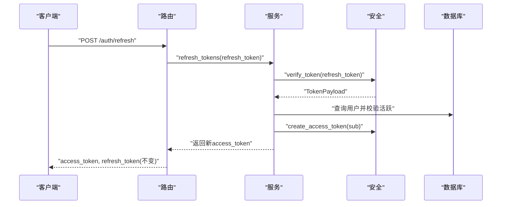
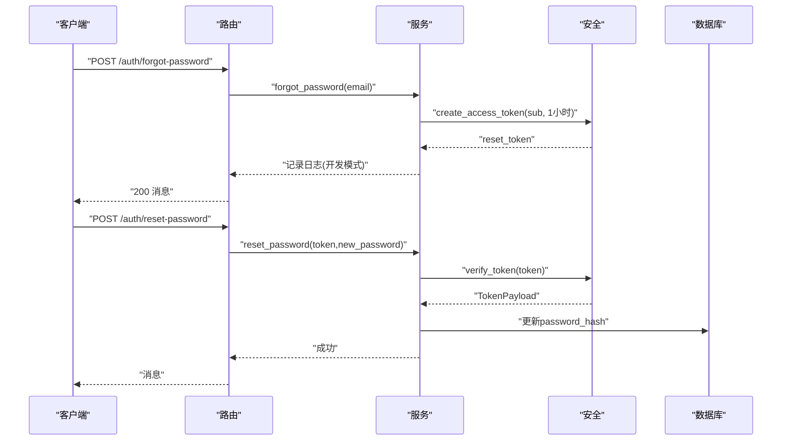
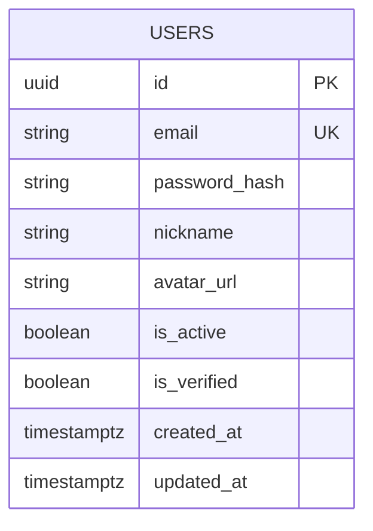
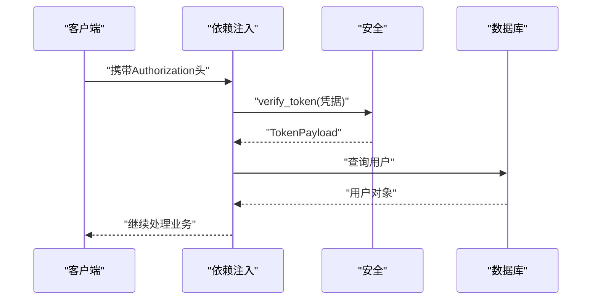
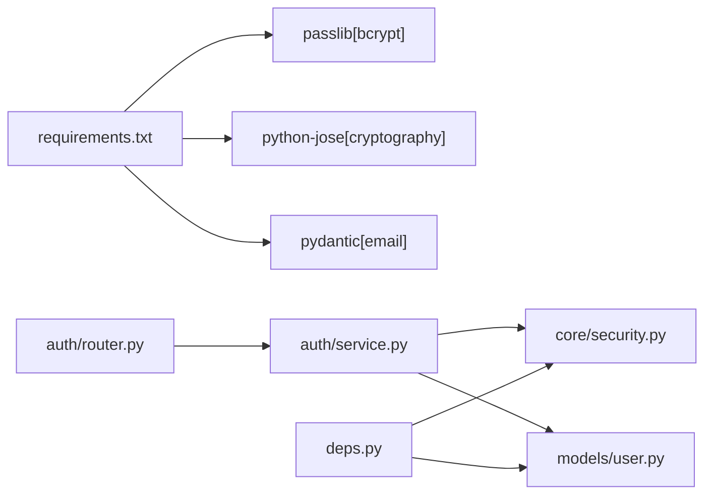

# 密码安全

<cite>
**本文引用的文件**
- [apps/api/app/core/security.py](file://apps/api/app/core/security.py)
- [apps/api/app/core/config.py](file://apps/api/app/core/config.py)
- [apps/api/app/modules/auth/service.py](file://apps/api/app/modules/auth/service.py)
- [apps/api/app/modules/auth/router.py](file://apps/api/app/modules/auth/router.py)
- [apps/api/app/schemas/auth.py](file://apps/api/app/schemas/auth.py)
- [apps/api/app/models/user.py](file://apps/api/app/models/user.py)
- [apps/api/app/deps.py](file://apps/api/app/deps.py)
- [apps/api/app/core/database.py](file://apps/api/app/core/database.py)
- [apps/api/tests/test_security.py](file://apps/api/tests/test_security.py)
- [apps/api/tests/test_auth.py](file://apps/api/tests/test_auth.py)
- [apps/api/requirements.txt](file://apps/api/requirements.txt)
</cite>

## 目录
1. [引言](#引言)
2. [项目结构](#项目结构)
3. [核心组件](#核心组件)
4. [架构总览](#架构总览)
5. [详细组件分析](#详细组件分析)
6. [依赖分析](#依赖分析)
7. [性能考虑](#性能考虑)
8. [故障排查指南](#故障排查指南)
9. [结论](#结论)
10. [附录](#附录)

## 引言
本文件面向“AI摄影教练”密码安全系统，围绕密码哈希、强度校验、加密/解密与验证、密码重置流程、存储与数据保护、安全审计与监控以及常见攻击防护等维度，提供可操作的技术文档。系统采用基于 bcrypt 的密码哈希、JWT 令牌体系与 Pydantic 数据校验，确保在开发与生产环境中的安全性与可维护性。

## 项目结构
本项目密码安全相关的核心代码集中在后端 API 子项目中，主要涉及：
- 安全工具与配置：core/security.py、core/config.py
- 认证模块：modules/auth/router.py、modules/auth/service.py
- 数据模型：models/user.py
- 依赖注入与鉴权：deps.py
- 数据库初始化与迁移：core/database.py
- 单元与集成测试：tests/test_security.py、tests/test_auth.py
- 依赖声明：requirements.txt

图表来源
- [apps/api/app/core/security.py:1-72](file://apps/api/app/core/security.py#L1-L72)
- [apps/api/app/core/config.py:30-34](file://apps/api/app/core/config.py#L30-L34)
- [apps/api/app/modules/auth/service.py:1-145](file://apps/api/app/modules/auth/service.py#L1-L145)
- [apps/api/app/modules/auth/router.py:1-93](file://apps/api/app/modules/auth/router.py#L1-L93)
- [apps/api/app/schemas/auth.py:1-37](file://apps/api/app/schemas/auth.py#L1-L37)
- [apps/api/app/models/user.py:1-28](file://apps/api/app/models/user.py#L1-L28)
- [apps/api/app/core/database.py:1-51](file://apps/api/app/core/database.py#L1-L51)
- [apps/api/app/deps.py:1-41](file://apps/api/app/deps.py#L1-L41)
- [apps/api/app/main.py:1-36](file://apps/api/app/main.py#L1-L36)

章节来源
- [apps/api/app/main.py:11-24](file://apps/api/app/main.py#L11-L24)
- [apps/api/app/core/config.py:30-34](file://apps/api/app/core/config.py#L30-L34)

## 核心组件
- 密码哈希与验证
  - 使用 bcrypt 进行密码哈希与校验，避免明文存储与彩虹表风险。
  - 提供 hash_password 与 verify_password 方法，分别用于存储与校验。
- JWT 令牌体系
  - 支持 access_token 与 refresh_token，分别用于短期访问与长期刷新。
  - 令牌载荷包含 sub（用户标识）、exp（过期时间）、type（令牌类型），并使用 HS256 算法签名。
- 认证服务
  - 注册：检查邮箱唯一性，生成用户并存储 password_hash。
  - 登录：校验用户存在性、激活状态与密码哈希，签发双令牌。
  - 刷新：使用 refresh_token 验证后签发新的 access_token。
  - 邮箱验证：短期 JWT 验证用户邮箱。
  - 密码重置：短期 JWT 发送与验证，成功后更新 password_hash。
- 数据模型与校验
  - 用户模型包含 email、password_hash、is_active、is_verified 等字段。
  - Pydantic Schema 对注册/重置等输入进行最小长度等约束。
- 依赖注入与鉴权
  - 通过 HTTP Bearer 方式解析 Authorization 头，调用 verify_token 校验并加载用户。

章节来源
- [apps/api/app/core/security.py:19-72](file://apps/api/app/core/security.py#L19-L72)
- [apps/api/app/modules/auth/service.py:27-145](file://apps/api/app/modules/auth/service.py#L27-L145)
- [apps/api/app/schemas/auth.py:5-37](file://apps/api/app/schemas/auth.py#L5-L37)
- [apps/api/app/models/user.py:12-28](file://apps/api/app/models/user.py#L12-L28)
- [apps/api/app/deps.py:15-33](file://apps/api/app/deps.py#L15-L33)

## 架构总览
下图展示从客户端到数据库的密码安全关键路径：注册/登录/刷新/重置均通过认证服务与安全工具完成，依赖配置管理 JWT 参数，最终持久化到用户表。

图表来源
- [apps/api/app/modules/auth/router.py:24-93](file://apps/api/app/modules/auth/router.py#L24-L93)
- [apps/api/app/modules/auth/service.py:27-145](file://apps/api/app/modules/auth/service.py#L27-L145)
- [apps/api/app/core/security.py:22-72](file://apps/api/app/core/security.py#L22-L72)
- [apps/api/app/models/user.py:12-28](file://apps/api/app/models/user.py#L12-L28)

## 详细组件分析

### 组件A：密码哈希与验证（bcrypt）
- 设计要点
  - 使用 passlib 的 CryptContext 包裹 bcrypt，自动处理盐值生成与迭代成本。
  - hash_password 输出不可逆哈希；verify_password 仅比较明文与存储哈希。
- 复杂度与性能
  - bcrypt 的计算成本可配置，建议在生产环境适当提高成本以对抗暴力破解。
- 错误处理
  - 未显式抛错，但 verify_password 返回布尔值，上层需根据结果决定响应。
- 安全最佳实践
  - 永远不存储明文密码；使用强随机盐值（由 bcrypt 自动提供）。
  - 定期评估硬件性能变化，调整成本参数。

图表来源
- [apps/api/app/core/security.py:22-29](file://apps/api/app/core/security.py#L22-L29)

章节来源
- [apps/api/app/core/security.py:19-29](file://apps/api/app/core/security.py#L19-L29)
- [apps/api/tests/test_security.py:15-40](file://apps/api/tests/test_security.py#L15-L40)

### 组件B：JWT 令牌创建与验证
- 设计要点
  - access_token 默认有效期较短；refresh_token 较长，用于换取新 access_token。
  - 令牌载荷包含 sub、exp、type；verify_token 解析并校验签名与过期。
- 复杂度与性能
  - 编解码与签名验证开销极低，主要成本在数据库查询与 bcrypt 校验。
- 错误处理
  - 过期或无效令牌统一抛出 401，并携带明确错误信息。
- 安全最佳实践
  - 使用强随机密钥（jwt_secret_key）；生产环境务必设置环境变量。
  - 严格控制 access_token 生命周期，避免长期有效。

图表来源
- [apps/api/app/core/security.py:32-72](file://apps/api/app/core/security.py#L32-L72)
- [apps/api/app/core/config.py:31-34](file://apps/api/app/core/config.py#L31-L34)
- [apps/api/app/modules/auth/service.py:77-92](file://apps/api/app/modules/auth/service.py#L77-L92)

章节来源
- [apps/api/app/core/security.py:32-72](file://apps/api/app/core/security.py#L32-L72)
- [apps/api/app/core/config.py:31-34](file://apps/api/app/core/config.py#L31-L34)
- [apps/api/tests/test_security.py:41-98](file://apps/api/tests/test_security.py#L41-L98)

### 组件C：注册与登录流程
- 注册
  - 校验邮箱唯一性；使用 hash_password 存储 password_hash；默认激活与未验证状态。
- 登录
  - 查询用户并校验 is_active；使用 verify_password 校验；签发双令牌。
- 流程图

图表来源
- [apps/api/app/modules/auth/service.py:27-76](file://apps/api/app/modules/auth/service.py#L27-L76)
- [apps/api/app/schemas/auth.py:5-14](file://apps/api/app/schemas/auth.py#L5-L14)

章节来源
- [apps/api/app/modules/auth/service.py:27-76](file://apps/api/app/modules/auth/service.py#L27-L76)
- [apps/api/app/schemas/auth.py:5-14](file://apps/api/app/schemas/auth.py#L5-L14)
- [apps/api/tests/test_auth.py:48-128](file://apps/api/tests/test_auth.py#L48-L128)

### 组件D：令牌刷新与登出
- 刷新
  - 使用 verify_token 校验 refresh_token；若用户仍存在且活跃，则签发新的 access_token。
- 登出
  - 服务端不维护会话；登出为客户端清除本地令牌。

图表来源
- [apps/api/app/modules/auth/router.py:49-54](file://apps/api/app/modules/auth/router.py#L49-L54)
- [apps/api/app/modules/auth/service.py:77-92](file://apps/api/app/modules/auth/service.py#L77-L92)
- [apps/api/app/core/security.py:49-72](file://apps/api/app/core/security.py#L49-L72)

章节来源
- [apps/api/app/modules/auth/router.py:49-54](file://apps/api/app/modules/auth/router.py#L49-L54)
- [apps/api/app/modules/auth/service.py:77-92](file://apps/api/app/modules/auth/service.py#L77-L92)
- [apps/api/tests/test_auth.py:130-152](file://apps/api/tests/test_auth.py#L130-L152)

### 组件E：邮箱验证与密码重置
- 邮箱验证
  - 生成短期 access_token 作为验证链接；验证通过后标记 is_verified。
- 密码重置
  - 发送短期 access_token；验证通过后更新 password_hash。

图表来源
- [apps/api/app/modules/auth/router.py:78-93](file://apps/api/app/modules/auth/router.py#L78-L93)
- [apps/api/app/modules/auth/service.py:116-141](file://apps/api/app/modules/auth/service.py#L116-L141)
- [apps/api/app/core/security.py:32-38](file://apps/api/app/core/security.py#L32-L38)

章节来源
- [apps/api/app/modules/auth/service.py:94-141](file://apps/api/app/modules/auth/service.py#L94-L141)
- [apps/api/app/modules/auth/router.py:78-93](file://apps/api/app/modules/auth/router.py#L78-L93)
- [apps/api/tests/test_auth.py:163-191](file://apps/api/tests/test_auth.py#L163-L191)

### 组件F：数据模型与存储
- 用户表
  - 关键字段：id、email（唯一）、password_hash、is_active、is_verified、created_at、updated_at。
- 存储策略
  - 仅存储 password_hash；敏感字段通过 ORM 映射持久化。
- 迁移与初始化
  - 初始化时创建基础表并执行增量更新，确保字段一致性。

图表来源
- [apps/api/app/models/user.py:12-28](file://apps/api/app/models/user.py#L12-L28)
- [apps/api/app/core/database.py:28-51](file://apps/api/app/core/database.py#L28-L51)

章节来源
- [apps/api/app/models/user.py:12-28](file://apps/api/app/models/user.py#L12-L28)
- [apps/api/app/core/database.py:21-51](file://apps/api/app/core/database.py#L21-L51)

### 组件G：依赖注入与全局鉴权
- 依赖注入
  - HTTPBearer 解析 Authorization 头；若缺失则 401。
- 全局鉴权
  - 通过 verify_token 校验并加载用户；若用户不存在或非活跃则 401。

图表来源
- [apps/api/app/deps.py:15-33](file://apps/api/app/deps.py#L15-L33)
- [apps/api/app/core/security.py:49-72](file://apps/api/app/core/security.py#L49-L72)

章节来源
- [apps/api/app/deps.py:15-33](file://apps/api/app/deps.py#L15-L33)

## 依赖分析
- 外部库
  - passlib[bcrypt]：提供 bcrypt 哈希上下文。
  - python-jose[cryptography]：提供 JWT 编解码与签名验证。
  - pydantic[email]：增强邮箱字段校验。
- 内部耦合
  - 认证服务依赖安全工具与用户模型；路由依赖服务；依赖注入依赖安全工具与数据库。
- 潜在风险
  - 若 jwt_secret_key 未正确配置，将导致令牌易被伪造或解析失败。
  - 若 bcrypt 成本过低，将增加暴力破解风险。

图表来源
- [apps/api/requirements.txt:11-14](file://apps/api/requirements.txt#L11-L14)
- [apps/api/app/modules/auth/service.py:9-16](file://apps/api/app/modules/auth/service.py#L9-L16)
- [apps/api/app/modules/auth/router.py:7-17](file://apps/api/app/modules/auth/router.py#L7-L17)
- [apps/api/app/deps.py:4-10](file://apps/api/app/deps.py#L4-L10)

章节来源
- [apps/api/requirements.txt:11-14](file://apps/api/requirements.txt#L11-L14)

## 性能考虑
- 密码哈希
  - bcrypt 成本参数应在生产环境适度提升，以平衡验证延迟与安全强度。
- 令牌操作
  - JWT 编解码与签名验证开销很小，瓶颈通常在数据库查询与 bcrypt 校验。
- 数据库
  - 合理索引与连接池配置有助于降低查询延迟；注意避免 N+1 查询。

## 故障排查指南
- 常见问题与定位
  - 401 未授权：检查 Authorization 头格式与令牌有效性；确认用户 is_active。
  - 409 邮箱冲突：注册时邮箱已存在，需更换邮箱。
  - 422 输入校验失败：注册/重置密码长度不足或邮箱格式错误。
  - 400 令牌无效/过期：重置/验证令牌已过期或被篡改。
- 日志与审计
  - 开发模式下重置令牌会记录到日志；生产环境建议接入结构化日志与审计系统。
- 测试覆盖
  - 单元测试覆盖密码哈希、令牌创建与验证；集成测试覆盖注册/登录/刷新/重置端到端流程。

章节来源
- [apps/api/tests/test_auth.py:48-191](file://apps/api/tests/test_auth.py#L48-L191)
- [apps/api/tests/test_security.py:15-98](file://apps/api/tests/test_security.py#L15-L98)

## 结论
本系统通过 bcrypt 哈希、JWT 令牌与 Pydantic 校验构建了完整的密码安全体系。建议在生产环境中强化以下方面：配置强密钥与合理成本、完善令牌生命周期管理、加强日志与审计、实施速率限制与多因子认证（MFA）以进一步抵御常见攻击。

## 附录

### A. 密码强度与安全策略
- 最小长度：注册与重置密码均要求至少 8 位。
- 建议扩展：引入复杂度规则（大小写字母、数字、特殊字符）与字典攻击防护（禁止常见弱口令）。

章节来源
- [apps/api/app/schemas/auth.py:7-8](file://apps/api/app/schemas/auth.py#L7-L8)
- [apps/api/app/schemas/auth.py:34-36](file://apps/api/app/schemas/auth.py#L34-L36)

### B. 密码加密、解密与验证流程
- 加密（存储）：注册时使用 hash_password 生成 password_hash 并持久化。
- 验证（登录）：登录时使用 verify_password 比较明文与存储哈希。
- 解密：bcrypt 为单向哈希，无法还原明文；重置流程通过短期令牌更新哈希。

章节来源
- [apps/api/app/core/security.py:22-29](file://apps/api/app/core/security.py#L22-L29)
- [apps/api/app/modules/auth/service.py:27-76](file://apps/api/app/modules/auth/service.py#L27-L76)

### C. 密码重置流程与令牌验证
- 发送重置令牌：使用短期 access_token（约 1 小时）并通过日志输出（开发模式）。
- 验证与重置：使用 verify_token 校验令牌，成功后更新 password_hash。

章节来源
- [apps/api/app/modules/auth/service.py:116-141](file://apps/api/app/modules/auth/service.py#L116-L141)
- [apps/api/app/modules/auth/router.py:78-93](file://apps/api/app/modules/auth/router.py#L78-L93)

### D. 密码存储安全最佳实践
- 仅存储 password_hash，永不存储明文。
- 使用强随机盐值（bcrypt 自动提供）。
- 生产环境配置 jwt_secret_key 与数据库连接参数，启用 TLS 传输。

章节来源
- [apps/api/app/models/user.py](file://apps/api/app/models/user.py#L17)
- [apps/api/app/core/config.py](file://apps/api/app/core/config.py#L31)

### E. 安全审计与监控
- 建议措施
  - 记录登录/注册/重置/刷新等关键事件与 IP、UA。
  - 实施失败登录次数限制与临时封禁。
  - 定期轮换 jwt_secret_key 并审计令牌发放策略。
- 可观测性
  - 结构化日志与指标埋点，结合告警系统。

### F. 常见密码攻击的防护与应对
- 暴力破解
  - 提高 bcrypt 成本、速率限制、账户锁定策略。
- 令牌劫持
  - 短生命周期 access_token、HTTPS 传输、严格 CORS 策略。
- 重放攻击
  - 一次性令牌、防重放键（如 idempotency_key）与时间戳校验。
- 社会工程
  - 多因子认证（MFA）、用户教育与钓鱼检测。