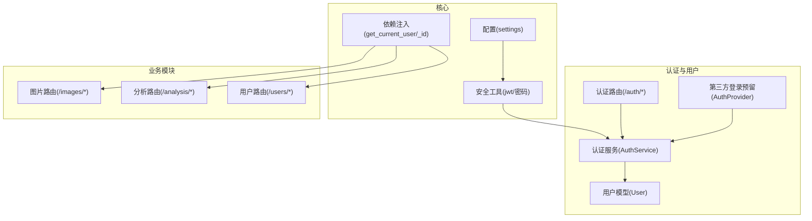
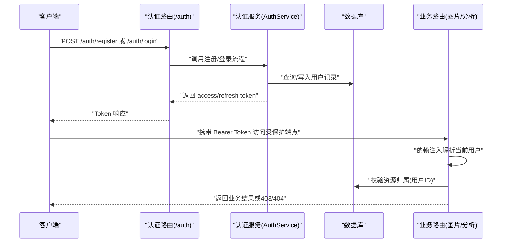
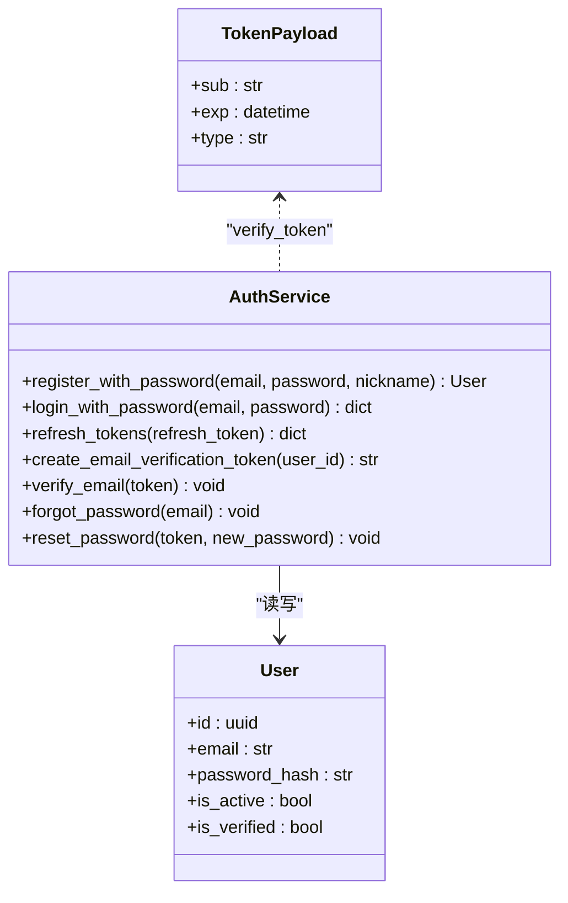
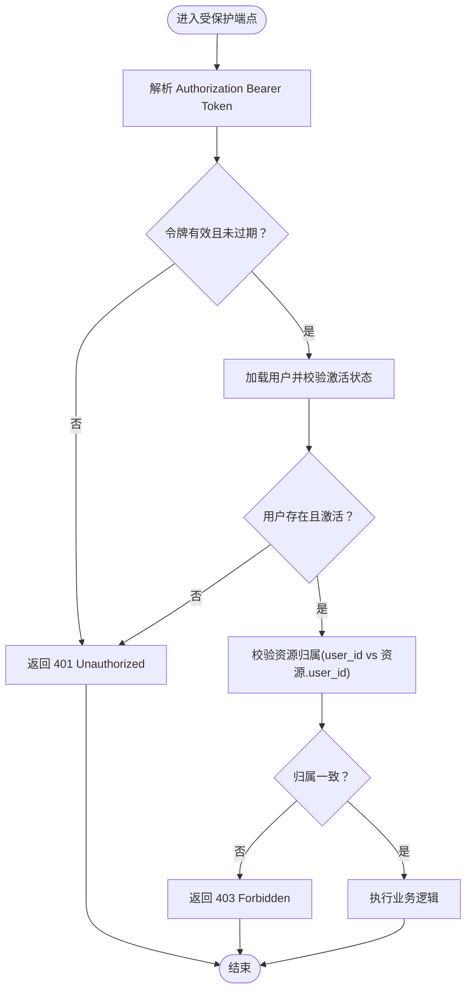
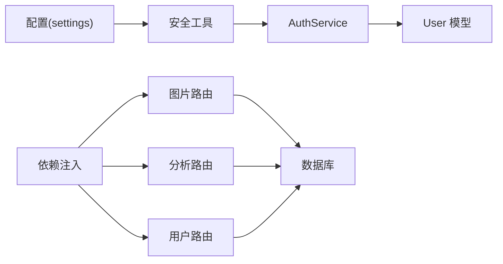

# 权限控制

<cite>
**本文引用的文件**
- [apps/api/app/core/security.py](file://apps/api/app/core/security.py)
- [apps/api/app/core/config.py](file://apps/api/app/core/config.py)
- [apps/api/app/deps.py](file://apps/api/app/deps.py)
- [apps/api/app/models/user.py](file://apps/api/app/models/user.py)
- [apps/api/app/models/auth_provider.py](file://apps/api/app/models/auth_provider.py)
- [apps/api/app/modules/auth/router.py](file://apps/api/app/modules/auth/router.py)
- [apps/api/app/modules/auth/service.py](file://apps/api/app/modules/auth/service.py)
- [apps/api/app/modules/users/router.py](file://apps/api/app/modules/users/router.py)
- [apps/api/app/modules/images/router.py](file://apps/api/app/modules/images/router.py)
- [apps/api/app/modules/analysis/router.py](file://apps/api/app/modules/analysis/router.py)
- [apps/api/app/main.py](file://apps/api/app/main.py)
- [apps/api/tests/test_security.py](file://apps/api/tests/test_security.py)
- [openspec/changes/add-user-auth/spec.md](file://openspec/changes/add-user-auth/spec.md)
- [openspec/changes/add-user-auth/design.md](file://openspec/changes/add-user-auth/design.md)
</cite>

## 目录
1. [简介](#简介)
2. [项目结构](#项目结构)
3. [核心组件](#核心组件)
4. [架构总览](#架构总览)
5. [详细组件分析](#详细组件分析)
6. [依赖分析](#依赖分析)
7. [性能考虑](#性能考虑)
8. [故障排查指南](#故障排查指南)
9. [结论](#结论)
10. [附录](#附录)

## 简介
本文件面向“AI摄影教练”项目的权限控制系统，聚焦于基于角色的访问控制（RBAC）实现与权限模型设计。当前系统以“用户身份认证与授权”为核心，采用基于 JWT 的无状态认证，结合资源级访问控制（RBA）在各业务模块中实现细粒度的权限校验。文档覆盖以下主题：
- 基于角色的访问控制（RBAC）模型与实现
- 用户权限的分配、继承与撤销机制
- API 端点级别的权限验证与资源访问控制
- 权限缓存策略与性能优化方案
- 权限审计日志与合规性检查
- 权限配置管理与动态权限调整
- 权限冲突解决与优先级处理策略

## 项目结构
权限控制相关代码主要分布在以下模块：
- 核心安全与配置：JWT 工具、密码哈希、令牌生成与校验、配置项
- 认证与用户：认证路由、认证服务、用户模型与第三方登录预留
- 依赖注入：统一的当前用户解析与用户 ID 提取
- 业务模块：图片上传、分析任务等模块中的资源级权限校验
- 测试与规范：安全工具单元测试、权限相关需求与设计说明

图表来源
- [apps/api/app/core/config.py:1-47](file://apps/api/app/core/config.py#L1-L47)
- [apps/api/app/core/security.py:1-72](file://apps/api/app/core/security.py#L1-L72)
- [apps/api/app/deps.py:1-41](file://apps/api/app/deps.py#L1-L41)
- [apps/api/app/modules/auth/router.py:1-93](file://apps/api/app/modules/auth/router.py#L1-L93)
- [apps/api/app/modules/auth/service.py:1-145](file://apps/api/app/modules/auth/service.py#L1-L145)
- [apps/api/app/models/user.py:1-28](file://apps/api/app/models/user.py#L1-L28)
- [apps/api/app/models/auth_provider.py:1-24](file://apps/api/app/models/auth_provider.py#L1-L24)
- [apps/api/app/modules/images/router.py:1-77](file://apps/api/app/modules/images/router.py#L1-L77)
- [apps/api/app/modules/analysis/router.py:1-151](file://apps/api/app/modules/analysis/router.py#L1-L151)
- [apps/api/app/modules/users/router.py:1-71](file://apps/api/app/modules/users/router.py#L1-L71)

章节来源
- [apps/api/app/main.py:1-36](file://apps/api/app/main.py#L1-L36)
- [apps/api/app/core/config.py:1-47](file://apps/api/app/core/config.py#L1-L47)

## 核心组件
- JWT 与密码安全工具：提供密码哈希、密码验证、访问/刷新令牌生成与校验、令牌载荷结构定义。
- 配置中心：集中管理 JWT 密钥、算法、过期时间以及跨域等全局设置。
- 依赖注入：统一从 Authorization Bearer Token 解析当前用户，确保路由层无需感知认证细节。
- 认证服务：封装注册、登录、刷新、邮箱验证、密码重置等流程，并与用户模型交互。
- 用户模型与第三方登录预留：用户实体包含激活与验证状态；第三方登录预留表为未来扩展做准备。
- 业务模块权限校验：在图片上传、分析任务等端点中，通过用户 ID 与资源归属比对实现资源级访问控制。

章节来源
- [apps/api/app/core/security.py:1-72](file://apps/api/app/core/security.py#L1-L72)
- [apps/api/app/core/config.py:1-47](file://apps/api/app/core/config.py#L1-L47)
- [apps/api/app/deps.py:1-41](file://apps/api/app/deps.py#L1-L41)
- [apps/api/app/modules/auth/service.py:1-145](file://apps/api/app/modules/auth/service.py#L1-L145)
- [apps/api/app/models/user.py:1-28](file://apps/api/app/models/user.py#L1-L28)
- [apps/api/app/models/auth_provider.py:1-24](file://apps/api/app/models/auth_provider.py#L1-L24)

## 架构总览
系统采用“无状态认证 + 资源级授权”的架构：
- 客户端通过认证端点获取访问/刷新令牌
- 后续请求携带 Bearer Token，服务端解析并校验令牌，解析出用户标识
- 在业务端点中，将用户标识与资源所属关系进行比对，决定是否放行

图表来源
- [apps/api/app/modules/auth/router.py:1-93](file://apps/api/app/modules/auth/router.py#L1-L93)
- [apps/api/app/modules/auth/service.py:1-145](file://apps/api/app/modules/auth/service.py#L1-L145)
- [apps/api/app/deps.py:1-41](file://apps/api/app/deps.py#L1-L41)
- [apps/api/app/modules/images/router.py:1-77](file://apps/api/app/modules/images/router.py#L1-L77)
- [apps/api/app/modules/analysis/router.py:1-151](file://apps/api/app/modules/analysis/router.py#L1-L151)

## 详细组件分析

### 组件A：认证与授权（AuthService 与依赖注入）
AuthService 封装了完整的认证生命周期，包括注册、登录、刷新、邮箱验证与密码重置。依赖注入模块提供统一的当前用户解析，确保所有业务端点只需依赖用户 ID 即可完成授权判断。

图表来源
- [apps/api/app/modules/auth/service.py:1-145](file://apps/api/app/modules/auth/service.py#L1-L145)
- [apps/api/app/core/security.py:12-72](file://apps/api/app/core/security.py#L12-L72)
- [apps/api/app/models/user.py:12-28](file://apps/api/app/models/user.py#L12-L28)

章节来源
- [apps/api/app/modules/auth/service.py:1-145](file://apps/api/app/modules/auth/service.py#L1-L145)
- [apps/api/app/core/security.py:1-72](file://apps/api/app/core/security.py#L1-L72)
- [apps/api/app/models/user.py:1-28](file://apps/api/app/models/user.py#L1-L28)

### 组件B：API 端点级权限验证与资源访问控制
- 图片上传：通过依赖注入获取当前用户 ID，并将该 ID 与待上传对象的归属进行比对，确保只有资源所有者可操作。
- 分析任务：在创建、查询、重试任务时，均校验任务所属用户与当前用户一致，防止越权访问。
- 用户资料：获取与更新当前用户资料时，同样基于令牌解析的用户身份进行授权。

图表来源
- [apps/api/app/deps.py:15-41](file://apps/api/app/deps.py#L15-L41)
- [apps/api/app/modules/images/router.py:20-77](file://apps/api/app/modules/images/router.py#L20-L77)
- [apps/api/app/modules/analysis/router.py:45-151](file://apps/api/app/modules/analysis/router.py#L45-L151)
- [apps/api/app/modules/users/router.py:29-71](file://apps/api/app/modules/users/router.py#L29-L71)

章节来源
- [apps/api/app/deps.py:1-41](file://apps/api/app/deps.py#L1-L41)
- [apps/api/app/modules/images/router.py:1-77](file://apps/api/app/modules/images/router.py#L1-L77)
- [apps/api/app/modules/analysis/router.py:1-151](file://apps/api/app/modules/analysis/router.py#L1-L151)
- [apps/api/app/modules/users/router.py:1-71](file://apps/api/app/modules/users/router.py#L1-L71)

### 组件C：权限模型设计（RBAC）
当前系统未显式定义“角色”与“权限”实体，而是采用“资源级授权”：
- 角色：系统未独立建模角色，用户具备“普通用户”默认角色
- 权限：通过资源归属(user_id)实现最小权限原则
- 继承与撤销：通过用户状态字段(is_active/is_verified)实现账户级的权限启用/禁用

如需扩展 RBAC：
- 引入 Role、Permission、UserRole、UserPermission 实体
- 在依赖注入中解析用户角色集合，结合资源与动作构建授权矩阵
- 在业务端点中增加基于角色/权限的校验

章节来源
- [apps/api/app/models/user.py:12-28](file://apps/api/app/models/user.py#L12-L28)
- [apps/api/app/modules/analysis/router.py:52-56](file://apps/api/app/modules/analysis/router.py#L52-L56)
- [apps/api/app/modules/analysis/router.py:82-86](file://apps/api/app/modules/analysis/router.py#L82-L86)

### 组件D：API 端点与权限映射
- 认证端点：/auth/register、/auth/login、/auth/refresh、/auth/logout、/auth/verify-email、/auth/forgot-password、/auth/reset-password
- 用户端点：/users/me、/users/me/change-password
- 图片端点：/images/upload
- 分析端点：/analysis/tasks、/analysis/tasks/{task_id}、/analysis/history、/analysis/tasks/{task_id}/retry

章节来源
- [apps/api/app/modules/auth/router.py:1-93](file://apps/api/app/modules/auth/router.py#L1-L93)
- [apps/api/app/modules/users/router.py:1-71](file://apps/api/app/modules/users/router.py#L1-L71)
- [apps/api/app/modules/images/router.py:1-77](file://apps/api/app/modules/images/router.py#L1-L77)
- [apps/api/app/modules/analysis/router.py:1-151](file://apps/api/app/modules/analysis/router.py#L1-L151)

## 依赖分析
- 配置依赖：安全工具与令牌过期策略依赖配置中心
- 认证服务依赖：用户模型与数据库会话
- 依赖注入依赖：HTTP Bearer 与安全工具
- 业务模块依赖：依赖注入提供的用户 ID，再与数据库资源进行归属校验

图表来源
- [apps/api/app/core/config.py:1-47](file://apps/api/app/core/config.py#L1-L47)
- [apps/api/app/core/security.py:1-72](file://apps/api/app/core/security.py#L1-L72)
- [apps/api/app/modules/auth/service.py:1-145](file://apps/api/app/modules/auth/service.py#L1-L145)
- [apps/api/app/models/user.py:1-28](file://apps/api/app/models/user.py#L1-L28)
- [apps/api/app/deps.py:1-41](file://apps/api/app/deps.py#L1-L41)
- [apps/api/app/modules/images/router.py:1-77](file://apps/api/app/modules/images/router.py#L1-L77)
- [apps/api/app/modules/analysis/router.py:1-151](file://apps/api/app/modules/analysis/router.py#L1-L151)
- [apps/api/app/modules/users/router.py:1-71](file://apps/api/app/modules/users/router.py#L1-L71)

章节来源
- [apps/api/app/core/config.py:1-47](file://apps/api/app/core/config.py#L1-L47)
- [apps/api/app/core/security.py:1-72](file://apps/api/app/core/security.py#L1-L72)
- [apps/api/app/modules/auth/service.py:1-145](file://apps/api/app/modules/auth/service.py#L1-L145)
- [apps/api/app/models/user.py:1-28](file://apps/api/app/models/user.py#L1-L28)
- [apps/api/app/deps.py:1-41](file://apps/api/app/deps.py#L1-L41)

## 性能考虑
- 令牌校验开销：JWT 解码与校验为 CPU 密集型，建议：
  - 使用较短的 access_token 过期时间，配合 refresh_token 刷新
  - 在网关或边缘层进行令牌缓存与快速校验（如基于子字段的索引）
- 数据库访问：每次请求均需加载用户并校验资源归属，建议：
  - 在应用层缓存当前用户基础信息（如用户 ID、激活状态）
  - 对热点资源（最近 N 天内上传的图片）进行内存缓存
- 并发与锁：令牌刷新与资源校验应避免长事务与热点竞争

[本节为通用性能建议，不直接分析具体文件]

## 故障排查指南
- 401 未认证/令牌无效
  - 检查请求头是否包含正确的 Bearer Token
  - 校验密钥与算法配置是否一致
  - 确认令牌未过期
- 403 禁止访问
  - 核对资源归属(user_id)与当前用户是否一致
  - 检查用户是否被停用或未验证
- 404 资源不存在
  - 确认资源 ID 是否正确
- 单元测试参考
  - 密码哈希与验证、令牌创建与校验的正确性可通过单元测试覆盖

章节来源
- [apps/api/app/core/security.py:49-72](file://apps/api/app/core/security.py#L49-L72)
- [apps/api/app/deps.py:15-41](file://apps/api/app/deps.py#L15-L41)
- [apps/api/tests/test_security.py:1-45](file://apps/api/tests/test_security.py#L1-L45)

## 结论
当前系统以 JWT 为基础实现了强认证与无状态授权，结合资源级访问控制在各业务模块中落实最小权限原则。若需进一步演进至 RBAC，可在现有依赖注入与业务端点之上引入角色/权限实体与授权矩阵，保持路由签名与依赖注入的稳定性。

[本节为总结性内容，不直接分析具体文件]

## 附录

### 权限审计日志与合规性检查
- 建议在以下关键事件记录审计日志：
  - 用户注册/登录/登出
  - 密码变更/重置
  - 资源创建/删除/修改
  - 权限变更（如用户状态变化）
- 日志字段建议：时间戳、用户ID、操作类型、资源ID、IP地址、User-Agent、结果状态
- 合规性：遵循最小必要原则，避免记录明文密码；对日志进行脱敏与定期清理

[本节为通用实践建议，不直接分析具体文件]

### 权限配置管理与动态权限调整
- 配置管理：通过配置中心集中管理 JWT 密钥、算法与过期时间
- 动态调整：在用户状态(is_active/is_verified)变化时，立即生效于后续请求校验
- 扩展 RBAC：引入角色/权限实体后，通过后台管理界面或 API 动态分配与回收权限

[本节为通用实践建议，不直接分析具体文件]

### 权限冲突解决与优先级处理
- 冲突场景：用户同时具备多种访问意图（如管理员与普通用户）
- 处理策略：采用“最小权限原则”，优先使用资源级归属校验；若引入角色/权限矩阵，按“拒绝优先”或“允许优先”策略配置
- 优先级：资源级校验优先于角色/权限矩阵；角色/权限矩阵优先于默认拒绝

[本节为通用实践建议，不直接分析具体文件]

### 与需求/设计的对应关系
- 需求覆盖：注册、登录、Token 刷新、邮箱验证、密码重置等需求已在实现中体现
- 设计取舍：SPA 场景下采用短寿命 Access Token 与刷新机制；OAuth2 预留扩展点

章节来源
- [openspec/changes/add-user-auth/spec.md:1-134](file://openspec/changes/add-user-auth/spec.md#L1-L134)
- [openspec/changes/add-user-auth/design.md:46-79](file://openspec/changes/add-user-auth/design.md#L46-L79)