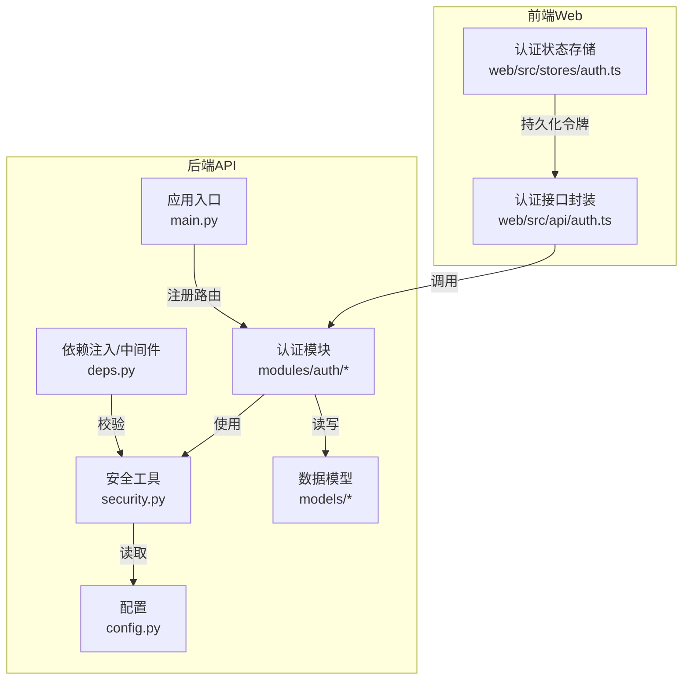
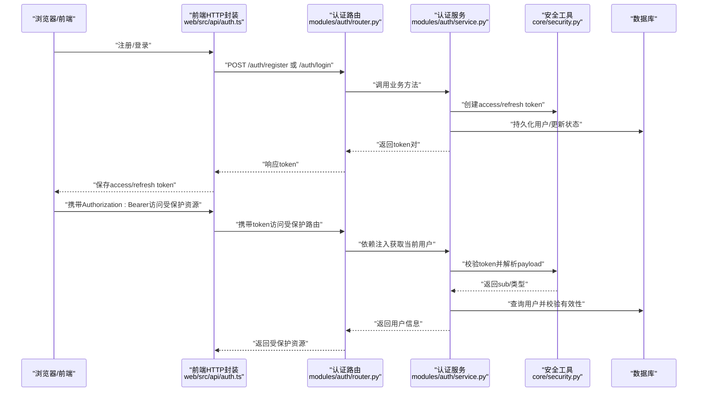
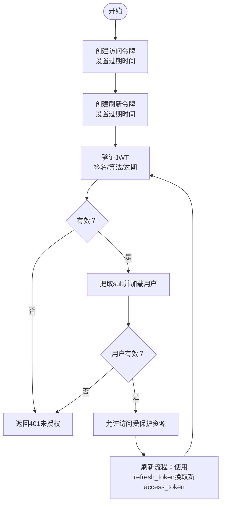
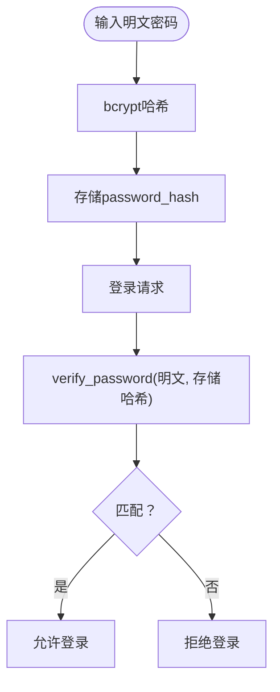
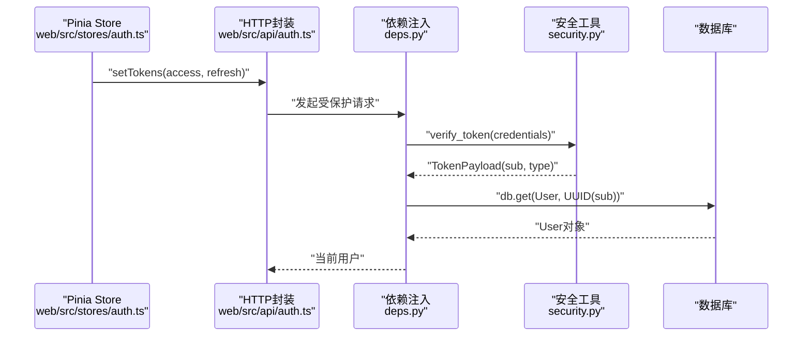
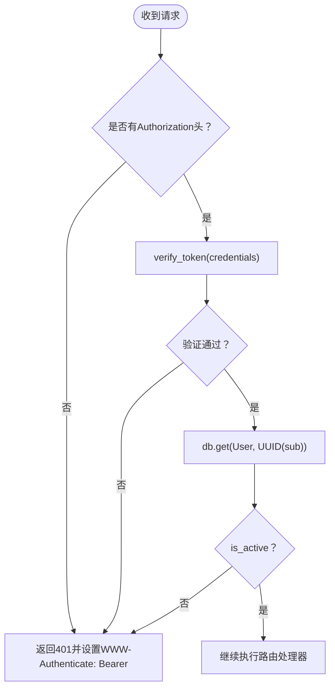
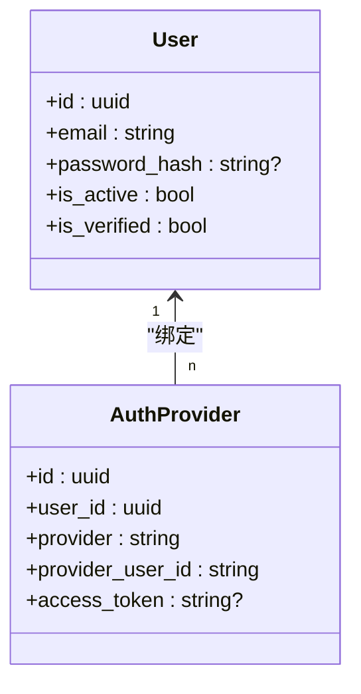
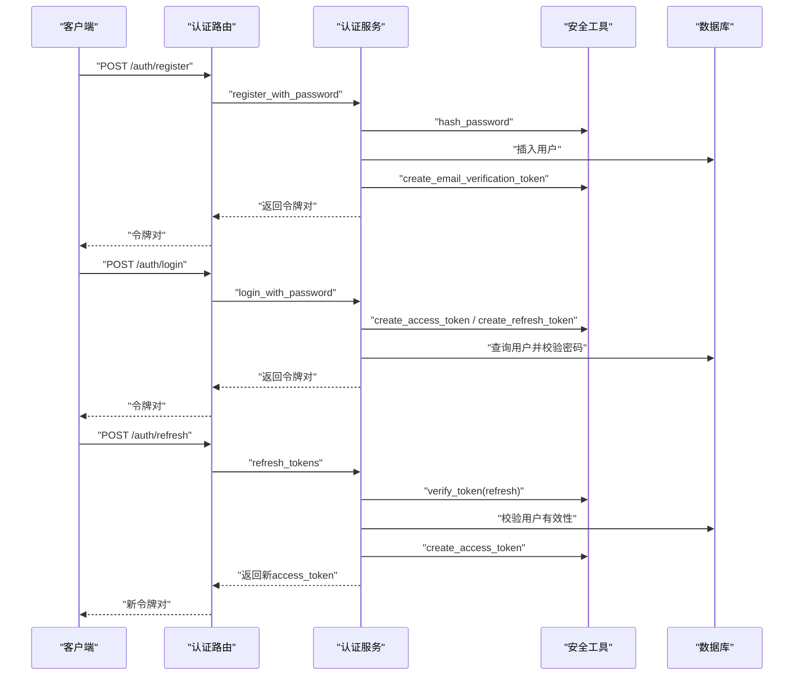
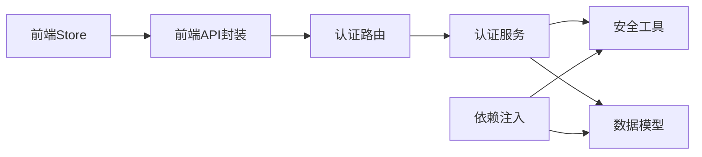

# 认证系统

<cite>
**本文引用的文件**
- [apps/api/app/core/security.py](file://apps/api/app/core/security.py)
- [apps/api/app/modules/auth/service.py](file://apps/api/app/modules/auth/service.py)
- [apps/api/app/schemas/auth.py](file://apps/api/app/schemas/auth.py)
- [apps/api/app/deps.py](file://apps/api/app/deps.py)
- [apps/api/app/core/config.py](file://apps/api/app/core/config.py)
- [apps/api/app/modules/auth/router.py](file://apps/api/app/modules/auth/router.py)
- [apps/api/app/models/user.py](file://apps/api/app/models/user.py)
- [apps/api/app/models/auth_provider.py](file://apps/api/app/models/auth_provider.py)
- [apps/api/tests/test_auth.py](file://apps/api/tests/test_auth.py)
- [apps/api/tests/test_security.py](file://apps/api/tests/test_security.py)
- [apps/api/app/main.py](file://apps/api/app/main.py)
- [apps/web/src/stores/auth.ts](file://apps/web/src/stores/auth.ts)
- [apps/web/src/api/auth.ts](file://apps/web/src/api/auth.ts)
</cite>

## 更新摘要
**变更内容**
- 新增完整的JWT认证系统实现，包括令牌生成、验证、刷新和过期处理
- 完善密码加密策略，使用bcrypt进行安全哈希
- 实现会话管理和用户状态维护机制
- 添加认证中间件和权限控制配置
- 集成OAuth2第三方登录预留功能
- 增强安全最佳实践和常见攻击防护措施
- 完善认证流程的调试和监控方法

## 目录
1. [简介](#简介)
2. [项目结构](#项目结构)
3. [核心组件](#核心组件)
4. [架构总览](#架构总览)
5. [详细组件分析](#详细组件分析)
6. [依赖分析](#依赖分析)
7. [性能考虑](#性能考虑)
8. [故障排查指南](#故障排查指南)
9. [结论](#结论)
10. [附录](#附录)

## 简介
本文件为"AI摄影教练"认证系统的安全文档，聚焦以下主题：
- JWT令牌机制：生成、验证、刷新与过期处理
- 密码加密策略与安全哈希算法
- 会话管理与用户状态维护
- 认证中间件与权限控制配置
- OAuth2集成与第三方登录（预留）
- 安全最佳实践与常见攻击防护
- 认证流程的调试与监控方法
- 用户隐私保护与数据安全合规指引

## 项目结构
认证相关能力主要分布在后端API应用中，前端通过Pinia Store与HTTP接口交互；测试覆盖了认证端点与安全工具的行为。

**图表来源**
- [apps/api/app/core/config.py:30-34](file://apps/api/app/core/config.py#L30-L34)
- [apps/api/app/core/security.py:32-46](file://apps/api/app/core/security.py#L32-L46)
- [apps/api/app/modules/auth/router.py:21](file://apps/api/app/modules/auth/router.py#L21)
- [apps/api/app/deps.py:15-33](file://apps/api/app/deps.py#L15-L33)
- [apps/api/app/models/user.py:12-27](file://apps/api/app/models/user.py#L12-L27)
- [apps/web/src/stores/auth.ts:6-25](file://apps/web/src/stores/auth.ts#L6-L25)
- [apps/web/src/api/auth.ts:29-43](file://apps/web/src/api/auth.ts#L29-L43)

**章节来源**
- [apps/api/app/main.py:11-24](file://apps/api/app/main.py#L11-L24)
- [apps/api/app/modules/auth/router.py:21](file://apps/api/app/modules/auth/router.py#L21)

## 核心组件
- 安全工具模块：提供密码哈希、JWT生成与验证、访问/刷新令牌创建与校验
- 认证服务：实现注册、登录、令牌刷新、邮箱验证、忘记/重置密码等业务逻辑
- 认证路由：暴露REST端点，处理注册、登录、刷新、登出、邮箱验证、密码找回与重置
- 依赖注入与中间件：从Authorization头解析Bearer Token，解析并校验JWT，加载当前用户
- 数据模型：用户模型与OAuth2预留表
- 前端状态与接口：Pinia Store持久化令牌，封装认证HTTP调用

**章节来源**
- [apps/api/app/core/security.py:12-72](file://apps/api/app/core/security.py#L12-L72)
- [apps/api/app/modules/auth/service.py:21-145](file://apps/api/app/modules/auth/service.py#L21-L145)
- [apps/api/app/schemas/auth.py:5-37](file://apps/api/app/schemas/auth.py#L5-L37)
- [apps/api/app/deps.py:15-41](file://apps/api/app/deps.py#L15-L41)
- [apps/api/app/models/user.py:12-27](file://apps/api/app/models/user.py#L12-L27)
- [apps/api/app/models/auth_provider.py:12-23](file://apps/api/app/models/auth_provider.py#L12-L23)
- [apps/web/src/stores/auth.ts:6-25](file://apps/web/src/stores/auth.ts#L6-L25)
- [apps/web/src/api/auth.ts:29-43](file://apps/web/src/api/auth.ts#L29-L43)

## 架构总览
认证系统采用"后端API + 前端SPA"的分层架构，认证流程围绕JWT令牌在服务端与客户端之间传递与使用展开。

**图表来源**
- [apps/api/app/modules/auth/router.py:24-46](file://apps/api/app/modules/auth/router.py#L24-L46)
- [apps/api/app/modules/auth/service.py:50-75](file://apps/api/app/modules/auth/service.py#L50-L75)
- [apps/api/app/core/security.py:32-46](file://apps/api/app/core/security.py#L32-L46)
- [apps/api/app/deps.py:15-33](file://apps/api/app/deps.py#L15-L33)

## 详细组件分析

### JWT令牌机制
- 令牌类型与载荷
  - 访问令牌：用于访问受保护资源，包含sub（用户ID）、exp（过期时间）、type=access
  - 刷新令牌：用于换取新的访问令牌，包含sub、exp、type=refresh
- 生成策略
  - 访问令牌：基于配置的密钥与算法生成，默认有效期可配置
  - 刷新令牌：基于配置的密钥与算法生成，默认有效期可配置
- 验证策略
  - 解析并校验签名与算法
  - 校验过期时间
  - 提取sub并映射到用户对象
- 刷新与过期
  - 使用刷新令牌换取新的访问令牌
  - 过期或无效令牌统一返回未授权错误

**图表来源**
- [apps/api/app/core/security.py:32-46](file://apps/api/app/core/security.py#L32-L46)
- [apps/api/app/core/security.py:49-72](file://apps/api/app/core/security.py#L49-L72)
- [apps/api/app/modules/auth/service.py:77-92](file://apps/api/app/modules/auth/service.py#L77-L92)

**章节来源**
- [apps/api/app/core/security.py:12-16](file://apps/api/app/core/security.py#L12-L16)
- [apps/api/app/core/security.py:32-46](file://apps/api/app/core/security.py#L32-L46)
- [apps/api/app/core/security.py:49-72](file://apps/api/app/core/security.py#L49-L72)
- [apps/api/app/modules/auth/service.py:77-92](file://apps/api/app/modules/auth/service.py#L77-L92)

### 密码加密策略与安全哈希
- 使用bcrypt进行密码哈希，确保不可逆与抗彩虹表
- 注册时对明文密码进行哈希存储
- 登录时使用哈希验证，避免明文比较
- 单元测试覆盖哈希生成、验证正确性与错误性

**图表来源**
- [apps/api/app/core/security.py:22-29](file://apps/api/app/core/security.py#L22-L29)
- [apps/api/app/modules/auth/service.py:27-48](file://apps/api/app/modules/auth/service.py#L27-L48)
- [apps/api/tests/test_security.py:18-32](file://apps/api/tests/test_security.py#L18-L32)

**章节来源**
- [apps/api/app/core/security.py:19](file://apps/api/app/core/security.py#L19)
- [apps/api/app/core/security.py:22-29](file://apps/api/app/core/security.py#L22-L29)
- [apps/api/tests/test_security.py:15-39](file://apps/api/tests/test_security.py#L15-L39)

### 会话管理与用户状态维护
- 前端使用Pinia Store维护access_token、refresh_token与当前用户信息，并持久化至本地存储
- 受保护资源访问时，前端在请求头附加Authorization: Bearer
- 后端依赖注入从Authorization头解析并校验令牌，解析出用户ID并加载用户对象
- 用户状态包含激活与邮箱验证标志，影响访问有效性

**图表来源**
- [apps/web/src/stores/auth.ts:6-25](file://apps/web/src/stores/auth.ts#L6-L25)
- [apps/web/src/api/auth.ts:37-43](file://apps/web/src/api/auth.ts#L37-L43)
- [apps/api/app/deps.py:15-33](file://apps/api/app/deps.py#L15-L33)
- [apps/api/app/core/security.py:49-72](file://apps/api/app/core/security.py#L49-L72)
- [apps/api/app/models/user.py:15-21](file://apps/api/app/models/user.py#L15-L21)

**章节来源**
- [apps/web/src/stores/auth.ts:6-25](file://apps/web/src/stores/auth.ts#L6-L25)
- [apps/web/src/api/auth.ts:37-43](file://apps/web/src/api/auth.ts#L37-L43)
- [apps/api/app/deps.py:15-33](file://apps/api/app/deps.py#L15-L33)
- [apps/api/app/models/user.py:12-27](file://apps/api/app/models/user.py#L12-L27)

### 认证中间件与权限控制
- HTTP Bearer认证：自动从Authorization头解析Bearer token
- 依赖注入函数：若缺少凭据或令牌无效/过期，统一返回未授权
- 权限控制：仅在需要时在路由上使用依赖注入获取当前用户，从而实现按需鉴权

**图表来源**
- [apps/api/app/deps.py:12-33](file://apps/api/app/deps.py#L12-L33)
- [apps/api/app/core/security.py:49-72](file://apps/api/app/core/security.py#L49-L72)
- [apps/api/app/models/user.py:20](file://apps/api/app/models/user.py#L20)

**章节来源**
- [apps/api/app/deps.py:12-33](file://apps/api/app/deps.py#L12-L33)

### OAuth2集成与第三方登录
- 数据模型预留：提供第三方登录绑定记录表，字段包含provider、provider_user_id、access_token等
- 服务层预留：认证服务提供OAuth相关方法注释，当前未实现
- 实施建议：在服务层实现OAuth登录与绑定流程，结合数据库表完成第三方账号与本地用户的关联

**图表来源**
- [apps/api/app/models/user.py:12-27](file://apps/api/app/models/user.py#L12-L27)
- [apps/api/app/models/auth_provider.py:12-23](file://apps/api/app/models/auth_provider.py#L12-L23)
- [apps/api/app/modules/auth/service.py:142-144](file://apps/api/app/modules/auth/service.py#L142-L144)

**章节来源**
- [apps/api/app/models/auth_provider.py:12-23](file://apps/api/app/models/auth_provider.py#L12-L23)
- [apps/api/app/modules/auth/service.py:142-144](file://apps/api/app/modules/auth/service.py#L142-L144)

### 认证端点与流程
- 注册：邮箱+密码，去重检查，返回令牌对；同时生成短期邮箱验证令牌（开发模式记录日志）
- 登录：邮箱+密码，返回令牌对
- 刷新：使用refresh_token换取新的access_token
- 登出：返回成功消息（客户端负责清理本地token）
- 邮箱验证：使用短期验证token更新用户为已验证
- 忘记密码：生成短期重置token（开发模式记录日志），便于演示
- 重置密码：使用重置token更新密码

**图表来源**
- [apps/api/app/modules/auth/router.py:24-46](file://apps/api/app/modules/auth/router.py#L24-L46)
- [apps/api/app/modules/auth/service.py:27-92](file://apps/api/app/modules/auth/service.py#L27-L92)
- [apps/api/app/core/security.py:32-46](file://apps/api/app/core/security.py#L32-L46)

**章节来源**
- [apps/api/app/modules/auth/router.py:24-93](file://apps/api/app/modules/auth/router.py#L24-L93)
- [apps/api/app/modules/auth/service.py:27-145](file://apps/api/app/modules/auth/service.py#L27-L145)

## 依赖分析
- 组件耦合
  - 认证服务依赖安全工具模块（密码哈希、JWT生成/验证）
  - 认证路由依赖认证服务与数据模型
  - 依赖注入依赖安全工具与数据模型
  - 前端Store与API封装依赖后端路由与响应模型
- 外部依赖
  - JWT库：用于编码/解码与签名验证
  - 密码哈希库：bcrypt
  - ORM：SQLAlchemy
  - Web框架：FastAPI

**图表来源**
- [apps/api/app/modules/auth/router.py:7-17](file://apps/api/app/modules/auth/router.py#L7-L17)
- [apps/api/app/modules/auth/service.py:9-16](file://apps/api/app/modules/auth/service.py#L9-L16)
- [apps/api/app/deps.py:8-10](file://apps/api/app/deps.py#L8-L10)
- [apps/web/src/api/auth.ts:1-56](file://apps/web/src/api/auth.ts#L1-L56)

**章节来源**
- [apps/api/app/modules/auth/router.py:7-17](file://apps/api/app/modules/auth/router.py#L7-L17)
- [apps/api/app/modules/auth/service.py:9-16](file://apps/api/app/modules/auth/service.py#L9-L16)
- [apps/api/app/deps.py:8-10](file://apps/api/app/deps.py#L8-L10)
- [apps/web/src/api/auth.ts:1-56](file://apps/web/src/api/auth.ts#L1-L56)

## 性能考虑
- 令牌生成与验证为轻量操作，性能开销主要来自数据库查询与密码哈希
- 建议
  - 缓存热点用户信息（谨慎设计失效策略）
  - 控制访问令牌有效期以降低频繁刷新成本
  - 在高并发场景下优化数据库索引（如用户邮箱唯一索引）

## 故障排查指南
- 常见问题与定位
  - 401未授权：检查Authorization头格式、令牌是否过期、用户是否被禁用
  - 409冲突：注册时邮箱重复
  - 422参数错误：邮箱格式或密码长度不符合Schema约束
  - 400错误：邮箱验证/重置令牌无效或过期
- 调试建议
  - 启用后端日志，观察认证与安全工具调用链
  - 前端Store持久化令牌，确认本地存储与请求头一致
  - 使用测试用例作为行为参考，逐步比对期望与实际
- 监控指标
  - 认证端点的响应时间与错误率
  - 令牌签发与刷新次数
  - 用户状态变更（激活/验证）

**章节来源**
- [apps/api/tests/test_auth.py:51-191](file://apps/api/tests/test_auth.py#L51-L191)
- [apps/api/tests/test_security.py:69-98](file://apps/api/tests/test_security.py#L69-L98)
- [apps/api/app/modules/auth/router.py:33-35](file://apps/api/app/modules/auth/router.py#L33-L35)

## 结论
本认证系统基于JWT与bcrypt构建，具备完整的注册、登录、令牌刷新、邮箱验证与密码找回流程。通过依赖注入实现按需鉴权，前端以Store与HTTP封装完成令牌持久化与请求头注入。OAuth2集成处于预留阶段，建议在后续迭代中完善第三方登录与账号绑定。整体设计清晰、边界明确，便于扩展与演进。

## 附录

### 安全最佳实践
- 强制HTTPS传输，防止令牌在传输中被窃取
- 严格最小权限原则，仅在必要路由启用依赖注入
- 限制令牌有效期，降低泄露风险
- 定期轮换JWT密钥，妥善管理环境变量
- 输入校验与参数化查询，防范注入类攻击
- 日志脱敏，避免敏感信息泄露

### 常见攻击与防护
- 中间人攻击：强制HTTPS与安全传输
- 令牌泄露：短有效期、服务端撤销机制（可选）、刷新令牌保护
- 点击劫持与CSRF：前端同源策略与CORS配置配合
- 强暴力破解：账户锁定策略、速率限制、验证码（可选）
- 业务逻辑绕过：严格的依赖注入与用户状态校验

### 配置清单（关键项）
- JWT密钥与算法：用于签名与验证
- 访问令牌有效期：分钟级
- 刷新令牌有效期：天级
- CORS白名单：限制来源

**章节来源**
- [apps/api/app/core/config.py:30-34](file://apps/api/app/core/config.py#L30-L34)