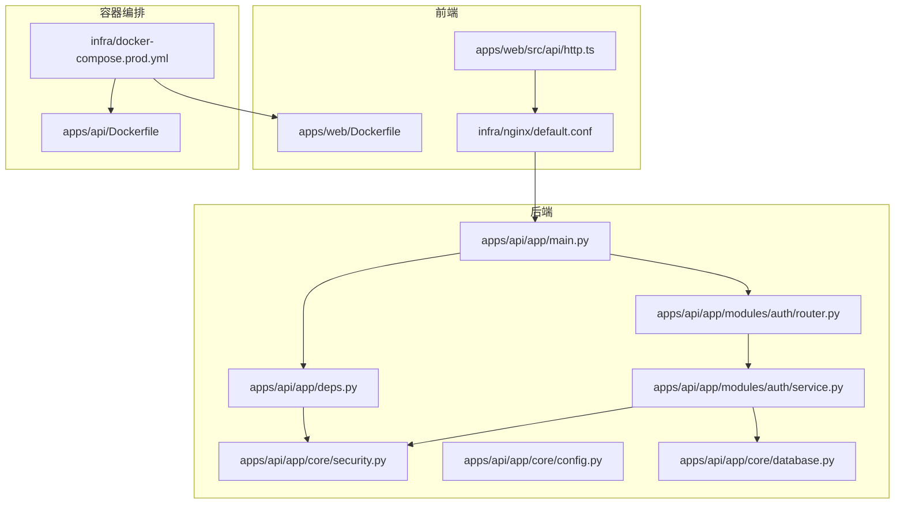
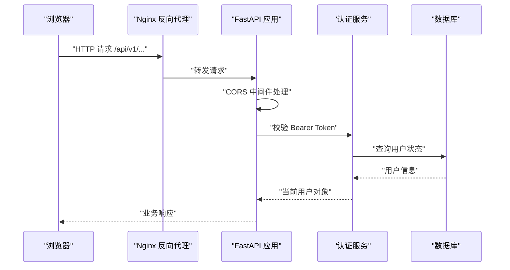
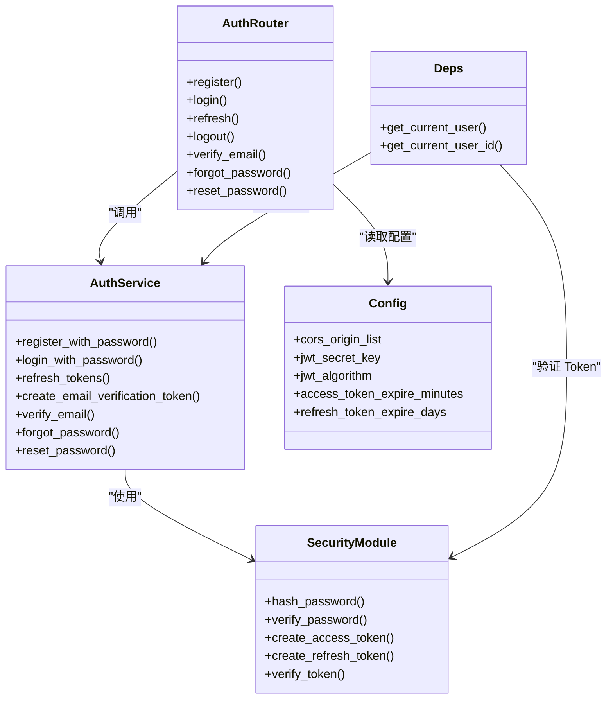
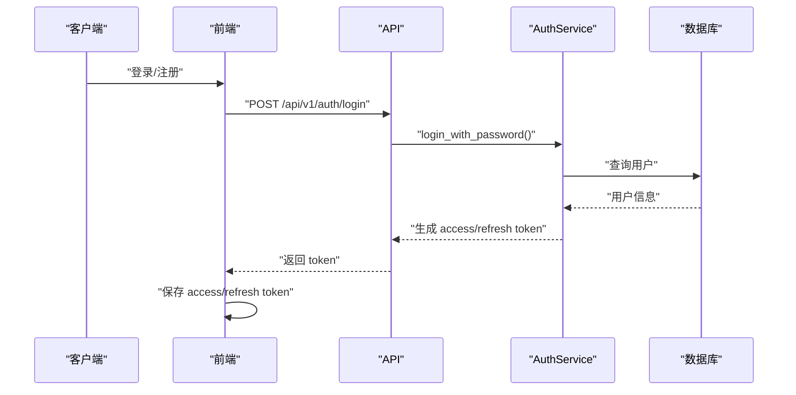

# 安全加固

<cite>
**本文引用的文件**
- [apps/api/app/main.py](file://apps/api/app/main.py)
- [apps/api/app/core/config.py](file://apps/api/app/core/config.py)
- [apps/api/app/core/security.py](file://apps/api/app/core/security.py)
- [apps/api/app/core/database.py](file://apps/api/app/core/database.py)
- [apps/api/app/deps.py](file://apps/api/app/deps.py)
- [apps/api/app/modules/auth/router.py](file://apps/api/app/modules/auth/router.py)
- [apps/api/app/modules/auth/service.py](file://apps/api/app/modules/auth/service.py)
- [apps/api/app/schemas/auth.py](file://apps/api/app/schemas/auth.py)
- [apps/api/tests/test_security.py](file://apps/api/tests/test_security.py)
- [apps/api/tests/test_auth.py](file://apps/api/tests/test_auth.py)
- [apps/api/Dockerfile](file://apps/api/Dockerfile)
- [apps/web/Dockerfile](file://apps/web/Dockerfile)
- [apps/web/src/api/http.ts](file://apps/web/src/api/http.ts)
- [infra/docker-compose.prod.yml](file://infra/docker-compose.prod.yml)
- [infra/nginx/default.conf](file://infra/nginx/default.conf)
- [openspec/changes/add-user-auth/proposal.md](file://openspec/changes/add-user-auth/proposal.md)
- [openspec/changes/add-user-auth/design.md](file://openspec/changes/add-user-auth/design.md)
</cite>

## 目录
1. [简介](#简介)
2. [项目结构](#项目结构)
3. [核心组件](#核心组件)
4. [架构总览](#架构总览)
5. [详细组件分析](#详细组件分析)
6. [依赖分析](#依赖分析)
7. [性能考虑](#性能考虑)
8. [故障排查指南](#故障排查指南)
9. [结论](#结论)
10. [附录](#附录)

## 简介
本文件面向“AI摄影教练”项目，提供一套系统化的安全加固与防护方案。内容覆盖应用安全配置（CORS、CSRF、XSS）、数据库安全（连接加密、访问控制、审计）、API安全（速率限制、请求验证、输入过滤）、容器安全（只读文件系统、用户权限、安全扫描）、网络安全（防火墙、VPN、DDoS）、漏洞扫描与安全审计流程、数据加密与隐私保护、以及安全事件响应与应急处理预案。文档以仓库现有实现为基础，结合最佳实践提出改进建议与落地步骤。

## 项目结构
项目采用前后端分离与容器化部署架构：
- Web 前端：基于 Vite + Vue，构建产物由 Nginx 提供静态服务。
- API 后端：FastAPI 应用，提供认证、分析、图片等接口。
- Worker：异步任务执行（如图像分析）。
- 基础设施：PostgreSQL、Redis、MinIO，通过 docker-compose 编排。

**图表来源**
- [apps/api/app/main.py:1-36](file://apps/api/app/main.py#L1-L36)
- [apps/api/app/deps.py:1-41](file://apps/api/app/deps.py#L1-L41)
- [apps/api/app/modules/auth/router.py:1-93](file://apps/api/app/modules/auth/router.py#L1-L93)
- [apps/api/app/modules/auth/service.py:1-145](file://apps/api/app/modules/auth/service.py#L1-L145)
- [apps/api/app/core/security.py:1-72](file://apps/api/app/core/security.py#L1-L72)
- [apps/api/app/core/config.py:1-47](file://apps/api/app/core/config.py#L1-L47)
- [apps/api/app/core/database.py:1-51](file://apps/api/app/core/database.py#L1-L51)
- [apps/api/Dockerfile:1-23](file://apps/api/Dockerfile#L1-L23)
- [apps/web/Dockerfile:1-22](file://apps/web/Dockerfile#L1-L22)
- [apps/web/src/api/http.ts:1-94](file://apps/web/src/api/http.ts#L1-L94)
- [infra/docker-compose.prod.yml:1-128](file://infra/docker-compose.prod.yml#L1-L128)
- [infra/nginx/default.conf:1-30](file://infra/nginx/default.conf#L1-L30)

**章节来源**
- [apps/api/app/main.py:1-36](file://apps/api/app/main.py#L1-L36)
- [apps/api/app/core/config.py:1-47](file://apps/api/app/core/config.py#L1-L47)
- [apps/api/app/core/database.py:1-51](file://apps/api/app/core/database.py#L1-L51)
- [apps/api/app/deps.py:1-41](file://apps/api/app/deps.py#L1-L41)
- [apps/api/app/modules/auth/router.py:1-93](file://apps/api/app/modules/auth/router.py#L1-L93)
- [apps/api/app/modules/auth/service.py:1-145](file://apps/api/app/modules/auth/service.py#L1-L145)
- [apps/api/app/schemas/auth.py:1-37](file://apps/api/app/schemas/auth.py#L1-L37)
- [apps/api/tests/test_security.py:1-98](file://apps/api/tests/test_security.py#L1-L98)
- [apps/api/tests/test_auth.py:1-191](file://apps/api/tests/test_auth.py#L1-L191)
- [apps/api/Dockerfile:1-23](file://apps/api/Dockerfile#L1-L23)
- [apps/web/Dockerfile:1-22](file://apps/web/Dockerfile#L1-L22)
- [apps/web/src/api/http.ts:1-94](file://apps/web/src/api/http.ts#L1-L94)
- [infra/docker-compose.prod.yml:1-128](file://infra/docker-compose.prod.yml#L1-L128)
- [infra/nginx/default.conf:1-30](file://infra/nginx/default.conf#L1-L30)

## 核心组件
- 认证与授权：基于 JWT 的 Bearer Token，依赖注入获取当前用户，支持注册、登录、刷新、登出、邮箱验证、密码重置。
- CORS：在 FastAPI 中启用跨域，允许凭据传输，通配符方法与头。
- 数据库：SQLAlchemy 引擎与连接池，初始化与增量模式。
- 容器与运行：后端以非 root 用户运行，暴露固定端口；前端基于 Nginx 提供静态资源与反向代理。
- 前端：Axios 统一请求，自动注入 Bearer Token，401 时尝试刷新并重试。

**章节来源**
- [apps/api/app/core/security.py:1-72](file://apps/api/app/core/security.py#L1-L72)
- [apps/api/app/deps.py:1-41](file://apps/api/app/deps.py#L1-L41)
- [apps/api/app/modules/auth/router.py:1-93](file://apps/api/app/modules/auth/router.py#L1-L93)
- [apps/api/app/modules/auth/service.py:1-145](file://apps/api/app/modules/auth/service.py#L1-L145)
- [apps/api/app/main.py:1-36](file://apps/api/app/main.py#L1-L36)
- [apps/api/app/core/database.py:1-51](file://apps/api/app/core/database.py#L1-L51)
- [apps/api/Dockerfile:1-23](file://apps/api/Dockerfile#L1-L23)
- [apps/web/src/api/http.ts:1-94](file://apps/web/src/api/http.ts#L1-L94)

## 架构总览
下图展示认证与安全相关的关键交互路径：前端通过 Nginx 访问 API，API 进行 CORS 处理与 JWT 校验，服务层完成业务操作并访问数据库。

**图表来源**
- [apps/api/app/main.py:1-36](file://apps/api/app/main.py#L1-L36)
- [apps/api/app/deps.py:1-41](file://apps/api/app/deps.py#L1-L41)
- [apps/api/app/modules/auth/service.py:1-145](file://apps/api/app/modules/auth/service.py#L1-L145)
- [apps/api/app/core/database.py:1-51](file://apps/api/app/core/database.py#L1-L51)
- [infra/nginx/default.conf:1-30](file://infra/nginx/default.conf#L1-L30)

## 详细组件分析

### CORS 策略
- 当前实现：在应用启动时注册 CORS 中间件，允许任意源、凭据、方法与头。
- 风险与建议：
  - 在生产环境应明确白名单域名，避免通配符带来的跨站风险。
  - 明确允许的 HTTP 方法与头，减少攻击面。
  - 严格控制凭据传输，仅在必要时开启。

**章节来源**
- [apps/api/app/main.py:13-19](file://apps/api/app/main.py#L13-L19)
- [apps/api/app/core/config.py:25-38](file://apps/api/app/core/config.py#L25-L38)

### CSRF 防护
- 当前实现：未发现显式的 CSRF 中间件或令牌校验逻辑。
- 建议：
  - 在同源 AJAX 请求中增加 SameSite Cookie 与 CSRF Token 校验。
  - 对关键写操作（注册、登录、修改密码、删除）强制校验来源与 CSRF Token。
  - 前端在发起敏感请求时携带服务端签发的 CSRF Token。

**章节来源**
- [apps/api/app/main.py:1-36](file://apps/api/app/main.py#L1-L36)
- [apps/api/app/modules/auth/router.py:1-93](file://apps/api/app/modules/auth/router.py#L1-L93)

### XSS 攻击防护
- 当前实现：前端使用 Axios 注入 Bearer Token，未见专门的 XSS 防护中间件。
- 建议：
  - 启用 Content-Security-Policy（CSP），限制脚本来源与内联脚本。
  - 对用户输入与动态渲染内容进行严格的 HTML 转义与白名单过滤。
  - 使用 HttpOnly、Secure、SameSite Cookie，降低 XSS 后果。
  - 前端避免内联事件与动态 eval，统一通过受控组件渲染。

**章节来源**
- [apps/web/src/api/http.ts:1-94](file://apps/web/src/api/http.ts#L1-L94)
- [openspec/changes/add-user-auth/design.md:81-87](file://openspec/changes/add-user-auth/design.md#L81-L87)

### 数据库安全配置
- 连接加密：当前数据库 URL 未启用 SSL/TLS 参数，建议在生产环境强制使用加密连接。
- 访问控制：最小权限原则，为应用与备份分别创建专用账户；限制网络访问范围。
- 审计日志：启用 PostgreSQL 审计扩展或集中式日志采集，记录 DDL/DML 关键操作与鉴权事件。
- 连接池与健康检查：保持 pre_ping 与健康检查，防止僵尸连接。

**章节来源**
- [apps/api/app/core/database.py:9-18](file://apps/api/app/core/database.py#L9-L18)
- [apps/api/app/core/config.py:13-14](file://apps/api/app/core/config.py#L13-L14)
- [infra/docker-compose.prod.yml:16-30](file://infra/docker-compose.prod.yml#L16-L30)

### API 安全防护方案
- 速率限制：在网关或应用层实现基于 IP/用户维度的限流，防止暴力破解与滥用。
- 请求验证：Pydantic 模型已提供基础字段校验，建议补充长度、格式、枚举值约束。
- 输入过滤：对文件上传、路径参数、查询参数进行白名单过滤与长度限制。
- 敏感操作：对注册、登录、密码重置、删除等接口增加二次确认与 CAPTCHA。
- 日志脱敏：避免记录完整 Token、密码哈希与敏感请求体。

**章节来源**
- [apps/api/app/schemas/auth.py:1-37](file://apps/api/app/schemas/auth.py#L1-L37)
- [apps/api/app/modules/auth/router.py:1-93](file://apps/api/app/modules/auth/router.py#L1-L93)
- [apps/api/app/modules/auth/service.py:1-145](file://apps/api/app/modules/auth/service.py#L1-L145)

### 容器安全配置
- 文件系统：后端镜像已设置非 root 用户运行，建议进一步启用只读根文件系统与最小化安装包。
- 用户权限：保持使用 app 用户运行，避免特权模式与不必要的宿主机挂载。
- 安全扫描：CI 集成 trivy/semgrep/safety 等扫描工具，对依赖与代码进行漏洞检测。
- 镜像安全：锁定基础镜像版本，定期更新；禁用缓存安装与多余层。

**章节来源**
- [apps/api/Dockerfile:9-18](file://apps/api/Dockerfile#L9-L18)
- [apps/web/Dockerfile:1-22](file://apps/web/Dockerfile#L1-L22)

### 网络安全配置
- 防火墙：仅开放必要端口（Web: 80、API: 8000、DB: 5432、Redis: 6379、MinIO: 9000/9001），其余端口默认拒绝。
- VPN 接入：为运维与远程调试提供受控 VPN，限制访问源与时间窗口。
- DDoS 防护：前置 WAF/CDN（Cloudflare/AWS Shield）进行流量清洗与限速。

**章节来源**
- [infra/docker-compose.prod.yml:9-14](file://infra/docker-compose.prod.yml#L9-L14)
- [infra/nginx/default.conf:1-30](file://infra/nginx/default.conf#L1-L30)

### 漏洞扫描与安全审计
- 依赖扫描：使用 pip-audit/safety/Trivy 检测第三方库漏洞。
- 代码审计：Semgrep/SonarQube 规则集覆盖 OWASP Top 10、注入、认证缺陷等。
- 配置审计：检查 .env、Dockerfile、compose 文件中的密钥与权限问题。
- 渗透测试：定期对生产环境进行授权渗透测试，修复高危漏洞。

**章节来源**
- [apps/api/Dockerfile:1-23](file://apps/api/Dockerfile#L1-L23)
- [apps/web/Dockerfile:1-22](file://apps/web/Dockerfile#L1-L22)
- [infra/docker-compose.prod.yml:1-128](file://infra/docker-compose.prod.yml#L1-L128)

### 数据加密与隐私保护
- 传输加密：强制 HTTPS，TLS 版本不低于 1.2；禁用弱密码套件。
- 存储加密：数据库启用透明数据加密（TDE），对象存储启用服务器端加密。
- 密钥管理：使用 KMS 或密钥管理服务（Azure Key Vault/AWS Secrets Manager）轮换密钥。
- 隐私合规：遵循最小化收集原则，提供数据删除与导出功能，记录数据处理活动。

**章节来源**
- [apps/api/app/core/config.py:31-34](file://apps/api/app/core/config.py#L31-L34)
- [apps/api/app/core/security.py:22-29](file://apps/api/app/core/security.py#L22-L29)

### 安全事件响应与应急处理
- 事件分类：认证失败、越权访问、数据泄露、DDoS、供应链攻击。
- 响应流程：隔离受影响实例、回滚可疑变更、通知用户与监管机构、复盘与改进。
- 预案演练：每季度进行一次桌面推演与一次实战演练。

**章节来源**
- [apps/api/app/modules/auth/service.py:116-140](file://apps/api/app/modules/auth/service.py#L116-L140)
- [openspec/changes/add-user-auth/design.md:89-96](file://openspec/changes/add-user-auth/design.md#L89-L96)

## 依赖分析
认证与安全相关模块之间的耦合关系如下：

**图表来源**
- [apps/api/app/core/security.py:1-72](file://apps/api/app/core/security.py#L1-L72)
- [apps/api/app/modules/auth/router.py:1-93](file://apps/api/app/modules/auth/router.py#L1-L93)
- [apps/api/app/modules/auth/service.py:1-145](file://apps/api/app/modules/auth/service.py#L1-L145)
- [apps/api/app/deps.py:1-41](file://apps/api/app/deps.py#L1-L41)
- [apps/api/app/core/config.py:1-47](file://apps/api/app/core/config.py#L1-L47)

**章节来源**
- [apps/api/app/core/security.py:1-72](file://apps/api/app/core/security.py#L1-L72)
- [apps/api/app/modules/auth/router.py:1-93](file://apps/api/app/modules/auth/router.py#L1-L93)
- [apps/api/app/modules/auth/service.py:1-145](file://apps/api/app/modules/auth/service.py#L1-L145)
- [apps/api/app/deps.py:1-41](file://apps/api/app/deps.py#L1-L41)
- [apps/api/app/core/config.py:1-47](file://apps/api/app/core/config.py#L1-L47)

## 性能考虑
- CORS 通配符可能带来额外的预检开销，建议在生产收敛为精确列表。
- JWT 解析与密码哈希为 CPU 密集型，建议使用硬件加速或缓存热点用户信息。
- 数据库连接池与索引优化，确保高频接口（登录、刷新）低延迟。

[本节为通用指导，无需具体文件引用]

## 故障排查指南
- 认证失败（401/403）：
  - 检查前端是否正确注入 Bearer Token。
  - 确认 Token 未过期，必要时刷新并重试。
  - 核对后端 JWT 密钥与算法配置。
- CORS 失败：
  - 确认允许的源、方法与头与前端一致。
  - 检查 Nginx 反代是否正确转发头部。
- 数据库连接异常：
  - 查看健康检查与连接串参数，确认网络连通性。
- 容器权限问题：
  - 确认非 root 用户与文件属主，避免权限不足导致的写入失败。

**章节来源**
- [apps/web/src/api/http.ts:37-91](file://apps/web/src/api/http.ts#L37-L91)
- [apps/api/app/deps.py:15-33](file://apps/api/app/deps.py#L15-L33)
- [apps/api/app/core/config.py:25-38](file://apps/api/app/core/config.py#L25-L38)
- [apps/api/app/core/database.py:9-18](file://apps/api/app/core/database.py#L9-L18)
- [apps/api/Dockerfile:9-18](file://apps/api/Dockerfile#L9-L18)
- [infra/nginx/default.conf:8-24](file://infra/nginx/default.conf#L8-L24)

## 结论
本项目已具备基础的 JWT 认证与 CORS 能力，建议在生产环境中补齐 CSRF 防护、严格的 CORS 白名单、XSS 防护策略、数据库加密与审计、API 速率限制与输入过滤、容器只读与最小权限、网络安全边界与 WAF/DDoS 防护，并建立持续的漏洞扫描与安全审计流程。通过以上加固，可显著提升系统的整体安全性与合规性。

[本节为总结性内容，无需具体文件引用]

## 附录

### 认证流程时序图

**图表来源**
- [apps/api/app/modules/auth/router.py:42-46](file://apps/api/app/modules/auth/router.py#L42-L46)
- [apps/api/app/modules/auth/service.py:50-75](file://apps/api/app/modules/auth/service.py#L50-L75)
- [apps/web/src/api/http.ts:67-77](file://apps/web/src/api/http.ts#L67-L77)

### 测试覆盖要点
- 密码哈希与校验：确保 bcrypt 正常工作，不同密码生成不同哈希。
- Token 创建与验证：Access/Refresh Token 生命周期与过期处理。
- 认证路由：注册、登录、刷新、登出、邮箱验证、密码重置的端到端行为。

**章节来源**
- [apps/api/tests/test_security.py:1-98](file://apps/api/tests/test_security.py#L1-L98)
- [apps/api/tests/test_auth.py:1-191](file://apps/api/tests/test_auth.py#L1-L191)