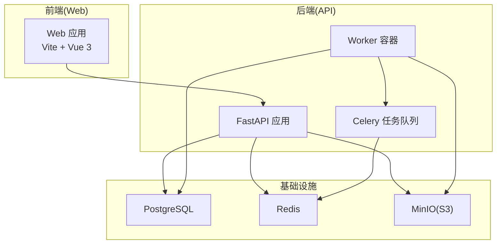
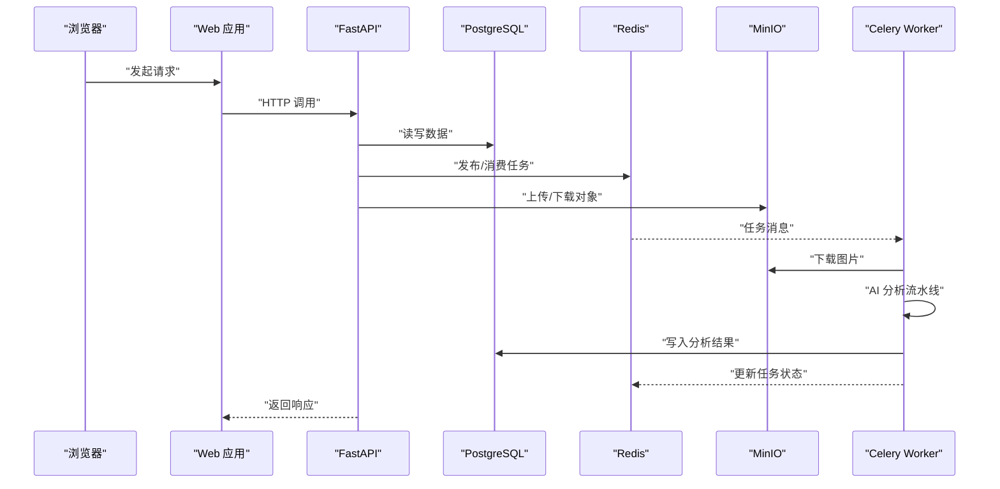
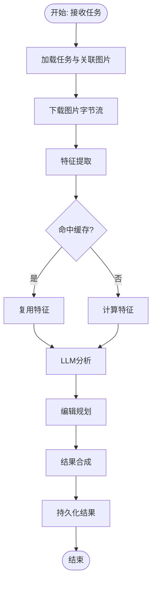
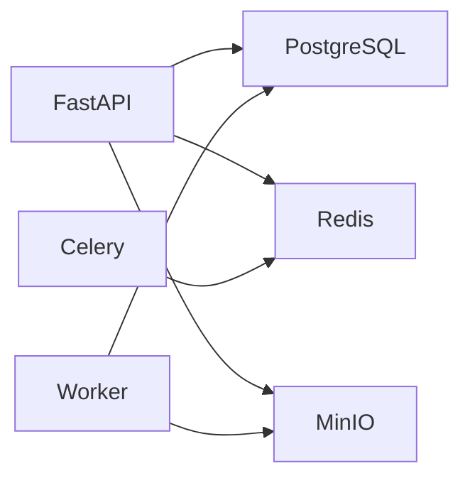

# 性能优化

<cite>
**本文引用的文件**
- [apps/api/app/main.py](file://apps/api/app/main.py)
- [apps/api/app/core/config.py](file://apps/api/app/core/config.py)
- [apps/api/app/core/database.py](file://apps/api/app/core/database.py)
- [apps/api/app/core/celery_app.py](file://apps/api/app/core/celery_app.py)
- [apps/api/app/tasks/analyze_photo.py](file://apps/api/app/tasks/analyze_photo.py)
- [apps/api/app/models/analysis_task.py](file://apps/api/app/models/analysis_task.py)
- [apps/api/app/services/storage/s3_storage.py](file://apps/api/app/services/storage/s3_storage.py)
- [apps/api/requirements.txt](file://apps/api/requirements.txt)
- [apps/api/Dockerfile](file://apps/api/Dockerfile)
- [apps/web/src/api/http.ts](file://apps/web/src/api/http.ts)
- [apps/web/vite.config.ts](file://apps/web/vite.config.ts)
- [apps/web/package.json](file://apps/web/package.json)
- [infra/docker-compose.yml](file://infra/docker-compose.yml)
</cite>

## 目录
1. [简介](#简介)
2. [项目结构](#项目结构)
3. [核心组件](#核心组件)
4. [架构总览](#架构总览)
5. [详细组件分析](#详细组件分析)
6. [依赖分析](#依赖分析)
7. [性能考虑](#性能考虑)
8. [故障排查指南](#故障排查指南)
9. [结论](#结论)
10. [附录](#附录)

## 简介
本指南面向“AI摄影教练”项目的性能优化实践，覆盖后端API、前端应用、Docker容器与基础设施、AI分析任务的性能监控与瓶颈定位、静态资源与CDN优化策略，以及数据库索引与查询性能分析工具的使用与负载/压力测试实施方案。目标是在不改变功能的前提下，系统性提升吞吐、降低延迟、增强稳定性与可维护性。

## 项目结构
项目采用多服务分层与容器化部署：
- 后端API：FastAPI + SQLAlchemy ORM + Celery异步任务队列
- AI分析流水线：特征提取、LLM分析、编辑规划、结果合成
- 存储：MinIO对象存储（S3兼容）
- 缓存与消息：Redis
- 数据库：PostgreSQL
- 前端：Vue 3 + Vite 开发与构建
- 部署：Docker Compose 组合服务

图表来源
- [apps/api/app/main.py:1-36](file://apps/api/app/main.py#L1-L36)
- [apps/api/app/core/celery_app.py:1-21](file://apps/api/app/core/celery_app.py#L1-L21)
- [apps/api/app/tasks/analyze_photo.py:1-108](file://apps/api/app/tasks/analyze_photo.py#L1-L108)
- [infra/docker-compose.yml:1-107](file://infra/docker-compose.yml#L1-L107)

章节来源
- [apps/api/app/main.py:1-36](file://apps/api/app/main.py#L1-L36)
- [apps/api/app/core/config.py:1-47](file://apps/api/app/core/config.py#L1-L47)
- [apps/api/app/core/database.py:1-51](file://apps/api/app/core/database.py#L1-L51)
- [apps/api/app/core/celery_app.py:1-21](file://apps/api/app/core/celery_app.py#L1-L21)
- [apps/api/app/tasks/analyze_photo.py:1-108](file://apps/api/app/tasks/analyze_photo.py#L1-L108)
- [apps/api/app/models/analysis_task.py:1-36](file://apps/api/app/models/analysis_task.py#L1-L36)
- [apps/api/app/services/storage/s3_storage.py:1-59](file://apps/api/app/services/storage/s3_storage.py#L1-L59)
- [apps/api/requirements.txt:1-19](file://apps/api/requirements.txt#L1-L19)
- [apps/api/Dockerfile:1-23](file://apps/api/Dockerfile#L1-L23)
- [apps/web/src/api/http.ts:1-94](file://apps/web/src/api/http.ts#L1-L94)
- [apps/web/vite.config.ts:1-26](file://apps/web/vite.config.ts#L1-L26)
- [apps/web/package.json:1-26](file://apps/web/package.json#L1-L26)
- [infra/docker-compose.yml:1-107](file://infra/docker-compose.yml#L1-L107)

## 核心组件
- 后端入口与路由：FastAPI 应用注册各模块路由，并在启动时初始化数据库。
- 数据库层：SQLAlchemy 引擎与会话工厂，启用 pre_ping；提供依赖注入获取会话。
- 异步任务：Celery 使用 Redis 作为 broker 和 backend，按队列路由分析任务。
- AI分析任务：异步执行图像特征提取、LLM分析、编辑规划与结果合成。
- 存储服务：S3 兼容客户端封装，带超时与重试配置，LRU 缓存单实例。
- 前端HTTP客户端：Axios 封装，统一注入鉴权头、401自动刷新与队列化重试。
- 配置中心：集中管理数据库、Redis、S3、CORS、JWT等配置项。
- 容器与编排：API/Worker 基于 Python slim 镜像，暴露 8000 端口；Compose 统一编排。

章节来源
- [apps/api/app/main.py:1-36](file://apps/api/app/main.py#L1-L36)
- [apps/api/app/core/database.py:1-51](file://apps/api/app/core/database.py#L1-L51)
- [apps/api/app/core/celery_app.py:1-21](file://apps/api/app/core/celery_app.py#L1-L21)
- [apps/api/app/tasks/analyze_photo.py:1-108](file://apps/api/app/tasks/analyze_photo.py#L1-L108)
- [apps/api/app/services/storage/s3_storage.py:1-59](file://apps/api/app/services/storage/s3_storage.py#L1-L59)
- [apps/api/app/core/config.py:1-47](file://apps/api/app/core/config.py#L1-L47)
- [apps/web/src/api/http.ts:1-94](file://apps/web/src/api/http.ts#L1-L94)
- [apps/api/Dockerfile:1-23](file://apps/api/Dockerfile#L1-L23)
- [infra/docker-compose.yml:1-107](file://infra/docker-compose.yml#L1-L107)

## 架构总览
后端API通过FastAPI接收请求，路由到各业务模块；数据库与Redis用于持久化与任务编排；MinIO提供对象存储；Celery Worker异步执行AI分析任务。前端通过Axios访问后端API，内置鉴权与刷新机制。

图表来源
- [apps/api/app/main.py:1-36](file://apps/api/app/main.py#L1-L36)
- [apps/api/app/core/celery_app.py:1-21](file://apps/api/app/core/celery_app.py#L1-L21)
- [apps/api/app/tasks/analyze_photo.py:1-108](file://apps/api/app/tasks/analyze_photo.py#L1-L108)
- [apps/api/app/services/storage/s3_storage.py:1-59](file://apps/api/app/services/storage/s3_storage.py#L1-L59)
- [apps/web/src/api/http.ts:1-94](file://apps/web/src/api/http.ts#L1-L94)

## 详细组件分析

### 后端API性能优化
- 连接池与会话管理
  - 使用 SQLAlchemy 引擎与 sessionmaker，启用 pre_ping 以检测并自动重建失效连接。
  - 会话 autoflush/autocommit 控制合理，避免频繁提交带来的开销。
  - 依赖注入函数确保每个请求获取独立会话并在 finally 中关闭，防止连接泄漏。
- 数据库索引与查询
  - 已在 analysis_tasks 表建立复合索引，覆盖 task_type+created_at 与 user_id+created_at、status+created_at，有利于按状态与时间范围检索。
  - 建议对高频过滤字段（如 user_id、status、created_at）进行查询路径验证，必要时补充覆盖索引。
- 缓存策略
  - S3StorageService 使用 LRU 缓存单实例，减少重复初始化成本。
  - 可结合 Redis 对热点查询结果或中间态进行短期缓存（如近期任务列表、用户画像片段）。
- 异步任务与并发
  - Celery 使用 Redis 作为 broker/backend，任务按队列路由至专用队列，避免阻塞。
  - 建议根据CPU/IO特性拆分队列（如高并发小任务与长耗时AI分析任务），并设置 worker 并发数与 prefetch 数。
- 中间件与CORS
  - 已启用 CORS 中间件，建议仅允许必要源，减少预检请求次数。
- 健康检查
  - 提供 /healthz 接口，便于探活与负载均衡健康检查。

章节来源
- [apps/api/app/core/database.py:1-51](file://apps/api/app/core/database.py#L1-L51)
- [apps/api/app/models/analysis_task.py:1-36](file://apps/api/app/models/analysis_task.py#L1-L36)
- [apps/api/app/core/celery_app.py:1-21](file://apps/api/app/core/celery_app.py#L1-L21)
- [apps/api/app/main.py:1-36](file://apps/api/app/main.py#L1-L36)
- [apps/api/app/services/storage/s3_storage.py:1-59](file://apps/api/app/services/storage/s3_storage.py#L1-L59)

### AI分析任务性能优化
- 流水线拆分
  - 特征提取、LLM分析、编辑规划、结果合成四阶段清晰，适合并行化与缓存复用。
- I/O与网络
  - 图片下载使用 S3 客户端，已设置 connect/read 超时与低重试次数，避免慢I/O拖垮整体。
  - 建议对大图进行缩略图先行校验，或在任务队列中做去重与幂等控制（idempotency_key 已存在）。
- 错误处理与可观测性
  - 任务异常回滚并记录错误码/消息，便于定位失败原因。
  - 建议增加任务耗时指标、重试次数统计与失败告警。

图表来源
- [apps/api/app/tasks/analyze_photo.py:1-108](file://apps/api/app/tasks/analyze_photo.py#L1-L108)
- [apps/api/app/services/storage/s3_storage.py:1-59](file://apps/api/app/services/storage/s3_storage.py#L1-L59)

章节来源
- [apps/api/app/tasks/analyze_photo.py:1-108](file://apps/api/app/tasks/analyze_photo.py#L1-L108)
- [apps/api/app/services/storage/s3_storage.py:1-59](file://apps/api/app/services/storage/s3_storage.py#L1-L59)

### 前端应用性能优化
- 代码分割与懒加载
  - Vue Router 支持路由级懒加载，建议将非首屏组件（如历史记录、个人资料）按需加载。
- 资源压缩与构建
  - Vite 默认启用生产构建压缩；建议开启资源内联阈值优化与按需引入第三方库。
- 网络请求优化
  - Axios 统一超时与拦截器：401自动刷新、队列化重试，避免重复请求风暴。
  - 建议对高频接口启用本地缓存（如最近任务列表）、防抖与合并请求。
- 开发代理
  - Vite 代理将 /api 与 /healthz 指向后端，开发环境无需跨域问题。

章节来源
- [apps/web/src/api/http.ts:1-94](file://apps/web/src/api/http.ts#L1-L94)
- [apps/web/vite.config.ts:1-26](file://apps/web/vite.config.ts#L1-L26)
- [apps/web/package.json:1-26](file://apps/web/package.json#L1-L26)

### Docker容器性能优化
- 镜像与运行时
  - 使用 python:3.12-slim，禁用 .pyc 与 unbuffered 输出，减小镜像体积与启动开销。
  - API 暴露 8000 端口，Worker 通过 Celery 连接 Redis 与数据库。
- 资源限制与并发
  - 建议在 Compose 中为 API/Worker 设置 CPU/内存限制与重启策略。
  - API 使用 Uvicorn 多进程/多线程模式（在容器内合理配置 workers threads），Worker 根据任务类型设置并发。
- 存储卷与I/O
  - PostgreSQL/Redis/MinIO 使用命名卷，确保数据持久化与备份恢复。
- 环境变量与安全
  - 通过 Compose 注入 DB_URL、REDIS_URL、S3_* 等，避免硬编码。

章节来源
- [apps/api/Dockerfile:1-23](file://apps/api/Dockerfile#L1-L23)
- [infra/docker-compose.yml:1-107](file://infra/docker-compose.yml#L1-L107)

### 数据库索引优化与查询分析
- 现有索引
  - analysis_tasks 表已建立 task_type+created_at、user_id+created_at、status+created_at 复合索引，有助于按状态与时间筛选。
- 查询分析建议
  - 使用 EXPLAIN/EXPLAIN ANALYZE 分析慢查询，确认索引是否被使用。
  - 对高频过滤字段（如 user_id、status、created_at）建立覆盖索引，减少回表。
  - 定期统计信息更新与表维护，避免计划器选择偏差。
- 连接池参数
  - 建议在生产环境设置合适的 pool_size、max_overflow、pool_recycle、pool_pre_ping，平衡并发与资源占用。

章节来源
- [apps/api/app/core/database.py:1-51](file://apps/api/app/core/database.py#L1-L51)
- [apps/api/app/models/analysis_task.py:1-36](file://apps/api/app/models/analysis_task.py#L1-L36)

### 静态资源优化与CDN策略
- 构建产物优化
  - Vite 生产构建默认压缩 JS/CSS/HTML；建议开启资源哈希与长期缓存策略。
- CDN接入
  - 将静态资源托管至 CDN，配置缓存头与压缩；后端API仍走原域名，避免跨域复杂度。
- 图片优化
  - 建议在上传前进行格式与尺寸优化，存储缩略图与多分辨率版本，按需加载。

章节来源
- [apps/web/vite.config.ts:1-26](file://apps/web/vite.config.ts#L1-L26)
- [apps/web/package.json:1-26](file://apps/web/package.json#L1-L26)

### 负载测试与压力测试实施方案
- 场景设计
  - 前端：模拟 N 个并发用户上传图片并轮询任务状态。
  - 后端：压测 /api/v1/analysis 与 /api/v1/images 接口，观察 P95/P99 延迟与错误率。
- 工具选择
  - 前端：Lighthouse 或 WebPageTest（页面性能）。
  - 后端：k6、JMeter 或 Locust（HTTP压测）。
  - 数据库：pgbench（PostgreSQL基准）。
- 指标监控
  - 关键指标：RPS、延迟分布、错误率、数据库锁等待、Redis队列长度、Worker处理速率。
- 执行步骤
  - 单点压测：逐步提升并发，观察拐点。
  - 端到端压测：同时放大前端并发与后端任务队列。
  - 回归对比：每次优化后重复测试，形成基线。

章节来源
- [apps/api/app/main.py:32-35](file://apps/api/app/main.py#L32-L35)
- [apps/api/app/core/celery_app.py:1-21](file://apps/api/app/core/celery_app.py#L1-L21)
- [apps/api/app/tasks/analyze_photo.py:1-108](file://apps/api/app/tasks/analyze_photo.py#L1-L108)

## 依赖分析
- 组件耦合
  - API 依赖数据库、Redis、S3；Worker 依赖 Redis 与数据库；二者通过消息队列解耦。
- 外部依赖
  - FastAPI、SQLAlchemy、Celery、Redis、PostgreSQL、MinIO、Boto3、Uvicorn。
- 潜在风险
  - 网络超时与重试策略需平衡可靠性与延迟；S3/数据库/Redis任一成为瓶颈都会影响整体性能。

图表来源
- [apps/api/app/main.py:1-36](file://apps/api/app/main.py#L1-L36)
- [apps/api/app/core/celery_app.py:1-21](file://apps/api/app/core/celery_app.py#L1-L21)
- [apps/api/app/tasks/analyze_photo.py:1-108](file://apps/api/app/tasks/analyze_photo.py#L1-L108)
- [apps/api/app/services/storage/s3_storage.py:1-59](file://apps/api/app/services/storage/s3_storage.py#L1-L59)

章节来源
- [apps/api/app/main.py:1-36](file://apps/api/app/main.py#L1-L36)
- [apps/api/app/core/celery_app.py:1-21](file://apps/api/app/core/celery_app.py#L1-L21)
- [apps/api/app/tasks/analyze_photo.py:1-108](file://apps/api/app/tasks/analyze_photo.py#L1-L108)
- [apps/api/app/services/storage/s3_storage.py:1-59](file://apps/api/app/services/storage/s3_storage.py#L1-L59)

## 性能考虑
- 后端
  - 连接池参数：pool_size、max_overflow、pre_ping、recycle，结合并发与QPS调优。
  - 任务队列：按任务类型拆分队列，设置 worker 并发与 prefetch，避免饥饿与拥塞。
  - 缓存：热点数据与中间结果缓存，降低数据库与AI推理压力。
- 前端
  - 路由懒加载、组件按需引入、构建产物压缩与缓存。
  - 请求拦截与重试策略，避免重复请求与瀑布加载。
- 基础设施
  - 容器资源限制与健康检查；数据库/Redis/MinIO性能监控与容量规划。
- AI分析
  - I/O 超时与重试上限控制；特征缓存与幂等；失败重试与告警。

## 故障排查指南
- 健康检查
  - /healthz 返回 ok 表示服务可用；若异常，检查数据库、Redis、S3连通性。
- 数据库
  - 查看慢查询日志与索引使用情况；确认连接池未耗尽。
- 任务队列
  - 检查 Redis 队列积压与 worker 是否存活；查看任务耗时与错误日志。
- 存储
  - S3 下载/上传失败通常由超时或权限导致，检查 endpoint、密钥与网络。
- 前端
  - 401自动刷新失败时，检查刷新接口与令牌有效期；确认拦截器未被循环触发。

章节来源
- [apps/api/app/main.py:32-35](file://apps/api/app/main.py#L32-L35)
- [apps/api/app/core/database.py:1-51](file://apps/api/app/core/database.py#L1-L51)
- [apps/api/app/core/celery_app.py:1-21](file://apps/api/app/core/celery_app.py#L1-L21)
- [apps/api/app/tasks/analyze_photo.py:97-107](file://apps/api/app/tasks/analyze_photo.py#L97-L107)
- [apps/api/app/services/storage/s3_storage.py:45-50](file://apps/api/app/services/storage/s3_storage.py#L45-L50)
- [apps/web/src/api/http.ts:37-91](file://apps/web/src/api/http.ts#L37-L91)

## 结论
通过合理的数据库索引、连接池参数、缓存策略、异步任务队列与容器资源限制，配合前端懒加载与网络拦截优化，以及完善的监控与压测流程，可显著提升AI摄影教练系统的整体性能与稳定性。建议以迭代方式持续优化，并基于指标与压测结果动态调整参数。

## 附录
- 快速检查清单
  - 数据库：索引覆盖、统计信息、连接池参数
  - API：CORS白名单、pre_ping、会话生命周期
  - Worker：队列拆分、并发与prefetch、错误重试
  - S3：超时与重试、桶存在性检查
  - 前端：懒加载、缓存、拦截器
  - 容器：资源限制、健康检查、卷与网络
  - 监控：RPS/延迟/错误率、队列长度、数据库锁等待