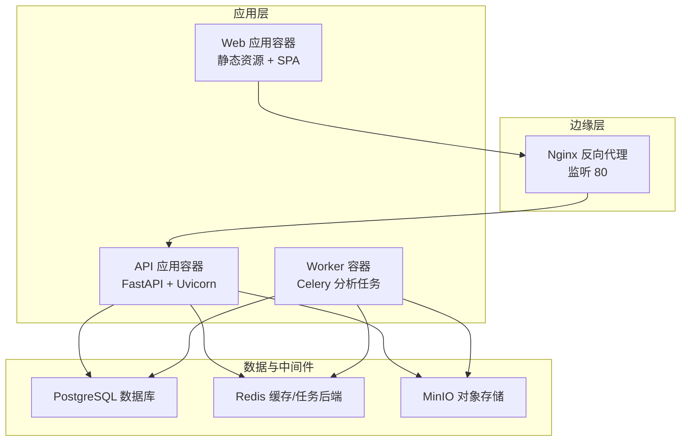
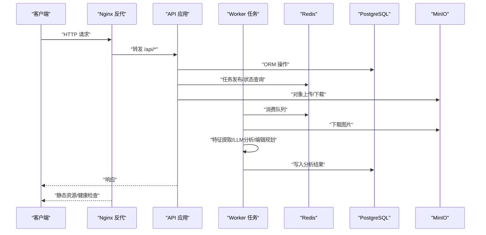
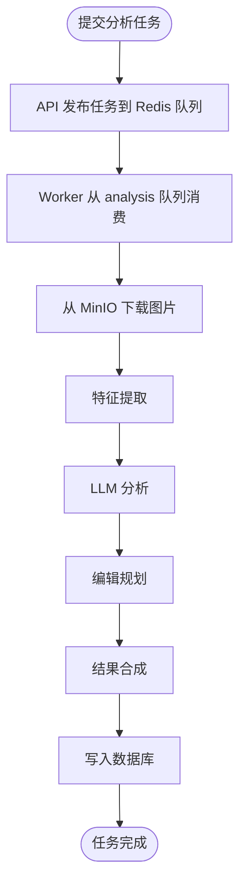
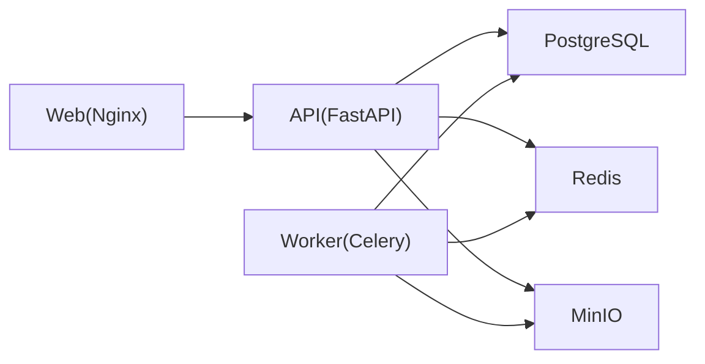

# 生产环境部署

<cite>
**本文引用的文件**
- [docker-compose.prod.yml](file://infra/docker-compose.prod.yml)
- [deploy.sh](file://infra/deploy.sh)
- [Dockerfile（API）](file://apps/api/Dockerfile)
- [Dockerfile（Worker）](file://apps/worker/Dockerfile)
- [Dockerfile（Web）](file://apps/web/Dockerfile)
- [main.py（API入口）](file://apps/api/app/main.py)
- [config.py（API配置）](file://apps/api/app/core/config.py)
- [security.py（API安全）](file://apps/api/app/core/security.py)
- [database.py（API数据库）](file://apps/api/app/core/database.py)
- [celery_app.py（API任务队列）](file://apps/api/app/core/celery_app.py)
- [analyze_photo.py（分析任务）](file://apps/api/app/tasks/analyze_photo.py)
- [default.conf（Nginx）](file://infra/nginx/default.conf)
- [requirements.txt（API依赖）](file://apps/api/requirements.txt)
- [package.json（Web依赖）](file://apps/web/package.json)
</cite>

## 目录
1. [简介](#简介)
2. [项目结构](#项目结构)
3. [核心组件](#核心组件)
4. [架构总览](#架构总览)
5. [详细组件分析](#详细组件分析)
6. [依赖关系分析](#依赖关系分析)
7. [性能考虑](#性能考虑)
8. [故障排查指南](#故障排查指南)
9. [结论](#结论)
10. [附录](#附录)

## 简介
本文件面向生产环境部署，围绕AI摄影教练项目的Docker Compose编排配置，系统性说明服务编排、环境变量配置、容器间通信、健康检查与自动重启、负载均衡与多实例策略、SSL与HTTPS、数据持久化与备份等关键主题。文档同时提供安全实践建议，涵盖密钥轮换与敏感信息保护。

## 项目结构
项目采用多服务分层架构：前端Web应用通过Nginx反向代理访问后端API；API服务负责业务逻辑与数据库交互，并通过Celery Worker执行异步分析任务；数据库使用PostgreSQL，缓存使用Redis，对象存储使用MinIO；所有服务通过Docker Compose统一编排。

图表来源
- [docker-compose.prod.yml:1-128](file://infra/docker-compose.prod.yml#L1-L128)
- [default.conf:1-30](file://infra/nginx/default.conf#L1-L30)
- [Dockerfile（API）:1-23](file://apps/api/Dockerfile#L1-L23)
- [Dockerfile（Worker）:1-20](file://apps/worker/Dockerfile#L1-L20)
- [Dockerfile（Web）:1-22](file://apps/web/Dockerfile#L1-L22)

章节来源
- [docker-compose.prod.yml:1-128](file://infra/docker-compose.prod.yml#L1-L128)
- [default.conf:1-30](file://infra/nginx/default.conf#L1-L30)

## 核心组件
- Web 应用：基于Nginx提供静态资源与SPA路由支持，通过反向代理转发/api/到后端API。
- API 应用：基于FastAPI + Uvicorn，提供REST接口、CORS配置、健康检查端点、数据库初始化与启动事件。
- Worker 应用：基于Celery，连接Redis作为消息代理与结果后端，执行图像分析任务队列。
- 数据库：PostgreSQL，使用卷持久化数据，健康检查基于pg_isready。
- 缓存：Redis，使用卷持久化，健康检查基于redis-cli ping。
- 存储：MinIO，提供S3兼容的对象存储，健康检查基于本地HTTP探测。
- 部署脚本：自动化校验环境、读取.env.prod、执行docker compose构建与后台运行。

章节来源
- [deploy.sh:1-63](file://infra/deploy.sh#L1-L63)
- [docker-compose.prod.yml:1-128](file://infra/docker-compose.prod.yml#L1-L128)
- [Dockerfile（Web）:1-22](file://apps/web/Dockerfile#L1-L22)
- [Dockerfile（API）:1-23](file://apps/api/Dockerfile#L1-L23)
- [Dockerfile（Worker）:1-20](file://apps/worker/Dockerfile#L1-L20)
- [main.py（API入口）:1-36](file://apps/api/app/main.py#L1-L36)

## 架构总览
下图展示生产环境的端到端交互流程：客户端请求经由Nginx进入，API提供REST接口与健康检查，Worker从Redis拉取任务执行分析，数据库与缓存支撑数据与会话，MinIO提供对象存储。

图表来源
- [default.conf:8-24](file://infra/nginx/default.conf#L8-L24)
- [main.py（API入口）:32-34](file://apps/api/app/main.py#L32-L34)
- [celery_app.py:1-21](file://apps/api/app/core/celery_app.py#L1-L21)
- [analyze_photo.py:19-108](file://apps/api/app/tasks/analyze_photo.py#L19-L108)

## 详细组件分析

### Web 应用（Nginx + SPA）
- 静态资源：Nginx提供dist目录静态托管，SPA路由回退至index.html。
- 反向代理：/api/前缀转发到API容器，保留Host、X-Real-IP、X-Forwarded-*等头部。
- 健康检查：内置HEALTHCHECK探测本地80端口。
- 端口映射：容器暴露80，宿主映射80:80。

章节来源
- [Dockerfile（Web）:14-22](file://apps/web/Dockerfile#L14-L22)
- [default.conf:1-30](file://infra/nginx/default.conf#L1-L30)

### API 应用（FastAPI + Uvicorn）
- 启动流程：启动事件中初始化数据库并应用增量Schema更新。
- 路由组织：按模块注册analysis、auth、images、users路由，统一前缀。
- CORS：从配置加载允许的源列表，支持凭据、通配方法与头。
- 健康检查：/healthz端点返回状态。
- 环境变量：数据库URL、Redis连接、S3端点与凭证、桶名、区域、模型名、提示版本、CORS来源等。

章节来源
- [main.py（API入口）:1-36](file://apps/api/app/main.py#L1-L36)
- [config.py（API配置）:1-47](file://apps/api/app/core/config.py#L1-L47)
- [database.py（API数据库）:21-51](file://apps/api/app/core/database.py#L21-L51)

### Worker 应用（Celery）
- 任务定义：run_analysis_task从数据库读取任务，调用存储下载图片，依次执行特征提取、LLM分析、编辑规划与结果合成，最终写回数据库。
- 队列路由：任务名称映射到analysis队列。
- 运行参数：以worker模式运行，绑定analysis队列，日志级别info。
- 依赖：与API共享相同的依赖安装脚本。

章节来源
- [celery_app.py:1-21](file://apps/api/app/core/celery_app.py#L1-L21)
- [analyze_photo.py:19-108](file://apps/api/app/tasks/analyze_photo.py#L19-L108)
- [Dockerfile（Worker）:1-20](file://apps/worker/Dockerfile#L1-L20)

### 数据库（PostgreSQL）
- 卷：pg_data持久化数据目录。
- 健康检查：使用pg_isready探测当前用户与数据库。
- 连接：API与Worker均通过环境变量中的DB_URL连接。

章节来源
- [docker-compose.prod.yml:16-30](file://infra/docker-compose.prod.yml#L16-L30)
- [config.py（API配置）:13](file://apps/api/app/core/config.py#L13)
- [database.py（API数据库）:9](file://apps/api/app/core/database.py#L9)

### 缓存（Redis）
- 卷：redis_data持久化。
- 健康检查：redis-cli ping。
- 连接：API与Worker通过REDIS_URL连接。

章节来源
- [docker-compose.prod.yml:32-42](file://infra/docker-compose.prod.yml#L32-L42)
- [config.py（API配置）:14](file://apps/api/app/core/config.py#L14)
- [celery_app.py:7-8](file://apps/api/app/core/celery_app.py#L7-L8)

### 对象存储（MinIO）
- 命令：以server命令启动，控制台端口9001。
- 健康检查：curl探测/minio/health/live。
- 连接：API与Worker通过S3_ENDPOINT、S3_ACCESS_KEY、S3_SECRET_KEY、S3_BUCKET、S3_REGION连接。

章节来源
- [docker-compose.prod.yml:44-58](file://infra/docker-compose.prod.yml#L44-L58)
- [config.py（API配置）:16-20](file://apps/api/app/core/config.py#L16-L20)

### 容器间通信
- 内部网络：各服务通过服务名互联（如api:8000、redis:6379、minio:9000）。
- 反向代理：Nginx将/api/转发到api:8000，/healthz转发到api:8000/healthz。
- 环境变量：API与Worker通过环境变量注入DB_URL、REDIS_URL、S3_*等。

章节来源
- [docker-compose.prod.yml:67-122](file://infra/docker-compose.prod.yml#L67-L122)
- [default.conf:8-24](file://infra/nginx/default.conf#L8-L24)

### 健康检查与自动重启
- PostgreSQL：pg_isready探测，间隔10s，超时5s，重试5次。
- Redis：redis-cli ping探测，间隔10s，超时5s，重试5次。
- MinIO：curl探测本地存活接口，间隔10s，超时5s，重试5次。
- API：内部/healthz端点探测，间隔15s，超时5s，重试5次。
- Web：Nginx内置HEALTHCHECK探测本地80端口。
- 重启策略：unless-stopped，确保非人为停止时自动恢复。

章节来源
- [docker-compose.prod.yml:25-96](file://infra/docker-compose.prod.yml#L25-L96)
- [Dockerfile（Web）:21](file://apps/web/Dockerfile#L21)

### 任务队列与异步处理

图表来源
- [celery_app.py:12-19](file://apps/api/app/core/celery_app.py#L12-L19)
- [analyze_photo.py:19-108](file://apps/api/app/tasks/analyze_photo.py#L19-L108)

## 依赖关系分析
- 组件耦合：API与Worker共享配置（DB_URL、REDIS_URL、S3_*），通过Redis解耦异步任务；Web仅依赖Nginx与API。
- 外部依赖：PostgreSQL、Redis、MinIO均为独立服务，通过环境变量注入。
- 接口契约：API提供REST接口与/healthz；Web通过Nginx代理/api/；Worker通过Celery队列消费任务。

图表来源
- [docker-compose.prod.yml:1-128](file://infra/docker-compose.prod.yml#L1-L128)
- [default.conf:8-24](file://infra/nginx/default.conf#L8-L24)

章节来源
- [docker-compose.prod.yml:1-128](file://infra/docker-compose.prod.yml#L1-L128)

## 性能考虑
- 连接池与预热：数据库引擎启用pool_pre_ping，降低连接失效导致的异常。
- 队列隔离：分析任务单独队列，避免阻塞其他任务类型。
- 缓存命中：Redis用于任务状态与会话，减少数据库压力。
- 存储优化：MinIO作为就近对象存储，降低跨地域延迟。
- 并发与资源：根据CPU与内存情况调整Worker并发数与API进程数（可通过外部编排工具扩展）。

章节来源
- [database.py（API数据库）:9](file://apps/api/app/core/database.py#L9)
- [celery_app.py:16-18](file://apps/api/app/core/celery_app.py#L16-L18)

## 故障排查指南
- 健康检查失败
  - 使用docker compose ps查看服务状态。
  - 查看API健康端点：/healthz。
  - 检查数据库、缓存、存储的健康检查输出。
- 日志定位
  - API日志：docker compose logs api --tail 100。
  - Web日志：docker compose logs web --tail 100。
- 环境变量缺失
  - 部署脚本会校验SERVER_IP、POSTGRES_*、S3_*、S3_BUCKET等必需项。
- 任务失败
  - Worker异常会回滚并记录错误码与消息，可在数据库中查看分析任务状态与错误详情。

章节来源
- [deploy.sh:35-62](file://infra/deploy.sh#L35-L62)
- [docker-compose.prod.yml:85-96](file://infra/docker-compose.prod.yml#L85-L96)
- [analyze_photo.py:97-107](file://apps/api/app/tasks/analyze_photo.py#L97-L107)

## 结论
该生产部署方案以Docker Compose实现服务编排，结合Nginx反向代理、FastAPI API、Celery Worker、PostgreSQL、Redis与MinIO，形成完整的端到端链路。通过健康检查与自动重启保障可用性，通过环境变量集中管理配置，满足生产级可维护性与可扩展性需求。后续可在此基础上引入负载均衡、HTTPS与多实例扩缩容策略。

## 附录

### A. 环境变量与安全配置
- 必填项（部署脚本校验）
  - SERVER_IP：对外访问域名或IP。
  - POSTGRES_USER、POSTGRES_PASSWORD、POSTGRES_DB：数据库认证与库名。
  - S3_ACCESS_KEY、S3_SECRET_KEY、S3_BUCKET：对象存储凭证与桶名。
- 其他常用项
  - S3_ENDPOINT、S3_REGION：对象存储端点与区域。
  - DB_URL、REDIS_URL：数据库与缓存连接串。
  - MODEL_NAME、PROMPT_VERSION：模型与提示版本。
  - CORS_ORIGINS：允许的前端源列表。
- 安全建议
  - 密钥轮换：定期轮换S3与数据库密码，更新环境变量后滚动重启相关容器。
  - 敏感信息保护：使用平台机密管理（如KMS/Secrets Manager）注入，避免硬编码在仓库中。
  - 最小权限：为S3与数据库授予最小必要权限。

章节来源
- [deploy.sh:35-42](file://infra/deploy.sh#L35-L42)
- [docker-compose.prod.yml:67-114](file://infra/docker-compose.prod.yml#L67-L114)
- [config.py（API配置）:13-38](file://apps/api/app/core/config.py#L13-L38)

### B. 负载均衡与多实例部署
- 当前编排：单实例部署，便于调试与运维。
- 扩展策略（概念性说明）
  - API与Worker：通过外部编排工具（如Kubernetes）横向扩展副本数，配合Redis集群与高可用数据库。
  - Web：可多实例部署并结合Nginx上游配置实现负载均衡。
  - MinIO：可部署分布式集群以提升吞吐与可靠性。
- 注意事项
  - 确保共享状态（如任务队列、会话）具备幂等性与一致性。
  - 使用只读副本或连接池参数优化数据库读写分离。

[本节为概念性内容，不直接对应具体源文件]

### C. SSL证书与HTTPS设置
- 当前配置：Nginx监听80，未启用TLS。
- 实施步骤（概念性说明）
  - 获取证书：通过ACME（Let’s Encrypt）或商业CA签发。
  - 配置Nginx：添加listen 443 ssl与证书路径，启用HSTS与安全头。
  - 强制跳转：将HTTP请求重定向至HTTPS。
  - API与Worker：保持内部通信不变，仅对外暴露HTTPS。
- 安全加固
  - 仅开放必要端口（如443），关闭不必要的80。
  - 使用强密码套件与TLS版本策略。

[本节为概念性内容，不直接对应具体源文件]

### D. 数据持久化与备份策略
- 卷与挂载
  - PostgreSQL：pg_data卷持久化数据目录。
  - Redis：redis_data卷持久化。
  - MinIO：minio_data卷持久化对象数据。
- 备份建议（概念性说明）
  - 数据库：定期逻辑导出（如pg_dump）与物理快照结合。
  - 缓存：Redis持久化策略（RDB/AOF）与周期性备份。
  - 对象存储：开启版本控制与生命周期规则，定期归档冷数据。
- 恢复演练
  - 制定恢复时间目标（RTO）与恢复点目标（RPO），定期演练恢复流程。

章节来源
- [docker-compose.prod.yml:124-128](file://infra/docker-compose.prod.yml#L124-L128)

### E. 部署流程与运维命令
- 部署命令
  - docker compose --env-file infra/.env.prod -f infra/docker-compose.prod.yml up --build -d
- 常用运维
  - 查看状态：docker compose ps
  - 查看日志：docker compose logs api/web --tail 100
  - 重启服务：docker compose restart api/worker/db/cache/storage/web
  - 进入容器：docker compose exec api bash

章节来源
- [deploy.sh:47-62](file://infra/deploy.sh#L47-L62)