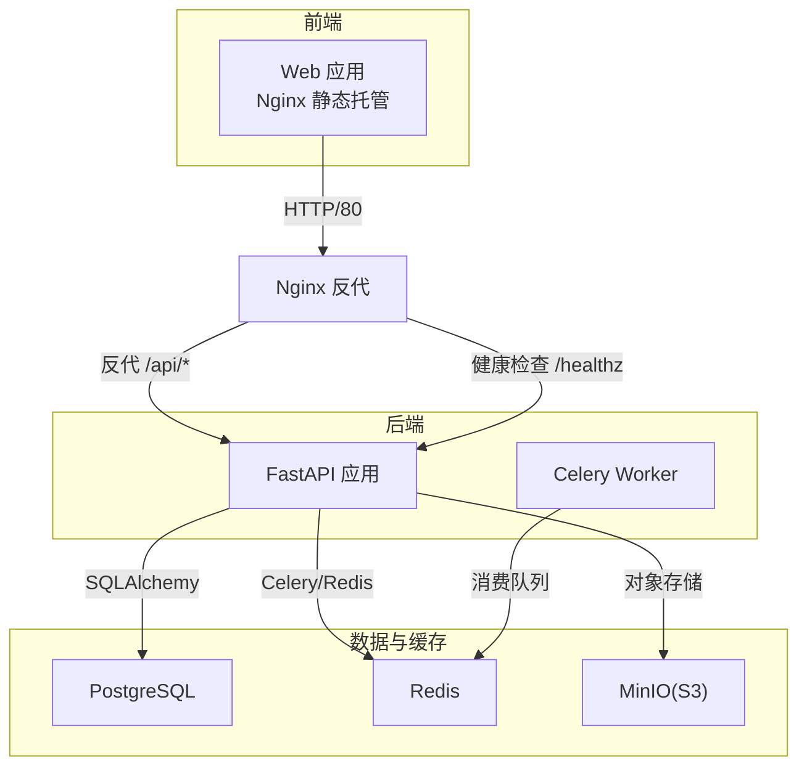
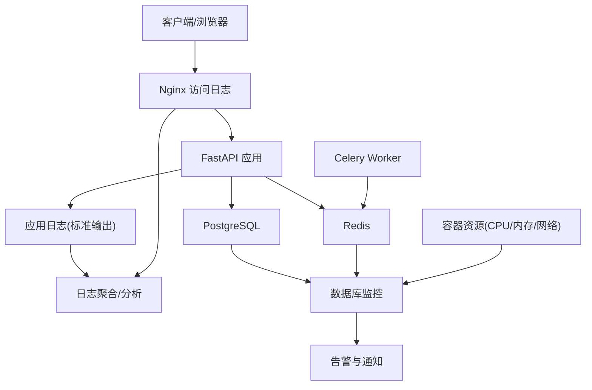
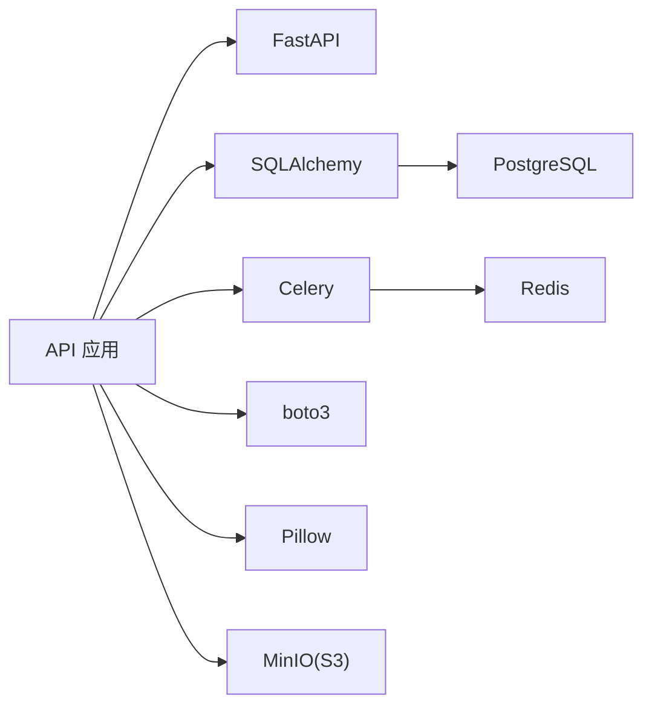

# 监控与日志

<cite>
**本文引用的文件**
- [apps/api/app/main.py](file://apps/api/app/main.py)
- [apps/api/app/core/config.py](file://apps/api/app/core/config.py)
- [apps/api/app/core/database.py](file://apps/api/app/core/database.py)
- [apps/api/app/core/celery_app.py](file://apps/api/app/core/celery_app.py)
- [apps/api/app/tasks/analyze_photo.py](file://apps/api/app/tasks/analyze_photo.py)
- [apps/api/requirements.txt](file://apps/api/requirements.txt)
- [apps/api/Dockerfile](file://apps/api/Dockerfile)
- [apps/web/Dockerfile](file://apps/web/Dockerfile)
- [infra/nginx/default.conf](file://infra/nginx/default.conf)
- [infra/docker-compose.yml](file://infra/docker-compose.yml)
- [infra/docker-compose.prod.yml](file://infra/docker-compose.prod.yml)
- [infra/deploy.sh](file://infra/deploy.sh)
- [docs/architecture-v2.md](file://docs/architecture-v2.md)
- [openspec/changes/add-user-auth/specs/user-auth/spec.md](file://openspec/changes/add-user-auth/specs/user-auth/spec.md)
</cite>

## 目录
1. [简介](#简介)
2. [项目结构](#项目结构)
3. [核心组件](#核心组件)
4. [架构总览](#架构总览)
5. [详细组件分析](#详细组件分析)
6. [依赖分析](#依赖分析)
7. [性能考虑](#性能考虑)
8. [故障排查指南](#故障排查指南)
9. [结论](#结论)
10. [附录](#附录)

## 简介
本文件面向“AI摄影教练”项目的监控与日志管理，目标是：
- 明确应用日志配置（结构化日志、日志级别、日志轮转）
- 记录 Nginx 访问与错误日志配置
- 提供关键性能指标（KPI）监控方案（API 响应时间、数据库连接数、Redis 队列长度、存储使用率）
- 容器资源监控（CPU、内存、网络）
- 错误追踪与异常上报机制
- 告警规则与通知渠道配置思路
- 日志聚合与分析工具集成方案

当前仓库中未发现内置的日志框架配置与监控组件，因此本文件提供基于现有代码与部署结构的落地建议与最佳实践。

## 项目结构
项目采用多服务编排，包含 Web 前端、API 后端、Worker、PostgreSQL、Redis、MinIO。Nginx 作为反向代理与静态资源服务。

图表来源
- [infra/docker-compose.prod.yml:1-128](file://infra/docker-compose.prod.yml#L1-L128)
- [apps/web/Dockerfile:1-21](file://apps/web/Dockerfile#L1-L21)
- [apps/api/Dockerfile:1-23](file://apps/api/Dockerfile#L1-L23)
- [apps/api/app/main.py:1-36](file://apps/api/app/main.py#L1-L36)
- [apps/api/app/core/celery_app.py:1-21](file://apps/api/app/core/celery_app.py#L1-L21)
- [apps/api/app/core/database.py:1-51](file://apps/api/app/core/database.py#L1-L51)

章节来源
- [infra/docker-compose.prod.yml:1-128](file://infra/docker-compose.prod.yml#L1-L128)
- [apps/web/Dockerfile:1-21](file://apps/web/Dockerfile#L1-L21)
- [apps/api/Dockerfile:1-23](file://apps/api/Dockerfile#L1-L23)
- [apps/api/app/main.py:1-36](file://apps/api/app/main.py#L1-L36)

## 核心组件
- 应用入口与健康检查：后端提供 /healthz 健康探针，便于容器编排与负载均衡探测。
- 数据库连接池：使用 SQLAlchemy 创建带 pool_pre_ping 的连接，提升连接可用性。
- 异步任务：Celery 使用 Redis 作为消息中间件与结果后端，任务路由到 analysis 队列。
- 反向代理：Nginx 将 /api/* 转发至 API 服务，并透传真实 IP、协议等头部。
- 生产编排：docker-compose.prod.yml 统一定义服务、环境变量、健康检查与重启策略。

章节来源
- [apps/api/app/main.py:32-35](file://apps/api/app/main.py#L32-L35)
- [apps/api/app/core/database.py:9-10](file://apps/api/app/core/database.py#L9-L10)
- [apps/api/app/core/celery_app.py:5-19](file://apps/api/app/core/celery_app.py#L5-L19)
- [infra/nginx/default.conf:1-30](file://infra/nginx/default.conf#L1-L30)
- [infra/docker-compose.prod.yml:85-96](file://infra/docker-compose.prod.yml#L85-L96)

## 架构总览
下图展示日志与监控在整体架构中的位置与流向。

图表来源
- [apps/api/app/main.py:1-36](file://apps/api/app/main.py#L1-L36)
- [apps/api/app/core/database.py:1-51](file://apps/api/app/core/database.py#L1-L51)
- [apps/api/app/core/celery_app.py:1-21](file://apps/api/app/core/celery_app.py#L1-L21)
- [infra/nginx/default.conf:1-30](file://infra/nginx/default.conf#L1-L30)
- [infra/docker-compose.prod.yml:1-128](file://infra/docker-compose.prod.yml#L1-L128)

## 详细组件分析

### 应用日志与结构化
- 当前实现：后端通过 Uvicorn 在容器内直接启动，标准输出即应用日志；未见专用日志库配置。
- 建议：
  - 使用结构化日志（JSON）输出，包含时间戳、级别、模块、消息、trace_id、request_id、用户ID、任务ID等上下文键。
  - 设置日志级别：开发环境 info，生产环境 warn 或更高；对异常捕获与审计敏感路径使用 debug。
  - 日志轮转：结合容器日志驱动（如 journald/fluent-bit）或外部采集（Filebeat/Fluent Bit）进行轮转与归档。
  - 采样与脱敏：对高频接口与敏感字段（如密码、令牌）进行脱敏与采样。

章节来源
- [apps/api/Dockerfile:20-23](file://apps/api/Dockerfile#L20-L23)
- [apps/api/requirements.txt:1-19](file://apps/api/requirements.txt#L1-L19)

### Nginx 访问与错误日志
- 访问日志：默认由 Nginx 输出到标准输出，容器日志收集即可。
- 错误日志：同样由 Nginx 输出到标准错误，便于统一采集。
- 建议：
  - 在 Nginx 中开启自定义日志格式，包含客户端 IP、请求方法、URI、状态码、响应大小、上游响应时间、用户代理等。
  - 结合容器日志驱动进行轮转与持久化。

章节来源
- [apps/web/Dockerfile:14-21](file://apps/web/Dockerfile#L14-L21)
- [infra/nginx/default.conf:1-30](file://infra/nginx/default.conf#L1-L30)

### 关键性能指标（KPI）
- API 响应时间
  - 指标：P50/P90/P95 响应时间、吞吐（req/sec）、错误率（5xx/429）。
  - 来源：Nginx 访问日志（上游响应时间）、应用日志（业务耗时）。
  - 建议：在 API 中埋点请求开始/结束时间，输出结构化日志，结合指标系统（Prometheus/Grafana）可视化。
- 数据库连接数
  - 指标：活跃连接数、等待连接数、连接池命中率。
  - 来源：PostgreSQL 统计视图与 SQLAlchemy 连接池状态。
  - 建议：监控连接池上限、超时与泄漏；优化查询与索引。
- Redis 队列长度
  - 指标：analysis 队列长度、任务积压、失败任务数。
  - 来源：Redis INFO/KEYS/SCAN 与任务状态表。
  - 建议：动态扩缩容 Worker，设置最大重试与死信队列。
- 存储使用率
  - 指标：PostgreSQL 卷使用率、Redis 数据集大小、MinIO 存储容量与对象数量。
  - 建议：定期清理历史数据与临时文件，设置配额与告警阈值。

章节来源
- [apps/api/app/core/database.py:9-10](file://apps/api/app/core/database.py#L9-L10)
- [apps/api/app/core/celery_app.py:16-18](file://apps/api/app/core/celery_app.py#L16-L18)
- [infra/docker-compose.prod.yml:16-122](file://infra/docker-compose.prod.yml#L16-L122)

### 容器资源监控
- CPU：容器 CPU 使用率、限制与饱和度。
- 内存：RSS、缓存、限制与 OOM 触发次数。
- 网络：每秒接收/发送字节数、连接数。
- 建议：使用 cAdvisor/Prometheus/Grafana 统一采集；结合 K8s/Compose 的健康检查与重启策略。

章节来源
- [infra/docker-compose.prod.yml:85-96](file://infra/docker-compose.prod.yml#L85-L96)
- [infra/docker-compose.yml:13-17](file://infra/docker-compose.yml#L13-L17)

### 错误追踪与异常报告
- 当前实现：任务执行异常会写入任务表的 error_code 与 error_message 字段，便于查询与审计。
- 建议：
  - 在应用层捕获异常并记录结构化日志，包含堆栈摘要、上下文参数、重试次数。
  - 集成 Sentry/LogRocket/Loki+Grafana 等平台，实现异常聚合、告警与回溯。
  - 对外部依赖（LLM/CV/存储）增加超时与熔断策略。

章节来源
- [apps/api/app/tasks/analyze_photo.py:97-107](file://apps/api/app/tasks/analyze_photo.py#L97-L107)
- [docs/architecture-v2.md:149-177](file://docs/architecture-v2.md#L149-L177)

### 健康检查与可用性
- API 健康检查：/healthz 返回简单状态，便于编排系统探测。
- 建议：在 Nginx 与 API 之间增加更细粒度的就绪/存活探针，区分“可接受请求”与“可处理业务”。

章节来源
- [apps/api/app/main.py:32-35](file://apps/api/app/main.py#L32-L35)
- [infra/docker-compose.prod.yml:85-96](file://infra/docker-compose.prod.yml#L85-L96)
- [infra/nginx/default.conf:17-24](file://infra/nginx/default.conf#L17-L24)

### 日志聚合与分析（集成方案）
- 方案一：容器日志直采
  - 使用 Fluent Bit/Journald/Filebeat 收集 stdout/stderr，转发至 Loki/ELK/BigQuery/Cloud Logging。
- 方案二：集中式日志
  - 在应用中输出 JSON 至 stdout，由 Docker/Compose/K8s 驱动收集，再送入日志平台。
- 建议：
  - 统一日志标签：服务名、版本、环境、实例 ID。
  - 查询与仪表板：按接口、用户、任务、错误类型分组分析。

章节来源
- [apps/api/Dockerfile:6-7](file://apps/api/Dockerfile#L6-L7)
- [apps/web/Dockerfile:14-21](file://apps/web/Dockerfile#L14-L21)

## 依赖分析
- 应用依赖
  - FastAPI/Uvicorn：Web 框架与 ASGI 服务器
  - SQLAlchemy/psycopg：数据库 ORM 与驱动
  - Celery/Redis：异步任务与队列
  - boto3/Pillow：对象存储与图像处理
- 运行时依赖
  - PostgreSQL、Redis、MinIO 通过 Compose 管理，提供健康检查与重启策略

图表来源
- [apps/api/requirements.txt:1-19](file://apps/api/requirements.txt#L1-L19)
- [apps/api/app/core/database.py:1-51](file://apps/api/app/core/database.py#L1-L51)
- [apps/api/app/core/celery_app.py:1-21](file://apps/api/app/core/celery_app.py#L1-L21)

章节来源
- [apps/api/requirements.txt:1-19](file://apps/api/requirements.txt#L1-L19)
- [apps/api/app/core/database.py:1-51](file://apps/api/app/core/database.py#L1-L51)
- [apps/api/app/core/celery_app.py:1-21](file://apps/api/app/core/celery_app.py#L1-L21)

## 性能考虑
- 连接池与并发
  - 使用 pool_pre_ping 降低连接失效导致的错误；合理设置连接池大小与超时。
- 队列与任务
  - 为高优先级任务设置独立队列；限制最大重试次数与失败回调。
- 存储与 I/O
  - 对大文件下载/上传增加进度与超时；对热点数据增加缓存。
- 网络与代理
  - Nginx 透传真实 IP 与协议，便于日志与审计；启用 Gzip/缓存静态资源。

章节来源
- [apps/api/app/core/database.py:9-10](file://apps/api/app/core/database.py#L9-L10)
- [apps/api/app/core/celery_app.py:16-18](file://apps/api/app/core/celery_app.py#L16-L18)
- [infra/nginx/default.conf:11-14](file://infra/nginx/default.conf#L11-L14)

## 故障排查指南
- 常见问题定位
  - API 无法访问：检查 /healthz、Nginx 反代配置与后端端口映射。
  - 任务不执行：确认 Redis 可达、队列名称一致、Worker 正常运行。
  - 数据库连接失败：检查连接字符串、网络连通性、卷挂载与权限。
  - 存储上传失败：核对 S3 端点、密钥、桶名与跨域配置。
- 日志与命令
  - 使用部署脚本提供的日志查看命令，快速定位最近问题。
  - 生产环境建议启用结构化日志与集中式日志平台。

章节来源
- [infra/deploy.sh:57-58](file://infra/deploy.sh#L57-L58)
- [infra/docker-compose.prod.yml:85-96](file://infra/docker-compose.prod.yml#L85-L96)
- [apps/api/app/main.py:32-35](file://apps/api/app/main.py#L32-L35)

## 结论
本项目当前未内置日志与监控组件，但基于现有 FastAPI、Nginx、Docker Compose 与 Celery/Redis 架构，可快速落地结构化日志、KPI 指标、容器资源与错误追踪体系。建议优先完成以下工作：
- 在应用中启用结构化日志与上下文键
- 配置 Nginx 自定义日志格式并接入日志平台
- 建立 KPI 指标采集与可视化看板
- 完善健康检查与告警规则
- 集成错误追踪与异常上报

## 附录

### 建议的监控与日志配置清单
- 应用日志
  - 输出格式：JSON（含时间戳、级别、模块、trace_id、请求ID、用户ID、任务ID、消息）
  - 日志级别：开发 info，生产 warn 或更高
  - 轮转：容器日志驱动或 Filebeat/Fluent Bit
- Nginx 日志
  - 访问日志：包含客户端 IP、方法、URI、状态码、响应大小、上游响应时间、UA
  - 错误日志：标准错误输出，统一采集
- KPI 指标
  - API：P50/P90/P95、吞吐、错误率
  - 数据库：连接数、等待、命中率
  - Redis：队列长度、任务积压、失败数
  - 存储：容量、对象数、I/O
- 容器资源
  - CPU、内存、网络收发速率
- 健康检查
  - /healthz 与细粒度就绪/存活探针
- 告警与通知
  - 阈值告警、趋势告警、异常聚合与通知渠道（邮件/IM/短信）