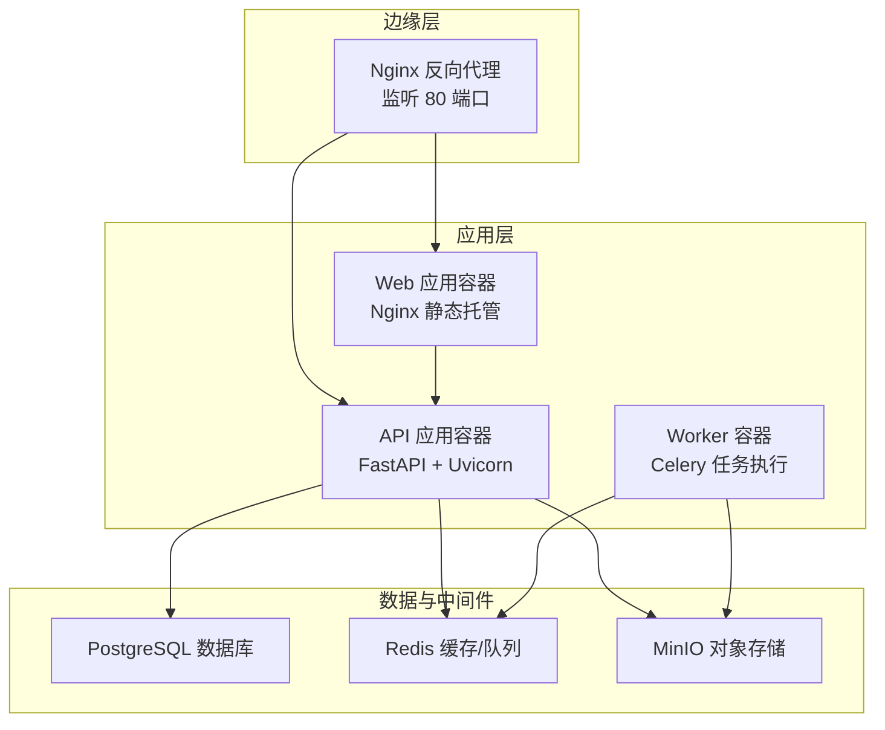
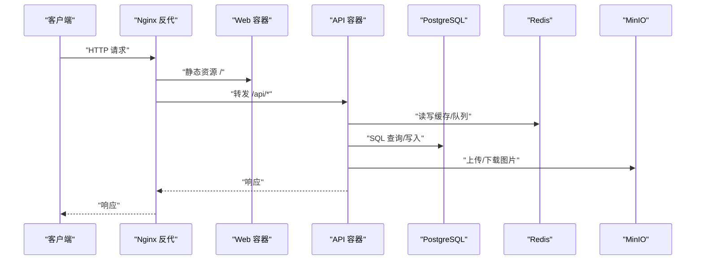
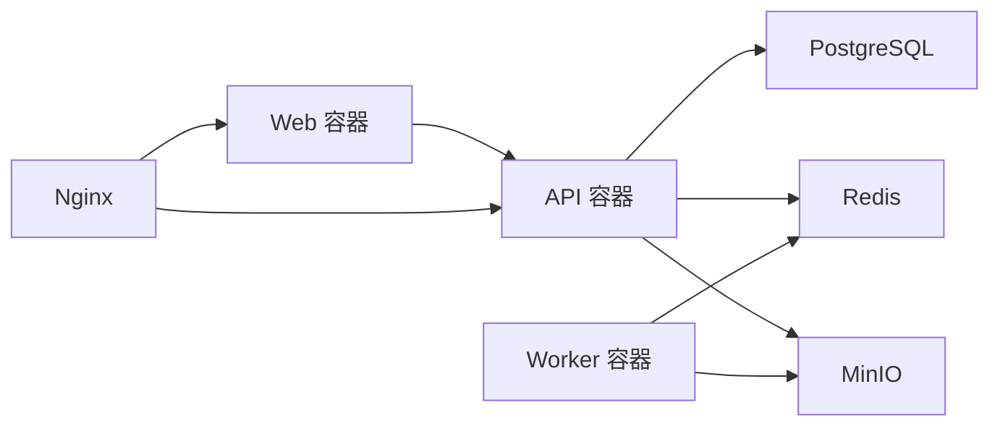

# 部署与运维

<cite>
**本文引用的文件**
- [docker-compose.prod.yml](file://infra/docker-compose.prod.yml)
- [default.conf](file://infra/nginx/default.conf)
- [config.py](file://apps/api/app/core/config.py)
- [main.py](file://apps/api/app/main.py)
- [requirements.txt](file://apps/api/requirements.txt)
- [Dockerfile（API）](file://apps/api/Dockerfile)
- [Dockerfile（Web）](file://apps/web/Dockerfile)
- [database.py](file://apps/api/app/core/database.py)
- [celery_app.py](file://apps/api/app/core/celery_app.py)
- [analyze_photo.py](file://apps/api/app/tasks/analyze_photo.py)
- [security.py](file://apps/api/app/core/security.py)
- [deps.py](file://apps/api/app/deps.py)
- [service.py（认证）](file://apps/api/app/modules/auth/service.py)
- [s3_storage.py](file://apps/api/app/services/storage/s3_storage.py)
</cite>

## 目录
1. [简介](#简介)
2. [项目结构](#项目结构)
3. [核心组件](#核心组件)
4. [架构总览](#架构总览)
5. [详细组件分析](#详细组件分析)
6. [依赖分析](#依赖分析)
7. [性能考虑](#性能考虑)
8. [故障排查指南](#故障排查指南)
9. [结论](#结论)
10. [附录](#附录)

## 简介
本文件面向AI摄影教练项目的生产环境部署与运维，覆盖以下主题：
- 生产环境部署流程与容器编排（Docker Compose）
- Nginx反向代理与静态资源服务
- 环境变量与敏感信息管理最佳实践
- 应用日志、访问日志与错误日志的采集与管理
- 性能监控指标与告警建议
- 负载均衡与高可用部署策略
- 备份与灾难恢复计划
- 安全加固与漏洞扫描实施指南
- 运维自动化与CI/CD流水线配置思路

## 项目结构
本项目采用多容器微服务架构，包含前端Web应用、API服务、任务队列Worker、数据库、缓存与对象存储等组件。生产部署通过Docker Compose统一编排，Nginx作为反向代理与静态资源服务器。

图表来源
- [docker-compose.prod.yml:1-128](file://infra/docker-compose.prod.yml#L1-L128)
- [default.conf:1-30](file://infra/nginx/default.conf#L1-L30)

章节来源
- [docker-compose.prod.yml:1-128](file://infra/docker-compose.prod.yml#L1-L128)
- [default.conf:1-30](file://infra/nginx/default.conf#L1-L30)

## 核心组件
- Web 应用容器：基于 Nginx 提供静态资源服务，并通过 Nginx 将 /api 请求转发至 API 容器；内置健康检查。
- API 应用容器：基于 FastAPI + Uvicorn，提供鉴权、图像上传、分析任务调度等接口；内置健康检查端点。
- Worker 容器：基于 Celery 执行异步分析任务，连接 Redis 作为消息代理与结果后端。
- 数据库：PostgreSQL，持久化用户、图片资产、分析任务与结果等元数据。
- 缓存与队列：Redis，用于会话状态、令牌刷新与任务队列。
- 对象存储：MinIO，兼容 S3 协议，存储原始图片与分析结果。

章节来源
- [Dockerfile（Web）:1-22](file://apps/web/Dockerfile#L1-L22)
- [Dockerfile（API）:1-23](file://apps/api/Dockerfile#L1-L23)
- [docker-compose.prod.yml:1-128](file://infra/docker-compose.prod.yml#L1-L128)
- [celery_app.py:1-21](file://apps/api/app/core/celery_app.py#L1-L21)

## 架构总览
下图展示生产环境的请求流与组件交互：

图表来源
- [default.conf:8-28](file://infra/nginx/default.conf#L8-L28)
- [docker-compose.prod.yml:60-96](file://infra/docker-compose.prod.yml#L60-L96)
- [main.py:32-35](file://apps/api/app/main.py#L32-L35)

## 详细组件分析

### Web 应用容器（Nginx 静态托管）
- 使用多阶段构建：第一阶段安装依赖并打包前端，第二阶段以 Nginx 发布静态资源。
- Nginx 配置将 /api 前缀转发至 API 容器，根路径由 Nginx 提供单页应用静态文件。
- 内置健康检查，定期探测本地 / 路径可用性。

章节来源
- [Dockerfile（Web）:1-22](file://apps/web/Dockerfile#L1-L22)
- [default.conf:1-30](file://infra/nginx/default.conf#L1-L30)

### API 应用容器（FastAPI + Uvicorn）
- 启动时初始化数据库表结构与增量迁移。
- 提供 /healthz 健康检查端点。
- 支持 CORS，允许跨域访问。
- 依赖项包括 SQLAlchemy、Celery、Redis、Boto3（S3）、Pydantic Settings 等。

章节来源
- [main.py:1-36](file://apps/api/app/main.py#L1-L36)
- [database.py:21-51](file://apps/api/app/core/database.py#L21-L51)
- [requirements.txt:1-19](file://apps/api/requirements.txt#L1-L19)
- [Dockerfile（API）:1-23](file://apps/api/Dockerfile#L1-L23)

### Worker 容器（Celery 异步任务）
- 任务路由到 analysis 队列，执行图片特征提取、LLM 分析、编辑规划与结果合成。
- 任务失败时记录错误码与简短错误信息，便于排障。
- 与 Redis 共享 broker 与 backend。

章节来源
- [celery_app.py:1-21](file://apps/api/app/core/celery_app.py#L1-L21)
- [analyze_photo.py:1-108](file://apps/api/app/tasks/analyze_photo.py#L1-L108)

### 数据库（PostgreSQL）
- 初始化时创建基础表并执行增量迁移语句，确保字段与索引存在。
- 连接池启用 pre_ping，提升连接稳定性。

章节来源
- [database.py:21-51](file://apps/api/app/core/database.py#L21-L51)

### 缓存与队列（Redis）
- 作为 Celery 的 broker 与 backend，支持任务状态跟踪。
- 健康检查通过 ping 探测。

章节来源
- [celery_app.py:5-19](file://apps/api/app/core/celery_app.py#L5-L19)
- [docker-compose.prod.yml:32-42](file://infra/docker-compose.prod.yml#L32-L42)

### 对象存储（MinIO）
- 兼容 S3 协议，封装上传/下载/桶存在性校验。
- 通过 LRU 缓存复用客户端实例。

章节来源
- [s3_storage.py:1-59](file://apps/api/app/services/storage/s3_storage.py#L1-L59)
- [docker-compose.prod.yml:44-58](file://infra/docker-compose.prod.yml#L44-L58)

### 鉴权与安全
- JWT 密钥、算法、过期时间可配置；提供密码哈希与校验。
- 依赖注入获取当前用户，未认证或失效将返回 401。
- 认证服务支持注册、登录、刷新、邮箱验证与密码重置流程。

章节来源
- [security.py:1-72](file://apps/api/app/core/security.py#L1-L72)
- [deps.py:15-41](file://apps/api/app/deps.py#L15-L41)
- [service.py（认证）:1-145](file://apps/api/app/modules/auth/service.py#L1-L145)

## 依赖分析
- 组件耦合
  - API 依赖数据库、Redis、MinIO；Worker 依赖 Redis 与 MinIO；Web 依赖 API。
  - Nginx 仅作为反向代理，不直接耦合业务逻辑。
- 外部依赖
  - PostgreSQL、Redis、MinIO 通过环境变量与卷挂载管理。
  - S3 兼容客户端通过 endpoint、密钥与桶名配置。

图表来源
- [docker-compose.prod.yml:1-128](file://infra/docker-compose.prod.yml#L1-L128)

章节来源
- [docker-compose.prod.yml:1-128](file://infra/docker-compose.prod.yml#L1-L128)

## 性能考虑
- 连接池与超时
  - 数据库连接启用 pre_ping，降低连接失效导致的异常。
  - S3 客户端设置较短连接与读取超时，减少阻塞风险。
- 并发与队列
  - Celery 任务按队列分发，避免长耗时任务阻塞其他任务。
- 缓存策略
  - Redis 用于热点数据与任务状态，建议结合淘汰策略与持久化策略。
- 静态资源
  - Nginx 提供静态资源，建议开启 gzip/缓存头与长期缓存策略。

章节来源
- [database.py:9](file://apps/api/app/core/database.py#L9)
- [s3_storage.py:19](file://apps/api/app/services/storage/s3_storage.py#L19)
- [celery_app.py:16-18](file://apps/api/app/core/celery_app.py#L16-L18)

## 故障排查指南
- 健康检查
  - API 提供 /healthz；Nginx 与各服务均配置健康检查探针，优先排查探针失败原因。
- 日志定位
  - API/Uvicorn 默认标准输出日志；Web 容器 Nginx 访问/错误日志位于容器内默认路径。
  - 建议在生产中将日志输出到 stdout/stderr 并由容器运行时收集。
- 常见问题
  - CORS 未正确配置导致跨域失败。
  - S3 端点、密钥或桶名错误导致图片上传/下载失败。
  - Redis 不可用导致任务无法入队或状态异常。
  - 数据库迁移失败导致启动异常。

章节来源
- [main.py:32-35](file://apps/api/app/main.py#L32-L35)
- [default.conf:17-24](file://infra/nginx/default.conf#L17-L24)
- [docker-compose.prod.yml:25-29](file://infra/docker-compose.prod.yml#L25-L29)
- [docker-compose.prod.yml:37-41](file://infra/docker-compose.prod.yml#L37-L41)
- [docker-compose.prod.yml:53-57](file://infra/docker-compose.prod.yml#L53-L57)

## 结论
本项目提供了清晰的容器化与反向代理方案，具备良好的扩展性与可运维性。建议在生产环境中完善日志与监控体系、强化安全配置与备份策略，并结合 CI/CD 实现自动化发布与回滚。

## 附录

### 生产环境部署流程
- 准备工作
  - 在宿主机准备 .env 文件，填充所有必需环境变量（见“环境变量与敏感信息管理”）。
  - 确保防火墙放行 80 端口，以及数据库、Redis、MinIO 的容器间通信。
- 启动服务
  - 使用生产 Compose 文件启动全部服务，等待各服务健康检查通过。
- 验证
  - 访问 /healthz 确认 API 健康；访问根路径确认前端静态资源加载；尝试登录与上传图片验证端到端功能。

章节来源
- [docker-compose.prod.yml:1-128](file://infra/docker-compose.prod.yml#L1-L128)

### 环境变量与敏感信息管理最佳实践
- 必填变量（来自 Compose 与配置）
  - 数据库：POSTGRES_USER、POSTGRES_PASSWORD、POSTGRES_DB、DB_URL
  - 缓存：REDIS_URL
  - 存储：S3_ENDPOINT、S3_ACCESS_KEY、S3_SECRET_KEY、S3_BUCKET、S3_REGION
  - 模型：MODEL_NAME、PROMPT_VERSION
  - 服务器：SERVER_IP（用于 CORS）
  - API：CORS_ORIGINS（逗号分隔）
- 安全建议
  - 使用强随机密钥替换默认 JWT 密钥；将密钥保存于机密管理服务或只读挂载。
  - 限制 CORS 源范围，避免通配符暴露。
  - 通过网络隔离与只读文件系统降低容器攻击面。
  - 定期轮换 S3 与数据库凭据。

章节来源
- [docker-compose.prod.yml:67-77](file://infra/docker-compose.prod.yml#L67-L77)
- [config.py:31](file://apps/api/app/core/config.py#L31)

### 日志与监控配置
- 日志
  - API/Uvicorn：通过容器标准输出收集应用日志。
  - Nginx：收集访问日志与错误日志，建议落盘并轮转。
- 监控指标（建议）
  - 应用：/healthz 响应时间与成功率、任务队列长度、数据库连接数、S3 请求延迟与错误率。
  - 基础设施：CPU/内存/磁盘使用率、网络吞吐、容器重启次数。
- 告警
  - 健康检查失败、任务积压、数据库连接池耗尽、S3 5xx 比例上升、Nginx 5xx 比例上升。

章节来源
- [main.py:32-35](file://apps/api/app/main.py#L32-L35)
- [Dockerfile（API）:22](file://apps/api/Dockerfile#L22)
- [Dockerfile（Web）:21](file://apps/web/Dockerfile#L21)

### 负载均衡与高可用
- 多实例
  - API 与 Worker 均可横向扩展，注意共享状态（Redis、S3）需高可用。
- 反向代理
  - Nginx 支持多实例部署，结合健康检查实现自动摘除与恢复。
- 数据一致性
  - PostgreSQL 建议使用主从复制或托管服务；MinIO 建议纠删码与多节点部署。

章节来源
- [docker-compose.prod.yml:60-96](file://infra/docker-compose.prod.yml#L60-L96)
- [docker-compose.prod.yml:16-30](file://infra/docker-compose.prod.yml#L16-L30)
- [docker-compose.prod.yml:44-58](file://infra/docker-compose.prod.yml#L44-L58)

### 备份与灾难恢复
- 数据库
  - 定期逻辑备份（schema + 数据），保留至少 3 个周期的增量备份。
- 对象存储
  - 备份桶内对象与版本控制策略；验证恢复流程。
- 配置与镜像
  - 备份 .env 与 Compose 文件；镜像版本固化并定期扫描。

章节来源
- [docker-compose.prod.yml:23-24](file://infra/docker-compose.prod.yml#L23-L24)
- [docker-compose.prod.yml:51-52](file://infra/docker-compose.prod.yml#L51-L52)

### 安全加固与漏洞扫描
- 镜像安全
  - 使用官方基础镜像，定期更新；启用镜像扫描（如 Trivy/Snyk）。
- 运行时安全
  - 以非 root 用户运行；最小权限原则；只读文件系统；禁用不必要的包。
- 网络安全
  - 限制对外出站访问；仅开放必要端口；启用 TLS（建议在反向代理层终止）。
- 鉴权与审计
  - 强制 JWT 过期策略；记录登录/登出与关键操作审计日志。

章节来源
- [Dockerfile（API）:9-18](file://apps/api/Dockerfile#L9-L18)
- [Dockerfile（Web）:9-10](file://apps/web/Dockerfile#L9-L10)
- [security.py:31-38](file://apps/api/app/core/security.py#L31-L38)

### 运维自动化与CI/CD
- 流水线建议步骤
  - 代码变更触发测试（单元/集成）。
  - 构建 Web/API/Worker 镜像并推送制品库。
  - 执行安全扫描与合规检查。
  - 应用 Compose 变更并滚动更新。
  - 健康检查通过后完成发布；失败则回滚。
- 自动化工具
  - 使用 GitOps（如 ArgoCD）管理配置；结合 Helm/Compose 进行声明式部署。

章节来源
- [requirements.txt:1-19](file://apps/api/requirements.txt#L1-L19)
- [Dockerfile（API）:1-23](file://apps/api/Dockerfile#L1-L23)
- [Dockerfile（Web）:1-22](file://apps/web/Dockerfile#L1-L22)