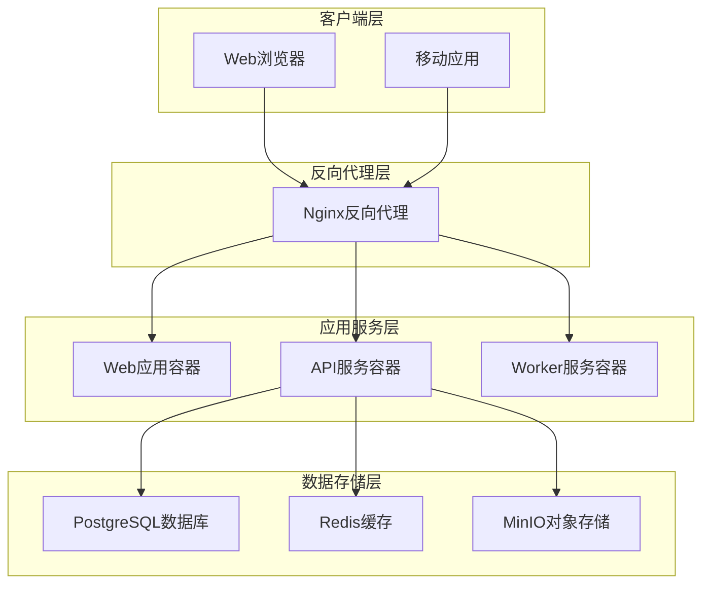
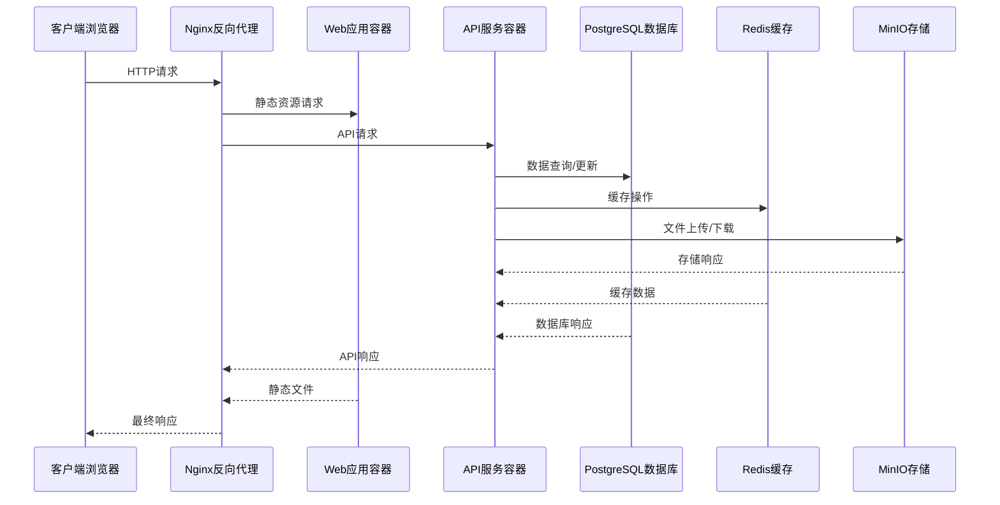
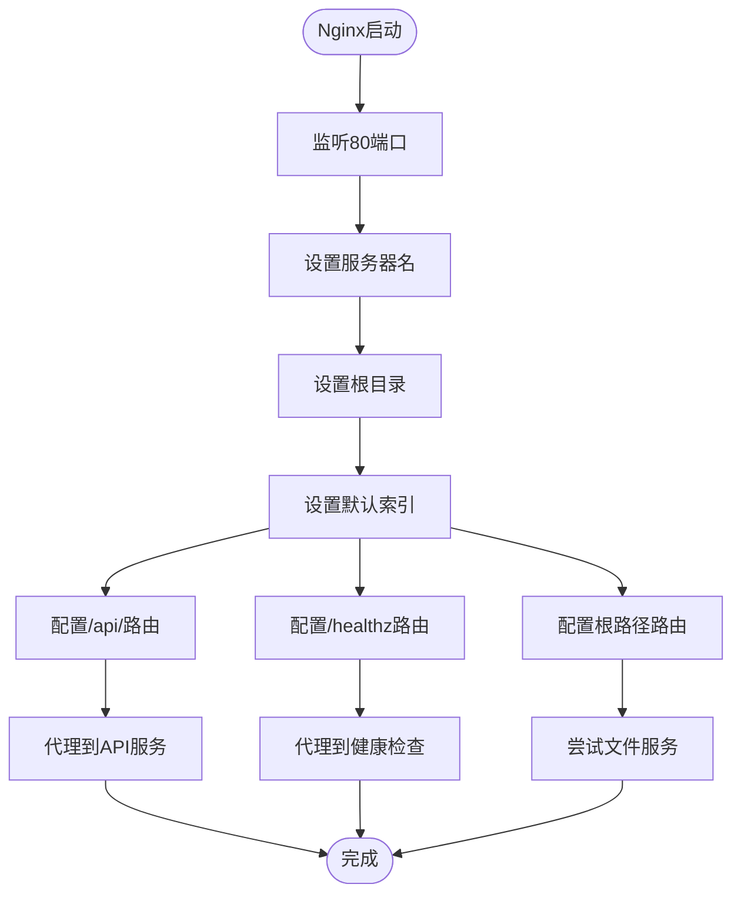
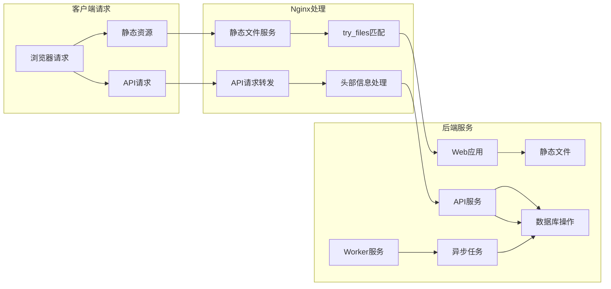
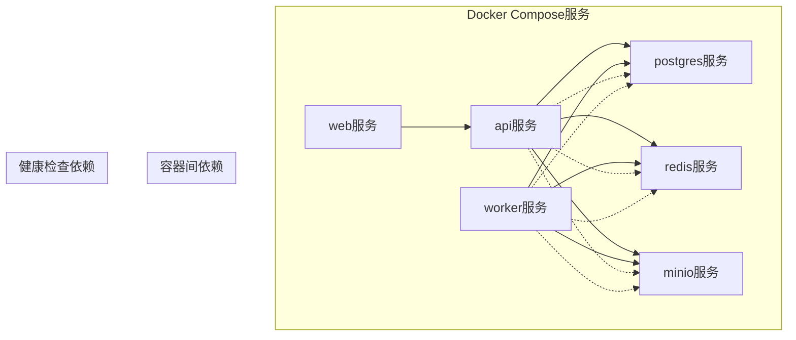
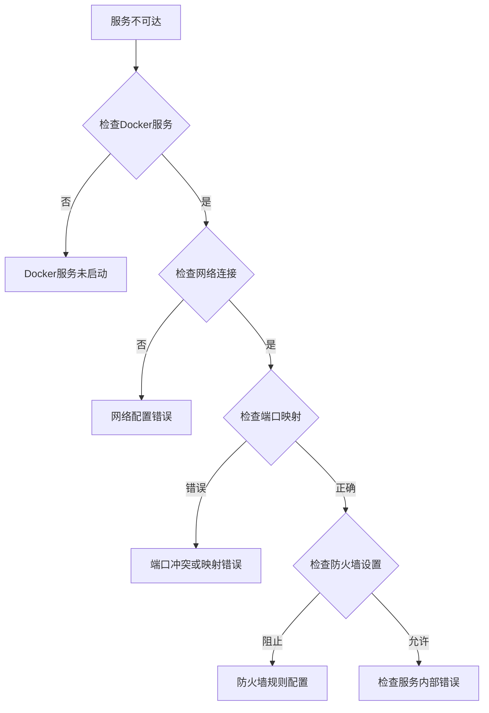
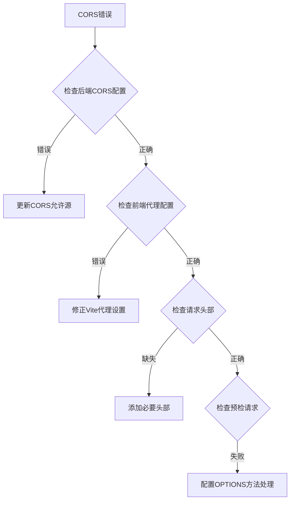

# Nginx反向代理配置

<cite>
**本文档引用的文件**
- [default.conf](file://infra/nginx/default.conf)
- [docker-compose.yml](file://infra/docker-compose.yml)
- [docker-compose.prod.yml](file://infra/docker-compose.prod.yml)
- [Dockerfile](file://apps/web/Dockerfile)
- [main.py](file://apps/api/app/main.py)
- [config.py](file://apps/api/app/core/config.py)
- [vite.config.ts](file://apps/web/vite.config.ts)
</cite>

## 目录
1. [简介](#简介)
2. [项目结构概览](#项目结构概览)
3. [核心组件分析](#核心组件分析)
4. [架构总览](#架构总览)
5. [详细组件分析](#详细组件分析)
6. [依赖关系分析](#依赖关系分析)
7. [性能考虑](#性能考虑)
8. [故障排除指南](#故障排除指南)
9. [结论](#结论)

## 简介

AI摄影教练项目采用现代化的微服务架构，使用Nginx作为反向代理服务器来管理流量分发、静态文件服务和API路由转发。本项目通过Docker容器化部署，实现了前后端分离的架构设计，其中Nginx作为统一入口点，负责将请求路由到相应的后端服务。

该项目的核心特点包括：
- 前端Vue.js应用通过Vite进行开发和构建
- 后端FastAPI服务提供RESTful API接口
- 使用PostgreSQL数据库存储数据
- Redis缓存和MinIO对象存储服务
- Celery任务队列处理异步分析任务

## 项目结构概览

AI摄影教练项目的整体架构采用容器化微服务设计，主要组件包括：

**图表来源**
- [docker-compose.yml:1-107](file://infra/docker-compose.yml#L1-L107)
- [docker-compose.prod.yml:1-128](file://infra/docker-compose.prod.yml#L1-L128)

**章节来源**
- [docker-compose.yml:1-107](file://infra/docker-compose.yml#L1-L107)
- [docker-compose.prod.yml:1-128](file://infra/docker-compose.prod.yml#L1-L128)

## 核心组件分析

### Nginx反向代理配置

Nginx作为项目的统一入口点，负责处理所有外部请求并将其路由到相应的后端服务。当前配置文件提供了基础的反向代理功能，但需要进一步完善以支持生产环境的需求。

#### 上游服务器定义

在当前配置中，Nginx通过Docker网络自动解析服务名称来定位上游服务器：

- **API服务**: `http://api:8000/api/`
- **健康检查**: `http://api:8000/healthz`

这些上游服务器由Docker Compose管理，确保服务发现和负载均衡。

#### 静态文件服务

Nginx被配置为静态文件服务器，根目录指向 `/usr/share/nginx/html`，默认索引文件为 `index.html`。前端构建产物通过Dockerfile复制到这个目录中。

#### API路由转发规则

当前的API路由转发规则相对简单，主要处理 `/api/` 前缀的请求，并保留必要的HTTP头部信息用于后端服务识别真实客户端信息。

**章节来源**
- [default.conf:1-30](file://infra/nginx/default.conf#L1-L30)

### 应用服务架构

#### Web应用容器

Web应用容器基于Nginx官方镜像构建，包含完整的前端构建流程：
- 使用Node.js Alpine镜像进行构建
- 将构建后的静态文件复制到Nginx HTML目录
- 暴露80端口供Nginx代理

#### API服务容器

API服务基于Python 3.12 Slim镜像，使用Uvicorn作为ASGI服务器：
- 暴露8000端口
- 使用FastAPI框架提供RESTful API
- 支持CORS跨域资源共享

#### Worker服务容器

Worker服务专门处理异步任务，如图像分析任务：
- 基于Python 3.12 Slim镜像
- 配置Celery任务队列
- 与Redis进行通信

**章节来源**
- [Dockerfile:1-22](file://apps/web/Dockerfile#L1-L22)
- [Dockerfile:1-23](file://apps/api/Dockerfile#L1-L23)

## 架构总览

AI摄影教练项目的完整架构图展示了各组件之间的交互关系：

**图表来源**
- [docker-compose.yml:50-101](file://infra/docker-compose.yml#L50-L101)
- [docker-compose.prod.yml:60-96](file://infra/docker-compose.prod.yml#L60-L96)

## 详细组件分析

### Nginx配置文件深度分析

当前的Nginx配置文件提供了基础的功能实现，但存在一些改进空间：

#### 服务器块配置

**图表来源**
- [default.conf:1-30](file://infra/nginx/default.conf#L1-L30)

#### API路由转发配置

当前的API路由转发配置相对简单，主要包含以下关键设置：
- HTTP版本支持：1.1
- 关键头部传递：Host、X-Real-IP、X-Forwarded-For、X-Forwarded-Proto
- 目标服务：http://api:8000/api/

#### 健康检查配置

健康检查端点 `/healthz` 被直接代理到API服务，便于容器编排系统监控服务状态。

**章节来源**
- [default.conf:8-24](file://infra/nginx/default.conf#L8-L24)

### CORS配置分析

项目中的CORS配置分布在多个层面：

#### 后端CORS配置

API服务使用FastAPI的CORSMiddleware中间件：
- 允许的源：从环境变量读取的列表
- 允许的方法：所有HTTP方法
- 允许的头部：所有自定义头部
- 允许凭据：启用

#### 前端CORS配置

前端开发环境通过Vite配置代理：
- 开发代理目标：http://localhost:8000
- 代理路径：/api 和 /healthz
- 改变源：启用跨域

**章节来源**
- [main.py:13-19](file://apps/api/app/main.py#L13-L19)
- [config.py:25-38](file://apps/api/app/core/config.py#L25-L38)
- [vite.config.ts:13-22](file://apps/web/vite.config.ts#L13-L22)

### 数据流分析

**图表来源**
- [default.conf:26-28](file://infra/nginx/default.conf#L26-L28)
- [docker-compose.yml:50-77](file://infra/docker-compose.yml#L50-L77)

## 依赖关系分析

### 服务依赖图

**图表来源**
- [docker-compose.yml:70-76](file://infra/docker-compose.yml#L70-L76)
- [docker-compose.prod.yml:78-84](file://infra/docker-compose.prod.yml#L78-L84)

### 环境变量依赖

项目使用多种环境变量来配置不同环境的服务：

#### 开发环境配置
- POSTGRES_IMAGE: postgres:16
- REDIS_IMAGE: redis:7
- MINIO_IMAGE: minio/minio:latest
- PYTHON_IMAGE: python:3.12-slim

#### 生产环境配置
- SERVER_IP: 服务器公网IP地址
- POSTGRES_USER: 数据库用户名
- POSTGRES_PASSWORD: 数据库密码
- POSTGRES_DB: 数据库名称
- S3_ACCESS_KEY: S3访问密钥
- S3_SECRET_KEY: S3秘密密钥
- S3_BUCKET: S3存储桶名称

**章节来源**
- [docker-compose.yml:57-67](file://infra/docker-compose.yml#L57-L67)
- [docker-compose.prod.yml:67](file://infra/docker-compose.prod.yml#L67)

## 性能考虑

### 缓存策略

当前配置中缺少显式的缓存配置，建议添加以下优化：

#### 静态文件缓存
- 设置适当的Cache-Control头部
- 配置ETag支持
- 实现条件请求处理

#### API响应缓存
- 对不频繁变化的数据实施缓存
- 配置合理的缓存过期时间
- 实现缓存失效策略

### 压缩配置

建议启用Gzip压缩以减少传输数据量：
- 启用gzip压缩
- 配置压缩级别
- 选择合适的压缩类型

### 连接池优化

#### 后端连接池
- 配置数据库连接池大小
- 设置连接超时时间
- 实现连接复用机制

#### 反向代理连接池
- 配置上游服务器连接池
- 设置连接超时和重试机制
- 实现健康检查和故障转移

## 故障排除指南

### 常见问题诊断

#### 服务不可达问题

#### CORS相关问题

### 日志配置

建议添加以下日志配置：

#### 访问日志
- 记录所有请求的详细信息
- 包含客户端IP、请求时间、状态码
- 配置日志轮转策略

#### 错误日志
- 记录所有错误和异常
- 包含堆栈跟踪信息
- 配置错误级别过滤

#### 性能日志
- 记录请求处理时间和响应大小
- 监控服务性能指标
- 配置告警阈值

**章节来源**
- [docker-compose.yml:13-17](file://infra/docker-compose.yml#L13-L17)
- [docker-compose.prod.yml:85-95](file://infra/docker-compose.prod.yml#L85-L95)

## 结论

AI摄影教练项目的Nginx反向代理配置展现了现代Web应用的典型架构模式。当前配置提供了基础的功能实现，但在生产环境中还需要进一步完善。

### 主要优势

1. **清晰的架构分离**：前端和后端服务通过Nginx进行统一管理
2. **容器化部署**：使用Docker Compose实现服务编排和依赖管理
3. **CORS支持**：前后端分离架构下的跨域资源共享配置
4. **健康检查**：容器编排系统的服务监控机制

### 改进建议

1. **增强安全性**：添加HTTPS支持、安全头部配置、访问控制规则
2. **性能优化**：实现缓存策略、压缩配置、连接池优化
3. **监控完善**：添加详细的日志配置和性能监控
4. **负载均衡**：配置多实例部署和健康检查机制

### 未来发展方向

随着项目的发展，建议逐步实现以下功能：
- SSL/TLS证书管理和HTTPS配置
- 动态负载均衡和健康检查
- 缓存策略和CDN集成
- 安全头设置和内容安全策略
- 访问控制和身份验证集成

通过持续优化和改进，AI摄影教练项目将能够提供更加稳定、安全和高性能的用户体验。