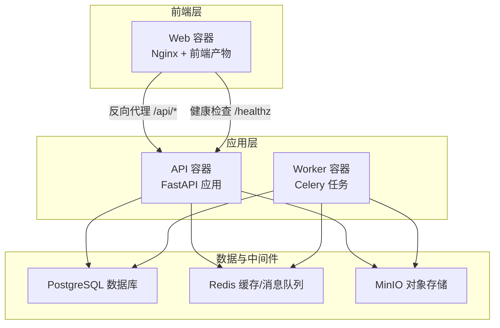
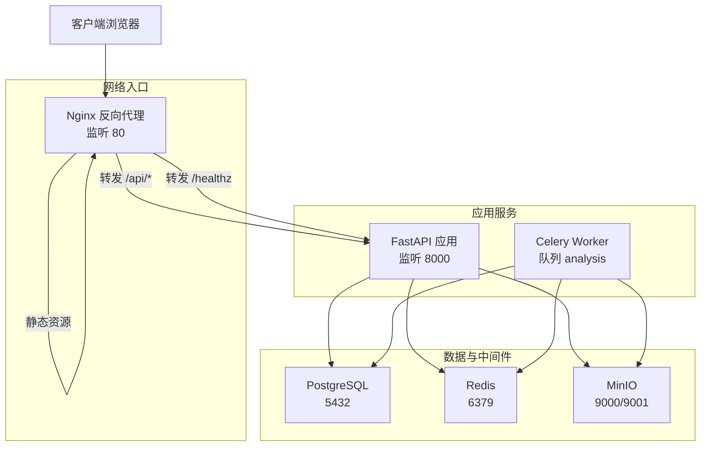
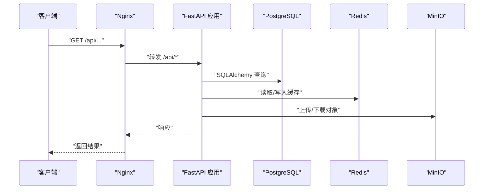
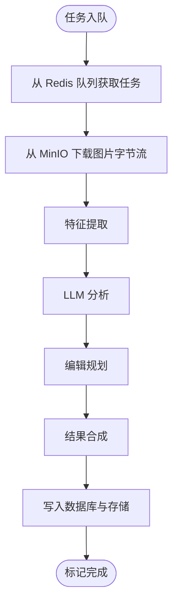
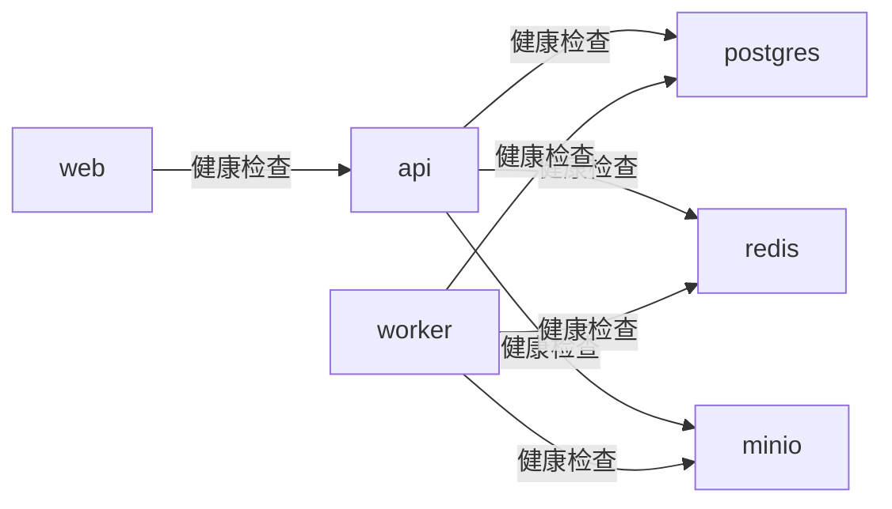

# 生产环境部署

<cite>
**本文引用的文件**
- [docker-compose.prod.yml](file://infra/docker-compose.prod.yml)
- [deploy.sh](file://infra/deploy.sh)
- [default.conf](file://infra/nginx/default.conf)
- [Dockerfile（API）](file://apps/api/Dockerfile)
- [Dockerfile（Web）](file://apps/web/Dockerfile)
- [Dockerfile（Worker）](file://apps/worker/Dockerfile)
- [requirements.txt（API）](file://apps/api/requirements.txt)
- [main.py（API）](file://apps/api/app/main.py)
- [config.py（API 核心配置）](file://apps/api/app/core/config.py)
- [database.py（API 数据库）](file://apps/api/app/core/database.py)
- [celery_app.py（API Celery）](file://apps/api/app/core/celery_app.py)
- [analyze_photo.py（API 分析任务）](file://apps/api/app/tasks/analyze_photo.py)
- [alembic.ini（API 迁移配置）](file://apps/api/alembic.ini)
</cite>

## 目录
1. [简介](#简介)
2. [项目结构](#项目结构)
3. [核心组件](#核心组件)
4. [架构总览](#架构总览)
5. [详细组件分析](#详细组件分析)
6. [依赖关系分析](#依赖关系分析)
7. [性能考虑](#性能考虑)
8. [故障排查指南](#故障排查指南)
9. [结论](#结论)
10. [附录：环境变量与安全最佳实践](#附录环境变量与安全最佳实践)

## 简介
本文件面向生产环境部署，围绕 AI 摄影教练项目的 Docker Compose 编排进行系统化说明。内容涵盖各服务容器的构建参数、环境变量配置、依赖关系、容器间网络通信与健康检查机制，并提供镜像构建优化建议、资源限制设置思路、服务发现与负载均衡配置要点，以及生产环境的安全最佳实践与运维命令示例。

## 项目结构
项目采用多服务分层组织：前端 Web 应用通过 Nginx 提供静态资源与反向代理；后端 API 服务基于 FastAPI；任务队列由 Celery + Redis 实现；数据持久化使用 PostgreSQL；对象存储使用 MinIO；迁移管理由 Alembic 驱动。

图表来源
- [docker-compose.prod.yml:1-128](file://infra/docker-compose.prod.yml#L1-L128)
- [default.conf:1-30](file://infra/nginx/default.conf#L1-L30)
- [Dockerfile（Web）:1-22](file://apps/web/Dockerfile#L1-L22)
- [Dockerfile（API）:1-23](file://apps/api/Dockerfile#L1-L23)
- [Dockerfile（Worker）:1-20](file://apps/worker/Dockerfile#L1-L20)

章节来源
- [docker-compose.prod.yml:1-128](file://infra/docker-compose.prod.yml#L1-L128)
- [default.conf:1-30](file://infra/nginx/default.conf#L1-L30)

## 核心组件
- Web 容器（Nginx + 前端）
  - 构建方式：多阶段构建，先在 Node 基础镜像中打包前端，再复制到 Nginx 镜像运行。
  - 端口暴露：80。
  - 健康检查：对根路径进行探测。
  - 依赖：需等待 API 健康后再启动。
- API 容器（FastAPI）
  - 构建方式：基于可配置的 Python 基础镜像，安装依赖后以 Uvicorn 运行。
  - 端口暴露：8000。
  - 健康检查：访问内部 /healthz 路径。
  - 依赖：PostgreSQL、Redis、MinIO 健康后才启动。
- Worker 容器（Celery）
  - 构建方式：复用 API 依赖清单，以 Celery worker 方式运行指定队列。
  - 依赖：PostgreSQL、Redis、MinIO 健康后才启动。
- PostgreSQL
  - 健康检查：使用 pg_isready。
  - 数据卷：持久化至 pg_data。
- Redis
  - 健康检查：使用 redis-cli ping。
  - 数据卷：持久化至 redis_data。
- MinIO
  - 健康检查：对本地存活接口进行 HTTP 探测。
  - 数据卷：持久化至 minio_data。

章节来源
- [docker-compose.prod.yml:1-128](file://infra/docker-compose.prod.yml#L1-L128)
- [Dockerfile（Web）:1-22](file://apps/web/Dockerfile#L1-L22)
- [Dockerfile（API）:1-23](file://apps/api/Dockerfile#L1-L23)
- [Dockerfile（Worker）:1-20](file://apps/worker/Dockerfile#L1-L20)

## 架构总览
下图展示生产环境的容器编排、网络通信与健康检查策略：

图表来源
- [docker-compose.prod.yml:1-128](file://infra/docker-compose.prod.yml#L1-L128)
- [default.conf:1-30](file://infra/nginx/default.conf#L1-L30)

## 详细组件分析

### Web 组件（Nginx + 前端）
- 构建与运行
  - 多阶段构建：第一阶段使用 Node 打包前端；第二阶段将产物复制到 Nginx 镜像。
  - 环境变量注入：通过构建参数注入 API 基础路径，确保前端请求指向正确的后端路由前缀。
  - 健康检查：对根路径进行探测，便于编排层判断就绪状态。
- 网络与代理
  - 监听 80 端口；将 /api/* 请求转发至 API 容器；将 /healthz 请求转发至 API 的健康检查端点。
  - 对静态资源采用 try_files 回退到 index.html，支持 SPA 路由。
- 依赖关系
  - 依赖 API 健康后启动，避免启动时出现 502/代理失败。

章节来源
- [Dockerfile（Web）:1-22](file://apps/web/Dockerfile#L1-L22)
- [default.conf:1-30](file://infra/nginx/default.conf#L1-L30)
- [docker-compose.prod.yml:2-14](file://infra/docker-compose.prod.yml#L2-L14)

### API 组件（FastAPI）
- 构建与运行
  - 基于可配置的 Python 基础镜像，安装依赖后以 Uvicorn 启动。
  - 暴露 8000 端口，提供 /healthz 健康检查。
- 配置与连接
  - 数据库：通过环境变量拼接连接串，连接到 postgres 容器。
  - 缓存：通过环境变量连接到 redis 容器。
  - 存储：通过环境变量连接到 minio 容器。
  - CORS：从环境变量解析允许的源列表。
- 初始化与迁移
  - 应用启动时执行数据库迁移，确保模式一致。
- 任务队列集成
  - 通过 Celery 配置连接 Redis 作为 Broker/Backend，定义任务路由到 analysis 队列。

图表来源
- [docker-compose.prod.yml:60-96](file://infra/docker-compose.prod.yml#L60-L96)
- [main.py（API）:1-36](file://apps/api/app/main.py#L1-L36)
- [database.py（API 数据库）:1-39](file://apps/api/app/core/database.py#L1-L39)
- [celery_app.py（API Celery）:1-21](file://apps/api/app/core/celery_app.py#L1-L21)

章节来源
- [Dockerfile（API）:1-23](file://apps/api/Dockerfile#L1-L23)
- [docker-compose.prod.yml:60-96](file://infra/docker-compose.prod.yml#L60-L96)
- [main.py（API）:1-36](file://apps/api/app/main.py#L1-L36)
- [database.py（API 数据库）:1-39](file://apps/api/app/core/database.py#L1-L39)
- [celery_app.py（API Celery）:1-21](file://apps/api/app/core/celery_app.py#L1-L21)

### Worker 组件（Celery）
- 构建与运行
  - 复用 API 依赖清单，以 Celery worker 方式运行，绑定 analysis 队列。
- 运行逻辑
  - 从 Redis 获取任务，执行图片分析流程，更新数据库状态与结果，最终写入存储。
- 依赖关系
  - 依赖 PostgreSQL、Redis、MinIO 健康后启动。

图表来源
- [docker-compose.prod.yml:98-122](file://infra/docker-compose.prod.yml#L98-L122)
- [analyze_photo.py（API 分析任务）:1-108](file://apps/api/app/tasks/analyze_photo.py#L1-L108)

章节来源
- [Dockerfile（Worker）:1-20](file://apps/worker/Dockerfile#L1-L20)
- [docker-compose.prod.yml:98-122](file://infra/docker-compose.prod.yml#L98-L122)
- [analyze_photo.py（API 分析任务）:1-108](file://apps/api/app/tasks/analyze_photo.py#L1-L108)

### 数据库与迁移（PostgreSQL + Alembic）
- 连接与初始化
  - API 在启动事件中调用迁移工具，确保数据库模式与版本一致。
  - 迁移配置文件位于应用根目录，脚本位置与版本目录按约定配置。
- 健康检查
  - 使用 pg_isready 进行周期性探测，确保数据库可用。

章节来源
- [database.py（API 数据库）:1-39](file://apps/api/app/core/database.py#L1-L39)
- [alembic.ini（API 迁移配置）:1-147](file://apps/api/alembic.ini#L1-L147)
- [docker-compose.prod.yml:16-30](file://infra/docker-compose.prod.yml#L16-L30)

### 缓存与任务队列（Redis + Celery）
- 连接与配置
  - API 与 Worker 共享 Redis 作为 Broker 与 Backend。
  - 任务路由将分析类任务定向到 analysis 队列。
- 健康检查
  - 使用 redis-cli ping 进行探测。

章节来源
- [celery_app.py（API Celery）:1-21](file://apps/api/app/core/celery_app.py#L1-L21)
- [docker-compose.prod.yml:32-42](file://infra/docker-compose.prod.yml#L32-L42)

### 对象存储（MinIO）
- 连接与配置
  - API 与 Worker 通过环境变量配置 Endpoint、AccessKey、SecretKey、Bucket、Region。
- 健康检查
  - 通过 HTTP 探测本地存活接口。

章节来源
- [docker-compose.prod.yml:44-58](file://infra/docker-compose.prod.yml#L44-L58)

## 依赖关系分析
- 服务启动顺序
  - Web 依赖 API 健康后启动。
  - API/Worker 依赖 PostgreSQL、Redis、MinIO 健康后启动。
- 网络通信
  - Web 通过 Nginx 将 /api/* 转发到 API。
  - API/Worker 通过服务名直接访问数据库、缓存与存储。
- 健康检查
  - PostgreSQL、Redis、MinIO、API、Web 均配置了健康检查，便于编排层自动恢复与状态监控。

图表来源
- [docker-compose.prod.yml:11-14](file://infra/docker-compose.prod.yml#L11-L14)
- [docker-compose.prod.yml:78-84](file://infra/docker-compose.prod.yml#L78-L84)
- [docker-compose.prod.yml:115-121](file://infra/docker-compose.prod.yml#L115-L121)

章节来源
- [docker-compose.prod.yml:1-128](file://infra/docker-compose.prod.yml#L1-L128)

## 性能考虑
- 镜像构建优化
  - 使用多阶段构建减少最终镜像体积；仅在构建阶段安装依赖，运行阶段保持最小化。
  - 前端构建阶段固定 Node 版本，确保可重复构建。
- 运行时优化
  - API 使用 Uvicorn 标准变体，适合生产部署；可结合 gunicorn + uvicorn worker 的组合提升并发能力（需额外配置）。
  - Worker 通过队列隔离与并发数控制，避免阻塞其他任务。
- 资源限制建议
  - 为 API/Worker 设置 CPU/内存限制与重启策略，结合健康检查实现自愈。
  - 为数据库与缓存设置独立资源配额，避免互相影响。
- 存储与网络
  - MinIO 与 PostgreSQL 使用持久卷，确保数据不丢失。
  - Nginx 作为反向代理，建议开启 gzip/缓存等优化（可在 Nginx 配置中扩展）。

## 故障排查指南
- 常见问题定位
  - Web 无法访问：检查 Nginx 健康检查与 /healthz 是否可达；确认 API 已健康。
  - API 500/数据库错误：查看 API 日志；确认数据库迁移是否成功。
  - Worker 无任务执行：检查 Redis 连接、队列名称与任务注册；确认任务已入队。
- 关键命令
  - 查看服务状态与日志：使用部署脚本提供的 docker compose 命令查看状态与尾部日志。
  - 迁移验证：在 API 容器内执行迁移命令，确保版本一致。
- 建议
  - 为每个服务配置独立日志输出与轮转策略。
  - 在 CI 中加入健康检查与端到端测试，防止部署回滚。

章节来源
- [deploy.sh:1-63](file://infra/deploy.sh#L1-L63)
- [docker-compose.prod.yml:85-96](file://infra/docker-compose.prod.yml#L85-L96)

## 结论
本部署方案通过 Docker Compose 将前端、API、Worker、数据库、缓存与对象存储整合为统一编排，借助健康检查与启动顺序保障系统稳定性。配合合理的镜像构建与资源限制，可满足生产环境的可用性与可维护性要求。建议在上线前完成环境变量校验、密钥轮换与网络隔离加固，并持续监控关键指标与日志。

## 附录：环境变量与安全最佳实践

### 环境变量清单与用途
- 服务器与网络
  - SERVER_IP：用于生成 CORS 允许源与对外访问地址。
- 数据库
  - POSTGRES_USER：数据库用户名。
  - POSTGRES_PASSWORD：数据库密码。
  - POSTGRES_DB：数据库名称。
- 缓存
  - REDIS_IMAGE：Redis 镜像版本（可选）。
- 对象存储
  - S3_ACCESS_KEY：访问密钥。
  - S3_SECRET_KEY：私有密钥。
  - S3_BUCKET：存储桶名称。
  - S3_REGION：区域，默认 us-east-1。
  - MINIO_IMAGE：MinIO 镜像版本（可选）。
- 应用与模型
  - PYTHON_IMAGE：Python 基础镜像版本（可选）。
  - MODEL_NAME：模型名称（可选）。
  - PROMPT_VERSION：提示词版本（可选）。
- API 配置
  - CORS_ORIGINS：CORS 允许源，由 SERVER_IP 动态拼装。

章节来源
- [docker-compose.prod.yml:16-77](file://infra/docker-compose.prod.yml#L16-L77)
- [config.py（API 核心配置）:1-47](file://apps/api/app/core/config.py#L1-L47)

### 安全最佳实践
- 密钥管理
  - 使用只读密钥与最小权限策略；定期轮换 S3 与数据库凭据。
- 网络隔离
  - 将数据库与缓存置于内部网络；仅开放必要端口；启用 TLS（如需）。
- 配置注入
  - 通过环境文件注入敏感信息；避免硬编码在镜像或配置中。
- 访问控制
  - 限制 CORS 源范围；启用 HTTPS 与安全头（可在 Nginx 层配置）。
- 审计与监控
  - 开启数据库与对象存储审计日志；集中收集容器日志并设置告警阈值。

### 部署脚本与命令
- 部署命令
  - 使用部署脚本加载生产环境变量文件并启动编排栈。
- 常用运维命令
  - 查看服务状态与日志；查看预期访问地址与健康检查端点。

章节来源
- [deploy.sh:1-63](file://infra/deploy.sh#L1-L63)