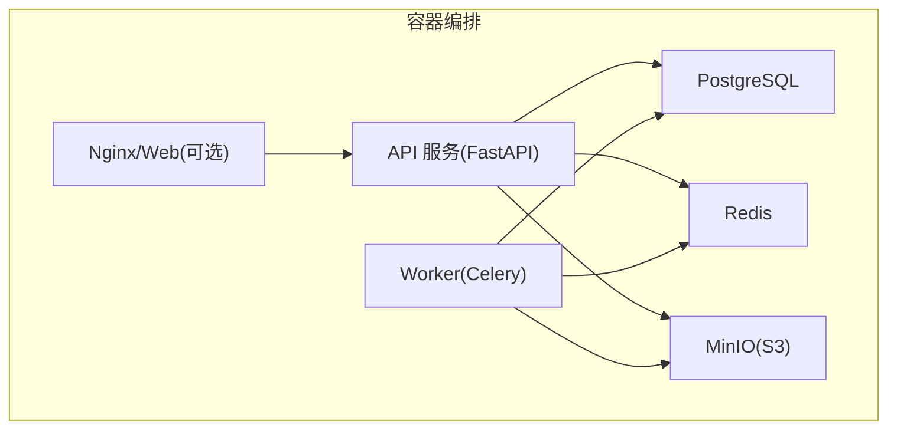
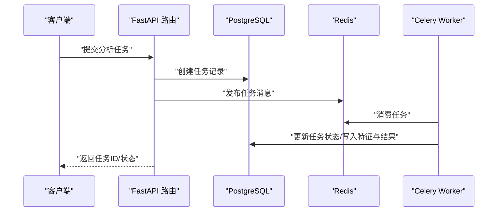
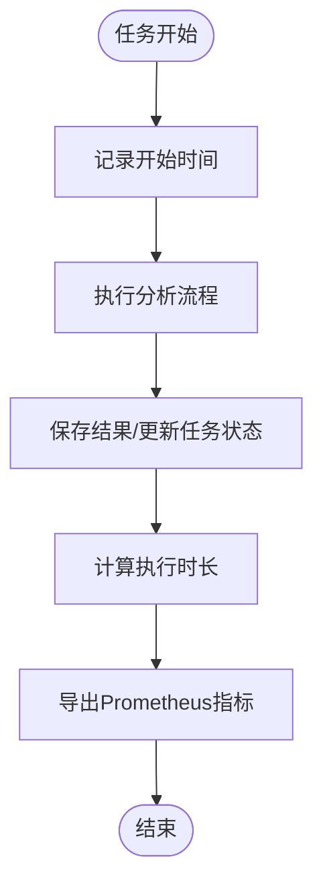
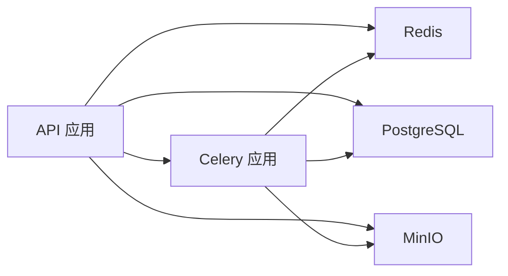

# 监控和日志系统

<cite>
**本文档引用的文件**
- [apps/api/app/main.py](file://apps/api/app/main.py)
- [apps/api/app/core/logging.py](file://apps/api/app/core/logging.py)
- [apps/api/app/middleware/logging.py](file://apps/api/app/middleware/logging.py)
- [apps/api/app/core/request_id.py](file://apps/api/app/core/request_id.py)
- [apps/api/app/core/celery_app.py](file://apps/api/app/core/celery_app.py)
- [apps/api/app/core/config.py](file://apps/api/app/core/config.py)
- [apps/api/app/core/database.py](file://apps/api/app/core/database.py)
- [apps/api/app/tasks/analyze_photo.py](file://apps/api/app/tasks/analyze_photo.py)
- [apps/api/app/modules/analysis/router.py](file://apps/api/app/modules/analysis/router.py)
- [apps/api/app/modules/auth/router.py](file://apps/api/app/modules/auth/router.py)
- [apps/api/app/modules/auth/service.py](file://apps/api/app/modules/auth/service.py)
- [apps/api/requirements.txt](file://apps/api/requirements.txt)
- [infra/docker-compose.yml](file://infra/docker-compose.yml)
- [infra/docker-compose.prod.yml](file://infra/docker-compose.prod.yml)
</cite>

## 更新摘要
**所做更改**
- 新增完整的结构化日志系统章节，涵盖JSON格式日志、请求ID跟踪、HTTP请求中间件
- 更新Celery任务日志集成功能描述，包括任务执行时长和队列长度监控
- 增强日志聚合与分析配置，包括统一的日志格式和轮转策略
- 补充Prometheus指标暴露和Grafana仪表板配置建议
- 完善告警规则设置和通知机制配置

## 目录
1. [简介](#简介)
2. [项目结构](#项目结构)
3. [核心组件](#核心组件)
4. [架构总览](#架构总览)
5. [详细组件分析](#详细组件分析)
6. [依赖分析](#依赖分析)
7. [性能考虑](#性能考虑)
8. [故障排查指南](#故障排查指南)
9. [结论](#结论)
10. [附录](#附录)

## 简介
本文件面向"AI摄影教练"项目的监控与日志体系，目标是：
- 明确应用层指标采集范围：API响应时间、错误率、吞吐量统计
- 设计Celery任务队列监控方案：任务执行时延与队列长度
- 规划日志聚合与分析：结构化日志格式与日志轮转策略
- 提供Prometheus指标暴露与Grafana仪表板配置建议
- 给出告警规则与通知机制配置思路
- 说明性能基准测试与容量规划方法

项目现已实现完整的结构化日志系统，包括JSON格式日志、请求ID跟踪、HTTP请求中间件、Celery任务日志集成等重大功能增强。

## 项目结构
项目采用多服务容器编排，核心服务包括：
- API服务：FastAPI应用，提供REST接口与健康检查
- Worker服务：Celery消费者，处理图像分析任务
- 数据与存储：PostgreSQL（数据库）、Redis（消息中间件/结果后端）、MinIO（对象存储）

**图表来源**
- [infra/docker-compose.yml:50-101](file://infra/docker-compose.yml#L50-L101)
- [infra/docker-compose.prod.yml:60-122](file://infra/docker-compose.prod.yml#L60-L122)

**章节来源**
- [infra/docker-compose.yml:1-107](file://infra/docker-compose.yml#L1-L107)
- [infra/docker-compose.prod.yml:1-128](file://infra/docker-compose.prod.yml#L1-L128)

## 核心组件
- 应用入口与健康检查：FastAPI应用在启动时初始化数据库，并提供健康检查端点
- Celery任务：定义任务路由与队列，任务执行状态跟踪
- 数据访问：SQLAlchemy引擎与会话管理，迁移初始化
- 分析流程：分析任务提交、执行、结果落库与回传
- **新增** 结构化日志系统：基于Python标准logging的JSON格式日志，支持请求ID跟踪和全链路追踪

**章节来源**
- [apps/api/app/main.py:27-35](file://apps/api/app/main.py#L27-L35)
- [apps/api/app/core/celery_app.py:5-19](file://apps/api/app/core/celery_app.py#L5-L19)
- [apps/api/app/core/database.py:12-39](file://apps/api/app/core/database.py#L12-L39)
- [apps/api/app/tasks/analyze_photo.py:19-108](file://apps/api/app/tasks/analyze_photo.py#L19-L108)

## 架构总览
下图展示API与Worker之间的交互，以及外部依赖：

**图表来源**
- [apps/api/app/modules/analysis/router.py:45-74](file://apps/api/app/modules/analysis/router.py#L45-L74)
- [apps/api/app/tasks/analyze_photo.py:19-108](file://apps/api/app/tasks/analyze_photo.py#L19-L108)
- [apps/api/app/core/celery_app.py:5-19](file://apps/api/app/core/celery_app.py#L5-L19)

## 详细组件分析

### 结构化日志系统

#### JSON格式日志实现
项目实现了完整的结构化日志系统，基于Python标准logging模块和JSON格式化器：

- **JSONFormatter类**：将日志记录格式化为一行JSON，自动附加request_id并支持自定义字段
- **HumanReadableFormatter类**：开发环境友好的控制台格式
- **RequestIDFilter类**：将request_id注入到LogRecord，供Formatter使用

#### 请求ID跟踪机制
- **ContextVar实现**：基于contextvars的线程安全上下文管理
- **generate_request_id函数**：生成唯一请求ID，格式为req-xxxxxxxxxxxx（12位随机字符）
- **set_request_id/get_request_id函数**：设置和获取当前上下文的request_id

#### HTTP请求中间件
RequestLoggingMiddleware中间件记录每个HTTP请求的摘要信息：
- 自动注入request_id到contextvars
- 记录method、path、status_code、duration_ms
- 不记录request body和敏感header（Authorization、Cookie等）

#### Celery任务日志集成
- **任务参数传递**：run_analysis_task接收request_id参数
- **上下文恢复**：set_request_id恢复请求上下文
- **详细日志记录**：每个处理阶段都记录详细的执行信息和时长

**章节来源**
- [apps/api/app/core/logging.py:1-163](file://apps/api/app/core/logging.py#L1-L163)
- [apps/api/app/middleware/logging.py:1-63](file://apps/api/app/middleware/logging.py#L1-L63)
- [apps/api/app/core/request_id.py:1-32](file://apps/api/app/core/request_id.py#L1-L32)
- [apps/api/app/tasks/analyze_photo.py:24-200](file://apps/api/app/tasks/analyze_photo.py#L24-L200)

### API层监控指标设计
- 指标类型
  - 响应时间：按路径、HTTP方法、状态码分组
  - 错误率：按路径、错误类型（异常类名）分组
  - 吞吐量：每秒请求数（RPS），按路径与方法聚合
- 实现建议
  - 在FastAPI中使用中间件或拦截器，对每个请求进行计时、计数与错误分类
  - 将指标以Prometheus文本格式导出，供Prometheus抓取
  - 为关键业务路径（如分析任务提交、历史查询）单独打标签，便于细化分析
- 关键数据源
  - 路由定义与请求处理逻辑
  - 健康检查端点用于存活探测

**章节来源**
- [apps/api/app/main.py:27-35](file://apps/api/app/main.py#L27-L35)
- [apps/api/app/modules/analysis/router.py:45-151](file://apps/api/app/modules/analysis/router.py#L45-L151)

### Celery任务队列监控
- 任务执行时延
  - 利用任务开始时间与完成时间计算执行时长；任务状态跟踪已在配置中启用
  - 可通过Redis后端读取任务元数据，或在任务内部记录开始/结束时间戳
- 队列长度
  - 通过Redis键空间统计各队列的消息数量
  - 监控队列积压，结合任务耗时评估处理能力
- 配置要点
  - 已启用任务状态跟踪与队列路由，建议补充任务结果后端与周期性统计

**图表来源**
- [apps/api/app/core/celery_app.py:12-19](file://apps/api/app/core/celery_app.py#L12-L19)
- [apps/api/app/tasks/analyze_photo.py:19-108](file://apps/api/app/tasks/analyze_photo.py#L19-L108)

**章节来源**
- [apps/api/app/core/celery_app.py:12-19](file://apps/api/app/core/celery_app.py#L12-L19)
- [apps/api/app/tasks/analyze_photo.py:19-108](file://apps/api/app/tasks/analyze_photo.py#L19-L108)

### 日志聚合与分析
- 结构化日志格式
  - 字段建议：timestamp、level、service、module、function、message、trace_id、span_id、request_id、path、method、status_code、duration_ms、error_code、error_msg
  - JSON序列化输出，便于日志系统解析与检索
- 日志轮转策略
  - 基于大小轮转与时间轮转相结合
  - 保留最近N份备份，压缩旧日志
- 开发与生产差异
  - 开发环境可输出到标准输出，配合容器日志驱动
  - 生产环境建议集中输出至日志收集系统（如Fluent Bit/Vector → Elasticsearch/OpenSearch/ClickHouse）

**章节来源**
- [apps/api/app/modules/auth/router.py:19](file://apps/api/app/modules/auth/router.py#L19)
- [apps/api/app/modules/auth/service.py:17](file://apps/api/app/modules/auth/service.py#L17)

### Prometheus指标暴露与Grafana仪表板
- 指标导出
  - 在API中间件中埋点，导出直方图/计数器/摘要指标
  - 在Worker中埋点，导出任务执行时延分布与队列长度
- Grafana仪表板建议
  - API侧：请求速率、P95/P99响应时间、错误率、路径级热力图
  - Worker侧：任务执行时延分布、队列长度趋势、失败率、重试次数
  - 综合面板：数据库连接池使用率、Redis内存与连接数、S3上传/下载延迟

**章节来源**
- [apps/api/app/main.py:27-35](file://apps/api/app/main.py#L27-L35)
- [apps/api/app/core/celery_app.py:12-19](file://apps/api/app/core/celery_app.py#L12-L19)

### 告警规则与通知机制
- 告警规则示例
  - API：错误率>5%（5分钟窗口）、P95响应时间>2s、RPS下降>30%
  - Worker：队列积压>100、任务失败率>2%、单任务执行超时>60s
- 通知渠道
  - 邮件、Slack、Webhook等
  - 建议分级告警：Warn/Alert/Critical

**章节来源**
- [apps/api/app/modules/analysis/router.py:45-151](file://apps/api/app/modules/analysis/router.py#L45-L151)
- [apps/api/app/tasks/analyze_photo.py:97-107](file://apps/api/app/tasks/analyze_photo.py#L97-L107)

### 性能基准测试与容量规划
- 基准测试
  - 使用工具：wrk、k6、JMeter
  - 场景：并发用户数从10→100→500，逐步增加；重点测试分析任务提交与历史查询
  - 指标：RPS、P50/P95/P99响应时间、错误率、CPU/内存/磁盘IO
- 容量规划
  - 依据峰值QPS与P99响应时间，估算API与Worker实例数量
  - 评估数据库连接池上限、Redis内存与持久化策略、S3带宽与对象数量

**章节来源**
- [apps/api/app/modules/analysis/router.py:92-125](file://apps/api/app/modules/analysis/router.py#L92-L125)
- [apps/api/app/tasks/analyze_photo.py:19-108](file://apps/api/app/tasks/analyze_photo.py#L19-L108)

## 依赖分析
- 外部依赖
  - FastAPI、Celery、Redis、PostgreSQL、MinIO
- 内部耦合
  - API路由依赖任务模块；任务模块依赖数据库与存储服务；配置集中管理

**图表来源**
- [apps/api/app/core/celery_app.py:5-19](file://apps/api/app/core/celery_app.py#L5-L19)
- [apps/api/app/core/config.py:13-20](file://apps/api/app/core/config.py#L13-L20)
- [apps/api/requirements.txt:1-19](file://apps/api/requirements.txt#L1-L19)

**章节来源**
- [apps/api/app/core/config.py:13-20](file://apps/api/app/core/config.py#L13-L20)
- [apps/api/requirements.txt:1-19](file://apps/api/requirements.txt#L1-L19)

## 性能考虑
- 数据库
  - 使用连接池与预检，避免慢查询；对高频查询建立索引
- 缓存与队列
  - Redis作为消息中间件与结果缓存，注意内存与持久化策略
- 存储
  - MinIO对象存储的并发与带宽限制，建议分桶与CDN加速
- API与Worker
  - 合理拆分任务，避免单任务过长；利用队列分流不同优先级

**章节来源**
- [apps/api/app/core/database.py:12-13](file://apps/api/app/core/database.py#L12-L13)
- [apps/api/app/core/celery_app.py:12-19](file://apps/api/app/core/celery_app.py#L12-L19)

## 故障排查指南
- 健康检查
  - 使用健康检查端点确认API可用性
- 任务失败
  - 查看任务状态与错误信息字段，定位具体环节（特征提取、LLM分析、编辑规划、结果合成）
- 数据一致性
  - 核对任务状态与结果记录是否一致，必要时重试
- **新增** 日志排查
  - 使用request_id进行全链路追踪
  - 检查结构化日志中的详细执行信息和时长统计

**章节来源**
- [apps/api/app/main.py:32-34](file://apps/api/app/main.py#L32-L34)
- [apps/api/app/tasks/analyze_photo.py:97-107](file://apps/api/app/tasks/analyze_photo.py#L97-L107)

## 结论
本项目具备良好的监控与日志扩展基础：API与Celery任务分离、明确的依赖注入与配置中心、容器化部署。现已实现完整的结构化日志系统，包括JSON格式日志、请求ID跟踪、HTTP请求中间件、Celery任务日志集成等重大功能增强。建议按以下步骤推进：
- 在API与Worker中埋点并导出Prometheus指标
- 引入结构化日志与集中式日志收集
- 建立Grafana仪表板与告警规则
- 基于基准测试制定容量规划

## 附录
- 健康检查端点：/healthz
- 关键环境变量：DB_URL、REDIS_URL、S3_*、MODEL_NAME、PROMPT_VERSION、LOG_LEVEL、LOG_LEVEL_SERVICES
- 任务队列：analysis
- **新增** 日志配置：结构化JSON日志、请求ID跟踪、HTTP请求中间件

**章节来源**
- [apps/api/app/main.py:32-34](file://apps/api/app/main.py#L32-L34)
- [apps/api/app/core/config.py:13-28](file://apps/api/app/core/config.py#L13-L28)
- [apps/api/app/core/celery_app.py:16-18](file://apps/api/app/core/celery_app.py#L16-L18)
- [apps/api/app/core/logging.py:81-150](file://apps/api/app/core/logging.py#L81-L150)